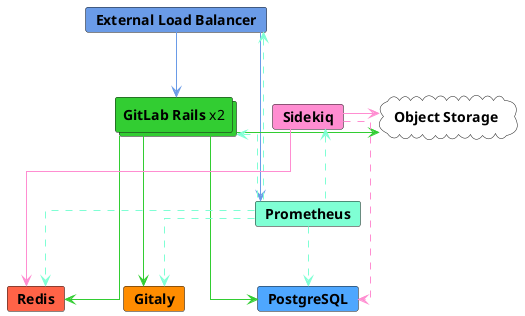
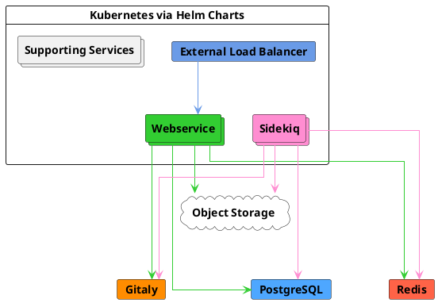



- 티어:  Free, Premium, Ultimate
- 제공 서비스: GitLab Self-Managed



이 페이지에서는 초당 40개의 요청(RPS)이라는 피크 로드를 목표로 설계된 GitLab 참조 아키텍처를 설명합니다. 이는 실제 데이터를 기반으로 수동 및 자동화된 최대 2,000명의 사용자라는 일반적인 피크 로드입니다.

참조 아키텍처의 전체 목록을 보려면 [사용 가능한 참조 아키텍처](_index.md#available-reference-architectures)를 참조하세요.

- **Target Load**:  API:  40 RPS, 웹:  4 RPS, Git(풀):  4 RPS, Git(푸시):  1 RPS
- **High Availability**:  아니요. 고가용성 환경의 경우 수정된 [3K 또는 60 RPS 참조 아키텍처](3k_users.md#supported-modifications-for-lower-user-counts-ha)를 따를 수 있습니다.
- **Cloud Native Hybrid**:  [예](#cloud-native-hybrid-reference-architecture-with-helm-charts-alternative)
- **Unsure which Reference Architecture to use**? [자세한 내용을 보려면 이 가이드로 이동하세요](_index.md#deciding-which-architecture-to-start-with).

| 서비스                            | 노드 | 구성          | GCP 예<sup>1</sup> | AWS 예<sup>1</sup> | Azure 예<sup>1</sup> |
|------------------------------------|-------|------------------------|-----------------|--------------|----------|
| 외부 로드 밸런서<sup>4</sup> | 1     | 4 vCPU, 3.6GB 메모리  | `n1-highcpu-4`  | `c5n.xlarge` | `F4s v2` |
| PostgreSQL<sup>2</sup>             | 1     | 2 vCPU, 7.5GB 메모리  | `n1-standard-2` | `m5.large`   | `D2s v3` |
| Redis<sup>3</sup>                  | 1     | 1 vCPU, 3.75GB 메모리 | `n1-standard-1` | `m5.large`   | `D2s v3` |
| Gitaly<sup>6</sup>                 | 1     | 4 vCPU, 15GB 메모리   | `n1-standard-4` | `m5.xlarge` | `D4s v3` |
| Sidekiq<sup>7</sup>                | 1     | 4 vCPU, 15GB 메모리   | `n1-standard-4` | `m5.xlarge`  | `D4s v3` |
| GitLab Rails<sup>7</sup>           | 2     | 8 vCPU, 7.2GB 메모리  | `n1-highcpu-8`  | `c5.2xlarge` | `F8s v2` |
| 모니터링 노드                    | 1     | 2 vCPU, 1.8GB 메모리  | `n1-highcpu-2`  | `c5.large`   | `F2s v2` |
| 객체 저장소<sup>5</sup>         | -     | -                      | -               | -            | -        |

**각주**:

<!-- Disable ordered list rule <https://github.com/DavidAnson/markdownlint/blob/main/doc/Rules.md#md029---ordered-list-item-prefix> -->
<!-- markdownlint-disable MD029 -->
1. 머신 유형 예시는 설명을 위해 제공됩니다. 이러한 유형은 [검증 및 테스트](_index.md#validation-and-test-results)에 사용되지만 규범적 기본값으로 의도되지 않습니다. 나열된 요구 사항을 충족하는 다른 머신 유형으로 전환이 지원되며, 사용 가능한 경우 ARM 변형도 포함됩니다. 자세한 내용은 [지원되는 머신 유형](_index.md#supported-machine-types)을 참조하세요.
2. 평판이 좋은 타사 외부 PaaS PostgreSQL 솔루션에서 선택적으로 실행할 수 있습니다. 자세한 내용은 [자신의 PostgreSQL 인스턴스 제공](#provide-your-own-postgresql-instance) 및 [권장 클라우드 공급자 및 서비스](_index.md#recommended-cloud-providers-and-services)를 참조하세요.
3. 평판이 좋은 타사 외부 PaaS Redis 솔루션에서 선택적으로 실행할 수 있습니다. 자세한 내용은 [자신의 Redis 인스턴스 제공](#provide-your-own-redis-instance) 및 [권장 클라우드 공급자 및 서비스](_index.md#recommended-cloud-providers-and-services)를 참조하세요.
4. 평판이 좋은 타사 로드 밸런서 또는 서비스(LB PaaS)로 실행하는 것이 권장됩니다. 크기 조정은 선택된 로드 밸런서 및 네트워크 대역폭과 같은 추가 요소에 따라 달라집니다. 자세한 내용은 [로드 밸런서](_index.md#load-balancers)를 참조하세요.
5. 평판이 좋은 클라우드 공급자 또는 자체 관리 솔루션에서 실행해야 합니다. 자세한 내용은 [객체 저장소 구성](#configure-the-object-storage)을 참조하세요.
6. Gitaly 사양은 정상 상태의 일반 크기 리포지토리 사용을 기반으로 합니다. 그러나 대형 모노레포(수 GB보다 큼)가 있으면 이것이 Git 및 Gitaly 성능에 **significantly** 영향을 미칠 수 있으며 사양 증가가 필요할 가능성이 높습니다. 자세한 내용은 [대형 모노레포](_index.md#large-monorepos)를 참조하세요.
7. 구성 요소가 [상태 저장 데이터](_index.md#autoscaling-of-stateful-nodes)를 저장하지 않으므로 Auto Scaling Groups(ASG)에 배치할 수 있습니다. 그러나 [클라우드 네이티브 하이브리드 설정](#cloud-native-hybrid-reference-architecture-with-helm-charts-alternative) 이 일반적으로 선호되는데, 이는 [마이그레이션](#gitlab-rails-post-configuration) 및 [Mailroom](../incoming_email.md)과 같은 특정 구성 요소가 한 노드에서만 실행될 수 있기 때문이며, 이는 Kubernetes에서 더 잘 처리됩니다.
<!-- markdownlint-enable MD029 -->

> [!note]
> 모든 인스턴스 구성과 관련된 PaaS 솔루션의 경우 필요시 복원력을 위해 여러 가용성 영역에 배포하는 것이 권장됩니다.



## 요구 사항 {#requirements}

계속하기 전에 참조 아키텍처의 [요구 사항](_index.md#requirements)을 검토하세요.

## 테스트 방법 {#testing-methodology}

40 RPS / 2k 사용자 참조 아키텍처는 대부분의 일반적인 워크플로우를 수용하도록 설계되었습니다. GitLab은 다음 엔드포인트 처리량 목표에 대해 정기적으로 스모크 및 성능 테스트를 수행합니다:

| 엔드포인트 유형 | 대상 처리량 |
| ------------- | ----------------- |
| API           | 40 RPS            |
| 웹           | 4 RPS             |
| Git(풀)    | 4 RPS             |
| Git(푸시)    | 1 RPS             |

이러한 목표는 CI 파이프라인 및 기타 워크로드를 포함하여 지정된 사용자 수에 대한 총 환경 로드를 반영하는 실제 고객 데이터를 기반으로 합니다. 이는 일반적인 워크로드 구성을 나타냅니다. 비정상적인 워크로드 패턴에 대한 지침은 [RPS 구성 이해](sizing.md#understanding-rps-composition-and-workload-patterns)를 참조하세요.

테스트 방법에 대한 자세한 내용은 [검증 및 테스트 결과](_index.md#validation-and-test-results) 섹션을 참조하세요.

### 성능 고려 사항 {#performance-considerations}

환경에 다음이 있는 경우 추가 조정이 필요할 수 있습니다:

- 나열된 대상보다 일관되게 높은 처리량
- [대형 모노레포](_index.md#large-monorepos)
- 상당한 [추가 워크로드](_index.md#additional-workloads)

이러한 경우 자세한 내용은 [환경 확장](_index.md#scaling-an-environment)을 참조하세요. 이러한 고려 사항이 자신에게 적용될 수 있다고 생각되면 필요에 따라 추가 지침을 문의하세요.

### 로드 밸런서 구성 {#load-balancer-configuration}

테스트 환경에서는 다음을 사용합니다:

- Linux 패키지 환경을 위한 HAProxy
- 클라우드 네이티브 하이브리드를 위한 Gateway API 또는 Ingress 구현이 있는 클라우드 공급자 동등 버전

## 구성 요소 설정 {#set-up-components}

GitLab 및 구성 요소를 최대 40 RPS 또는 2,000명의 사용자를 수용하도록 설정하려면:

1. [외부 로드 밸런싱 노드 구성](#configure-the-external-load-balancer)은 GitLab 애플리케이션 서비스 노드의 로드 밸런싱을 처리합니다.
1. GitLab의 데이터베이스인 [PostgreSQL 구성](#configure-postgresql).
1. 세션 데이터, 임시 캐시 정보 및 백그라운드 작업 큐를 저장하는 [Redis 구성](#configure-redis).
1. Git 리포지토리에 대한 액세스를 제공하는 [Gitaly 구성](#configure-gitaly).
1. 백그라운드 작업 처리를 위한 [Sidekiq 구성](#configure-sidekiq).
1. Puma, Workhorse, GitLab Shell을 실행하고 모든 프론트엔드 요청(UI, API, Git over HTTP/SSH 포함)을 처리하는 [주요 GitLab Rails 애플리케이션 구성](#configure-gitlab-rails).
1. GitLab 환경을 모니터링하도록 [Prometheus 구성](#configure-prometheus).
1. 공유 데이터 객체에 사용되는 [객체 저장소 구성](#configure-the-object-storage).
1. 전체 GitLab 인스턴스에서 더 빠르고 고급 코드 검색을 위한 [고급 검색 구성](#configure-advanced-search)(선택 사항).

## 외부 로드 밸런서 구성 {#configure-the-external-load-balancer}

다중 노드 GitLab 구성에서는 트래픽을 애플리케이션 서버로 라우팅하도록 외부 로드 밸런서가 필요합니다.

사용할 로드 밸런서나 정확한 구성에 대한 자세한 내용은 GitLab 문서 범위를 벗어나지만 일반적인 요구 사항에 대한 자세한 내용은 [로드 밸런서](_index.md)를 참조하세요. 이 섹션에서는 선택한 로드 밸런서에 대해 구성해야 할 사항에 중점을 두겠습니다.

### 준비 상태 확인 {#readiness-checks}

외부 로드 밸런서가 기본 제공 모니터링 엔드포인트로 작동 서비스로만 라우팅되도록 하세요. [준비 상태 확인](../monitoring/health_check.md) 에는 모두 확인 중인 노드에 대한 [추가 구성](../monitoring/ip_allowlist.md)이 필요합니다. 그렇지 않으면 외부 로드 밸런서가 연결할 수 없습니다.

### 포트 {#ports}

사용할 기본 포트는 아래 표에 나와 있습니다.

| LB 포트 | 백엔드 포트 | 프로토콜                 |
| ------- | ------------ | ------------------------ |
| 80      | 80           | HTTP(*1*)               |
| 443     | 443          | TCP 또는 HTTPS(*1*)(*2*) |
| 22      | 22           | TCP                      |

- (*1*):  [웹 터미널](../../ci/environments/_index.md#web-terminals-deprecated) 지원을 위해 로드 밸런서가 WebSocket 연결을 올바르게 처리해야 합니다. HTTP 또는 HTTPS 프록싱을 사용할 때 로드 밸런서는 `Connection` 및 `Upgrade` 홉 바이 홉 헤더를 통과하도록 구성해야 합니다. 자세한 내용은 [웹 터미널](../integration/terminal.md) 통합 가이드를 참조하세요.
- (*2*):  포트 443에 HTTPS 프로토콜을 사용할 때는 로드 밸런서에 SSL 인증서를 추가해야 합니다. 대신 GitLab 애플리케이션 서버에서 SSL을 종료하려면 TCP 프로토콜을 사용하세요.

커스텀 도메인 지원으로 GitLab Pages를 사용하는 경우 추가 포트 구성이 필요합니다. GitLab Pages에는 별도의 가상 IP 주소가 필요합니다. DNS를 구성하여 `pages_external_url`(from `/etc/gitlab/gitlab.rb`)을 새로운 가상 IP 주소로 지정하세요. 자세한 내용은 [GitLab Pages 설명서](../pages/_index.md)를 참조하세요.

| LB 포트 | 백엔드 포트  | 프로토콜  |
| ------- | ------------- | --------- |
| 80      | 가변(*1*)  | HTTP      |
| 443     | 가변(*1*)  | TCP(*2*) |

- (*1*):  GitLab Pages의 백엔드 포트는 `gitlab_pages['external_http']` 및 `gitlab_pages['external_https']` 설정에 따라 달라집니다. 자세한 내용은 [GitLab Pages 설명서](../pages/_index.md)를 참조하세요.
- (*2*):  GitLab Pages의 포트 443은 항상 TCP 프로토콜을 사용해야 합니다. 사용자는 커스텀 도메인으로 커스텀 SSL을 구성할 수 있으며, 로드 밸런서에서 SSL을 종료하면 불가능합니다.

#### 대체 SSH 포트 {#alternate-ssh-port}

일부 조직에서는 SSH 포트 22를 열지 않으려는 정책이 있습니다. 이 경우 사용자가 포트 443에서 SSH를 사용할 수 있는 대체 SSH 호스트명을 구성하는 것이 좋습니다. 대체 SSH 호스트명은 이전에 설명한 다른 GitLab HTTP 구성과 비교하여 새로운 가상 IP 주소가 필요합니다.

`altssh.gitlab.example.com`과 같은 대체 SSH 호스트명에 대해 DNS를 구성하세요.

| LB 포트 | 백엔드 포트 | 프로토콜 |
| ------- | ------------ | -------- |
| 443     | 22           | TCP      |

### SSL {#ssl}

다음 질문은 환경에서 SSL을 처리하는 방법입니다. 여러 가지 옵션이 있습니다:

- [애플리케이션 노드가 SSL을 종료합니다](#application-node-terminates-ssl).
- [로드 밸런서가 백엔드 SSL 없이 SSL을 종료합니다](#load-balancer-terminates-ssl-without-backend-ssl). 그리고 로드 밸런서와 애플리케이션 노드 간의 통신은 안전하지 않습니다.
- [로드 밸런서가 백엔드 SSL을 사용하여 SSL을 종료합니다](#load-balancer-terminates-ssl-with-backend-ssl). 그리고 로드 밸런서와 애플리케이션 노드 간의 통신은 안전합니다.

#### 애플리케이션 노드가 SSL을 종료합니다 {#application-node-terminates-ssl}

로드 밸런서를 구성하여 포트 443의 연결을 `HTTP(S)` 프로토콜이 아닌 `TCP`로 전달하세요. 이렇게 하면 연결이 애플리케이션 노드의 NGINX 서비스에 건드리지 않게 전달됩니다. NGINX는 SSL 인증서를 가지고 포트 443에서 수신할 것입니다.

SSL 인증서 관리 및 NGINX 구성에 대한 자세한 내용은 [HTTPS 설명서](https://docs.gitlab.com/omnibus/settings/ssl/)를 참조하세요.

#### 로드 밸런서가 백엔드 SSL 없이 SSL을 종료합니다 {#load-balancer-terminates-ssl-without-backend-ssl}

로드 밸런서를 구성하여 `TCP` 대신 `HTTP(S)` 프로토콜을 사용하세요. 로드 밸런서는 SSL 인증서 관리 및 SSL 종료를 담당합니다.

로드 밸런서와 GitLab 간의 통신이 안전하지 않으므로 추가 구성이 필요합니다. 자세한 내용은 [프록시 SSL 설명서](https://docs.gitlab.com/omnibus/settings/ssl/#configure-a-reverse-proxy-or-load-balancer-ssl-termination)를 참조하세요.

#### 로드 밸런서가 백엔드 SSL을 사용하여 SSL을 종료합니다 {#load-balancer-terminates-ssl-with-backend-ssl}

로드 밸런서를 구성하여 'TCP' 대신 'HTTP(S)' 프로토콜을 사용하세요. 로드 밸런서는 최종 사용자가 볼 SSL 인증서 관리를 담당합니다.

트래픽은 이 시나리오에서 로드 밸런서와 NGINX 간의 안전할 것입니다. 연결이 모든 방식으로 안전할 것이므로 프록시 SSL에 대한 구성을 추가할 필요가 없습니다. 그러나 SSL 인증서를 구성하기 위해 GitLab에 구성을 추가해야 합니다. SSL 인증서 관리 및 NGINX 구성에 대한 자세한 내용은 [HTTPS 설명서](https://docs.gitlab.com/omnibus/settings/ssl/)를 참조하세요.

<div align="right">
  <a type="button" class="btn btn-default" href="#set-up-components">구성 요소 설정으로 돌아가기 <i class="fa fa-angle-double-up" aria-hidden="true"></i> </a>
</div>

## PostgreSQL 구성 {#configure-postgresql}

이 섹션에서는 GitLab과 함께 사용할 외부 PostgreSQL 데이터베이스를 구성하는 과정을 안내합니다.

### 자신의 PostgreSQL 인스턴스 제공 {#provide-your-own-postgresql-instance}

Linux 패키지 번들 PostgreSQL, PgBouncer 및 Consul 서비스 검색 구성 요소 대신 [PostgreSQL용 타사 외부 서비스](../postgresql/external.md)를 사용할 수 있습니다.

[지원되는 PostgreSQL 버전](../../install/requirements.md#postgresql)을 실행하는 평판이 좋은 공급자를 사용하세요. 다음 서비스는 잘 작동하는 것으로 알려져 있습니다:

- [Google Cloud SQL](https://cloud.google.com/sql/docs/postgres/high-availability#normal).
- [Amazon RDS](https://aws.amazon.com/rds/).

고가용성 및 데이터베이스 로드 밸런싱에 대한 지침을 포함한 자세한 내용은 다음을 참조하세요:

- [권장 클라우드 공급자 및 서비스](_index.md#recommended-cloud-providers-and-services).
- [데이터베이스 서비스에 대한 모범 사례](_index.md#best-practices-for-the-database-services).

타사 외부 서비스를 사용하는 경우:

1. [데이터베이스 요구 사항 문서](../../install/requirements.md#postgresql)에 따라 PostgreSQL을 설정하세요.
1. 필요한 [사용자 및 데이터베이스](../postgresql/external.md)를 구성하세요.
1. [GitLab Rails 구성](#configure-gitlab-rails)을 따르는 것으로 적절한 연결 세부 정보를 사용하여 GitLab 애플리케이션 서버를 구성하세요.

### Linux 패키지를 사용하는 독립 실행형 PostgreSQL {#standalone-postgresql-using-the-linux-package}

1. PostgreSQL 서버로 SSH합니다.
1. 선택한 Linux 패키지를 [다운로드 및 설치](../../install/package/_index.md#supported-platforms)하세요. 선택한 운영 체제에 대해 GitLab 패키지 리포지토리만 추가하고 GitLab을 설치해야 합니다.
1. PostgreSQL에 대한 암호 해시를 생성합니다. 이것은 `gitlab`의 기본 사용자명을 사용한다고 가정합니다(권장). 명령은 암호 및 확인을 요청합니다. 다음 단계에서 이 명령의 출력 값을 `POSTGRESQL_PASSWORD_HASH`의 값으로 사용합니다.

   ```shell
   sudo gitlab-ctl pg-password-md5 gitlab
   ```

1. `/etc/gitlab/gitlab.rb`을 편집하고 아래 내용을 추가하며 자리표시자 값을 적절히 업데이트합니다.

   - `POSTGRESQL_PASSWORD_HASH` - 이전 단계의 출력 값
   - `APPLICATION_SERVER_IP_BLOCKS` - GitLab Rails 및 Sidekiq 서버의 IP 서브넷 또는 IP 주소를 공백으로 구분한 목록으로 데이터베이스에 연결합니다. 예: `%w(123.123.123.123/32 123.123.123.234/32)`

   ```ruby
   # Disable all components except PostgreSQL related ones
   roles(['postgres_role'])

   # Set the network addresses that the exporters used for monitoring will listen on
   node_exporter['listen_address'] = '0.0.0.0:9100'
   postgres_exporter['listen_address'] = '0.0.0.0:9187'
   postgres_exporter['dbname'] = 'gitlabhq_production'
   postgres_exporter['password'] = 'POSTGRESQL_PASSWORD_HASH'

   # Set the PostgreSQL address and port
   postgresql['listen_address'] = '0.0.0.0'
   postgresql['port'] = 5432

   # Replace POSTGRESQL_PASSWORD_HASH with a generated md5 value
   postgresql['sql_user_password'] = 'POSTGRESQL_PASSWORD_HASH'

   # Replace APPLICATION_SERVER_IP_BLOCK with the CIDR address of the application node
   postgresql['trust_auth_cidr_addresses'] = %w(127.0.0.1/32 APPLICATION_SERVER_IP_BLOCK)

   # Prevent database migrations from running on upgrade automatically
   gitlab_rails['auto_migrate'] = false
   ```

1. 구성한 첫 번째 Linux 패키지 노드에서 `/etc/gitlab/gitlab-secrets.json` 파일을 복사하여 이 서버에서 동일한 이름의 파일을 추가하거나 교체합니다. 이것이 구성하는 첫 번째 Linux 패키지인 경우 이 단계를 건너뛸 수 있습니다.
1. 변경 사항이 적용되려면 [GitLab 재구성](../restart_gitlab.md#reconfigure-a-linux-package-installation)을 수행합니다.
1. PostgreSQL 노드의 IP 주소 또는 호스트명, 포트 및 일반 텍스트 암호를 확인합니다. 이러한 세부 정보는 나중에 [GitLab 애플리케이션 서버](#configure-gitlab-rails)를 구성할 때 필요합니다.

고급 [구성 옵션](https://docs.gitlab.com/omnibus/settings/database/)은 지원되며 필요시 추가할 수 있습니다.

<div align="right">
  <a type="button" class="btn btn-default" href="#set-up-components">구성 요소 설정으로 돌아가기 <i class="fa fa-angle-double-up" aria-hidden="true"></i> </a>
</div>

## Redis 구성 {#configure-redis}

이 섹션에서는 GitLab과 함께 사용할 외부 Redis 인스턴스를 구성하는 과정을 안내합니다.

> [!note]
> Redis는 주로 단일 스레드이며 CPU 코어의 증가로 크게 이점을 얻지 못합니다. 자세한 내용은 [확장 설명서](_index.md#scaling-an-environment)를 참조하세요.

### 자신의 Redis 인스턴스 제공 {#provide-your-own-redis-instance}

다음 지침을 통해 [Redis 인스턴스를 위한 타사 외부 서비스](../redis/replication_and_failover_external.md#redis-as-a-managed-service-in-a-cloud-provider)를 선택적으로 사용할 수 있습니다:

- 평판이 좋은 공급자 또는 솔루션을 사용해야 합니다. [Google Memorystore](https://cloud.google.com/memorystore/docs/redis/memorystore-for-redis-overview) 및 [AWS ElastiCache](https://docs.aws.amazon.com/AmazonElastiCache/latest/red-ug/WhatIs.html)는 작동하는 것으로 알려져 있습니다.
- Redis Cluster 모드는 특히 지원되지 않지만 HA가 있는 Redis Standalone은 지원됩니다.
- 설정에 따라 [Redis 제거 모드](../redis/replication_and_failover_external.md#setting-the-eviction-policy)를 설정해야 합니다.

자세한 내용은 [권장 클라우드 공급자 및 서비스](_index.md#recommended-cloud-providers-and-services)를 참조하세요.

### Linux 패키지를 사용하는 독립 실행형 Redis {#standalone-redis-using-the-linux-package}

Linux 패키지를 사용하여 독립 실행형 Redis 서버를 구성할 수 있습니다. 아래 단계는 Linux 패키지로 Redis 서버를 구성하는 데 필요한 최소한의 단계입니다:

1. Redis 서버로 SSH합니다.
1. 선택한 Linux 패키지를 [다운로드 및 설치](../../install/package/_index.md#supported-platforms)하세요. 선택한 운영 체제에 대해 GitLab 패키지 리포지토리만 추가하고 GitLab을 설치해야 합니다.
1. `/etc/gitlab/gitlab.rb`을 편집하고 내용을 추가합니다:

   ```ruby
   ## Enable Redis
   roles(["redis_master_role"])

   redis['bind'] = '0.0.0.0'
   redis['port'] = 6379
   redis['password'] = 'SECRET_PASSWORD_HERE'

   # Set the network addresses that the exporters used for monitoring will listen on
   node_exporter['listen_address'] = '0.0.0.0:9100'
   redis_exporter['listen_address'] = '0.0.0.0:9121'

   # Prevent database migrations from running on upgrade automatically
   gitlab_rails['auto_migrate'] = false
   ```

1. 구성한 첫 번째 Linux 패키지 노드에서 `/etc/gitlab/gitlab-secrets.json` 파일을 복사하여 이 서버에서 동일한 이름의 파일을 추가하거나 교체합니다. 이것이 구성하는 첫 번째 Linux 패키지 노드인 경우 이 단계를 건너뛸 수 있습니다.
1. 변경 사항이 적용되려면 [GitLab 재구성](../restart_gitlab.md#reconfigure-a-linux-package-installation)을 수행합니다.
1. Redis 노드의 IP 주소 또는 호스트명, 포트 및 Redis 암호를 확인합니다. 나중에 [GitLab 애플리케이션 서버 구성](#configure-gitlab-rails)할 때 필요합니다.

고급 [구성 옵션](https://docs.gitlab.com/omnibus/settings/redis/)은 지원되며 필요시 추가할 수 있습니다.

<div align="right">
  <a type="button" class="btn btn-default" href="#set-up-components">구성 요소 설정으로 돌아가기 <i class="fa fa-angle-double-up" aria-hidden="true"></i> </a>
</div>

## Gitaly 구성 {#configure-gitaly}

[Gitaly](../gitaly/_index.md) 서버 노드 요구 사항은 데이터 크기(특히 프로젝트 수 및 프로젝트 크기)에 따라 달라집니다.

> [!warning]
> Gitaly 사양은 정상 상태의 사용 패턴 및 리포지토리 크기의 높은 백분위수를 기반으로 합니다. 그러나 [대형 모노레포](_index.md#large-monorepos) (수 GB보다 큼) 또는 [추가 워크로드](_index.md#additional-workloads)가 있으면 이들이 환경의 성능에 크게 영향을 미칠 수 있으며 추가 조정이 필요할 수 있습니다. 이것이 자신에게 적용된다고 생각하면 필요에 따라 추가 지침을 문의하세요.

Gitaly는 Gitaly 저장소에 대한 특정 [디스크 요구 사항](../gitaly/_index.md#disk-requirements)을 가지고 있습니다.

다음 항목을 주목해야 합니다:

- GitLab Rails 애플리케이션은 리포지토리를 [리포지토리 저장소 경로](../repository_storage_paths.md)로 분할합니다.
- Gitaly 서버는 하나 이상의 저장소 경로를 호스팅할 수 있습니다.
- GitLab 서버는 하나 이상의 Gitaly 서버 노드를 사용할 수 있습니다.
- Gitaly 주소는 모든 Gitaly 클라이언트에 대해 올바르게 해결 가능하도록 지정해야 합니다.
- Gitaly 서버는 Gitaly의 네트워크 트래픽이 기본적으로 암호화되지 않으므로 공용 인터넷에 노출되어서는 안 됩니다. Gitaly 서버에 대한 액세스를 제한하기 위해 방화벽 사용을 강력히 권장합니다. 또 다른 옵션은 [TLS 사용](#gitaly-tls-support)입니다.

> [!note]
> Gitaly 설명서 전체에서 언급한 토큰은 관리자가 선택한 임의의 암호입니다. 이 토큰은 GitLab API 또는 기타 유사한 웹 API 토큰을 위해 생성된 토큰과 관련이 없습니다.

다음 절차는 `gitaly1.internal`이라는 단일 Gitaly 서버를 비밀 토큰 `gitalysecret`으로 구성하는 방법을 설명합니다. GitLab 설치에 `default` 및 `storage1`의 두 가지 리포지토리 저장소가 있다고 가정합니다.

Gitaly 서버를 구성하려면 Gitaly에 사용하려는 서버 노드에서:

1. 선택한 Linux 패키지를 [다운로드 및 설치](../../install/package/_index.md#supported-platforms)하세요. 선택한 운영 체제에 대해 GitLab 패키지 리포지토리만 추가하고 GitLab을 설치하되, `EXTERNAL_URL` 값을 **not**.
1. Gitaly 서버 노드의 `/etc/gitlab/gitlab.rb` 파일을 편집하여 저장소 경로를 구성하고, 네트워크 리스너를 활성화하고, 토큰을 구성합니다:

   > [!note]
   > `default` 항목을 `gitaly['configuration'][:storage]`에서 제거할 수 없습니다. [GitLab에서 요구하기](../gitaly/configure_gitaly.md#gitlab-requires-a-default-repository-storage) 때문입니다.

   <!--
   Updates to example must be made at:

   - <https://gitlab.com/gitlab-org/charts/gitlab/blob/master/doc/advanced/external-gitaly/external-omnibus-gitaly.md#configure-linux-package-installation>
   - <https://gitlab.com/gitlab-org/gitlab/-/blob/master/doc/administration/gitaly/configure_gitaly.md#configure-gitaly-server>
   - All reference architecture pages
   -->

   ```ruby
   # https://docs.gitlab.com/omnibus/roles/#gitaly-roles
   roles(["gitaly_role"])

   # Prevent database migrations from running on upgrade automatically
   gitlab_rails['auto_migrate'] = false

   # Configure the gitlab-shell API callback URL. Without this, `git push` will
   # fail. This can be your 'front door' GitLab URL or an internal load
   # balancer.
   gitlab_rails['internal_api_url'] = 'https://gitlab.example.com'

   # Set the network addresses that the exporters used for monitoring will listen on
   node_exporter['listen_address'] = '0.0.0.0:9100'

   gitaly['configuration'] = {
      # ...
      #
      # Make Gitaly accept connections on all network interfaces. You must use
      # firewalls to restrict access to this address/port.
      # Comment out following line if you only want to support TLS connections
      listen_addr: '0.0.0.0:8075',
      prometheus_listen_addr: '0.0.0.0:9236',
      # Gitaly Auth Token
      # Should be the same as praefect_internal_token
      auth: {
         # ...
         #
         # Gitaly's authentication token is used to authenticate gRPC requests to Gitaly. This must match
         # the respective value in GitLab Rails application setup.
         token: 'gitalysecret',
      },
      # Gitaly Pack-objects cache
      # Recommended to be enabled for improved performance but can notably increase disk I/O
      # Refer to https://docs.gitlab.com/administration/gitaly/configure_gitaly/#pack-objects-cache for more info
      pack_objects_cache: {
         # ...
         enabled: true,
      },
      storage: [
         {
            name: 'default',
            path: '/var/opt/gitlab/git-data/repositories',
         },
         {
            name: 'storage1',
            path: '/mnt/gitlab/git-data',
         },
      ],
   }
   ```

1. 구성한 첫 번째 Linux 패키지 노드에서 `/etc/gitlab/gitlab-secrets.json` 파일을 복사하여 이 서버에서 동일한 이름의 파일을 추가하거나 교체합니다. 이것이 구성하는 첫 번째 Linux 패키지 노드인 경우 이 단계를 건너뛸 수 있습니다.
1. 변경 사항이 적용되려면 [GitLab 재구성](../restart_gitlab.md#reconfigure-a-linux-package-installation)을 수행합니다.
1. Gitaly가 내부 API에 대한 콜백을 수행할 수 있는지 확인합니다:
   - GitLab 15.3 이상의 경우 `sudo -u git -- /opt/gitlab/embedded/bin/gitaly check /var/opt/gitlab/gitaly/config.toml`을 실행합니다.
   - GitLab 15.2 이전 버전의 경우 `sudo -u git -- /opt/gitlab/embedded/bin/gitaly-hooks check /var/opt/gitlab/gitaly/config.toml`을 실행합니다.

### Gitaly TLS 지원 {#gitaly-tls-support}

Gitaly는 TLS 암호화를 지원합니다. 보안 연결을 수신하는 Gitaly 인스턴스와 통신하려면 GitLab 구성에서 해당 저장소 항목의 `gitaly_address`에 `tls://` URL 스키마를 사용해야 합니다.

자신의 인증서를 가져와야 하므로 자동으로 제공되지 않습니다. 인증서 또는 인증 기관은 모든 Gitaly 노드(인증서를 사용하는 Gitaly 노드 포함) 및 [GitLab 사용자 지정 인증서 구성](https://docs.gitlab.com/omnibus/settings/ssl/#install-custom-public-certificates)에 설명된 절차에 따라 이를 통신하는 모든 클라이언트 노드에 설치해야 합니다.

> [!note]
> 자체 서명 인증서는 Gitaly 서버에 액세스하는 데 사용하는 주소를 지정해야 합니다. 호스트명으로 Gitaly 서버를 주소 지정하는 경우 Subject Alternative Name으로 추가합니다. IP 주소로 Gitaly 서버를 주소 지정하는 경우 인증서에 Subject Alternative Name으로 추가해야 합니다.

Gitaly 서버를 비암호화 수신 주소(`listen_addr`) 및 암호화된 수신 주소(`tls_listen_addr`) 모두로 동시에 구성할 수 있습니다. 이를 통해 필요한 경우 암호화되지 않은 트래픽에서 암호화된 트래픽으로 점진적 전환을 수행할 수 있습니다.

Gitaly를 TLS로 구성하려면:

1. `/etc/gitlab/ssl` 디렉터리를 생성하고 키와 인증서를 복사합니다:

   ```shell
   sudo mkdir -p /etc/gitlab/ssl
   sudo chmod 755 /etc/gitlab/ssl
   sudo cp key.pem cert.pem /etc/gitlab/ssl/
   sudo chmod 644 key.pem cert.pem
   ```

1. 인증서를 `/etc/gitlab/trusted-certs`에 복사하여 Gitaly가 자신을 호출할 때 인증서를 신뢰하도록 합니다:

   ```shell
   sudo cp /etc/gitlab/ssl/cert.pem /etc/gitlab/trusted-certs/
   ```

1. `/etc/gitlab/gitlab.rb`을 편집하고 다음을 추가합니다:

   <!-- Updates to following example must also be made at <https://gitlab.com/gitlab-org/charts/gitlab/blob/master/doc/advanced/external-gitaly/external-omnibus-gitaly.md#configure-omnibus-gitlab> -->

   ```ruby
   gitaly['configuration'] = {
      # ...
      tls_listen_addr: '0.0.0.0:9999',
      tls: {
         certificate_path: '/etc/gitlab/ssl/cert.pem',
         key_path: '/etc/gitlab/ssl/key.pem',
      },
   }
   ```

1. 암호화된 연결만 허용하려면 `gitaly['listen_addr']`을 삭제합니다.
1. 파일을 저장하고 [GitLab 재구성](../restart_gitlab.md#reconfigure-a-linux-package-installation)을 수행합니다.

<div align="right">
  <a type="button" class="btn btn-default" href="#set-up-components">구성 요소 설정으로 돌아가기 <i class="fa fa-angle-double-up" aria-hidden="true"></i> </a>
</div>

## Sidekiq 구성 {#configure-sidekiq}

Sidekiq는 [Redis](#configure-redis) , [PostgreSQL](#configure-postgresql) 및 [Gitaly](#configure-gitaly) 인스턴스에 대한 연결이 필요합니다. 또한 권장 대로 [객체 저장소](#configure-the-object-storage)에 대한 연결이 필요합니다.

환경의 Sidekiq 작업 처리가 긴 큐로 느린 경우 그에 따라 확장할 수 있습니다. 자세한 내용은 [확장 설명서](_index.md#scaling-an-environment)를 참조하세요.

컨테이너 레지스트리, SAML 또는 LDAP와 같은 추가 GitLab 기능을 구성할 때 Rails 구성 외에 Sidekiq 구성을 업데이트합니다. 자세한 내용은 [외부 Sidekiq 설명서](../sidekiq/_index.md)를 참조하세요.

Sidekiq에 사용하려는 서버 노드에서 Sidekiq 서버를 구성하려면:

1. Sidekiq 서버로 SSH합니다.
1. PostgreSQL, Gitaly 및 Redis 포트에 액세스할 수 있는지 확인합니다:

   ```shell
   telnet <GitLab host> 5432 # PostgreSQL
   telnet <GitLab host> 8075 # Gitaly
   telnet <GitLab host> 6379 # Redis
   ```

1. 선택한 Linux 패키지를 [다운로드 및 설치](../../install/package/_index.md#supported-platforms)하세요. 선택한 운영 체제에 대해 GitLab 패키지 리포지토리만 추가하고 GitLab을 설치해야 합니다.
1. `/etc/gitlab/gitlab.rb`을 생성하거나 편집하고 다음 구성을 사용하세요:

   ```ruby
   # https://docs.gitlab.com/omnibus/roles/#sidekiq-roles
   roles(["sidekiq_role"])

   # External URL
   external_url 'https://gitlab.example.com'

   ## Redis connection details
   gitlab_rails['redis_port'] = '6379'
   gitlab_rails['redis_host'] = '10.1.0.6' # IP/hostname of Redis server
   gitlab_rails['redis_password'] = 'Redis Password'

   # Gitaly and GitLab use two shared secrets for authentication, one to authenticate gRPC requests
   # to Gitaly, and a second stored in /etc/gitlab/gitlab-secrets.json for authentication callbacks from GitLab-Shell to the GitLab internal API.
   # The following must be the same as their respective values
   # of the Gitaly setup
   gitlab_rails['gitaly_token'] = 'gitalysecret'

   gitlab_rails['repositories_storages'] = {
     'default' => { 'gitaly_address' => 'tcp://gitaly1.internal:8075' },
     'storage1' => { 'gitaly_address' => 'tcp://gitaly1.internal:8075' },
     'storage2' => { 'gitaly_address' => 'tcp://gitaly2.internal:8075' },
   }

   ## PostgreSQL connection details
   gitlab_rails['db_adapter'] = 'postgresql'
   gitlab_rails['db_encoding'] = 'unicode'
   gitlab_rails['db_host'] = '10.1.0.5' # IP/hostname of database server
   gitlab_rails['db_password'] = 'DB password'

   ## Prevent database migrations from running on upgrade automatically
   gitlab_rails['auto_migrate'] = false

   # Sidekiq
   sidekiq['listen_address'] = "0.0.0.0"

   ## Set number of Sidekiq queue processes to the same number as available CPUs
   sidekiq['queue_groups'] = ['*'] * 4

   ## Set the network addresses that the exporters will listen on
   node_exporter['listen_address'] = '0.0.0.0:9100'

   # Object Storage
   ## This is an example for configuring Object Storage on GCP
   ## Replace this config with your chosen Object Storage provider as desired
   gitlab_rails['object_store']['enabled'] = true
   gitlab_rails['object_store']['connection'] = {
     'provider' => 'Google',
     'google_project' => '<gcp-project-name>',
     'google_json_key_location' => '<path-to-gcp-service-account-key>'
   }
   gitlab_rails['object_store']['objects']['artifacts']['bucket'] = "<gcp-artifacts-bucket-name>"
   gitlab_rails['object_store']['objects']['external_diffs']['bucket'] = "<gcp-external-diffs-bucket-name>"
   gitlab_rails['object_store']['objects']['lfs']['bucket'] = "<gcp-lfs-bucket-name>"
   gitlab_rails['object_store']['objects']['uploads']['bucket'] = "<gcp-uploads-bucket-name>"
   gitlab_rails['object_store']['objects']['packages']['bucket'] = "<gcp-packages-bucket-name>"
   gitlab_rails['object_store']['objects']['dependency_proxy']['bucket'] = "<gcp-dependency-proxy-bucket-name>"
   gitlab_rails['object_store']['objects']['terraform_state']['bucket'] = "<gcp-terraform-state-bucket-name>"

   gitlab_rails['backup_upload_connection'] = {
     'provider' => 'Google',
     'google_project' => '<gcp-project-name>',
     'google_json_key_location' => '<path-to-gcp-service-account-key>'
   }
   gitlab_rails['backup_upload_remote_directory'] = "<gcp-backups-state-bucket-name>"
   gitlab_rails['ci_secure_files_object_store_enabled'] = true
   gitlab_rails['ci_secure_files_object_store_remote_directory'] = "<gcp-ci_secure_files-bucket-name>"

   gitlab_rails['ci_secure_files_object_store_connection'] = {
      'provider' => 'Google',
      'google_project' => '<gcp-project-name>',
      'google_json_key_location' => '<path-to-gcp-service-account-key>'
   }
   ```

1. 구성한 첫 번째 Linux 패키지 노드에서 `/etc/gitlab/gitlab-secrets.json` 파일을 복사하여 이 서버에서 동일한 이름의 파일을 추가하거나 교체합니다. 이것이 구성하는 첫 번째 Linux 패키지 노드인 경우 이 단계를 건너뛸 수 있습니다.
1. 데이터베이스 마이그레이션이 업그레이드할 때 자동으로 실행되지 않고 재구성할 때만 실행되도록 하려면 다음을 실행합니다:

   ```shell
   sudo touch /etc/gitlab/skip-auto-reconfigure
   ```

   단일 지정된 노드만 [GitLab Rails 사후 구성](#gitlab-rails-post-configuration) 섹션에 설명된 대로 마이그레이션을 처리해야 합니다.
1. 파일을 저장하고 [GitLab 재구성](../restart_gitlab.md#reconfigure-a-linux-package-installation)을 수행합니다.
1. GitLab 서비스가 실행 중인지 확인합니다:

   ```shell
   sudo gitlab-ctl status
   ```

   출력은 다음과 유사해야 합니다:

   ```plaintext
   run: logrotate: (pid 192292) 2990s; run: log: (pid 26374) 93048s
   run: node-exporter: (pid 26864) 92997s; run: log: (pid 26446) 93036s
   run: sidekiq: (pid 26870) 92996s; run: log: (pid 26391) 93042s
   ```

<div align="right">
  <a type="button" class="btn btn-default" href="#set-up-components">구성 요소 설정으로 돌아가기 <i class="fa fa-angle-double-up" aria-hidden="true"></i> </a>
</div>

## GitLab Rails 구성 {#configure-gitlab-rails}

이 섹션에서는 GitLab 애플리케이션(Rails) 구성 요소를 구성하는 방법을 설명합니다.

우리의 아키텍처에서는 각 GitLab Rails 노드를 Puma 웹 서버를 사용하여 실행하며, 워커 수를 사용 가능한 CPU의 90%로 설정하고 4개의 스레드를 사용합니다. Rails를 다른 구성 요소와 함께 실행하는 노드의 경우 워커 값을 그에 따라 줄여야 합니다. 50%의 워커 값이 좋은 균형을 달성한다고 판단했지만 이는 워크로드에 따라 다릅니다.

각 노드에서 다음을 수행합니다:

1. 선택한 Linux 패키지를 [다운로드 및 설치](../../install/package/_index.md#supported-platforms)하세요. 선택한 운영 체제에 대해 GitLab 패키지 리포지토리만 추가하고 GitLab을 설치해야 합니다.
1. `/etc/gitlab/gitlab.rb`을 생성하거나 편집하고 다음 구성을 사용합니다. 노드 전체의 링크 균일성을 유지하려면 애플리케이션 서버의 `external_url`이 사용자가 GitLab에 액세스하는 데 사용할 외부 URL을 가리켜야 합니다. 이것은 GitLab 애플리케이션 서버로 트래픽을 라우팅할 [로드 밸런서](#configure-the-external-load-balancer)의 URL입니다:

   ```ruby
   external_url 'https://gitlab.example.com'

   # Gitaly and GitLab use two shared secrets for authentication, one to authenticate gRPC requests
   # to Gitaly, and a second stored in /etc/gitlab/gitlab-secrets.json for authentication callbacks from GitLab-Shell to the GitLab internal API.
   # The following must be the same as their respective values
   # of the Gitaly setup
   gitlab_rails['gitaly_token'] = 'gitalysecret'

   gitlab_rails['repositories_storages'] = {
     'default' => { 'gitaly_address' => 'tcp://gitaly1.internal:8075' },
     'storage1' => { 'gitaly_address' => 'tcp://gitaly1.internal:8075' },
     'storage2' => { 'gitaly_address' => 'tcp://gitaly2.internal:8075' },
   }

   ## Disable components that will not be on the GitLab application server
   roles(['application_role'])
   gitaly['enable'] = false
   sidekiq['enable'] = false

   ## PostgreSQL connection details
   gitlab_rails['db_adapter'] = 'postgresql'
   gitlab_rails['db_encoding'] = 'unicode'
   gitlab_rails['db_host'] = '10.1.0.5' # IP/hostname of database server
   gitlab_rails['db_password'] = 'DB password'

   ## Redis connection details
   gitlab_rails['redis_port'] = '6379'
   gitlab_rails['redis_host'] = '10.1.0.6' # IP/hostname of Redis server
   gitlab_rails['redis_password'] = 'Redis Password'

   # Set the network addresses that the exporters used for monitoring will listen on
   node_exporter['listen_address'] = '0.0.0.0:9100'
   gitlab_workhorse['prometheus_listen_addr'] = '0.0.0.0:9229'
   puma['listen'] = '0.0.0.0'

   # Add the monitoring node's IP address to the monitoring whitelist and allow it to
   # scrape the NGINX metrics. Replace placeholder `monitoring.gitlab.example.com` with
   # the address and/or subnets gathered from the monitoring node
   gitlab_rails['monitoring_whitelist'] = ['<MONITOR NODE IP>/32', '127.0.0.0/8']
   nginx['status']['options']['allow'] = ['<MONITOR NODE IP>/32', '127.0.0.0/8']

   # Object Storage
   # This is an example for configuring Object Storage on GCP
   # Replace this config with your chosen Object Storage provider as desired
   gitlab_rails['object_store']['enabled'] = true
   gitlab_rails['object_store']['connection'] = {
     'provider' => 'Google',
     'google_project' => '<gcp-project-name>',
     'google_json_key_location' => '<path-to-gcp-service-account-key>'
   }
   gitlab_rails['object_store']['objects']['artifacts']['bucket'] = "<gcp-artifacts-bucket-name>"
   gitlab_rails['object_store']['objects']['external_diffs']['bucket'] = "<gcp-external-diffs-bucket-name>"
   gitlab_rails['object_store']['objects']['lfs']['bucket'] = "<gcp-lfs-bucket-name>"
   gitlab_rails['object_store']['objects']['uploads']['bucket'] = "<gcp-uploads-bucket-name>"
   gitlab_rails['object_store']['objects']['packages']['bucket'] = "<gcp-packages-bucket-name>"
   gitlab_rails['object_store']['objects']['dependency_proxy']['bucket'] = "<gcp-dependency-proxy-bucket-name>"
   gitlab_rails['object_store']['objects']['terraform_state']['bucket'] = "<gcp-terraform-state-bucket-name>"

   gitlab_rails['backup_upload_connection'] = {
     'provider' => 'Google',
     'google_project' => '<gcp-project-name>',
     'google_json_key_location' => '<path-to-gcp-service-account-key>'
   }
   gitlab_rails['backup_upload_remote_directory'] = "<gcp-backups-state-bucket-name>"

   gitlab_rails['ci_secure_files_object_store_enabled'] = true
   gitlab_rails['ci_secure_files_object_store_remote_directory'] = "<gcp-ci_secure_files-bucket-name>"

   gitlab_rails['ci_secure_files_object_store_connection'] = {
      'provider' => 'Google',
      'google_project' => '<gcp-project-name>',
      'google_json_key_location' => '<path-to-gcp-service-account-key>'
   }

   ## Uncomment and edit the following options if you have set up NFS
   ##
   ## Prevent GitLab from starting if NFS data mounts are not available
   ##
   #high_availability['mountpoint'] = '/var/opt/gitlab/git-data'
   ##
   ## Ensure UIDs and GIDs match between servers for permissions via NFS
   ##
   #user['uid'] = 9000
   #user['gid'] = 9000
   #web_server['uid'] = 9001
   #web_server['gid'] = 9001
   #registry['uid'] = 9002
   #registry['gid'] = 9002
   ```

1. [TLS 지원이 있는 Gitaly](#gitaly-tls-support)를 사용 중인 경우 `gitlab_rails['repositories_storages']` 항목이 `tcp` 대신 `tls`으로 구성되어 있는지 확인하세요:

   ```ruby
   gitlab_rails['repositories_storages'] = {
     'default' => { 'gitaly_address' => 'tls://gitaly1.internal:9999' },
     'storage1' => { 'gitaly_address' => 'tls://gitaly1.internal:9999' },
     'storage2' => { 'gitaly_address' => 'tls://gitaly2.internal:9999' },
   }
   ```

   1. 인증서를 `/etc/gitlab/trusted-certs`에 복사합니다:

      ```shell
      sudo cp cert.pem /etc/gitlab/trusted-certs/
      ```

1. 구성한 첫 번째 Linux 패키지 노드에서 `/etc/gitlab/gitlab-secrets.json` 파일을 복사하여 이 서버에서 동일한 이름의 파일을 추가하거나 교체합니다. 이것이 구성하는 첫 번째 Linux 패키지 노드인 경우 이 단계를 건너뛸 수 있습니다.
1. 구성한 첫 번째 Rails 노드에서 SSH 호스트 키(모두 `/etc/ssh/ssh_host_*_key*` 이름 형식)를 복사하고 이 서버에서 동일한 이름의 파일을 추가하거나 교체합니다. 이를 통해 사용자가 로드 밸런싱된 Rails 노드에 도달할 때 호스트 불일치 오류가 throw되지 않습니다. 이것이 구성하는 첫 번째 Linux 패키지 노드인 경우 이 단계를 건너뛸 수 있습니다.
1. 데이터베이스 마이그레이션이 업그레이드할 때 자동으로 실행되지 않고 재구성할 때만 실행되도록 하려면 다음을 실행합니다:

   ```shell
   sudo touch /etc/gitlab/skip-auto-reconfigure
   ```

   단일 지정된 노드만 [GitLab Rails 사후 구성](#gitlab-rails-post-configuration) 섹션에 설명된 대로 마이그레이션을 처리해야 합니다.
1. 변경 사항이 적용되려면 [GitLab 재구성](../restart_gitlab.md#reconfigure-a-linux-package-installation)을 수행합니다.
1. [증분 로깅 활성화](#enable-incremental-logging).
1. `sudo gitlab-rake gitlab:gitaly:check`을 실행하여 노드가 Gitaly에 연결할 수 있는지 확인합니다.
1. 로그를 tail하여 요청을 확인합니다:

   ```shell
   sudo gitlab-ctl tail gitaly
   ```

`https`을 `external_url`에 지정하면 이전 예시에서와 같이 GitLab은 SSL 인증서가 `/etc/gitlab/ssl/`에 있을 것으로 예상합니다. 인증서가 없으면 NGINX가 시작되지 않습니다. 자세한 내용은 [HTTPS 설명서](https://docs.gitlab.com/omnibus/settings/ssl/)를 참조하세요.

### GitLab Rails 사후 구성 {#gitlab-rails-post-configuration}

1. 설치 및 업데이트 중에 데이터베이스 마이그레이션을 실행하기 위한 하나의 애플리케이션 노드를 지정합니다. GitLab 데이터베이스를 초기화하고 모든 마이그레이션이 실행되었는지 확인합니다:

   ```shell
   sudo gitlab-rake gitlab:db:configure
   ```

   이 작업을 위해서는 Rails 노드를 기본 데이터베이스에 직접 연결하도록 구성해야 하며, [PgBouncer 우회](../postgresql/pgbouncer.md#procedure-for-bypassing-pgbouncer)합니다. 마이그레이션이 완료된 후 노드를 PgBouncer를 통해 다시 전달하도록 구성해야 합니다.
1. [데이터베이스에서 인증된 SSH 키의 빠른 조회 구성](../operations/fast_ssh_key_lookup.md).

<div align="right">
  <a type="button" class="btn btn-default" href="#set-up-components">구성 요소 설정으로 돌아가기 <i class="fa fa-angle-double-up" aria-hidden="true"></i> </a>
</div>

## Prometheus 구성 {#configure-prometheus}

Linux 패키지를 사용하여 [Prometheus](../monitoring/prometheus/_index.md)를 실행하는 독립 실행형 모니터링 노드를 구성할 수 있습니다:

1. 모니터링 노드로 SSH합니다.
1. 선택한 Linux 패키지를 [다운로드 및 설치](../../install/package/_index.md#supported-platforms)하세요. 선택한 운영 체제에 대해 GitLab 패키지 리포지토리만 추가하고 GitLab을 설치해야 합니다.
1. `/etc/gitlab/gitlab.rb`을 편집하고 내용을 추가합니다:

   ```ruby
   roles(['monitoring_role'])
   nginx['enable'] = false

   external_url 'http://gitlab.example.com'

   # Prometheus
   prometheus['listen_address'] = '0.0.0.0:9090'
   prometheus['monitor_kubernetes'] = false
   ```

1. Prometheus는 또한 내보낼 도구를 구성한 다양한 노드에서 모든 데이터를 가져오기 위해 일부 scrape 구성이 필요합니다. 노드의 IP가 다음과 같다고 가정하세요:

   ```plaintext
   1.1.1.1: postgres
   1.1.1.2: redis
   1.1.1.3: gitaly1
   1.1.1.4: rails1
   1.1.1.5: rails2
   1.1.1.6: sidekiq
   ```

   `/etc/gitlab/gitlab.rb`에 다음을 추가합니다:

   ```ruby
   prometheus['scrape_configs'] = [
     {
        'job_name': 'postgres',
        'static_configs' => [
        'targets' => ['1.1.1.1:9187'],
        ],
     },
     {
        'job_name': 'redis',
        'static_configs' => [
        'targets' => ['1.1.1.2:9121'],
        ],
     },
     {
        'job_name': 'gitaly',
        'static_configs' => [
        'targets' => ['1.1.1.3:9236'],
        ],
     },
     {
        'job_name': 'gitlab-nginx',
        'static_configs' => [
        'targets' => ['1.1.1.4:8060', '1.1.1.5:8060'],
        ],
     },
     {
        'job_name': 'gitlab-workhorse',
        'static_configs' => [
        'targets' => ['1.1.1.4:9229', '1.1.1.5:9229'],
        ],
     },
     {
        'job_name': 'gitlab-rails',
        'metrics_path': '/-/metrics',
        'static_configs' => [
        'targets' => ['1.1.1.4:8080', '1.1.1.5:8080'],
        ],
     },
     {
        'job_name': 'gitlab-sidekiq',
        'static_configs' => [
        'targets' => ['1.1.1.6:8082'],
        ],
     },
     {
        'job_name': 'static-node',
        'static_configs' => [
        'targets' => ['1.1.1.1:9100', '1.1.1.2:9100', '1.1.1.3:9100', '1.1.1.4:9100', '1.1.1.5:9100', '1.1.1.6:9100'],
        ],
     },
   ]
   ```

1. 파일을 저장하고 [GitLab 재구성](../restart_gitlab.md#reconfigure-a-linux-package-installation)을 수행합니다.

<div align="right">
  <a type="button" class="btn btn-default" href="#set-up-components">구성 요소 설정으로 돌아가기 <i class="fa fa-angle-double-up" aria-hidden="true"></i> </a>
</div>

## 객체 저장소 구성 {#configure-the-object-storage}

GitLab은 [객체 저장소](../object_storage.md) 서비스를 사용하여 많은 유형의 데이터를 보유할 수 있습니다. 객체 저장소는 일반적으로 훨씬 더 성능이 뛰어나고 신뢰할 수 있으며 확장 가능하므로 더 큰 설정에서는 [NFS](../nfs.md)보다 권장되며 데이터 객체에 더 좋습니다. 자세한 내용은 [권장 클라우드 공급자 및 서비스](_index.md#recommended-cloud-providers-and-services)를 참조하세요.

GitLab에서 객체 저장소 구성을 지정하는 두 가지 방법이 있습니다:

- [통합 양식](../object_storage.md#configure-a-single-storage-connection-for-all-object-types-consolidated-form):  단일 자격 증명이 모든 지원되는 객체 유형으로 공유됩니다.
- [저장소 특정 양식](../object_storage.md#configure-each-object-type-to-define-its-own-storage-connection-storage-specific-form):  모든 객체는 자체 객체 저장소 [연결 및 구성](../object_storage.md#configure-the-connection-settings)을 정의합니다.

통합 양식은 사용 가능한 경우 다음 예시에서 사용됩니다.

각 데이터 유형에 대해 별도의 버킷을 사용하는 것이 GitLab에 권장되는 방법입니다. 이를 통해 GitLab이 저장하는 다양한 데이터 유형에서 충돌이 없습니다. 향후 [단일 버킷 사용을 활성화](https://gitlab.com/gitlab-org/gitlab/-/issues/292958)할 계획이 있습니다.

<div align="right">
  <a type="button" class="btn btn-default" href="#set-up-components">구성 요소 설정으로 돌아가기 <i class="fa fa-angle-double-up" aria-hidden="true"></i> </a>
</div>

### 증분 로깅 활성화 {#enable-incremental-logging}

러너는 작업 로그를 청크로 반환하며, Linux 패키지는 통합 객체 저장소를 사용할 때에도 기본적으로 `/var/opt/gitlab/gitlab-ci/builds`의 디스크에 일시적으로 캐시합니다. 기본 구성에서 이 디렉터리는 모든 GitLab Rails 및 Sidekiq 노드에서 NFS를 통해 공유되어야 합니다.

NFS를 통해 작업 로그 공유가 지원되지만, [증분 로깅](../cicd/job_logs.md#incremental-logging)을 활성화하여 NFS 사용 요구 사항을 피합니다(NFS 노드가 배포되지 않은 경우 필수). 증분 로깅은 작업 로그의 임시 캐싱을 위해 디스크 공간 대신 Redis를 사용합니다.

## 고급 검색 구성 {#configure-advanced-search}



- 티어:  Premium, Ultimate
- 제공 서비스: GitLab Self-Managed



Elasticsearch를 활용하고 [고급 검색을 활성화](../../integration/advanced_search/elasticsearch.md)하여 전체 GitLab 인스턴스에서 더 빠르고 고급 코드 검색을 수행할 수 있습니다.

Elasticsearch 클러스터 설계 및 요구 사항은 특정 데이터에 따라 달라집니다. Elasticsearch 클러스터를 인스턴스 옆에 설정하는 방법에 대한 권장 모범 사례를 보려면 [최적의 클러스터 구성을 선택하는 방법](../../integration/advanced_search/elasticsearch.md#guidance-on-choosing-optimal-cluster-configuration)을 읽으세요.

<div align="right">
  <a type="button" class="btn btn-default" href="#set-up-components">구성 요소 설정으로 돌아가기 <i class="fa fa-angle-double-up" aria-hidden="true"></i> </a>
</div>

## Helm 차트를 사용한 클라우드 네이티브 하이브리드 참조 아키텍처(대체) {#cloud-native-hybrid-reference-architecture-with-helm-charts-alternative}

대체 방법은 특정 GitLab 구성 요소를 Kubernetes에서 실행하는 것입니다. 다음 서비스가 지원됩니다:

- GitLab Rails
- Sidekiq
- NGINX
- Toolbox
- 마이그레이션
- Prometheus

하이브리드 설치는 클라우드 네이티브 및 전통적인 컴퓨팅 배포의 이점을 모두 활용합니다. 이를 통해 상태 비저장 구성 요소는 클라우드 네이티브 워크로드 관리 이점을 활용할 수 있는 반면, 상태 저장 구성 요소는 증가된 영속성의 이점을 위해 Linux 패키지 설치가 있는 컴퓨팅 VM에 배포됩니다.

설정 지침 및 Kubernetes와 백엔드 구성 요소 간에 동기화할 GitLab 비밀에 대한 지침을 포함하는 Helm 차트 [고급 구성](https://docs.gitlab.com/charts/advanced/) 설명서를 참조하세요.

> [!note]
>
> - 이것은 **advanced** 설정입니다. Kubernetes에서 서비스를 실행하는 것은 복잡하기로 악명높습니다. Kubernetes에 대한 강력한 실무 지식과 경험이 있는 경우에만 **This setup is only recommended**합니다. 이 섹션의 나머지 부분은 이를 가정합니다.
> - 2,000 참조 아키텍처는 고가용성 설정이 아닙니다. HA를 달성하려면 수정된 [3K 또는 60 RPS 참조 아키텍처](3k_users.md#cloud-native-hybrid-reference-architecture-with-helm-charts-alternative)를 따를 수 있습니다.

Kubernetes의 Gitaly 가용성, 제한 사항 및 배포 고려 사항에 대한 자세한 내용은 [Kubernetes의 Gitaly](../gitaly/kubernetes.md)를 참조하세요.

### 클러스터 토폴로지 {#cluster-topology}

다음 표 및 다이어그램은 이전에 설명한 일반적인 환경과 동일한 형식을 사용하여 하이브리드 환경을 상세히 설명합니다.

먼저 Kubernetes에서 실행되는 구성 요소입니다. 이들은 여러 노드 그룹에서 실행되지만, 최소 CPU 및 메모리 요구 사항이 준수되는 한 원하는 대로 전체 구성을 변경할 수 있습니다.

| 구성 요소 노드 그룹 | 대상 노드 풀 합계 | GCP 예     | AWS 예  |
|----------------------|-------------------------|-----------------|--------------|
| Webservice           | 12 vCPU<br/>15GB 메모리(요청)<br/>21GB 메모리(제한) | 3 x `n1-standard-8` | 3 x `c5.2xlarge` |
| Sidekiq              | 3.6 vCPU<br/>8GB 메모리(요청)<br/>16GB 메모리(제한) | 2 x `n1-standard-4` | 2 x `m5.xlarge`  |
| 지원 서비스  | 4 vCPU<br/>15GB 메모리 | 2 x `n1-standard-2` | 2 x `m5.large`   |

- 이 설정의 경우 [정기적으로 테스트](_index.md#validation-and-test-results) 하고 [Google Kubernetes Engine(GKE)](https://cloud.google.com/kubernetes-engine) 및 [Amazon Elastic Kubernetes Service(EKS)](https://aws.amazon.com/eks/)를 권장합니다. 다른 Kubernetes 서비스도 작동할 수 있지만 결과는 다를 수 있습니다.
- 머신 유형 예시는 설명을 위해 제공됩니다. 이러한 유형은 [검증 및 테스트](_index.md#validation-and-test-results)에 사용되지만 규범적 기본값으로 의도되지 않습니다. 나열된 요구 사항을 충족하는 다른 머신 유형으로 전환이 지원됩니다. 자세한 내용은 [지원되는 머신 유형](_index.md#supported-machine-types)을 참조하세요.
- [Webservice](#webservice) 및 [Sidekiq](#sidekiq) 대상 노드 풀 합계는 GitLab 구성 요소에만 제공됩니다. 선택한 Kubernetes 공급자의 시스템 프로세스에는 추가 리소스가 필요합니다. 주어진 예시가 이를 고려합니다.
- [지원](#supporting) 대상 노드 풀 합계는 GitLab 배포를 지원하기 위한 여러 리소스를 수용하고 요구 사항에 따라 수행할 수 있는 추가 배포를 수용하기 위해 일반적으로 제공됩니다. 다른 노드 풀과 유사하게 선택한 Kubernetes 공급자의 시스템 프로세스에도 리소스가 필요합니다. 주어진 예시가 이를 고려합니다.
- 프로덕션 배포에서는 포드를 특정 노드에 할당할 필요가 없습니다. 그러나 복원력 있는 클라우드 아키텍처 관행에 맞추기 위해 각 풀에 여러 노드를 여러 가용성 영역에 걸쳐 배치하는 것이 권장됩니다.
- 효율성을 위해 Cluster Autoscaler와 같은 자동 크기 조정을 활성화하는 것이 좋지만, 지속적인 성능을 보장하기 위해 일반적으로 Webservice 및 Sidekiq 포드의 75% 이상을 목표로 하는 것이 권장됩니다.

다음은 Linux 패키지(또는 해당하는 경우 외부 PaaS 서비스)를 사용하는 정적 컴퓨팅 VM에서 실행되는 백엔드 구성 요소입니다:

| 서비스                     | 노드 | 구성          | GCP 예<sup>1</sup> | AWS 예<sup>1</sup> |
|-----------------------------|-------|------------------------|-----------------|-------------|
| PostgreSQL<sup>2</sup>      | 1     | 2 vCPU, 7.5GB 메모리  | `n1-standard-2` | `m5.large`  |
| Redis<sup>3</sup>           | 1     | 1 vCPU, 3.75GB 메모리 | `n1-standard-1` | `m5.large`  |
| Gitaly<sup>5</sup>          | 1     | 4 vCPU, 15GB 메모리   | `n1-standard-4` | `m5.xlarge` |
| 객체 저장소<sup>4</sup>  | -     | -                      | -               | -           |

**각주**:

<!-- Disable ordered list rule <https://github.com/DavidAnson/markdownlint/blob/main/doc/Rules.md#md029---ordered-list-item-prefix> -->
<!-- markdownlint-disable MD029 -->
1. 머신 유형 예시는 설명을 위해 제공됩니다. 이러한 유형은 [검증 및 테스트](_index.md#validation-and-test-results)에 사용되지만 규범적 기본값으로 의도되지 않습니다. 나열된 요구 사항을 충족하는 다른 머신 유형으로 전환이 지원되며, 사용 가능한 경우 ARM 변형도 포함됩니다. 자세한 내용은 [지원되는 머신 유형](_index.md#supported-machine-types)을 참조하세요.
2. 평판이 좋은 타사 외부 PaaS PostgreSQL 솔루션에서 선택적으로 실행할 수 있습니다. 자세한 내용은 [자신의 PostgreSQL 인스턴스 제공](#provide-your-own-postgresql-instance) 및 [권장 클라우드 공급자 및 서비스](_index.md#recommended-cloud-providers-and-services)를 참조하세요.
3. 평판이 좋은 타사 외부 PaaS Redis 솔루션에서 선택적으로 실행할 수 있습니다. 자세한 내용은 [자신의 Redis 인스턴스 제공](#provide-your-own-redis-instance) 및 [권장 클라우드 공급자 및 서비스](_index.md#recommended-cloud-providers-and-services)를 참조하세요.
4. 평판이 좋은 클라우드 공급자 또는 자체 관리 솔루션에서 실행해야 합니다. 자세한 내용은 [객체 저장소 구성](#configure-the-object-storage)을 참조하세요.
5. Gitaly 사양은 정상 상태의 일반 크기 리포지토리 사용을 기반으로 합니다. 그러나 대형 모노레포(수 GB보다 큼)가 있으면 이것이 Git 및 Gitaly 성능에 **significantly** 영향을 미칠 수 있으며 사양 증가가 필요할 가능성이 높습니다. 자세한 내용은 [대형 모노레포](_index.md#large-monorepos)를 참조하세요.
<!-- markdownlint-enable MD029 -->

> [!note]
> 인스턴스 구성과 관련된 모든 PaaS 솔루션의 경우 복원력 있는 클라우드 아키텍처 관행에 맞추기 위해 3개의 서로 다른 가용성 영역에 최소 3개의 노드를 구현하는 것이 권장됩니다.



### Kubernetes 구성 요소 대상 {#kubernetes-component-targets}

다음 섹션에서는 Kubernetes에 배포된 GitLab 구성 요소에 사용되는 대상을 상세히 설명합니다.

#### Webservice {#webservice}

각 Webservice 포드(Puma 및 Workhorse)는 다음 구성으로 실행하는 것이 권장됩니다:

- 4 Puma Workers
- 4 vCPU
- 5GB 메모리(요청)
- 7GB 메모리(제한)

40 RPS 또는 2,000명의 사용자의 경우 총 Puma 워커 수를 약 12개로 권장하므로 최소 3개의 Webservice 포드를 실행하는 것이 권장됩니다.

Webservice 리소스 사용에 대한 추가 정보는 [Webservice 리소스](https://docs.gitlab.com/charts/charts/gitlab/webservice/#resources)에 대한 차트 설명서를 참조하세요.

##### Gateway API / Ingress {#gateway-api--ingress}

Gateway API 또는 Ingress 컨트롤러 포드를 Webservice 노드에 DaemonSet으로 배포하는 것도 권장됩니다. 이를 통해 컨트롤러가 제공하는 Webservice 포드를 사용하여 동적으로 확장할 수 있으며, 더 큰 머신 유형이 일반적으로 갖는 더 높은 네트워크 대역폭을 활용할 수 있습니다.

이는 엄격한 요구 사항이 아닙니다. Gateway API 또는 Ingress 컨트롤러 포드는 웹 트래픽을 처리할 수 있는 충분한 리소스가 있는 한 원하는 대로 배포할 수 있습니다.

#### Sidekiq {#sidekiq}

각 Sidekiq 포드는 다음 구성으로 실행하는 것이 권장됩니다:

- 1 Sidekiq 워커
- 900m vCPU
- 2GB 메모리(요청)
- 4GB 메모리(제한)

이전에 설명한 표준 배포와 유사하게 여기에 4개의 Sidekiq 워커의 초기 대상이 사용되었습니다. 특정 워크플로우에 따라 추가 워커가 필요할 수 있습니다.

Sidekiq 리소스 사용에 대한 추가 정보는 [Sidekiq 리소스](https://docs.gitlab.com/charts/charts/gitlab/sidekiq/#resources)에 대한 차트 설명서를 참조하세요.

### 지원 {#supporting}

지원 노드 풀은 Webservice 및 Sidekiq 풀에서 요구하지 않는 모든 지원 배포를 하우징하도록 설계되었습니다.

여기에는 클라우드 공급자의 구현 및 [GitLab Shell](https://docs.gitlab.com/charts/charts/gitlab/gitlab-shell/)과 같은 지원 GitLab 배포와 관련된 다양한 배포가 포함됩니다.

컨테이너 레지스트리, Pages 또는 Monitoring과 같은 추가 배포를 Webservice 또는 Sidekiq 풀이 아닌 지원 노드 풀에 배포할 수 있는 경우 배포합니다. 지원 노드 풀은 여러 추가 배포를 수용하도록 설계되었습니다. 그러나 배포가 주어진 풀에 맞지 않으면 노드 풀을 그에 따라 늘릴 수 있습니다. 반대로, 풀이 과도하게 프로비저닝된 경우 필요에 따라 줄일 수 있습니다.

### 구성 파일 예시 {#example-config-file}

40 RPS 또는 2,000명의 사용자 참조 아키텍처 구성에 대한 GitLab Helm Charts 예시는 [Charts 프로젝트에서 확인할 수 있습니다](https://gitlab.com/gitlab-org/charts/gitlab/-/blob/master/examples/ref/2k.yaml).

<div align="right">
  <a type="button" class="btn btn-default" href="#set-up-components">구성 요소 설정으로 돌아가기 <i class="fa fa-angle-double-up" aria-hidden="true"></i> </a>
</div>

## 다음 단계 {#next-steps}

이 가이드를 따르면 이제 핵심 기능이 구성된 새로운 GitLab 환경을 갖추게 됩니다.

요구 사항에 따라 GitLab의 추가 선택적 기능을 구성할 수 있습니다. [GitLab 설치 후 단계](../../install/next_steps.md)를 참고하여 자세한 내용을 확인하세요.

> [!note]
> 환경 및 요구 사항에 따라 추가 기능을 설정하기 위해 추가 하드웨어 요구 사항이나 조정이 필요할 수 있습니다. 자세한 내용은 각 페이지를 참고하세요.
