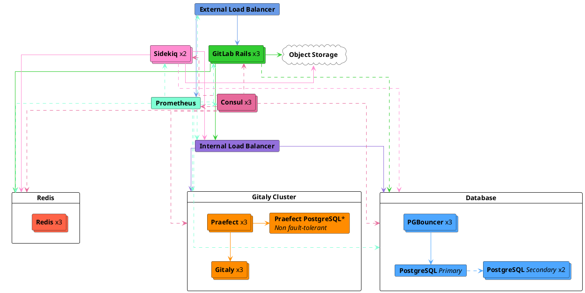
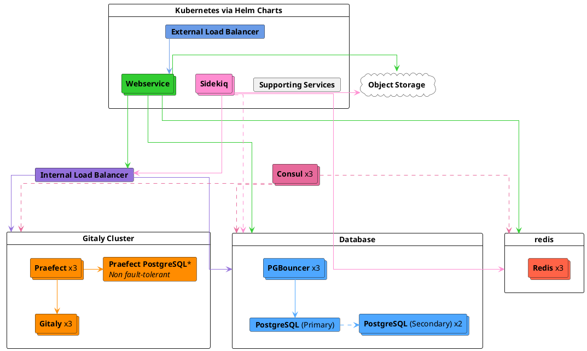



- 티어:  Premium, Ultimate
- 제공 서비스: GitLab Self-Managed



이 페이지는 초당 60개 요청(RPS)의 최고 부하를 목표로 설계된 GitLab 참조 아키텍처를 설명합니다. 이는 실제 데이터를 기반으로 수동 및 자동화된 최대 3,000명의 사용자의 전형적인 최고 부하입니다.

이 아키텍처는 HA가 내장된 가장 작은 아키텍처입니다. HA가 필요하지만 사용자 수가 적거나 총 부하가 낮은 경우 [낮은 사용자 수에 대한 지원되는 수정 사항](#supported-modifications-for-lower-user-counts-ha) 섹션에서 HA를 유지하면서 이 아키텍처의 크기를 줄이는 방법에 대해 자세히 설명합니다.

참조 아키텍처의 전체 목록을 보려면 [사용 가능한 참조 아키텍처](_index.md#available-reference-architectures)를 참조하세요.

- **Target Load**:  API:  60 RPS, 웹:  6 RPS, Git (가져오기):  6 RPS, Git (푸시):  1 RPS
- **High Availability**:  예. 다만 [Praefect](#configure-praefect-postgresql)는 타사 PostgreSQL 솔루션이 필요합니다.
- **Cloud Native Hybrid Alternative**:  [예](#cloud-native-hybrid-reference-architecture-with-helm-charts-alternative)
- **Unsure which Reference Architecture to use**? [자세한 내용을 보려면 이 가이드로 이동하세요](_index.md#deciding-which-architecture-to-start-with).

| 서비스                                   | 노드 | 구성         | GCP 예<sup>1</sup> | AWS 예<sup>1</sup> | Azure 예<sup>1</sup> |
|-------------------------------------------|-------|-----------------------|-----------------|--------------|----------|
| 외부 로드 밸런서<sup>4</sup>        | 1     | 4 vCPU, 3.6GB 메모리 | `n1-highcpu-4`  | `c5n.xlarge` | `F4s v2` |
| Consul<sup>2</sup>                        | 3     | 2 vCPU, 1.8GB 메모리 | `n1-highcpu-2`  | `c5.large`   | `F2s v2` |
| PostgreSQL<sup>2</sup>                    | 3     | 2 vCPU, 7.5GB 메모리 | `n1-standard-2` | `m5.large`   | `D2s v3` |
| PgBouncer<sup>2</sup>                     | 3     | 2 vCPU, 1.8GB 메모리 | `n1-highcpu-2`  | `c5.large`   | `F2s v2` |
| 내부 로드 밸런서<sup>4</sup>        | 1     | 4 vCPU, 3.6GB 메모리 | `n1-highcpu-4`  | `c5n.xlarge` | `F4s v2` |
| Redis/Sentinel<sup>3</sup>                | 3     | 2 vCPU, 7.5GB 메모리 | `n1-standard-2` | `m5.large`   | `D2s v3` |
| Gitaly<sup>6</sup><sup>7</sup>            | 3     | 4 vCPU, 15GB 메모리  | `n1-standard-4` | `m5.xlarge`  | `D4s v3` |
| Praefect<sup>6</sup>                      | 3     | 2 vCPU, 1.8GB 메모리 | `n1-highcpu-2`  | `c5.large`   | `F2s v2` |
| Praefect PostgreSQL<sup>2</sup>           | 1+    | 2 vCPU, 1.8GB 메모리 | `n1-highcpu-2`  | `c5.large`   | `F2s v2` |
| Sidekiq<sup>8</sup>                       | 2     | 4 vCPU, 15GB 메모리  | `n1-standard-4` | `m5.xlarge`  | `D2s v3` |
| GitLab Rails<sup>8</sup>                  | 3     | 8 vCPU, 7.2GB 메모리 | `n1-highcpu-8`  | `c5.2xlarge` | `F8s v2` |
| 모니터링 노드                           | 1     | 2 vCPU, 1.8GB 메모리 | `n1-highcpu-2`  | `c5.large`   | `F2s v2` |
| 객체 저장소<sup>5</sup>                | -     | -                     | -               | -            | -        |

**각주**:

<!-- Disable ordered list rule <https://github.com/DavidAnson/markdownlint/blob/main/doc/Rules.md#md029---ordered-list-item-prefix> -->
<!-- markdownlint-disable MD029 -->
1. 머신 유형 예시는 설명을 위해 제공됩니다. 이러한 유형은 [검증 및 테스트](_index.md#validation-and-test-results)에 사용되지만 규범적 기본값으로 의도되지 않습니다. 나열된 요구 사항을 충족하는 다른 머신 유형으로 전환이 지원되며, 사용 가능한 경우 ARM 변형도 포함됩니다. 자세한 내용은 [지원되는 머신 유형](_index.md#supported-machine-types)을 참조하세요.
2. 평판이 좋은 타사 외부 PaaS PostgreSQL 솔루션에서 선택적으로 실행할 수 있습니다. 자세한 정보는 [고유한 PostgreSQL 인스턴스 제공](#provide-your-own-postgresql-instance)을 참조하세요.
3. 평판이 좋은 타사 외부 PaaS Redis 솔루션에서 선택적으로 실행할 수 있습니다. 자세한 내용은 [자신의 Redis 인스턴스 제공](#provide-your-own-redis-instance)을 참조하세요.
4. HA 기능을 제공할 수 있는 평판이 좋은 타사 로드 밸런서 또는 서비스(LB PaaS)를 사용하여 실행하는 것이 권장됩니다. 크기 조정은 선택된 로드 밸런서 및 네트워크 대역폭과 같은 추가 요소에 따라 달라집니다. 자세한 정보는 [로드 밸런서](_index.md#load-balancers)를 참조하세요.
5. 평판이 좋은 클라우드 공급자 또는 자체 관리 솔루션에서 실행해야 합니다. 자세한 내용은 [객체 저장소 구성](#configure-the-object-storage)을 참조하세요.
6. Gitaly Cluster(Praefect)는 장애 허용 기능의 이점을 제공하지만 설정 및 관리의 추가적인 복잡성이 따릅니다. [Gitaly 클러스터(Praefect) 배포 전 기술적 제한 사항 및 고려 사항](../gitaly/praefect/_index.md#before-deploying-gitaly-cluster-praefect)을 검토하세요. 샤드된 Gitaly를 원하면 이전 테이블에 나열된 `Gitaly`와 동일한 사양을 사용하세요.
7. Gitaly 사양은 양호한 상태의 사용 패턴 및 리포지토리 크기의 높은 백분위수를 기반으로 합니다. 그러나 [대형 모노리포](_index.md#large-monorepos) (수 기가바이트보다 큼) 또는 [추가 워크로드](_index.md#additional-workloads)가 있는 경우 Git 및 Gitaly 성능에 크게 영향을 미칠 수 있으며 추가 조정이 필요할 수 있습니다.
8. 구성 요소가 [상태 저장 데이터](_index.md#autoscaling-of-stateful-nodes)를 저장하지 않으므로 Auto Scaling Groups(ASG)에 배치할 수 있습니다. 그러나 [클라우드 네이티브 하이브리드 설정](#cloud-native-hybrid-reference-architecture-with-helm-charts-alternative) 이 일반적으로 선호되는데, 이는 [마이그레이션](#gitlab-rails-post-configuration) 및 [Mailroom](../incoming_email.md)과 같은 특정 구성 요소가 한 노드에서만 실행될 수 있기 때문이며, 이는 Kubernetes에서 더 잘 처리됩니다.
<!-- markdownlint-enable MD029 -->

> [!note]
> 인스턴스 구성과 관련된 모든 PaaS 솔루션의 경우 복원력 있는 클라우드 아키텍처 관행에 맞추기 위해 3개의 서로 다른 가용성 영역에 최소 3개의 노드를 구현하는 것이 권장됩니다.



## 요구 사항 {#requirements}

계속하기 전에 참조 아키텍처의 [요구 사항](_index.md#requirements)을 검토하세요.

## 테스트 방법 {#testing-methodology}

60 RPS / 3k 사용자 참조 아키텍처는 대부분의 일반적인 워크플로우를 수용하도록 설계되었습니다. GitLab은 다음 엔드포인트 처리량 목표에 대해 정기적으로 스모크 및 성능 테스트를 수행합니다:

| 엔드포인트 유형 | 대상 처리량 |
| ------------- | ----------------- |
| API           | 60 RPS           |
| 웹           | 6 RPS            |
| Git(풀)    | 6 RPS            |
| Git(푸시)    | 1 RPS             |

이러한 목표는 CI 파이프라인 및 기타 워크로드를 포함하여 지정된 사용자 수에 대한 총 환경 로드를 반영하는 실제 고객 데이터를 기반으로 합니다. 이는 일반적인 워크로드 구성을 나타냅니다. 비정상적인 워크로드 패턴에 대한 지침은 [RPS 구성 이해](sizing.md#understanding-rps-composition-and-workload-patterns)를 참조하세요.

테스트 방법에 대한 자세한 내용은 [검증 및 테스트 결과](_index.md#validation-and-test-results) 섹션을 참조하세요.

### 성능 고려 사항 {#performance-considerations}

환경에 다음이 있는 경우 추가 조정이 필요할 수 있습니다:

- 나열된 대상보다 일관되게 높은 처리량
- [대형 모노레포](_index.md#large-monorepos)
- 상당한 [추가 워크로드](_index.md#additional-workloads)

이러한 경우 자세한 내용은 [환경 확장](_index.md#scaling-an-environment)을 참조하세요. 이러한 고려 사항이 자신에게 적용될 수 있다고 생각되면 필요에 따라 추가 지침을 문의하세요.

### 로드 밸런서 구성 {#load-balancer-configuration}

테스트 환경에서는 다음을 사용합니다:

- Linux 패키지 환경을 위한 HAProxy
- 클라우드 네이티브 하이브리드를 위한 Gateway API 또는 Ingress 구현이 있는 클라우드 공급자 동등 버전

## 구성 요소 설정 {#set-up-components}

GitLab 및 해당 구성 요소를 최대 60 RPS 또는 3,000명의 사용자를 수용하도록 설정하려면:

1. GitLab 애플리케이션 서비스 노드의 로드 밸런싱을 처리하도록 [외부 로드 밸런서 구성](#configure-the-external-load-balancer)합니다.
1. GitLab 애플리케이션 내부 연결의 로드 밸런싱을 처리하도록 [내부 로드 밸런서 구성](#configure-the-internal-load-balancer)합니다.
1. 서비스 검색 및 상태 확인을 위해 [Consul 구성](#configure-consul)합니다.
1. GitLab의 데이터베이스인 [PostgreSQL 구성](#configure-postgresql).
1. 데이터베이스 연결 풀링 및 관리를 위해 [PgBouncer 구성](#configure-pgbouncer)합니다.
1. 세션 데이터, 임시 캐시 정보 및 백그라운드 작업 큐를 저장하는 [Redis 구성](#configure-redis).
1. Git 리포지토리에 대한 액세스를 제공하는 [Gitaly Cluster(Praefect) 구성](#configure-gitaly-cluster-praefect)합니다.
1. 백그라운드 작업 처리를 위한 [Sidekiq 구성](#configure-sidekiq).
1. Puma, Workhorse, GitLab Shell을 실행하고 모든 프론트엔드 요청(UI, API, Git over HTTP/SSH 포함)을 처리하는 [주요 GitLab Rails 애플리케이션 구성](#configure-gitlab-rails).
1. GitLab 환경을 모니터링하도록 [Prometheus 구성](#configure-prometheus).
1. 공유 데이터 객체에 사용되는 [객체 저장소 구성](#configure-the-object-storage).
1. 전체 GitLab 인스턴스에서 더 빠르고 고급 코드 검색을 위한 [고급 검색 구성](#configure-advanced-search)(선택 사항).

서버는 동일한 10.6.0.0/24 프라이빗 네트워크 범위에서 시작하며 이러한 주소에서 자유롭게 서로 연결할 수 있습니다.

다음 목록은 각 서버 및 할당된 IP에 대한 설명을 포함합니다:

- `10.6.0.10`:  외부 로드 밸런서
- `10.6.0.11`:  Consul/Sentinel 1
- `10.6.0.12`:  Consul/Sentinel 2
- `10.6.0.13`:  Consul/Sentinel 3
- `10.6.0.21`:  PostgreSQL 프라이머리
- `10.6.0.22`:  PostgreSQL 보조 1
- `10.6.0.23`:  PostgreSQL 보조 2
- `10.6.0.31`:  PgBouncer 1
- `10.6.0.32`:  PgBouncer 2
- `10.6.0.33`:  PgBouncer 3
- `10.6.0.20`:  내부 로드 밸런서
- `10.6.0.61`:  Redis 프라이머리
- `10.6.0.62`:  Redis 복제본 1
- `10.6.0.63`:  Redis 복제본 2
- `10.6.0.51`:  Gitaly 1
- `10.6.0.52`:  Gitaly 2
- `10.6.0.93`:  Gitaly 3
- `10.6.0.131`:  Praefect 1
- `10.6.0.132`:  Praefect 2
- `10.6.0.133`:  Praefect 3
- `10.6.0.141`:  Praefect PostgreSQL 1 (비 HA)
- `10.6.0.71`:  Sidekiq 1
- `10.6.0.72`:  Sidekiq 2
- `10.6.0.41`:  GitLab 애플리케이션 1
- `10.6.0.42`:  GitLab 애플리케이션 2
- `10.6.0.43`:  GitLab 애플리케이션 3
- `10.6.0.81`:  Prometheus

## 외부 로드 밸런서 구성 {#configure-the-external-load-balancer}

다중 노드 GitLab 구성에서는 트래픽을 애플리케이션 서버로 라우팅하도록 외부 로드 밸런서가 필요합니다.

사용할 로드 밸런서나 정확한 구성에 대한 자세한 내용은 GitLab 문서 범위를 벗어나지만 일반적인 요구 사항에 대한 자세한 내용은 [로드 밸런서](_index.md)를 참조하세요. 이 섹션에서는 선택한 로드 밸런서에 대해 구성해야 할 사항에 중점을 두겠습니다.

### 준비 상태 확인 {#readiness-checks}

외부 로드 밸런서가 기본 제공 모니터링 엔드포인트로 작동 서비스로만 라우팅되도록 하세요. [준비 상태 확인](../monitoring/health_check.md) 에는 모두 확인 중인 노드에 대한 [추가 구성](../monitoring/ip_allowlist.md)이 필요합니다. 그렇지 않으면 외부 로드 밸런서가 연결할 수 없습니다.

### 포트 {#ports}

사용할 기본 포트는 아래 표에 나와 있습니다.

| LB 포트 | 백엔드 포트 | 프로토콜                 |
| ------- | ------------ | ------------------------ |
| 80      | 80           | HTTP(*1*)               |
| 443     | 443          | TCP 또는 HTTPS(*1*)(*2*) |
| 22      | 22           | TCP                      |

- (*1*):  [웹 터미널](../../ci/environments/_index.md#web-terminals-deprecated) 지원을 위해 로드 밸런서가 WebSocket 연결을 올바르게 처리해야 합니다. HTTP 또는 HTTPS 프록싱을 사용할 때 로드 밸런서는 `Connection` 및 `Upgrade` 홉 바이 홉 헤더를 통과하도록 구성해야 합니다. 자세한 내용은 [웹 터미널](../integration/terminal.md) 통합 가이드를 참조하세요.
- (*2*):  포트 443에 HTTPS 프로토콜을 사용할 때는 로드 밸런서에 SSL 인증서를 추가해야 합니다. 대신 GitLab 애플리케이션 서버에서 SSL을 종료하려면 TCP 프로토콜을 사용하세요.

커스텀 도메인 지원으로 GitLab Pages를 사용하는 경우 추가 포트 구성이 필요합니다. GitLab Pages에는 별도의 가상 IP 주소가 필요합니다. DNS를 구성하여 `pages_external_url`(from `/etc/gitlab/gitlab.rb`)을 새로운 가상 IP 주소로 지정하세요. 자세한 내용은 [GitLab Pages 설명서](../pages/_index.md)를 참조하세요.

| LB 포트 | 백엔드 포트  | 프로토콜  |
| ------- | ------------- | --------- |
| 80      | 가변(*1*)  | HTTP      |
| 443     | 가변(*1*)  | TCP(*2*) |

- (*1*):  GitLab Pages의 백엔드 포트는 `gitlab_pages['external_http']` 및 `gitlab_pages['external_https']` 설정에 따라 달라집니다. 자세한 내용은 [GitLab Pages 설명서](../pages/_index.md)를 참조하세요.
- (*2*):  GitLab Pages의 포트 443은 항상 TCP 프로토콜을 사용해야 합니다. 사용자는 커스텀 도메인으로 커스텀 SSL을 구성할 수 있으며, 로드 밸런서에서 SSL을 종료하면 불가능합니다.

#### 대체 SSH 포트 {#alternate-ssh-port}

일부 조직에서는 SSH 포트 22를 열지 않으려는 정책이 있습니다. 이 경우 사용자가 포트 443에서 SSH를 사용할 수 있는 대체 SSH 호스트명을 구성하는 것이 좋습니다. 대체 SSH 호스트명은 이전에 설명한 다른 GitLab HTTP 구성과 비교하여 새로운 가상 IP 주소가 필요합니다.

`altssh.gitlab.example.com`과 같은 대체 SSH 호스트명에 대해 DNS를 구성하세요.

| LB 포트 | 백엔드 포트 | 프로토콜 |
| ------- | ------------ | -------- |
| 443     | 22           | TCP      |

### SSL {#ssl}

다음 질문은 환경에서 SSL을 처리하는 방법입니다. 여러 가지 옵션이 있습니다:

- [애플리케이션 노드가 SSL을 종료합니다](#application-node-terminates-ssl).
- [로드 밸런서가 백엔드 SSL 없이 SSL을 종료합니다](#load-balancer-terminates-ssl-without-backend-ssl). 그리고 로드 밸런서와 애플리케이션 노드 간의 통신은 안전하지 않습니다.
- [로드 밸런서가 백엔드 SSL을 사용하여 SSL을 종료합니다](#load-balancer-terminates-ssl-with-backend-ssl). 그리고 로드 밸런서와 애플리케이션 노드 간의 통신은 안전합니다.

#### 애플리케이션 노드가 SSL을 종료합니다 {#application-node-terminates-ssl}

로드 밸런서를 구성하여 포트 443의 연결을 `HTTP(S)` 프로토콜이 아닌 `TCP`로 전달하세요. 이렇게 하면 연결이 애플리케이션 노드의 NGINX 서비스에 건드리지 않게 전달됩니다. NGINX는 SSL 인증서를 가지고 포트 443에서 수신할 것입니다.

SSL 인증서 관리 및 NGINX 구성에 대한 자세한 내용은 [HTTPS 설명서](https://docs.gitlab.com/omnibus/settings/ssl/)를 참조하세요.

#### 로드 밸런서가 백엔드 SSL 없이 SSL을 종료합니다 {#load-balancer-terminates-ssl-without-backend-ssl}

로드 밸런서를 구성하여 `TCP` 대신 `HTTP(S)` 프로토콜을 사용하세요. 로드 밸런서는 SSL 인증서 관리 및 SSL 종료를 담당합니다.

로드 밸런서와 GitLab 간의 통신이 안전하지 않으므로 추가 구성이 필요합니다. 자세한 내용은 [프록시 SSL 설명서](https://docs.gitlab.com/omnibus/settings/ssl/#configure-a-reverse-proxy-or-load-balancer-ssl-termination)를 참조하세요.

#### 로드 밸런서가 백엔드 SSL을 사용하여 SSL을 종료합니다 {#load-balancer-terminates-ssl-with-backend-ssl}

로드 밸런서를 구성하여 'TCP' 대신 'HTTP(S)' 프로토콜을 사용하세요. 로드 밸런서는 최종 사용자가 볼 SSL 인증서 관리를 담당합니다.

트래픽은 이 시나리오에서 로드 밸런서와 NGINX 간의 안전할 것입니다. 연결이 모든 방식으로 안전할 것이므로 프록시 SSL에 대한 구성을 추가할 필요가 없습니다. 그러나 SSL 인증서를 구성하기 위해 GitLab에 구성을 추가해야 합니다. SSL 인증서 관리 및 NGINX 구성에 대한 자세한 내용은 [HTTPS 설명서](https://docs.gitlab.com/omnibus/settings/ssl/)를 참조하세요.

<div align="right">
  <a type="button" class="btn btn-default" href="#set-up-components">구성 요소 설정으로 돌아가기 <i class="fa fa-angle-double-up" aria-hidden="true"></i> </a>
</div>

## 내부 로드 밸런서 구성 {#configure-the-internal-load-balancer}

다중 노드 GitLab 구성에서는 [PgBouncer](#configure-pgbouncer) 및 [Gitaly Cluster(Praefect)](#configure-praefect)에 대한 연결과 같이 구성된 경우 선택 내부 구성 요소의 트래픽을 라우팅하기 위해 내부 로드 밸런서가 필요합니다.

사용할 로드 밸런서나 정확한 구성에 대한 자세한 내용은 GitLab 문서 범위를 벗어나지만 일반적인 요구 사항에 대한 자세한 내용은 [로드 밸런서](_index.md)를 참조하세요. 이 섹션에서는 선택한 로드 밸런서에 대해 구성해야 할 사항에 중점을 두겠습니다.

다음 IP를 예로 사용합니다:

- `10.6.0.40`:  내부 로드 밸런서

[HAProxy](https://www.haproxy.org/)를 사용하여 수행하는 방법은 다음과 같습니다:

```plaintext
global
    log /dev/log local0
    log localhost local1 notice
    log stdout format raw local0

defaults
    log global
    default-server inter 10s fall 3 rise 2
    balance leastconn

frontend internal-pgbouncer-tcp-in
    bind *:6432
    mode tcp
    option tcplog

    default_backend pgbouncer

backend pgbouncer
    mode tcp
    option tcp-check

    server pgbouncer1 10.6.0.31:6432 check
    server pgbouncer2 10.6.0.32:6432 check
    server pgbouncer3 10.6.0.33:6432 check

# Praefect load balancing (skip both sections below if using DNS service discovery for Praefect)
# For more information, see https://docs.gitlab.com/administration/gitaly/praefect/configure/#service-discovery
frontend internal-praefect-tcp-in
    bind *:2305
    mode tcp
    option tcplog
    option clitcpka

    default_backend praefect

backend praefect
    mode tcp
    option tcp-check
    option srvtcpka

    server praefect1 10.6.0.131:2305 check
    server praefect2 10.6.0.132:2305 check
    server praefect3 10.6.0.133:2305 check
```

더 많은 지침은 선호하는 로드 밸런서의 설명서를 참조하세요.

<div align="right">
  <a type="button" class="btn btn-default" href="#set-up-components">구성 요소 설정으로 돌아가기 <i class="fa fa-angle-double-up" aria-hidden="true"></i> </a>
</div>

## Consul 구성 {#configure-consul}

다음으로 Consul 서버를 설정합니다.

> [!note]
> Consul은 3개 이상의 홀수 개 노드에 배포되어야 합니다. 이는 노드가 쿼럼의 일부로 투표할 수 있도록 하기 위함입니다.

다음 IP를 예로 사용합니다:

- `10.6.0.11`:  Consul 1
- `10.6.0.12`:  Consul 2
- `10.6.0.13`:  Consul 3

Consul을 구성하려면:

1. Consul을 호스팅할 서버로 SSH를 수행합니다.
1. 선택한 Linux 패키지를 [다운로드 및 설치](../../install/package/_index.md#supported-platforms)하세요. 선택한 운영 체제에 대해 GitLab 패키지 리포지토리만 추가하고 GitLab을 설치해야 합니다. 현재 설치와 동일한 버전 및 유형(Community 또는 Enterprise 에디션)을 선택합니다.
1. `/etc/gitlab/gitlab.rb`을 편집하고 내용을 추가합니다:

   ```ruby
   roles(['consul_role'])

   ## Enable service discovery for Prometheus
   consul['monitoring_service_discovery'] =  true

   ## The IPs of the Consul server nodes
   ## You can also use FQDNs and intermix them with IPs
   consul['configuration'] = {
      server: true,
      retry_join: %w(10.6.0.11 10.6.0.12 10.6.0.13),
   }

   # Set the network addresses that the exporters will listen on
   node_exporter['listen_address'] = '0.0.0.0:9100'

   # Prevent database migrations from running on upgrade automatically
   gitlab_rails['auto_migrate'] = false
   ```

1. 구성한 첫 번째 Linux 패키지 노드에서 `/etc/gitlab/gitlab-secrets.json` 파일을 복사하여 이 서버에서 동일한 이름의 파일을 추가하거나 교체합니다. 이것이 구성하는 첫 번째 Linux 패키지 노드인 경우 이 단계를 건너뛸 수 있습니다.
1. 변경 사항이 적용되려면 [GitLab 재구성](../restart_gitlab.md#reconfigure-a-linux-package-installation)을 수행합니다.
1. 다른 모든 Consul 노드에 대해 단계를 다시 수행하고 올바른 IP를 설정했는지 확인합니다.

세 번째 Consul 서버의 프로비저닝이 완료되면 Consul 리더가 선택됩니다. Consul 로그 `sudo gitlab-ctl tail consul`를 보면 `...[INFO] consul: New leader elected: ...`가 표시됩니다.

현재 Consul 멤버(서버, 클라이언트)를 나열할 수 있습니다:

```shell
sudo /opt/gitlab/embedded/bin/consul members
```

GitLab 서비스가 실행 중인지 확인할 수 있습니다:

```shell
sudo gitlab-ctl status
```

출력은 다음과 유사해야 합니다:

```plaintext
run: consul: (pid 30074) 76834s; run: log: (pid 29740) 76844s
run: logrotate: (pid 30925) 3041s; run: log: (pid 29649) 76861s
run: node-exporter: (pid 30093) 76833s; run: log: (pid 29663) 76855s
```

<div align="right">
  <a type="button" class="btn btn-default" href="#set-up-components">구성 요소 설정으로 돌아가기 <i class="fa fa-angle-double-up" aria-hidden="true"></i> </a>
</div>

## PostgreSQL 구성 {#configure-postgresql}

이 섹션에서는 GitLab과 함께 사용할 고가용성 PostgreSQL 클러스터를 구성하는 과정을 안내합니다.

### 자신의 PostgreSQL 인스턴스 제공 {#provide-your-own-postgresql-instance}

Linux 패키지 번들 PostgreSQL, PgBouncer 및 Consul 서비스 검색 구성 요소 대신 [PostgreSQL용 타사 외부 서비스](../postgresql/external.md)를 사용할 수 있습니다.

[지원되는 PostgreSQL 버전](../../install/requirements.md#postgresql)을 실행하는 평판이 좋은 공급자를 사용하세요. 다음 서비스는 잘 작동하는 것으로 알려져 있습니다:

- [Google Cloud SQL](https://cloud.google.com/sql/docs/postgres/high-availability#normal).
- [Amazon RDS](https://aws.amazon.com/rds/).

고가용성 및 데이터베이스 로드 밸런싱에 대한 지침을 포함한 자세한 내용은 다음을 참조하세요:

- [권장 클라우드 공급자 및 서비스](_index.md#recommended-cloud-providers-and-services).
- [데이터베이스 서비스에 대한 모범 사례](_index.md#best-practices-for-the-database-services).

타사 외부 서비스를 사용하는 경우:

1. [데이터베이스 요구 사항 문서](../../install/requirements.md#postgresql)에 따라 PostgreSQL을 설정하세요.
1. 필요한 [사용자 및 데이터베이스](../postgresql/external.md)를 구성하세요.
1. [GitLab Rails 구성](#configure-gitlab-rails)을 따르는 것으로 적절한 연결 세부 정보를 사용하여 GitLab 애플리케이션 서버를 구성하세요.

### Linux 패키지를 사용하는 독립 실행형 PostgreSQL {#standalone-postgresql-using-the-linux-package}

복제 및 장애 조치를 포함하는 PostgreSQL 클러스터에 대한 권장 Linux 패키지 구성:

- 최소 3개의 PostgreSQL 노드.
- 최소 3개의 Consul 서버 노드.
- 기본 데이터베이스 읽기 및 쓰기를 추적 및 처리하는 최소 3개의 PgBouncer 노드.
  - PgBouncer 노드 간의 요청 균형을 유지하기 위한 [내부 로드 밸런서](#configure-the-internal-load-balancer)(TCP).
- [데이터베이스 로드 밸런싱](../postgresql/database_load_balancing.md) 활성화.

  각 PostgreSQL 노드에서 구성할 로컬 PgBouncer 서비스. 이는 기본을 추적하는 주 PgBouncer 클러스터와는 별개입니다.

다음 IP를 예로 사용합니다:

- `10.6.0.21`:  PostgreSQL 프라이머리
- `10.6.0.22`:  PostgreSQL 보조 1
- `10.6.0.23`:  PostgreSQL 보조 2

먼저 Linux GitLab 패키지를 [설치](../../install/package/_index.md#supported-platforms)했는지 확인하세요. **on each node** 선택한 운영 체제에 대해 GitLab 패키지 리포지토리만 추가하고 GitLab을 설치하되 `EXTERNAL_URL` 값을 제공하지 **마십시오**.

#### PostgreSQL 노드 {#postgresql-nodes}

1. PostgreSQL 노드 중 하나로 SSH를 수행합니다.
1. PostgreSQL 사용자 이름/암호 쌍에 대한 암호 해시를 생성합니다. 기본 사용자 이름인 `gitlab`(권장)을 사용한다고 가정합니다. 명령은 암호 및 확인을 요청합니다. 다음 단계에서 이 명령어의 출력 값을 `<postgresql_password_hash>`의 값으로 사용합니다:

   ```shell
   sudo gitlab-ctl pg-password-md5 gitlab
   ```

1. PgBouncer 사용자 이름/암호 쌍에 대한 암호 해시를 생성합니다. 기본 사용자 이름인 `pgbouncer`(권장)을 사용한다고 가정합니다. 명령은 암호 및 확인을 요청합니다. 다음 단계에서 이 명령어의 출력 값을 `<pgbouncer_password_hash>`의 값으로 사용합니다:

   ```shell
   sudo gitlab-ctl pg-password-md5 pgbouncer
   ```

1. PostgreSQL 복제 사용자 이름/암호 쌍에 대한 암호 해시를 생성합니다. 기본 사용자 이름인 `gitlab_replicator`(권장)을 사용한다고 가정합니다. 명령은 암호 및 확인을 요청합니다. 다음 단계에서 이 명령어의 출력 값을 `<postgresql_replication_password_hash>`의 값으로 사용합니다:

   ```shell
   sudo gitlab-ctl pg-password-md5 gitlab_replicator
   ```

1. Consul 데이터베이스 사용자 이름/암호 쌍에 대한 암호 해시를 생성합니다. 기본 사용자 이름인 `gitlab-consul`(권장)을 사용한다고 가정합니다. 명령은 암호 및 확인을 요청합니다. 다음 단계에서 이 명령어의 출력 값을 `<consul_password_hash>`의 값으로 사용합니다:

   ```shell
   sudo gitlab-ctl pg-password-md5 gitlab-consul
   ```

1. 모든 데이터베이스 노드에서 `/etc/gitlab/gitlab.rb`을 편집하고 `# START user configuration` 섹션에서 표시된 값을 바꿉니다:

   ```ruby
   # Disable all components except Patroni, PgBouncer and Consul
   roles(['patroni_role', 'pgbouncer_role'])

   # PostgreSQL configuration
   postgresql['listen_address'] = '0.0.0.0'

   # Sets `max_replication_slots` to double the number of database nodes.
   # Patroni uses one extra slot per node when initiating the replication.
   patroni['postgresql']['max_replication_slots'] = 6

   # Set `max_wal_senders` to one more than the number of replication slots in the cluster.
   # This is used to prevent replication from using up all of the
   # available database connections.
   patroni['postgresql']['max_wal_senders'] = 7

   # Prevent database migrations from running on upgrade automatically
   gitlab_rails['auto_migrate'] = false

   # Configure the Consul agent
   consul['services'] = %w(postgresql)
   ## Enable service discovery for Prometheus
   consul['monitoring_service_discovery'] =  true

   # START user configuration
   # Please set the real values as explained in Required Information section
   #
   # Replace PGBOUNCER_PASSWORD_HASH with a generated md5 value
   postgresql['pgbouncer_user_password'] = '<pgbouncer_password_hash>'
   # Replace POSTGRESQL_REPLICATION_PASSWORD_HASH with a generated md5 value
   postgresql['sql_replication_password'] = '<postgresql_replication_password_hash>'
   # Replace POSTGRESQL_PASSWORD_HASH with a generated md5 value
   postgresql['sql_user_password'] = '<postgresql_password_hash>'

   # Set up basic authentication for the Patroni API (use the same username/password in all nodes).
   patroni['username'] = '<patroni_api_username>'
   patroni['password'] = '<patroni_api_password>'

   # Replace 10.6.0.0/24 with Network Address
   postgresql['trust_auth_cidr_addresses'] = %w(10.6.0.0/24 127.0.0.1/32)

   # Local PgBouncer service for Database Load Balancing
   pgbouncer['databases'] = {
      gitlabhq_production: {
         host: "127.0.0.1",
         user: "pgbouncer",
         password: '<pgbouncer_password_hash>'
      }
   }

   # Set the network addresses that the exporters will listen on for monitoring
   node_exporter['listen_address'] = '0.0.0.0:9100'
   postgres_exporter['listen_address'] = '0.0.0.0:9187'

   ## The IPs of the Consul server nodes
   ## You can also use FQDNs and intermix them with IPs
   consul['configuration'] = {
      retry_join: %w(10.6.0.11 10.6.0.12 10.6.0.13),
   }
   #
   # END user configuration
   ```

Patroni를 관리 중인 PostgreSQL은 기본적으로 `pg_rewind`을 사용하여 충돌을 처리합니다. 대부분의 장애 조치 처리 방법과 마찬가지로 데이터 손실 가능성이 작습니다. 자세한 정보는 다양한 [Patroni 복제 방법](../postgresql/replication_and_failover.md#selecting-the-appropriate-patroni-replication-method)을 참조하세요.

1. 구성한 첫 번째 Linux 패키지 노드에서 `/etc/gitlab/gitlab-secrets.json` 파일을 복사하여 이 서버에서 동일한 이름의 파일을 추가하거나 교체합니다. 이것이 구성하는 첫 번째 Linux 패키지 노드인 경우 이 단계를 건너뛸 수 있습니다.
1. 변경 사항이 적용되려면 [GitLab 재구성](../restart_gitlab.md#reconfigure-a-linux-package-installation)을 수행합니다.

고급 [구성 옵션](https://docs.gitlab.com/omnibus/settings/database/)은 지원되며 필요시 추가할 수 있습니다.

<div align="right">
  <a type="button" class="btn btn-default" href="#set-up-components">구성 요소 설정으로 돌아가기 <i class="fa fa-angle-double-up" aria-hidden="true"></i> </a>
</div>

#### PostgreSQL 사후 구성 {#postgresql-post-configuration}

**primary site**의 Patroni 노드 중 하나로 SSH를 수행합니다:

1. 리더 및 클러스터의 상태를 확인합니다:

   ```shell
   gitlab-ctl patroni members
   ```

   출력은 다음과 유사해야 합니다:

   ```plaintext
   | Cluster       | Member                            |  Host     | Role   | State   | TL  | Lag in MB | Pending restart |
   |---------------|-----------------------------------|-----------|--------|---------|-----|-----------|-----------------|
   | postgresql-ha | <PostgreSQL primary hostname>     | 10.6.0.21 | Leader | running | 175 |           | *               |
   | postgresql-ha | <PostgreSQL secondary 1 hostname> | 10.6.0.22 |        | running | 175 | 0         | *               |
   | postgresql-ha | <PostgreSQL secondary 2 hostname> | 10.6.0.23 |        | running | 175 | 0         | *               |
   ```

노드의 'State' 열이 "running"이라고 표시되지 않으면 진행하기 전에 [PostgreSQL 복제 및 장애 조치 문제 해결 섹션](../postgresql/replication_and_failover_troubleshooting.md#pgbouncer-error-error-pgbouncer-cannot-connect-to-server)을 확인하세요.

<div align="right">
  <a type="button" class="btn btn-default" href="#set-up-components">구성 요소 설정으로 돌아가기 <i class="fa fa-angle-double-up" aria-hidden="true"></i> </a>
</div>

### PgBouncer 구성 {#configure-pgbouncer}

PostgreSQL 서버가 모두 설정되었으므로 이제 PgBouncer를 구성하여 기본 데이터베이스에 대한 읽기/쓰기를 추적 및 처리합니다.

> [!note]
> PgBouncer는 단일 스레드이며 CPU 코어 증가의 이점을 크게 얻지 못합니다. 자세한 내용은 [확장 설명서](_index.md#scaling-an-environment)를 참조하세요.

다음 IP를 예로 사용합니다:

- `10.6.0.31`:  PgBouncer 1
- `10.6.0.32`:  PgBouncer 2
- `10.6.0.33`:  PgBouncer 3

1. 각 PgBouncer 노드에서 `/etc/gitlab/gitlab.rb`을 편집하고 `<consul_password_hash>` 및 `<pgbouncer_password_hash>`을 [이전에 설정](#postgresql-nodes)한 암호 해시로 바꿉니다:

   ```ruby
   # Disable all components except Pgbouncer and Consul agent
   roles(['pgbouncer_role'])

   # Configure PgBouncer
   pgbouncer['admin_users'] = %w(pgbouncer gitlab-consul)
   pgbouncer['users'] = {
      'gitlab-consul': {
         password: '<consul_password_hash>'
      },
      'pgbouncer': {
         password: '<pgbouncer_password_hash>'
      }
   }

   # Configure Consul agent
   consul['watchers'] = %w(postgresql)
   consul['configuration'] = {
   retry_join: %w(10.6.0.11 10.6.0.12 10.6.0.13)
   }

   # Enable service discovery for Prometheus
   consul['monitoring_service_discovery'] = true

   # Set the network addresses that the exporters will listen on
   node_exporter['listen_address'] = '0.0.0.0:9100'
   pgbouncer_exporter['listen_address'] = '0.0.0.0:9188'
   ```

1. 구성한 첫 번째 Linux 패키지 노드에서 `/etc/gitlab/gitlab-secrets.json` 파일을 복사하여 이 서버에서 동일한 이름의 파일을 추가하거나 교체합니다. 이것이 구성하는 첫 번째 Linux 패키지 노드인 경우 이 단계를 건너뛸 수 있습니다.
1. 변경 사항이 적용되려면 [GitLab 재구성](../restart_gitlab.md#reconfigure-a-linux-package-installation)을 수행합니다.
1. Consul이 PgBouncer를 다시 로드할 수 있도록 `.pgpass` 파일을 만듭니다. 메시지가 표시되면 PgBouncer 암호를 두 번 입력합니다:

   ```shell
   gitlab-ctl write-pgpass --host 127.0.0.1 --database pgbouncer --user pgbouncer --hostuser gitlab-consul
   ```

1. 각 노드가 현재 마스터와 통신하고 있는지 확인합니다:

   ```shell
   gitlab-ctl pgb-console # You will be prompted for PGBOUNCER_PASSWORD
   ```

   암호를 입력한 후 오류 `psql: ERROR:  Auth failed`가 나타나면 이전에 올바른 형식으로 MD5 암호 해시를 생성했는지 확인하세요. 올바른 형식은 암호와 사용자 이름을 연결하는 것입니다: `PASSWORDUSERNAME`. 예를 들어 `Sup3rS3cr3tpgbouncer`는 `pgbouncer` 사용자에 대한 MD5 암호 해시를 생성하는 데 필요한 텍스트입니다.
1. 콘솔 프롬프트를 사용할 수 있게 되면 다음 쿼리를 실행합니다:

   ```shell
   show databases ; show clients ;
   ```

   출력은 다음과 유사해야 합니다:

   ```plaintext
           name         |  host       | port |      database       | force_user | pool_size | reserve_pool | pool_mode | max_connections | current_connections
   ---------------------+-------------+------+---------------------+------------+-----------+--------------+-----------+-----------------+---------------------
    gitlabhq_production | MASTER_HOST | 5432 | gitlabhq_production |            |        20 |            0 |           |               0 |                   0
    pgbouncer           |             | 6432 | pgbouncer           | pgbouncer  |         2 |            0 | statement |               0 |                   0
   (2 rows)

    type |   user    |      database       |  state  |   addr         | port  | local_addr | local_port |    connect_time     |    request_time     |    ptr    | link | remote_pid | tls
   ------+-----------+---------------------+---------+----------------+-------+------------+------------+---------------------+---------------------+-----------+------+------------+-----
    C    | pgbouncer | pgbouncer           | active  | 127.0.0.1      | 56846 | 127.0.0.1  |       6432 | 2017-08-21 18:09:59 | 2017-08-21 18:10:48 | 0x22b3880 |      |          0 |
   (2 rows)
   ```

1. GitLab 서비스가 실행 중인지 확인합니다:

   ```shell
   sudo gitlab-ctl status
   ```

   출력은 다음과 유사해야 합니다:

   ```plaintext
   run: consul: (pid 31530) 77150s; run: log: (pid 31106) 77182s
   run: logrotate: (pid 32613) 3357s; run: log: (pid 30107) 77500s
   run: node-exporter: (pid 31550) 77149s; run: log: (pid 30138) 77493s
   run: pgbouncer: (pid 32033) 75593s; run: log: (pid 31117) 77175s
   run: pgbouncer-exporter: (pid 31558) 77148s; run: log: (pid 31498) 77156s
   ```

<div align="right">
  <a type="button" class="btn btn-default" href="#set-up-components">구성 요소 설정으로 돌아가기 <i class="fa fa-angle-double-up" aria-hidden="true"></i> </a>
</div>

## Redis 구성 {#configure-redis}

[Redis](https://redis.io/)를 확장 가능한 환경에서 사용하려면 **프라이머리** x **Replica** 토폴로지와 장애 조치 절차를 감시하고 자동으로 시작하는 [Redis Sentinel](https://redis.io/docs/latest/operate/oss_and_stack/management/sentinel/) 서비스를 사용할 수 있습니다.

> [!note]
>
> - Redis 클러스터는 각각 3개 이상의 홀수 개 노드에 배포되어야 합니다. 이는 Redis Sentinel이 쿼럼의 일부로 투표할 수 있도록 하기 위함입니다. 이는 클라우드 공급자 서비스와 같이 Redis를 외부에서 구성할 때는 적용되지 않습니다.
> - Redis는 주로 단일 스레드이며 CPU 코어 증가의 이점을 크게 얻지 못합니다. 이 아키텍처는 단일 결합된 Redis 클러스터(3개 노드)를 사용하지만 최적의 성능을 위해 Redis를 별도의 캐시 및 지속성 인스턴스(총 6개 노드)로 분할할 수 있습니다. Redis CPU가 포화되는 경우 매우 권장됩니다. 자세한 내용은 [확장 설명서](_index.md#scaling-an-environment)를 참조하세요.

Sentinel과 함께 사용하면 Redis는 인증이 필요합니다. [Redis 보안](https://redis.io/docs/latest/operate/rc/security/) 설명서를 참조하세요. Redis 서비스를 보호하려면 Redis 비밀번호와 엄격한 방화벽 규칙의 조합을 사용하는 것을 권장합니다. GitLab으로 Redis를 구성하기 전에 토폴로지와 아키텍처를 완전히 이해하기 위해 [Redis Sentinel](https://redis.io/docs/latest/operate/oss_and_stack/management/sentinel/) 설명서를 읽어보시기를 강력히 권장합니다.

Redis 설정의 요구 사항은 다음과 같습니다:

1. 모든 Redis 노드는 Redis(`6379`) 및 Sentinel(`26379`) 포트를 통해 서로 통신할 수 있고 수신 연결을 허용해야 합니다(기본값을 변경하지 않는 한).
1. GitLab 애플리케이션을 호스팅하는 서버는 Redis 노드에 액세스할 수 있어야 합니다.
1. 방화벽과 같은 옵션을 사용하여 외부 네트워크(인터넷)의 액세스로부터 노드를 보호합니다.

이 섹션에서는 GitLab과 함께 사용할 외부 Redis 클러스터를 구성하는 과정을 안내합니다. 다음 IP를 예로 사용합니다:

- `10.6.0.61`:  Redis 프라이머리
- `10.6.0.62`:  Redis 복제본 1
- `10.6.0.63`:  Redis 복제본 2

### 자신의 Redis 인스턴스 제공 {#provide-your-own-redis-instance}

다음 지침을 통해 [Redis 인스턴스를 위한 타사 외부 서비스](../redis/replication_and_failover_external.md#redis-as-a-managed-service-in-a-cloud-provider)를 선택적으로 사용할 수 있습니다:

- 평판이 좋은 공급자 또는 솔루션을 사용해야 합니다. [Google Memorystore](https://cloud.google.com/memorystore/docs/redis/memorystore-for-redis-overview) 및 [AWS ElastiCache](https://docs.aws.amazon.com/AmazonElastiCache/latest/red-ug/WhatIs.html)는 작동하는 것으로 알려져 있습니다.
- Redis Cluster 모드는 특히 지원되지 않지만 HA가 있는 Redis Standalone은 지원됩니다.
- 설정에 따라 [Redis 제거 모드](../redis/replication_and_failover_external.md#setting-the-eviction-policy)를 설정해야 합니다.

자세한 내용은 [권장 클라우드 공급자 및 서비스](_index.md#recommended-cloud-providers-and-services)를 참조하세요.

### Redis 클러스터 구성 {#configure-the-redis-cluster}

이는 새 Redis 인스턴스를 설치하고 설정하는 섹션입니다.

기본 및 복제본 Redis 노드 모두 `redis['password']`에 정의된 동일한 암호가 필요합니다. 장애 조치 중 언제든지 Sentinel은 노드를 재구성하고 기본에서 복제본으로의 상태를 변경할 수 있습니다(그 반대도 가능).

#### 프라이머리 Redis 노드 구성 {#configure-the-primary-redis-node}

1. **프라이머리** Redis 서버로 SSH를 수행합니다.
1. 선택한 Linux 패키지를 [다운로드 및 설치](../../install/package/_index.md#supported-platforms)하세요. 선택한 운영 체제에 대해 GitLab 패키지 리포지토리만 추가하고 GitLab을 설치해야 합니다. 현재 설치와 동일한 버전 및 유형(Community 또는 Enterprise 에디션)을 선택합니다.
1. `/etc/gitlab/gitlab.rb`을 편집하고 내용을 추가합니다:

   ```ruby
   # Specify server roles as 'redis_master_role' with Sentinel and the Consul agent
   roles ['redis_sentinel_role', 'redis_master_role', 'consul_role']

   # Set IP bind address and Quorum number for Redis Sentinel service
   sentinel['bind'] = '0.0.0.0'
   sentinel['quorum'] = 2

   # IP address pointing to a local IP that the other machines can reach to.
   # You can also set bind to '0.0.0.0' which listen in all interfaces.
   # If you really must bind to an external accessible IP, make
   # sure you add extra firewall rules to prevent unauthorized access.
   redis['bind'] = '10.6.0.61'

   # Define a port so Redis can listen for TCP requests which will allow other
   # machines to connect to it.
   redis['port'] = 6379

   ## Port of primary Redis server for Sentinel, uncomment to change to non default. Defaults
   ## to `6379`.
   #redis['master_port'] = 6379

   # Set up password authentication for Redis and replicas (use the same password in all nodes).
   redis['password'] = 'REDIS_PRIMARY_PASSWORD'
   redis['master_password'] = 'REDIS_PRIMARY_PASSWORD'

   ## Must be the same in every Redis node
   redis['master_name'] = 'gitlab-redis'

   ## The IP of this primary Redis node.
   redis['master_ip'] = '10.6.0.61'

   ## Enable service discovery for Prometheus
   consul['monitoring_service_discovery'] =  true

   ## The IPs of the Consul server nodes
   ## You can also use FQDNs and intermix them with IPs
   consul['configuration'] = {
      retry_join: %w(10.6.0.11 10.6.0.12 10.6.0.13),
   }

   # Set the network addresses that the exporters will listen on
   node_exporter['listen_address'] = '0.0.0.0:9100'
   redis_exporter['listen_address'] = '0.0.0.0:9121'

   # Prevent database migrations from running on upgrade automatically
   gitlab_rails['auto_migrate'] = false
   ```

1. 구성한 첫 번째 Linux 패키지 노드에서 `/etc/gitlab/gitlab-secrets.json` 파일을 복사하여 이 서버에서 동일한 이름의 파일을 추가하거나 교체합니다. 이것이 구성하는 첫 번째 Linux 패키지 노드인 경우 이 단계를 건너뛸 수 있습니다.
1. 변경 사항이 적용되려면 [GitLab 재구성](../restart_gitlab.md#reconfigure-a-linux-package-installation)을 수행합니다.

#### 복제본 Redis 노드 구성 {#configure-the-replica-redis-nodes}

1. **replica** Redis 서버로 SSH를 수행합니다.
1. 선택한 Linux 패키지를 [다운로드 및 설치](../../install/package/_index.md#supported-platforms)하세요. 선택한 운영 체제에 대해 GitLab 패키지 리포지토리만 추가하고 GitLab을 설치해야 합니다. 현재 설치와 동일한 버전 및 유형(Community 또는 Enterprise 에디션)을 선택합니다.
1. `/etc/gitlab/gitlab.rb`을 편집하고 내용을 추가합니다:

   ```ruby
   # Specify server roles as 'redis_sentinel_role' and 'redis_replica_role'
   roles ['redis_sentinel_role', 'redis_replica_role', 'consul_role']

   # Set IP bind address and Quorum number for Redis Sentinel service
   sentinel['bind'] = '0.0.0.0'
   sentinel['quorum'] = 2

   # IP address pointing to a local IP that the other machines can reach to.
   # You can also set bind to '0.0.0.0' which listen in all interfaces.
   # If you really must bind to an external accessible IP, make
   # sure you add extra firewall rules to prevent unauthorized access.
   redis['bind'] = '10.6.0.62'

   # Define a port so Redis can listen for TCP requests which will allow other
   # machines to connect to it.
   redis['port'] = 6379

   ## Port of primary Redis server for Sentinel, uncomment to change to non default. Defaults
   ## to `6379`.
   #redis['master_port'] = 6379

   # The same password for Redis authentication you set up for the primary node.
   redis['password'] = 'REDIS_PRIMARY_PASSWORD'
   redis['master_password'] = 'REDIS_PRIMARY_PASSWORD'

   ## Must be the same in every Redis node
   redis['master_name'] = 'gitlab-redis'

   # The IP of the primary Redis node.
   redis['master_ip'] = '10.6.0.61'

   ## Enable service discovery for Prometheus
   consul['monitoring_service_discovery'] =  true

   ## The IPs of the Consul server nodes
   ## You can also use FQDNs and intermix them with IPs
   consul['configuration'] = {
      retry_join: %w(10.6.0.11 10.6.0.12 10.6.0.13),
   }

   # Set the network addresses that the exporters will listen on
   node_exporter['listen_address'] = '0.0.0.0:9100'
   redis_exporter['listen_address'] = '0.0.0.0:9121'

   # Prevent database migrations from running on upgrade automatically
   gitlab_rails['auto_migrate'] = false
   ```

1. 구성한 첫 번째 Linux 패키지 노드에서 `/etc/gitlab/gitlab-secrets.json` 파일을 복사하여 이 서버에서 동일한 이름의 파일을 추가하거나 교체합니다. 이것이 구성하는 첫 번째 Linux 패키지 노드인 경우 이 단계를 건너뛸 수 있습니다.
1. 변경 사항이 적용되려면 [GitLab 재구성](../restart_gitlab.md#reconfigure-a-linux-package-installation)을 수행합니다.
1. 다른 모든 복제본 노드에 대해 단계를 다시 수행하고 IP를 올바르게 설정했는지 확인합니다.

고급 [구성 옵션](https://docs.gitlab.com/omnibus/settings/redis/)은 지원되며 필요시 추가할 수 있습니다.

<div align="right">
  <a type="button" class="btn btn-default" href="#set-up-components">구성 요소 설정으로 돌아가기 <i class="fa fa-angle-double-up" aria-hidden="true"></i> </a>
</div>

## Gitaly Cluster(Praefect) 구성 {#configure-gitaly-cluster-praefect}

[Gitaly Cluster(Praefect)](../gitaly/praefect/_index.md)는 Git 리포지토리를 저장하기 위한 GitLab 제공 및 권장 장애 허용 솔루션입니다. 이 구성에서는 모든 Git 리포지토리가 클러스터의 모든 Gitaly 노드에 저장되며, 하나가 기본으로 지정되고 기본 노드가 다운되면 장애 조치가 자동으로 발생합니다.

> [!warning]
> Gitaly 사양은 정상 상태의 사용 패턴 및 리포지토리 크기의 높은 백분위수를 기반으로 합니다. 그러나 [대형 모노레포](_index.md#large-monorepos) (수 GB보다 큼) 또는 [추가 워크로드](_index.md#additional-workloads)가 있으면 이들이 환경의 성능에 크게 영향을 미칠 수 있으며 추가 조정이 필요할 수 있습니다. 이것이 자신에게 적용된다고 생각하면 필요에 따라 추가 지침을 문의하세요.

Gitaly Cluster(Praefect)는 장애 허용 기능의 이점을 제공하지만 설정 및 관리의 추가적인 복잡성이 따릅니다. [Gitaly 클러스터(Praefect) 배포 전 기술적 제한 사항 및 고려 사항](../gitaly/praefect/_index.md#before-deploying-gitaly-cluster-praefect)을 검토하세요.

다음에 대한 지침:

- 분산된 Gitaly를 대신 구현하려면 이 섹션 대신 [별도의 Gitaly 설명서](../gitaly/configure_gitaly.md)를 따르세요. 동일한 Gitaly 사양을 사용하세요.
- Gitaly 클러스터(Praefect)에서 관리하지 않는 기존 리포지토리 마이그레이션의 경우 [Gitaly 클러스터(Praefect)로 마이그레이션](../gitaly/praefect/_index.md#migrate-to-gitaly-cluster-praefect)을 참조하세요.

권장되는 클러스터 설정은 다음 구성 요소를 포함합니다:

- 3개의 Gitaly 노드:  Git 리포지토리의 복제된 스토리지입니다.
- 3개의 Praefect 노드:  Gitaly 클러스터(Praefect)의 라우터 및 트랜잭션 관리자입니다.
- 1개의 Praefect PostgreSQL 노드:  Praefect의 데이터베이스 서버입니다. Praefect 데이터베이스 연결을 고가용성으로 만들기 위해서는 타사 솔루션이 필요합니다.
- 로드 밸런싱:  Praefect 노드로의 트래픽을 균등하게 분산합니다. [TCP 로드 밸런서](../gitaly/praefect/configure.md#load-balancer) (대부분의 설정에 권장됨) 또는 고급 구성을 위해 [서비스 검색 DNS](../gitaly/praefect/configure.md#service-discovery)를 사용할 수 있습니다. 자세한 정보는 [Praefect의 로드 밸런싱](#load-balancing-for-praefect)을 참조하세요.

이 섹션은 권장되는 표준 설정을 순서대로 구성하는 방법을 설명합니다. 더 고급 설정은 [독립형 Gitaly Cluster(Praefect) 설명서](../gitaly/praefect/_index.md)를 참조하세요.

### Praefect의 로드 밸런싱 {#load-balancing-for-praefect}

TCP 로드 밸런서 또는 서비스 검색 DNS를 사용하여 Praefect 노드에 트래픽을 분산할 수 있습니다. TCP 로드 밸런서는 모든 배포 시나리오에서 작동하므로 대부분의 설정에 권장됩니다.

#### TCP 로드 밸런서 {#tcp-load-balancer}

전통적인 TCP 로드 밸런서(예: HAProxy 또는 AWS ELB)는 Praefect 노드 간에 트래픽을 분산합니다. 이 접근 방식:

- 모든 배포 시나리오에서 작동합니다(Omnibus, Cloud Native Hybrid).
- 간단한 설정 및 운영 관리를 제공합니다.
- TLS 및 비-TLS 구성을 모두 지원합니다.
- 연결이 특정 노드에 몰릴 수 있으므로 불균등한 트래픽 분산이 발생할 수 있습니다.
- 노드 재시작 후 트래픽 리밸런싱에 더 오래 걸릴 수 있습니다.

구성 지침은 [로드 밸런서](../gitaly/praefect/configure.md#load-balancer)를 참조하세요.

#### 서비스 검색 DNS {#service-discovery-dns}

서비스 검색은 DNS를 사용하여 Praefect 노드 주소를 검색하므로 클라이언트가 모든 사용 가능한 노드에 요청을 균등하게 분산할 수 있습니다. 이 접근 방식:

- 모든 Praefect 노드에 트래픽을 균등하게 분산합니다.
- 노드가 추가되거나 재시작될 때 자동으로 트래픽을 리밸런싱합니다.
- DNS 인프라(예: Consul, CoreDNS 또는 유사한)가 필요합니다.
- TLS를 사용할 때 GitLab 18.9 이상이 필요합니다.
- Linux 패키지(Omnibus) 설치에서만 사용 가능합니다.

구성 지침은 [서비스 검색](../gitaly/praefect/configure.md#service-discovery)을 참조하세요.

### Praefect PostgreSQL 구성 {#configure-praefect-postgresql}

Gitaly 클러스터(Praefect)의 라우터 및 트랜잭션 관리자인 Praefect는 Gitaly 클러스터(Praefect) 상태에 대한 데이터를 저장할 자체 데이터베이스 서버가 필요합니다.

고가용성 설정을 원하면 Praefect에는 타사 PostgreSQL 데이터베이스가 필요합니다. 기본 제공 솔루션이 [개발 중입니다](https://gitlab.com/gitlab-org/omnibus-gitlab/-/issues/7292).

#### Praefect 비-HA PostgreSQL 독립 실행형(Linux 패키지 사용) {#praefect-non-ha-postgresql-standalone-using-the-linux-package}

다음 IP를 예로 사용합니다:

- `10.6.0.141`:  Praefect PostgreSQL

먼저 Praefect PostgreSQL 노드에 Linux 패키지를 [설치](../../install/package/_index.md#supported-platforms)했는지 확인하세요. 선택한 운영 체제에 대해 GitLab 패키지 리포지토리만 추가하고 GitLab을 설치하되 `EXTERNAL_URL` 값을 제공하지 **마십시오**.

1. Praefect PostgreSQL 노드로 SSH 접속합니다.
1. Praefect PostgreSQL 사용자에게 사용할 강력한 암호를 생성합니다. 이 암호를 `<praefect_postgresql_password>`로 기록해 두세요.
1. Praefect PostgreSQL 사용자 이름/암호 쌍의 암호 해시를 생성합니다. 이것은 `praefect`의 기본 사용자명을 사용한다고 가정합니다(권장). 명령이 암호 `<praefect_postgresql_password>`와 확인을 요청합니다. 다음 단계에서 이 명령어의 출력 값을 `<praefect_postgresql_password_hash>`의 값으로 사용합니다:

   ```shell
   sudo gitlab-ctl pg-password-md5 praefect
   ```

1. `/etc/gitlab/gitlab.rb`을 편집하고 `# START user configuration` 섹션에 표기된 값을 바꾸세요:

   ```ruby
   # Disable all components except PostgreSQL and Consul
   roles(['postgres_role', 'consul_role'])

   # PostgreSQL configuration
   postgresql['listen_address'] = '0.0.0.0'

   # Prevent database migrations from running on upgrade automatically
   gitlab_rails['auto_migrate'] = false

   # Configure the Consul agent
   ## Enable service discovery for Prometheus
   consul['monitoring_service_discovery'] =  true

   # START user configuration
   # Please set the real values as explained in Required Information section
   #
   # Replace PRAEFECT_POSTGRESQL_PASSWORD_HASH with a generated md5 value
   postgresql['sql_user_password'] = "<praefect_postgresql_password_hash>"

   # Replace XXX.XXX.XXX.XXX/YY with Network Address
   postgresql['trust_auth_cidr_addresses'] = %w(10.6.0.0/24 127.0.0.1/32)

   # Set the network addresses that the exporters will listen on for monitoring
   node_exporter['listen_address'] = '0.0.0.0:9100'
   postgres_exporter['listen_address'] = '0.0.0.0:9187'

   ## The IPs of the Consul server nodes
   ## You can also use FQDNs and intermix them with IPs
   consul['configuration'] = {
      retry_join: %w(10.6.0.11 10.6.0.12 10.6.0.13),
   }
   #
   # END user configuration
   ```

1. 구성한 첫 번째 Linux 패키지 노드에서 `/etc/gitlab/gitlab-secrets.json` 파일을 복사하여 이 서버에서 동일한 이름의 파일을 추가하거나 교체합니다. 이것이 구성하는 첫 번째 Linux 패키지 노드인 경우 이 단계를 건너뛸 수 있습니다.
1. 변경 사항이 적용되려면 [GitLab 재구성](../restart_gitlab.md#reconfigure-a-linux-package-installation)을 수행합니다.
1. [사후 구성](#praefect-postgresql-post-configuration)을 따르세요.

<div align="right">
  <a type="button" class="btn btn-default" href="#set-up-components">구성 요소 설정으로 돌아가기 <i class="fa fa-angle-double-up" aria-hidden="true"></i> </a>
</div>

#### Praefect HA PostgreSQL 타사 솔루션 {#praefect-ha-postgresql-third-party-solution}

[위에서 언급한 대로](#configure-praefect-postgresql), 완전한 고가용성을 목표로 하는 경우 Praefect 데이터베이스를 위한 타사 PostgreSQL 솔루션이 권장됩니다.

PostgreSQL HA를 위한 많은 타사 솔루션이 있습니다. 선택한 솔루션은 Praefect에서 작동하려면 다음이 필요합니다:

- 장애 조치 시에도 변경되지 않는 모든 연결에 대한 정적 IP입니다.
- [`LISTEN`](https://www.postgresql.org/docs/16/sql-listen.html) SQL 기능을 지원해야 합니다.

> [!note]
> 타사 설정의 경우 Praefect 데이터베이스를 주 [GitLab](#provide-your-own-postgresql-instance) 데이터베이스와 동일한 서버에 함께 배치할 수 있습니다. 그러나 Geo를 사용하는 경우 복제를 올바르게 처리하려면 별도의 데이터베이스 인스턴스가 필요합니다. 이 설정에서는 주 데이터베이스 설정의 사양을 변경할 필요가 없습니다. 영향이 최소화되기 때문입니다.

평판이 좋은 공급자 또는 솔루션을 사용해야 합니다. [Google Cloud SQL](https://cloud.google.com/sql/docs/postgres/high-availability#normal) 및 [Amazon RDS](https://aws.amazon.com/rds/)는 작동하는 것으로 알려져 있습니다. 하지만 Amazon Aurora는 **incompatible**. [14.4.0](https://archives.docs.gitlab.com/17.3/ee/update/versions/gitlab_14_changes/#1440)부터 기본적으로 로드 밸런싱이 활성화됩니다.

자세한 내용은 [권장 클라우드 공급자 및 서비스](_index.md#recommended-cloud-providers-and-services)를 참조하세요.

데이터베이스가 설정되면 [사후 구성](#praefect-postgresql-post-configuration)을 따르세요.

#### Praefect PostgreSQL 사후 구성 {#praefect-postgresql-post-configuration}

Praefect PostgreSQL 서버가 설정된 후에는 Praefect가 사용할 사용자와 데이터베이스를 구성해야 합니다.

사용자의 이름을 `praefect`, 데이터베이스를 `praefect_production`로 지정하는 것을 권장하며, 이들은 PostgreSQL에서 표준으로 구성할 수 있습니다. 사용자의 암호는 앞서 `<praefect_postgresql_password>`으로 구성한 것과 동일합니다.

이것은 Linux 패키지 PostgreSQL 설정에서 작동하는 방법입니다:

1. Praefect PostgreSQL 노드로 SSH 접속합니다.
1. 관리 액세스 권한으로 PostgreSQL 서버에 연결합니다. `gitlab-psql` 사용자를 여기에 사용해야 하며, Linux 패키지에서 기본적으로 추가됩니다. 데이터베이스 `template1`는 모든 PostgreSQL 서버에서 기본적으로 생성되므로 사용됩니다.

   ```shell
   /opt/gitlab/embedded/bin/psql -U gitlab-psql -d template1 -h POSTGRESQL_SERVER_ADDRESS
   ```

1. 새로운 사용자 `praefect`을 생성하세요. `<praefect_postgresql_password>`를 바꾸세요:

   ```shell
   CREATE ROLE praefect WITH LOGIN CREATEDB PASSWORD '<praefect_postgresql_password>';
   ```

1. 이번에는 `praefect` 사용자로 PostgreSQL 서버에 다시 연결하세요:

   ```shell
   /opt/gitlab/embedded/bin/psql -U praefect -d template1 -h POSTGRESQL_SERVER_ADDRESS
   ```

1. 새로운 데이터베이스 `praefect_production`을 생성하세요:

   ```shell
   CREATE DATABASE praefect_production WITH ENCODING=UTF8;
   ```

<div align="right">
  <a type="button" class="btn btn-default" href="#set-up-components">구성 요소 설정으로 돌아가기 <i class="fa fa-angle-double-up" aria-hidden="true"></i> </a>
</div>

### Praefect 구성 {#configure-praefect}

Praefect는 Gitaly 클러스터(Praefect)의 라우터 및 트랜잭션 관리자이며 모든 Gitaly 연결이 이를 통과합니다. 이 섹션은 이를 구성하는 방법을 설명합니다.

> [!note]
> Praefect는 3개 이상의 홀수 개 노드에 배포되어야 합니다. 이는 노드가 쿼럼의 일부로 투표할 수 있도록 하기 위함입니다.

Praefect는 클러스터 간 통신을 보호하기 위해 여러 개의 비밀 토큰이 필요합니다:

- `<praefect_external_token>`:  Gitaly 클러스터(Praefect)에서 호스팅되는 리포지토리에 사용되며 이 토큰을 가지고 있는 Gitaly 클라이언트에서만 액세스할 수 있습니다.
- `<praefect_internal_token>`:  Gitaly 클러스터(Praefect) 내 복제 트래픽에 사용됩니다. 이는 `praefect_external_token`과 다르습니다. Gitaly 클라이언트는 Gitaly 클러스터(Praefect)의 내부 노드에 직접 액세스할 수 없어야 하기 때문입니다. 그렇게 하면 데이터 손실이 발생할 수 있습니다.
- `<praefect_postgresql_password>`:  이전 섹션에서 정의한 Praefect PostgreSQL 암호도 이 설정의 일부로 필요합니다.

Gitaly Cluster(Praefect) 노드는 Praefect에서 `virtual storage`을 통해 구성됩니다. 각 스토리지에는 클러스터를 구성하는 각 Gitaly 노드의 세부 정보가 포함되어 있습니다. 각 스토리지에는 이름도 지정되며 이 이름은 구성의 여러 영역에서 사용됩니다. 이 가이드에서 스토리지의 이름은 `default`입니다. 또한 이 가이드는 새로운 설치를 위한 것입니다. 기존 환경을 Gitaly 클러스터(Praefect)를 사용하도록 업그레이드하는 경우 다른 이름을 사용해야 할 수 있습니다. 자세한 내용은 [Gitaly Cluster(Praefect) 설명서](../gitaly/praefect/configure.md#praefect)를 참조하세요.

다음 IP를 예로 사용합니다:

- `10.6.0.131`:  Praefect 1
- `10.6.0.132`:  Praefect 2
- `10.6.0.133`:  Praefect 3

Praefect 노드를 구성하려면 각각에 대해:

1. Praefect 서버로 SSH 접속합니다.
1. 선택한 Linux 패키지를 [다운로드 및 설치](../../install/package/_index.md#supported-platforms)하세요. 선택한 운영 체제에 대해 GitLab 패키지 리포지토리만 추가하고 GitLab을 설치해야 합니다.
1. `/etc/gitlab/gitlab.rb` 파일을 편집하여 Praefect를 구성합니다:

   > [!note]
   > `default` 항목을 `virtual_storages`에서 제거할 수 없습니다. [GitLab에서 요구하기](../gitaly/configure_gitaly.md#gitlab-requires-a-default-repository-storage) 때문입니다.

   <!--
   Updates to example must be made at:

   - <https://gitlab.com/gitlab-org/gitlab/-/blob/master/doc/administration/gitaly/praefect/configure.md#praefect>
   - All reference architecture pages
   -->

   ```ruby
   # Avoid running unnecessary services on the Praefect server
   gitaly['enable'] = false
   postgresql['enable'] = false
   redis['enable'] = false
   nginx['enable'] = false
   puma['enable'] = false
   sidekiq['enable'] = false
   gitlab_workhorse['enable'] = false
   prometheus['enable'] = false
   alertmanager['enable'] = false
   gitlab_exporter['enable'] = false
   gitlab_kas['enable'] = false

   # Praefect Configuration
   praefect['enable'] = true

   # Prevent database migrations from running on upgrade automatically
   praefect['auto_migrate'] = false
   gitlab_rails['auto_migrate'] = false

   # Configure the Consul agent
   consul['enable'] = true
   ## Enable service discovery for Prometheus
   consul['monitoring_service_discovery'] = true

   # START user configuration
   # Please set the real values as explained in Required Information section
   #

   praefect['configuration'] = {
      # ...
      listen_addr: '0.0.0.0:2305',
      auth: {
         # ...
         #
         # Praefect External Token
         # This is needed by clients outside the cluster (like GitLab Shell) to communicate with the Praefect cluster
         token: '<praefect_external_token>',
      },
      # Praefect Database Settings
      database: {
         # ...
         host: '10.6.0.141',
         port: 5432,
         dbname: 'praefect_production',
         user: 'praefect',
         password: '<praefect_postgresql_password>',
      },
      # Praefect Virtual Storage config
      # Name of storage hash must match storage name in gitlab_rails['repositories_storages'] on the GitLab
      # server ('praefect') and in gitaly['configuration'][:storage] on Gitaly nodes ('gitaly-1')
      virtual_storage: [
         {
            # ...
            name: 'default',
            node: [
               {
                  storage: 'gitaly-1',
                  address: 'tcp://10.6.0.91:8075',
                  token: '<praefect_internal_token>'
               },
               {
                  storage: 'gitaly-2',
                  address: 'tcp://10.6.0.92:8075',
                  token: '<praefect_internal_token>'
               },
               {
                  storage: 'gitaly-3',
                  address: 'tcp://10.6.0.93:8075',
                  token: '<praefect_internal_token>'
               },
            ],
         },
      ],
      # Set the network address Praefect will listen on for monitoring
      prometheus_listen_addr: '0.0.0.0:9652',
   }

   # Set the network address the node exporter will listen on for monitoring
   node_exporter['listen_address'] = '0.0.0.0:9100'

   ## The IPs of the Consul server nodes
   ## You can also use FQDNs and intermix them with IPs
   consul['configuration'] = {
      retry_join: %w(10.6.0.11 10.6.0.12 10.6.0.13),
   }
   #
   # END user configuration
   ```

1. 구성한 첫 번째 Linux 패키지 노드에서 `/etc/gitlab/gitlab-secrets.json` 파일을 복사하여 이 서버에서 동일한 이름의 파일을 추가하거나 교체합니다. 이것이 구성하는 첫 번째 Linux 패키지 노드인 경우 이 단계를 건너뛸 수 있습니다.
1. Praefect는 주 GitLab 애플리케이션처럼 일부 데이터베이스 마이그레이션을 실행해야 합니다. 이를 위해 **one Praefect node only to run the migrations**해야 하며, 이를 _배포 노드_라고 합니다. 이 노드는 다른 노드 이전에 다음과 같이 구성되어야 합니다:

   1. `/etc/gitlab/gitlab.rb` 파일에서 `praefect['auto_migrate']` 설정 값을 `false`에서 `true`로 변경합니다.

   1. 데이터베이스 마이그레이션이 업그레이드할 때 자동으로 실행되지 않고 재구성할 때만 실행되도록 하려면 다음을 실행합니다:

   ```shell
   sudo touch /etc/gitlab/skip-auto-reconfigure
   ```

   1. 변경 사항이 적용되고 Praefect 데이터베이스 마이그레이션이 실행되도록 [GitLab을 재구성](../restart_gitlab.md#reconfigure-a-linux-package-installation)합니다.

1. 다른 모든 Praefect 노드에서 변경 사항이 적용되도록 [GitLab을 재구성](../restart_gitlab.md#reconfigure-a-linux-package-installation)합니다.

### Gitaly 구성 {#configure-gitaly}

클러스터를 구성하는 [Gitaly](../gitaly/_index.md) 서버 노드는 데이터 및 로드에 따라 달라지는 요구 사항이 있습니다.

> [!warning]
> Gitaly 사양은 정상 상태의 사용 패턴 및 리포지토리 크기의 높은 백분위수를 기반으로 합니다. 그러나 [대형 모노레포](_index.md#large-monorepos) (수 GB보다 큼) 또는 [추가 워크로드](_index.md#additional-workloads)가 있으면 이들이 환경의 성능에 크게 영향을 미칠 수 있으며 추가 조정이 필요할 수 있습니다. 이것이 자신에게 적용된다고 생각하면 필요에 따라 추가 지침을 문의하세요.

Gitaly는 Gitaly 저장소에 대한 특정 [디스크 요구 사항](../gitaly/_index.md#disk-requirements)을 가지고 있습니다.

Gitaly 서버는 Gitaly의 네트워크 트래픽이 기본적으로 암호화되지 않으므로 공용 인터넷에 노출되어서는 안 됩니다. Gitaly 서버에 대한 액세스를 제한하기 위해 방화벽 사용을 강력히 권장합니다. 또 다른 옵션은 [TLS 사용](#gitaly-cluster-praefect-tls-support)입니다.

Gitaly를 구성하려면 다음을 참고해야 합니다:

- `gitaly['configuration'][:storage]`은 특정 Gitaly 노드의 스토리지 경로를 반영하도록 구성되어야 합니다.
- `auth_token`은 `praefect_internal_token`과 동일해야 합니다.

다음 IP를 예로 사용합니다:

- `10.6.0.91`:  Gitaly 1
- `10.6.0.92`:  Gitaly 2
- `10.6.0.93`:  Gitaly 3

각 노드에서:

1. 선택한 Linux 패키지를 [다운로드 및 설치](../../install/package/_index.md#supported-platforms)하세요. 선택한 운영 체제에 대해 GitLab 패키지 리포지토리만 추가하고 GitLab을 설치하되 `EXTERNAL_URL` 값을 제공하지 **마십시오**.
1. Gitaly 서버 노드의 `/etc/gitlab/gitlab.rb` 파일을 편집하여 저장소 경로를 구성하고, 네트워크 리스너를 활성화하고, 토큰을 구성합니다:

   <!--
   Updates to example must be made at:

   - <https://gitlab.com/gitlab-org/charts/gitlab/blob/master/doc/advanced/external-gitaly/external-omnibus-gitaly.md#configure-linux-package-installation>
   - <https://gitlab.com/gitlab-org/gitlab/-/blob/master/doc/administration/gitaly/configure_gitaly.md#configure-gitaly-server>
   - All reference architecture pages
   -->

   ```ruby
   # https://docs.gitlab.com/omnibus/roles/#gitaly-roles
   roles(["gitaly_role"])

   # Prevent database migrations from running on upgrade automatically
   gitlab_rails['auto_migrate'] = false

   # Configure the gitlab-shell API callback URL. Without this, `git push` will
   # fail. This can be your 'front door' GitLab URL or an internal load
   # balancer.
   gitlab_rails['internal_api_url'] = 'https://gitlab.example.com'

   # Configure the Consul agent
   consul['enable'] = true
   ## Enable service discovery for Prometheus
   consul['monitoring_service_discovery'] = true

   # START user configuration
   # Please set the real values as explained in Required Information section
   #
   ## The IPs of the Consul server nodes
   ## You can also use FQDNs and intermix them with IPs
   consul['configuration'] = {
      retry_join: %w(10.6.0.11 10.6.0.12 10.6.0.13),
   }

   # Set the network address that the node exporter will listen on for monitoring
   node_exporter['listen_address'] = '0.0.0.0:9100'

   gitaly['configuration'] = {
      # ...
      #
      # Make Gitaly accept connections on all network interfaces. You must use
      # firewalls to restrict access to this address/port.
      # Comment out following line if you only want to support TLS connections
      listen_addr: '0.0.0.0:8075',
      # Set the network address that Gitaly will listen on for monitoring
      prometheus_listen_addr: '0.0.0.0:9236',
      # Gitaly Auth Token
      # Should be the same as praefect_internal_token
      auth: {
         # ...
         token: '<praefect_internal_token>',
      },
      # Gitaly Pack-objects cache
      # Recommended to be enabled for improved performance but can notably increase disk I/O
      # Refer to https://docs.gitlab.com/administration/gitaly/configure_gitaly/#pack-objects-cache for more info
      pack_objects_cache: {
         # ...
         enabled: true,
      },
   }

   #
   # END user configuration
   ```

1. 각 해당 서버에 대해 `/etc/gitlab/gitlab.rb`에 다음을 추가합니다:
   - Gitaly 노드 1에서:

     ```ruby
     gitaly['configuration'] = {
        # ...
        storage: [
           {
              name: 'gitaly-1',
              path: '/var/opt/gitlab/git-data/repositories',
           },
        ],
     }
     ```

   - Gitaly 노드 2에서:

     ```ruby
     gitaly['configuration'] = {
        # ...
        storage: [
           {
              name: 'gitaly-2',
              path: '/var/opt/gitlab/git-data/repositories',
           },
        ],
     }
     ```

   - Gitaly 노드 3에서:

     ```ruby
     gitaly['configuration'] = {
        # ...
        storage: [
           {
              name: 'gitaly-3',
              path: '/var/opt/gitlab/git-data/repositories',
           },
        ],
     }
     ```

1. 구성한 첫 번째 Linux 패키지 노드에서 `/etc/gitlab/gitlab-secrets.json` 파일을 복사하여 이 서버에서 동일한 이름의 파일을 추가하거나 교체합니다. 이것이 구성하는 첫 번째 Linux 패키지 노드인 경우 이 단계를 건너뛸 수 있습니다.
1. 파일을 저장한 후 [GitLab을 재구성](../restart_gitlab.md#reconfigure-a-linux-package-installation)합니다.

### Gitaly 클러스터(Praefect) TLS 지원 {#gitaly-cluster-praefect-tls-support}

Praefect는 TLS 암호화를 지원합니다. 보안 연결을 수신하는 Praefect 인스턴스와 통신하려면 다음을 수행해야 합니다:

- GitLab 구성의 해당 스토리지 항목의 `gitaly_address`에서 `tls://` URL 스킴을 사용하세요.
- 이것이 자동으로 제공되지 않으므로 자체 인증서를 가져와야 합니다. 각 Praefect 서버에 해당하는 인증서를 해당 Praefect 서버에 설치해야 합니다.

또한 인증서 또는 해당 인증 기관을 모든 Gitaly 서버와 이와 통신하는 모든 Praefect 클라이언트에 설치해야 합니다. [GitLab 사용자 지정 인증서 구성](https://docs.gitlab.com/omnibus/settings/ssl/#install-custom-public-certificates)에 설명된 절차를 따릅니다(아래에서 반복됨).

다음을 참고하세요:

- 인증서는 Praefect 서버에 액세스하는 데 사용하는 주소를 지정해야 합니다. 호스트 이름 또는 IP 주소를 인증서의 Subject Alternative Name으로 추가해야 합니다.
- 동시에 암호화되지 않은 수신 주소 `listen_addr`과 암호화된 수신 주소 `tls_listen_addr`를 모두 사용하여 Praefect 서버를 구성할 수 있습니다. 이를 통해 필요한 경우 암호화되지 않은 트래픽에서 암호화된 트래픽으로 점진적 전환을 수행할 수 있습니다. 암호화되지 않은 리스너를 비활성화하려면 `praefect['configuration'][:listen_addr] = nil`을 설정하세요.
- 내부 로드 밸런서는 TLS 연결을 처리하도록 구성되어야 합니다. 로드 밸런서를 TLS 통과를 지원하도록 구성합니다. 이는 로드 밸런서가 종료하지 않고 암호화된 트래픽을 백엔드로 전달합니다. 통과/직접 서버 반환(DSR) 로드 밸런서를 사용하지 마세요. 로드 밸런서는 적절한 로드 밸런싱 및 상태 확인을 유지하기 위해 연결을 적극적으로 프록시해야 합니다.

Praefect를 TLS로 구성하려면:

1. Praefect 서버용 인증서를 생성합니다.
1. Praefect 서버에서 `/etc/gitlab/ssl` 디렉터리를 생성하고 키와 인증서를 복사합니다:

   ```shell
   sudo mkdir -p /etc/gitlab/ssl
   sudo chmod 755 /etc/gitlab/ssl
   sudo cp key.pem cert.pem /etc/gitlab/ssl/
   sudo chmod 644 key.pem cert.pem
   ```

1. `/etc/gitlab/gitlab.rb`을 편집하고 다음을 추가합니다:

   ```ruby
   praefect['configuration'] = {
      # ...
      tls_listen_addr: '0.0.0.0:3305',
      tls: {
         # ...
         certificate_path: '/etc/gitlab/ssl/cert.pem',
         key_path: '/etc/gitlab/ssl/key.pem',
      },
   }
   ```

1. 파일을 저장한 후 [재구성](../restart_gitlab.md#reconfigure-a-linux-package-installation)합니다.
1. Praefect 클라이언트(각 Gitaly 서버 포함)에서 인증서 또는 해당 인증 기관을 `/etc/gitlab/trusted-certs`로 복사합니다:

   ```shell
   sudo cp cert.pem /etc/gitlab/trusted-certs/
   ```

1. Praefect 클라이언트(Gitaly 서버 제외)에서 `/etc/gitlab/gitlab.rb`의 `gitlab_rails['repositories_storages']`을 편집합니다:

   ```ruby
   gitlab_rails['repositories_storages'] = {
     "default" => {
       "gitaly_address" => 'tls://LOAD_BALANCER_SERVER_ADDRESS:3305',
       "gitaly_token" => 'PRAEFECT_EXTERNAL_TOKEN'
     }
   }
   ```

1. 파일을 저장하고 [GitLab 재구성](../restart_gitlab.md#reconfigure-a-linux-package-installation)을 수행합니다.

<div align="right">
  <a type="button" class="btn btn-default" href="#set-up-components">구성 요소 설정으로 돌아가기 <i class="fa fa-angle-double-up" aria-hidden="true"></i> </a>
</div>

## Sidekiq 구성 {#configure-sidekiq}

Sidekiq는 [Redis](#configure-redis) , [PostgreSQL](#configure-postgresql) 및 [Gitaly](#configure-gitaly) 인스턴스에 대한 연결이 필요합니다. 또한 권장 대로 [객체 저장소](#configure-the-object-storage)에 대한 연결이 필요합니다.

[데이터 객체에 객체 저장소 사용이 권장됨](../object_storage.md)에 따라 NFS 대신 사용하므로 다음 예제에는 객체 저장소 구성이 포함됩니다.

환경의 Sidekiq 작업 처리가 긴 큐로 느린 경우 그에 따라 확장할 수 있습니다. 자세한 내용은 [확장 설명서](_index.md#scaling-an-environment)를 참조하세요.

컨테이너 레지스트리, SAML 또는 LDAP와 같은 추가 GitLab 기능을 구성할 때 Rails 구성 외에 Sidekiq 구성을 업데이트합니다. 자세한 내용은 [외부 Sidekiq 설명서](../sidekiq/_index.md)를 참조하세요.

다음 Sidekiq 노드가 예시로 사용됩니다:

- `10.6.0.71`:  Sidekiq 1
- `10.6.0.72`:  Sidekiq 2

Sidekiq 노드를 구성하려면 각각에 대해:

1. Sidekiq 서버로 SSH합니다.
1. PostgreSQL, Gitaly 및 Redis 포트에 액세스할 수 있는지 확인합니다:

   ```shell
   telnet <GitLab host> 5432 # PostgreSQL
   telnet <GitLab host> 8075 # Gitaly
   telnet <GitLab host> 6379 # Redis
   ```

1. 선택한 Linux 패키지를 [다운로드 및 설치](../../install/package/_index.md#supported-platforms)하세요. 선택한 운영 체제에 대해 GitLab 패키지 리포지토리만 추가하고 GitLab을 설치해야 합니다.
1. `/etc/gitlab/gitlab.rb`을 생성하거나 편집하고 다음 구성을 사용하세요:

   ```ruby
   # https://docs.gitlab.com/omnibus/roles/#sidekiq-roles
   roles(["sidekiq_role"])

   # External URL
   ## This should match the URL of the external load balancer
   external_url 'https://gitlab.example.com'

   # Redis
   redis['master_name'] = 'gitlab-redis'

   ## The same password for Redis authentication you set up for the master node.
   redis['master_password'] = '<redis_primary_password>'

   ## A list of sentinels with `host` and `port`
   gitlab_rails['redis_sentinels'] = [
      {'host' => '10.6.0.11', 'port' => 26379},
      {'host' => '10.6.0.12', 'port' => 26379},
      {'host' => '10.6.0.13', 'port' => 26379},
   ]

   # Gitaly Cluster
   ## repositories_storages gets configured for the Praefect virtual storage
   ## TCP load balancer (recommended for most setups):
   gitlab_rails['repositories_storages'] = {
     "default" => {
       "gitaly_address" => "tcp://10.6.0.40:2305", # internal load balancer IP
       "gitaly_token" => '<praefect_external_token>'
     }
   }

   ## Alternatively, use service discovery DNS (requires DNS infrastructure):
   # gitlab_rails['repositories_storages'] = {
   #   "default" => {
   #     "gitaly_address" => "dns:PRAEFECT_SERVICE_DISCOVERY_ADDRESS:2305",
   #     "gitaly_token" => '<praefect_external_token>'
   #   }
   # }

   # PostgreSQL
   gitlab_rails['db_host'] = '10.6.0.40' # internal load balancer IP
   gitlab_rails['db_port'] = 6432
   gitlab_rails['db_password'] = '<postgresql_user_password>'
   gitlab_rails['db_load_balancing'] = { 'hosts' => ['10.6.0.21', '10.6.0.22', '10.6.0.23'] } # PostgreSQL IPs

   ## Prevent database migrations from running on upgrade automatically
   gitlab_rails['auto_migrate'] = false

   # Sidekiq
   sidekiq['listen_address'] = "0.0.0.0"

   ## Set number of Sidekiq queue processes to the same number as available CPUs
   sidekiq['queue_groups'] = ['*'] * 4

   # Monitoring
   consul['enable'] = true
   consul['monitoring_service_discovery'] =  true

   consul['configuration'] = {
      retry_join: %w(10.6.0.11 10.6.0.12 10.6.0.13)
   }

   ## Set the network addresses that the exporters will listen on
   node_exporter['listen_address'] = '0.0.0.0:9100'

   ## Add the monitoring node's IP address to the monitoring whitelist
   gitlab_rails['monitoring_whitelist'] = ['10.6.0.81/32', '127.0.0.0/8']
   gitlab_rails['prometheus_address'] = '10.6.0.81:9090'

   # Object Storage
   ## This is an example for configuring Object Storage on GCP
   ## Replace this config with your chosen Object Storage provider as desired
   gitlab_rails['object_store']['enabled'] = true
   gitlab_rails['object_store']['connection'] = {
     'provider' => 'Google',
     'google_project' => '<gcp-project-name>',
     'google_json_key_location' => '<path-to-gcp-service-account-key>'
   }
   gitlab_rails['object_store']['objects']['artifacts']['bucket'] = "<gcp-artifacts-bucket-name>"
   gitlab_rails['object_store']['objects']['external_diffs']['bucket'] = "<gcp-external-diffs-bucket-name>"
   gitlab_rails['object_store']['objects']['lfs']['bucket'] = "<gcp-lfs-bucket-name>"
   gitlab_rails['object_store']['objects']['uploads']['bucket'] = "<gcp-uploads-bucket-name>"
   gitlab_rails['object_store']['objects']['packages']['bucket'] = "<gcp-packages-bucket-name>"
   gitlab_rails['object_store']['objects']['dependency_proxy']['bucket'] = "<gcp-dependency-proxy-bucket-name>"
   gitlab_rails['object_store']['objects']['terraform_state']['bucket'] = "<gcp-terraform-state-bucket-name>"

   gitlab_rails['backup_upload_connection'] = {
     'provider' => 'Google',
     'google_project' => '<gcp-project-name>',
     'google_json_key_location' => '<path-to-gcp-service-account-key>'
   }
   gitlab_rails['backup_upload_remote_directory'] = "<gcp-backups-state-bucket-name>"

   gitlab_rails['ci_secure_files_object_store_enabled'] = true
   gitlab_rails['ci_secure_files_object_store_remote_directory'] = "<gcp-ci_secure_files-bucket-name>"

   gitlab_rails['ci_secure_files_object_store_connection'] = {
      'provider' => 'Google',
      'google_project' => '<gcp-project-name>',
      'google_json_key_location' => '<path-to-gcp-service-account-key>'
   }
   ```

1. 구성한 첫 번째 Linux 패키지 노드에서 `/etc/gitlab/gitlab-secrets.json` 파일을 복사하여 이 서버에서 동일한 이름의 파일을 추가하거나 교체합니다. 이것이 구성하는 첫 번째 Linux 패키지 노드인 경우 이 단계를 건너뛸 수 있습니다.
1. 데이터베이스 마이그레이션이 업그레이드할 때 자동으로 실행되지 않고 재구성할 때만 실행되도록 하려면 다음을 실행합니다:

   ```shell
   sudo touch /etc/gitlab/skip-auto-reconfigure
   ```

   단일 지정된 노드만 [GitLab Rails 사후 구성](#gitlab-rails-post-configuration) 섹션에 설명된 대로 마이그레이션을 처리해야 합니다.
1. 파일을 저장하고 [GitLab 재구성](../restart_gitlab.md#reconfigure-a-linux-package-installation)을 수행합니다.
1. GitLab 서비스가 실행 중인지 확인합니다:

   ```shell
   sudo gitlab-ctl status
   ```

   출력은 다음과 유사해야 합니다:

   ```plaintext
   run: consul: (pid 30114) 77353s; run: log: (pid 29756) 77367s
   run: logrotate: (pid 9898) 3561s; run: log: (pid 29653) 77380s
   run: node-exporter: (pid 30134) 77353s; run: log: (pid 29706) 77372s
   run: sidekiq: (pid 30142) 77351s; run: log: (pid 29638) 77386s
   ```

<div align="right">
  <a type="button" class="btn btn-default" href="#set-up-components">구성 요소 설정으로 돌아가기 <i class="fa fa-angle-double-up" aria-hidden="true"></i> </a>
</div>

## GitLab Rails 구성 {#configure-gitlab-rails}

이 섹션에서는 GitLab 애플리케이션(Rails) 구성 요소를 구성하는 방법을 설명합니다.

Rails는 [Redis](#configure-redis) , [PostgreSQL](#configure-postgresql) 및 [Gitaly](#configure-gitaly) 인스턴스로의 연결이 필요합니다. 또한 권장 대로 [객체 저장소](#configure-the-object-storage)에 대한 연결이 필요합니다.

> [!note]
> [데이터 객체에 객체 저장소 사용이 권장됨](../object_storage.md)에 따라 NFS 대신 사용하므로 다음 예제에는 객체 저장소 구성이 포함됩니다.

각 노드에서 다음을 수행합니다:

1. 선택한 Linux 패키지를 [다운로드 및 설치](../../install/package/_index.md#supported-platforms)하세요. 선택한 운영 체제에 대해 GitLab 패키지 리포지토리만 추가하고 GitLab을 설치해야 합니다.
1. `/etc/gitlab/gitlab.rb`을 생성하거나 편집하고 다음 구성을 사용합니다. 노드 전체의 링크 균일성을 유지하려면 애플리케이션 서버의 `external_url`이 사용자가 GitLab에 액세스하는 데 사용할 외부 URL을 가리켜야 합니다. 이것은 GitLab 애플리케이션 서버로 트래픽을 라우팅할 [외부 로드 밸런서](#configure-the-external-load-balancer)의 URL입니다:

   ```ruby
   external_url 'https://gitlab.example.com'

   # gitlab_rails['repositories_storages'] gets configured for the Praefect virtual storage
   # TCP load balancer (recommended for most setups):
   gitlab_rails['repositories_storages'] = {
     "default" => {
       "gitaly_address" => "tcp://10.6.0.40:2305", # internal load balancer IP
       "gitaly_token" => '<praefect_external_token>'
     }
   }

   # Alternatively, use service discovery DNS (requires DNS infrastructure):
   # gitlab_rails['repositories_storages'] = {
   #   "default" => {
   #     "gitaly_address" => "dns:PRAEFECT_SERVICE_DISCOVERY_ADDRESS:2305",
   #     "gitaly_token" => '<praefect_external_token>'
   #   }
   # }

   ## Disable components that will not be on the GitLab application server
   roles(['application_role'])
   gitaly['enable'] = false
   sidekiq['enable'] = false

   ## PostgreSQL connection details
   # Disable PostgreSQL on the application node
   postgresql['enable'] = false
   gitlab_rails['db_host'] = '10.6.0.20' # internal load balancer IP
   gitlab_rails['db_port'] = 6432
   gitlab_rails['db_password'] = '<postgresql_user_password>'
   gitlab_rails['db_load_balancing'] = { 'hosts' => ['10.6.0.21', '10.6.0.22', '10.6.0.23'] } # PostgreSQL IPs

   # Prevent database migrations from running on upgrade automatically
   gitlab_rails['auto_migrate'] = false

   ## Redis connection details
   ## Must be the same in every sentinel node
   redis['master_name'] = 'gitlab-redis'

   ## The same password for Redis authentication you set up for the Redis primary node.
   redis['master_password'] = '<redis_primary_password>'

   ## A list of sentinels with `host` and `port`
   gitlab_rails['redis_sentinels'] = [
     {'host' => '10.6.0.11', 'port' => 26379},
     {'host' => '10.6.0.12', 'port' => 26379},
     {'host' => '10.6.0.13', 'port' => 26379}
   ]

   ## Enable service discovery for Prometheus
   consul['enable'] = true
   consul['monitoring_service_discovery'] =  true

   # Set the network addresses that the exporters used for monitoring will listen on
   node_exporter['listen_address'] = '0.0.0.0:9100'
   gitlab_workhorse['prometheus_listen_addr'] = '0.0.0.0:9229'
   sidekiq['listen_address'] = "0.0.0.0"
   puma['listen'] = '0.0.0.0'

   ## The IPs of the Consul server nodes
   ## You can also use FQDNs and intermix them with IPs
   consul['configuration'] = {
      retry_join: %w(10.6.0.11 10.6.0.12 10.6.0.13),
   }

   # Add the monitoring node's IP address to the monitoring whitelist and allow it to
   # scrape the NGINX metrics
   gitlab_rails['monitoring_whitelist'] = ['10.6.0.81/32', '127.0.0.0/8']
   nginx['status']['options']['allow'] = ['10.6.0.81/32', '127.0.0.0/8']
   gitlab_rails['prometheus_address'] = '10.6.0.81:9090'

   ## Uncomment and edit the following options if you have set up NFS
   ##
   ## Prevent GitLab from starting if NFS data mounts are not available
   ##
   #high_availability['mountpoint'] = '/var/opt/gitlab/git-data'
   ##
   ## Ensure UIDs and GIDs match between servers for permissions via NFS
   ##
   #user['uid'] = 9000
   #user['gid'] = 9000
   #web_server['uid'] = 9001
   #web_server['gid'] = 9001
   #registry['uid'] = 9002
   #registry['gid'] = 9002

   # Object storage
   # This is an example for configuring Object Storage on GCP
   # Replace this config with your chosen Object Storage provider as desired
   gitlab_rails['object_store']['enabled'] = true
   gitlab_rails['object_store']['connection'] = {
     'provider' => 'Google',
     'google_project' => '<gcp-project-name>',
     'google_json_key_location' => '<path-to-gcp-service-account-key>'
   }
   gitlab_rails['object_store']['objects']['artifacts']['bucket'] = "<gcp-artifacts-bucket-name>"
   gitlab_rails['object_store']['objects']['external_diffs']['bucket'] = "<gcp-external-diffs-bucket-name>"
   gitlab_rails['object_store']['objects']['lfs']['bucket'] = "<gcp-lfs-bucket-name>"
   gitlab_rails['object_store']['objects']['uploads']['bucket'] = "<gcp-uploads-bucket-name>"
   gitlab_rails['object_store']['objects']['packages']['bucket'] = "<gcp-packages-bucket-name>"
   gitlab_rails['object_store']['objects']['dependency_proxy']['bucket'] = "<gcp-dependency-proxy-bucket-name>"
   gitlab_rails['object_store']['objects']['terraform_state']['bucket'] = "<gcp-terraform-state-bucket-name>"

   gitlab_rails['backup_upload_connection'] = {
     'provider' => 'Google',
     'google_project' => '<gcp-project-name>',
     'google_json_key_location' => '<path-to-gcp-service-account-key>'
   }
   gitlab_rails['backup_upload_remote_directory'] = "<gcp-backups-state-bucket-name>"
   gitlab_rails['ci_secure_files_object_store_enabled'] = true
   gitlab_rails['ci_secure_files_object_store_remote_directory'] = "<gcp-ci_secure_files-bucket-name>"

   gitlab_rails['ci_secure_files_object_store_connection'] = {
      'provider' => 'Google',
      'google_project' => '<gcp-project-name>',
      'google_json_key_location' => '<path-to-gcp-service-account-key>'
   }
   ```

1. [TLS 지원이 있는 Gitaly](#gitaly-cluster-praefect-tls-support)를 사용 중인 경우 `gitlab_rails['repositories_storages']` 항목이 `tcp` 대신 `tls`으로 구성되어 있는지 확인하세요:

   ```ruby
   # TCP load balancer with TLS (recommended for most setups):
   gitlab_rails['repositories_storages'] = {
     "default" => {
       "gitaly_address" => "tls://10.6.0.40:3305", # internal load balancer IP
       "gitaly_token" => '<praefect_external_token>'
     }
   }

   # Alternatively, use service discovery DNS with TLS (requires DNS infrastructure and GitLab 18.9+):
   # gitlab_rails['repositories_storages'] = {
   #   "default" => {
   #     "gitaly_address" => "dns+tls://DNS_SERVER_ADDRESS:53/PRAEFECT_SERVICE_DISCOVERY_ADDRESS:3305",
   #     "gitaly_token" => '<praefect_external_token>'
   #   }
   # }
   ```

   1. 인증서를 `/etc/gitlab/trusted-certs`에 복사합니다:

      ```shell
      sudo cp cert.pem /etc/gitlab/trusted-certs/
      ```

1. 구성한 첫 번째 Linux 패키지 노드에서 `/etc/gitlab/gitlab-secrets.json` 파일을 복사하여 이 서버에서 동일한 이름의 파일을 추가하거나 교체합니다. 이것이 구성하는 첫 번째 Linux 패키지 노드인 경우 이 단계를 건너뛸 수 있습니다.
1. 구성한 첫 번째 Rails 노드에서 SSH 호스트 키(모두 `/etc/ssh/ssh_host_*_key*` 이름 형식)를 복사하고 이 서버에서 동일한 이름의 파일을 추가하거나 교체합니다. 이를 통해 사용자가 로드 밸런싱된 Rails 노드에 도달할 때 호스트 불일치 오류가 throw되지 않습니다. 이것이 구성하는 첫 번째 Linux 패키지 노드인 경우 이 단계를 건너뛸 수 있습니다.
1. 데이터베이스 마이그레이션이 업그레이드할 때 자동으로 실행되지 않고 재구성할 때만 실행되도록 하려면 다음을 실행합니다:

   ```shell
   sudo touch /etc/gitlab/skip-auto-reconfigure
   ```

   단일 지정된 노드만 [GitLab Rails 사후 구성](#gitlab-rails-post-configuration) 섹션에 설명된 대로 마이그레이션을 처리해야 합니다.
1. 변경 사항이 적용되려면 [GitLab 재구성](../restart_gitlab.md#reconfigure-a-linux-package-installation)을 수행합니다.
1. [증분 로깅 활성화](#enable-incremental-logging).
1. `sudo gitlab-rake gitlab:gitaly:check`을 실행하여 노드가 Gitaly에 연결할 수 있는지 확인합니다.
1. 로그를 tail하여 요청을 확인합니다:

   ```shell
   sudo gitlab-ctl tail gitaly
   ```

1. GitLab 서비스가 실행 중인지 확인합니다:

   ```shell
   sudo gitlab-ctl status
   ```

   출력은 다음과 유사해야 합니다:

   ```plaintext
   run: consul: (pid 4890) 8647s; run: log: (pid 29962) 79128s
   run: gitlab-exporter: (pid 4902) 8647s; run: log: (pid 29913) 79134s
   run: gitlab-workhorse: (pid 4904) 8646s; run: log: (pid 29713) 79155s
   run: logrotate: (pid 12425) 1446s; run: log: (pid 29798) 79146s
   run: nginx: (pid 4925) 8646s; run: log: (pid 29726) 79152s
   run: node-exporter: (pid 4931) 8645s; run: log: (pid 29855) 79140s
   run: puma: (pid 4936) 8645s; run: log: (pid 29656) 79161s
   ```

`https`을 `external_url`에 지정하면 이전 예시에서와 같이 GitLab은 SSL 인증서가 `/etc/gitlab/ssl/`에 있을 것으로 예상합니다. 인증서가 없으면 NGINX가 시작되지 않습니다. 자세한 내용은 [HTTPS 설명서](https://docs.gitlab.com/omnibus/settings/ssl/)를 참조하세요.

### GitLab Rails 사후 구성 {#gitlab-rails-post-configuration}

1. 모든 마이그레이션이 실행되었는지 확인합니다:

   ```shell
   gitlab-rake gitlab:db:configure
   ```

   이 작업을 위해서는 Rails 노드를 기본 데이터베이스에 직접 연결하도록 구성해야 하며, [PgBouncer 우회](../postgresql/pgbouncer.md#procedure-for-bypassing-pgbouncer)합니다. 마이그레이션이 완료된 후 노드를 PgBouncer를 통해 다시 전달하도록 구성해야 합니다.
1. [데이터베이스에서 인증된 SSH 키의 빠른 조회 구성](../operations/fast_ssh_key_lookup.md).

<div align="right">
  <a type="button" class="btn btn-default" href="#set-up-components">구성 요소 설정으로 돌아가기 <i class="fa fa-angle-double-up" aria-hidden="true"></i> </a>
</div>

## Prometheus 구성 {#configure-prometheus}

Linux 패키지를 사용하여 [Prometheus](../monitoring/prometheus/_index.md)를 실행하는 독립 실행형 모니터링 노드를 구성할 수 있습니다:

1. 모니터링 노드로 SSH합니다.
1. 선택한 Linux 패키지를 [다운로드 및 설치](../../install/package/_index.md#supported-platforms)하세요. 선택한 운영 체제에 대해 GitLab 패키지 리포지토리만 추가하고 GitLab을 설치해야 합니다.
1. `/etc/gitlab/gitlab.rb`을 편집하고 내용을 추가합니다:

   ```ruby
   roles(['monitoring_role', 'consul_role'])

   external_url 'http://gitlab.example.com'

   # Prometheus
   prometheus['listen_address'] = '0.0.0.0:9090'
   prometheus['monitor_kubernetes'] = false

   # Enable service discovery for Prometheus
   consul['monitoring_service_discovery'] =  true
   consul['configuration'] = {
      retry_join: %w(10.6.0.11 10.6.0.12 10.6.0.13)
   }

   # Configure Prometheus to scrape services not covered by discovery
   prometheus['scrape_configs'] = [
      {
         'job_name': 'pgbouncer',
         'static_configs' => [
            'targets' => [
            "10.6.0.31:9188",
            "10.6.0.32:9188",
            "10.6.0.33:9188",
            ],
         ],
      },
      {
         'job_name': 'praefect',
         'static_configs' => [
            'targets' => [
            "10.6.0.131:9652",
            "10.6.0.132:9652",
            "10.6.0.133:9652",
            ],
         ],
      },
   ]

   nginx['enable'] = false
   ```

1. 파일을 저장하고 [GitLab 재구성](../restart_gitlab.md#reconfigure-a-linux-package-installation)을 수행합니다.
1. GitLab 서비스가 실행 중인지 확인합니다:

   ```shell
   sudo gitlab-ctl status
   ```

   출력은 다음과 유사해야 합니다:

   ```plaintext
   run: consul: (pid 31637) 17337s; run: log: (pid 29748) 78432s
   run: logrotate: (pid 31809) 2936s; run: log: (pid 29581) 78462s
   run: nginx: (pid 31665) 17335s; run: log: (pid 29556) 78468s
   run: prometheus: (pid 31672) 17335s; run: log: (pid 29633) 78456s
   ```

<div align="right">
  <a type="button" class="btn btn-default" href="#set-up-components">구성 요소 설정으로 돌아가기 <i class="fa fa-angle-double-up" aria-hidden="true"></i> </a>
</div>

## 객체 저장소 구성 {#configure-the-object-storage}

GitLab은 [객체 저장소](../object_storage.md) 서비스를 사용하여 많은 유형의 데이터를 보유할 수 있습니다. 객체 저장소는 일반적으로 훨씬 더 성능이 뛰어나고 신뢰할 수 있으며 확장 가능하므로 더 큰 설정에서는 [NFS](../nfs.md)보다 권장되며 데이터 객체에 더 좋습니다. 자세한 내용은 [권장 클라우드 공급자 및 서비스](_index.md#recommended-cloud-providers-and-services)를 참조하세요.

GitLab에서 객체 저장소 구성을 지정하는 두 가지 방법이 있습니다:

- [통합 양식](../object_storage.md#configure-a-single-storage-connection-for-all-object-types-consolidated-form):  단일 자격 증명이 모든 지원되는 객체 유형으로 공유됩니다.
- [저장소 특정 양식](../object_storage.md#configure-each-object-type-to-define-its-own-storage-connection-storage-specific-form):  모든 객체는 자체 객체 저장소 [연결 및 구성](../object_storage.md#configure-the-connection-settings)을 정의합니다.

통합 양식은 사용 가능한 경우 다음 예시에서 사용됩니다.

각 데이터 유형에 대해 별도의 버킷을 사용하는 것이 GitLab에 권장되는 방법입니다. 이를 통해 GitLab이 저장하는 다양한 데이터 유형에서 충돌이 없습니다. 향후 [단일 버킷 사용을 활성화](https://gitlab.com/gitlab-org/gitlab/-/issues/292958)할 계획이 있습니다.

<div align="right">
  <a type="button" class="btn btn-default" href="#set-up-components">구성 요소 설정으로 돌아가기 <i class="fa fa-angle-double-up" aria-hidden="true"></i> </a>
</div>

### 증분 로깅 활성화 {#enable-incremental-logging}

러너는 작업 로그를 청크로 반환하며, Linux 패키지는 통합 객체 저장소를 사용할 때에도 기본적으로 `/var/opt/gitlab/gitlab-ci/builds`의 디스크에 일시적으로 캐시합니다. 기본 구성에서 이 디렉터리는 모든 GitLab Rails 및 Sidekiq 노드에서 NFS를 통해 공유되어야 합니다.

NFS를 통해 작업 로그를 공유하는 것이 지원되지만 [증분 로깅](../cicd/job_logs.md#incremental-logging) 활성화로 NFS를 사용할 필요를 피합니다(NFS 노드가 배포되지 않은 경우 필수). 증분 로깅은 작업 로그의 임시 캐싱을 위해 디스크 공간 대신 Redis를 사용합니다.

## 고급 검색 구성 {#configure-advanced-search}

Elasticsearch를 활용하고 [고급 검색을 활성화](../../integration/advanced_search/elasticsearch.md)하여 전체 GitLab 인스턴스에서 더 빠르고 고급 코드 검색을 수행할 수 있습니다.

Elasticsearch 클러스터 설계 및 요구 사항은 특정 데이터에 따라 달라집니다. Elasticsearch 클러스터를 인스턴스 옆에 설정하는 방법에 대한 권장 모범 사례를 보려면 [최적의 클러스터 구성을 선택하는 방법](../../integration/advanced_search/elasticsearch.md#guidance-on-choosing-optimal-cluster-configuration)을 읽으세요.

<div align="right">
  <a type="button" class="btn btn-default" href="#set-up-components">구성 요소 설정으로 돌아가기 <i class="fa fa-angle-double-up" aria-hidden="true"></i> </a>
</div>

## 낮은 사용자 수(HA)에 대한 지원되는 수정 사항 {#supported-modifications-for-lower-user-counts-ha}

60 RPS 또는 3,000명 사용자 GitLab 참조 아키텍처는 고가용성(HA)을 달성하기 위해 권장하는 가장 작은 것입니다. 그러나 더 적은 사용자 또는 낮은 RPS를 제공하되 HA를 유지해야 하는 환경의 경우 이 아키텍처에 복잡성과 비용을 줄이기 위해 적용할 수 있는 몇 가지 지원되는 수정 사항이 있습니다.

GitLab으로 HA를 달성하려면 60 RPS 또는 3,000명 사용자 아키텍처의 구성이 궁극적으로 필요하다는 점을 유의해야 합니다. 각 구성 요소는 다양한 고려 사항과 준수할 규칙을 가지고 있으며, 아키텍처는 이러한 모든 것을 충족합니다. 이 아키텍처의 더 작은 버전은 기본적으로 동일하지만 성능 요구 사항이 더 낮으므로 다음 수정 사항이 지원됩니다:

> [!note]
> 아래에 명시되지 않은 경우 낮은 사용 수에 대해 다른 수정 사항은 지원되지 않습니다.

- 노드 사양 낮추기:  사용자 수에 따라 제안된 모든 노드 사양을 원하는 대로 낮출 수 있습니다. 그러나 [일반 요구 사항](../../install/requirements.md)보다 낮게 설정하지 않는 것이 좋습니다.
- 특정 노드 결합:  다음 특정 구성 요소는 복잡성을 줄이되 일부 성능 비용으로 동일한 노드에 결합하도록 지원됩니다:
  - GitLab Rails 및 Sidekiq:  Sidekiq 노드를 제거하고 대신 GitLab Rails 노드에서 구성 요소를 활성화할 수 있습니다.
  - PostgreSQL 및 PgBouncer:  PgBouncer 노드를 제거하고 대신 PostgreSQL 노드에서 활성화할 수 있으며 내부 로드 밸런서가 이들을 가리킵니다. 그러나 [데이터베이스 로드 밸런싱](../postgresql/database_load_balancing.md)을 활성화하려면 별도의 PgBouncer 배열이 여전히 필요합니다.
- 노드 수 줄이기:  일부 노드 유형은 합의가 필요하지 않으며 더 적은 노드(중복성을 위해 하나 이상)로 실행할 수 있습니다:
  - GitLab Rails 및 Sidekiq:  상태 비저장 서비스는 최소 노드 수를 가지지 않습니다. 중복성을 위해서는 2개면 충분합니다.
  - PostgreSQL 및 PgBouncer:  쿼럼이 반드시 필요하지는 않습니다. 중복성을 위해 2개의 PostgreSQL 노드와 2개의 PgBouncer 노드면 충분합니다.
  - Consul, Redis Sentinel 및 Praefect:  투표 쿼럼을 위해 홀수 개이고 최소 3개의 노드가 필요합니다.
- 평판이 좋은 클라우드 PaaS 솔루션에서 특정 구성 요소 실행:  다음 특정 구성 요소는 평판이 좋은 클라우드 공급자 PaaS 솔루션에서 실행하도록 지원됩니다. 이를 통해 추가 종속 구성 요소도 제거할 수 있습니다:
  - PostgreSQL:  Google Cloud SQL 또는 Amazon RDS와 같은 평판이 좋은 클라우드 PaaS 솔루션에서 실행할 수 있습니다. 이 설정에서는 PgBouncer 및 Consul 노드가 더 이상 필요하지 않습니다:
    - [Prometheus](../monitoring/prometheus/_index.md) 자동 검색이 요구 사항인 경우 Consul이 여전히 필요할 수 있습니다. 그렇지 않으면 모든 노드에 대해 [수동으로 스크레이프 구성을 추가](../monitoring/prometheus/_index.md#adding-custom-scrape-configurations)해야 합니다.
  - Redis:  Google Memorystore 및 AWS ElastiCache와 같은 평판이 좋은 클라우드 PaaS 솔루션에서 실행할 수 있습니다. 이 설정에서는 Redis Sentinel이 더 이상 필요하지 않습니다.

## Helm 차트를 사용한 클라우드 네이티브 하이브리드 참조 아키텍처(대체) {#cloud-native-hybrid-reference-architecture-with-helm-charts-alternative}

대체 방법은 특정 GitLab 구성 요소를 Kubernetes에서 실행하는 것입니다. 다음 서비스가 지원됩니다:

- GitLab Rails
- Sidekiq
- NGINX
- Toolbox
- 마이그레이션
- Prometheus

하이브리드 설치는 클라우드 네이티브 및 전통적인 컴퓨팅 배포의 이점을 모두 활용합니다. 이를 통해 상태 비저장 구성 요소는 클라우드 네이티브 워크로드 관리 이점을 활용할 수 있는 반면, 상태 저장 구성 요소는 증가된 영속성의 이점을 위해 Linux 패키지 설치가 있는 컴퓨팅 VM에 배포됩니다.

설정 지침 및 Kubernetes와 백엔드 구성 요소 간에 동기화할 GitLab 비밀에 대한 지침을 포함하는 Helm 차트 [고급 구성](https://docs.gitlab.com/charts/advanced/) 설명서를 참조하세요.

> [!note]
> 이것은 **advanced** 설정입니다. Kubernetes에서 서비스를 실행하는 것은 복잡하기로 악명높습니다. Kubernetes에 대한 강력한 실무 지식과 경험이 있는 경우에만 **This setup is only recommended**합니다. 이 섹션의 나머지 부분은 이를 가정합니다.

Kubernetes의 Gitaly 가용성, 제한 사항 및 배포 고려 사항에 대한 자세한 내용은 [Kubernetes의 Gitaly](../gitaly/kubernetes.md)를 참조하세요.

### 클러스터 토폴로지 {#cluster-topology}

다음 표 및 다이어그램은 이전에 설명한 일반적인 환경과 동일한 형식을 사용하여 하이브리드 환경을 상세히 설명합니다.

먼저 Kubernetes에서 실행되는 구성 요소입니다. 이들은 여러 노드 그룹에서 실행되지만, 최소 CPU 및 메모리 요구 사항이 준수되는 한 원하는 대로 전체 구성을 변경할 수 있습니다.

| 구성 요소 노드 그룹 | 대상 노드 풀 합계 | GCP 예     | AWS 예  |
|----------------------|-------------------------|-----------------|--------------|
| Webservice           | 16 vCPU<br/>20GB 메모리(요청)<br/>28GB 메모리(제한) | 2 x `n1-standard-16` | 2 x `c5.4xlarge` |
| Sidekiq              | 7.2 vCPU<br/>16GB 메모리(요청)<br/>32GB 메모리(제한) | 3 x `n1-standard-4` | 3 x `m5.xlarge`  |
| 지원 서비스  | 4 vCPU<br/>15GB 메모리 | 2 x `n1-standard-2` | 2 x `m5.large`   |

- 이 설정의 경우 정기적으로 [테스트](_index.md#validation-and-test-results) 하며 [Google Kubernetes Engine(GKE)](https://cloud.google.com/kubernetes-engine) 및 [Amazon Elastic Kubernetes Service(EKS)](https://aws.amazon.com/eks/)를 권장합니다. 다른 Kubernetes 서비스도 작동할 수 있지만 결과는 다를 수 있습니다.
- 머신 유형 예시는 설명을 위해 제공됩니다. 이러한 유형은 [검증 및 테스트](_index.md#validation-and-test-results)에 사용되지만 규범적 기본값으로 의도되지 않습니다. 나열된 요구 사항을 충족하는 다른 머신 유형으로 전환이 지원됩니다. 자세한 내용은 [지원되는 머신 유형](_index.md#supported-machine-types)을 참조하세요.
- [Webservice](#webservice) 및 [Sidekiq](#sidekiq) 대상 노드 풀 합계는 GitLab 구성 요소에만 제공됩니다. 선택한 Kubernetes 공급자의 시스템 프로세스에는 추가 리소스가 필요합니다. 주어진 예시가 이를 고려합니다.
- [지원](#supporting) 목표 노드 풀 합계는 GitLab 배포 지원 및 요구 사항에 따라 수행할 수 있는 추가 배포 지원을 위한 여러 리소스를 수용하기 위해 일반적으로 제공됩니다. 다른 노드 풀과 유사하게 선택한 Kubernetes 공급자의 시스템 프로세스에도 리소스가 필요합니다. 주어진 예시가 이를 고려합니다.
- 프로덕션 배포에서는 포드를 특정 노드에 할당할 필요가 없습니다. 그러나 복원력 있는 클라우드 아키텍처 관행에 맞추기 위해 각 풀에 여러 노드를 여러 가용성 영역에 걸쳐 배치하는 것이 권장됩니다.
- 효율성을 위해 Cluster Autoscaler와 같은 자동 크기 조정을 활성화하는 것이 좋지만, 지속적인 성능을 보장하기 위해 일반적으로 Webservice 및 Sidekiq 포드의 75% 이상을 목표로 하는 것이 권장됩니다.

다음은 Linux 패키지(또는 해당하는 경우 외부 PaaS 서비스)를 사용하는 정적 컴퓨팅 VM에서 실행되는 백엔드 구성 요소입니다:

| 서비스                                   | 노드 | 구성         | GCP 예<sup>1</sup> | AWS 예<sup>1</sup> |
|-------------------------------------------|-------|-----------------------|-----------------|-------------|
| Consul<sup>2</sup>                        | 3     | 2 vCPU, 1.8GB 메모리 | `n1-highcpu-2`  | `c5.large`  |
| PostgreSQL<sup>2</sup>                    | 3     | 2 vCPU, 7.5GB 메모리 | `n1-standard-2` | `m5.large`  |
| PgBouncer<sup>2</sup>                     | 3     | 2 vCPU, 1.8GB 메모리 | `n1-highcpu-2`  | `c5.large`  |
| 내부 로드 밸런서<sup>4</sup>        | 1     | 4 vCPU, 3.6GB 메모리 | `n1-highcpu-4`  | `c5n.xlarge` |
| Redis/Sentinel<sup>3</sup>                | 3     | 2 vCPU, 7.5GB 메모리 | `n1-standard-2` | `m5.large`  |
| Gitaly<sup>6</sup><sup>7</sup>            | 3     | 4 vCPU, 15GB 메모리  | `n1-standard-4` | `m5.xlarge` |
| Praefect<sup>6</sup>                      | 3     | 2 vCPU, 1.8GB 메모리 | `n1-highcpu-2`  | `c5.large`  |
| Praefect PostgreSQL<sup>2</sup>           | 1+    | 2 vCPU, 1.8GB 메모리 | `n1-highcpu-2`  | `c5.large`  |
| 객체 저장소<sup>5</sup>                | -     | -                     | -               | -           |

**각주**:

<!-- Disable ordered list rule <https://github.com/DavidAnson/markdownlint/blob/main/doc/Rules.md#md029---ordered-list-item-prefix> -->
<!-- markdownlint-disable MD029 -->
1. 머신 유형 예시는 설명을 위해 제공됩니다. 이러한 유형은 [검증 및 테스트](_index.md#validation-and-test-results)에 사용되지만 규범적 기본값으로 의도되지 않습니다. 나열된 요구 사항을 충족하는 다른 머신 유형으로 전환이 지원되며, 사용 가능한 경우 ARM 변형도 포함됩니다. 자세한 내용은 [지원되는 머신 유형](_index.md#supported-machine-types)을 참조하세요.
2. 평판이 좋은 타사 외부 PaaS PostgreSQL 솔루션에서 선택적으로 실행할 수 있습니다. 자세한 정보는 [고유한 PostgreSQL 인스턴스 제공](#provide-your-own-postgresql-instance)을 참조하세요.
3. 평판이 좋은 타사 외부 PaaS Redis 솔루션에서 선택적으로 실행할 수 있습니다. 자세한 내용은 [자신의 Redis 인스턴스 제공](#provide-your-own-redis-instance)을 참조하세요.
4. HA 기능을 제공할 수 있는 평판이 좋은 타사 로드 밸런서 또는 서비스(LB PaaS)를 사용하여 실행하는 것이 권장됩니다. 크기 조정은 선택된 로드 밸런서 및 네트워크 대역폭과 같은 추가 요소에 따라 달라집니다. 자세한 정보는 [로드 밸런서](_index.md#load-balancers)를 참조하세요.
5. 평판이 좋은 클라우드 공급자 또는 자체 관리 솔루션에서 실행해야 합니다. 자세한 내용은 [객체 저장소 구성](#configure-the-object-storage)을 참조하세요.
6. Gitaly Cluster(Praefect)는 장애 허용 기능의 이점을 제공하지만 설정 및 관리의 추가적인 복잡성이 따릅니다. [Gitaly 클러스터(Praefect) 배포 전 기술적 제한 사항 및 고려 사항](../gitaly/praefect/_index.md#before-deploying-gitaly-cluster-praefect)을 검토하세요. 샤드된 Gitaly를 원하면 이전 테이블에 나열된 `Gitaly`와 동일한 사양을 사용하세요.
7. Gitaly 사양은 양호한 상태의 사용 패턴 및 리포지토리 크기의 높은 백분위수를 기반으로 합니다. 그러나 [대형 모노리포](_index.md#large-monorepos) (수 기가바이트보다 큼) 또는 [추가 워크로드](_index.md#additional-workloads)가 있는 경우 Git 및 Gitaly 성능에 크게 영향을 미칠 수 있으며 추가 조정이 필요할 수 있습니다.
<!-- markdownlint-enable MD029 -->

> [!note]
> 인스턴스 구성과 관련된 모든 PaaS 솔루션의 경우 복원력 있는 클라우드 아키텍처 관행에 맞추기 위해 3개의 서로 다른 가용성 영역에 최소 3개의 노드를 구현하는 것이 권장됩니다.



### Kubernetes 구성 요소 대상 {#kubernetes-component-targets}

다음 섹션에서는 Kubernetes에 배포된 GitLab 구성 요소에 사용되는 대상을 상세히 설명합니다.

#### Webservice {#webservice}

각 Webservice 포드(Puma 및 Workhorse)는 다음 구성으로 실행하는 것이 권장됩니다:

- 4 Puma Workers
- 4 vCPU
- 5GB 메모리(요청)
- 7GB 메모리(제한)

60 RPS 또는 3,000명 사용자의 경우 약 16의 총 Puma 작업자 수를 권장하므로 최소 4개의 웹 서비스 pod를 실행하는 것이 권장됩니다.

Webservice 리소스 사용에 대한 추가 정보는 [Webservice 리소스](https://docs.gitlab.com/charts/charts/gitlab/webservice/#resources)에 대한 차트 설명서를 참조하세요.

##### Gateway API / Ingress {#gateway-api--ingress}

Gateway API 또는 Ingress 컨트롤러 포드를 Webservice 노드에 DaemonSet으로 배포하는 것도 권장됩니다. 이를 통해 컨트롤러가 제공하는 Webservice 포드를 사용하여 동적으로 확장할 수 있으며, 더 큰 머신 유형이 일반적으로 갖는 더 높은 네트워크 대역폭을 활용할 수 있습니다.

이는 엄격한 요구 사항이 아닙니다. Gateway API 또는 Ingress 컨트롤러 포드는 웹 트래픽을 처리할 수 있는 충분한 리소스가 있는 한 원하는 대로 배포할 수 있습니다.

#### Sidekiq {#sidekiq}

각 Sidekiq 포드는 다음 구성으로 실행하는 것이 권장됩니다:

- 1 Sidekiq 워커
- 900m vCPU
- 2GB 메모리(요청)
- 4GB 메모리(제한)

이전에 문서화된 표준 배포와 유사하게 8개의 Sidekiq 작업자의 초기 대상이 여기서 사용되었습니다. 특정 워크플로우에 따라 추가 워커가 필요할 수 있습니다.

Sidekiq 리소스 사용에 대한 추가 정보는 [Sidekiq 리소스](https://docs.gitlab.com/charts/charts/gitlab/sidekiq/#resources)에 대한 차트 설명서를 참조하세요.

### 지원 {#supporting}

지원 노드 풀은 Webservice 및 Sidekiq 풀에서 요구하지 않는 모든 지원 배포를 하우징하도록 설계되었습니다.

여기에는 클라우드 공급자의 구현 및 [GitLab Shell](https://docs.gitlab.com/charts/charts/gitlab/gitlab-shell/)과 같은 지원 GitLab 배포와 관련된 다양한 배포가 포함됩니다.

컨테이너 레지스트리, Pages 또는 Monitoring과 같은 추가 배포를 Webservice 또는 Sidekiq 풀이 아닌 지원 노드 풀에 배포할 수 있는 경우 배포합니다. 지원 노드 풀은 여러 추가 배포를 수용하도록 설계되었습니다. 그러나 배포가 주어진 풀에 맞지 않으면 노드 풀을 그에 따라 늘릴 수 있습니다. 반대로, 풀이 과도하게 프로비저닝된 경우 필요에 따라 줄일 수 있습니다.

### 구성 파일 예시 {#example-config-file}

60 RPS 또는 3,000명 사용자 참조 아키텍처 구성의 GitLab Helm 차트에 대한 예 [는 차트 프로젝트에서 찾을 수 있습니다](https://gitlab.com/gitlab-org/charts/gitlab/-/blob/master/examples/ref/3k.yaml).

<div align="right">
  <a type="button" class="btn btn-default" href="#set-up-components">구성 요소 설정으로 돌아가기 <i class="fa fa-angle-double-up" aria-hidden="true"></i> </a>
</div>

## 다음 단계 {#next-steps}

이 가이드를 따르면 이제 핵심 기능이 구성된 새로운 GitLab 환경을 갖추게 됩니다.

요구 사항에 따라 GitLab의 추가 선택적 기능을 구성할 수 있습니다. [GitLab 설치 후 단계](../../install/next_steps.md)를 참고하여 자세한 내용을 확인하세요.

> [!note]
> 환경 및 요구 사항에 따라 추가 기능을 설정하기 위해 추가 하드웨어 요구 사항이나 조정이 필요할 수 있습니다. 자세한 내용은 각 페이지를 참고하세요.
