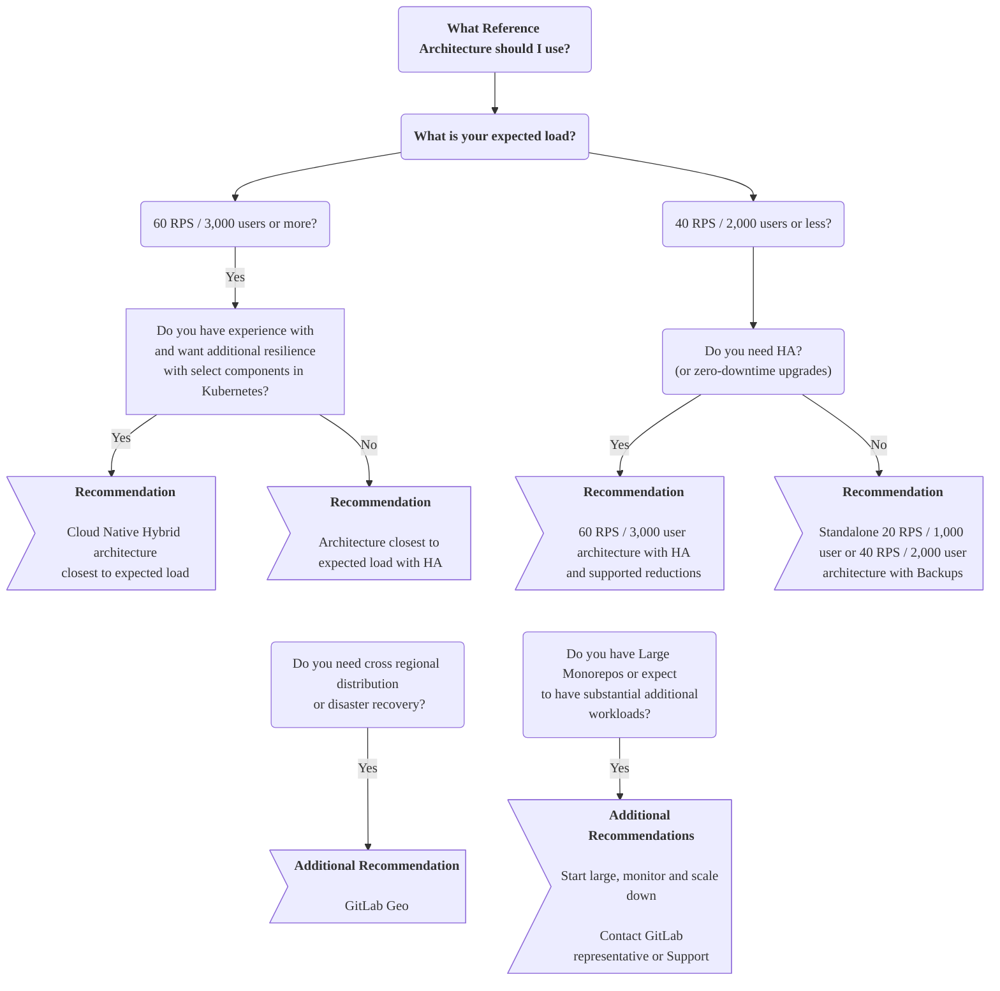



- 티어:  Free, Premium, Ultimate
- 제공 서비스: GitLab Self-Managed



GitLab 참조 아키텍처는 대규모로 GitLab을 배포하기 위한 검증된 프로덕션 준비 환경 설계입니다. 각 아키텍처는 요구사항에 따라 사용하거나 조정할 수 있는 자세한 사양을 제공합니다.

## 시작하기 전에 {#before-you-start}

먼저 GitLab Self-Managed가 귀사와 귀사의 요구사항에 적합한 선택인지 고려합니다.

프로덕션에서 모든 애플리케이션을 실행하는 것은 복잡하며, GitLab도 마찬가지입니다. 최대한 순조롭게 진행하기 위해 노력하지만, 귀사의 설계에 따른 일반적인 복잡성이 여전히 존재합니다. 일반적으로 하드웨어, 운영 체제, 네트워킹, 스토리지, 보안, GitLab 자체 등 모든 측면을 관리해야 합니다. 여기에는 환경의 초기 설정과 장기적인 유지 관리가 포함됩니다.

이 방법을 선택하면 프로덕션에서 애플리케이션을 실행하고 유지하는 실무 지식이 있어야 합니다. 이 입장에 해당하지 않으면 당사의 [Professional Services](https://about.gitlab.com/services/#implementation-services) 팀이 구현 서비스를 제공합니다. 장기적으로 더 관리되는 솔루션을 원하는 고객은 [GitLab.com](../../subscriptions/manage_seats.md#gitlabcom-billing-and-usage) 또는 [GitLab Dedicated](../../subscriptions/gitlab_dedicated/_index.md) 등의 다른 서비스를 살펴볼 수 있습니다.

GitLab Self-Managed 방식을 사용하는 것을 고려 중이면 이 페이지 전체를 읽어보기를 권장하며, 특히 다음 섹션을 참고합니다:

- [시작할 아키텍처 결정](#deciding-which-architecture-to-start-with)
- [대형 모노레포](#large-monorepos)
- [추가 워크로드](#additional-workloads)
- [환경 모니터링 및 조정](#monitoring)

## 시작할 아키텍처 결정 {#deciding-which-architecture-to-start-with}

참조 아키텍처는 성능, 복원력, 비용이라는 세 가지 중요한 요소 간의 균형을 맞추기 위해 설계되었습니다. 일반적인 워크로드 패턴을 기반으로 대규모 GitLab 배포를 위한 검증된 시작점을 제공합니다. 초기 배포를 더 쉽게 만들지만, 대부분의 환경은 [모니터링](#monitoring)을 통해 나타나는 실제 사용 패턴을 기반으로 한 조정으로 이점을 얻습니다. 적절한 시작점을 선택하는 것이 중요하지만, 구체적인 워크로드 특성에 따라 조정할 것으로 예상합니다.

일반적으로 환경이 더 성능이 높거나 복원력이 강할수록 더 복잡합니다.

이 섹션에서는 참조 아키텍처를 선택할 때 고려할 사항을 설명합니다.

### 예상 부하 {#expected-load}

올바른 아키텍처 크기는 주로 환경의 예상 피크 부하에 따라 달라집니다. 초당 요청 수(RPS)는 GitLab 인프라 크기 조정의 주요 메트릭이지만, 다른 요소도 적용될 수 있습니다.

포괄적인 RPS 분석 및 데이터 기반 크기 조정 결정을 위해 [참조 아키텍처 크기 조정](sizing.md)을 참고합니다. 이는 다음을 제공합니다:

- 피크 및 지속적인 RPS 메트릭 추출을 위한 자세한 PromQL 쿼리
- 워크로드 패턴 분석 및 RPS 구성 지침으로 구성 요소별 조정 식별
- 모노리포, 네트워크 사용 및 성장 계획에 대한 평가 방법론

빠른 RPS 예측을 위해 다음과 같은 옵션이 있습니다:

- [Prometheus](../monitoring/prometheus/_index.md#sample-prometheus-queries) 쿼리(예: ):

  ```prometheus
  sum(irate(gitlab_transaction_duration_seconds_count{controller!~'HealthController|MetricsController'}[1m])) by (controller, action)
  ```

- [GitLab RPS Analyzer](https://gitlab.com/gitlab-org/professional-services-automation/tools/utilities/gitlab-rps-analyzer#gitlab-rps-analyzer).
- 기타 모니터링 솔루션.
- 로드 밸런서 통계.

RPS를 결정할 수 없다면 Linux 패키지 및 Cloud Native Hybrid 아키텍처에 대해 사용자 수 등가물이 대체 크기 조정 방법으로 제공됩니다. 이 수는 수동 및 자동 사용을 모두 고려하여 일반적인 RPS 값으로 매핑됩니다.

## 사용 가능한 참조 아키텍처 {#available-reference-architectures}

다음 참조 아키텍처는 환경의 권장 시작점으로 사용 가능합니다.

> [!note]
> 각 아키텍처는 [확장 가능](#scaling-an-environment)하도록 설계되었습니다. 워크로드에 따라 위 또는 아래로 조정할 수 있습니다. 예를 들어 [대형 모노리포](#large-monorepos) 또는 주목할 만한 [추가 워크로드](#additional-workloads)를 사용하는 것과 같은 알려진 무거운 시나리오가 있습니다.

### Linux 패키지(Omnibus) {#linux-package-omnibus}

Linux 패키지 기반 참조 아키텍처는 모든 GitLab 구성 요소를 패키지가 있는 가상 머신에 배포합니다. 일부 구성 요소(PostgreSQL, Redis, Object Storage)는 클라우드 제공자 서비스를 선택적으로 사용할 수 있습니다.

다음 RPS 대상은 일반적인 워크로드 구성을 반영합니다. 비정형적 워크로드의 경우 [RPS 구성 이해](sizing.md#understanding-rps-composition-and-workload-patterns)를 참고합니다.

| 크기                         | API RPS | Web RPS | Git (Pull) RPS | Git (Push) RPS |
|------------------------------|---------|---------|----------------|----------------|
| [1,000명 사용자](1k_users.md)   | 20      | 2       | 2              | 1              |
| [2,000명 사용자](2k_users.md)   | 40      | 4       | 4              | 1              |
| [3,000명 사용자](3k_users.md)   | 60      | 6       | 6              | 1              |
| [5,000명 사용자](5k_users.md)   | 100     | 10      | 10             | 2              |
| [10,000명 사용자](10k_users.md) | 200     | 20      | 20             | 4              |
| [25,000명 사용자](25k_users.md) | 500     | 50      | 50             | 10             |
| [50,000명 사용자](50k_users.md) | 1000    | 100     | 100            | 20             |

### Cloud Native Hybrid {#cloud-native-hybrid}

Cloud Native Hybrid 참조 아키텍처는 Helm Chart를 사용하여 선택된 상태 비저장 구성 요소(Webservice, Sidekiq)를 Kubernetes에 배포하는 한편, 선택된 구성 요소는 가상 머신에 유지되거나 클라우드 제공자 서비스(PostgreSQL, Redis, Object Storage)를 사용합니다.

| 크기                                                                                                 | API RPS | Web RPS | Git (Pull) RPS | Git (Push) RPS |
|------------------------------------------------------------------------------------------------------|---------|---------|----------------|----------------|
| [2,000명 사용자](2k_users.md#cloud-native-hybrid-reference-architecture-with-helm-charts-alternative)   | 40      | 4       | 4              | 1              |
| [3,000명 사용자](3k_users.md#cloud-native-hybrid-reference-architecture-with-helm-charts-alternative)   | 60      | 6       | 6              | 1              |
| [5,000명 사용자](5k_users.md#cloud-native-hybrid-reference-architecture-with-helm-charts-alternative)   | 100     | 10      | 10             | 2              |
| [10,000명 사용자](10k_users.md#cloud-native-hybrid-reference-architecture-with-helm-charts-alternative) | 200     | 20      | 20             | 4              |
| [25,000명 사용자](25k_users.md#cloud-native-hybrid-reference-architecture-with-helm-charts-alternative) | 500     | 50      | 50             | 10             |
| [50,000명 사용자](50k_users.md#cloud-native-hybrid-reference-architecture-with-helm-charts-alternative) | 1000    | 100     | 100            | 20             |

### Cloud Native First(베타) {#cloud-native-first-beta}



- 티어:  Free, Premium, Ultimate
- 제공 서비스: GitLab Self-Managed
- 상태:  베타



Cloud Native First 아키텍처는 워크로드 특성을 기반으로 4개의 표준화된 크기(S/M/L/XL)를 가진 현대적 배포 방법을 목표로 하는 차세대 아키텍처입니다. 이러한 아키텍처는 모든 GitLab 구성 요소를 Kubernetes에 배포하고, PostgreSQL, Redis 및 Object Storage는 관리형 서비스 또는 온프레미스 옵션을 포함한 외부 제3자 솔루션을 사용합니다.

이 아키텍처는 Kubernetes 오케스트레이션을 통해 운영 오버헤드 감소, 배포 단순화 및 복원력 향상을 제공합니다.

| 크기 | 목표 RPS | 워크로드 특성 |
|------|------------|--------------------------|
| Small (S) | ≤100 RPS | 가벼운 전체 부하, 활성 모노리포에 적합하지 않음 |
| Medium (M) | ≤200 RPS | 중간 부하, 가볍게 사용되는 모노리포 지원 |
| Large (L) | ≤500 RPS | 무거운 부하, 중간 정도로 사용되는 모노리포 처리 |
| Extra Large (XL) | ≤1000 RPS | 집약적인 부하, 많이 사용되는 모노리포를 위해 설계됨 |

자세한 정보는 [Cloud Native First 참조 아키텍처](cloud_native_first.md)를 참고합니다.

### 확실하지 않으면 크게 시작하고 모니터링한 다음 축소합니다 {#if-in-doubt-start-large-monitor-and-then-scale-down}

필요한 환경 크기가 확실하지 않으면 더 큰 크기부터 시작하여 [모니터링](#monitoring) 을 수행한 다음 메트릭이 상황을 지원하는 경우 그에 따라 [축소](#scaling-an-environment)하는 것을 고려합니다.

크게 시작한 다음 축소하는 것은 다음과 같은 경우에 신중한 접근 방식입니다:

- RPS를 결정할 수 없습니다.
- 환경 부하가 예상보다 비정상적으로 높을 수 있습니다.
- [대형 모노리포](#large-monorepos) 또는 주목할 만한 [추가 워크로드](#additional-workloads)가 있습니다.

예를 들어 3,000명의 사용자가 있지만 동시 부하를 크게 증가시킬 자동화가 있다는 것을 알고 있으면 100 RPS / 5k User 클래스 환경부터 시작하여 모니터링하고, 메트릭이 지원하면 모든 구성 요소를 한 번에 축소하거나 하나씩 축소할 수 있습니다.

### Standalone (비HA) {#standalone-non-ha}

2,000명 이하의 사용자를 제공하는 환경의 경우 비HA, 단일 또는 다중 노드 환경을 배포하여 Standalone 방식을 따르는 것이 일반적으로 권장됩니다. 이 방식을 사용하면 복구를 위해 [자동 백업](../backup_restore/backup_gitlab.md#configuring-cron-to-make-daily-backups) 같은 전략을 적용할 수 있습니다. 이 전략들은 HA와 관련된 복잡성을 피하면서도 좋은 수준의 복구 시간 목표(RTO) 또는 복구 지점 목표(RPO)를 제공합니다.

Standalone 설정, 특히 단일 노드 환경의 경우 [설치](../../install/_index.md)와 관리를 위한 다양한 옵션이 있습니다. 이 옵션에는 [선택된 클라우드 제공자 마켓플레이스를 사용하여 직접 배포하는 기능](https://page.gitlab.com/cloud-partner-marketplaces.html)이 포함되어 있으며, 이는 복잡성을 더욱 줄입니다.

### 고가용성(HA) {#high-availability-ha}

고가용성은 GitLab 설정의 모든 구성 요소가 다양한 메커니즘을 통해 장애를 처리할 수 있도록 합니다. 그러나 이를 달성하는 것은 복잡하며, 필요한 환경은 상당할 수 있습니다.

3,000명 이상의 사용자를 제공하는 환경의 경우 일반적으로 HA 전략을 사용할 것을 권장합니다. 이 수준에서 중단은 더 많은 사용자에게 더 큰 영향을 미칩니다. 이 범위의 모든 아키텍처는 설계상 HA가 내장되어 있습니다.

#### 고가용성(HA)이 필요합니까? {#do-you-need-high-availability-ha}

앞서 언급했듯이 HA를 달성하는 것은 비용이 따릅니다. 환경 요구사항은 각 구성 요소를 곱해야 하므로 크기가 크며, 이는 추가 실제 비용 및 유지 관리 비용을 초래합니다.

3,000명 미만의 사용자를 가진 많은 고객의 경우 백업 전략이 충분하고 심지어 선호되는 것으로 드러났습니다. 이는 복구 시간이 더 느리지만, 훨씬 더 작은 아키텍처와 그 결과로 유지 관리 비용이 절감됨을 의미합니다.

일반적인 지침으로서, 다음과 같은 시나리오에서만 HA를 사용합니다:

- 3,000명 이상의 사용자가 있을 때.
- GitLab 중단이 워크플로우에 심각한 영향을 미칠 때.

#### 축소된 고가용성(HA) 접근 방식 {#scaled-down-high-availability-ha-approach}

더 적은 사용자를 위해 여전히 HA가 필요하면 [3K 아키텍처](3k_users.md#supported-modifications-for-lower-user-counts-ha)로 조정된 상태에서 달성할 수 있습니다.

#### 무중단 업그레이드 {#zero-downtime-upgrades}

[무중단 업그레이드](../../update/zero_downtime.md) 는 HA가 있는 표준 환경에서 사용 가능합니다(Cloud Native Hybrid는 [지원되지 않음](https://gitlab.com/groups/gitlab-org/cloud-native/-/epics/52)). 이를 통해 업그레이드 중에 환경을 계속 실행할 수 있습니다. 그러나 이 프로세스는 그 결과로 더 복잡하며 설명서에 자세히 나와 있는 일부 제한 사항이 있습니다.

이 프로세스를 거칠 때, HA 메커니즘이 작동할 때 여전히 짧은 중단 시간이 있을 수 있음을 주목할 가치가 있습니다.

대부분의 경우 업그레이드에 필요한 중단 시간은 실질적이지 않습니다. 이 방식을 사용하는 것은 귀사의 주요 요구사항인 경우에만 사용합니다.

### GitLab Geo (지역 간 분산 / 재해 복구) {#gitlab-geo-cross-regional-distribution--disaster-recovery}

[GitLab Geo](../geo/_index.md)를 사용하면 전체 재해 복구(DR) 설정이 제자리에 있는 다양한 지역에 분산된 환경을 달성할 수 있습니다. GitLab Geo는 최소 두 개의 별도 환경이 필요합니다:

- 하나의 기본 사이트.
- 복제본으로 제공하는 하나 이상의 보조 사이트.

기본 사이트가 사용 불가능하면 보조 사이트 중 하나로 장애 조치할 수 있습니다.

> [!note]
> 환경에 대한 주요 요구사항인 경우에만 이 **advanced and complex** 설정을 사용합니다. 또한 각 사이트를 구성하는 방법에 대해 추가 결정을 해야 합니다. 예를 들어 각 보조 사이트가 기본 사이트와 동일한 아키텍처인지 또는 각 사이트가 HA에 대해 구성되어 있는지 여부입니다.

### 대형 모노리포 / 추가 워크로드 {#large-monorepos--additional-workloads}

[대형 모노리포](#large-monorepos) 또는 상당한 [추가 워크로드](#additional-workloads)는 환경의 성능에 큰 영향을 미칠 수 있습니다. 상황에 따라 일부 조정이 필요할 수 있습니다.

이러한 요소를 포괄적으로 분석하려면 [참조 아키텍처 크기 조정](sizing.md)을 참고합니다. 이는 다음을 제공합니다:

- 인프라에 대한 모노리포 영향의 자세한 평가 방법론.
- 다양한 워크로드 패턴을 위한 구성 요소별 확장 권장사항.
- 대용량 데이터 전송 시나리오에 대한 네트워크 대역폭 분석.

이 상황이 귀사에 적용되면 GitLab 담당자 또는 당사의 [지원 팀](https://about.gitlab.com/support/)에 연락하여 추가 지침을 받습니다.

### 클라우드 제공자 서비스 {#cloud-provider-services}

이전에 설명한 모든 전략에 대해 PostgreSQL 데이터베이스 또는 Redis와 같은 동등한 클라우드 제공자 서비스에서 선택된 GitLab 구성 요소를 실행할 수 있습니다.

자세한 정보는 [권장 클라우드 제공자 및 서비스](#recommended-cloud-providers-and-services)를 참고합니다.

### 의사결정 트리 {#decision-tree}

다음 의사결정 트리를 참고하기 전에 먼저 이전에 문서화된 지침을 전체적으로 읽어보세요.



> [!note]
> 위의 의사결정 트리는 프로덕션 준비 아키텍처를 반영합니다. Gitaly를 포함한 완전히 Kubernetes 네이티브 배포는 [Cloud Native First (Beta)](cloud_native_first.md)를 참고합니다. 이는 현재 베타 상태이며 아직 프로덕션 사용을 권장하지 않습니다.

## 요구 사항 {#requirements}

참조 아키텍처를 구현하기 전에 다음 요구사항 및 지침을 참고합니다.

### 지원되는 머신 유형 {#supported-machine-types}

아키텍처는 일관된 성능을 보장하면서 머신 유형 선택에 유연하도록 설계되었습니다. 각 참조 아키텍처에서 구체적인 머신 유형 예를 제공하지만 이는 규범적 기본값으로 의도되지 않았습니다.

각 구성 요소에 대해 지정된 요구사항을 충족하거나 초과하는 모든 머신 유형을 사용할 수 있습니다. 예:

- 최신 생성 머신 유형(예: GCP `n2` 시리즈 또는 AWS `m6` 시리즈)
- ARM 기반 인스턴스와 같은 다른 아키텍처(예: AWS Graviton)
- 구체적인 워크로드 특성(예: 더 높은 네트워크 대역폭)을 더 잘 일치시키는 대체 머신 유형 패밀리

이 지침은 AWS RDS와 같은 모든 클라우드 제공자 서비스에도 적용 가능합니다.

> [!note]
> "버스트 가능" 인스턴스 유형은 불일치한 성능으로 인해 권장되지 않습니다.

우리가 어떤 머신 유형을 테스트하고 어떻게 테스트하는지에 대한 자세한 정보는 [검증 및 테스트 결과](#validation-and-test-results)를 참고합니다.

### 지원되는 디스크 유형 {#supported-disk-types}

대부분의 표준 디스크 유형은 GitLab에서 작동할 것으로 예상됩니다. 그러나 다음의 특정 주의사항을 주의하세요:

- Gitaly는 Gitaly 저장소에 대한 특정 [디스크 요구 사항](../gitaly/_index.md#disk-requirements)을 가지고 있습니다.
- 불일치한 성능으로 인해 "버스트 가능" 디스크 유형의 사용을 권장하지 않습니다.

기타 디스크 유형은 GitLab과 함께 작동할 것으로 예상됩니다. 내구성이나 비용 같은 요구사항에 따라 선택합니다.

### 지원되는 인프라 {#supported-infrastructure}

GitLab은 평판이 좋은 클라우드 제공자(AWS, GCP, Azure) 및 이들의 서비스 또는 자체 관리(ESXi)와 같은 대부분의 인프라에서 실행되어야 합니다. 다음을 모두 충족합니다:

- 각 아키텍처에 자세히 설명된 사양.
- 이 섹션의 모든 요구사항.

그러나 이것이 모든 잠재적 순열과의 호환성을 보장하지는 않습니다.

자세한 내용은 [권장 클라우드 공급자 및 서비스](#recommended-cloud-providers-and-services)를 참조하세요.

### 네트워킹 (고가용성) {#networking-high-availability}

다음은 고가용성 방식으로 GitLab을 실행하기 위한 네트워크 요구사항입니다.

#### 네트워크 지연 {#network-latency}

네트워크 지연은 데이터베이스 복제와 같은 GitLab 애플리케이션 전체에서 동기 복제를 허용할 수 있도록 최대한 낮아야 합니다. 일반적으로 5ms 미만이어야 합니다.

#### 가용성 영역 (클라우드 제공자) {#availability-zones-cloud-providers}

가용성 영역에 걸쳐 배포하는 것이 지원되며 추가 복원력을 위해 일반적으로 권장됩니다. 일부 구성 요소가 쿼럼 투표를 위해 홀수 개의 노드를 사용하므로 GitLab 애플리케이션 요구사항에 맞추기 위해 홀수 개의 영역을 사용해야 합니다.

#### 데이터 센터 (자체 호스팅) {#data-centers-self-hosted}

여러 자체 호스팅 데이터 센터에 걸쳐 배포하는 것이 가능하지만 신중한 고려가 필요합니다. 이것은 센터 간 동기화 가능 지연, 분리 현상을 방지하기 위한 강력한 중복 네트워크 링크, 동일 지리적 영역에 위치한 모든 센터, 적절한 쿼럼 투표를 위해 홀수 개의 센터에 걸친 배포([가용성 영역](#availability-zones-cloud-providers)처럼)가 필요합니다.

> [!warning]
> 다중 데이터 센터 배포로 인한 인프라 관련 이슈를 GitLab 지원이 지원할 수 없을 수 있습니다. 센터에 걸쳐 배포하도록 선택하는 것은 일반적으로 귀사의 위험입니다. 또한 [GitLab 환경을 다양한 지역에 걸쳐](#deploying-one-environment-over-multiple-regions) 단일 배포하는 것은 지원되지 않습니다. 데이터 센터는 동일한 지역에 있어야 합니다.

### 대형 모노리포 {#large-monorepos}

아키텍처는 베스트 프랙티스를 따르는 다양한 크기의 리포지토리로 테스트되었습니다.

그러나 [대형 모노리포](../../user/project/repository/monorepos/_index.md)(몇 기가바이트 이상)는 Git의 성능과 결국 환경 자체에 상당한 영향을 미칠 수 있습니다. 이들의 존재와 사용 방식은 Gitaly에서 기반 인프라까지 전체 시스템에 상당한 부담을 줄 수 있습니다.

성능상 영향은 주로 소프트웨어 성격입니다. 추가 하드웨어 리소스는 수익 감소로 이어집니다.

> [!warning]
> 이것이 귀사에 적용되면 링크된 설명서를 따르고 GitLab 담당자 또는 당사의 [지원 팀](https://about.gitlab.com/support/)에 연락하여 추가 지침을 받을 것을 강력히 권장합니다.

대형 모노리포는 상당한 비용이 따릅니다. 이러한 리포지토리가 있으면 다음 지침을 따라 좋은 성능을 보장하고 비용을 조절합니다:

- [대형 모노리포 최적화](../../user/project/repository/monorepos/_index.md). [LFS](../../user/project/repository/monorepos/_index.md#use-git-lfs-for-large-binary-files)를 사용하여 바이너리를 저장하지 않고 리포지토리 크기를 줄이기 위한 다른 접근 방식과 같은 기능을 사용하면 성능을 크게 향상시키고 비용을 줄일 수 있습니다.
- 모노리포에 따라 보상하기 위해 증가된 환경 사양이 필요할 수 있습니다. Gitaly는 Praefect, GitLab Rails 및 로드 밸런서와 함께 추가 리소스가 필요할 수 있습니다. 이는 모노리포 자체 및 그 사용법에 따라 다릅니다.
- 모노리포가 상당히 큰 경우(20기가바이트 이상)에는 훨씬 더 증가된 사양과 같은 추가 전략 또는 경우에 따라 모노리포 단독의 별도 Gitaly 백엔드가 필요할 수 있습니다.
- 네트워크 및 디스크 대역폭은 대형 모노리포와 관련된 또 다른 잠재적 고려사항입니다. 매우 무거운 경우 많은 동시 클론(CI와 같은)이 있을 경우 대역폭 포화가 가능합니다. 이 시나리오에서는 가능한 한 [전체 클론 축소](../../user/project/repository/monorepos/_index.md#reduce-concurrent-clones-in-cicd). 그렇지 않으면 대역폭을 증가시키기 위해 추가 환경 사양이 필요할 수 있습니다. 이는 클라우드 제공자에 따라 다릅니다.

### 추가 워크로드 {#additional-workloads}

이 아키텍처는 실제 데이터를 기반으로 표준 GitLab 설정에 대해 [설계 및 테스트](#validation-and-test-results)되었습니다.

그러나 추가 워크로드는 후속 작업을 트리거하여 작업의 영향을 곱할 수 있습니다. 다음을 사용하면 제안된 사양을 조정해야 할 수 있습니다:

- 노드의 보안 소프트웨어.
- [대형 리포지토리](../../user/project/repository/monorepos/_index.md)에 대한 수백 개의 동시 CI 작업.
- [높은 빈도로 실행](../logs/log_parsing.md#print-top-api-user-agents)되는 사용자 지정 스크립트.
- 많은 대형 프로젝트의 [통합](../../integration/_index.md).
- 큰 사용자 기반을 가진 프로젝트의 [기능 플래그](../../operations/feature_flags.md#performance-factors).
- [서버 훅](../server_hooks.md).
- [시스템 훅](../system_hooks.md).

일반적으로 모든 추가 워크로드의 영향을 측정하여 필요한 변경 사항을 통보할 강력한 모니터링이 있어야 합니다. GitLab 담당자 또는 당사의 [지원 팀](https://about.gitlab.com/support/)에 연락하여 추가 지침을 받습니다.

### 로드 밸런서 {#load-balancers}

아키텍처는 클래스에 따라 최대 두 개의 로드 밸런서를 사용합니다:

- 외부 로드 밸런서 - 주로 Rails인 외부 대면 구성 요소로 트래픽을 제공합니다.
- 내부 로드 밸런서 - Praefect 또는 PgBouncer와 같은 HA 방식으로 배포되는 선택된 내부 구성 요소로 트래픽을 제공합니다.

사용할 로드 밸런서나 그 정확한 구성의 세부사항은 GitLab 설명서의 범위를 벗어납니다. 가장 일반적인 옵션은 머신 노드에 로드 밸런서를 설정하거나 클라우드 제공자가 제공하는 서비스와 같은 서비스를 사용하는 것입니다. Cloud Native Hybrid 환경을 배포하는 경우 차트는 Kubernetes Ingress를 사용하여 외부 로드 밸런서 설정을 처리할 수 있습니다.

각 아키텍처 클래스에는 머신에 직접 배포할 권장 기본 머신 크기가 포함됩니다. 그러나 선택된 로드 밸런서 및 예상 워크로드와 같은 요소를 기반으로 조정이 필요할 수 있습니다. 머신은 다양한 [네트워크 대역폭](#network-bandwidth)을 가질 수 있으므로 이것도 고려해야 합니다.

다음 섹션에서는 로드 밸런서에 대한 추가 지침을 제공합니다.

#### 균형 조정 알고리즘 {#balancing-algorithm}

노드에 대한 호출의 균등한 분산 및 좋은 성능을 보장하려면 최소 연결 기반 로드 밸런싱 알고리즘을 사용하거나 가능한 한 동등한 것을 사용합니다.

라운드 로빈 알고리즘 사용은 권장하지 않습니다. 실제로 연결을 균등하게 분산하지 못하는 것으로 알려져 있습니다.

#### 네트워크 대역폭 {#network-bandwidth}

머신에 배포할 때 로드 밸런서에서 사용 가능한 총 네트워크 대역폭은 클라우드 제공자에 따라 상당히 다를 수 있습니다. [AWS](https://docs.aws.amazon.com/AWSEC2/latest/UserGuide/ec2-instance-network-bandwidth.html)와 같은 일부 클라우드 제공자는 언제든지 대역폭을 결정하기 위해 크레딧이 있는 버스트 시스템에서 작동할 수 있습니다.

로드 밸런서에 필요한 네트워크 대역폭은 데이터 형태 및 워크로드와 같은 요소에 따라 다릅니다. 각 아키텍처 클래스에 대한 권장 기본 크기는 실제 데이터를 기반으로 선택되었습니다. 그러나 [대형 모노리포](#large-monorepos) 의 일관된 클론, [GitLab 컨테이너 레지스트리](../../user/packages/container_registry/_index.md)의 많은 사용, 대형 CI 아티팩트 또는 대용량 파일의 빈번한 전송과 관련된 워크로드와 같은 일부 시나리오에서는 크기를 적절히 조정해야 할 수 있습니다.

### 스왑 없음 {#no-swap}

스왑은 참조 아키텍처에서 권장되지 않습니다. 성능에 크게 영향을 미치는 안전장치입니다. 아키텍처는 대부분의 경우 스왑의 필요성을 피하기 위해 충분한 메모리를 가지도록 설계되었습니다.

### Praefect PostgreSQL {#praefect-postgresql}

[Praefect는 자신의 데이터베이스 서버가 필요](../gitaly/praefect/configure.md#postgresql)합니다. 전체 HA를 달성하려면 타사 PostgreSQL 데이터베이스 솔루션이 필요합니다.

향후 이러한 제한에 대한 기본 제공 솔루션을 제공하기를 희망합니다. 그 동안에는 비HA PostgreSQL 서버를 Linux 패키지를 사용하여 설정할 수 있으며 사양은 반영됩니다. 자세한 정보는 다음 이슈를 참고합니다:

- [`omnibus-gitlab#7292`](https://gitlab.com/gitlab-org/omnibus-gitlab/-/issues/7292).
- [`gitaly#3398`](https://gitlab.com/gitlab-org/gitaly/-/issues/3398).

## 권장 클라우드 제공자 및 서비스 {#recommended-cloud-providers-and-services}

> [!note]
> 다음 목록은 완전하지 않습니다. 여기에 나열되지 않은 기타 클라우드 제공자는 동일한 사양으로 작동할 수 있지만 검증되지 않았습니다. 여기에 나열되지 않은 클라우드 제공자 서비스의 경우 각 구현이 상당히 다를 수 있으므로 주의를 사용하세요. 프로덕션에서 사용하기 전에 철저히 테스트합니다.

다음 아키텍처는 테스트 및 실제 사용 기반의 다음 클라우드 제공자에 권장됩니다:

| 참조 아키텍처 | GCP         | AWS         | Azure                    | 베어 메탈  |
|------------------------|-------------|-------------|--------------------------|-------------|
| [Linux 패키지](#linux-package-omnibus)          |  |  |  <sup>1</sup> |  |
| [Cloud Native Hybrid](#cloud-native-hybrid)    |  |  |                          |             |
| [Cloud Native First](cloud_native_first.md)(베타) |  |  |  |  |

또한 다음 클라우드 제공자 서비스는 아키텍처의 일부로 사용하기 위해 권장됩니다:

| 클라우드 서비스  | GCP                                                    | AWS                                                | Azure                                                                                                   | 베어 메탈               |
|----------------|--------------------------------------------------------|----------------------------------------------------|---------------------------------------------------------------------------------------------------------|--------------------------|
| Object Storage | [Cloud Storage](https://cloud.google.com/storage)      | [S3](https://aws.amazon.com/s3/)                   | [Azure Blob Storage](https://azure.microsoft.com/en-gb/products/storage/blobs)                          | S3 호환 object storage |
| 데이터베이스       | [Cloud SQL](https://cloud.google.com/sql) <sup>2</sup> | [RDS](https://aws.amazon.com/rds/)                 | [Azure Database for PostgreSQL Flexible Server](https://azure.microsoft.com/en-gb/products/postgresql/) |                          |
| Redis          | [Memorystore](https://cloud.google.com/memorystore)    | [ElastiCache](https://aws.amazon.com/elasticache/) | [Azure Cache for Redis (Premium)](https://azure.microsoft.com/en-gb/products/cache)                     |                          |

<!-- Disable ordered list rule <https://github.com/DavidAnson/markdownlint/blob/main/doc/Rules.md#md029---ordered-list-item-prefix> -->
<!-- markdownlint-disable MD029 -->
1. 좋은 성능을 보장하려면 [Azure Cache for Redis의 Premium 티어](https://learn.microsoft.com/en-us/azure/azure-cache-for-redis/cache-overview#service-tiers)를 배포합니다.
2. 최적 성능, 특히 더 큰 환경(500 RPS / 25k 사용자 이상)의 경우 GCP Cloud SQL에 [Enterprise Plus 버전](https://cloud.google.com/sql/docs/editions-intro)을 사용합니다. 워크로드에 따라 서비스 기본값보다 최대 연결을 높이기 위해 조정해야 할 수 있습니다.
<!-- markdownlint-enable MD029 -->

### 데이터베이스 서비스에 대한 베스트 프랙티스 {#best-practices-for-the-database-services}

Linux 패키지 번들 PostgreSQL, PgBouncer 및 Consul 서비스 검색 구성 요소 대신 [PostgreSQL용 타사 외부 서비스](../postgresql/external.md)를 사용할 수 있습니다.

[지원되는 PostgreSQL 버전](../../install/requirements.md#postgresql)을 실행하는 평판이 좋은 공급자를 사용하세요. 다음 서비스는 잘 작동하는 것으로 알려져 있습니다:

- [Google Cloud SQL](https://cloud.google.com/sql/docs/postgres/high-availability#normal).
- [Amazon RDS](https://aws.amazon.com/rds/).

#### 구성 고려사항 {#configuration-considerations}

외부 데이터베이스 서비스를 사용할 때 다음을 고려합니다:

- 최적 성능을 위해 읽기 복제본을 포함하여 [데이터베이스 로드 밸런싱](../postgresql/database_load_balancing.md)을 활성화합니다. 노드 수를 표준 Linux 패키지 배포에 사용되는 수와 일치시킵니다. 이 방식은 더 큰 환경(초당 200개 이상의 요청 또는 10,000명 이상의 사용자)에 특히 중요합니다.
- 고가용성 노드 요구사항은 서비스마다 다를 수 있으며 Linux 패키지 설치와 다를 수 있습니다.
- [GitLab Geo](../geo/_index.md)의 경우 서비스가 지역 간 복제를 지원하는지 확인합니다.

#### 연결 관리 {#connection-management}

외부 데이터베이스 서비스로 최적 연결 처리:

- [데이터베이스 로드 밸런싱](../postgresql/database_load_balancing.md)을 사용하여 읽기 복제본에 걸쳐 연결을 분산합니다.
- PostgreSQL 연결 수 구성을 환경 크기 및 워크로드에 맞춰 조정합니다. 성능에 따라 모니터링하고 조정합니다.
- 추가 연결 풀링이 필요한 경우 자신의 PgBouncer를 배포합니다. 기타 타사 풀링 솔루션이 작동할 수 있지만 검증되지 않았습니다.

클라우드 제공자 풀링 서비스에는 다음과 같은 제한이 있으며 호환되지 않거나 권장되지 않습니다:

- [AWS RDS Proxy](https://aws.amazon.com/rds/proxy/):  GitLab과 함께 사용하기 위해 검증되지 않았습니다.
- [Azure Database for PostgreSQL PgBouncer](https://learn.microsoft.com/en-us/azure/postgresql/connectivity/concepts-pgbouncer):  관찰성이 제한된 단일 스레드 아키텍처. 높은 부하에서 병목 현상을 유발할 수 있습니다.

> [!note]
> GitLab 번들 PgBouncer는 번들 PostgreSQL에서만 작동하며 외부 데이터베이스 서비스와 함께 사용할 수 없습니다.

#### 데이터베이스 서비스 호환성 {#database-service-compatibility}

다음 데이터베이스 클라우드 제공자 서비스는 호환되지 않거나 권장되지 않습니다:

- [Amazon Aurora](https://aws.amazon.com/rds/aurora/)는 호환되지 않으며 지원되지 않습니다. 자세한 정보는 [14.4.0](https://archives.docs.gitlab.com/17.3/ee/update/versions/gitlab_14_changes/#1440)을 참고합니다.
- [Google AlloyDB](https://cloud.google.com/alloydb) 및 [Amazon RDS Multi-AZ DB 클러스터](https://docs.aws.amazon.com/AmazonRDS/latest/UserGuide/multi-az-db-clusters-concepts.html)는 테스트되지 않았으며 권장되지 않습니다. 두 솔루션 모두 GitLab Geo에서 작동할 것으로 예상되지 않습니다.
  - [Amazon RDS Multi-AZ DB 인스턴스](https://docs.aws.amazon.com/AmazonRDS/latest/UserGuide/Concepts.MultiAZSingleStandby.html)는 별도의 제품이며 지원됩니다.

### Redis 서비스에 대한 베스트 프랙티스 {#best-practices-for-redis-services}

표준, 성능 및 지원되는 버전을 실행하는 [외부 Redis 서비스](../redis/replication_and_failover_external.md#redis-as-a-managed-service-in-a-cloud-provider)를 사용합니다. 서비스는 다음을 지원해야 합니다:

- Redis Standalone (Primary x Replica) 모드 - Redis Cluster 모드는 특별히 지원되지 않습니다.
- 복제를 통한 고가용성
- [Redis 제거 정책](../redis/replication_and_failover_external.md#setting-the-eviction-policy)을 설정하는 기능

Redis는 주로 단일 스레드입니다. 200 RPS / 10,000 사용자 클래스 이상을 대상으로 하는 환경의 경우 인스턴스를 캐시 및 지속적인 데이터로 분리하여 최적 성능을 달성합니다.

> [!note]
> Redis 서비스의 서버리스 변형은 현재 지원되지 않습니다.

### object storage에 대한 베스트 프랙티스 {#best-practices-for-object-storage}

GitLab은 작동할 것으로 예상되는 [다양한 object storage 제공자](../object_storage.md#object-storage-provider-support)에 대해 테스트되었습니다.

전체 S3 호환성이 있는 평판이 좋은 솔루션을 사용합니다.

## 제안된 참조 아키텍처에서 벗어나기 {#deviating-from-the-suggested-reference-architectures}

참조 아키텍처에서 멀어질수록 지원을 받기가 더 어려워집니다. 각 편차에서 복잡성을 도입하므로 잠재적 이슈 해결을 복잡하게 합니다.

이 아키텍처는 공식 Linux 패키지 또는 [Helm Chart](https://docs.gitlab.com/charts/)를 사용하여 다양한 구성 요소를 설치하고 구성합니다. 구성 요소는 별도의 머신(가상화 또는 베어 메탈)에 설치됩니다. 머신 하드웨어 요구사항이 특정 참조 아키텍처 페이지의 "Configuration" 열에 나열됩니다. 동등한 VM 표준 크기는 각 [사용 가능한 아키텍처](#available-reference-architectures)의 GCP/AWS/Azure 열에 나열됩니다.

Docker Compose를 포함한 Docker에서 GitLab 구성 요소를 실행할 수 있습니다. Docker는 잘 지원되며 환경 전체에 일관된 사양을 제공합니다. 그러나 여전히 추가 계층이며 일부 지원 복잡성을 추가할 수 있습니다. 예를 들어 컨테이너에서 `strace`를 실행할 수 없습니다.

### 지원되지 않는 설계 {#unsupported-designs}

GitLab 환경 설계에 대한 좋은 범위의 지원을 제공하려고 시도하지만, 특정 방법은 효과적으로 작동하지 않습니다. 다음 섹션에서는 이러한 지원되지 않는 방법을 자세히 설명합니다.

#### Kubernetes의 상태 저장 구성 요소 {#stateful-components-in-kubernetes}

[Postgres 및 Redis와 같은 Kubernetes에서 상태 저장 구성 요소를 실행하는 것은 지원되지 않습니다](https://docs.gitlab.com/charts/installation/#configure-the-helm-chart-to-use-external-stateful-data).

지원되지 않는 것으로 구체적으로 호출되지 않은 한 다른 지원되는 클라우드 제공자 서비스를 사용할 수 있습니다.

개별 Gitaly 노드는 [제한적 출시](../gitaly/kubernetes.md#timeline)에서 Kubernetes에 배포될 수 있습니다. 이는 각 리포지토리가 단일 노드에 저장되는 비HA 솔루션을 제공합니다. Gitaly 배포 옵션 및 제한에 대한 컨텍스트는 [Kubernetes의 Gitaly](../gitaly/kubernetes.md#context)를 참고합니다.

완전히 클라우드 네이티브 설정의 일부로 Kubernetes에 Gitaly를 배포하는 참조 아키텍처는 [Cloud Native First 참조 아키텍처(베타)](cloud_native_first.md)를 참고합니다.

#### 상태 저장 노드의 자동 크기 조정 {#autoscaling-of-stateful-nodes}

일반적인 지침으로서, GitLab의 상태 비저장 구성 요소, 즉 GitLab Rails 및 Sidekiq만 자동 크기 조정 그룹에서 실행할 수 있습니다. Gitaly와 같은 상태를 가진 기타 구성 요소는 이 방식으로 지원되지 않습니다. 자세한 정보는 [이슈 2997](https://gitlab.com/gitlab-org/gitaly/-/issues/2997)을 참고합니다.

이는 Postgres 및 Redis와 같은 상태 저장 구성 요소에 적용됩니다. 지원되지 않는 것으로 구체적으로 호출되지 않은 한 다른 지원되는 클라우드 제공자 서비스를 사용할 수 있습니다.

[Cloud Native Hybrid 설정](#cloud-native-hybrid)은 일반적으로 자동 크기 조정 그룹을 통해 선호됩니다. Kubernetes는 데이터베이스 마이그레이션 및 [Mailroom](../incoming_email.md)과 같은 하나의 노드에서만 실행할 수 있는 구성 요소를 더 잘 처리합니다.

#### 하나의 환경을 여러 지역에 걸쳐 배포 {#deploying-one-environment-over-multiple-regions}

GitLab은 단일 환경을 여러 지역에 걸쳐 배포하는 것을 지원하지 않습니다. 이러한 설정은 과도한 네트워크 지연 또는 지역 간 연결이 실패하는 경우 분리 현상과 같은 상당한 이슈를 야기할 수 있습니다.

여러 GitLab 구성 요소는 동기 복제를 수행하거나 Consul, Redis Sentinel 및 Praefect와 같이 올바르게 기능하기 위해 홀수 개의 노드가 필요합니다. 이 구성 요소를 높은 지연으로 여러 지역에 걸쳐 분산하면 기능 및 전체 시스템 성능에 심각한 영향을 미칠 수 있습니다.

이 제한은 Cloud Native Hybrid 대안을 포함한 모든 잠재적 GitLab 환경 설정에 적용됩니다.

여러 데이터 센터 또는 지역에 걸쳐 GitLab을 배포하기 위해 [GitLab Geo](../geo/_index.md)를 종합 솔루션으로 제공합니다.

## 검증 및 테스트 결과 {#validation-and-test-results}

GitLab은 이 아키텍처를 규정을 준수하도록 유지하기 위해 정기적인 스모크 및 성능 테스트를 수행합니다.

### 테스트를 수행하는 방법 {#how-we-perform-the-tests}

테스트는 샘플 고객 데이터에서 파생된 특정 코드 워크로드를 사용하여 수행되며, 환경 배포를 위한 [GitLab Environment Toolkit (GET)](https://gitlab.com/gitlab-org/gitlab-environment-toolkit) (Terraform 및 Ansible 포함)과 k6을 사용한 성능 테스트를 위한 [GitLab Performance Tool (GPT)](https://gitlab.com/gitlab-org/quality/performance)를 모두 활용합니다.

테스트는 주로 GCP 및 AWS에서 표준 컴퓨팅 오퍼링(GCP의 경우 n1 시리즈, AWS의 경우 m5 시리즈)을 기본 구성으로 사용하여 수행됩니다. 이 머신 유형은 광범위한 호환성을 보장하기 위해 최소 공통 분모 대상으로 선택되었습니다. CPU 및 메모리 요구사항을 충족하는 다양하거나 최신 머신 유형을 사용하는 것은 완전히 지원됩니다. 자세한 정보는 [지원되는 머신 유형](#supported-machine-types)을 참고합니다. 아키텍처는 사양을 충족하는 다른 하드웨어에서 유사하게 성능을 발휘할 것으로 예상되며, 다른 클라우드 제공자 또는 온프레미스 여부입니다.

### 성능 대상 {#performance-targets}

각 참조 아키텍처는 실제 고객 데이터를 기반으로 특정 처리량 대상에 대해 테스트됩니다. 1,000명의 사용자마다 테스트합니다:

- API:  20 RPS
- Web:  2 RPS
- Git (Pull):  2 RPS
- Git (Push):  0.4 RPS (가장 가까운 정수로 반올림)

나열된 RPS 대상은 CI 및 기타 워크로드를 포함하여 사용자 수에 해당하는 총 환경 부하의 실제 고객 데이터를 기반으로 선택되었습니다.

> [!note]
>
> - 이 RPS 분석은 일반적인 워크로드 패턴을 기반으로 한 테스트 대상을 나타냅니다. 실제 워크로드 구성은 다를 수 있습니다. 특정 RPS 구성을 평가하고 조정이 필요한 경우에 대한 지침은 [RPS 구성 이해](sizing.md#understanding-rps-composition-and-workload-patterns)를 참고합니다.
> - 테스트 환경의 구성 요소 간 네트워크 지연은 <5ms에서 관찰되었으나 이는 하드 요구사항으로 의도되지 않습니다.

### 테스트 적용 범위 및 결과 {#test-coverage-and-results}

테스트는 Linux 패키지 및 Cloud Native 환경에 걸쳐 참조 아키텍처 대상에 대해 좋은 적용 범위를 제공하도록 효과적으로 설계되었습니다. 테스트되는 특정 환경 및 구성은 최적 적용 범위 및 비용 대 가치 균형을 보장하기 위해 정기적으로 검토되며 시간이 지남에 따라 변경될 수 있습니다.

테스트에는 향후 포함 가능성을 위해 탐색 중인 이 아키텍처의 프로토타입 변형도 포함됩니다. 테스트 결과는 [참조 아키텍처 wiki](https://gitlab.com/gitlab-org/reference-architectures/-/wikis/Benchmarks/Latest)에서 공개적으로 사용 가능합니다.

## 참조 아키텍처 환경 유지 관리 {#maintaining-a-reference-architecture-environment}

참조 아키텍처 환경 유지 관리는 일반적으로 다른 GitLab 환경과 동일합니다.

이 섹션에서는 관련 영역 및 특정 아키텍처 참고사항에 대한 설명서 링크를 찾을 수 있습니다.

### 환경 확장 {#scaling-an-environment}

참조 아키텍처는 최종 구성이 아니라 일반적인 워크로드 패턴을 기반으로 한 검증된 시작점으로 설계되었습니다. 대부분의 프로덕션 배포는 모니터링을 통해 나타나는 실제 사용 패턴에 따른 조정으로 이점을 얻습니다. 아키텍처는 전체적으로 확장 가능하며 워크로드 특성이 명확해짐에 따라 반복적으로 조정할 수 있습니다. 확장은 메트릭이 지속적인 리소스 압박을 나타낼 때 구성 요소별 또는 다음 아키텍처 크기까지 대량으로 수행할 수 있습니다.

> [!note]
> 구성 요소가 지속적으로 주어진 리소스를 소진하는 경우 상당한 확장을 수행하기 전에 당사의 [지원 팀](https://about.gitlab.com/support/)에 연락합니다.

#### 확장할 시기 {#when-to-scale}

대부분의 배포는 실제 워크로드 패턴을 관찰한 후 조정의 이점을 얻습니다. 확장을 트리거하는 일반적인 시나리오:

**Resource sizing adjustments:**

- API 트래픽이 총 RPS의 90%를 초과할 때 특히 API 무거운 워크로드에 대한 Webservice/Rails 용량 증가([RPS 구성 이해](sizing.md#understanding-rps-composition-and-workload-patterns) 참고)
- 모노리포 무거운 환경 또는 리포지토리 크기가 2GB를 초과할 때 Gitaly 확장([구성 요소 조정 식별](sizing.md#identify-component-adjustments) 참고)
- 높은 CI/CD 처리량 또는 무거운 백그라운드 작업 처리를 위해 Sidekiq 워커 조정

**Configuration tuning:**

- 동시 액세스 패턴을 기반으로 Gitaly 리포지토리 cgroup 수 설정([Gitaly cgroups](../gitaly/cgroups.md) 참고)
- 작업 처리 최적화를 위해 Sidekiq 큐 우선순위 구성([특정 작업 클래스 처리](../sidekiq/processing_specific_job_classes.md) 참고)

**Architecture refinements:**

- 읽기 많은 워크로드에 대한 PostgreSQL 읽기 복제본 추가
- 다양한 작업 유형을 위해 Sidekiq를 특화된 풀로 분할
- 트래픽 급증이 있는 환경에 대한 최소 인스턴스 수 조정

이 조정은 일반적이고 예상됩니다. 참조 아키텍처는 기초를 제공하지만 특정 워크로드 모니터링이 최적 구성을 결정합니다. 환경의 체계적인 평가는 [참조 아키텍처 크기 조정](sizing.md)을 참고합니다.

#### GitLab Duo Agent Platform 확장 {#scaling-for-gitlab-duo-agent-platform}

GitLab Duo Agent Platform은 표준 GitLab 워크로드 이상의 추가 인프라 요구사항을 도입합니다. Agent Platform 워크플로우는 GitLab Rails API를 통해 실행되고, Sidekiq를 통해 비동기적으로 작업을 처리하며, 코드 컨텍스트 및 분석을 위해 리포지토리 데이터에 액세스합니다.

주요 구성 요소 영향:

- **Rails (Webservice/Puma)** \- Agent Platform API 요청은 전체 요청 부하에 추가되며 AI 응답 스트리밍에 대한 WebSocket 연결은 Workhorse에서 관리합니다.
- **Sidekiq** \- AI 완성 작업 및 워크플로우 상태 업데이트는 백그라운드 작업으로 처리됩니다.
- **PostgreSQL** \- Agent 워크플로우 세션 및 상태 데이터는 데이터베이스에 저장됩니다.
- **Gitaly** \- 에이전트 생성 변경을 위한 코드 컨텍스트 및 커밋 작업에 대한 리포지토리 파일 액세스

Agent Platform 채택을 계획하는 환경:

- 표준 워크로드 RPS를 기반으로 권장 아키텍처 크기 배포
- 초기 롤아웃 중 Rails CPU 사용률 모니터링
- Sidekiq CPU 사용률 및 작업 큐 깊이 모니터링
- 워크플로우 상태 관리에서 증가된 트랜잭션 속도에 대한 PostgreSQL 모니터링
- 코드 분석 기능에서 증가된 파일 액세스 패턴에 대한 Gitaly 모니터링

이 구성 요소를 모니터링하는 예제 Prometheus 쿼리는 [샘플 Prometheus 쿼리](../monitoring/prometheus/_index.md#sample-prometheus-queries)를 참고합니다.

지속적인 리소스 압박을 관찰하면 영향받은 구성 요소를 확장하여 용량을 증가시킵니다. Kubernetes 배포에서는 포드 복제본과 노드 풀 용량을 늘립니다. Linux 패키지 배포에서는 노드를 추가하거나 노드 사양을 늘려 수평으로 확장합니다.

리소스 요구사항은 Agent Platform 사용 강도 및 활성화된 특정 기능에 따라 다릅니다. 참조 아키텍처는 표준 GitLab 워크로드와 함께 일반적인 Agent Platform 사용 패턴에 충분한 기준 용량을 제공합니다.

#### 확장하는 방법 {#how-to-scale}

대부분의 구성 요소의 경우 수직 및 수평 확장을 일반적으로 적용할 수 있습니다. 그러나 그렇게 하기 전에 다음 주의사항을 알아야 합니다:

- Puma 또는 Sidekiq을 수직으로 확장할 때 추가 사양을 사용하기 위해 워커의 양을 조정해야 합니다. Puma 워커 수는 일반적으로 자동으로 조정되지만 Sidekiq은 [수동 구성](../sidekiq/extra_sidekiq_processes.md#start-multiple-processes)이 필요할 수 있습니다.
- Redis 및 PgBouncer는 주로 단일 스레드입니다. 이 구성 요소가 CPU 소진을 보이는 경우 수평으로 확장해야 할 수 있습니다.
- Linux 패키지 배포에서 Consul, Redis Sentinel 및 Praefect 구성 요소는 HA 형식으로 배포할 때 투표 쿼럼에 대해 홀수 개의 노드가 필요합니다.
- 특정 구성 요소를 상당히 확장하면 환경의 성능에 영향을 미치는 주목할 만한 연쇄 효과가 발생할 수 있습니다. 자세한 지침은 [확장 연쇄 효과](#scaling-knock-on-effects)를 참고합니다.

반대로 환경이 과다 프로비저닝되었음을 보여주는 강력한 메트릭이 있으면 축소할 수 있습니다. 축소할 때 이슈가 없는지 확인하기 위해 반복적인 접근 방식을 사용해야 합니다.

#### 확장 연쇄 효과 {#scaling-knock-on-effects}

경우에 따라 구성 요소를 상당히 확장하면 다운스트림 구성 요소에 대한 연쇄 효과가 발생하여 성능에 영향을 미칠 수 있습니다. 아키텍처는 상호 의존적인 구성 요소가 사양 측면에서 일치하도록 보장하기 위한 균형을 고려하여 설계되었습니다. 특히 구성 요소를 확장하면 의존하는 다른 구성 요소에 추가 처리량이 전달될 수 있습니다. 결과적으로 이 다른 종속 구성 요소도 확장해야 할 수 있습니다. 이를 확인하려면 확장하기 전에 모든 종속 서비스의 포화 메트릭을 모니터링합니다. 여러 상호 의존적인 구성 요소에 포화가 표시되면 순차적이 아닌 조정된 방식으로 함께 확장하여 구성 요소 간에 병목 현상이 단순히 이동하는 것을 방지해야 합니다.

> [!note]
> 아키텍처는 업스트림 구성 요소를 확장하도록 수용할 탄력성을 가지도록 설계되었습니다. 그러나 환경을 안전하게 변경하기 전에 당사의 [지원 팀](https://about.gitlab.com/support/)에 연락합니다.

다음 구성 요소는 상당히 확장되었을 때 다른 구성 요소에 영향을 미칠 수 있습니다:

- Puma와 Sidekiq - Puma 또는 Sidekiq 워커를 상당히 확장하면 내부 로드 밸런서, PostgreSQL (PgBouncer가 있는 경우), Gitaly (Praefect가 있는 경우) 및 Redis에 대한 더 높은 동시 연결이 발생합니다.
  - Redis는 기본적으로 단일 스레드입니다. 경우에 따라 증가된 처리량으로 인해 결합된 클러스터에서 CPU 소모가 발생하면 Redis를 별도의 인스턴스(예: 캐시 및 영구 데이터)로 분할해야 할 수 있습니다.
  - PgBouncer도 단일 스레드이지만 확장하면 새로운 풀이 추가될 수 있으며, 이는 Postgres에 대한 전체 연결을 증가시킬 수 있습니다. Postgres 연결 관리에 경험이 있는 경우에만 이를 수행하고 확실하지 않으면 지원을 받을 것을 강력히 권장합니다.
- Gitaly Cluster (Praefect)/PostgreSQL - 추가 노드를 상당히 확장하면 기본 노드로의 증가된 복제 호출로 인해 HA 시스템 및 성능에 부정적인 영향을 미칠 수 있습니다.

#### 비 HA에서 HA 아키텍처로 확장 {#scaling-from-a-non-ha-to-an-ha-architecture}

대부분의 경우 수직 확장은 환경의 리소스를 증가시키기 위해서만 필요합니다. 그러나 HA 환경으로 이동하는 경우, 다음 구성 요소를 HA 형식으로 전환하기 위해 추가 단계가 필요합니다.

자세한 내용은 다음 설명서를 참조하세요:

- [Redis에서 다중 노드 Redis w/ Redis Sentinel로 이동](../redis/replication_and_failover.md#switching-from-an-existing-single-machine-installation)
- [Postgres에서 다중 노드 Postgres w/ Consul + PgBouncer로 이동](../postgresql/moving.md)
- [Gitaly에서 Gitaly Cluster (Praefect)로 이동](../gitaly/praefect/_index.md#migrate-to-gitaly-cluster-praefect)

### 업그레이드 {#upgrades}

참조 아키텍처 환경 업그레이드는 다른 GitLab 환경과 동일합니다. 자세한 내용은 [GitLab 업그레이드](../../update/_index.md)를 참조하세요. [무중단 업그레이드](#zero-downtime-upgrades)도 사용 가능합니다.

> [!note]
> 참조 아키텍처를 생성한 것과 동일한 순서로 업그레이드해야 합니다.

### 모니터링 {#monitoring}

다양한 옵션을 사용하여 인프라 및 [GitLab](../monitoring/_index.md)을 모니터링할 수 있습니다. 자세한 내용은 선택한 모니터링 솔루션의 설명서를 참조하세요.

> [!note]
> GitLab 애플리케이션은 [Prometheus 및 다양한 Prometheus 호환 내보내기](../monitoring/prometheus/_index.md)와 함께 번들되어 있으며 솔루션에 연결할 수 있습니다.

## 업데이트 기록 {#update-history}

[GitLab 프로젝트에서](https://gitlab.com/gitlab-org/gitlab/-/merge_requests?scope=all&state=merged&label_name%5B%5D=Reference%20Architecture&label_name%5B%5D=documentation) 전체 변경 내역을 확인할 수 있습니다.
