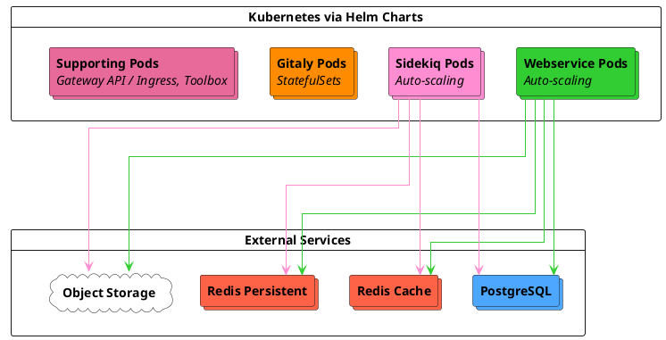



- 티어:  Free, Premium, Ultimate
- 제공 서비스: GitLab Self-Managed
- 상태:  베타



Cloud Native First 참조 아키텍처는 워크로드 특성에 따른 4가지 표준화된 크기(S/M/L/XL)를 기반으로 최신 클라우드 네이티브 배포 패턴을 위해 설계됩니다. 이러한 아키텍처는 모든 GitLab 구성 요소를 Kubernetes에 배포하고, PostgreSQL, Redis 및 Object Storage는 관리형 서비스 또는 온프레미스 옵션을 포함한 외부 제3자 솔루션을 사용합니다.

> [!note]
> 이러한 아키텍처는 [베타](../../policy/development_stages_support.md#beta) 단계입니다. 피드백을 권장하며 프로덕션 사용 데이터를 기반으로 계속 사양을 개선할 예정입니다.

## 아키텍처 개요 {#architecture-overview}

Cloud Native First 아키텍처는 Kubernetes 및 외부 서비스 전반에 GitLab 구성 요소를 배포합니다:

**Kubernetes components:**

- **Webservice** \- 웹 요청 처리
- **Sidekiq** \- 백그라운드 작업 처리
- **Gitaly** \- StatefulSet을 사용하여 Git 리포지토리 관리 및 영구 볼륨
- **Supporting services** \- Gateway API / Ingress, Toolbox 및 모니터링 구성 요소

> [!note]
> Kubernetes에 Gitaly를 배포할 때, Gitaly는 샤드된(비클러스터) 구성만 지원합니다. [클라이언트 재시도](../settings/gitaly_timeouts.md)를 통해 다운타임 없이 Gitaly를 업그레이드할 수 있습니다. 각 Gitaly 포드는 제공하는 리포지토리의 단일 장애점입니다. Gitaly Cluster(Praefect)는 Kubernetes에서 지원되지 않습니다.
>
> 자동 장애 조치와 함께 Gitaly 고가용성이 필요하면 [Cloud Native Hybrid 아키텍처](_index.md#cloud-native-hybrid)를 고려하세요. 이 아키텍처는 가상 머신에 Gitaly Cluster를 배포하고 Kubernetes에서 상태 비저장 구성 요소를 실행합니다. Gitaly on Kubernetes 요구 사항 및 제한 사항에 대해서는 [Gitaly on Kubernetes](../gitaly/kubernetes.md#requirements)를 참조하세요.

**External services:**

- **PostgreSQL** \- 고가용성을 위한 선택적 대기 레플리카 및 추가 안정성과 성능을 위한 읽기 레플리카와 함께 배포되는 관리형 데이터베이스 서비스
- **Redis** \- 별도의 캐시 및 영구 인스턴스, 각각 선택적으로 고가용성을 위한 대기 레플리카와 함께 배포됨
- **Object Storage** \- S3, Google Cloud Storage 또는 Azure Blob Storage와 같은 아티팩트 및 패키지용 Object Storage 서비스

권장되는 관리형 서비스 제공자(GCP Cloud SQL, AWS RDS, Azure Database 등)에 대해서는 [권장 클라우드 제공자 및 서비스](_index.md#recommended-cloud-providers-and-services)를 참조하세요.

## 사용 가능한 아키텍처 {#available-architectures}

이러한 아키텍처는 일반적인 프로덕션 워크로드 패턴을 나타내는 목표 RPS 범위 주위로 설계되었습니다. RPS 목표는 출발점 역할을 하며, 특정 용량 요구 사항은 워크로드 구성과 사용 패턴에 따라 다릅니다. RPS 구성 및 조정이 필요한 경우에 대한 지침은 [RPS 구성 이해](sizing.md#understanding-rps-composition-and-workload-patterns)를 참조하세요.

| 크기 | 목표 RPS | 의도한 워크로드 |
|------|------------|-------------------|
| S | ≤100 | 가벼운 개발 활동 및 최소 자동화가 있는 팀 |
| M | ≤200 | 중간 개발 속도 및 표준 CI/CD 사용을 가진 조직 |
| L | ≤500 | 무거운 개발 활동 및 중요한 자동화가 있는 대규모 팀 |
| XL | ≤1000 | 집약적 워크로드 및 광범위한 통합이 있는 엔터프라이즈 배포 |

예상 로드를 확인하고 적절한 크기를 선택하는 방법에 대한 자세한 지침은 [참조 아키텍처 크기 조정 가이드](sizing.md)를 참조하세요.

## 주요 이점 {#key-benefits}

Cloud Native First 아키텍처는 다음을 제공합니다:

- **Self-healing infrastructure** \- Kubernetes는 실패한 포드를 자동으로 다시 시작하고 워크로드를 정상 노드 전체에 다시 스케줄합니다.
- **Dynamic resource scaling** \- Horizontal Pod Autoscaler와 Cluster Autoscaler는 실제 요구에 따라 용량을 조정합니다.
- **Simplified deployment** \- GitLab 구성 요소에 대한 전통적인 VM 관리가 없으며 모든 것이 Kubernetes를 통해 조율됩니다.
- **Reduced operational overhead** \- PostgreSQL, Redis 및 객체 스토리지용 관리형 서비스로 데이터베이스 및 캐시 유지 보수가 제거됩니다.
- **Built-in high availability** \- 모든 구성 요소에 대한 자동 장애 조치를 포함한 다중 영역 배포
- **Improved cost efficiency** \- 리소스는 낮은 수요 기간 동안 축소되고 피크 용량을 유지합니다.

## 요구 사항 {#requirements}

Cloud Native First 아키텍처를 배포하기 전에 다음을 확인하세요:

- 지원되는 [Kubernetes 클러스터](https://docs.gitlab.com/charts/installation/cloud/) 및 기타 [Charts 필수 조건](https://docs.gitlab.com/charts/installation/tools/)이 준비되어 있음
- 데이터베이스, 사용자 및 확장이 구성된 외부 PostgreSQL 인스턴스
- 외부 Redis 인스턴스
- 객체 스토리지 서비스(S3, Google Cloud Storage, Azure Blob Storage 또는 기타)

네트워킹, 머신 타입 및 클라우드 제공자 서비스를 포함한 전체 요구 사항은 [참조 아키텍처 요구 사항](_index.md#requirements)을 참조하세요.

Gitaly on Kubernetes 특정 요구 사항 및 제한 사항은 [Gitaly on Kubernetes 요구 사항](../gitaly/kubernetes.md#requirements)을 참조하세요.

## 소규모(S) {#small-s}

**Target load:** ≤100 RPS | 가벼운 전체 로드

**Workload characteristics:**

- **Total RPS range:** ≤100 요청/초
- **Git operations:** 가벼운 Git 푸시 및 풀 활동
- **Repository size:** 적극적으로 사용되는 모노레포에는 적합하지 않음
- **CI/CD usage:** 가벼운 동시 파이프라인 실행
- **API traffic:** 자동화된 워크로드를 위한 가벼운 용량
- **User patterns:** 사용량 급증에 대한 약간의 복원력

### Kubernetes 구성 요소 {#kubernetes-components}

| 구성 요소 | 포드당 리소스 | 최소 포드/워커 | 최대 포드/워커 | 예제 노드 구성 |
|-----------|------------------|------------------|------------------|---------------------------|
| Webservice | 2 vCPU, 3 GB(요청), 4 GB(제한) | 12개 포드(24개 워커) | 18개 포드(36개 워커) | GCP:  6 × n2-standard-8 AWS:  6 × c6i.2xlarge |
| Sidekiq | 900m vCPU, 2 GB(요청), 4 GB(제한) | 8개 워커 | 12개 워커 | GCP:  3 × n2-standard-4 AWS:  3 × m6i.xlarge |
| Gitaly | 7 vCPU, 30 GB(요청 및 제한) | 3개 포드 | 3개 포드 | GCP:  3 × n2-standard-8 AWS:  3 × m6i.2xlarge |
| 지원 | 서비스당 변수 | 12 vCPU, 48 GB | 12 vCPU, 48 GB | GCP:  3 × n2-standard-4 AWS:  3 × c6i.xlarge |

### 포드 스케일링 구성 {#pod-scaling-configuration}

| 구성 요소 | 최소 → 최대 포드 | 최소 → 최대 워커 | 포드당 리소스 | 포드당 워커 |
|-----------|----------------|-------------------|-------------------|-----------------|
| Webservice | 12 → 18 | 24 → 36 | 2 vCPU, 3 GB(요청), 4 GB(제한) | 2 |
| Sidekiq | 8 → 12 | 8 → 12 | 900m vCPU, 2 GB(요청), 4 GB(제한) | 1 |
| Gitaly | 3개(자동 크기 조정링 없음) | 해당 없음 | 7 vCPU, 30 GB(요청 및 제한) | 해당 없음 |

**Gitaly notes:** Git cgroups:  27 GB, 버퍼:  3 GB. 리포지토리 cgroup을 1로 설정합니다. 튜닝 지침은 [Gitaly cgroups 구성](#gitaly-cgroups-configuration)을 참조하세요.

### 외부 서비스 {#external-services}

| 서비스 | 구성 | GCP 동등 | AWS 동등 |
|---------|---------------|----------------|----------------|
| PostgreSQL | 8 vCPU, 32 GB | n2-standard-8 | m6i.2xlarge |
| Redis - 캐시 | 2 vCPU, 8 GB | n2-standard-2 | m6i.large |
| Redis - 영구 | 2 vCPU, 8 GB | n2-standard-2 | m6i.large |
| Object Storage | 클라우드 제공자 서비스 | Google Cloud Storage | Amazon S3 |

## 중간(M) {#medium-m}

**Target load:** ≤200 RPS | 중간 전체 로드

**Workload characteristics:**

- **Total RPS range:** ≤200 요청/초
- **Git operations:** 중간 Git 푸시 및 풀 활동
- **Repository size:** 가볍게 사용되는 모노레포가 지원됩니다. 더 크거나 많이 사용되는 모노레포의 경우 성능 수정자가 필요할 수 있습니다.
- **CI/CD usage:** 중간 파이프라인 동시 실행
- **API traffic:** 표준 자동화 워크로드가 지원됩니다.
- **User patterns:** 사용 변동에 대한 좋은 복원력

### Kubernetes 구성 요소 {#kubernetes-components-1}

| 구성 요소 | 포드당 리소스 | 최소 포드/워커 | 최대 포드/워커 | 예제 노드 구성 |
|-----------|------------------|------------------|------------------|---------------------------|
| Webservice | 2 vCPU, 3 GB(요청), 4 GB(제한) | 28개 포드(56개 워커) | 42개 포드(84개 워커) | GCP:  6 × n2-standard-16 AWS:  6 × c6i.4xlarge |
| Sidekiq | 900m vCPU, 2 GB(요청), 4 GB(제한) | 16개 워커 | 24개 워커 | GCP:  3 × n2-standard-8 AWS:  3 × m6i.2xlarge |
| Gitaly | 15 vCPU, 62 GB(요청 및 제한) | 3개 포드 | 3개 포드 | GCP:  3 × n2-standard-16 AWS:  3 × m6i.4xlarge |
| 지원 | 서비스당 변수 | 12 vCPU, 48 GB | 12 vCPU, 48 GB | GCP:  3 × n2-standard-4 AWS:  3 × c6i.xlarge |

### 포드 스케일링 구성 {#pod-scaling-configuration-1}

| 구성 요소 | 최소 → 최대 포드 | 최소 → 최대 워커 | 포드당 리소스 | 포드당 워커 |
|-----------|----------------|-------------------|-------------------|-----------------|
| Webservice | 28 → 42 | 56 → 84 | 2 vCPU, 3 GB(요청), 4 GB(제한) | 2 |
| Sidekiq | 16 → 24 | 16 → 24 | 900m vCPU, 2 GB(요청), 4 GB(제한) | 1 |
| Gitaly | 3개(자동 크기 조정링 없음) | 해당 없음 | 15 vCPU, 62 GB(요청 및 제한) | 해당 없음 |

**Gitaly notes:** Git cgroups:  56 GB, 버퍼:  6 GB. 리포지토리 cgroup을 1로 설정합니다. 튜닝 지침은 [Gitaly cgroups 구성](#gitaly-cgroups-configuration)을 참조하세요.

### 외부 서비스 {#external-services-1}

| 서비스 | 구성 | GCP 동등 | AWS 동등 |
|---------|---------------|----------------|----------------|
| PostgreSQL | 16 vCPU, 64 GB | n2-standard-16 | m6i.4xlarge |
| Redis - 캐시 | 2 vCPU, 8 GB | n2-standard-2 | m6i.large |
| Redis - 영구 | 2 vCPU, 8 GB | n2-standard-2 | m6i.large |
| Object Storage | 클라우드 제공자 서비스 | Google Cloud Storage | Amazon S3 |

## 대규모(L) {#large-l}

**Target load:** ≤500 RPS | 무거운 전체 로드

**Workload characteristics:**

- **Total RPS range:** ≤500 요청/초
- **Git operations:** 무거운 Git 푸시 및 풀 활동
- **Repository size:** 중간 정도로 사용되는 모노레포가 지원됩니다. 더 크거나 많이 사용되는 모노레포의 경우 성능 수정자가 필요할 수 있습니다.
- **CI/CD usage:** 적절한 Sidekiq 스케일링을 사용한 무거운 파이프라인 사용
- **API traffic:** 중요한 자동화 워크로드가 지원됩니다.
- **User patterns:** 사용 변동에 대한 강한 복원력

### Kubernetes 구성 요소 {#kubernetes-components-2}

| 구성 요소 | 포드당 리소스 | 최소 포드/워커 | 최대 포드/워커 | 예제 노드 구성 |
|-----------|------------------|------------------|------------------|---------------------------|
| Webservice | 2 vCPU, 3 GB(요청), 4 GB(제한) | 56개 포드(112개 워커) | 84개 포드(168개 워커) | GCP:  6 × n2-standard-32 AWS:  6 × c6i.8xlarge |
| Sidekiq | 900m vCPU, 2 GB(요청), 4 GB(제한) | 32개 워커 | 48개 워커 | GCP:  6 × n2-standard-8 AWS:  6 × m6i.2xlarge |
| Gitaly | 31 vCPU, 126 GB(요청 및 제한) | 3개 포드 | 3개 포드 | GCP:  3 × n2-standard-32 AWS:  3 × m6i.8xlarge |
| 지원 | 서비스당 변수 | 12 vCPU, 48 GB | 12 vCPU, 48 GB | GCP:  3 × n2-standard-4 AWS:  3 × c6i.xlarge |

### 포드 스케일링 구성 {#pod-scaling-configuration-2}

| 구성 요소 | 최소 → 최대 포드 | 최소 → 최대 워커 | 포드당 리소스 | 포드당 워커 |
|-----------|----------------|-------------------|-------------------|-----------------|
| Webservice | 56 → 84 | 112 → 168 | 2 vCPU, 3 GB(요청), 4 GB(제한) | 2 |
| Sidekiq | 32 → 48 | 32 → 48 | 900m vCPU, 2 GB(요청), 4 GB(제한) | 1 |
| Gitaly | 3개(자동 크기 조정링 없음) | 해당 없음 | 31 vCPU, 126 GB(요청 및 제한) | 해당 없음 |

**Gitaly notes:** Git cgroups:  120 GB, 버퍼:  6 GB. 리포지토리 cgroup을 1로 설정합니다. 튜닝 지침은 [Gitaly cgroups 구성](#gitaly-cgroups-configuration)을 참조하세요.

### 외부 서비스 {#external-services-2}

| 서비스 | 구성 | GCP 동등 | AWS 동등 |
|---------|---------------|----------------|----------------|
| PostgreSQL | 32 vCPU, 128 GB | n2-standard-32 | m6i.8xlarge |
| Redis - 캐시 | 2 vCPU, 16 GB | n2-highmem-2 | r6i.large |
| Redis - 영구 | 2 vCPU, 16 GB | n2-highmem-2 | r6i.large |
| Object Storage | 클라우드 제공자 서비스 | Google Cloud Storage | Amazon S3 |

## 초대형(XL) {#extra-large-xl}

**Target load:** ≤1000 RPS | 집약적 전체 로드

**Workload characteristics:**

- **Total RPS range:** ≤1000 요청/초
- **Git operations:** 집약적 Git 푸시 및 풀 활동
- **Repository size:** 많이 사용되는 모노레포가 지원됩니다. 더 크거나 집약적으로 사용되는 모노레포의 경우 성능 수정자가 필요할 수 있습니다.
- **CI/CD usage:** 집약적 CI/CD 워크로드
- **API traffic:** 무거운 자동화 및 통합 트래픽
- **User patterns:** 다양한 액세스 패턴을 위해 설계됨

### Kubernetes 구성 요소 {#kubernetes-components-3}

| 구성 요소 | 포드당 리소스 | 최소 포드/워커 | 최대 포드/워커 | 예제 노드 구성 |
|-----------|------------------|------------------|------------------|---------------------------|
| Webservice | 2 vCPU, 3 GB(요청), 4 GB(제한) | 110개 포드(220개 워커) | 165개 포드(330개 워커) | GCP:  6 × n2-standard-64 AWS:  6 × c6i.16xlarge |
| Sidekiq | 900m vCPU, 2 GB(요청), 4 GB(제한) | 64개 워커 | 96개 워커 | GCP:  6 × n2-standard-16 AWS:  6 × m6i.4xlarge |
| Gitaly | 63 vCPU, 254 GB(요청 및 제한) | 3개 포드 | 3개 포드 | GCP:  3 × n2-standard-64 AWS:  3 × m6i.16xlarge |
| 지원 | 서비스당 변수 | 24 vCPU, 96 GB | 24 vCPU, 96 GB | GCP:  3 × n2-standard-8 AWS:  3 × c6i.2xlarge |

### 포드 스케일링 구성 {#pod-scaling-configuration-3}

| 구성 요소 | 최소 → 최대 포드 | 최소 → 최대 워커 | 포드당 리소스 | 포드당 워커 |
|-----------|----------------|-------------------|-------------------|-----------------|
| Webservice | 110 → 165 | 220 → 330 | 2 vCPU, 3 GB(요청), 4 GB(제한) | 2 |
| Sidekiq | 64 → 96 | 64 → 96 | 900m vCPU, 2 GB(요청), 4 GB(제한) | 1 |
| Gitaly | 3개(자동 크기 조정링 없음) | 해당 없음 | 63 vCPU, 254 GB(요청 및 제한) | 해당 없음 |

**Gitaly notes:** Git cgroups:  248 GB, 버퍼:  6 GB. 리포지토리 cgroup을 1로 설정합니다. 튜닝 지침은 [Gitaly cgroups 구성](#gitaly-cgroups-configuration)을 참조하세요.

### 외부 서비스 {#external-services-3}

| 서비스 | 구성 | GCP 동등 | AWS 동등 |
|---------|---------------|----------------|----------------|
| PostgreSQL | 64 vCPU, 256 GB | n2-standard-64 | m6i.16xlarge |
| Redis - 캐시 | 2 vCPU, 16 GB | n2-highmem-2 | r6i.large |
| Redis - 영구 | 2 vCPU, 16 GB | n2-highmem-2 | r6i.large |
| Object Storage | 클라우드 제공자 서비스 | Google Cloud Storage | Amazon S3 |

## 추가 정보 {#additional-information}

이 섹션은 머신 타입 선택, 구성 요소별 고려 사항 및 스케일링 전략을 포함한 Cloud Native First 아키텍처의 배포 및 운영을 위한 보충 지침을 제공합니다.

### 머신 타입 지침 {#machine-type-guidance}

표시된 머신 타입은 검증 및 테스트에 사용되는 예입니다. 다음을 사용할 수 있습니다:

- 최신 세대 머신 타입
- ARM 기반 인스턴스(AWS Graviton)
- 사양을 충족하거나 초과하는 다른 머신 제품군
- 특정 필요에 맞게 크기가 조정된 사용자 지정 머신 타입

성능이 일관되지 않아 버스트 가능 인스턴스 타입을 사용하지 마세요.

자세한 정보는 [지원되는 머신 타입](_index.md#supported-machine-types)을 참조하세요.

### Gitaly 고려 사항 {#gitaly-considerations}

Cloud Native First 아키텍처를 사용하는 Kubernetes의 Gitaly는 다음 사양으로 StatefulSet을 사용합니다:

- **Exclusive node placement** \- Gitaly 포드는 성능 저하 이웃 이슈를 피하기 위해 전용 노드에 배포됩니다.
- **Resource allocation** \- 포드 요청 및 제한은 노드 용량에서 오버헤드를 빼서 설정됩니다(Kubernetes 시스템 프로세스용으로 예약된 2GB 메모리, 1 vCPU).
- **Git cgroups memory** \- 기본적으로 10% 버퍼와 함께 할당되며, 더 큰 포드의 경우 최대 6GB로 제한됩니다. 예를 들어, 소규모는 3GB 버퍼가 있는 Git cgroup에 27GB를 할당하고, 중간 이상의 크기는 6GB 상한선을 사용합니다(중간 크기의 경우 6GB 버퍼가 있는 56GB cgroup).

**Gitaly deployment mode:**

설계상, Kubernetes의 Gitaly(비클러스터)는 각 포드에 저장된 리포지토리의 단일 장애점 서비스입니다. 데이터는 포드당 단일 인스턴스에서 소싱 및 제공됩니다. 각 Gitaly 포드는 자체 리포지토리 세트를 관리하여 리포지토리 배포를 통한 Git 스토리지의 수평 확장을 제공합니다.

Gitaly Cluster(Praefect)는 Cloud Native First 아키텍처에서 지원되지 않습니다. Kubernetes의 Gitaly 배포 제한에 대한 컨텍스트는 [Gitaly on Kubernetes](../gitaly/kubernetes.md)를 참조하세요.

**Repository distribution:**

여러 Gitaly 스토리지(예: `default`, `storage1`, `storage2`)가 구성된 경우, GitLab은 기본적으로 `default` 스토리지에서 모든 새 리포지토리를 만듭니다. 모든 Gitaly 포드 전체에 리포지토리를 배포하려면 로드를 균형 조정할 스토리지 가중치를 구성하세요.

리포지토리 스토리지 가중치 구성에 대한 지침은 [새 리포지토리 저장 위치 구성](../repository_storage_paths.md#configure-where-new-repositories-are-stored)을 참조하세요.

#### Gitaly cgroups 구성 {#gitaly-cgroups-configuration}

Gitaly는 [cgroups](../gitaly/cgroups.md)를 사용하여 개별 Git 작업에서 리소스 소진을 방지합니다. 기본 구성은 리포지토리 cgroup 개수를 1로 설정하여, 모든 단일 리포지토리가 오버 구독을 통해 전체 포드 리소스를 사용할 수 있도록 하는 출발점을 제공합니다.

그러나 이 구성은 모든 워크로드에 최적이 아닐 수 있습니다. 많은 활성 리포지토리가 있거나 특정 리소스 격리 요구 사항이 있는 환경의 경우, 관찰된 사용 패턴을 기반으로 cgroup 구성을 조정해야 합니다. 여기에는 리포지토리 cgroup 개수 및 메모리 할당 조정이 포함됩니다.

Gitaly cgroups 측정, 조정 및 구성에 대한 자세한 지침은 [Gitaly cgroups](../gitaly/cgroups.md)를 참조하세요.

대형 모노레포(2GB 이상) 또는 집약적 Git 워크로드의 경우 추가 Gitaly 조정이 필요할 수 있습니다. 자세한 지침은 [참조 아키텍처 크기 조정 가이드](sizing.md)를 참조하세요.

### 외부 서비스 참고 {#external-service-notes}

- PostgreSQL은 고가용성을 위한 대기 레플리카와 함께 배포할 수 있습니다. 추가 안정성 및 성능을 위해 읽기 레플리카를 추가할 수 있습니다. 더 큰 환경(L, XL)은 데이터베이스 로드를 분산하기 위해 읽기 레플리카의 이점을 더 얻습니다.
- Redis 인스턴스는 고가용성을 위한 대기 레플리카와 함께 배포할 수 있습니다. GCP에서 Memorystore 인스턴스는 메모리만으로 구성됩니다. 머신 사양은 참고용으로 표시됩니다.
- 클라우드 공급자 서비스의 경우 인스턴스 구성을 포함하는 모든 서비스에서 탄력적인 클라우드 아키텍처 관행에 맞추기 위해 최소 3개의 가용 영역에 3개 이상의 노드를 구현하는 것이 좋습니다.

### 자동 크기 조정 및 최소 포드 개수 {#autoscaling-and-minimum-pod-counts}

모든 아키텍처는 용량을 관리하기 위해 Kubernetes HPA(Horizontal Pod Autoscaler) 및 Cluster Autoscaler를 사용합니다:

- **Webservice** \- CPU 사용률을 기반으로 보수적인 최소 포드 개수로 확장합니다
- **Sidekiq** \- CPU 사용률을 기반으로 확장합니다
- **Cluster Autoscaler** \- 포드 리소스 요청을 기반으로 노드를 자동으로 프로비저닝하고 제거합니다

최소 포드 개수는 최대값의 약 2/3로 설정되어 내부 테스트를 기반으로 비용 효율성과 성능 안정성의 균형을 맞추어 다음 목표를 달성합니다:

- 수요 증가 시 반응성 있는 확장
- 노드 장애 또는 업그레이드 중 충분한 용량
- 수요가 적은 기간 동안의 비용 최적화

부하 패턴을 잘 이해하고 있다면 필요에 따라 최소값을 조정할 수 있습니다:

- **Increase minimums** \- 트래픽 급증이나 엄격한 성능 SLA가 있는 환경의 경우
- **Decrease minimums** \- 모니터링 결과 지속적인 부하가 기본값 이하인 경우

### 고급 확장 {#advanced-scaling}

Cloud Native First 아키텍처는 기본 사양을 초과하여 확장하도록 설계되었습니다. 다음과 같은 경우 용량을 조정해야 할 수 있습니다:

- 나열된 RPS 목표보다 일관되게 높은 처리량
- 비정상적인 워크로드 구성([RPS 구성 이해](sizing.md#understanding-rps-composition-and-workload-patterns) 참조)
- 대규모 모노레포(2GB 이상)
- 상당한 추가 워크로드
- 광범위한 GitLab Duo Agent Platform 사용

확장 전략은 컴포넌트 유형에 따라 다릅니다.

#### 수평 확장(Webservice 및 Sidekiq) {#horizontal-scaling-webservice-and-sidekiq}

용량을 늘리려면 최대 레플리카 개수와 노드 풀 용량을 조정하여 수평으로 확장하세요:

- **Webservice** \- Helm 값에서 `maxReplicas`을 늘리고 Webservice 노드 풀에 해당 노드를 추가합니다
- **Sidekiq** \- 더 높은 작업 처리량을 처리하기 위해 `maxReplicas`을 늘리고 Sidekiq 노드 풀에 노드를 추가합니다

수평 확장은 이러한 상태 비저장 컴포넌트에 권장되는 접근 방식입니다.

#### 수직 확장(PostgreSQL, Redis, Gitaly) {#vertical-scaling-postgresql-redis-gitaly}

상태 저장 컴포넌트의 경우 인스턴스 또는 포드 사양을 늘립니다:

- **PostgreSQL and Redis** \- 관리되는 서비스 제공자를 통해 더 큰 인스턴스 유형으로 업그레이드합니다.
- **Gitaly** \- 포드별 CPU 및 메모리 사양을 늘립니다. 이를 위해서는 Gitaly 노드 풀에서 더 큰 노드 유형과 Git cgroups 메모리 할당에 대한 대응하는 조정이 필요합니다.

#### Sidekiq 큐 최적화 {#sidekiq-queue-optimization}

기본적으로 Sidekiq은 모든 작업 유형을 단일 큐에서 처리합니다. 다양한 워크로드 패턴이 있는 환경의 경우 작업 특성을 기반으로 별도의 큐를 구성할 수 있습니다:

- **High-urgency queues** \- CI 파이프라인 처리 및 웹후크 전달과 같은 시간에 민감한 작업의 경우
- **CPU-bound queues** \- 조정된 동시성 설정이 있는 계산 집약적 작업의 경우
- **Default queue** \- 표준 백그라운드 처리의 경우

큐 분리는 작업 처리 안정성을 개선하고 우선순위가 낮은 작업이 시간에 민감한 작업을 차단하는 것을 방지할 수 있으며, 특히 대규모 환경(L, XL)에서 무거운 자동화 워크로드가 있는 경우 유용합니다.

Sidekiq 큐 구성에 대한 자세한 내용은 [특정 작업 클래스 처리](../sidekiq/processing_specific_job_classes.md)를 참조하세요.

#### GitLab Duo Agent Platform 확장 {#scaling-for-gitlab-duo-agent-platform}

GitLab Duo Agent Platform은 표준 GitLab 워크로드 이상의 추가 인프라 요구사항을 도입합니다. Agent Platform 채택에 대한 모니터링 및 확장 지침은 [GitLab Duo Agent Platform 확장](_index.md#scaling-for-gitlab-duo-agent-platform)을 참조하세요.

#### 확장 고려사항 {#scaling-considerations}

컴포넌트를 크게 확장할 때:

- 종속 컴포넌트의 리소스 포화 상태를 모니터링합니다. Webservice 또는 Sidekiq의 부하 증가는 PostgreSQL 및 Gitaly에 영향을 미칠 수 있습니다.
- 먼저 비프로덕션 환경에서 확장 변경을 테스트하세요.
- 서비스 간 병목 현상의 이동을 피하기 위해 상호 의존적인 컴포넌트를 함께 확장합니다.

포괄적인 확장 지침은 [환경 확장](_index.md#scaling-an-environment)을 참조하세요.

## 배포 {#deployment}

Cloud Native First 아키텍처는 Helm 차트 및 외부 서비스 제공자를 직접 사용하거나 GitLab Environment Toolkit을 통해 배포할 수 있습니다.

### GitLab Environment Toolkit {#gitlab-environment-toolkit}

[GitLab Environment Toolkit](https://gitlab.com/gitlab-org/gitlab-environment-toolkit)은 다음을 포함한 자동화된 배포를 제공합니다:

- 코드 기반 인프라(Terraform) - 클라우드 리소스용
- 자동화된 Helm 차트 구성
- 각 아키텍처 크기에 대해 미리 검증된 설정
- 간소화된 업그레이드 및 유지보수

배포 지침은 [GitLab Environment Toolkit 문서](https://gitlab.com/gitlab-org/gitlab-environment-toolkit/-/blob/main/README.md)를 참조하세요.

### 수동 배포 {#manual-deployment}

수동 배포를 위한 전제 조건:

- 필요한 데이터베이스, 사용자 및 권한이 설정된 외부 PostgreSQL
- 구성되고 액세스 가능한 외부 Redis 인스턴스
- 생성된 Object Storage 버킷
- 필요에 따라 인증을 위해 생성된 Kubernetes 시크릿(PostgreSQL 비밀번호, Redis 비밀번호, Object Storage 자격 증명, GitLab 시크릿)

자세한 전제 조건 및 시크릿 구성은 [GitLab 차트 전제 조건](https://docs.gitlab.com/charts/installation/tools/) 및 [시크릿 구성](https://docs.gitlab.com/charts/installation/secrets/)을 참조하세요.

Helm 차트를 사용한 수동 배포:

1. 전제 조건에 설명된 필요한 외부 서비스 및 시크릿을 설정합니다
1. 적절한 노드 풀과 자동 스케일러가 있는 Kubernetes 클러스터를 구성합니다
1. [Helm 차트 구성](#helm-chart-configurations) 섹션에 표시된 Helm 값 구성을 적용합니다
1. `helm install`을 사용하여 GitLab을 배포합니다

자세한 수동 배포 단계는 [Kubernetes에 GitLab 설치](https://docs.gitlab.com/charts/installation/)를 참조하세요.

## Helm 차트 구성 {#helm-chart-configurations}

완전한 Helm 차트 구성 예제 및 자세한 배포 지침은 [GitLab 차트 저장소](https://gitlab.com/gitlab-org/charts/gitlab/-/tree/master/examples/ref)를 참조하세요.

Cloud Native First 아키텍처의 주요 구성 영역:

- **Resource specifications** \- 포드 CPU 및 메모리 제한이 위의 각 아키텍처 크기의 사양과 일치합니다
- **Autoscaling** \- HPA 구성은 최소 포드 개수를 최대값의 2/3로 설정하고 CPU 기반 확장 목표를 설정합니다
- **Node placement** \- 노드 선택기는 워크로드가 적절한 노드 풀에 배포되도록 보장합니다(예: `webservice`, `sidekiq`, `gitaly`, `support`)
- **External services** \- PostgreSQL, Redis 및 Object Storage 연결 세부 정보
- **Gitaly** \- cgroups, 지속성 및 저장소 분산을 포함한 StatefulSet 구성

아키텍처별 레플리카 개수 및 리소스 값은 위의 각 크기 섹션의 사양을 참조하세요.

> [!note]
> Cloud Native First 아키텍처는 베타 단계입니다. 특정 Helm 차트 구성 예제는 기능이 General Availability로 진행되면서 차트 저장소에 추가될 것입니다. 위의 각 아키텍처 크기 섹션의 사양을 사용하여 Helm 값 구성을 작성합니다.

## 다음 단계 {#next-steps}

배포 후 환경은 일반적으로 실제 워크로드 패턴과 일치하도록 모니터링 및 튜닝이 필요합니다.

### 모니터링 및 검증 {#monitor-and-validate}

1. **Monitor resource utilization** - [Prometheus](../monitoring/prometheus/_index.md)를 사용하여 모든 컴포넌트에서 CPU, 메모리 및 큐 깊이를 추적합니다
1. **Validate RPS assumptions** \- 실제 [RPS 분석](sizing.md#extract-peak-traffic-metrics)을 가정된 80/10/10 구성과 비교합니다
1. **Identify potential adjustments** \- 지속적으로 70% 이상의 사용률을 보이는 컴포넌트를 찾습니다
1. **Review Gitaly cgroups** \- 리포지토리 액세스 패턴을 기반으로 [리포지토리 cgroup 개수](../gitaly/cgroups.md) 튜닝을 고려합니다

### 필요에 따라 조정 {#adjust-as-needed}

참조 아키텍처는 시작점입니다. 많은 환경이 다음을 기반으로 조정하면 도움이 됩니다:

- **Actual workload composition** \- API/Web/Git 분할이 일반적인 패턴과 크게 다를 경우 [RPS 구성 이해](sizing.md#understanding-rps-composition-and-workload-patterns)를 참조하세요
- **Repository characteristics** \- 모노레포 크기, 클론 빈도 및 액세스 패턴은 [컴포넌트별 조정](sizing.md#identify-component-adjustments)을 필요로 할 수 있습니다
- **Growth patterns** \- 사용자 수 증가, CI/CD 확장 또는 자동화 확장

컴포넌트별 조정 지침은 [고급 확장](#advanced-scaling)을 참조하세요.

### 선택적 기능 구성 {#configure-optional-features}

요구 사항에 따라 GitLab의 추가 선택적 기능을 구성할 수 있습니다. [GitLab 설치 후 단계](../../install/next_steps.md)를 참고하여 자세한 내용을 확인하세요.

> [!note]
> 선택적 기능에는 추가 용량이 필요할 수 있습니다. 요구 사항은 기능별 문서를 참조하세요.
