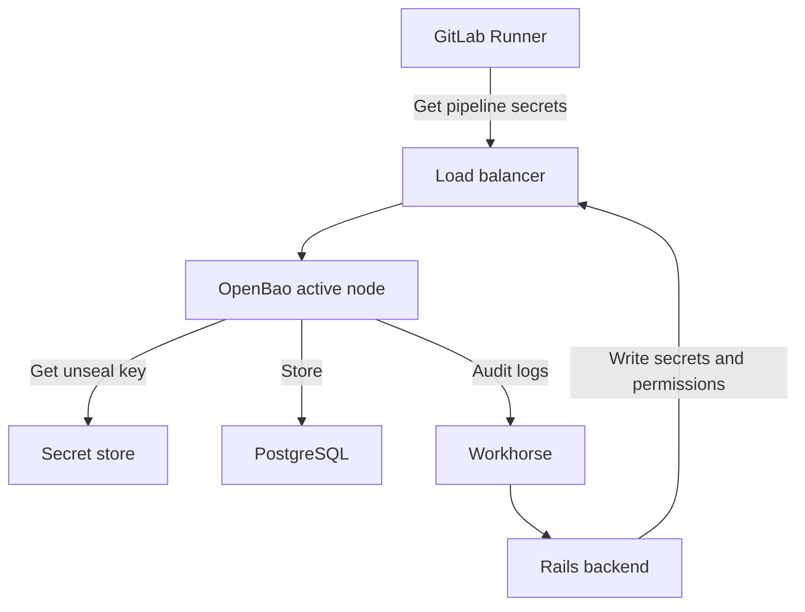



- 티어:  Premium, Ultimate
- 제공 서비스: GitLab Self-Managed
- 상태:  베타





- GitLab 18.8에서 실험으로 [도입](https://gitlab.com/groups/gitlab-org/-/work_items/16319) 되었으며, 폐쇄형 [베타](../../policy/development_stages_support.md#beta)로 일부 초기 테스터에게 GitLab 18.8에서 제공되었습니다.
- GitLab 19.0에 공개 베타가 [도입됨](https://gitlab.com/groups/gitlab-org/-/work_items/21731).



[GitLab 시크릿 매니저](../../ci/secrets/secrets_manager/_index.md) 는 오픈소스 [OpenBao](https://openbao.org/)시크릿 관리 솔루션을 사용합니다. OpenBao는 GitLab 인스턴스에서 사용되는 시크릿에 대한 안전한 저장소, 액세스 제어 및 수명 주기 관리를 제공합니다.

GitLab 시크릿 매니저에서 시크릿을 사용하는 GitLab CI/CD 작업은 [러너](https://docs.gitlab.com/runner/#gitlab-runner-versions) 19.0 이상을 사용해야 합니다.

## OpenBao 아키텍처 {#openbao-architecture}

OpenBao는 GitLab과 기존 GitLab 서비스와 병렬로 실행되는 선택적 구성 요소로 통합됩니다.

- Rails 백엔드 및 러너는 로드 밸런서를 통해 OpenBao API에 연결됩니다.
- OpenBao는 데이터를 PostgreSQL에 저장합니다. Helm 차트는 OpenBao를 구성하여 같은 PostgreSQL 인스턴스의 별도 논리적 데이터베이스를 사용합니다. Helm 차트에서 `global.openbao.psql`을 사용하여 연결을 구성합니다.
- OpenBao는 시크릿 저장소에서 봉인 해제 키를 가져옵니다.
- OpenBao는 Helm 차트에 의해 마운트된 Kubernetes 시크릿에서 봉인 해제 키를 읽습니다.
- OpenBao는 감사 로그가 활성화된 경우 Rails 백엔드에 감사 로그를 게시합니다.



OpenBao는 모든 요청을 처리하는 단일 활성 노드로 실행되며, 선택적으로 활성 노드가 실패할 경우 인수하는 여러 대기 노드를 사용합니다.

## OpenBao 설치 {#install-openbao}

전제 조건:

- 관리자 액세스 권한이 있어야 합니다.
- GitLab 19.0 이상이어야 합니다.
- Kubernetes 클러스터입니다.
- Cloud Native GitLab 배포의 경우 외부(비-Omnibus) PostgreSQL 인스턴스입니다. 외부 PostgreSQL 인스턴스는 OpenBao가 아니라 Cloud Native 배포용 GitLab Helm 차트에서 필요합니다. OpenBao는 해당 인스턴스의 별도 논리적 데이터베이스를 사용합니다.

GitLab 배포에 따라 설치 방법을 선택합니다:

- **Cloud Native GitLab**:  GitLab을 Kubernetes에 배포하는 경우 이를 사용합니다. 자세한 내용은 [OpenBao Helm 차트 설명서](https://docs.gitlab.com/charts/charts/openbao/)를 참조하세요.
- **Linux package**:  단일 노드 또는 여러 노드에서 Linux 패키지를 사용하여 GitLab을 배포하는 경우 이를 사용합니다. 자세한 내용은 [Linux 패키지 인스턴스에 대한 OpenBao 설치](linux_package_integration.md)를 참조하세요.

설치 후 [GitLab 시크릿 매니저 사용자 설명서](../../ci/secrets/secrets_manager/_index.md)를 따라 OpenBao가 작동하는지 확인합니다.

## 크기 조정 권장 사항 {#sizing-recommendations}

OpenBao 리소스 요구 사항은 GitLab 인스턴스 크기 및 시크릿 사용 패턴에 따라 다릅니다.

이러한 권장 사항은 검증된 시작점입니다. 배포를 모니터링하고 실제 사용 패턴에 따라 리소스를 조정합니다. 요구 사항은 시크릿을 가져오는 CI/CD 작업의 수와 시크릿 매니저가 활성화된 그룹 및 프로젝트의 수에 따라 달라집니다.

### Pod 리소스 {#pod-resources}

OpenBao는 모든 요청을 처리하는 단일 활성 노드로 실행됩니다. 추가 복제본은 고가용성 장애 조치만 제공합니다. PostgreSQL 데이터베이스에 연결할 때 OpenBao가 수평적 읽기 확장성(HRS)을 지원하지 않으므로 대기 노드는 읽기 트래픽을 처리하지 않습니다.

| 시크릿 가져오기/초 | CPU 요청 | 메모리 요청 | 복제본 |
|------------------|-------------|----------------|----------|
| 최대 3          | 500m        | 2GB           | 2        |
| 최대 6          | 500m        | 3GB           | 2        |
| 최대 12         | 500m        | 4GB           | 2        |
| 최대 30         | 500m        | 9GB           | 2        |
| 최대 60         | 1,000m      | 16GB          | 2        |
| 최대 150        | 2,000m      | 31GB          | 2        |

#### 시크릿 가져오기 속도 예측 {#estimate-your-secret-fetch-rate}

어떤 행을 적용할지 결정하려면 초당 시크릿 가져오기를 예측합니다:

```plaintext
fetches/s = Git Pull RPS × adoption rate × 3
```

여기서:

- `Git Pull RPS`은 GitLab 인스턴스의 최대 Git 풀 처리량입니다. 기존 환경 모니터링에서 이를 측정할 수 있습니다. [최대 트래픽 메트릭 추출](../reference_architectures/sizing.md#extract-peak-traffic-metrics)를 참조하세요.
- `adoption rate`은 시크릿 매니저를 사용하는 CI/CD 작업의 비율입니다(예: 5%는 0.05, 20%는 0.20, 50%는 0.50).
- `3`은 시크릿 매니저를 사용하는 작업당 가져오는 시크릿의 평균 수입니다.

**Secret fetches/s**가 결과를 충족하거나 초과하는 행을 선택합니다. 예를 들어, 20% 도입률에서 측정된 20 Git 풀 RPS의 배포: `20 × 0.20 × 3 = 12 fetches/s`. 최소한 **Up to 12** 행을 사용합니다.

배포 후 실제 사용량과 예측을 확인합니다. [모니터링 쿼리](#monitor-your-openbao-deployment)를 사용하여 리소스 사용량을 측정하고 임계값이 초과되면 다음 행으로 확장합니다.

### 리소스 계산 방식 {#how-resources-are-calculated}

**CPU**는 CI/CD 작업이 시크릿을 가져오는 빈도에 의해 결정됩니다. 시크릿 쓰기 작업(시크릿 생성 또는 업데이트)은 파이프라인 볼륨에 비해 드물며 CPU 로드에 무시할 수 있는 정도로 기여합니다. 표는 각 CI/CD 작업이 Git 복제로 시작되므로 Git 복제 속도(Git 풀 RPS)를 CI 작업 속도의 대리로 사용합니다. 공식은 [시크릿 가져오기 속도 예측](#estimate-your-secret-fetch-rate)을 참조하세요. CPU 제한을 CPU 요청의 2배로 설정합니다. 이는 정상 상태에서 노드에 과도하게 예약하지 않으면서 시작 및 프로비저닝 스파이크에 대한 버스트 헤드룸을 제공합니다.

**메모리**는 OpenBao 네임스페이스 수에 의해 결정되며, 이는 시크릿 매니저가 활성화된 GitLab 그룹 및 프로젝트의 수에 해당합니다. 네임스페이스당 약 5MB, 1GB 안전 여유, 최소 2GB를 할당합니다. 메모리 제한을 메모리 요청과 같게 설정합니다(보장된 QoS 클래스). OpenBao는 메모리 제한을 초과할 때 우아한 성능 저하 없이 즉시 충돌합니다.

**Replicas**은 고가용성 장애 조치만 제공합니다. 모든 배포에 2개의 복제본을 사용합니다. OpenBao는 PostgreSQL 저장소 백엔드에서 수평적 읽기 확장성(HRS)을 지원하지 않으므로 추가 복제본은 처리량 이점을 제공하지 않습니다.

### 데이터베이스 리소스 {#database-resources}

OpenBao는 데이터를 별도의 PostgreSQL 데이터베이스에 저장합니다. GitLab 데이터베이스와 같은 PostgreSQL 서버에 배치할 수 있습니다. [참조 아키텍처 PostgreSQL 권장 사항](../reference_architectures/_index.md) 이상의 추가 데이터베이스 컴퓨팅 용량은 필요하지 않습니다.

#### 데이터베이스 연결 풀 {#database-connection-pool}

OpenBao Helm 차트는 이러한 PostgreSQL 연결 풀 기본값을 구성합니다:

| 설정                                              | 기본값 |
|------------------------------------------------------|---------------|
| `config.storage.postgresql.maxParallel`              | 5             |
| `config.storage.postgresql.maxIdleConnections`       | 2             |

모니터링에서 데이터베이스 연결 대기 시간을 관찰하지 않는 한 이 값을 증가시키지 마십시오.

#### 데이터베이스 저장소 {#database-storage}

데이터베이스 저장소 요구 사항은 주로 시크릿의 총 수에 따라 다릅니다. 메타데이터 및 저장된 버전을 포함한 각 시크릿은 약 13KB의 저장소가 필요합니다.

| 총 시크릿  | 예상 저장소 |
|----------------|-------------------|
| 10,000         | ~130MB           |
| 50,000         | ~650MB           |
| 100,000        | ~1.3GB           |
| 200,000        | ~2.6GB           |

저장소 증가는 모든 참조 아키텍처 계층에 대해 무시할 수 있습니다. 5~10GB의 데이터베이스 저장소를 할당하면 충분한 헤드룸을 제공합니다.

## OpenBao 배포 모니터링 {#monitor-your-openbao-deployment}

다음 쿼리를 사용하여 배포의 크기가 올바르게 조정되었는지 확인하고 확장이 필요한 시기를 감지합니다.

### CPU 사용률 {#cpu-utilization}

OpenBao CPU 사용량을 측정하려면:

```prometheus
sum(rate(container_cpu_usage_seconds_total{container="openbao-server"}[5m]))
```

결과는 CPU 코어 단위입니다. 1,000을 곱하여 크기 조정 표의 CPU 요청 값과 비교하기 위해 밀리코어로 변환합니다. CPU 사용률이 CPU 요청의 50%를 지속적으로 초과하면 크기 조정 표의 다음 행으로 확장하는 것을 고려합니다.

### 메모리 사용률 {#memory-utilization}

OpenBao 메모리 사용량을 측정하려면:

```prometheus
sum(container_memory_working_set_bytes{container="openbao-server"})
```

결과는 바이트 단위입니다. 메모리는 그룹 및 프로젝트가 시크릿 매니저를 활성화할 때 네임스페이스당 약 5MB씩 증가합니다. 다시 시작한 후 OpenBao가 데이터베이스에서 네임스페이스 메타데이터를 로드하면 메모리가 안정화됩니다.

올바른 메모리 요청을 계산하려면 시크릿 매니저가 활성화된 그룹 및 프로젝트를 개수로 세고 5MB를 곱한 다음 1GB를 추가합니다. 결과가 현재 메모리 요청을 초과하면 Pod 리소스를 업데이트합니다. 메모리가 활성 프로비저닝 없이 지속적인 상향 추세를 보이면 잠재적 이슈를 조사합니다.

### CPU 스로틀링 {#cpu-throttling}

지연을 야기할 수 있는 CPU 스로틀링을 감지하려면:

```prometheus
sum(rate(container_cpu_cfs_throttled_periods_total{container="openbao-server"}[5m]))
/
sum(rate(container_cpu_cfs_periods_total{container="openbao-server"}[5m]))
```

0.25(25%)를 초과하는 스로틀 비율은 현재 워크로드에 대해 CPU 제한이 너무 낮음을 나타냅니다. OpenBao가 스로틀되면 CPU 시간을 기다리는 고루틴으로 인해 시크릿 가져오기 지연이 증가합니다.

### 상태 확인 엔드포인트 {#health-check-endpoints}

OpenBao는 모니터링을 위한 상태 확인 엔드포인트를 제공합니다:

- `<your-openbao-url>/v1/sys/health`:  OpenBao의 상태를 반환합니다
- `<your-openbao-url>/v1/sys/seal-status`:  봉인 상태를 반환합니다

이러한 엔드포인트를 모니터링 시스템과 통합할 수 있습니다.

## 백업 및 복원 {#backup-and-restore}

OpenBao는 데이터를 PostgreSQL의 별도 논리적 데이터베이스에 저장합니다. 이 데이터베이스를 일반 GitLab 백업과 함께 백업하여 장애 후 시크릿을 복원할 수 있도록 합니다.

OpenBao 특정 백업 및 복원 절차에 대해서는 [OpenBao 백업 설명서](https://docs.gitlab.com/charts/charts/openbao/#back-up-openbao)를 참조하세요.

## 복구 키 관리 {#recovery-key-management}

저장, 보기, 루트 토큰 생성에 사용하기 등 OpenBao 복구 키 관리에 대한 정보는 [복구 키 관리](recovery_key.md)를 참조하세요.

## 고가용성 {#high-availability}

OpenBao는 단일 활성 노드 아키텍처를 사용합니다. 한 노드는 모든 요청을 처리하고, 대기 노드는 활성 노드가 실패할 경우 자동 장애 조치를 제공합니다.

### 장애 조치 {#failover}

대기 노드는 시작 시 모든 네임스페이스 메타데이터를 로드하므로 활성으로의 승격은 추가 초기화가 필요하지 않습니다. 네임스페이스의 수는 장애 조치 시간에 영향을 주지 않습니다.

프로덕션 배포의 경우:

- 중복을 위해 최소 2개의 OpenBao 복제본을 실행합니다.
- 고가용성 PostgreSQL 백엔드를 사용합니다.
- [모니터링 쿼리](#monitor-your-openbao-deployment)를 사용하여 모니터링 및 경고를 구현합니다.

### 업그레이드 다운타임 {#upgrade-downtime}

OpenBao는 무중단 업그레이드를 지원하지 않습니다. 업그레이드 중에 OpenBao는 시작 시 각 네임스페이스를 순차적으로 초기화합니다. 시크릿 매니저가 활성화된 모든 그룹 또는 프로젝트는 하나의 네임스페이스로 계산됩니다.

업그레이드하려면 1,000 네임스페이스당 약 11초, 5초의 기본 시간이 걸립니다.

OpenBao가 온디맨드 네임스페이스 로딩을 구현할 때 업그레이드 다운타임이 상당히 줄어듭니다. 자세한 내용은 [이슈 595721](https://gitlab.com/gitlab-org/gitlab/-/work_items/595721)을 참조하세요.

## Geo 배포 {#geo-deployment}

OpenBao는 [Geo](../geo/_index.md) 배포를 지원합니다. OpenBao는 기본 및 보조 Geo 사이트 모두에 배포되지만 기본 사이트만 활성 OpenBao 노드를 실행합니다.

### Geo의 OpenBao 동작 {#openbao-behavior-in-geo}

기본 사이트에서 OpenBao는 쓰기 가능한 PostgreSQL 데이터베이스에 연결된 활성 노드로 실행됩니다. 보조 사이트에서 OpenBao는 대기 모드로 실행되며 PostgreSQL 읽기 복제본에 연결됩니다.

PostgreSQL 스트리밍 복제는 모든 OpenBao 데이터(시크릿, 정책, 인증 구성)를 기본 사이트에서 보조 사이트로 자동으로 전달합니다.

GitLab 인스턴스(기본 및 보조)는 모두 기본 OpenBao URL에 연결됩니다. 보조 OpenBao 배포는 대기 상태로 유지되며 [Geo 장애 조치](../geo/disaster_recovery/_index.md#step-4-optional-promote-the-openbao-ha-cluster) 중 보조 PostgreSQL 데이터베이스가 쓰기 가능하게 될 때 활성으로 승격됩니다.

보조 사이트에서 OpenBao는 `failed to acquire lock` 및 `cannot execute INSERT in a read-only transaction` 오류를 기록합니다. 이러한 오류는 예상된 것입니다. OpenBao는 읽기 전용 데이터베이스에서 HA 리더 잠금을 획득할 수 없습니다.

### 보조 사이트에 OpenBao 설치 {#install-openbao-on-a-secondary-site}

전제 조건:

- Geo를 구성해야 합니다. 자세한 내용은 [Geo 설정](../geo/setup/_index.md)을 참조하세요.
- OpenBao를 보조 사이트에 배포하기 전에 기본 사이트에 설치되어 작동해야 합니다. 자세한 내용은 [OpenBao 설치](#install-openbao)를 참조하세요.

1. 보조 OpenBao는 복제된 데이터를 해독하기 위해 기본과 동일한 봉인 해제 키를 사용해야 합니다. `gitlab-openbao-unseal` Kubernetes 시크릿을 기본 클러스터에서 보조 클러스터로 복사합니다:

   ```shell
   kubectl --namespace gitlab get secret gitlab-openbao-unseal -o yaml
   ```

   내보낸 시크릿을 보조 클러스터에 적용합니다. 자세한 내용은 [시크릿 백업](https://docs.gitlab.com/charts/backup-restore/backup/#back-up-the-secrets)을 참조하세요.

1. 장애 조치 중 기본 도메인의 DNS 레코드를 보조 사이트를 가리키도록 업데이트할 계획이면 시간 내에 따라 OpenBao를 구성할 수 있습니다. Helm 차트를 구성하고 `url` 및 `jwt_audience`를 기본 OpenBao URL로 설정합니다:

   ```yaml
   global:
     openbao:
       enabled: true
       url: https://openbao.<primary-domain>
       jwt_audience: https://openbao.<primary-domain>
   ```

   차트 구성 옵션에 대한 자세한 내용은 [Geo 구성](https://docs.gitlab.com/charts/charts/openbao/#geo-configuration)을 참조하세요.

1. 보조 사이트에 GitLab Helm 차트를 배포합니다. OpenBao Pod는 시작되고 대기 모드로 유지됩니다. 이는 예상된 것입니다.

1. 보조 클러스터에서 OpenBao Pod가 실행 중인지 확인합니다:

   ```shell
   kubectl --namespace gitlab get pods -l app=openbao
   ```

   모든 Pod는 `Running` 상태여야 합니다. 보조 Pod에는 `openbao-active: "true"` 레이블이 없습니다. 이는 예상된 것입니다.

1. 활성 서비스에 보조 클러스터의 엔드포인트가 없음을 확인합니다:

   ```shell
   kubectl --namespace gitlab get endpoints gitlab-openbao-active
   ```

   보조의 0개 엔드포인트는 예상된 것입니다.

1. [시크릿 매니저 변수](../../ci/secrets/secrets_manager/_index.md)를 사용하는 CI 파이프라인을 실행하여 보조 사이트의 시크릿 매니저를 테스트합니다.

## 문제 해결 {#troubleshooting}

시크릿 매니저로 작업할 때 다음 이슈가 발생할 수 있습니다.

### Geo 배포 문제 해결 {#troubleshoot-geo-deployments}

| 증상 | 원인 | 해결 |
|---------|-------|------------|
| 보조 OpenBao 로그의 `cipher: message authentication failed` 또는 `unknown key ID` | 기본과 보조 간의 봉인 해제 키 불일치 | 기본 클러스터에서 보조 클러스터로 `gitlab-openbao-unseal`을 복사하고 OpenBao Pod를 다시 시작합니다. |
| 보조 OpenBao 로그의 `failed to acquire lock` | 읽기 전용 데이터베이스의 OpenBao 대기 | 예상된 동작입니다. 조치가 필요하지 않습니다. |
| 보조 OpenBao 로그의 `cannot execute INSERT in a read-only transaction` | 읽기 복제본에서 리더 선출을 시도하는 OpenBao | 예상된 동작입니다. 조치가 필요하지 않습니다. |
| Geo 장애 조치 후 JWT 인증 실패 | `jwt_audience`이 OpenBao의 `boundAudiences`와 일치하지 않습니다 | 두 사이트 모두에서 `jwt_audience`을 기본 OpenBao URL로 설정합니다. |

### 느린 시크릿 작업 진단 {#diagnose-slow-secret-operations}

CI/CD 작업이 시크릿을 가져오는 속도가 느리거나 시크릿 작업 시간 초과 시 이 섹션을 사용합니다.

#### 지연이 높음을 확인 {#confirm-latency-is-elevated}

다음 쿼리를 사용하여 평균 요청 지연을 밀리초 단위로 측정합니다. 이 쿼리는 저트래픽 배포를 포함한 모든 트래픽 수준에서 작동합니다:

```prometheus
rate(openbao_core_handle_request_sum[5m])
/
rate(openbao_core_handle_request_count[5m])
```

일반적인 로드에서 모든 요청 유형의 평균 지연은 일반적으로 3-7ms입니다. 평균 지연이 20ms를 지속적으로 초과하면 조사합니다.

OpenBao가 활성적으로 요청을 처리할 때 P99 지연에 대해 다음 쿼리를 사용합니다:

```prometheus
openbao_core_handle_request{quantile="0.99"}
```

정상 P99는 10ms 이하입니다. 이 쿼리는 OpenBao가 유휴 상태이고 요약 창에 최근 관찰이 없을 때 `NaN`을 반환합니다. 그 경우 속도 기반 쿼리를 사용합니다.

#### 잠재적 이슈 파악 {#identify-potential-issues}

| 잠재적 이슈             | 확인 항목                   | 쿼리                                                                       | 임계값           | 작업                                                             |
|-----------------------------|---------------------------------|-----------------------------------------------------------------------------|---------------------|--------------------------------------------------------------------|
| CPU 제한이 너무 낮음           | CFS 스로틀 비율              | [CPU 스로틀링 쿼리](#cpu-throttling)                                     | > 25%               | CPU 제한 증가                                                 |
| 수요가 CPU 용량을 초과합니다 | CPU 사용률                 | [CPU 사용률 쿼리](#cpu-utilization)                                   | > 요청의 50%    | [크기 조정 표](#pod-resources)의 다음 행으로 확장합니다        |
| 요청 급증               | 비행 중인 요청              | `openbao_core_in_flight_requests`                                           | 5 이상 지속   | 일시적입니다. 반복 모니터링합니다.                                 |
| PostgreSQL 병목 현상       | 평균 PostgreSQL 읽기 지연 | `rate(openbao_postgres_get_sum[5m]) / rate(openbao_postgres_get_count[5m])` | > 5ms              | PostgreSQL 리소스 및 연결 풀 확인                     |
| 메모리 압력             | 메모리 사용률              | [메모리 사용률 쿼리](#memory-utilization)                             | 메모리 요청 근처 | [네임스페이스 수식](#memory-utilization)을 사용하여 메모리 증가 |

PostgreSQL 지연이 높으면 연결 풀이 포화되었는지 확인합니다. 모든 연결이 바쁘면 추가 요청이 대기되어 지연을 유발합니다. 연결 풀 구성은 [데이터베이스 리소스](#database-resources)를 참조하세요. PostgreSQL 모니터링 또는 OpenBao 로그에서 연결 수를 확인합니다.
