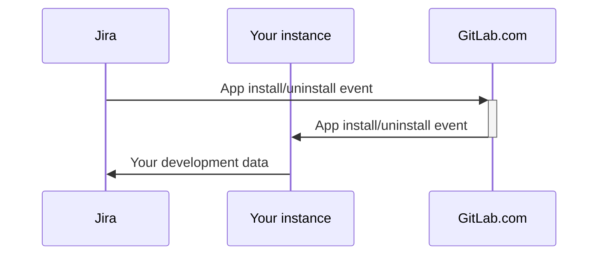



- 티어:  Free, Premium, Ultimate
- 제공 서비스: GitLab Self-Managed



> [!note]
> 이 페이지는 Jira Cloud 앱용 GitLab의 관리자 설명서입니다. 사용자 설명서는 [Jira Cloud 앱용 GitLab](../../integration/jira/connect-app.md)을 참조하세요.

[Jira Cloud 앱용 GitLab](https://marketplace.atlassian.com/apps/1221011/gitlab-com-for-jira-cloud?tab=overview&hosting=cloud)을 사용하면 GitLab과 Jira Cloud를 연결하여 실시간으로 개발 정보를 동기화할 수 있습니다. 이 정보는 [Jira 개발 패널](../../integration/jira/development_panel.md)에서 볼 수 있습니다.

GitLab Self-Managed 인스턴스에서 Jira Cloud 앱용 GitLab을 설정하려면 다음 중 하나를 수행합니다:

- [Atlassian Marketplace에서 Jira Cloud 앱용 GitLab 설치](#install-the-gitlab-for-jira-cloud-app-from-the-atlassian-marketplace)(GitLab 15.7 이상)
- [Jira Cloud 앱용 GitLab 수동 설치](#install-the-gitlab-for-jira-cloud-app-manually)

<i class="fa-youtube-play" aria-hidden="true"></i> 개요를 보려면:

- [GitLab Self-Managed 인스턴스용 Atlassian Marketplace에서 Jira Cloud 앱용 GitLab 설치](https://youtu.be/RnDw4PzmdW8?list=PL05JrBw4t0Koazgli_PmMQCER2pVH7vUT)
  <!-- Video published on 2024-10-30 -->
- [GitLab Self-Managed 인스턴스용 Jira Cloud 앱용 GitLab 수동 설치](https://youtu.be/fs02xS8BElA?list=PL05JrBw4t0Koazgli_PmMQCER2pVH7vUT)
  <!-- Video published on 2024-10-30 -->

위의 동영상은 최신 Jira Cloud 인스턴스에서 사용할 수 없을 수 있는 이전 [Universal Plugin Manager 인터페이스](https://community.atlassian.com/forums/Community-Announcements-articles/Cloud-admins-we-re-making-app-management-easier/ba-p/2806285)를 보여줍니다. 다음 지침은 이전 및 새로운 앱 관리 인터페이스를 모두 포함합니다.

[Atlassian Marketplace에서 Jira Cloud 앱용 GitLab을 설치](#install-the-gitlab-for-jira-cloud-app-from-the-atlassian-marketplace) 하면, Atlassian에서 개발 및 유지 관리하는 [프로젝트 도구 체인](https://support.atlassian.com/jira-software-cloud/docs/what-is-the-connections-feature/) 을 사용하여 [GitLab 리포지토리를 Jira 프로젝트에 연결](https://support.atlassian.com/jira-software-cloud/docs/link-repositories-to-a-project/#Link-repositories-using-the-toolchain-feature)할 수 있습니다. 프로젝트 도구 체인은 GitLab과 Jira Cloud 간의 개발 정보 동기화 방식에 영향을 주지 않습니다.

Jira Data Center 또는 Jira Server의 경우 Atlassian에서 개발 및 유지 관리하는 [Jira DVCS 커넥터](../../integration/jira/dvcs/_index.md)를 사용합니다.

## OAuth 인증 설정 {#set-up-oauth-authentication}

Jira Cloud 앱용 GitLab을 [Atlassian Marketplace에서 설치](#install-the-gitlab-for-jira-cloud-app-from-the-atlassian-marketplace) 하거나 [수동으로 설치](#install-the-gitlab-for-jira-cloud-app-manually)하려는 경우 OAuth 애플리케이션을 만들어야 합니다.

전제 조건:

- 관리자 액세스 권한이 있어야 합니다.

GitLab Self-Managed 인스턴스에서 OAuth 애플리케이션을 만들려면:

1. 오른쪽 위 모서리에서 **Admin**을 선택합니다.
1. 왼쪽 사이드바에서 **응용 프로그램**을 선택합니다.
1. **New application**을 선택합니다.
1. **Redirect URI**에서:
   - Atlassian Marketplace 목록에서 앱을 설치하는 경우 `https://gitlab.com/-/jira_connect/oauth_callbacks`을(를) 입력합니다.
   - 앱을 수동으로 설치하는 경우 `<instance_url>/-/jira_connect/oauth_callbacks`을(를) 입력하고 `<instance_url>`을(를) 인스턴스의 URL로 바꿉니다.
1. **신뢰함** 및 **비공개** 확인란을 선택 해제합니다.

   > [!note]
   > [로그인 오류](jira_cloud_app_troubleshooting.md#error-failed-to-sign-in-to-gitlab)를 방지하려면 이 확인란을 선택 해제해야 합니다.

1. **범위**에서 `api` 확인란만 선택합니다.
1. **애플리케이션 저장**을 선택합니다.
1. **애플리케이션 ID** 값을 복사합니다.
1. 왼쪽 사이드바에서 **Settings** > **General**을 선택합니다.
1. **Jira 앱용 GitLab**을 펼칩니다.
1. **애플리케이션 ID** 값을 **Jira Connect 애플리케이션 ID**에 붙여넣습니다.
1. **변경 사항 저장**을 선택합니다.

## Jira 사용자 요구사항 {#jira-user-requirements}



- `org-admins` 그룹에 대한 지원이 GitLab 16.6에서 [도입](https://gitlab.com/gitlab-org/gitlab/-/issues/420687)되었습니다.



[Atlassian 조직](https://admin.atlassian.com)에서는 Jira Cloud 앱용 GitLab을 설정하는 데 사용되는 Jira 사용자가 다음 중 하나의 멤버인지 확인해야 합니다:

- Organization Administrators(`org-admins`) 그룹 최신 Atlassian 조직에서는 [중앙화된 사용자 관리](https://support.atlassian.com/user-management/docs/give-users-admin-permissions/#Centralized-user-management-content)를 사용 중이며 `org-admins` 그룹이 포함되어 있습니다. 기존 Atlassian 조직은 중앙화된 사용자 관리로 마이그레이션 중입니다. 가능한 경우 `org-admins` 그룹을 사용하여 Jira Cloud 앱용 GitLab을 관리할 수 있는 Jira 사용자를 지정해야 합니다. 또는 `site-admins` 그룹을 사용할 수 있습니다.
- Site Administrators(`site-admins`) 그룹 `site-admins` 그룹은 [원래 사용자 관리](https://support.atlassian.com/user-management/docs/give-users-admin-permissions/#Original-user-management-content)에서 사용되었습니다.

필요한 경우:

1. [원하는 그룹 만들기](https://support.atlassian.com/user-management/docs/create-groups/)
1. [그룹 편집](https://support.atlassian.com/user-management/docs/edit-a-group/)하여 Jira 사용자를 멤버로 추가합니다.
1. Jira에서 전역 권한을 커스터마이징한 경우 Jira 사용자에게 [`Browse users and groups` 권한](https://confluence.atlassian.com/jirakb/unable-to-browse-for-users-and-groups-120521888.html)을 부여해야 할 수도 있습니다.

## Atlassian Marketplace에서 Jira Cloud 앱용 GitLab 설치 {#install-the-gitlab-for-jira-cloud-app-from-the-atlassian-marketplace}



- GitLab 15.7에서 도입되었습니다.



GitLab Self-Managed 인스턴스와 함께 Atlassian Marketplace의 공식 Jira Cloud 앱용 GitLab을 사용할 수 있습니다.

이 방법을 사용하면:

- GitLab.com에서 Jira Cloud에서 전송된 [설치 및 제거 수명 주기 이벤트를 처리](#gitlabcom-handling-of-app-lifecycle-events)하고 GitLab 인스턴스로 전달합니다. GitLab Self-Managed 인스턴스의 모든 데이터는 여전히 Jira Cloud로 직접 전송됩니다.
- GitLab.com에서 [브랜치 생성 링크를 처리](#gitlabcom-handling-of-branch-creation)하고 인스턴스로 리다이렉트합니다.
- GitLab 17.2 이전의 모든 버전에서는 GitLab Self-Managed 인스턴스의 Jira Cloud에서 브랜치를 생성할 수 없습니다. 자세한 내용은 [이슈 391432](https://gitlab.com/gitlab-org/gitlab/-/issues/391432)를 참조하세요.

또는 다음의 경우 [Jira Cloud 앱용 GitLab을 수동으로 설치](#install-the-gitlab-for-jira-cloud-app-manually)할 수 있습니다:

- 인스턴스가 [필수 조건](#prerequisites)을 충족하지 않습니다.
- 공식 Atlassian Marketplace 목록을 사용하고 싶지 않습니다.
- GitLab.com에서 [앱 수명 주기 이벤트를 처리](#gitlabcom-handling-of-app-lifecycle-events)하거나 인스턴스가 앱을 설치했음을 알기를 원하지 않습니다.
- GitLab.com에서 [브랜치 생성 링크를 리다이렉트](#gitlabcom-handling-of-branch-creation)하기를 원하지 않습니다.

### 전제 조건 {#prerequisites}

- 인스턴스는 공개적으로 사용 가능해야 합니다.
- 인스턴스는 GitLab 버전 15.7 이상이어야 합니다.
- [OAuth 인증](#set-up-oauth-authentication)을 설정해야 합니다.
- GitLab 인스턴스는 HTTPS를 사용해야 하고 GitLab 인증서는 공개적으로 신뢰할 수 있거나 전체 체인 인증서를 포함해야 합니다.
- 네트워크 구성은 다음을 허용해야 합니다:
  - GitLab Self-Managed 인스턴스에서 Jira Cloud로의 아웃바운드 연결([Atlassian IP 주소](https://support.atlassian.com/organization-administration/docs/ip-addresses-and-domains-for-atlassian-cloud-products/#Outgoing-Connections))
  - GitLab Self-Managed 인스턴스와 GitLab.com 간의 인바운드 및 아웃바운드 연결([GitLab.com IP 주소](../../user/gitlab_com/_index.md#ip-range))
  - 방화벽 뒤의 인스턴스:
    1. GitLab Self-Managed 인스턴스 앞에 인터넷 연결 [역방향 프록시](#using-a-reverse-proxy)를 설정합니다.
    1. GitLab.com에서의 인바운드 연결을 허용하도록 역방향 프록시를 구성합니다([GitLab.com IP 주소](../../user/gitlab_com/_index.md#ip-range))
    1. GitLab Self-Managed 인스턴스가 여전히 앞서 설명한 아웃바운드 연결을 만들 수 있는지 확인합니다.
- 앱을 설치 및 구성하는 Jira 사용자는 특정 [요구사항](#jira-user-requirements)을 충족해야 합니다.

### Atlassian Marketplace 설치를 위해 인스턴스 설정 {#set-up-your-instance-for-atlassian-marketplace-installation}

[필수 조건](#prerequisites)

GitLab 15.7 이상에서 Atlassian Marketplace 설치를 위해 GitLab Self-Managed 인스턴스를 설정하려면:

1. 오른쪽 위 모서리에서 **Admin**을 선택합니다.
1. 왼쪽 사이드바에서 **Settings** > **General**을 선택합니다.
1. **Jira 앱용 GitLab**을 펼칩니다.
1. **Jira Connect 프록시 URL**에 `https://gitlab.com`을(를) 입력하여 Atlassian Marketplace에서 앱을 설치합니다.
1. **변경 사항 저장**을 선택합니다.

### 인스턴스 연결 {#link-your-instance}

[필수 조건](#prerequisites)

GitLab Self-Managed 인스턴스를 Jira Cloud 앱용 GitLab에 연결하려면:

1. [Jira Cloud 앱용 GitLab](https://marketplace.atlassian.com/apps/1221011/gitlab-com-for-jira-cloud?tab=overview&hosting=cloud)을 설치합니다.
1. [Jira Cloud 앱용 GitLab 구성](../../integration/jira/connect-app.md#configure-the-gitlab-for-jira-cloud-app)
1. 선택사항. [Jira Cloud가 이제 연결되었는지 확인](#check-if-jira-cloud-is-linked)

#### Jira Cloud 연결 여부 확인 {#check-if-jira-cloud-is-linked}

[Rails 콘솔](../operations/rails_console.md#starting-a-rails-console-session)을 사용하여 Jira Cloud가 다음에 연결되어 있는지 확인할 수 있습니다:

- 특정 그룹:

  ```ruby
  JiraConnectSubscription.where(namespace: Namespace.by_path('group/subgroup'))
  ```

- 특정 프로젝트:

  ```ruby
  Project.find_by_full_path('path/to/project').jira_subscription_exists?
  ```

- 모든 그룹:

  ```ruby
  installation = JiraConnectInstallation.find_by_base_url("https://customer_name.atlassian.net")
  installation.subscriptions
  ```

## Jira Cloud 앱용 GitLab 수동 설치 {#install-the-gitlab-for-jira-cloud-app-manually}



- Connect 기반 수동 설치 방법이 GitLab 19.0에서 [제거](https://gitlab.com/gitlab-org/gitlab-jira-forge/-/work_items/9)되었습니다.



> [!warning]
> 이전 수동 설치 방법은 Atlassian Connect 개발 모드를 사용했습니다. Atlassian은 [2026년 3월 31일에 Connect 기반 비공개 설치를 비활성화](https://www.atlassian.com/blog/developer/announcing-connect-end-of-support-timeline-and-next-steps)했습니다. 이전에 **App descriptor URL** 워크플로우로 앱을 수동으로 설치했다면 이 섹션에 설명된 Forge 기반 설치로 마이그레이션합니다.

[공식 Atlassian Marketplace 목록을 사용](#install-the-gitlab-for-jira-cloud-app-from-the-atlassian-marketplace)할 수 없는 경우 Jira Cloud 앱용 GitLab을 수동으로 설치합니다. 예를 들어:

- 인스턴스가 [Marketplace 필수 조건](#prerequisites)을 충족하지 않습니다.
- GitLab.com에서 [앱 수명 주기 이벤트를 처리](#gitlabcom-handling-of-app-lifecycle-events)하거나 인스턴스가 앱을 설치했음을 알기를 원하지 않습니다.
- GitLab.com에서 [브랜치 생성 링크를 리다이렉트](#gitlabcom-handling-of-branch-creation)하기를 원하지 않습니다.

수동 설치 방법은 이제 [Atlassian Forge](https://developer.atlassian.com/platform/forge/)를 기반으로 합니다. 자신의 Atlassian 개발자 계정 아래에 [Jira Cloud Forge 앱용 GitLab](https://gitlab.com/gitlab-org/gitlab-jira-forge)의 비공개 사본을 게시하고 GitLab Self-Managed 또는 GitLab Dedicated 인스턴스를 가리킵니다.

### 전제 조건 {#prerequisites-1}

- 인스턴스는 공개적으로 신뢰할 수 있는 인증서와 함께 HTTPS를 통해 공개적으로 사용 가능해야 합니다.
- [OAuth 인증](#set-up-oauth-authentication)을 설정해야 합니다.
- 네트워크 구성은 다음을 허용해야 합니다:
  - Jira Cloud에서 `<instance_url>/-/jira_connect`로의 인바운드 HTTPS 연결([Atlassian IP 주소](https://support.atlassian.com/organization-administration/docs/ip-addresses-and-domains-for-atlassian-cloud-products/#Outgoing-Connections))
  - GitLab 인스턴스에서 `*.atlassian.net`로의 아웃바운드 HTTPS 연결로 개발 데이터를 Jira에 푸시합니다.
  - 방화벽 뒤의 인스턴스:
    1. GitLab Self-Managed 인스턴스 앞에 인터넷 연결 [역방향 프록시](#using-a-reverse-proxy)를 설정합니다.
    1. Jira Cloud에서의 인바운드 연결을 허용하도록 역방향 프록시를 구성합니다.
    1. GitLab Self-Managed 인스턴스가 여전히 앞서 설명한 아웃바운드 연결을 만들 수 있는지 확인합니다.
- 완전히 격리된 인스턴스는 통합을 사용할 수 없습니다. `*.atlassian.net`로의 아웃바운드 경로는 개발 패널 및 기타 Jira 측 표면에 필요합니다.
- 앱을 설치 및 구성하는 Jira 사용자는 특정 [요구사항](#jira-user-requirements)을 충족해야 합니다.
- Atlassian 개발자 계정과 Forge CLI용 [Atlassian API 토큰](https://id.atlassian.com/manage-profile/security/api-tokens)
- [Node.js 22 LTS](https://nodejs.org/) , [Forge CLI](https://developer.atlassian.com/platform/forge/getting-started/), `envsubst`, `git` 및 `curl`이(가) 있는 머신

### 수동 설치를 위해 인스턴스 설정 {#set-up-your-instance-for-manual-installation}

[필수 조건](#prerequisites-1)

수동 설치를 위해 GitLab Self-Managed 인스턴스를 설정하려면:

1. 오른쪽 위 모서리에서 **Admin**을 선택합니다.
1. 왼쪽 사이드바에서 **Settings** > **General**을 선택합니다.
1. **Jira 앱용 GitLab**을 펼칩니다.
1. **Jira Connect 프록시 URL**을(를) 비워서 앱을 수동으로 설치합니다.
1. **변경 사항 저장**을 선택합니다.

### 비공개 Forge 앱 게시 {#publish-a-private-forge-app}

Jira Cloud Forge 앱용 GitLab의 비공개 사본을 게시하고 Jira 사이트에 설치하려면:

1. [`gitlab-jira-forge`](https://gitlab.com/gitlab-org/gitlab-jira-forge) 리포지토리를 복제합니다:

   ```shell
   git clone --depth 1 https://gitlab.com/gitlab-org/gitlab-jira-forge.git
   cd gitlab-jira-forge
   ```

1. 필수 환경 변수를 내보냅니다. 예제 값을 GitLab 인스턴스 URL, Jira 사이트 및 Atlassian 자격증명으로 바꿉니다:

   ```shell
   export GITLAB_URL=https://gitlab.example.com
   export JIRA_SITE=acme.atlassian.net
   export FORGE_EMAIL=admin@example.com
   export FORGE_API_TOKEN=<your-atlassian-api-token>
   ```

1. 래퍼 스크립트를 실행하여 앱을 등록, 배포 및 설치합니다:

   ```shell
   ./scripts/install-self-managed.sh
   ```

   래퍼:
   - 필수 도구 및 변수를 확인합니다.
   - 처음 사용할 때 `forge register`을(를) 실행하여 Atlassian 계정에서 Forge 앱을 만듭니다.
   - 템플릿에서 `manifest.yml`을(를) 생성하고 `GITLAB_URL`에 고정합니다.
   - `forge deploy -e production`을(를) 실행합니다.
   - `forge install --site $JIRA_SITE --product jira`을(를) 실행합니다.

   스크립트는 등록된 `APP_ID`을(를) `.env.self-managed`에 캐시합니다. 이 파일을 백업합니다. 파일을 잃으면 앱을 다시 등록해야 하며, 이는 설치된 모든 Jira 사이트가 다시 설치되도록 강제합니다.

단계별 지침, 수동 `forge` 명령, 문제 해결 및 업그레이드 워크플로우는 `gitlab-jira-forge` 리포지토리의 [자체 관리 설치 가이드](https://gitlab.com/gitlab-org/gitlab-jira-forge/-/blob/main/docs/self-managed-install.md)를 참조하세요.

앱을 설치한 후 Jira에서 [Jira Cloud 앱용 GitLab 구성](../../integration/jira/connect-app.md#configure-the-gitlab-for-jira-cloud-app)을 수행하여 GitLab 네임스페이스를 연결합니다.

### 수동으로 설치된 앱 업데이트 {#update-the-manually-installed-app}

업스트림 매니페스트 변경사항을 비공개 Forge 앱에 가져오려면 `--update`으로 래퍼를 다시 실행합니다:

```shell
./scripts/install-self-managed.sh --update
```

스크립트는 로컬 복제본을 빠르게 전달하고, 매니페스트를 다시 생성하고, 앱을 재배포합니다. 부 버전 및 주 버전 업그레이드에 대한 자세한 내용은 자체 관리 설치 가이드의 [업그레이드](https://gitlab.com/gitlab-org/gitlab-jira-forge/-/blob/main/docs/self-managed-install.md#upgrading)를 참조하세요.

## 여러 GitLab 인스턴스 연결 {#connect-multiple-gitlab-instances}

Jira 앱용 GitLab을 사용하여 여러 GitLab 인스턴스를 단일 Jira Cloud 인스턴스에 연결합니다. 설치 방법은 연결하려는 인스턴스에 따라 다릅니다.

전제 조건:

- 각 인스턴스에는 별도의 OAuth 인증이 필요합니다.
- 각 설치 방법에 대한 필수 조건을 충족해야 합니다.

GitLab.com + GitLab Self-Managed:

- GitLab.com:  Atlassian Marketplace 설치를 사용합니다.
- GitLab Self-managed 인스턴스:  앱을 수동으로 설치합니다.

여러 GitLab Self-Managed 인스턴스:

- 첫 번째 인스턴스:  Atlassian Marketplace 설치를 사용하거나 앱을 수동으로 설치합니다.
- 다른 인스턴스:  앱을 수동으로 설치합니다.

Jira Cloud는 각 설치에 대해 Jira Cloud 앱용 GitLab을 표시합니다.

조직당 하나의 GitLab 인스턴스만 공식 Atlassian Marketplace 목록을 사용할 수 있습니다.

## 프록시로 역할을 하도록 GitLab 인스턴스 구성 {#configure-your-gitlab-instance-to-serve-as-a-proxy}

> [!note]
> 대부분의 사용자에게 이 구성은 필요하지 않습니다. 여러 인스턴스가 있는 Jira Cloud로 이동하려면 Jira Cloud 앱용 GitLab으로 각 인스턴스를 연결할 수 있습니다.

GitLab 인스턴스는 Jira Cloud 앱용 GitLab을 통해 다른 GitLab 인스턴스에 대한 프록시 역할을 할 수 있습니다. 여러 GitLab 인스턴스를 관리하지만 앱을 한 번만 [수동으로 설치](#install-the-gitlab-for-jira-cloud-app-manually)하려는 경우 프록시를 사용할 수 있습니다.

프록시로 역할을 하도록 GitLab 인스턴스를 구성하려면:

1. 오른쪽 위 모서리에서 **Admin**을 선택합니다.
1. 왼쪽 사이드바에서 **Settings** > **General**을 선택합니다.
1. **Jira 앱용 GitLab**을 펼칩니다.
1. **공개 키 스토리지 활성화**를 선택합니다.
1. **변경 사항 저장**을 선택합니다.
1. [Jira Cloud 앱용 GitLab 수동 설치](#install-the-gitlab-for-jira-cloud-app-manually)

프록시를 사용하는 다른 GitLab 인스턴스는 프록시 인스턴스를 가리키도록 다음 설정을 구성해야 합니다:

- [**Jira Connect 프록시 URL**](#set-up-your-instance-for-atlassian-marketplace-installation)
- [**Redirect URI**](#set-up-oauth-authentication)

## 보안 고려사항 {#security-considerations}

다음 보안 고려사항은 앱 관리에만 적용됩니다. 앱 사용과 관련된 고려사항은 [보안 고려사항](../../integration/jira/connect-app.md#security-considerations)을 참조하세요.

### GitLab.com 앱 수명 주기 이벤트 처리 {#gitlabcom-handling-of-app-lifecycle-events}

[Atlassian Marketplace에서 Jira Cloud 앱용 GitLab을 설치](#install-the-gitlab-for-jira-cloud-app-from-the-atlassian-marketplace) 할 때 GitLab.com에서 Jira의 [수명 주기 이벤트](https://developer.atlassian.com/cloud/jira/platform/connect-app-descriptor/#lifecycle)를 수신합니다. 이 이벤트는 Jira 프로젝트에서 앱이 설치되거나 제거될 때로 제한됩니다.

설치 이벤트에서 GitLab.com은 Jira에서 **secret token**을 수신합니다. GitLab.com은 나중에 Jira에서 들어오는 수명 주기 이벤트를 확인하기 위해 `AES256-GCM`으로 암호화된 이 토큰을 저장합니다.

GitLab.com은 인스턴스가 동일한 토큰으로 [Jira에 대한 요청](../../integration/jira/connect-app.md#data-sent-from-gitlab-to-jira)을 인증할 수 있도록 토큰을 GitLab Self-Managed 인스턴스로 전달합니다. GitLab Self-Managed 인스턴스도 Jira Cloud 앱용 GitLab이 설치 또는 제거되었음을 알립니다.

GitLab Self-Managed 인스턴스에서 Jira 개발 패널로 [데이터가 전송](../../integration/jira/connect-app.md#data-sent-from-gitlab-to-jira)될 때, GitLab Self-Managed 인스턴스에서 Jira로 직접 전송되며 GitLab.com으로 전송되지 않습니다. GitLab.com은 토큰을 사용하여 Jira 프로젝트의 데이터에 액세스하지 않습니다. GitLab Self-Managed 인스턴스는 토큰을 사용하여 [데이터에 액세스](../../integration/jira/connect-app.md#gitlab-access-to-jira)합니다.

GitLab.com이 수신하는 수명 주기 이벤트 및 페이로드에 대한 자세한 내용은 [Atlassian 설명서](https://developer.atlassian.com/cloud/jira/platform/connect-app-descriptor/#lifecycle)를 참조하세요.



### GitLab.com 브랜치 생성 처리 {#gitlabcom-handling-of-branch-creation}

[Atlassian Marketplace에서 Jira Cloud 앱용 GitLab을 설치](#install-the-gitlab-for-jira-cloud-app-from-the-atlassian-marketplace)했을 때, 개발 패널에서 브랜치를 생성하기 위한 링크는 처음에 사용자를 GitLab.com으로 보냅니다.

Jira에서 GitLab.com으로 JWT 토큰을 보냅니다. GitLab.com은 토큰을 확인한 후 요청을 GitLab 인스턴스로 리다이렉트합니다.

### OAuth를 통한 GitLab 액세스 {#access-to-gitlab-through-oauth}

GitLab은 Jira와 액세스 토큰을 공유하지 않습니다. 그러나 사용자는 앱을 구성하기 위해 OAuth를 통해 인증해야 합니다.

액세스 토큰은 [PKCE](https://www.rfc-editor.org/rfc/rfc7636) OAuth 플로우를 통해 검색되며 클라이언트 측에만 저장됩니다. OAuth 플로우를 초기화하는 앱 프론트엔드는 Jira의 iframe를 통해 GitLab에서 로드되는 JavaScript 애플리케이션입니다.

OAuth 애플리케이션은 API에 대한 완전한 읽기 및 쓰기 액세스를 제공하는 `api` 범위를 가져야 합니다. 이 액세스에는 모든 그룹 및 프로젝트, 컨테이너 레지스트리 및 패키지 레지스트리가 포함됩니다. 하지만 Jira Cloud 앱용 GitLab은 이 액세스만 다음과 같이 사용합니다:

- 링크할 그룹을 표시합니다.
- 그룹을 연결합니다.

OAuth를 통한 액세스는 사용자가 Jira Cloud 앱용 GitLab을 구성할 때만 필요합니다. 자세한 내용은 [액세스 토큰 만료](../../integration/oauth_provider.md#access-token-expiration)를 참조하세요.

## 역방향 프록시 사용 {#using-a-reverse-proxy}

가능하면 GitLab Self-Managed 인스턴스 앞에서 역방향 프록시 사용을 피해야 합니다. 대신 공개 IP 주소를 사용하고 방화벽으로 도메인을 보호하는 것을 고려하세요.

인터넷에서 직접 액세스할 수 없는 GitLab Self-Managed 인스턴스에서 Jira Cloud 앱용 GitLab에 대해 역방향 프록시를 사용해야 하는 경우 다음에 유의하세요:

- [Atlassian Marketplace에서 Jira Cloud 앱용 GitLab을 설치](#install-the-gitlab-for-jira-cloud-app-from-the-atlassian-marketplace)할 때 내부 GitLab FQDN과 역방향 프록시 FQDN 모두에 액세스할 수 있는 클라이언트를 사용하세요.
- [Jira Cloud 앱용 GitLab을 수동으로 설치](#install-the-gitlab-for-jira-cloud-app-manually)할 때 **Redirect URI**에 역방향 프록시 FQDN을 사용하여 [OAuth 인증](#set-up-oauth-authentication)을 설정합니다.
- 역방향 프록시는 설치 방법에 대해 다음의 필수 조건을 충족해야 합니다:
  - [Jira Cloud 앱용 GitLab 연결을 위한 필수 조건](#prerequisites)
  - [Jira Cloud 앱용 GitLab 수동 설치를 위한 필수 조건](#prerequisites-1)
- [Jira 개발 패널](../../integration/jira/development_panel.md)은 역방향 프록시 FQDN 대신 내부 GitLab FQDN 또는 GitLab.com에 연결될 수 있습니다. 자세한 내용은 [이슈 434085](https://gitlab.com/gitlab-org/gitlab/-/issues/434085)를 참조하세요.
- 공개 인터넷에서 역방향 프록시를 보호하려면 [Atlassian IP 주소](https://support.atlassian.com/organization-administration/docs/ip-addresses-and-domains-for-atlassian-cloud-products/#Outgoing-Connections)에서만 인바운드 트래픽을 허용하세요.
- 프록시에서 rewrite 또는 subfilter를 사용하는 경우 프록시가 `gitlab-jira-connect-${host}` 앱 키를 다시 쓰거나 바꾸지 않는지 확인하세요. 그렇지 않으면 [`Failed to link group`](jira_cloud_app_troubleshooting.md#error-failed-to-link-group) 오류가 발생할 수 있습니다.
- Jira 개발 패널에서 [**브랜치 생성**](https://support.atlassian.com/jira-software-cloud/docs/view-development-information-for-an-issue/#Create-feature-branches)을 선택하면 내부 GitLab FQDN이 아닌 역방향 프록시 FQDN으로 리다이렉트됩니다.

### 외부 NGINX {#external-nginx}

이 서버 블록은 Jira Cloud와 함께 작동하도록 GitLab에 대한 역방향 프록시를 구성하는 방법의 예입니다:

```nginx
server {
  listen *:80;
  server_name gitlab.mycompany.com;
  server_tokens off;
  location /.well-known/acme-challenge/ {
    root /var/www/;
  }
  location / {
    return 301 https://gitlab.mycompany.com:443$request_uri;
  }
}
server {
  listen *:443 ssl;
  server_tokens off;
  server_name gitlab.mycompany.com;
  ssl_certificate /etc/letsencrypt/live/gitlab.mycompany.com/fullchain.pem;
  ssl_certificate_key /etc/letsencrypt/live/gitlab.mycompany.com/privkey.pem;
  ssl_ciphers 'ECDHE-ECDSA-AES128-GCM-SHA256:ECDHE-RSA-AES128-GCM-SHA256:ECDHE-ECDSA-AES256-GCM-SHA384:ECDHE-RSA-AES256-GCM-SHA384:ECDHE-ECDSA-CHACHA20-POLY1305:ECDHE-RSA-CHACHA20-POLY1305:DHE-RSA-AES128-GCM-SHA256:DHE-RSA-AES256-GCM-SHA384';
  ssl_protocols  TLSv1.2 TLSv1.3;
  ssl_prefer_server_ciphers off;
  ssl_session_cache  shared:SSL:10m;
  ssl_session_tickets off;
  ssl_session_timeout  1d;
  access_log "/var/log/nginx/proxy_access.log";
  error_log "/var/log/nginx/proxy_error.log";
  location / {
    proxy_pass https://gitlab.internal;
    proxy_hide_header upgrade;
    proxy_set_header Host             gitlab.mycompany.com:443;
    proxy_set_header X-Real-IP        $remote_addr;
    proxy_set_header X-Forwarded-For  $proxy_add_x_forwarded_for;
  }
}
```

이 예에서:

- `gitlab.mycompany.com`을(를) 역방향 프록시 FQDN으로, `gitlab.internal`을(를) 내부 GitLab FQDN으로 바꿉니다.
- `ssl_certificate` 및 `ssl_certificate_key`을(를) 유효한 인증서로 설정합니다([Certbot](https://certbot.eff.org/) 사용 예제).
- `Host` 프록시 헤더를 역방향 프록시 FQDN으로 설정하여 GitLab과 Jira Cloud가 성공적으로 연결될 수 있도록 합니다.

Jira Cloud를 GitLab에 연결하기 위해 역방향 프록시 FQDN만 사용해야 합니다. 내부 GitLab FQDN에서 GitLab에 계속 액세스해야 합니다. 역방향 프록시 FQDN에서 GitLab에 액세스하면 GitLab이 예상대로 작동하지 않을 수 있습니다. 자세한 내용은 [이슈 21319](https://gitlab.com/gitlab-org/gitlab/-/issues/21319)를 참조하세요.

### 추가 JWT 대상 설정 {#set-an-additional-jwt-audience}



- GitLab 17.7에서 [도입](https://gitlab.com/gitlab-org/gitlab/-/issues/498587)되었습니다.



GitLab이 Jira에서 JWT 토큰을 받으면 JWT 대상을 확인하여 토큰을 확인합니다. 기본적으로 대상은 내부 GitLab FQDN에서 파생됩니다.

일부 역방향 프록시 구성에서는 역방향 프록시 FQDN을 추가 JWT 대상으로 설정해야 할 수 있습니다. 추가 JWT 대상을 설정하려면:

1. 오른쪽 위 모서리에서 **Admin**을 선택합니다.
1. 왼쪽 사이드바에서 **Settings** > **General**을 선택합니다.
1. **Jira 앱용 GitLab**을 펼칩니다.
1. **Jira Connect Additional Audience URL**에 추가 대상을 입력합니다(예: `https://gitlab.mycompany.com`).
1. **변경 사항 저장**을 선택합니다.
