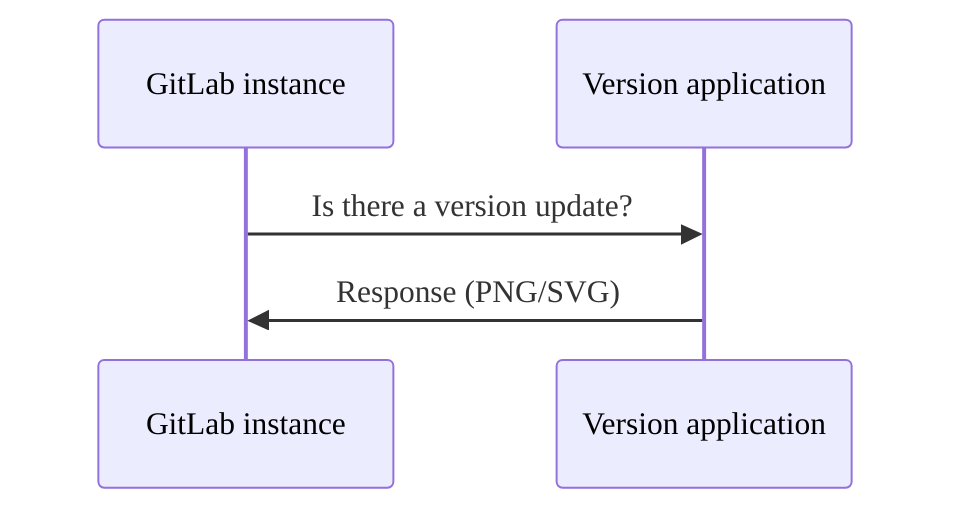



- 티어:  Free, Premium, Ultimate
- 제공 서비스: GitLab Self-Managed



GitLab Inc.는 인스턴스에 대한 정보를 주기적으로 수집하여 다양한 작업을 수행합니다.

무료 GitLab Self-Managed 인스턴스의 경우 모든 사용 통계는 [선택 해제](#enable-or-disable-service-ping)입니다.

## 서비스 핑 {#service-ping}

서비스 핑은 주간 페이로드를 GitLab Inc.로 수집하고 전송하는 프로세스입니다. 서비스 핑이 활성화되면 GitLab은 다른 인스턴스에서 데이터를 수집하고 서비스 핑에 따라 달라지는 특정 [인스턴스 수준 분석 기능](../../user/analytics/_index.md)을 활성화합니다.

### 서비스 핑을 활성화해야 하는 이유 {#why-enable-service-ping}

서비스 핑의 주요 목적은 더 나은 GitLab을 구축하는 것입니다. GitLab 사용 방식에 대한 데이터를 수집하여 기능 또는 스테이지 채택 및 사용을 이해합니다. 이 데이터는 GitLab이 어떻게 가치를 추가하는지에 대한 통찰력을 제공하고 팀이 사람들이 GitLab을 사용하는 이유를 이해하는 데 도움을 주며, 이러한 지식을 통해 더 나은 제품 결정을 내릴 수 있습니다.

서비스 핑을 활성화하면 몇 가지 다른 이점이 있습니다:

- GitLab 설치의 시간 경과에 따른 사용자 활동을 분석합니다.
- [DevOps 점수](../analytics/devops_adoption.md)로 전체 인스턴스의 계획부터 모니터링까지의 동시 DevOps 채택에 대한 개요를 제공합니다.
- 수집된 데이터를 사용할 수 있는 고객 성공 관리자(CSM)를 통한 보다 선제적인 지원입니다.
- GitLab 투자에서 최대 가치를 얻는 방법에 대한 통찰력과 조언입니다.
- 다른 유사 조직(익명화됨)과 비교하는 방법을 보여주는 보고서, 그리고 DevOps 프로세스를 개선하는 방법에 대한 구체적인 조언 및 권장사항입니다.
- [등록 기능 프로그램](#registration-features-program)에 참여하여 무료 유료 기능을 받습니다.

### 서비스 핑 설정 {#service-ping-settings}

GitLab은 서비스 핑 관련 세 가지 설정을 제공합니다:

- **Enable Service Ping**:  서비스 핑 데이터를 GitLab으로 전송할지 여부를 제어합니다.
- **서비스 핑 생성 활성화**:  서비스 핑 데이터가 인스턴스에서 생성될지 여부를 제어합니다.
- **Include optional data in Service Ping**:  선택적 메트릭이 서비스 핑 데이터에 포함될지 여부를 제어합니다.

이 세 가지 설정은 다음과 같은 방식으로 상호작용합니다:

- **Service Ping**이 활성화되면 **Service Ping Generation**이 자동으로 활성화되고 비활성화할 수 없습니다.
- **Service Ping**이 비활성화되면 **Service Ping Generation**을 독립적으로 제어할 수 있습니다.
- **Include optional data in Service Ping**은 **Service Ping** 또는 **Service Ping Generation**이 활성화된 경우에만 사용할 수 있습니다.

## 등록 기능 프로그램 {#registration-features-program}

GitLab 버전 14.1 이상에서 GitLab Enterprise Edition을 실행하는 GitLab Self-Managed 인스턴스가 있는 GitLab Free 고객은 [등록 기능 활성화](#enable-registration-features) 및 서비스 핑을 통해 활동 데이터를 전송하여 유료 기능을 받을 수 있습니다. 여기에 소개된 기능은 유료 등급에서 기능을 제거하지 않습니다. 유료 등급의 인스턴스는 [제품 사용 데이터 정책](https://handbook.gitlab.com/handbook/legal/privacy/customer-product-usage-information/) ([클라우드 라이센싱](https://about.gitlab.com/pricing/licensing-faq/cloud-licensing/)에서 관리)의 적용을 받습니다.

### 사용 가능한 기능 {#available-features}

다음 표에서 다음을 확인할 수 있습니다:

- 등록 기능 프로그램에서 사용할 수 있는 기능
- 기능을 사용할 수 있는 GitLab 버전

| 기능 | 사용 가능한 버전 |
| ------ | ------ |
| [GitLab의 이메일](../email_from_gitlab.md)       |   GitLab 14.1 이상     |
| [리포지토리 크기 제한](account_and_limit_settings.md#repository-size-limit) | GitLab 14.4 이상 |
| [IP 주소별 그룹 액세스 제한](../../user/group/access_and_permissions.md#restrict-group-access-by-ip-address) | GitLab 14.4 이상 |
| [설명 변경 기록 보기](../../user/discussions/_index.md#view-description-change-history) | GitLab 16.0 이상 |
| [유지보수 모드](../maintenance_mode/_index.md) | GitLab 16.0 이상 |
| [구성 가능한 이슈 보드](../../user/project/issue_board.md#configurable-issue-boards) | GitLab 16.0 이상 |
| [적용 범위 기반 퍼즈 테스팅](../../user/application_security/coverage_fuzzing/_index.md) | GitLab 16.0 이상 |
| [비밀번호 복잡성 요구사항 수정](sign_up_restrictions.md#modify-password-complexity-requirements) | GitLab 16.0 이상 |
| [그룹 위키](../../user/project/wiki/group.md) | GitLab 16.5 이상 |
| [이슈 분석](../../user/group/issues_analytics/_index.md) | GitLab 16.5 이상 |
| [이메일의 사용자 정의 텍스트](email.md#custom-additional-text) | GitLab 16.5 이상 |
| [기여도 분석](../../user/group/contribution_analytics/_index.md) | GitLab 16.5 이상 |
| [그룹 파일 템플릿](../../user/group/manage.md#group-file-templates) | GitLab 16.6 이상 |
| [그룹 웹후크](../../user/project/integrations/webhooks.md#group-webhooks) | GitLab 16.6 이상 |
| [서비스 수준 계약 카운트다운 타이머](../../operations/incident_management/incidents.md#service-level-agreement-countdown-timer) | GitLab 16.6 이상 |
| [프로젝트 멤버십을 그룹으로 잠금](../../user/group/access_and_permissions.md#prevent-members-from-being-added-to-projects-in-a-group) | GitLab 16.6 이상 |
| [사용자 및 권한 보고서](../admin_area.md#user-permission-export) | GitLab 16.6 이상 |
| [고급 검색](../../user/search/advanced_search.md) | GitLab 16.6 이상 |
| [DevOps 채택](../../user/group/devops_adoption/_index.md) | GitLab 16.6 이상 |
| [아티팩트 종속성이 있는 교차 프로젝트 파이프라인](../../ci/yaml/_index.md#needsproject) | GitLab 16.7 이상 |
| [기능 플래그 관련 이슈](../../operations/feature_flags.md#feature-flag-related-issues) | GitLab 16.7 이상 |
| [병합된 결과 파이프라인](../../ci/pipelines/merged_results_pipelines.md) | GitLab 16.7 이상 |
| [외부 리포지토리용 CI/CD](../../ci/ci_cd_for_external_repos/_index.md) | GitLab 16.7 이상 |
| [GitHub용 CI/CD](../../ci/ci_cd_for_external_repos/github_integration.md) | GitLab 16.7 이상 |

### 등록 기능 활성화 {#enable-registration-features}

1. 관리자 액세스 권한이 있는 사용자로 로그인합니다.
1. 오른쪽 위 모서리에서 **Admin**을 선택합니다.
1. 왼쪽 사이드바에서 **설정** > **측정항목 및 프로파일링**을 선택합니다.
1. **사용 통계** 섹션을 확장합니다.
1. 활성화되지 않은 경우 **Enable Service Ping** 확인란을 선택합니다.
1. **등록 기능 활성화** 확인란을 선택합니다.
1. **변경 사항 저장**을 선택합니다.

## 버전 점검 {#version-check}

활성화된 경우 버전 점검은 새 버전을 사용할 수 있는지 여부와 상태를 통해 그 중요성을 알려줍니다. 상태는 모든 인증된 사용자의 도움말 페이지(`/help`)와 **운영자** 영역 페이지에 표시됩니다. 상태는 다음과 같습니다:

- 녹색:  GitLab의 최신 버전을 실행 중입니다.
- 주황색:  GitLab의 업데이트된 버전을 사용할 수 있습니다.
- 빨간색:  실행 중인 GitLab 버전이 취약합니다. 보안 수정사항이 포함된 최신 버전을 최대한 빨리 설치해야 합니다.


### 버전 점검 활성화 또는 비활성화 {#enable-or-disable-version-check}

전제 조건:

- 관리자 액세스 권한이 있어야 합니다.

1. 오른쪽 위 모서리에서 **Admin**을 선택합니다.
1. 왼쪽 사이드바에서 **설정** > **측정항목 및 프로파일링**을 선택합니다.
1. **사용 통계**를 확장합니다.
1. **버전 점검 활성화** 확인란을 선택하거나 선택 취소합니다.
1. **변경 사항 저장**을 선택합니다.

### 요청 흐름 예 {#request-flow-example}

다음 예는 인스턴스와 GitLab 버전 애플리케이션 간의 기본 요청/응답 흐름을 보여줍니다:



## 네트워크 구성 {#configure-your-network}

GitLab Inc.에 사용 통계를 보내려면 GitLab 인스턴스에서 호스트 `version.gitlab.com`로의 포트 `443`에서 네트워크 트래픽을 허용해야 합니다.

GitLab 인스턴스가 프록시 뒤에 있는 경우 적절한 [프록시 구성 변수](https://docs.gitlab.com/omnibus/settings/environment-variables/)를 설정합니다.

## 서비스 핑 활성화 또는 비활성화 {#enable-or-disable-service-ping}

> [!note]
> 서비스 핑을 완전히 비활성화할 수 있는지 여부는 인스턴스의 티어와 특정 라이센스에 따라 다릅니다. 서비스 핑 설정은 데이터가 GitLab과 공유되는지 또는 인스턴스의 내부 사용으로만 제한되는지 여부만 제어합니다. 서비스 핑을 비활성화해도 `gitlab_service_ping_worker` 백그라운드 작업은 계속 주기적으로 인스턴스에 대한 서비스 핑 페이로드를 생성합니다. 페이로드는 [측정항목 및 프로파일링](#manually-upload-service-ping-payload) 관리자 섹션에서 사용할 수 있습니다.

### UI를 통해 {#through-the-ui}

전제 조건:

- 관리자 액세스 권한이 있어야 합니다.

서비스 핑을 활성화 또는 비활성화하려면:

1. 오른쪽 위 모서리에서 **Admin**을 선택합니다.
1. 왼쪽 사이드바에서 **설정** > **측정항목 및 프로파일링**을 선택합니다.
1. **사용 통계**를 확장합니다.
1. **Enable Service Ping** 확인란을 선택하거나 선택 취소합니다.
1. **변경 사항 저장**을 선택합니다.

### 구성 파일을 통해 {#through-the-configuration-file}

서비스 핑을 비활성화하고 향후 **운영자** 영역을 통해 구성되는 것을 방지합니다.





1. `/etc/gitlab/gitlab.rb`을 편집하세요:

   ```ruby
   gitlab_rails['usage_ping_enabled'] = false
   ```

1. GitLab을 재구성하세요:

   ```shell
   sudo gitlab-ctl reconfigure
   ```





1. `/home/git/gitlab/config/gitlab.yml`을 편집하세요:

   ```yaml
   production: &base
     # ...
     gitlab:
       # ...
       usage_ping_enabled: false
   ```

1. GitLab을 다시 시작합니다:

   ```shell
   sudo service gitlab restart
   ```





## 서비스 핑 생성 활성화 또는 비활성화 {#enable-or-disable-service-ping-generation}

서비스 핑 생성은 인스턴스에서 서비스 핑 데이터를 자동으로 생성할지 여부를 제어합니다. 활성화하면 GitLab은 주기적으로 사용 통계가 포함된 서비스 핑 페이로드를 생성합니다. 이 설정은 데이터가 GitLab과 공유되는지 여부와 무관하게 작동합니다.

### UI를 통해 {#through-the-ui-1}

전제 조건:

- 관리자 액세스 권한이 있어야 합니다.

서비스 핑 생성을 활성화 또는 비활성화하려면:

1. 오른쪽 위 모서리에서 **Admin**을 선택합니다.
1. 왼쪽 사이드바에서 **설정** > **측정항목 및 프로파일링**을 선택합니다.
1. **사용 통계**를 확장합니다.
1. **서비스 핑 생성 활성화** 확인란을 선택하거나 선택 취소합니다.
   - **Enable Service Ping**를 선택하면 이 설정이 자동으로 활성화되고 상호작용에서 비활성화됩니다.
   - **Enable Service Ping**를 선택 취소하면 이 설정을 독립적으로 제어할 수 있습니다.
1. **변경 사항 저장**을 선택합니다.

### 구성 파일을 통해 {#through-the-configuration-file-1}

구성을 통해 서비스 핑 생성을 제어하려면:





1. `/etc/gitlab/gitlab.rb`을 편집하세요:

   ```ruby
   gitlab_rails['usage_ping_enabled'] = false
   gitlab_rails['usage_ping_generation_enabled'] = false
   ```

1. GitLab을 재구성하세요:

   ```shell
   sudo gitlab-ctl reconfigure
   ```





1. `/home/git/gitlab/config/gitlab.yml`을 편집하세요:

   ```yaml
   production: &base
     # ...
     gitlab:
       # ...
       usage_ping_enabled: false
       usage_ping_generation_enabled: false
   ```

1. GitLab을 다시 시작합니다:

   ```shell
   sudo service gitlab restart
   ```





## 서비스 핑에서 선택적 데이터 활성화 또는 비활성화 {#enable-or-disable-optional-data-in-service-ping}

GitLab은 운영 데이터와 선택적 수집 데이터를 구별합니다.

> [!note]
> **Include optional data in Service Ping** 옵션은 **Enable Service Ping** 또는 **서비스 핑 생성 활성화**가 활성화된 경우에만 사용할 수 있습니다. 두 설정이 모두 비활성화되면 이 옵션이 자동으로 비활성화됩니다.

### UI를 통해 {#through-the-ui-2}

전제 조건:

- 관리자 액세스 권한이 있어야 합니다.

서비스 핑에서 선택적 데이터를 활성화 또는 비활성화하려면:

1. 오른쪽 위 모서리에서 **Admin**을 선택합니다.
1. **설정** > **Metrics and Profiling**으로 이동합니다.
1. **Usage Statistics** 섹션을 확장합니다.
1. **Enable Service Ping** 또는 **서비스 핑 생성 활성화**에 대한 확인란이 선택되어 있는지 확인합니다.
1. 선택적 데이터를 활성화하려면 **Include optional data in Service Ping** 확인란을 선택합니다. 비활성화하려면 상자를 선택 취소합니다.
1. **변경 사항 저장**을 선택합니다.

### 구성 파일을 통해 {#through-the-configuration-file-2}





1. `/etc/gitlab/gitlab.rb`을 편집하세요:

   ```ruby
   gitlab_rails['include_optional_metrics_in_service_ping'] = false
   ```

1. GitLab을 재구성하세요:

   ```shell
   sudo gitlab-ctl reconfigure
   ```





1. `/home/git/gitlab/config/gitlab.yml`을 편집하세요:

   ```yaml
   production: &base
     # ...
     gitlab:
       # ...
       include_optional_metrics_in_service_ping: false
   ```

1. GitLab을 다시 시작합니다:

   ```shell
   sudo service gitlab restart
   ```





## 서비스 핑 페이로드 액세스 {#access-the-service-ping-payload}

**운영자** 영역이나 API를 통해 GitLab Inc.로 전송된 정확한 JSON 페이로드에 액세스할 수 있습니다.

### UI에서 {#in-the-ui}

1. 관리자 액세스 권한이 있는 사용자로 로그인합니다.
1. 오른쪽 위 모서리에서 **Admin**을 선택합니다.
1. 왼쪽 사이드바에서 **설정** > **측정항목 및 프로파일링**을 선택합니다.
1. **사용 통계**를 확장합니다.
1. **페이로드 미리보기**를 선택합니다.

### API를 통해 {#through-the-api}

[서비스 핑 API 문서](../../api/usage_data.md)를 참조하세요.

## 서비스 핑 페이로드를 수동으로 업로드 {#manually-upload-service-ping-payload}

인스턴스에 인터넷 액세스 권한이 없거나 서비스 핑 크론 작업이 활성화되지 않은 경우에도 서비스 핑 페이로드를 GitLab에 업로드할 수 있습니다.

페이로드를 수동으로 업로드하려면:

1. 관리자 액세스 권한이 있는 사용자로 로그인합니다.
1. 오른쪽 위 모서리에서 **Admin**을 선택합니다.
1. 왼쪽 사이드바에서 **설정** > **측정항목 및 프로파일링**을 선택합니다.
1. **사용 통계**를 확장합니다.
1. **페이로드 다운로드**를 선택합니다.
1. JSON 파일을 저장합니다.
1. [서비스 사용 데이터 센터](https://version.gitlab.com/usage_data/new)를 방문합니다.
1. **파일 선택**을 선택한 다음 다운로드한 페이로드가 포함된 JSON 파일을 선택합니다.
1. **업로드**를 선택합니다.

업로드된 파일은 암호화되어 보안 HTTPS 프로토콜을 사용하여 전송됩니다. HTTPS는 웹 브라우저와 서버 간에 보안 통신 채널을 만들고 중간자 공격으로부터 전송된 데이터를 보호합니다.

수동 업로드에 문제가 있는 경우:

1. [버전 앱 프로젝트의 보안 포크](https://gitlab.com/gitlab-org/security/version.gitlab.com)에서 기밀 이슈를 엽니다.
1. 가능하면 JSON 페이로드를 첨부합니다.
1. `@gitlab-org/analytics-section/analytics-instrumentation`에 태그를 지정합니다. 이 팀이 이슈를 분류합니다.
