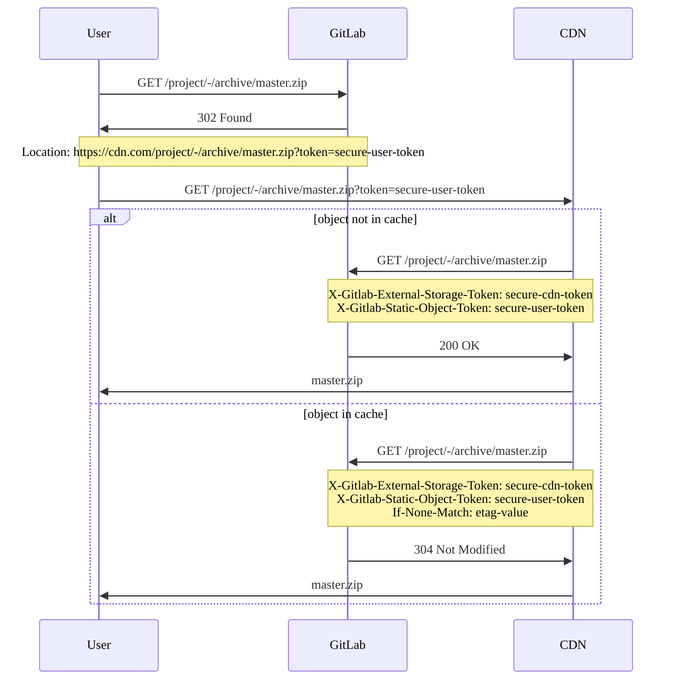



- 티어:  Free, Premium, Ultimate
- 제공 서비스: GitLab Self-Managed



GitLab을 구성하여 리포지토리 정적 개체(예: 아카이브 또는 raw blob)를 콘텐츠 전송 네트워크(CDN)와 같은 외부 스토리지에서 제공합니다.

## 외부 스토리지 구성 {#configure-external-storage}

전제 조건:

- 관리자 액세스 권한이 있어야 합니다.

정적 개체에 대한 외부 스토리지를 구성하려면:

1. 오른쪽 위 모서리에서 **Admin**을 선택합니다.
1. 왼쪽 사이드바에서 **설정** > **리포지토리**를 선택합니다.
1. **리포지토리 정적 개체를 위한 외부 스토리지**를 확장합니다.
1. 기본 URL과 임의의 토큰을 입력합니다. [외부 스토리지를 설정](#set-up-external-storage)할 때 이러한 값을 `ORIGIN_HOSTNAME` 및 `STORAGE_TOKEN`으로 설정하는 스크립트를 사용합니다.
1. **변경 사항 저장**을 선택합니다.

토큰은 외부 스토리지에서 오는 요청을 구분하기 위해 필요하므로 사용자가 외부 스토리지를 우회하여 애플리케이션에 직접 액세스하지 않습니다. GitLab은 외부 스토리지에서 시작한 요청의 `X-Gitlab-External-Storage-Token` 헤더에 이 토큰을 설정하도록 예상합니다.

## 비공개 정적 개체 제공 {#serving-private-static-objects}

GitLab은 비공개 프로젝트에 속한 정적 개체 URL에 사용자별 토큰을 추가하므로 외부 스토리지를 사용자를 대신하여 인증할 수 있습니다.

외부 스토리지에서 시작한 요청을 처리할 때 GitLab은 다음을 확인하여 사용자가 요청된 개체에 액세스할 수 있는지 확인합니다:

- `token` 쿼리 매개변수입니다.
- `X-Gitlab-Static-Object-Token` 헤더입니다.

## 요청 흐름 예 {#requests-flow-example}

다음 예는 다음 간의 요청 및 응답 시퀀스를 보여줍니다:

- 사용자
- GitLab
- 콘텐츠 전송 네트워크



## 외부 스토리지 설정 {#set-up-external-storage}

이 절차에서는 [Cloudflare Workers](https://workers.cloudflare.com)를 외부 스토리지로 사용하지만 다른 CDN 또는 FaaS(Function as a Service) 시스템도 동일한 원리를 사용하여 작동합니다.

1. 아직 수행하지 않았다면 Cloudflare Worker 도메인을 선택합니다.
1. 다음 스크립트에서 처음 두 상수에 대해 다음 값을 설정합니다:

   - `ORIGIN_HOSTNAME`: GitLab 설치의 호스트 이름입니다.
   - `STORAGE_TOKEN`: 임의의 보안 토큰입니다. UNIX 머신에서 `pwgen -cn1 64`를 실행하여 토큰을 얻을 수 있습니다. 이 토큰을 **운영자** 영역에 저장합니다. 이는 [구성](#configure-external-storage) 섹션에 설명되어 있습니다.

     ```javascript
     const ORIGIN_HOSTNAME = 'gitlab.installation.com' // FIXME: SET CORRECT VALUE
     const STORAGE_TOKEN = 'very-secure-token' // FIXME: SET CORRECT VALUE
     const CACHE_PRIVATE_OBJECTS = false

     const CORS_HEADERS = {
       'Access-Control-Allow-Origin': '*',
       'Access-Control-Allow-Methods': 'GET, HEAD, OPTIONS',
       'Access-Control-Allow-Headers': 'X-Csrf-Token, X-Requested-With',
     }

     self.addEventListener('fetch', event => event.respondWith(handle(event)))

     async function handle(event) {
       try {
         let response = await verifyAndHandle(event);

         // responses returned from cache are immutable, so we recreate them
         // to set CORS headers
         response = new Response(response.body, response)
         response.headers.set('Access-Control-Allow-Origin', '*')

         return response
       } catch (e) {
         return new Response('An error occurred!', {status: e.statusCode || 500})
       }
     }

     async function verifyAndHandle(event) {
       if (!validRequest(event.request)) {
         return new Response(null, {status: 400})
       }

       if (event.request.method === 'OPTIONS') {
         return handleOptions(event.request)
       }

       return handleRequest(event)
     }

     function handleOptions(request) {
       // Make sure the necessary headers are present
       // for this to be a valid pre-flight request
       if (
         request.headers.get('Origin') !== null &&
         request.headers.get('Access-Control-Request-Method') !== null &&
         request.headers.get('Access-Control-Request-Headers') !== null
       ) {
         // Handle CORS pre-flight request
         return new Response(null, {
           headers: CORS_HEADERS,
         })
       } else {
         // Handle standard OPTIONS request
         return new Response(null, {
           headers: {
             Allow: 'GET, HEAD, OPTIONS',
           },
         })
       }
     }

     async function handleRequest(event) {
       let cache = caches.default
       let url = new URL(event.request.url)
       let static_object_token = url.searchParams.get('token')
       let headers = new Headers(event.request.headers)

       url.host = ORIGIN_HOSTNAME
       url = normalizeQuery(url)

       headers.set('X-Gitlab-External-Storage-Token', STORAGE_TOKEN)
       if (static_object_token !== null) {
         headers.set('X-Gitlab-Static-Object-Token', static_object_token)
       }

       let request = new Request(url, { headers: headers })
       let cached_response = await cache.match(request)
       let is_conditional_header_set = headers.has('If-None-Match')

       if (cached_response) {
         return cached_response
       }

       // We don't want to override If-None-Match that is set on the original request
       if (cached_response && !is_conditional_header_set) {
         headers.set('If-None-Match', cached_response.headers.get('ETag'))
       }

       let response = await fetch(request, {
         headers: headers,
         redirect: 'manual'
       })

       if (response.status == 304) {
         if (is_conditional_header_set) {
           return response
         } else {
           return cached_response
         }
       } else if (response.ok) {
         response = new Response(response.body, response)

         // cache.put will never cache any response with a Set-Cookie header
         response.headers.delete('Set-Cookie')

         if (CACHE_PRIVATE_OBJECTS) {
           response.headers.delete('Cache-Control')
         }

         event.waitUntil(cache.put(request, response.clone()))
       }

       return response
     }

     function normalizeQuery(url) {
       let searchParams = url.searchParams
       url = new URL(url.toString().split('?')[0])

       if (url.pathname.includes('/raw/')) {
         let inline = searchParams.get('inline')

         if (inline == 'false' || inline == 'true') {
           url.searchParams.set('inline', inline)
         }
       } else if (url.pathname.includes('/-/archive/')) {
         let append_sha = searchParams.get('append_sha')
         let path = searchParams.get('path')

         if (append_sha == 'false' || append_sha == 'true') {
           url.searchParams.set('append_sha', append_sha)
         }
         if (path) {
           url.searchParams.set('path', path)
         }
       }

       return url
     }

     function validRequest(request) {
       let url = new URL(request.url)
       let path = url.pathname

       if (/^(.+)(\/raw\/|\/-\/archive\/)/.test(path)) {
         return true
       }

       return false
     }
     ```

1. 이 스크립트를 사용하여 새 worker를 만듭니다.
1. `ORIGIN_HOSTNAME` 및 `STORAGE_TOKEN`의 값을 복사합니다. 해당 값을 사용하여 [정적 개체에 대한 외부 스토리지를 구성](#configure-external-storage)합니다.
