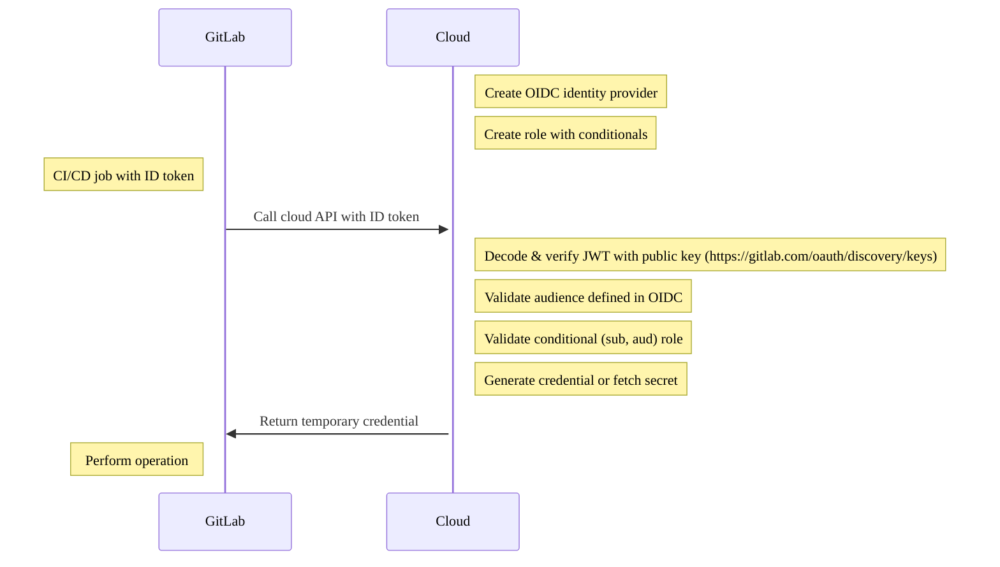



- 계층: Free, Premium, Ultimate
- 제공 서비스: GitLab.com, GitLab Self-Managed, GitLab Dedicated





- [ID 토큰](../secrets/id_token_authentication.md)은 HashiCorp Vault를 포함하여 모든 OIDC 제공자를 지원하며, GitLab 15.7에서 [도입](https://gitlab.com/gitlab-org/gitlab/-/issues/356986)되었습니다.



> [!warning]
> `CI_JOB_JWT` 및 `CI_JOB_JWT_V2`은 GitLab 15.9에서 [더 이상 지원되지 않으며](../../update/deprecations.md#old-versions-of-json-web-tokens-are-deprecated) GitLab 17.0에서 제거될 예정입니다. 대신 [ID 토큰](../secrets/id_token_authentication.md)을 사용하세요.

GitLab CI/CD는 [OpenID Connect(OIDC)](https://openid.net/developers/how-connect-works/)를 지원하여 빌드 및 배포 작업에 클라우드 자격증명 및 서비스에 대한 액세스 권한을 제공합니다. 역사적으로 팀은 프로젝트에 시크릿을 저장하거나 빌드 및 배포를 위해 GitLab Runner 인스턴스에 권한을 적용했습니다. OIDC 지원 [ID 토큰](../secrets/id_token_authentication.md)은 CI/CD 작업에서 구성 가능하므로 확장 가능하고 최소 권한 보안 방식을 따를 수 있습니다.

GitLab 15.6 이전 버전에서는 ID 토큰 대신 `CI_JOB_JWT_V2`을 사용해야 하지만 사용자 지정할 수 없습니다.

## 전제 조건 {#prerequisites}

- GitLab 계정.
- OIDC를 지원하는 클라우드 제공자에 대한 액세스로 권한 부여를 구성하고 역할을 만들 수 있습니다.

ID 토큰은 OIDC를 지원하는 클라우드 제공자를 지원하며, 다음을 포함합니다:

- AWS
- Azure
- GCP
- HashiCorp Vault

> [!note]
> OIDC를 구성하면 모든 파이프라인에 대해 대상 환경에 대한 JWT 토큰 액세스가 활성화됩니다. 파이프라인에 대해 OIDC를 구성할 때는 공급망 보안 검토를 완료해야 하며, 추가 액세스에 중점을 두어야 합니다. 공급망 공격에 대한 자세한 내용은 [DevOps 플랫폼이 공급망 공격으로부터 보호하는 방법](https://about.gitlab.com/blog/devops-platform-supply-chain-attacks/)을 참조하세요.

## 사용 사례 {#use-cases}

- GitLab 그룹 또는 프로젝트에 시크릿을 저장할 필요가 없습니다. 임시 자격증명을 OIDC를 통해 클라우드 제공자에서 검색할 수 있습니다.
- 그룹, 프로젝트, 브랜치 또는 태그를 포함한 세밀한 GitLab 조건부를 사용하여 클라우드 리소스에 대한 임시 액세스 권한을 제공합니다.
- 환경에 대한 조건부 액세스를 사용하여 CI/CD 작업에서 담당 역할 분리를 정의할 수 있습니다. 역사적으로 앱은 스테이징 또는 프로덕션 환경에만 액세스할 수 있는 지정된 GitLab Runner로 배포되었을 수 있습니다. 이로 인해 각 머신이 전용 권한을 가지고 있었으므로 러너 확산이 발생했습니다.
- 인스턴스 러너가 여러 클라우드 계정에 안전하게 액세스할 수 있습니다. 액세스는 파이프라인을 실행하는 사용자에게 특정한 JWT 토큰에 의해 결정됩니다.
- 기본적으로 임시 자격증명을 검색하여 시크릿을 회전하는 로직을 만들 필요가 없습니다.

## 클라우드 서비스에 대한 ID 토큰 인증 {#id-token-authentication-for-cloud-services}

각 작업은 CI/CD 변수를 포함하는 ID 토큰으로 구성할 수 있으며, 여기에는 [토큰 페이로드](../secrets/id_token_authentication.md#token-payload)가 포함됩니다. 이 JWT는 AWS, Azure, GCP 또는 Vault와 같은 OIDC 지원 클라우드 제공자로 인증하는 데 사용할 수 있습니다.

### 권한 부여 워크플로우 {#authorization-workflow}



1. 클라우드에서 OIDC ID 제공자를 만듭니다(예: AWS, Azure, GCP, Vault).
1. 클라우드 서비스에서 그룹, 프로젝트, 브랜치 또는 태그로 필터링하는 조건부 역할을 만듭니다.
1. CI/CD 작업에는 JWT 토큰인 ID 토큰이 포함됩니다. 이 토큰을 사용하여 클라우드 API로 권한을 부여할 수 있습니다.
1. 클라우드는 토큰을 확인하고 페이로드에서 조건부 역할을 검증한 후 임시 자격증명을 반환합니다.

## OIDC 클레임을 사용하여 조건부 역할 구성 {#configure-a-conditional-role-with-oidc-claims}

조건부 역할을 구성할 때 `namespace_id` 또는 `project_id`과 같은 안정적이고 고유한 식별자를 `sub`과 같은 경로 기반 클레임과 함께 포함합니다. 여기서 클라우드 제공자가 지원하는 경우입니다. 이러한 식별자는 경로와 무관하므로 이를 참조하는 신뢰 정책은 그룹 또는 프로젝트 이름 변경과 같은 경로 변경의 영향을 받지 않습니다.

이러한 조건 키에 대한 지원은 클라우드 제공자 및 GitLab 제공 서비스에 따라 다릅니다. 예를 들어 AWS는 `gitlab.com` OIDC ID 제공자에 대해서만 `namespace_id` 및 `project_id`을 지원합니다. 제공자 예시는 [AWS에서 OpenID Connect 구성](aws/_index.md#configure-a-role-and-trust)을 참조하세요.

GitLab과 OIDC 간의 신뢰를 구성하려면 JWT에 대해 검사하는 클라우드 제공자에서 조건부 역할을 만들어야 합니다. 조건은 JWT에 대해 검증되어 청중과 주체라는 두 개의 클레임에 대해 특별히 신뢰를 만듭니다.

- 청중 또는 `aud`: ID 토큰의 일부로 구성:

  ```yaml
  job_needing_oidc_auth:
    id_tokens:
      OIDC_TOKEN:
        aud: https://oidc.provider.com
    script:
      - echo $OIDC_TOKEN
  ```

- 주체 또는 `sub`: 그룹, 프로젝트, 브랜치 및 태그를 포함하는 GitLab CI/CD 워크플로우를 설명하는 메타데이터의 연결입니다. `sub` 필드는 다음 형식입니다:
  - `project_path:{group}/{project}:ref_type:{type}:ref:{branch_name}`

| 필터 유형                                        | 예제 |
|----------------------------------------------------|---------|
| 모든 브랜치로 필터링                               | 와일드카드 지원됨. `project_path:mygroup/myproject:ref_type:branch:ref:*` |
| 특정 프로젝트, 메인 브랜치로 필터링            | `project_path:mygroup/myproject:ref_type:branch:ref:main` |
| 그룹의 모든 프로젝트로 필터링               | 와일드카드 지원됨. `project_path:mygroup/*:ref_type:branch:ref:main` |
| Git 태그로 필터링                                | 와일드카드 지원됨. `project_path:mygroup/*:ref_type:tag:ref:1.0` |

## 클라우드 제공자를 사용하여 OIDC 권한 부여 {#oidc-authorization-with-your-cloud-provider}

클라우드 제공자와 연결하려면 다음 튜토리얼을 참조하세요:

- [AWS에서 OpenID Connect 구성](aws/_index.md)
- [Azure에서 OpenID Connect 구성](azure/_index.md)
- [Google Cloud에서 OpenID Connect 구성](google_cloud/_index.md)
