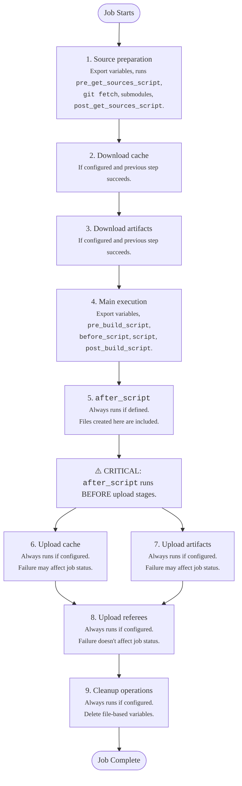



- 계층: Free, Premium, Ultimate
- 제공 서비스: GitLab.com, GitLab Self-Managed, GitLab Dedicated



작업 실행 흐름은 GitLab 러너가 CI/CD 작업을 시작부터 완료까지 처리하는 방식을 설명합니다.

GitLab 러너는 작업을 수신한 후 자격 증명 모음에서 암호를 검색하고(구성된 경우) 실행기를 준비한 후 CI/CD 작업을 실행합니다. 모든 CI/CD 작업은 일련의 순차적 단계로 실행되며, 각 단계는 별도의 셸 컨텍스트에서 실행됩니다. 러너는 다음을 수행합니다:

1. 작업의 소스 코드를 준비합니다:

   - 변수를 셸 컨텍스트로 내보냅니다
   - 구성에 정의된 경우 `pre_get_sources_script`을(를) 실행합니다
   - `git fetch`과(와) 기타 소스 처리 명령을 실행합니다. `none` 전략이 구성되지 않은 경우 제외합니다
   - 서브모듈이 있는 경우 서브모듈을 업데이트하는 명령을 실행합니다
   - 구성에 정의된 경우 `post_get_sources_script`을(를) 실행합니다

1. [cache](../yaml/_index.md#cache)가 구성되고 이전 단계가 성공한 경우 캐시된 파일을 다운로드합니다:

   - 변수를 셸 컨텍스트로 내보냅니다
   - 이전 작업 실행에서 캐시된 파일을 다운로드하는 명령을 실행합니다

1. 아티팩트 다운로드가 구성되고 이전 단계가 성공한 경우 이전 작업에서 [아티팩트](../yaml/_index.md#artifacts)를 다운로드합니다:

   - 변수를 셸 컨텍스트로 내보냅니다
   - 이전 작업에서 아티팩트 파일을 다운로드하는 명령을 실행합니다

1. 이전 단계가 성공한 경우 주 작업 스크립트를 실행합니다:

   - 변수를 셸 컨텍스트로 내보냅니다
   - 구성에 정의된 경우 `pre_build_script`을(를) 실행합니다
   - 정의된 경우 `before_script` 명령을 실행합니다
   - 주 `script` 명령을 실행합니다
   - 구성에 정의된 경우 `post_build_script`을(를) 실행합니다

1. 이전 단계의 실패 여부에 관계없이 정의된 경우 `after_script` 명령을 실행합니다:

   - 변수를 새 셸 컨텍스트로 내보냅니다
   - `after_script` 명령을 실행합니다
   - 이 명령의 실패는 전체 작업 상태에 영향을 주지 않습니다

1. 캐시 업로드가 구성되면 이전 단계의 실패 여부에 관계없이 캐시에 파일을 업로드합니다:

   - 변수를 셸 컨텍스트로 내보냅니다
   - 지정된 파일을 캐시 스토리지에 업로드하는 명령을 실행합니다
   - 이 단계의 실패는 전체 작업 상태에 영향을 줄 수 있습니다

1. 아티팩트 업로드가 구성되면 이전 단계의 실패 여부에 관계없이 아티팩트를 업로드합니다:

   - 변수를 셸 컨텍스트로 내보냅니다
   - 지정된 파일을 작업 아티팩트로 업로드하는 명령을 실행합니다
   - 이 단계의 실패는 전체 작업 상태에 영향을 줄 수 있습니다

1. 심판 업로드가 구성되면 이전 단계의 실패 여부에 관계없이 심판 데이터를 업로드합니다:

   - 변수를 셸 컨텍스트로 내보냅니다
   - 심판 정보를 업로드하는 명령을 실행합니다
   - 이 명령의 실패는 전체 작업 상태에 영향을 주지 않습니다

1. 구성된 경우 이전 단계의 실패 여부에 관계없이 정리 작업을 수행합니다:

   - 변수를 셸 컨텍스트로 내보냅니다
   - 작업 디렉토리에서 파일 기반 변수를 삭제하는 명령을 실행합니다
   - 이 명령의 실패는 전체 작업에 영향을 주지 않습니다

## 셸 컨텍스트 격리 {#shell-context-isolation}

각 셸 컨텍스트는 설계상 격리됩니다. 컨텍스트 간의 유일한 연결은 공유 작업 디렉토리 파일 시스템입니다.

- 한 컨텍스트의 수동 변수 내보내기(예: `export my_variable=$(date)`)는 다른 컨텍스트에서 사용할 수 없습니다
- 각 스크립트는 `set -eo pipefail`(Unix 셸의 경우)로 실행되어 첫 번째 오류에서 조기에 실패합니다
- 각 단계의 결과는 후속 단계의 실행 여부와 전체 작업 상태에 영향을 줍니다
