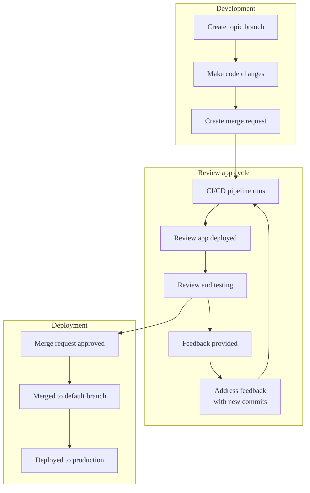



- 계층: Free, Premium, Ultimate
- 제공 서비스: GitLab.com, GitLab Self-Managed, GitLab Dedicated



검토 앱은 각 브랜치 또는 머지 리퀘스트에 대해 자동으로 생성되는 임시 테스트 환경입니다. 로컬 개발 환경을 설정할 필요 없이 변경 사항을 미리 보고 검증할 수 있습니다.

[동적 환경](../environments/_index.md#create-a-dynamic-environment)을 기반으로 하는 검토 앱은 각 브랜치 또는 머지 리퀘스트에 대해 고유한 환경을 제공합니다.


이러한 환경은 다음과 같은 방식으로 개발 워크플로우를 간소화합니다:

- 변경 사항을 테스트하기 위해 로컬 설정이 필요하지 않습니다.
- 모든 팀 구성원을 위해 일관된 환경을 제공합니다.
- 이해관계자가 URL을 사용하여 변경 사항을 미리 볼 수 있습니다.
- 변경 사항이 프로덕션에 도달하기 전에 더 빠른 피드백 주기를 가능하게 합니다.

> [!note]
> Kubernetes 클러스터가 있는 경우 [Auto DevOps](../../topics/autodevops/_index.md)를 사용하여 검토 앱을 자동으로 설정할 수 있습니다.

## 검토 앱 워크플로우 {#review-app-workflow}

검토 앱 워크플로우는 다음과 유사할 수 있습니다:



## 검토 앱 구성 {#configure-review-apps}

각 브랜치 또는 머지 리퀘스트에 대해 애플리케이션의 미리 보기 환경을 제공하려고 할 때 검토 앱을 구성합니다.

전제 조건:

- 프로젝트의 개발자, 유지보수자 또는 소유자 역할이 있어야 합니다.
- 프로젝트에 CI/CD 파이프라인이 사용 가능해야 합니다.
- 검토 앱을 호스팅하고 배포하기 위한 인프라를 설정해야 합니다.

프로젝트에서 검토 앱을 구성하려면:

1. 상단 표시줄에서 **검색 또는 이동**을 선택하고 프로젝트를 찾습니다.
1. 왼쪽 사이드바에서 **빌드** > **파이프라인 편집기**를 선택합니다.
1. `.gitlab-ci.yml` 파일에서 [동적 환경](../environments/_index.md#create-a-dynamic-environment)을 생성하는 작업을 추가합니다. [미리 정의된 CI/CD 변수](../variables/predefined_variables.md)를 사용하여 각 환경을 구분할 수 있습니다. 예를 들어 `CI_COMMIT_REF_SLUG` 미리 정의된 변수를 사용합니다:

   ```yaml
   review_app:
     stage: deploy
     script:
       - echo "Deploy to review app environment"
       # Add your deployment commands here
     environment:
       name: review/$CI_COMMIT_REF_SLUG
       url: https://$CI_COMMIT_REF_SLUG.example.com
     rules:
       - if: $CI_COMMIT_BRANCH && $CI_COMMIT_BRANCH != $CI_DEFAULT_BRANCH
   ```

1. 선택 사항. `when: manual`를 작업에 추가하여 검토 앱만 수동으로 배포합니다.
1. 선택 사항. 더 이상 필요하지 않을 때 [검토 앱을 중지](#stop-review-apps)하는 작업을 추가합니다.
1. 커밋 메시지를 입력하고 **변경 사항 커밋**을 선택합니다.

### 검토 앱 템플릿 사용 {#use-the-review-apps-template}

GitLab은 기본적으로 머지 리퀘스트 파이프라인에 대해 구성된 기본 제공 템플릿을 제공합니다.

이 템플릿을 사용하고 사용자 지정하려면:

1. 상단 표시줄에서 **검색 또는 이동**을 선택하고 프로젝트를 찾습니다.
1. 왼쪽 사이드바에서 **운영** > **환경**을 선택합니다.
1. **리뷰 앱 활성화**를 선택합니다.
1. 나타나는 **리뷰 앱 활성화** 대화 상자에서 YAML 템플릿을 복사합니다:

   ```yaml
   deploy_review:
     stage: deploy
     script:
       - echo "Add script here that deploys the code to your infrastructure"
     environment:
       name: review/$CI_COMMIT_REF_NAME
       url: https://$CI_ENVIRONMENT_SLUG.example.com
     rules:
       - if: $CI_PIPELINE_SOURCE == "merge_request_event"
   ```

1. **빌드** > **파이프라인 편집기**를 선택합니다.
1. 템플릿을 `.gitlab-ci.yml` 파일에 붙여넣습니다.
1. 배포 필요에 따라 템플릿을 사용자 지정합니다:

   - 배포 스크립트 및 환경 URL을 수정하여 인프라에서 작동하도록 합니다.
   - [규칙 섹션](../jobs/job_rules.md)을 조정하여 머지 리퀘스트 없이도 브랜치에 대해 검토 앱을 배포하려는 경우입니다.

   예를 들어 Heroku에 배포하는 경우:

   ```yaml
   deploy_review:
     stage: deploy
     image: ruby:latest
     script:
       - apt-get update -qy
       - apt-get install -y ruby-dev
       - gem install dpl
       - dpl --provider=heroku --app=$HEROKU_APP_NAME --api-key=$HEROKU_API_KEY
     environment:
       name: review/$CI_COMMIT_REF_NAME
       url: https://$HEROKU_APP_NAME.herokuapp.com
       on_stop: stop_review_app
     rules:
       - if: $CI_PIPELINE_SOURCE == "merge_request_event"
   ```

   이 구성은 머지 리퀘스트에 대해 파이프라인이 실행될 때마다 Heroku에 자동 배포를 설정합니다. Ruby의 `dpl` 배포 도구를 사용하여 프로세스를 처리하고 지정된 URL을 통해 액세스할 수 있는 동적 검토 환경을 생성합니다.

1. 커밋 메시지를 입력하고 **변경 사항 커밋**을 선택합니다.

### 검토 앱 중지 {#stop-review-apps}

리소스를 절약하기 위해 검토 앱을 수동으로 또는 자동으로 중지하도록 구성할 수 있습니다.

검토 앱에 대한 환경 중지에 대한 자세한 내용은 [환경 중지](../environments/_index.md#stopping-an-environment)를 참조하세요.

#### 병합 시 검토 앱 자동 중지 {#auto-stop-review-apps-on-merge}

연결된 머지 리퀘스트가 병합되거나 브랜치가 삭제될 때 검토 앱이 자동으로 중지되도록 구성하려면:

1. 배포 작업에 [`on_stop`](../yaml/_index.md#environmenton_stop) 키워드를 추가합니다.
1. [`environment:action: stop`](../yaml/_index.md#environmentaction)를 사용하여 중지 작업을 생성합니다.
1. 선택 사항. [`when: manual`](../yaml/_index.md#when)를 중지 작업에 추가하여 언제든지 검토 앱을 수동으로 중지할 수 있도록 합니다.

예를 들어:

```yaml
# In your .gitlab-ci.yml file
deploy_review:
  # Other configuration...
  environment:
    name: review/${CI_COMMIT_REF_NAME}
    url: https://${CI_ENVIRONMENT_SLUG}.example.com
    on_stop: stop_review_app  # References the stop_review_app job

stop_review_app:
  stage: deploy
  script:
    - echo "Stop review app"
    # Add your cleanup commands here
  environment:
    name: review/${CI_COMMIT_REF_NAME}
    action: stop
  when: manual  # Makes this job manually triggerable
  rules:
    - if: $CI_PIPELINE_SOURCE == "merge_request_event"
```

#### 시간 기반 자동 중지 {#time-based-automatic-stop}

일정 기간 후에 검토 앱이 자동으로 중지되도록 구성하려면 배포 작업에 [`auto_stop_in`](../yaml/_index.md#environmentauto_stop_in) 키워드를 추가합니다:

```yaml
# In your .gitlab-ci.yml file
review_app:
  script: deploy-review-app
  environment:
    name: review/$CI_COMMIT_REF_SLUG
    auto_stop_in: 1 week  # Stops after one week of inactivity
  rules:
    - if: $CI_MERGE_REQUEST_ID
```

## 검토 앱 보기 {#view-review-apps}

검토 앱을 배포하고 액세스하려면:

1. 머지 리퀘스트로 이동합니다.
1. 선택 사항. 검토 앱 작업이 수동인 경우 **실행** () 을 선택하여 배포를 시작합니다.
1. 파이프라인이 완료되면 **앱 보기**를 선택하여 브라우저에서 검토 앱을 엽니다.

## 예제 구현 {#example-implementations}

이러한 프로젝트는 다양한 검토 앱 구현을 보여줍니다:

| 프로젝트                                                                                 | 구성 파일 |
| --------------------------------------------------------------------------------------- | ------------------ |
| [NGINX](https://gitlab.com/gitlab-examples/review-apps-nginx)                           | [`.gitlab-ci.yml`](https://gitlab.com/gitlab-examples/review-apps-nginx/-/blob/b9c1f6a8a7a0dfd9c8784cbf233c0a7b6a28ff27/.gitlab-ci.yml#L20) |
| [OpenShift](https://gitlab.com/gitlab-examples/review-apps-openshift)                   | [`.gitlab-ci.yml`](https://gitlab.com/gitlab-examples/review-apps-openshift/-/blob/82ebd572334793deef2d5ddc379f38942f3488be/.gitlab-ci.yml#L42) |
| [HashiCorp Nomad](https://gitlab.com/gitlab-examples/review-apps-nomad)                 | [`.gitlab-ci.yml`](https://gitlab.com/gitlab-examples/review-apps-nomad/-/blob/ca372c778be7aaed5e82d3be24e98c3f10a465af/.gitlab-ci.yml#L110) |
| [GitLab 문서](https://gitlab.com/gitlab-org/technical-writing/docs-gitlab-com) | [`build.gitlab-ci.yml`](https://gitlab.com/gitlab-org/technical-writing/docs-gitlab-com/-/blob/bdbf11814428a06e82d7b712c72b5cb53c750f29/.gitlab/ci/build.gitlab-ci.yml#L73-76) |
| [`https://about.gitlab.com/`](https://gitlab.com/gitlab-com/www-gitlab-com/)            | [`.gitlab-ci.yml`](https://gitlab.com/gitlab-com/www-gitlab-com/-/blob/6ffcdc3cb9af2abed490cbe5b7417df3e83cd76c/.gitlab-ci.yml#L332) |
| [GitLab Insights](https://gitlab.com/gitlab-org/gitlab-insights/)                       | [`.gitlab-ci.yml`](https://gitlab.com/gitlab-org/gitlab-insights/-/blob/9e63f44ac2a5a4defc965d0d61d411a768e20546/.gitlab-ci.yml#L234) |

검토 앱의 다른 예제:

- <i class="fa-youtube-play" aria-hidden="true"></i> [GitLab을 사용한 클라우드 네이티브 개발](https://www.youtube.com/watch?v=jfIyQEwrocw).
- [Android용 검토 앱](https://about.gitlab.com/blog/how-to-create-review-apps-for-android-with-gitlab-fastlane-and-appetize-dot-io/).

## 경로 맵 {#route-maps}

경로 맵을 사용하면 소스 파일에서 검토 앱 환경의 해당 공개 페이지로 직접 이동할 수 있습니다. 이 기능을 사용하면 머지 리퀘스트에서 특정 변경 사항을 더 쉽게 미리 볼 수 있습니다.

구성된 경우 경로 맵은 매핑 패턴과 일치하는 파일의 검토 앱 버전을 볼 수 있는 상황별 링크를 추가합니다. 이러한 링크는 다음에 표시됩니다:

- 머지 리퀘스트 위젯입니다.
- 커밋 및 파일 보기입니다.

### 경로 맵 구성 {#configure-route-maps}

경로 맵을 설정하려면:

1. `.gitlab/route-map.yml`에서 리포지토리에 파일을 생성합니다.
1. 소스 경로(리포지토리) 및 공개 경로(검토 앱 인프라 또는 웹사이트)를 정의합니다.

경로 맵은 각 항목이 `source` 경로를 `public` 경로로 매핑하는 YAML 배열입니다.

경로 맵의 각 매핑은 다음 형식을 따릅니다:

```yaml
- source: 'path/to/source/file'  # Source file in repository
  public: 'path/to/public/page'  # Public page on the website
```

두 가지 유형의 매핑을 사용할 수 있습니다:

- 정확한 일치: 작은 따옴표로 둘러싼 문자열 리터럴
- 패턴 일치: 슬래시로 둘러싼 정규 표현식

정규 표현식을 사용한 패턴 일치의 경우:

- 정규 표현식은 전체 소스 경로(`^` 및 `$` 앵커가 암시됨)와 일치해야 합니다.
- `()` 캡처 그룹을 사용할 수 있으며 `public` 경로에서 참조할 수 있습니다.
- `\N` 표현식을 사용하여 캡처 그룹을 참조하며 발생 순서로 (`\1`, `\2`, 등)를 사용합니다.
- 슬래시(`/`)를 `\/`로 이스케이프하고 마침표(`.`)를 `\.`로 이스케이프합니다.

GitLab은 정의 순서로 매핑을 평가합니다. 일치하는 첫 번째 `source` 표현식이 `public` 경로를 결정합니다.

### 경로 맵 예제 {#example-route-map}

다음 예제는 [Middleman](https://middlemanapp.com)에 대한 경로 맵을 보여주며, [GitLab 웹사이트](https://about.gitlab.com)에 사용되는 정적 사이트 생성기입니다:

```yaml
# Team data
- source: 'data/team.yml'  # data/team.yml
  public: 'team/'  # team/

# Blogposts
- source: /source\/posts\/([0-9]{4})-([0-9]{2})-([0-9]{2})-(.+?)\..*/  # source/posts/2017-01-30-around-the-world-in-6-releases.html.md.erb
  public: '\1/\2/\3/\4/'  # 2017/01/30/around-the-world-in-6-releases/

# HTML files
- source: /source\/(.+?\.html).*/  # source/index.html.haml
  public: '\1'  # index.html

# Other files
- source: /source\/(.*)/  # source/images/blogimages/around-the-world-in-6-releases-cover.png
  public: '\1'  # images/blogimages/around-the-world-in-6-releases-cover.png
```

이 예에서:

- 매핑은 순서대로 평가됩니다.
- 세 번째 매핑은 `source/index.html.haml`이 catch-all `/source\/(.*)/` 대신 `/source\/(.+?\.html).*/`과 일치하도록 보장합니다. 이렇게 하면 `index.html.haml` 대신 `index.html`의 공개 경로가 생성됩니다.

### 매핑된 페이지 보기 {#view-mapped-pages}

경로 맵을 사용하여 소스 파일에서 검토 앱의 해당 페이지로 직접 이동합니다.

전제 조건:

- `.gitlab/route-map.yml`에서 경로 맵을 구성해야 합니다.
- 브랜치 또는 머지 리퀘스트에 대해 검토 앱이 배포되어야 합니다.

머지 리퀘스트 위젯에서 매핑된 페이지를 보려면:

1. 머지 리퀘스트 위젯에서 **앱 보기**를 선택합니다. 드롭다운 목록에는 최대 5개의 매핑된 페이지가 표시됩니다(더 많은 경우 필터링 사용).


파일에서 매핑된 페이지를 보려면:

1. 다음 방법 중 하나를 사용하여 경로 맵과 일치하는 파일로 이동합니다:
   - 머지 리퀘스트에서: **변경사항** 탭에서 **View file @ [commit]**을 선택합니다.
   - 커밋 페이지에서: 파일 이름을 선택합니다.
   - 비교에서: 버전을 비교할 때 파일 이름을 선택합니다.
1. 파일의 페이지에서 오른쪽 위 모서리에 있는 **View on [environment-name]** ()을 선택합니다.

커밋에서 매핑된 페이지를 보려면:

1. 검토 앱 배포가 있는 커밋으로 이동합니다:
   - 브랜치 파이프라인의 경우: 왼쪽 사이드바에서 **코드** > **커밋**을 선택하고 파이프라인 배지가 있는 커밋을 선택합니다.
   - 머지 리퀘스트 파이프라인의 경우: 머지 리퀘스트에서 **커밋** 탭을 선택하고 커밋을 선택합니다.
   - 병합된 결과 파이프라인의 경우: 머지 리퀘스트에서 **파이프라인** 탭을 선택하고 파이프라인 커밋을 선택합니다.
1. 경로 맵과 일치하는 파일명 옆의 검토 앱 아이콘()을 선택합니다. 아이콘이 검토 앱에서 해당 페이지를 엽니다.

> [!note]
> 병합된 결과 파이프라인은 브랜치를 대상 브랜치와 병합하는 내부 커밋을 생성합니다. 이러한 파이프라인에 대한 검토 앱 링크에 액세스하려면 **파이프라인** 탭이 아닌 **커밋** 탭의 커밋을 사용합니다.
