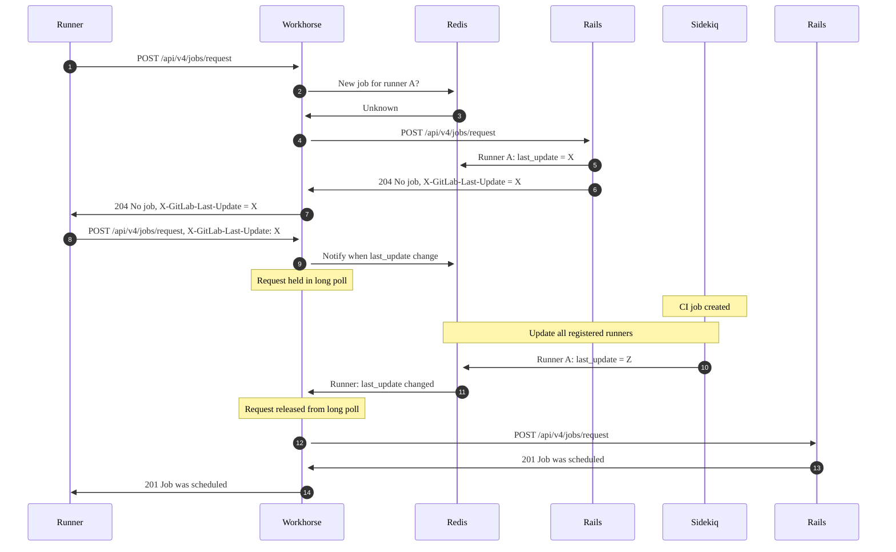



- 계층: Free, Premium, Ultimate
- 제공 서비스: GitLab.com, GitLab Self-Managed, GitLab Dedicated



기본적으로 GitLab Runner는 새 CI/CD 작업을 주기적으로 GitLab 인스턴스에 폴링합니다. 실제 폴링 간격은 [`check_interval` 및 러너 구성 파일에 구성된 러너 수에 따라 다릅니다](https://docs.gitlab.com/runner/configuration/advanced-configuration/#how-check_interval-works).

많은 러너를 처리하는 서버에서 이러한 폴링은 다음과 같은 성능 문제를 야기할 수 있습니다:

- 더 긴 대기열 시간.
- GitLab 인스턴스의 높은 CPU 사용량.

이러한 문제를 완화하려면 장기 폴링을 활성화해야 합니다.

전제 조건:

- 관리자(administrator) 권한이 있어야 합니다.

## 장기 폴링 활성화 {#enable-long-polling}

새 작업이 준비될 때까지 GitLab 인스턴스를 구성하여 러너의 작업 요청을 장기 폴링으로 보류할 수 있습니다.

이를 수행하려면 GitLab Workhorse 장기 폴링 기간(`apiCiLongPollingDuration`)을 구성하여 장기 폴링을 활성화합니다:





1. `/etc/gitlab/gitlab.rb`를 편집합니다.

   ```ruby
   gitlab_workhorse['api_ci_long_polling_duration'] = "50s"
   ```

1. 파일을 저장하고 GitLab을 다시 구성합니다.

   ```shell
   sudo gitlab-ctl reconfigure
   ```





`gitlab.webservice.workhorse.extraArgs` 설정으로 장기 폴링을 활성화합니다.

1. Helm 값을 내보냅니다:

   ```shell
   helm get values gitlab > gitlab_values.yaml
   ```

1. `gitlab_values.yaml`를 편집합니다.

   ```yaml
   gitlab:
     webservice:
       workhorse:
         extraArgs: "-apiCiLongPollingDuration 50s"
   ```

1. 파일을 저장하고 새 값을 적용합니다:

   ```shell
   helm upgrade -f gitlab_values.yaml gitlab gitlab/gitlab
   ```





1. `docker-compose.yml`를 편집합니다.

   ```yaml
   version: "3.6"
   services:
     gitlab:
       image: 'gitlab/gitlab-ee:latest'
       restart: always
       hostname: 'gitlab.example.com'
       environment:
         GITLAB_OMNIBUS_CONFIG: |
           gitlab_workhorse['api_ci_long_polling_duration'] = "50s"
   ```

1. 파일을 저장하고 GitLab을 다시 시작합니다.

   ```shell
   docker compose up -d
   ```





## 메트릭 {#metrics}

장기 폴링이 활성화되면 GitLab Workhorse는 Redis PubSub 채널을 구독하고 알림을 기다립니다. 작업 요청은 러너 키가 변경되거나 `apiCiLongPollingDuration`에 도달했을 때 장기 폴링에서 해제됩니다. 모니터링할 수 있는 여러 Prometheus 메트릭이 있습니다:

| 메트릭 | 형식 | 설명 | 레이블 |
| -----  | ---- | ----------- | ------ |
| `gitlab_workhorse_keywatcher_keywatchers` | 게이지 | GitLab Workhorse가 감시 중인 키의 수 | |
| `gitlab_workhorse_keywatcher_redis_subscriptions` | 게이지 | Redis PubSub 구독 수 | |
| `gitlab_workhorse_keywatcher_total_messages` | 카운터 | GitLab Workhorse가 PubSub 채널에서 받은 총 메시지 수 | |
| `gitlab_workhorse_keywatcher_actions_total` | 카운터 | 다양한 키 감시자 작업의 개수 | `action` |
| `gitlab_workhorse_keywatcher_received_bytes_total` | 카운터 | PubSub 채널에서 받은 총 바이트 | |

사용자가 이러한 메트릭으로 장기 폴링 문제를 발견한 [예시](https://gitlab.com/gitlab-org/omnibus-gitlab/-/issues/8329)를 확인할 수 있습니다.

## 장기 폴링 워크플로우 {#long-polling-workflow}

다이어그램은 장기 폴링이 활성화된 단일 러너가 작업을 어떻게 가져오는지 보여줍니다:



1단계에서 러너가 새 작업을 요청할 때 `POST` 요청(`/api/v4/jobs/request`)을 GitLab 서버에 발급하며, 여기서 먼저 Workhorse에서 처리됩니다.

Workhorse는 `X-GitLab-Last-Update` HTTP 헤더에서 러너 토큰과 값을 읽고, 키를 구성하고, 해당 키로 Redis PubSub 채널을 구독합니다. 키에 대한 값이 없으면 Workhorse는 즉시 요청을 Rails로 전달합니다(3단계 및 4단계).

Rails는 작업 큐를 확인합니다. 러너에 사용 가능한 작업이 없으면 Rails는 `204 No job`을 `last_update` 토큰과 함께 러너에 반환합니다(5단계~7단계).

러너는 해당 `last_update` 토큰을 사용하여 작업에 대한 또 다른 요청을 발급하고, `X-GitLab-Last-Update` HTTP 헤더를 이 토큰으로 채웁니다. 이 경우 Workhorse는 러너의 `last_update` 토큰이 변경되었는지 확인합니다. 변경되지 않았으면 Workhorse는 `apiCiLongPollingDuration`에 지정된 기간까지 요청을 보유합니다.

사용자가 새 파이프라인 또는 작업을 실행하도록 트리거하면 Sidekiq의 백그라운드 작업이 작업에 사용 가능한 모든 러너에 대해 `last_update` 값을 업데이트합니다. 러너는 프로젝트, 그룹 및/또는 인스턴스에 등록할 수 있습니다.

10단계 및 11단계의 이 "틱"은 Workhorse 장기 폴링 큐에서 작업 요청을 해제하고 요청이 Rails로 전송됩니다(12단계). Rails는 사용 가능한 작업을 찾아 러너를 해당 작업에 할당합니다(13단계 및 14단계).

장기 폴링을 사용하면 러너는 새 작업이 사용 가능한 후 즉시 알림을 받습니다. 이는 작업 대기열 시간을 개선하고 줄이는 데 도움이 될 뿐만 아니라, 작업 요청이 새로운 작업이 있을 때만 Rails에 도달하기 때문에 서버 오버헤드를 줄입니다.

## 문제 해결 {#troubleshooting}

장기 폴링을 사용할 때 다음과 같은 문제가 발생할 수 있습니다.

### 느린 작업 픽업 {#slow-job-pickup}

일부 러너 구성에서 러너가 적시에 작업을 픽업하지 않기 때문에 장기 폴링은 기본적으로 활성화되지 않습니다. [이슈 27709](https://gitlab.com/gitlab-org/gitlab-runner/-/issues/27709)를 참조하세요.

이는 러너 `config.toml`의 `concurrent` 설정이 정의된 러너 수보다 낮은 값으로 설정된 경우 발생할 수 있습니다. 이 문제를 해결하려면 `concurrent`의 값이 러너 수와 같거나 크도록 해야 합니다.

예를 들어 `config.toml`에 `[[runners]]` 항목이 3개 있으면 `concurrent`이 최소 3으로 설정되어 있는지 확인하세요.

장기 폴링이 활성화되면 러너는:

1. `concurrent` 개의 Goroutine을 시작합니다.
1. 장기 폴링 후 Goroutine이 반환될 때까지 기다립니다.
1. 다른 배치 요청을 실행합니다.

예를 들어 단일 `config.toml`이 구성된 경우를 생각해봅시다:

- 프로젝트 A용 3개의 러너.
- 프로젝트 B용 1개의 러너.
- `concurrent`을 3으로 설정합니다.

이 예에서 러너는 처음 3개 프로젝트에 대해 Goroutine을 시작합니다. 최악의 경우 러너는 프로젝트 B의 작업을 요청하기 전에 프로젝트 A의 전체 장기 폴링 간격을 대기합니다.
