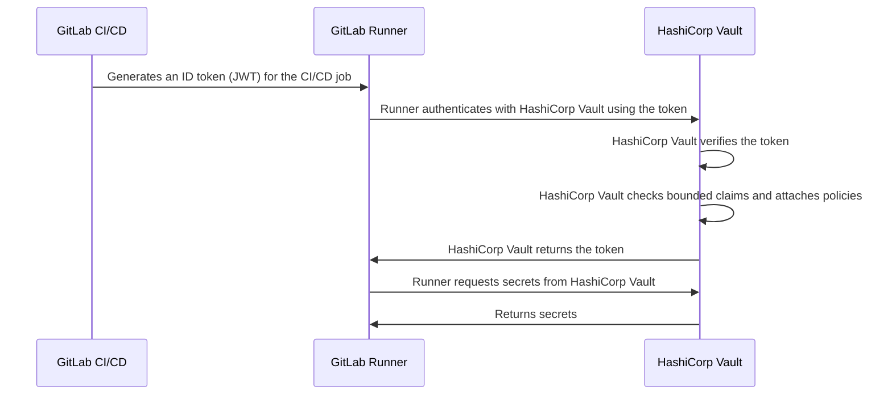



- 티어: Free, Premium, Ultimate
- 제공 서비스: GitLab.com, GitLab Self-Managed, GitLab Dedicated





- [GitLab 15.7에서 도입됨](https://gitlab.com/gitlab-org/gitlab/-/issues/356986)



ID 토큰은 GitLab CI/CD에 의해 생성된 [JSON 웹 토큰(JWT)](https://www.rfc-editor.org/rfc/rfc7519)입니다. CI/CD 작업은 다음을 포함한 서드파티 서비스로 OIDC 인증을 위해 ID 토큰을 사용할 수 있습니다:

- [보안 정보 제공자](_index.md)
- [클라우드 서비스](../cloud_services/_index.md)

예를 들어, HashiCorp Vault로 인증하기 위해 ID 토큰을 사용하는 플로우는 다음 다이어그램으로 요약됩니다:



ID 토큰은 [`secrets`](../yaml/_index.md#secrets) 키워드로도 사용됩니다.

## CI/CD 작업에서 ID 토큰 구성 {#configure-id-tokens-in-a-cicd-job}

ID 토큰을 사용하려면 [`id_tokens`](../yaml/_index.md#id_tokens) 키워드를 사용하여 CI/CD 작업을 구성합니다. 그러면 `script`, `before_script`, 또는 `after_script` 섹션에서 토큰을 사용할 수 있습니다.

예를 들어:

```yaml
job_with_id_tokens:
  id_tokens:
    FIRST_ID_TOKEN:
      aud: https://first.service.com
    SECOND_ID_TOKEN:
      aud: https://second.service.com
  script:
    - first-service-authentication-script.sh $FIRST_ID_TOKEN
    - second-service-authentication-script.sh $SECOND_ID_TOKEN
```

이 예제에서 두 토큰은 다른 `aud` 클레임을 가집니다. 서드파티 서비스는 바운드 오디언스와 일치하는 `aud` 클레임이 없는 토큰을 거부하도록 구성할 수 있습니다. 이 기능을 사용하여 토큰이 인증할 수 있는 서비스의 수를 줄입니다. 이는 토큰이 손상될 때의 심각도를 줄입니다.

## 토큰 페이로드 {#token-payload}

다음 표준 클레임이 각 ID 토큰에 포함됩니다:

| 필드                                                              | 설명 |
|--------------------------------------------------------------------|-------------|
| [`iss`](https://www.rfc-editor.org/rfc/rfc7519.html#section-4.1.1) | 토큰의 발급자로, GitLab 인스턴스의 도메인입니다("issuer" 클레임). |
| [`sub`](https://www.rfc-editor.org/rfc/rfc7519.html#section-4.1.2) | 토큰의 주체("subject" 클레임)입니다. 기본값은 `project_path:{group}/{project}:ref_type:{type}:ref:{branch_name}`입니다. [프로젝트 API](../../api/projects.md#update-a-project)를 사용하여 프로젝트에 대해 구성할 수 있습니다. `sub` 클레임은 `ref_protected` 등의 추가 필드 및 작업이 환경을 지정할 때 `environment_protected` 및 `deployment_tier` 등의 환경 관련 필드를 포함할 수 있습니다. GitLab 18.7에서 도입되었습니다. |
| [`aud`](https://www.rfc-editor.org/rfc/rfc7519.html#section-4.1.3) | 토큰의 의도된 오디언스("audience" 클레임)입니다. [ID 토큰](#configure-id-tokens-in-a-cicd-job) 구성에서 지정됩니다. 기본적으로 GitLab 인스턴스의 도메인입니다. |
| [`exp`](https://www.rfc-editor.org/rfc/rfc7519.html#section-4.1.4) | 만료 시간("expiration time" 클레임)입니다. |
| [`nbf`](https://www.rfc-editor.org/rfc/rfc7519.html#section-4.1.5) | 토큰이 유효해지는 시간("not before" 클레임)입니다. |
| [`iat`](https://www.rfc-editor.org/rfc/rfc7519.html#section-4.1.6) | JWT가 발급된 시간("issued at" 클레임)입니다. |
| [`jti`](https://www.rfc-editor.org/rfc/rfc7519.html#section-4.1.7) | 토큰의 고유 식별자("JWT ID" 클레임)입니다. |

토큰에는 GitLab이 제공하는 사용자 정의 클레임도 포함됩니다:

| 필드                   | 시간                                       | 설명 |
|-------------------------|--------------------------------------------|-------------|
| `project_id`            | 항상                                     | 작업을 실행하는 프로젝트의 ID입니다. 머지 리퀘스트 파이프라인에서 이는 소스 프로젝트의 ID입니다. |
| `project_path`          | 항상                                     | 작업을 실행하는 프로젝트의 경로입니다. 머지 리퀘스트 파이프라인에서 이는 소스 프로젝트의 경로입니다. |
| `namespace_id`          | 항상                                     | 작업을 실행하는 프로젝트의 네임스페이스 ID입니다. 머지 리퀘스트 파이프라인에서 이는 소스 프로젝트의 네임스페이스 ID입니다. |
| `namespace_path`        | 항상                                     | 작업을 실행하는 프로젝트의 네임스페이스 경로입니다. 머지 리퀘스트 파이프라인에서 이는 소스 프로젝트의 네임스페이스 경로입니다. |
| `user_id`               | 항상                                     | 작업을 실행하는 사용자의 ID입니다. |
| `user_login`            | 항상                                     | 작업을 실행하는 사용자의 사용자 이름입니다. |
| `user_email`            | 항상                                     | 작업을 실행하는 사용자의 이메일입니다. |
| `user_access_level`     | 항상                                     | 작업을 실행하는 사용자의 액세스 수준입니다. GitLab 16.9에서 [도입](https://gitlab.com/gitlab-org/gitlab/-/issues/432052)되었습니다. |
| `job_project_id`        | 항상                                     | 작업을 실행하는 프로젝트의 ID입니다. 이를 사용하여 ID별로 프로젝트 범위를 지정합니다. GitLab 18.4에 [도입됨](https://gitlab.com/gitlab-org/gitlab/-/issues/563038). |
| `job_project_path`      | 항상                                     | 작업을 실행하는 프로젝트의 경로입니다. 이를 사용하여 경로별로 프로젝트 범위를 지정합니다. GitLab 18.4에 [도입됨](https://gitlab.com/gitlab-org/gitlab/-/issues/563038). |
| `job_namespace_id`      | 항상                                     | 작업을 실행하는 프로젝트의 네임스페이스 ID입니다. 이를 사용하여 ID별로 그룹 또는 사용자 수준 네임스페이스 범위를 지정합니다. GitLab 18.4에 [도입됨](https://gitlab.com/gitlab-org/gitlab/-/issues/563038). |
| `job_namespace_path`    | 항상                                     | 작업을 실행하는 프로젝트의 네임스페이스 경로입니다. 이를 사용하여 경로별로 그룹 또는 사용자 수준 네임스페이스 범위를 지정합니다. GitLab 18.4에 [도입됨](https://gitlab.com/gitlab-org/gitlab/-/issues/563038). |
| `user_identities`       | 사용자 기본 설정                    | 사용자의 외부 ID 목록([GitLab 16.0에서 도입됨](https://gitlab.com/gitlab-org/gitlab/-/issues/387537)). |
| `pipeline_id`           | 항상                                     | 파이프라인의 ID입니다. |
| `pipeline_source`       | 항상                                     | [파이프라인 소스](../jobs/job_rules.md#common-if-clauses-with-predefined-variables) |
| `job_id`                | 항상                                     | 작업의 ID입니다. |
| `ref`                   | 항상                                     | 작업의 Git ref입니다. 머지 리퀘스트 파이프라인에서 이는 소스 브랜치 ref입니다. |
| `ref_type`              | 항상                                     | Git ref 유형으로, `branch` 또는 `tag`입니다. |
| `ref_path`              | 항상                                     | 작업의 완전히 정규화된 ref입니다. 예를 들어, `refs/heads/main`입니다. 머지 리퀘스트 파이프라인에서 이는 소스 브랜치 ref 경로입니다. [GitLab 16.0에서 도입됨](https://gitlab.com/gitlab-org/gitlab/-/merge_requests/119075) |
| `ref_protected`         | 항상                                     | Git ref가 보호되면 `true`, 그 외의 경우 `false`입니다. |
| `groups_direct`         | 사용자가 0~200개 그룹의 직접 구성원인 경우 | 사용자의 직접 멤버십 그룹의 경로입니다. 사용자가 200개 이상의 그룹의 직접 구성원인 경우 생략됩니다. (GitLab 16.11에서 [도입되었으며](https://gitlab.com/gitlab-org/gitlab/-/issues/435848) GitLab 17.3에서 `ci_jwt_groups_direct` [기능 플래그](../../administration/feature_flags/_index.md) 뒤에 배치됨). |
| `environment`           | 작업이 환경을 지정함               | 이 작업이 배포하는 환경입니다. |
| `environment_protected` | 작업이 환경을 지정함               | 배포된 환경이 보호되면 `true`, 그 외의 경우 `false`입니다. |
| `deployment_tier`       | 작업이 환경을 지정함               | 작업이 지정하는 환경의 [배포 티어](../environments/_index.md#deployment-tier-of-environments) [GitLab 15.2에서 도입됨](https://gitlab.com/gitlab-org/gitlab/-/issues/363590) |
| `environment_action`    | 작업이 환경을 지정함               | 작업에 지정된 [환경 작업(`environment:action`)](../environments/_index.md) ([GitLab 16.5에서 도입됨](https://gitlab.com/gitlab-org/gitlab/-/)) |
| `runner_id`             | 항상                                     | 작업을 실행하는 러너의 ID입니다. [GitLab 16.0에서 도입됨](https://gitlab.com/gitlab-org/gitlab/-/issues/404722) |
| `runner_environment`    | 항상                                     | 작업에서 사용하는 러너의 유형입니다. `gitlab-hosted` 또는 `self-hosted`입니다. [GitLab 16.0에서 도입됨](https://gitlab.com/gitlab-org/gitlab/-/issues/404722) |
| `sha`                   | 항상                                     | 작업의 커밋 SHA입니다. [GitLab 16.0에서 도입됨](https://gitlab.com/gitlab-org/gitlab/-/issues/404722) |
| `ci_config_ref_uri`     | 항상                                     | 최상위 파이프라인 정의에 대한 ref 경로(예: `gitlab.example.com/my-group/my-project//.gitlab-ci.yml@refs/heads/main`). [GitLab 16.2에서 도입됨](https://gitlab.com/gitlab-org/gitlab/-/issues/404722) 파이프라인 정의가 동일한 프로젝트에 있지 않으면 이 클레임은 `null`입니다. |
| `ci_config_sha`         | 항상                                     | `ci_config_ref_uri`에 대한 Git 커밋 SHA입니다. [GitLab 16.2에서 도입됨](https://gitlab.com/gitlab-org/gitlab/-/issues/404722) 파이프라인 정의가 동일한 프로젝트에 있지 않으면 이 클레임은 `null`입니다. |
| `project_visibility`    | 항상                                     | 파이프라인이 실행되고 있는 프로젝트의 [가시성](../../user/public_access.md) `internal`, `private` 또는 `public`입니다. GitLab 16.3에서 [도입](https://gitlab.com/gitlab-org/gitlab/-/issues/418810)되었습니다. |
| `job_source`            | 항상                                     | [작업 소스](../jobs/_index.md#available-job-sources) GitLab 18.9에서 [도입](https://gitlab.com/gitlab-org/gitlab/-/work_items/459001)되었습니다. |
| `job_config`              | 정책으로 트리거된 작업                  | 작업의 출처에 대한 메타데이터입니다. 정책 작업의 경우 정책 구성에 대한 `sha` 및 `url`을(를) 포함합니다. GitLab 18.9에서 [도입](https://gitlab.com/gitlab-org/gitlab/-/work_items/459001)되었습니다. |

```json
{
  "namespace_id": "72",
  "namespace_path": "my-group",
  "project_id": "20",
  "project_path": "my-group/my-project",
  "user_id": "1",
  "user_login": "sample-user",
  "user_email": "sample-user@example.com",
  "user_identities": [
      {"provider": "github", "extern_uid": "2435223452345"},
      {"provider": "bitbucket", "extern_uid": "john.smith"}
  ],
  "pipeline_id": "574",
  "pipeline_source": "push",
  "job_id": "302",
  "ref": "feature-branch-1",
  "ref_type": "branch",
  "ref_path": "refs/heads/feature-branch-1",
  "ref_protected": "false",
  "groups_direct": ["mygroup/mysubgroup", "myothergroup/myothersubgroup"],
  "environment": "test-environment2",
  "environment_protected": "false",
  "deployment_tier": "testing",
  "environment_action": "start",
  "job_source": "push",
  "job_config": {
    "url": "https://gitlab.example.com/my-group/my-policy-project/-/blob/ab035e64eca9a7a85bd62e485d3593f52a2804ac/.gitlab/security-policies/policy.yml",
    "sha": "ab035e64eca9a7a85bd62e485d3593f52a2804ac"
  },
  "runner_id": 1,
  "runner_environment": "self-hosted",
  "sha": "714a629c0b401fdce83e847fc9589983fc6f46bc",
  "project_visibility": "public",
  "ci_config_ref_uri": "gitlab.example.com/my-group/my-project//.gitlab-ci.yml@refs/heads/main",
  "ci_config_sha": "714a629c0b401fdce83e847fc9589983fc6f46bc",
  "jti": "235b3a54-b797-45c7-ae9a-f72d7bc6ef5b",
  "iss": "https://gitlab.example.com",
  "iat": 1681395193,
  "nbf": 1681395188,
  "exp": 1681398793,
  "sub": "project_path:my-group/my-project:ref_type:branch:ref:feature-branch-1",
  "aud": "https://vault.example.com"
}
```

ID 토큰은 RS256을 사용하여 인코딩되고 전용 개인 키로 서명됩니다. 토큰의 만료 시간은 지정된 경우 작업의 시간 초과로 설정되거나, 지정되지 않은 경우 5분으로 설정됩니다.

### 클라우드 신뢰 정책에서 ID 토큰 클레임 사용 {#use-id-token-claims-in-cloud-trust-policies}

GitLab과 OIDC ID 제공자로 연동되는 클라우드 제공자는 신뢰 정책에서 조건 키로 위의 클레임을 검증할 수 있습니다.

신뢰 정책을 작성할 때 클라우드 제공자와 GitLab 제공 서비스에서 지원하는 경우 `namespace_id` 및 `project_id`와 같은 안정적이고 고유한 식별자를 `sub` 등의 경로 기반 클레임과 함께 포함합니다. `project_id`은(는) 전역적으로 고유하며 프로젝트의 수명 동안 동일하게 유지됩니다. `namespace_id`는 프로젝트가 현재 네임스페이스에 남아 있는 동안 안정적입니다. 두 식별자는 경로와 독립적이므로, 이들을 포함하는 신뢰 정책은 그룹 또는 프로젝트 이름 변경과 같은 경로 변경의 영향을 받지 않습니다.

GitLab.com의 AWS의 경우 다음 GitLab 클레임을 `gitlab.com` OIDC ID 제공자의 조건 키로 사용할 수 있습니다:

- `namespace_id`
- `project_id`
- `user_id`
- `user_login`
- `user_email`
- `user_access_level`
- `ref_protected`
- `pipeline_source`

이 조건 키는 `gitlab.com` OIDC ID 제공자에만 사용 가능합니다. 현재 GitLab Self-Managed 또는 GitLab Dedicated에서는 사용할 수 없으며, 여기서는 `sub` 클레임만 AWS 조건 키로 지원됩니다.

`user_login` 또는 `user_email`만을(를) 조건으로 사용하지 마세요. 사용자가 이를 변경할 수 있기 때문입니다. GitLab ID 제공자에 대한 AWS의 게시된 조건 키에 대해 지원되는 클레임의 정확한 세트를 확인합니다.

`sub`, `namespace_id` 및 `project_id`을(를) 사용하는 완전한 AWS 신뢰 정책 예제는 [AWS에서 OpenID Connect 구성](../cloud_services/aws/_index.md#configure-a-role-and-trust)을(를) 참조하세요. HashiCorp Vault의 경우 [바운드 클레임](hashicorp_vault_tutorial.md)을(를) 참조하세요.

## 문제 해결 {#troubleshooting}

### `400: missing token` 상태 코드 {#400-missing-token-status-code}

이 오류는 ID 토큰에 필요한 하나 이상의 기본 구성 요소가 누락되었거나 예상대로 구성되지 않았음을 나타냅니다.

문제를 찾으려면 관리자는 인스턴스의 `exceptions_json.log`에서 실패한 특정 메서드에 대한 자세한 내용을 찾을 수 있습니다.

### `GitLab::Ci::Jwt::NoSigningKeyError` {#gitlabcijwtnosigningkeyerror}

`exceptions_json.log` 파일의 이 오류는 서명 키가 데이터베이스에서 누락되었고 토큰을 생성할 수 없었기 때문일 가능성이 높습니다. 이것이 이슈인지 확인하려면 인스턴스의 PostgreSQL 터미널에서 다음 쿼리를 실행합니다:

```sql
SELECT encrypted_ci_jwt_signing_key FROM application_settings;
```

반환된 값이 비어 있으면 다음 Rails 스니펫을 사용하여 새 키를 생성하고 내부적으로 교체합니다:

```ruby
  key = OpenSSL::PKey::RSA.new(2048).to_pem

  ApplicationSetting.find_each do |application_setting|
    application_setting.update(ci_jwt_signing_key: key)
  end
```

### `401: unauthorized` 상태 코드 {#401-unauthorized-status-code}

이 오류는 인증 요청이 실패했음을 나타냅니다. GitLab 파이프라인에서 외부 서비스로 OpenID Connect(OIDC) 인증을 사용할 때 `401 Unauthorized` 오류는 여러 일반적인 이유로 발생할 수 있습니다:

- `$CI_JOB_JWT_V2` 등의 더 이상 사용되지 않는 토큰을 사용했지만 [ID 토큰](#configure-id-tokens-in-a-cicd-job)을(를) 대신 사용해야 합니다. 자세한 내용은 [JSON 웹 토큰의 이전 버전이 더 이상 사용되지 않음](../../update/deprecations.md#old-versions-of-json-web-tokens-are-deprecated)을(를) 참조하세요.
- `provider_name` 값을 `.gitlab-ci.yml` 파일과 외부 서비스의 OIDC ID 제공자 구성 사이에 불일치하게 했습니다.
- GitLab에서 발급한 ID 토큰과 외부 서비스에서 예상하는 것 사이의 `aud`(오디언스) 클레임을 놓치거나 불일치하게 했습니다.
- GitLab CI/CD 작업에서 `id_tokens:` 블록을 활성화하거나 구성하지 않았습니다.

오류를 해결하려면 작업 내에서 토큰을 디코딩합니다:

```shell
echo $OIDC_TOKEN | cut -d '.' -f2 | base64 -d | jq .
```

다음을 확인합니다:

- `aud`(오디언스)이(가) 예상 오디언스(예: 외부 서비스의 URL)와 일치합니다.
- `sub`(주체)이(가) 서비스의 ID 제공자 설정에 매핑됩니다.
- `preferred_username`은(는) 기본적으로 GitLab ID 토큰에 없습니다.
