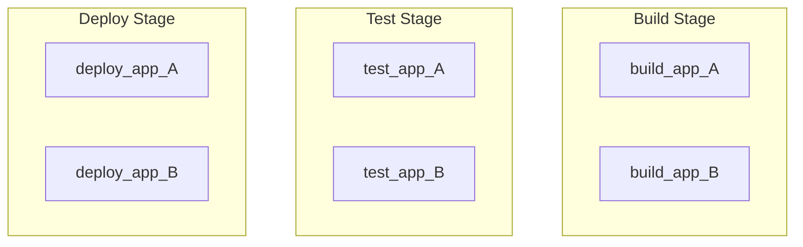
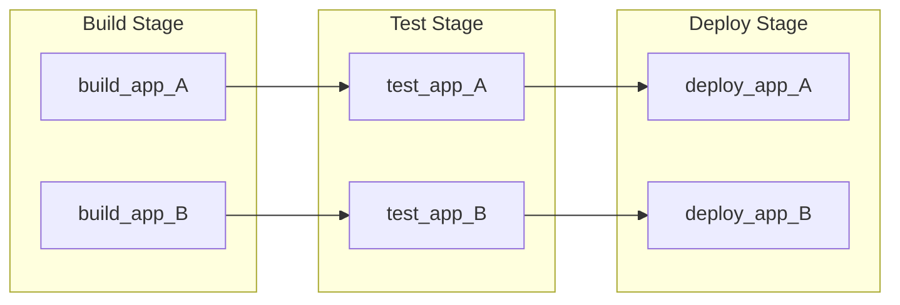
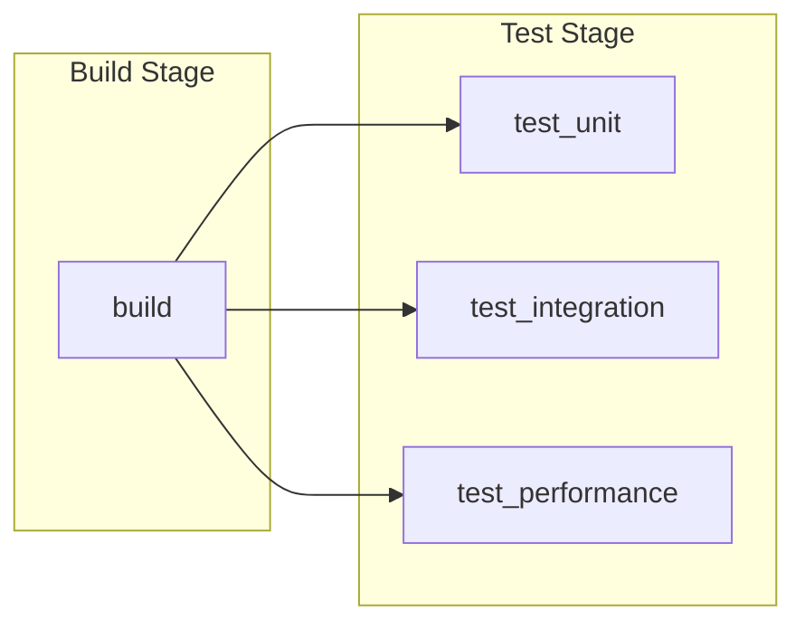
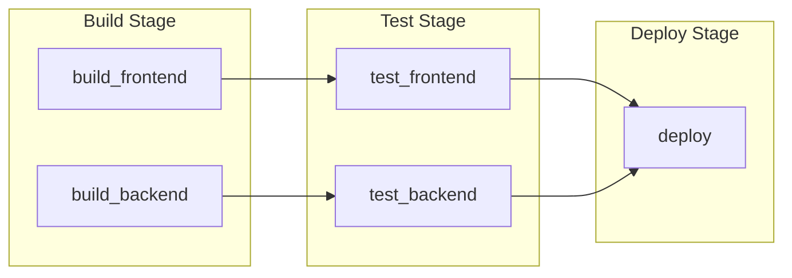
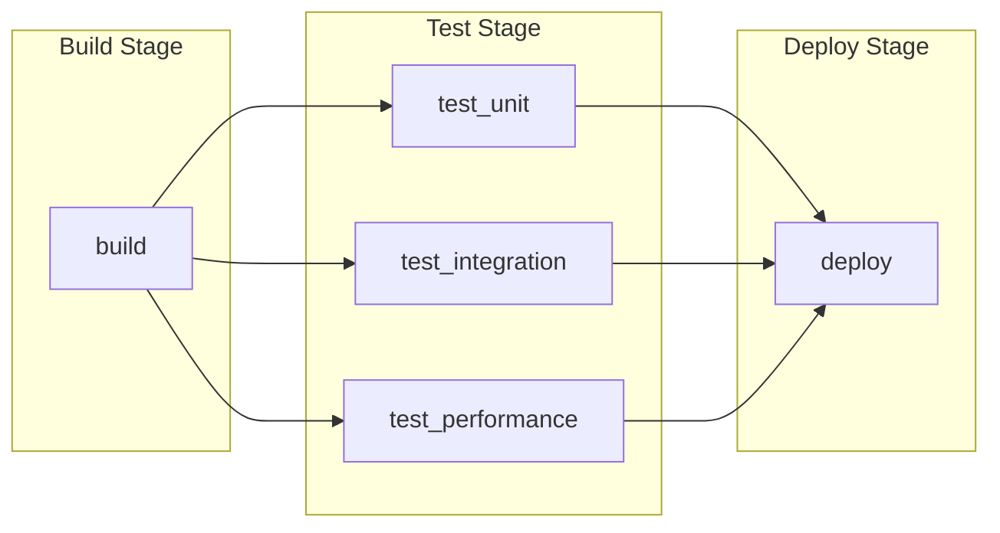
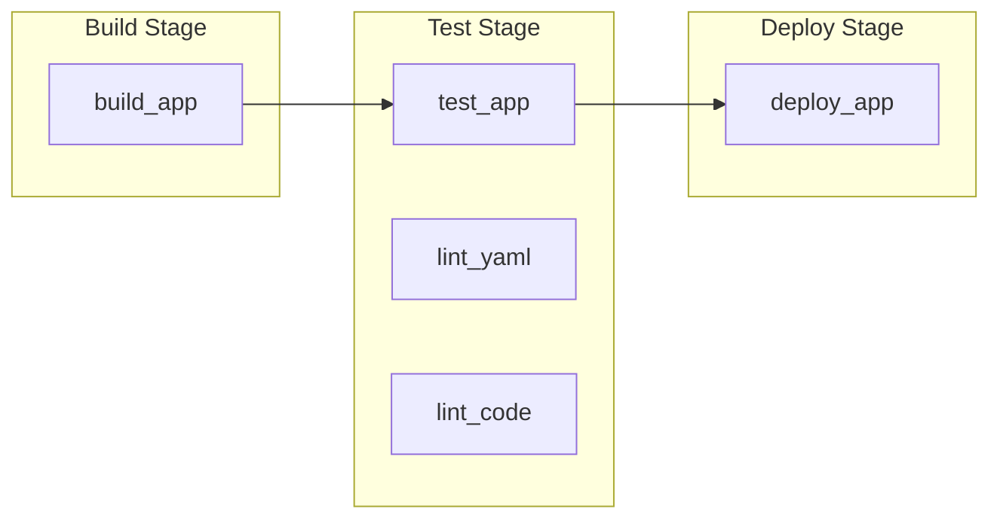
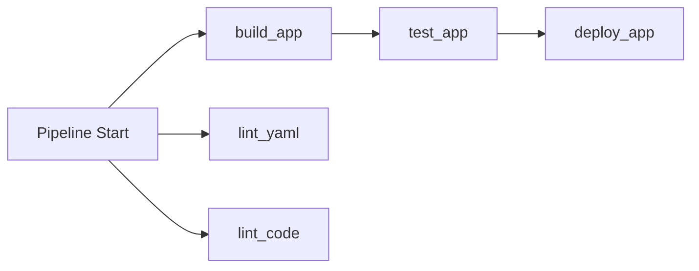



- 계층: Free, Premium, Ultimate
- 제공 서비스: GitLab.com, GitLab Self-Managed, GitLab Dedicated



[`needs`](_index.md#needs) 키워드를 사용하여 파이프라인의 작업 의존성을 지정합니다. 작업은 파이프라인 스테이지가 완료될 때까지 기다리지 않고 작업 의존성이 완료되는 즉시 시작됩니다. 이를 통해 작업을 더 빨리 실행하고 불필요한 대기를 피할 수 있습니다.

사용 사례:

- 모노레포: 독립적인 서비스를 병렬 실행 경로에서 빌드하고 테스트합니다.
- 다중 플랫폼 빌드: 모든 빌드가 완료될 때까지 기다리지 않고 여러 플랫폼용으로 컴파일합니다.
- 더 빠른 피드백: 테스트 결과와 오류를 더 빨리 확인합니다.

> [!note]
> `needs: project` 및 `needs: pipeline` 키워드는 작업 의존성을 지정하는 데 사용되지 않습니다. [`needs: project`](_index.md#needsproject)를 사용하여 다른 파이프라인에서 아티팩트를 가져옵니다. [`needs: pipeline`](_index.md#needspipeline)를 사용하여 업스트림 파이프라인의 파이프라인 상태를 미러링합니다.

## `needs` 작동 방식 {#how-needs-works}

기본적으로 작업은 스테이지에서 실행됩니다. 스테이지의 모든 작업이 성공적으로 완료되어야 이후 스테이지의 작업이 시작될 수 있습니다. 예를 들어, 기본 `build`, `test` 및 `deploy` 스테이지에서 `build`의 모든 작업이 실행되고 완료되어야 `test`의 작업이 시작될 수 있습니다.

`needs`를 사용하면 작업이 의존하는 특정 작업을 나열합니다. 작업은 그 의존성이 완료된 후 즉시 시작되며, 이전 스테이지의 다른 작업이 여전히 실행 중이어도 됩니다. 이는 [directed acyclic graph (DAG)](https://en.wikipedia.org/wiki/Directed_acyclic_graph) 구조 같은 형태의 파이프라인을 만듭니다.

스테이지별 작업과 `needs` 의존성이 있는 작업을 같은 파이프라인에 혼합할 수 있습니다.

추가로 `needs: []`를 사용하여 이전 작업 또는 스테이지가 완료될 때까지 기다리지 않고 즉시 실행되도록 작업을 설정할 수 있습니다. 소스 코드에서 실행할 수 있고 빌드 결과에 의존하지 않는 린팅 작업 또는 스캐너를 즉시 실행하는 것이 일반적입니다.

## `needs` 비교 (단계별 작업) {#needs-compared-to-staged-jobs}

`needs`의 이점을 보여주기 위해 6개의 작업이 있는 2개의 파이프라인을 비교할 수 있습니다.

이 파이프라인은 6개의 작업이 스테이지로 구성되어 있습니다. `needs` 없이, 스테이지의 모든 작업이 다음 스테이지가 시작되기 전에 완료되어야 하며, 일부 작업이 독립적이어도 마찬가지입니다:



```yaml
stages:
  - build
  - test
  - deploy

build_app_A:
  stage: build
  script: echo "Building A..."

build_app_B:
  stage: build
  script: echo "Building B..."

test_app_A:
  stage: test
  script: echo "Testing A..."

test_app_B:
  stage: test
  script: echo "Testing B..."

deploy_app_A:
  stage: deploy
  script: echo "Deploying A..."

deploy_app_B:
  stage: deploy
  script: echo "Deploying B..."
```

이 예에서는 `build` 스테이지의 모든 작업이 완료될 때까지 테스트 또는 배포 작업이 실행되지 않습니다. B 작업이 오래 실행되면 A 테스트 및 배포 작업이 B 작업이 완료될 때까지 기다리면서 지연될 수 있습니다.

`needs`을 사용하면 독립적인 2개의 실행 경로를 정의할 수 있습니다. 각 작업은 실제로 필요한 작업에만 의존하며, 두 경로에 걸쳐 병렬 실행을 허용합니다:



```yaml
stages:
  - build
  - test
  - deploy

build_app_A:
  stage: build
  script: echo "Building A..."

build_app_B:
  stage: build
  script: echo "Building B..."

test_app_A:
  stage: test
  needs: ["build_app_A"]
  script: echo "Testing A..."

test_app_B:
  stage: test
  needs: ["build_app_B"]
  script: echo "Testing B..."

deploy_app_A:
  stage: deploy
  needs: ["test_app_A"]
  script: echo "Deploying A..."

deploy_app_B:
  stage: deploy
  needs: ["test_app_B"]
  script: echo "Deploying B..."
```

이 예에서 `test_app_A`는 `build_app_A`가 성공적으로 완료되는 즉시 실행되며, `build_app_B`이 여전히 실행 중이어도 됩니다. 마찬가지로 `deploy_app_A`는 `build_app_B`이 완료되기 전에 실행되고 배포될 수 있습니다.

### 작업 간 의존성 보기 {#view-dependencies-between-jobs}

파이프라인 그래프에서 작업 간 의존성을 볼 수 있습니다.

이 보기를 활성화하려면 파이프라인 세부 정보 페이지에서:

- **작업 의존성**을 선택합니다.
- 선택 사항. **의존성 표시**를 전환하여 어느 작업이 함께 연결되어 있는지 보여주는 선을 표시합니다.


## `needs` 예제 {#needs-examples}

`needs`를 사용하여 작업 간 의존성을 만들고 작업이 시작될 때까지 기다리는 시간을 줄입니다. 패턴에는 fan-out, fan-in 및 다이아몬드 의존성이 포함될 수 있습니다.

### Fan-out {#fan-out}

fan-out 작업 의존성 그래프를 만들려면 여러 작업이 하나의 작업에 의존하도록 구성합니다.

예를 들어:



```yaml
stages:
  - build
  - test

build:
  stage: build
  script: echo "Building..."

test_unit:
  stage: test
  needs: ["build"]
  script: echo "Unit tests..."

test_integration:
  stage: test
  needs: ["build"]
  script: echo "Integration tests..."

test_performance:
  stage: test
  needs: ["build"]
  script: echo "Performance tests..."
```

### Fan-in {#fan-in}

fan-in 의존성 그래프를 만들려면 하나의 작업이 여러 작업이 완료될 때까지 기다리도록 구성합니다.

예를 들어:



```yaml
stages:
  - build
  - test
  - deploy

build_frontend:
  stage: build
  script: echo "Building frontend..."

build_backend:
  stage: build
  script: echo "Building backend..."

test_frontend:
  stage: test
  needs: ["build_frontend"]
  script: echo "Testing frontend..."

test_backend:
  stage: test
  needs: ["build_backend"]
  script: echo "Testing backend..."

deploy:
  stage: deploy
  needs: ["test_frontend", "test_backend"]
  script: echo "Deploying..."
```

### 다이아몬드 의존성 {#diamond-dependency}

다이아몬드 의존성 그래프를 만들려면 fan-out 및 fan-in을 결합합니다. 하나의 작업이 여러 작업으로 확산되고, 그 다음 이들이 다시 단일 작업으로 모입니다. 예를 들어:



```yaml
stages:
  - build
  - test
  - deploy

build:
  stage: build
  script: echo "Building..."

test_unit:
  stage: test
  needs: ["build"]
  script: echo "Unit tests..."

test_integration:
  stage: test
  needs: ["build"]
  script: echo "Integration tests..."

test_performance:
  stage: test
  needs: ["build"]
  script: echo "Performance tests..."

deploy:
  stage: deploy
  needs: ["test_unit", "test_integration", "test_performance"]
  script: echo "Deploying..."
```

### 즉시 시작 {#immediate-start}

`needs: []`를 사용하여 파이프라인이 생성될 때 다른 작업 또는 스테이지를 기다리지 않고 즉시 시작되도록 작업을 설정합니다. 즉시 실행할 수 있지만 `test`와 같은 이후 스테이지에 나타나야 하는 린팅 또는 스캐닝 도구에 이를 사용합니다.

예를 들어:

```yaml
stages:
  - build
  - test
  - deploy

build_app:
  stage: build
  script: echo "Building app..."

test_app:
  stage: test
  script: echo "Testing app..."

lint_yaml:
  stage: test
  needs: []
  script: echo "Linting YAML..."

lint_code:
  stage: test
  needs: []
  script: echo "Linting code..."

deploy_app:
  stage: deploy
  script: echo "Deploying app..."
```

이 예에서 `lint_yaml` 및 `lint_code`는 `needs: []`로 즉시 시작되며, `build_app` 또는 `test` 스테이지가 완료될 때까지 기다리지 않습니다. `deploy_app`은 `needs`를 사용하지 않으므로 모든 이전 스테이지의 작업이 완료될 때까지 기다립니다.

파이프라인 보기는 작업을 스테이지로 그룹화하여 보여줍니다:



작업이 최대한 빨리 실행 시작됩니다:



## 스테이지 없는 파이프라인 {#stageless-pipelines}

`stage` 및 `stages` 키워드를 생략하고 작업 순서를 정의하기 위해 `needs`만 사용할 수 있습니다. `stage` 키워드가 없는 모든 작업은 기본 `test` 스테이지에서 실행됩니다:

```yaml
compile:
  script: echo "Compiling..."

unit_tests:
  needs: ["compile"]
  script: echo "Running unit tests..."

integration_tests:
  needs: ["compile"]
  script: echo "Running integration tests..."

package:
  needs: ["unit_tests", "integration_tests"]
  script: echo "Packaging..."
```

이 파이프라인의 구조를 보려면 파이프라인 세부 정보 페이지에서 [**작업 의존성**](#view-dependencies-between-jobs)을 선택합니다. 기본 보기를 사용하면 모든 작업이 `test` 스테이지에 함께 그룹화됩니다.

## 선택적 의존성 {#optional-dependencies}

`optional: true`을 `needs`에서 사용하여 파이프라인에 작업이 존재하는 경우에만 작업에 의존합니다. 이 옵션을 사용하여 `needs`과 [`rules`](_index.md#rules)를 결합할 때 실행할 수도 있고 실행하지 않을 수도 있는 작업을 처리합니다.

예를 들어:

```yaml
stages:
  - build
  - test
  - deploy

build:
  stage: build
  script: echo "Building..."

test:
  stage: test
  needs: ["build"]
  script: echo "Testing..."

test_optional:
  stage: test
  rules:
    - if: $RUN_OPTIONAL_TESTS == "true"
  script: echo "Optional tests..."

deploy:
  stage: deploy
  needs:
    - job: "test"
    - job: "test_optional"
      optional: true
  script: echo "Deploying..."
```

이 예에서:

- `deploy`은 다음에 의존합니다:
  - `test`, 파이프라인에 항상 존재합니다.
  - `test_optional`, 파이프라인에 `RUN_OPTIONAL_TESTS`이 `true`일 때만 존재합니다.
- `RUN_OPTIONAL_TESTS`이:
  - `false`일 때, `test_optional`는 파이프라인에 존재하지 않으며 `deploy`는 `test`이 완료된 후 실행됩니다.
  - `true`일 때, `test_optional`는 파이프라인에 존재하며 `deploy`는 `test` 및 `test_optional`이 모두 완료될 때까지 기다립니다.

`optional: true` 없으면 `deploy` 작업이 `test_optional`을 기대하기 때문에 파이프라인 생성이 실패하지만, 파이프라인에 존재하지 않습니다.

## `needs`와 `parallel:matrix` 결합 {#combine-needs-with-parallelmatrix}

`needs` 키워드는 `parallel:matrix`와 함께 작동하여 [병렬화된 작업을 가리키는 의존성을 정의](../jobs/job_control.md#specify-needs-between-parallelized-jobs)합니다.

## 문제 해결 {#troubleshooting}

### 오류: `'job' does not exist in the pipeline` {#error-job-does-not-exist-in-the-pipeline}

`needs`을 `rules`와 결합하면 파이프라인이 생성되지 않고 다음 오류가 표시될 수 있습니다:

```plaintext
'unit_tests' job needs 'compile' job, but 'compile' does not exist in the pipeline.
This might be because of the only, except, or rules keywords. To need a job that
sometimes does not exist in the pipeline, use needs:optional.
```

이 오류는 `needs`이 파이프라인에 존재하지 않는 다른 작업으로 설정된 작업으로 인해 발생합니다. 이 문제를 해결하려면 다음 중 하나를 수행해야 합니다:

- [`optional: true`](#optional-dependencies)를 작업 의존성에 추가하여 필요한 작업이 파이프라인에 존재하지 않을 때 무시됩니다.
- 필요한 작업이 필요할 때 항상 실행되도록 하려면 필요한 작업의 `rules` 구성을 업데이트합니다.

예를 들어:

```yaml
#
# Method 1: Job with rules that may not exist
#
compile:
  stage: build
  rules:
    - if: $COMPILE == "true"
  script: echo "Compiling..."

unit_tests:
  stage: test
  needs:
    - job: "compile"        # If $COMPILE == "false", the `compile` job is not added
      optional: true        # to the pipeline and this needs is ignored.
  script: echo "Running unit tests..."

#
# Method 2: Job with rules that always matches the dependent job
#
build:
  stage: build
  rules:
    - if: $BUILD == "true"
  script: echo "Building..."

test:
  stage: test
  rules:                    # Both jobs have identical `rules`, and will always exist
    - if: $BUILD == "true"  # in the pipeline together.
  needs: ["build"]
  script: echo "Testing..."
```
