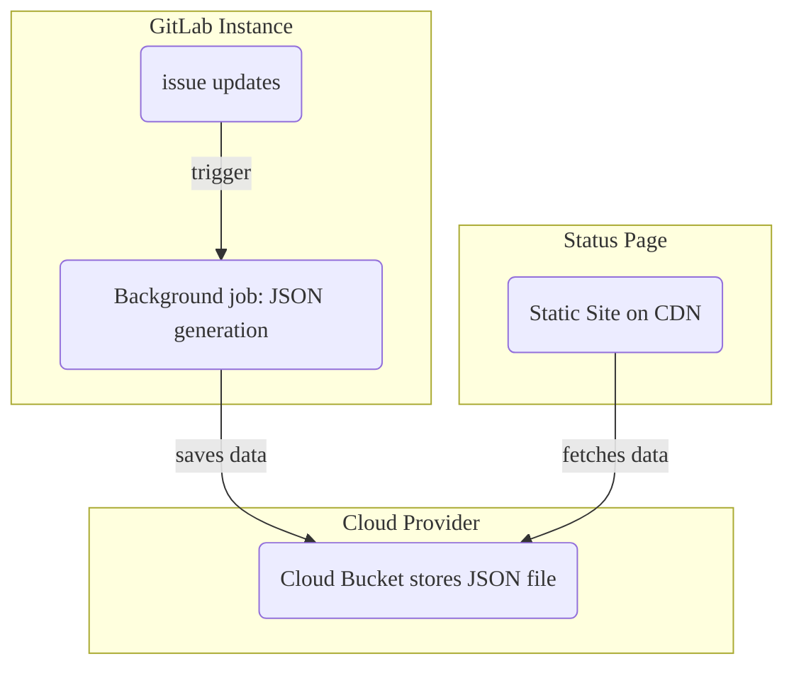



- 티어: Ultimate
- 제공 서비스: GitLab.com, GitLab Self-Managed, GitLab Dedicated



GitLab 상태 페이지를 사용하면 사건 발생 시 사용자와 효율적으로 소통하기 위한 정적 웹사이트를 만들고 배포할 수 있습니다. 상태 페이지 랜딩 페이지에는 최근 사건의 개요가 표시됩니다:

사건을 선택하면 특정 사건에 대한 자세한 정보가 포함된 세부 정보 페이지가 표시됩니다:

- 사건의 상태(마지막 업데이트 시간 포함)입니다.
- 사건 제목(이모지 포함)입니다.
- 사건의 설명(이모지 포함)입니다.
- 사건 설명에 제공된 모든 파일 첨부 또는 유효한 이미지 확장자를 가진 댓글입니다.
- 사건에 대한 업데이트의 시간 순서로 정렬된 목록입니다.

## 상태 페이지 설정 {#set-up-a-status-page}

GitLab 상태 페이지를 구성하려면 다음을 수행해야 합니다:

1. [GitLab 구성](#configure-gitlab-with-cloud-provider-information)(클라우드 공급자 정보 포함)합니다.
1. [AWS 계정 구성](#configure-your-aws-account)합니다.
1. GitLab에서 [상태 페이지 프로젝트 만들기](#create-a-status-page-project)를 수행합니다.
1. [사건을 상태 페이지와 동기화](#sync-incidents-to-the-status-page)합니다.

### 클라우드 공급자 정보로 GitLab 구성 {#configure-gitlab-with-cloud-provider-information}

AWS S3만 배포 대상으로 지원됩니다.

전제 조건:

- Maintainer 또는 Owner 역할이 있어야 합니다.

상태 페이지에 콘텐츠를 푸시하는 데 필요한 AWS 계정 정보를 GitLab에 제공하려면:

1. 상단 표시줄에서 **검색 또는 이동**을 선택하고 프로젝트를 찾습니다.
1. 왼쪽 사이드바에서 **설정** > **모니터링**을 선택합니다.
1. **상태 페이지**를 확장합니다.
1. **활성** 확인란을 선택합니다.
1. **Status Page URL** 상자에 외부 상태 페이지의 URL을 입력합니다.
1. **S3 버킷 이름** 상자에 S3 버킷의 이름을 입력합니다. 자세한 내용은 [버킷 구성 설명서](https://docs.aws.amazon.com/AmazonS3/latest/dev/HostingWebsiteOnS3Setup.html)를 참조하세요.
1. **AWS 지역** 상자에 버킷의 지역을 입력합니다. 자세한 내용은 [AWS 설명서](https://github.com/aws/aws-sdk-ruby#configuration)를 참조하세요.
1. **AWS 액세스 키 ID** 및 **AWS 비밀 액세스 키**를 입력합니다.
1. **변경사항 저장**을 선택합니다.

### AWS 계정 구성 {#configure-your-aws-account}

1. AWS 계정 내에서 다음 파일을 예제로 사용하여 두 개의 새로운 IAM 정책을 만듭니다:
   - [버킷 만들기](https://gitlab.com/gitlab-org/status-page/-/blob/master/deploy/etc/s3_create_policy.json)
   - [버킷 콘텐츠 업데이트](https://gitlab.com/gitlab-org/status-page/-/blob/master/deploy/etc/s3_update_bucket_policy.json)(`S3_BUCKET_NAME`를 버킷 이름으로 바꾸는 것을 잊지 마세요).
1. 첫 번째 단계에서 만든 권한 정책으로 새로운 AWS 액세스 키를 만듭니다.

### 상태 페이지 프로젝트 만들기 {#create-a-status-page-project}

AWS 계정을 구성한 후 상태 페이지 프로젝트를 추가하고 상태 페이지를 AWS S3에 배포하는 데 필요한 CI/CD 변수를 구성해야 합니다:

1. [상태 페이지](https://gitlab.com/gitlab-org/status-page) 프로젝트를 포크합니다. [리포지토리 미러링](https://gitlab.com/gitlab-org/status-page#repository-mirroring)을 통해 이를 수행할 수 있으며, 이를 통해 최신 상태 페이지 기능을 얻을 수 있습니다.
1. 왼쪽 사이드바에서 **설정** > **CI/CD**를 선택합니다.
1. **변수**를 펼칩니다.
1. Amazon Console에서 다음 변수를 추가합니다:
   - `S3_BUCKET_NAME` - Amazon S3 버킷의 이름입니다. 제공된 이름의 버킷이 없으면 첫 번째 파이프라인 실행이 하나를 만들고 [정적 웹사이트 호스팅](https://docs.aws.amazon.com/AmazonS3/latest/dev/HostingWebsiteOnS3Setup.html)을 위해 구성합니다.

   - `AWS_DEFAULT_REGION` - AWS 지역입니다.
   - `AWS_ACCESS_KEY_ID` - AWS 액세스 키 ID입니다.
   - `AWS_SECRET_ACCESS_KEY` - AWS 비밀입니다.
1. 왼쪽 사이드바에서 **빌드** > **파이프라인**을 선택합니다.
1. 상태 페이지를 S3에 배포하려면 **새 파이프라인**을 선택합니다.

> [!warning]
> 사건을 볼 수 있는 모든 사용자가 잠재적으로 [GitLab 상태 페이지에 댓글을 게시](#publish-comments-on-incidents)할 수 있으므로 이 프로젝트의 이슈 액세스를 제한하는 것을 고려합니다.

### 사건을 상태 페이지와 동기화 {#sync-incidents-to-the-status-page}

CI/CD 변수를 만든 후 사건에 사용할 프로젝트를 구성합니다:

1. 상단 표시줄에서 **검색 또는 이동**을 선택하고 프로젝트를 찾습니다.
1. 왼쪽 사이드바에서 **설정** > **모니터링**을 선택합니다.
1. **상태 페이지**를 확장합니다.
1. 클라우드 공급자의 자격 증명을 입력하고 **활성** 확인란을 선택했는지 확인합니다.
1. **변경사항 저장**을 선택합니다.

## GitLab 상태 페이지를 사용하는 방법 {#how-to-use-your-gitlab-status-page}

GitLab 인스턴스를 구성한 후 관련 업데이트는 사건에 대한 JSON 형식의 데이터를 외부 클라우드 공급자에게 푸시하는 백그라운드 작업을 트리거합니다. 상태 페이지 웹사이트는 정기적으로 이 JSON 형식의 데이터를 가져옵니다. 이를 형식화하고 사용자에게 표시하여 팀의 추가 노력 없이 진행 중인 사건에 대한 정보를 제공합니다:

### 사건 게시 {#publish-an-incident}

사건을 게시하려면:

1. GitLab 상태 페이지 설정을 활성화한 프로젝트에 사건을 만듭니다.
1. [프로젝트 또는 그룹 소유자](../../user/permissions.md)는 [`/publish` 빠른 작업](../../user/project/quick_actions.md#publish)을 사용하여 사건을 GitLab 상태 페이지에 게시해야 합니다. [기밀 사건](../../user/project/issues/confidential_issues.md)은 게시할 수 없습니다.

백그라운드 워커는 설정 중에 제공한 자격 증명을 사용하여 상태 페이지에 사건을 게시합니다. 게시 과정에서 GitLab은:

- 사용자 및 그룹 언급을 `Incident Responder`으로 익명 처리합니다.
- 공개되지 않은 [GitLab 참조](../../user/markdown.md#gitlab-specific-references)의 제목을 제거합니다.
- 사건당 최대 5000개까지 사건 설명에 첨부된 모든 파일을 게시합니다.

게시 후 사건 제목 아래에 표시된 **상태 페이지에 게시됨** 버튼을 선택하여 사건의 세부 정보 페이지에 액세스할 수 있습니다.

### 사건 업데이트 {#update-an-incident}

사건에 대한 업데이트를 게시하려면 사건의 설명을 업데이트합니다.

> [!warning]
> 참조된 사건이 변경되면(예: 제목 또는 기밀성) 해당 사건이 참조된 사건은 업데이트되지 않습니다.

### 사건에서 댓글 게시 {#publish-comments-on-incidents}

상태 페이지 사건에 댓글을 게시하려면:

- 사건에 댓글을 만듭니다.
- 댓글을 게시할 준비가 되면 마이크 [이모지 반응](../../user/emoji_reactions.md)(`:microphone:` 🎤)을 댓글에 추가하여 게시를 위해 댓글을 표시합니다.
- 댓글에 첨부된 모든 파일(사건당 최대 5000개)도 게시됩니다.

> [!warning]
> 사건을 볼 수 있는 모든 사용자는 댓글에 이모지 반응을 추가할 수 있으므로 이슈 액세스를 팀 구성원만으로 제한하는 것을 고려합니다.

### 사건 상태 업데이트 {#update-the-incident-status}

사건 상태를 `open`에서 `closed`로 변경하려면 GitLab 내에서 사건을 닫습니다. 사건을 닫으면 백그라운드 워커가 GitLab 상태 페이지 웹사이트를 업데이트하도록 트리거합니다.

[게시된 사건을 기밀로 만들면](../../user/project/issues/confidential_issues.md#make-an-issue-confidential) GitLab이 GitLab 상태 페이지 웹사이트에서 게시를 취소합니다.
