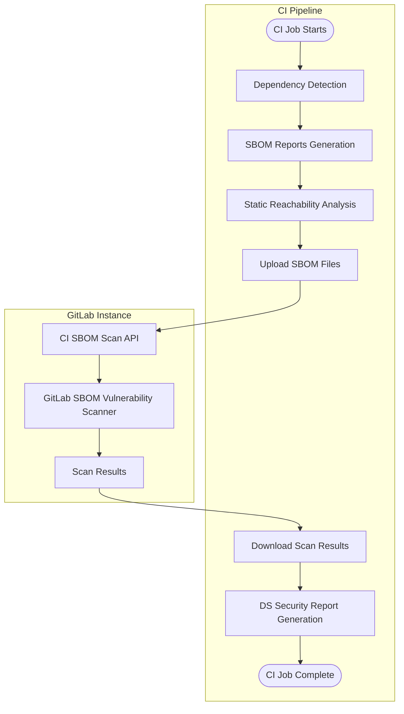



- 계층:  Ultimate
- 제공:  GitLab.com, GitLab Self-Managed, GitLab Dedicated





- [GitLab 17.4에서 도입](https://gitlab.com/groups/gitlab-org/-/work_items/8026) 되었으며, 기본 브랜치 전용으로 [실험](../../../../policy/development_stages_support.md#experiment) 으로 [기능 플래그](../../../../administration/feature_flags/_index.md) `dependency_scanning_using_sbom_reports`(으)로 지정되었습니다. 기본적으로 비활성화됨.
- [GitLab Self-Managed에서 활성화](https://gitlab.com/gitlab-org/gitlab/-/issues/395692)되었으며 GitLab 17.5에서 활성화되었습니다.
- 실험에서 베타로 [변경](https://gitlab.com/groups/gitlab-org/-/work_items/15960) 되었으며 모든 브랜치를 지원하고 [최신 종속성 검사 CI/CD 템플릿으로 기본적으로 활성화](https://gitlab.com/gitlab-org/gitlab/-/issues/519597)되었습니다(GitLab 17.9에서 Cargo, Conda, Cocoapods, Swift).
- 기능 플래그 `dependency_scanning_using_sbom_reports`은(는) GitLab 17.10에서 제거되었습니다.
- 베타에서 GitLab.com 전용 제한된 가용성으로 [변경](https://gitlab.com/groups/gitlab-org/-/work_items/15960) 되었으며, GitLab 18.5에서 새로운 [V2 CI/CD 종속성 검사 템플릿](https://gitlab.com/gitlab-org/gitlab/-/merge_requests/201175/) 이 있으며 [기능 플래그](../../../../administration/feature_flags/_index.md) `dependency_scanning_sbom_scan_api`(으)로 지정되었습니다. 기본적으로 비활성화됨.
- 기능 플래그 `dependency_scanning_using_sbom_reports`이(가) GitLab 18.10에서 [기본적으로 활성화](https://gitlab.com/gitlab-org/gitlab/-/work_items/551861)되었습니다.
- [일반적으로 이용 가능](https://gitlab.com/groups/gitlab-org/-/work_items/20456)하며 GitLab 19.0에서 제공됩니다.



CycloneDX 소프트웨어 BOM(SBOM)을 사용한 종속성 검사는 알려진 취약성에 대한 애플리케이션의 종속성을 분석합니다. 모든 종속성이 스캔되며, [전이 종속성 포함](../_index.md)입니다.

종속성 검사는 종종 소프트웨어 구성 분석(SCA)의 일부로 간주됩니다. SCA는 코드가 사용하는 항목을 검사하는 측면을 포함할 수 있습니다. 이러한 항목에는 일반적으로 외부 소스에서 가져오는 애플리케이션 및 시스템 종속성이 포함되며, 사용자가 직접 작성한 항목에서 생성되지 않습니다.

종속성 검사는 애플리케이션의 수명 주기의 개발 단계에서 실행될 수 있습니다. CI/CD 파이프라인에서 새로운 종속성 검사 분석기를 사용하면, 프로젝트 종속성이 감지되고 CycloneDX SBOM 보고서에서 보고됩니다. 보안 결과는 소스 브랜치와 대상 브랜치 간에 식별되고 비교됩니다. 결과와 심각도는 머지 리퀘스트에 나열되므로, 코드 변경을 커밋하기 전에 애플리케이션의 위험을 사전에 해결할 수 있습니다. 보고된 SBOM 구성 요소에 대한 보안 결과는 [지속적 취약성 검사](../../continuous_vulnerability_scanning/_index.md)로도 식별되며, CI/CD 파이프라인과 독립적으로 새로운 보안 공지가 발표됩니다.

GitLab은 모든 이러한 종속성 유형에 대한 범위를 보장하기 위해 종속성 검사와 [컨테이너 검사](../../container_scanning/_index.md)를 모두 제공합니다. 위험 영역을 최대한 많이 커버하려면, 모든 보안 스캐너를 사용할 것을 권장합니다. 이러한 기능의 비교를 보려면 [종속성 검사와 컨테이너 검사 비교](../../comparison_dependency_and_container_scanning.md)를 참조하세요.

새로운 종속성 검사 분석기에 대한 피드백을 이 [피드백 이슈](https://gitlab.com/gitlab-org/gitlab/-/issues/523458)에서 공유하세요.

## 종속성 검사 켜기 {#turn-on-dependency-scanning}

프로젝트에 대해 종속성 검사를 켭니다.

### 필수 요구 사항 {#prerequisites}

모든 GitLab 인스턴스의 전제 조건:

- 프로젝트에 대한 Developer, Maintainer 또는 Owner 역할.
- [지원되는 잠금 파일 또는 종속성 그래프 내보내기](#supported-languages-and-files)로, 리포지토리에 커밋되거나 CI/CD 파이프라인에서 생성되어 `dependency-scanning` 작업에 아티팩트로 전달됩니다. 대신, [종속성 해결](#dependency-resolution) 이(가) 지원되는 에코시스템의 필수 파일을 생성할 수 있거나, [매니페스트 파일](#manifest-fallback)을(를) 대체 옵션으로 사용할 수 있습니다.
- 자체 관리 러너의 경우, [`docker`](https://docs.gitlab.com/runner/executors/docker/) 또는 [`kubernetes`](https://docs.gitlab.com/runner/install/kubernetes/) 실행기가 있는 GitLab 러너입니다.
- GitLab.com의 호스팅 러너의 경우, 이 구성은 기본적으로 활성화됩니다.

GitLab Self-Managed 전용으로, 스캔할 모든 PURL 유형에 대해 [패키지 메타데이터](../../../../administration/settings/security_and_compliance.md#choose-package-registry-metadata-to-sync)를 GitLab 인스턴스에 동기화해야 합니다. 이 데이터를 GitLab 인스턴스에서 사용할 수 없으면, 종속성 검사는 취약성을 식별할 수 없습니다.

### 프로젝트 파이프라인 구성 업데이트 {#update-project-pipeline-configuration}

종속성 검사를 켜려면, 프로젝트 파이프라인 구성에 종속성 검사 템플릿을 추가해야 합니다.

기본적으로, `Dependency-Scanning.v2.gitlab-ci.yml` 템플릿은 머지 리퀘스트 파이프라인에서 종속성 검사 작업을 실행합니다. 프로젝트가 다른 작업에 대해 머지 리퀘스트 파이프라인을 사용하지 않으면, 이로 인해 머지 리퀘스트 파이프라인에는 종속성 검사 작업만 표시되고 다른 모든 작업은 별도의 브랜치 파이프라인에서 실행됩니다. 이 동작을 비활성화하려면 [머지 리퀘스트 파이프라인 종속성 검사 비활성화](#disable-merge-request-pipelines-for-dependency-scanning)를 참조하세요.

GitLab UI를 통해 종속성 검사를 켜려면:

1. 상단 표시줄에서 **검색 또는 이동**을 선택하고 프로젝트를 찾으세요.
1. 왼쪽 사이드바에서 **코드** > **리포지토리**를 선택합니다.
1. `.gitlab-ci.yml` 파일을 선택합니다.
1. **편집** > **단일 파일 편집**을 선택합니다.
1. `Dependency-Scanning.v2` CI/CD 템플릿을 추가합니다:

   ```yaml
   include:
     - template: Jobs/Dependency-Scanning.v2.gitlab-ci.yml
   ```

1. **변경 사항 커밋**을 선택합니다.

## 사용 가능한 컨테이너 이미지 {#available-container-images}

이 기능은 CI 작업을 실행하기 위해 컨테이너 이미지를 사용합니다. 기본 CI 작업 정의는 주 버전 태그(예: `dependency-scanning:2`)별로 이러한 이미지를 참조하므로, CI/CD 구성을 변경하지 않고도 패치 및 부 업데이트를 자동으로 받습니다.

### 유지 보수 정책 {#maintenance-policy}

GitLab은 [릴리스 및 유지 보수 정책](../../../../policy/maintenance.md)을(를) 따라 현재 안정적인 릴리스에 대한 버그 수정 및 이전 2개월 릴리스에 대한 보안 수정을 제공합니다.

CI/CD 작업은 주 버전 태그(예: `dependency-scanning:2`)별로 이미지를 참조하므로, 해당 주 이미지 버전과 호환되는 모든 GitLab 버전에 수정이 자동으로 제공됩니다.

이는 아래 나열된 이미지에 적용됩니다. 이전 이미지는 이 정책의 적용을 받지 않습니다.

### 현재 이미지 {#current-images}

| CI/CD 작업                               | 프로덕션 이미지                                                                                        | GitLab 버전 |
| --------------------------------------- | ------------------------------------------------------------------------------------------------------- | -------------- |
| `dependency-scanning`                   | `registry.gitlab.com/security-products/dependency-scanning:2`                                           | `19.x`         |
| `dependency-scanning:maven-resolution`  | `registry.gitlab.com/security-products/dependency-resolution/ubi9/openjdk-21:1`                         | `18.x`, `19.x` |
| `dependency-scanning:gradle-resolution` | `registry.gitlab.com/security-products/dependency-resolution/ubi9/openjdk-17-with-gradle-8:1`           | `19.x`         |
| `dependency-scanning:python-resolution` | `registry.gitlab.com/security-products/dependency-resolution/ubi9/python-312-minimal-with-piptools-7:9` | `18.x`,`19.x`  |

현재 이미지는 기본 이미지 공급업체의 업스트림 패치를 포함하도록 정기적으로 재구성됩니다.

### 이전 이미지 {#previous-images}

이 이미지는 더 이상 사용되지 않으며 더 이상 버그 수정 또는 새 기능을 받지 않습니다. 컨테이너 레지스트리에서 계속 사용 가능하며 해당 GitLab 버전과 함께 계속 작동합니다. 더 이상 사용되지 않는 이미지를 최신 GitLab 버전과 함께 사용하는 것은 지원되지 않으며 예상치 못한 결과가 발생할 수 있습니다.

| CI/CD 작업             | 프로덕션 이미지                                              | GitLab 버전 | 더 이상 사용되지 않음 |
| --------------------- | ------------------------------------------------------------- | -------------- | ------------- |
| `dependency-scanning` | `registry.gitlab.com/security-products/dependency-scanning:1` | `18.x`         | `19.0`        |
| `dependency-scanning` | `registry.gitlab.com/security-products/dependency-scanning:0` | `18.x`         | `19.0`        |

### FIPS 준수 {#fips-compliance}

종속성 검사 분석기 이미지 및 모든 [종속성 해결 이미지](#dependency-resolution) 는 FIPS 140 검증된 암호화 모듈을 사용하는 [Red Hat UBI](https://www.redhat.com/en/blog/introducing-red-hat-universal-base-image)를 기반으로 합니다. FIPS 지원 환경에서는 추가 구성이 필요하지 않습니다.

## 결과 이해 {#understanding-the-results}

종속성 검사 분석기 출력:

- 감지된 지원되는 잠금 파일 또는 종속성 그래프 내보내기에 대한 CycloneDX SBOM입니다.
- 스캔된 모든 SBOM 문서에 대한 단일 종속성 검사 보고서(GitLab.com 및 GitLab Self-Managed 전용).

> [!note]
> 분석기가 [지원되는 파일](#supported-languages-and-files)을 찾지 못하면, 종속성 검사 작업이 성공적으로 완료되고 CI/CD 작업 로그에서 경고를 출력합니다. 이 경우 CycloneDX SBOM 또는 종속성 검사 보고서가 생성되지 않습니다.

### CycloneDX 소프트웨어 BOM {#cyclonedx-software-bill-of-materials}

종속성 검사 분석기는 지원되는 잠금 파일, 종속성 그래프 또는 매니페스트 파일이 감지되는 각 디렉터리에 대해 [CycloneDX](https://cyclonedx.org/) 소프트웨어 BOM(SBOM)을 출력합니다. CycloneDX SBOM은 작업 아티팩트로 생성됩니다.

CycloneDX SBOM은:

- `gl-sbom-<package-type>-<package-manager>.cdx.json` 이름이 지정됩니다.
- 종속성 검사 작업의 작업 아티팩트로 사용 가능합니다.
- `cyclonedx` 보고서로 업로드되었습니다.
- 감지된 잠금 파일 또는 종속성 그래프 파일과 동일한 디렉터리에 저장됩니다.

예를 들어 프로젝트의 구조가 다음과 같으면:

```plaintext
.
├── ruby-project/
│   └── Gemfile.lock
├── ruby-project-2/
│   └── Gemfile.lock
└── php-project/
    └── composer.lock
```

다음 CycloneDX SBOM이 작업 아티팩트로 생성됩니다:

```plaintext
.
├── ruby-project/
│   ├── Gemfile.lock
│   └── gl-sbom-gem-bundler.cdx.json
├── ruby-project-2/
│   ├── Gemfile.lock
│   └── gl-sbom-gem-bundler.cdx.json
└── php-project/
    ├── composer.lock
    └── gl-sbom-packagist-composer.cdx.json
```

### 종속성 검사 보고서 {#dependency-scanning-report}



- 제공:  GitLab.com, GitLab Self-Managed



종속성 검사 분석기는 CycloneDX SBOM 파일에서 식별된 종속성에서 식별된 모든 취약성을 문서화하는 종속성 검사 보고서를 생성합니다.

종속성 검사 보고서는:

- `gl-dependency-scanning-report.json` 이름이 지정됩니다.
- 종속성 검사 작업의 작업 아티팩트로 사용 가능합니다.
- `dependency_scanning` 보고서로 업로드되었습니다.
- 프로젝트의 루트 디렉터리에 저장됩니다.

## 최적화 {#optimization}

SBOM을 사용한 종속성 검사를 최적화하려면 다음 방법 중 하나를 사용합니다:

- 경로 제외
- 최대 디렉터리 깊이로 스캔 제한

### 경로 제외 {#exclude-paths}

경로를 제외하여 스캔 성능을 최적화하고 관련 리포지토리 콘텐츠에 집중합니다.

`.gitlab-ci.yml` 파일에서 제외 경로를 나열합니다:

- 종속성 검사 템플릿을 사용하는 경우 `DS_EXCLUDED_PATHS` CI/CD 변수를 사용합니다.
- 종속성 검사 CI/CD 구성 요소를 사용하는 경우 `excluded_paths` 스펙 입력을 사용합니다.

#### 제외 패턴 {#exclusion-patterns}

제외 패턴은 다음 규칙을 따릅니다:

- 슬래시가 없는 패턴은 프로젝트의 모든 깊이에서 파일 또는 디렉터리 이름과 일치합니다(예: `test`은(는) `./test`, `src/test`과 일치).
- 슬래시가 있는 패턴은 부모 디렉터리 매칭을 사용합니다. 패턴으로 시작하는 경로와 일치합니다(예: `a/b`은(는) `a/b`과(와) `a/b/c`은 일치하지만 `c/a/b`은 일치하지 않음).
- 표준 글로브 와일드카드가 지원됩니다(예: `a/**/b`은(는) `a/b`, `a/x/b`, `a/x/y/b`과 일치).
- 선행 및 후행 슬래시는 무시됩니다(예: `/build` 및 `build/`는 `build`과 동일하게 작동).

### 최대 디렉터리 깊이로 스캔 제한 {#limit-scanning-to-a-maximum-directory-depth}

최대 디렉터리 깊이로 스캔을 제한하여 스캔 성능을 최적화하고 분석된 파일의 수를 줄입니다.

루트 디렉터리는 깊이 `1`(으)로 계산되며, 각 하위 디렉터리는 깊이를 1씩 증가시킵니다. 기본 깊이는 `2`입니다. `-1` 값은 깊이와 무관하게 모든 디렉터리를 스캔합니다.

`.gitlab-ci.yml` 파일에서 최대 깊이를 지정하려면:

- 종속성 검사 템플릿을 사용하는 경우 `DS_MAX_DEPTH` CI/CD 변수를 사용합니다.
- 종속성 검사 CI/CD 구성 요소를 사용하는 경우 `max_scan_depth` 스펙 입력을 사용합니다.

다음 예에서 `DS_MAX_DEPTH`을(를) `3`(으)로 설정하면 `common` 디렉터리의 하위 디렉터리는 스캔되지 않습니다.

```plaintext
timer
├── integration
│   ├── doc
│   └── modules
└── source
    ├── common
    │   ├── cplusplus
    │   └── go
    ├── linux
    ├── macos
    └── windows
```

## 롤아웃 {#roll-out}

단일 프로젝트에 대한 SBOM을 사용한 종속성 검사 결과에 확신하면, 여러 프로젝트 및 그룹으로 구현을 확장할 수 있습니다. 자세한 내용은 [여러 프로젝트에 대한 스캔 적용](#enforce-scanning-on-multiple-projects)을 참조하세요.

고유한 요구 사항이 있는 경우, SBOM을 사용한 종속성 검사를 [오프라인 환경](#offline-environment)에서 실행할 수 있습니다.

## 지원되는 패키지 유형 {#supported-package-types}

보안 분석이 효과적이려면, SBOM 보고서에 나열된 구성 요소는 [GitLab 보안 공지 데이터베이스](../../gitlab_advisory_database/_index.md)에 해당 항목이 있어야 합니다.

GitLab SBOM 취약성 스캐너는 다음 [PURL 유형](https://github.com/package-url/purl-spec/blob/346589846130317464b677bc4eab30bf5040183a/PURL-TYPES.rst)이 있는 구성 요소에 대해 종속성 검사 취약성을 보고할 수 있습니다:

- `cargo`
- `composer`
- `conan`
- `gem`
- `golang`
- `maven`
- `npm`
- `nuget`
- `pypi`
- `swift`

## 지원되는 언어 및 파일 {#supported-languages-and-files}

| 언어                  | 패키지 관리자 | 파일                                         | 설명                                                                                                                                                                           | 종속성 그래프 내보내기 지원 | 정적 도달 가능성 지원 |
| ------------------------- | --------------- | ----------------------------------------------- | ------------------------------------------------------------------------------------------------------------------------------------------------------------------------------------- | ------------------------------- | --------------------------- |
| C#                        | NuGet           | `packages.lock.json`                            | `nuget`(으)로 생성된 잠금 파일입니다.                                                                                                                                                       |                      |                   |
| C/C++                     | Conan           | `conan.lock`                                    | `conan`(으)로 생성된 잠금 파일입니다.                                                                                                                                                       |                      |                   |
| C/C++/Fortran/Go/Python/R | Conda           | `conda-lock.yml`                                | `conda-lock`(으)로 생성된 환경 파일입니다.                                                                                                                                          |                       |                   |
| Dart                      | pub             | `pubspec.lock`, `pub.graph.json`                | `pub`(으)로 생성된 잠금 파일입니다. `dart pub deps --json > pub.graph.json`(에서) 파생된 종속성 그래프 내보내기입니다.                                                                           |                      |                   |
| Go                        | go              | `go.mod`, `go.graph`                            | 표준 `go` 도구 체인으로 생성된 모듈 파일입니다. `go mod graph > go.graph`(에서) 파생된 종속성 그래프 내보내기입니다.                                                                |                      |                   |
| Java                      | ivy             | `ivy-report.xml`                                | `report` Apache Ant 작업으로 생성된 종속성 그래프 내보내기입니다.                                                                                                                   |                       |                  |
| Java                      | Maven           | `maven.graph.json`                              | `mvn dependency:tree -DoutputType=json`(으)로 생성된 종속성 그래프 내보내기입니다.                                                                                                        |                      |                  |
| Java                      | Maven           | `pom.xml`                                       | [종속성 해결](#dependency-resolution) 로 사용되는 Maven 매니페스트 파일이거나, 종속성 그래프 내보내기를 사용할 수 없을 때 [매니페스트 대체](#manifest-fallback)입니다.           |                       |                  |
| Java/Kotlin               | Gradle          | `gradle.graph.txt`                              | `./gradlew dependencies`(으)로 생성된 종속성 그래프 내보내기입니다.                                                                                                                       |                      |                  |
| Java/Kotlin               | Gradle          | `dependencies.lock`, `dependencies.direct.lock` | [gradle-dependency-lock-plugin](https://github.com/nebula-plugins/gradle-dependency-lock-plugin)으로 생성된 잠금 파일입니다.                                                              |                      |                  |
| Java/Kotlin               | Gradle          | `gradle.lockfile`                               | `gradle dependencies --write-locks`(으)로 생성된 잠금 파일입니다.                                                                                                                           |                       |                  |
| Java/Kotlin               | Gradle          | `gradle-html-dependency-report.js`              | [htmlDependencyReport](https://docs.gradle.org/current/dsl/org.gradle.api.tasks.diagnostics.DependencyReportTask.html) 작업으로 생성된 종속성 그래프 내보내기입니다.                |                      |                  |
| Java/Kotlin               | Gradle          | `build.gradle`, `build.gradle.kts`              | [종속성 해결](#dependency-resolution) 로 사용되는 Gradle 빌드 파일이거나, 잠금 파일 또는 종속성 그래프 내보내기를 사용할 수 없을 때 [매니페스트 대체](#manifest-fallback)입니다. |                       |                  |
| JavaScript/TypeScript     | npm             | `package-lock.json`, `npm-shrinkwrap.json`      | `npm` v5 이상으로 생성된 잠금 파일입니다(`lockfileVersion` 속성을 생성하지 않는 이전 버전은 지원되지 않음).                                                  |                      |                  |
| JavaScript/TypeScript     | pnpm            | `pnpm-lock.yaml`                                | `pnpm`(으)로 생성된 잠금 파일입니다.                                                                                                                                                        |                      |                  |
| JavaScript/TypeScript     | yarn            | `yarn.lock`                                     | `yarn`(으)로 생성된 잠금 파일입니다.                                                                                                                                                        |                      |                  |
| Objective-C               | CocoaPods       | `Podfile.lock`                                  | `cocoapods`(으)로 생성된 잠금 파일입니다.                                                                                                                                                   |                       |                   |
| PHP                       | composer        | `composer.lock`                                 | `composer`(으)로 생성된 잠금 파일입니다.                                                                                                                                                    |                      |                   |
| Python                    | pip             | `pipdeptree.json`                               | `pipdeptree --json`(으)로 생성된 종속성 그래프 내보내기입니다.                                                                                                                            |                      |                  |
| Python                    | pip             | `requirements.txt` (잠금 파일)                   | `pip-compile`(으)로 생성된 잠금 파일입니다.                                                                                                                                                 |                      |                  |
| Python                    | pip             | `requirements.txt`                              | [종속성 해결](#dependency-resolution) 로 사용되는 매니페스트 파일이거나, 잠금 파일 또는 종속성 그래프 내보내기를 사용할 수 없을 때 [매니페스트 대체](#manifest-fallback)입니다.     |                       |                   |
| Python                    | pipenv          | `Pipfile.lock`                                  | `pipenv`(으)로 생성된 잠금 파일입니다.                                                                                                                                                      |                       |                   |
| Python                    | pipenv          | `pipenv.graph.json`                             | `pipenv graph --json-tree >pipenv.graph.json`(으)로 생성된 종속성 그래프 내보내기입니다.                                                                                                  |                      |                  |
| Python                    | poetry          | `poetry.lock`                                   | `poetry` v1 또는 v2로 생성된 잠금 파일입니다.                                                                                                                                             |                      |                  |
| Python                    | uv <sup>1</sup>  | `uv.lock`                                       | `uv`(으)로 생성된 잠금 파일입니다.                                                                                                                                                          |                      |                  |
| Ruby                      | bundler         | `Gemfile.lock`, `gems.locked`                   | `bundler`(으)로 생성된 잠금 파일입니다.                                                                                                                                                     |                      |                   |
| Rust                      | cargo           | `Cargo.lock`                                    | `cargo`(으)로 생성된 잠금 파일입니다.                                                                                                                                                       |                      |                   |
| Scala                     | sbt             | `dependencies-compile.dot`                      | `sbt dependencyDot`(으)로 생성된 종속성 그래프 내보내기입니다.                                                                                                                            |                      |                   |
| Swift                     | swift           | `Package.resolved`                              | `swift`(으)로 생성된 잠금 파일입니다.                                                                                                                                                       |                       |                   |

**각주**:

1. 잠금 파일이 다른 환경 마커를 가진 동일한 패키지에 대해 여러 항목을 포함하는 경우(예: Python <3.11에 대해 numpy==2.2.6, Python ≥3.11에 대해 numpy==2.4.1), 첫 번째 항목만 구문 분석되고 보고됩니다.

### 패키지 해시 정보 {#package-hash-information}

종속성 검사 SBOM에는 사용 가능한 경우 패키지 해시 정보가 포함됩니다. 이 정보는 NuGet 패키지에만 제공됩니다. 패키지 해시는 SBOM 내 다음 위치에 나타나므로 패키지 무결성 및 진정성을 확인할 수 있습니다:

- 전용 해시 필드
- PURL 한정자

예를 들어:

```json
{
  "name": "Iesi.Collections",
  "version": "4.0.4",
  "purl": "pkg:nuget/Iesi.Collections@4.0.4?sha512=8e579b4a3bf66bb6a661f297114b0f0d27f6622f6bd3f164bef4fa0f2ede865ef3f1dbbe7531aa283bbe7d86e713e5ae233fefde9ad89b58e90658ccad8d69f9",
  "hashes": [
    {
      "alg": "SHA-512",
      "content": "8e579b4a3bf66bb6a661f297114b0f0d27f6622f6bd3f164bef4fa0f2ede865ef3f1dbbe7531aa283bbe7d86e713e5ae233fefde9ad89b58e90658ccad8d69f9"
    }
  ],
  "type": "library",
  "bom-ref": "pkg:nuget/Iesi.Collections@4.0.4?sha512=8e579b4a3bf66bb6a661f297114b0f0d27f6622f6bd3f164bef4fa0f2ede865ef3f1dbbe7531aa283bbe7d86e713e5ae233fefde9ad89b58e90658ccad8d69f9"
}
```

## 분석기 동작 사용자 정의 {#customizing-analyzer-behavior}

분석기를 사용자 정의하는 방법은 활성화 솔루션에 따라 다릅니다.

> [!warning]
> GitLab 분석기의 모든 사용자 정의를 이 변경 사항을 기본 브랜치에 병합하기 전에 머지 리퀘스트에서 테스트합니다. 그렇지 않으면 많은 거짓 양성을 포함한 예상치 못한 결과가 발생할 수 있습니다.

### CI/CD 템플릿으로 동작 사용자 정의 {#customizing-behavior-with-the-cicd-template}

#### 사용 가능한 스펙 입력 {#available-spec-inputs}

다음 스펙 입력을 `Dependency-Scanning.v2.gitlab-ci.yml` 템플릿과 함께 사용할 수 있습니다.

| 스펙 입력                                  | 유형    | 기본값                                                                                                   | 설명                                                                                                                                                                                                                                                           |
| ------------------------------------------- | ------- | --------------------------------------------------------------------------------------------------------- | --------------------------------------------------------------------------------------------------------------------------------------------------------------------------------------------------------------------------------------------------------------------- |
| `job_name`                                  | 문자열  | `"dependency-scanning"`                                                                                   | 종속성 검사 작업의 이름입니다.                                                                                                                                                                                                                              |
| `stage`                                     | 문자열  | `test`                                                                                                    | 종속성 검사 작업의 스테이지입니다.                                                                                                                                                                                                                             |
| `allow_failure`                             | 부울 | `true`                                                                                                    | 종속성 검사 작업 실패가 파이프라인을 실패시켜야 하는지 여부입니다.                                                                                                                                                                                                 |
| `analyzer_image_prefix`                     | 문자열  | `"$CI_TEMPLATE_REGISTRY_HOST/security-products"`                                                          | 분석기 리포지토리를 가리키는 레지스트리 URL 접두사입니다.                                                                                                                                                                                                   |
| `analyzer_image_name`                       | 문자열  | `"dependency-scanning"`                                                                                   | 종속성 검사 작업에서 사용되는 분석기 이미지의 리포지토리입니다.                                                                                                                                                                                             |
| `analyzer_image_version`                    | 문자열  | `"2"`                                                                                                     | 종속성 검사 작업에서 사용되는 분석기 이미지의 버전입니다.                                                                                                                                                                                                |
| `additional_ca_cert_bundle`                 | 문자열  |                                                                                                           | 신뢰할 CA 인증서 번들입니다. 여기에 제공된 CA 번들은 시스템의 인증서에 추가되며 스캔 프로세스 중에 다른 도구에서도 사용됩니다. 자세한 내용은 [사용자 정의 TLS 인증 기관](#custom-tls-certificate-authority)을을 참조하세요.              |
| `pip_manifest_file_name_pattern`            | 문자열  |                                                                                                           | 종속성 해결 및 매니페스트 스캔을 위해 사용할 사용자 정의 pip 매니페스트 파일 이름 패턴입니다. 패턴은 디렉터리 경로가 아닌 파일 이름하고만 일치해야 합니다. 구문 세부 정보는 [doublestar 라이브러리](https://www.github.com/bmatcuk/doublestar/tree/v1#patterns)를 참조하세요. |
| `pipcompile_lockfile_file_name_pattern`     | 문자열  |                                                                                                           | 분석할 때 사용할 사용자 정의 pip-compile 잠금 파일 이름 패턴입니다. 패턴은 디렉터리 경로가 아닌 파일 이름하고만 일치해야 합니다. 구문 세부 정보는 [doublestar 라이브러리](https://www.github.com/bmatcuk/doublestar/tree/v1#patterns)를 참조하세요.                          |
| `pipcompile_requirements_file_name_pattern` | 문자열  |                                                                                                           | GitLab 19.0에서 [더 이상 사용되지 않음](https://gitlab.com/gitlab-org/gitlab/-/work_items/598796): 대신 `pipcompile_lockfile_file_name_pattern`을(를) 사용하세요.                                                                                                                           |
| `max_scan_depth`                            | 숫자  | `2`                                                                                                       | 분석기가 지원되는 파일을 검색해야 하는 디렉터리 수준을 정의합니다. -1 값은 깊이와 무관하게 분석기가 모든 디렉터리를 검색한다는 의미입니다.                                                                                                       |
| `excluded_paths`                            | 문자열  | `"**/spec,**/test,**/tests,**/tmp"`                                                                       | 스캔에서 제외할 경로(글로브 지원)의 쉼표로 구분된 목록입니다.                                                                                                                                                                                           |
| `include_dev_dependencies`                  | 부울 | `true`                                                                                                    | 지원되는 파일을 스캔할 때 개발/테스트 종속성을 포함합니다.                                                                                                                                                                                                 |
| `enable_static_reachability`                | 부울 | `false`                                                                                                   | [정적 도달 가능성](../static_reachability.md)을 활성화합니다.                                                                                                                                                                                                              |
| `enable_manifest_fallback`                  | 부울 | `true`                                                                                                    | [매니페스트 대체](#manifest-fallback)을 활성화합니다.                                                                                                                                                                                                                       |
| `analyzer_log_level`                        | 문자열  | `"info"`                                                                                                  | 종속성 검사에 대한 로깅 수준입니다. 옵션은 fatal, error, warn, info, debug입니다.                                                                                                                                                                               |
| `enable_vulnerability_scan`                 | 부울 | `true`                                                                                                    | 생성된 SBOM의 취약성 분석을 활성화합니다.                                                                                                                                                                                                                  |
| `api_timeout`                               | 숫자  | `10`                                                                                                      | 종속성 검사 SBOM API 요청 시간 초과(초 단위)입니다.                                                                                                                                                                                                              |
| `api_scan_download_delay`                   | 숫자  | `3`                                                                                                       | 스캔 결과를 다운로드하기 전에 종속성 검사 SBOM API 초기 지연(초 단위)입니다.                                                                                                                                                                                |
| `resolution_jobs_stage`                     | 문자열  | `.pre`                                                                                                    | 종속성 해결 작업의 스테이지입니다.                                                                                                                                                                                                                         |
| `resolution_jobs_allow_failure`             | 부울 | `true`                                                                                                    | `true`인 경우, 실패한 해결 작업은 파이프라인을 실패시키지 않습니다. `false`인 경우, 해결 실패가 파이프라인을 차단합니다.                                                                                                                                              |
| `disabled_resolution_jobs`                  | 문자열  | `""`                                                                                                      | 비활성화할 해결 작업의 쉼표로 구분된 목록(예: `"maven, python"`). 기본적으로 사용 가능한 모든 해결 작업이 활성화됩니다. 가능한 값: `maven`,`gradle`,`python`. [종속성 해결](#dependency-resolution) 참조                       |
| `maven_resolution_job_name`                 | 문자열  | `"dependency-scanning:maven-resolution"`                                                                  | Maven 종속성 해결을 위한 작업의 이름입니다.                                                                                                                                                                                                                  |
| `maven_resolution_image`                    | 문자열  | `"registry.gitlab.com/security-products/dependency-resolution/ubi9/openjdk-21:1"`                         | Maven 종속성 해결 작업에서 사용되는 이미지입니다.                                                                                                                                                                                                                |
| `maven_dependency_plugin_version`           | 문자열  | `"3.7.0"`                                                                                                 | Maven 종속성 해결 중에 사용되는 `maven-dependency-plugin`의 버전입니다. `3.7.0` 이상이어야 합니다.                                                                                                                                                           |
| `python_resolution_job_name`                | 문자열  | `"dependency-scanning:python-resolution"`                                                                 | Python 종속성 해결을 위한 작업의 이름입니다.                                                                                                                                                                                                                 |
| `python_resolution_image`                   | 문자열  | `"registry.gitlab.com/security-products/dependency-resolution/ubi9/python-312-minimal-with-piptools-7:9"` | Python 종속성 해결 작업에서 사용되는 이미지입니다.                                                                                                                                                                                                               |
| `gradle_resolution_job_name`                | 문자열  | `"dependency-scanning:gradle-resolution"`                                                                 | Gradle 종속성 해결을 위한 작업의 이름입니다.                                                                                                                                                                                                                 |
| `gradle_resolution_image`                   | 문자열  | `"registry.gitlab.com/security-products/dependency-resolution/ubi9/openjdk-17-with-gradle-8:1"`           | Gradle 종속성 해결 작업에서 사용되는 이미지입니다.                                                                                                                                                                                                               |

#### 사용 가능한 CI/CD 변수 {#available-cicd-variables}

이러한 변수는 스펙 입력을 대체할 수 있으며 베타 `latest` 템플릿과도 호환됩니다.

| CI/CD 변수                                | 설명                                                                                                                                                                                                                                                                                                                                                                                                                                                                                                                                                                                      |
| ---------------------------------------------- | ------------------------------------------------------------------------------------------------------------------------------------------------------------------------------------------------------------------------------------------------------------------------------------------------------------------------------------------------------------------------------------------------------------------------------------------------------------------------------------------------------------------------------------------------------------------------------------------------ |
| `AST_ENABLE_MR_PIPELINES`                      | 종속성 검사 작업이 머지 리퀘스트 또는 브랜치 파이프라인에서 실행되는지 여부를 제어합니다. 기본값: `"true"`. 프로젝트가 머지 리퀘스트 파이프라인을 사용하지 않으면, 이를 비활성화하여 중복 파이프라인을 방지합니다.                                                                                                                                                                                                                                                                                                                                                                                                                  |
| `ADDITIONAL_CA_CERT_BUNDLE`                    | 신뢰할 CA 인증서 번들입니다. 여기에 제공된 CA 번들은 시스템의 인증서에 추가되며 스캔 프로세스 중에 다른 도구에서도 사용됩니다. 자세한 내용은 [사용자 정의 TLS 인증 기관](#custom-tls-certificate-authority)을을 참조하세요.                                                                                                                                                                                                                                                                                                                                         |
| `ANALYZER_ARTIFACT_DIR`                        | CycloneDX 보고서(SBOM)가 저장되는 디렉터리입니다. 기본값 `${CI_PROJECT_DIR}/sca-artifacts`.                                                                                                                                                                                                                                                                                                                                                                                                                                                                                                  |
| `DEPENDENCY_SCANNING_DISABLED`                 | `"true"` 또는 `"1"`(으)로 설정하면, 모든 종속성 검사 작업이 비활성화됩니다. 기본값: 설정되지 않음.                                                                                                                                                                                                                                                                                                                                                                                                                                                                                                          |
| `DS_EXCLUDED_ANALYZERS`                        | 종속성 검사에서 제외할 분석기(이름별)를 지정합니다.                                                                                                                                                                                                                                                                                                                                                                                                                                                                                                                             |
| `DS_EXCLUDED_PATHS`                            | 경로를 기반으로 스캔에서 파일 및 디렉터리를 제외합니다. 패턴의 쉼표로 구분된 목록입니다. 패턴은 글로브(지원되는 패턴은 [`doublestar.Match`](https://pkg.go.dev/github.com/bmatcuk/doublestar/v4@v4.0.2#Match) 참조)이거나 파일 또는 폴더 경로(예: `doc,spec`)일 수 있습니다. 매칭 규칙에 대해 [제외 패턴](#exclusion-patterns)을 참조하세요. 이는 스캔이 실행되기 전에 적용되는 전필터입니다. 종속성 감지 및 정적 도달 가능성 모두에 적용됩니다. 기본값: `"**/spec,**/test,**/tests,**/tmp,**/node_modules,**/.bundle,**/vendor,**/.git"`. |
| `DS_MAX_DEPTH`                                 | 분석기가 스캔할 지원되는 파일을 검색해야 하는 깊이의 디렉터리 수준을 정의합니다. `-1` 값은 깊이와 무관하게 모든 디렉터리를 스캔합니다. 기본값: `2`.                                                                                                                                                                                                                                                                                                                                                                                                                     |
| `DS_INCLUDE_DEV_DEPENDENCIES`                  | `"false"`(으)로 설정하면, 개발 종속성이 보고되지 않습니다. Composer, Conda, Gradle, Maven, npm, pnpm, Pipenv, Poetry, 또는 uv를 사용하는 프로젝트만 지원됩니다. 기본값: `"true"`                                                                                                                                                                                                                                                                                                                                                                                                          |
| `DS_PIP_MANIFEST_FILE_NAME_PATTERN`            | 종속성 해결 및 매니페스트 스캔을 위해 처리할 pip 매니페스트 파일을 글로브 패턴 매칭을 사용하여 정의합니다(예: `custom-requirements.txt` 또는 `*-requirements.txt`). 패턴은 디렉터리 경로가 아닌 파일명하고만 일치해야 합니다. 구문 세부 정보는 [글로브 패턴 문서](https://github.com/bmatcuk/doublestar/tree/v1?tab=readme-ov-file#patterns)를 참조하세요.                                                                                                                                                                                                         |
| `PIP_REQUIREMENTS_FILE`                        | GitLab 19.0에서 [더 이상 사용되지 않음](https://gitlab.com/gitlab-org/gitlab/-/work_items/588580): 대신 `DS_PIP_MANIFEST_FILE_NAME_PATTERN`을(를) 사용하세요.                                                                                                                                                                                                                                                                                                                                                                                                                                                          |
| `DS_PIPCOMPILE_LOCKFILE_FILE_NAME_PATTERN`     | 글로브 패턴 매칭을 사용하여 처리할 pip-compile 잠금 파일을 정의합니다(예: `requirements*.txt` 또는 `*-requirements.txt`). 패턴은 디렉터리 경로가 아닌 파일명하고만 일치해야 합니다. 구문 세부 정보는 [글로브 패턴 문서](https://github.com/bmatcuk/doublestar/tree/v1?tab=readme-ov-file#patterns)를 참조하세요.                                                                                                                                                                                                                                                             |
| `DS_PIPCOMPILE_REQUIREMENTS_FILE_NAME_PATTERN` | GitLab 19.0에서 [더 이상 사용되지 않음](https://gitlab.com/gitlab-org/gitlab/-/work_items/598796): 대신 `DS_PIPCOMPILE_LOCKFILE_FILE_NAME_PATTERN`을(를) 사용하세요.                                                                                                                                                                                                                                                                                                                                                                                                                                                   |
| `SECURE_ANALYZERS_PREFIX`                      | 공식 기본 이미지(프록시)를 제공하는 Docker 레지스트리의 이름을 재정의합니다.                                                                                                                                                                                                                                                                                                                                                                                                                                                                                                          |
| `DS_FF_LINK_COMPONENTS_TO_GIT_FILES`           | 종속성 목록의 구성 요소를 CI/CD 파이프라인에서 동적으로 생성된 잠금 파일 및 그래프 파일이 아닌 리포지토리에 커밋된 파일로 연결합니다. 이렇게 하면 모든 구성 요소가 리포지토리의 소스 파일에 연결됩니다. 기본값: `"false"`.                                                                                                                                                                                                                                                                                                                                      |
| `SEARCH_IGNORE_HIDDEN_DIRS`                    | 숨겨진 디렉터리를 무시합니다. 종속성 검사 및 정적 도달 가능성 모두에서 작동합니다. 기본값: `"true"`.                                                                                                                                                                                                                                                                                                                                                                                                                                                                                        |
| `DS_STATIC_REACHABILITY_ENABLED`               | [정적 도달 가능성](../static_reachability.md)을 활성화합니다. 기본값: `"false"`.                                                                                                                                                                                                                                                                                                                                                                                                                                                                                                                    |
| `DS_ENABLE_VULNERABILITY_SCAN`                 | 생성된 SBOM 파일의 취약성 스캔을 활성화합니다. [종속성 검사 보고서](#dependency-scanning-report)를 생성합니다. 기본값: `"true"`.                                                                                                                                                                                                                                                                                                                                                                                                                                                 |
| `DS_API_TIMEOUT`                               | 종속성 검사 SBOM API 요청 시간 초과(초 단위)(최소: `5`, 최대: `300`) 기본값: `10`                                                                                                                                                                                                                                                                                                                                                                                                                                                                                             |
| `DS_API_SCAN_DOWNLOAD_DELAY`                   | 스캔 결과를 다운로드하기 전의 초기 지연(초 단위)(최소:  1, 최대:  120) 기본값: `3`                                                                                                                                                                                                                                                                                                                                                                                                                                                                                                 |
| `DS_ENABLE_MANIFEST_FALLBACK`                  | 잠금 파일 또는 종속성 그래프 내보내기를 사용할 수 없을 때 매니페스트 대체를 활성화합니다. [매니페스트 대체](#manifest-fallback)를 참조하세요. 기본값: `"true"`.                                                                                                                                                                                                                                                                                                                                                                                                                                               |
| `DS_SKIP_IF_NO_SUPPORTED_FILES`                | `"true"`(으)로 설정하면, 프로젝트에서 [지원되는 파일](#supported-languages-and-files)을(를) 찾지 못한 경우 종속성 검사 작업을 건너뜁니다. 자세한 내용은 [지원되는 파일이 없을 때 작업 건너뛰기](#skip-the-job-when-no-supported-file-is-present)를 참조하세요. 기본값: `"false"`.                                                                                                                                                                                                                                                                                                                            |
| `SECURE_LOG_LEVEL`                             | 로그 수준입니다. 기본값: `"info"`.                                                                                                                                                                                                                                                                                                                                                                                                                                                                                                                                                                    |
| `DS_DISABLED_RESOLUTION_JOBS`                  | 비활성화할 해결 작업의 쉼표로 구분된 목록(예: `"maven, python"`). 기본적으로 사용 가능한 모든 해결 작업이 활성화됩니다. 가능한 값: `maven`,`gradle`,`python`.                                                                                                                                                                                                                                                                                                                                                                                                      |
| `DS_MAVEN_RESOLUTION_IMAGE`                    | Maven 종속성 해결 작업에서 사용되는 이미지입니다.                                                                                                                                                                                                                                                                                                                                                                                                                                                                                                                                           |
| `DS_MAVEN_DEPENDENCY_PLUGIN_VERSION`           | Maven 종속성 해결 중에 사용되는 `maven-dependency-plugin`의 버전입니다. `3.7.0` 이상이어야 합니다. 기본값: `3.7.0`.                                                                                                                                                                                                                                                                                                                                                                                                                                                                    |
| `DS_PYTHON_RESOLUTION_IMAGE`                   | Python 종속성 해결 작업에서 사용되는 이미지입니다.                                                                                                                                                                                                                                                                                                                                                                                                                                                                                                                                          |
| `DS_GRADLE_RESOLUTION_IMAGE`                   | Gradle 종속성 해결 작업에서 사용되는 이미지입니다.                                                                                                                                                                                                                                                                                                                                                                                                                                                                                                                                          |

### 종속성 검사에 대한 머지 리퀘스트 파이프라인 비활성화 {#disable-merge-request-pipelines-for-dependency-scanning}

기본적으로, `Dependency-Scanning.v2.gitlab-ci.yml` 템플릿은 머지 리퀘스트 파이프라인에서 종속성 검사 작업을 실행합니다. 프로젝트가 다른 작업에 대해 머지 리퀘스트 파이프라인을 사용하지 않으면, 각 머지 리퀘스트에 대해 2개의 파이프라인이 실행되고 다른 작업은 별도의 브랜치 파이프라인에서 실행될 수 있습니다. 이 동작을 비활성화하려면, 스펙 입력 `enable_mr_pipelines: false` 또는 CI/CD 변수 `AST_ENABLE_MR_PIPELINES: "false"`(을)를 설정합니다.

### 지원되는 파일이 없을 때 작업 건너뛰기 {#skip-the-job-when-no-supported-file-is-present}

기본적으로, 종속성 검사 작업은 프로젝트에 [지원되는 파일](#supported-languages-and-files)이 포함되지 않은 경우에도 템플릿을 포함하는 모든 파이프라인에서 실행됩니다. 지원되는 파일을 찾지 못한 경우 작업을 건너뛰려면, `DS_SKIP_IF_NO_SUPPORTED_FILES`을(를) `"true"`(으)로 설정합니다:

```yaml
include:
  - template: Jobs/Dependency-Scanning.v2.gitlab-ci.yml

variables:
  DS_SKIP_IF_NO_SUPPORTED_FILES: "true"
```

변수를 설정하면, 종속성 검사 작업은 프로젝트가 [지원되는 파일 목록](#supported-languages-and-files)에 포함된 최소한 하나의 파일을 포함하거나 `DS_PIPCOMPILE_LOCKFILE_FILE_NAME_PATTERN`, `DS_PIP_MANIFEST_FILE_NAME_PATTERN`, 또는 `PIP_REQUIREMENTS_FILE`(더 이상 사용되지 않음)를 사용하여 사용자 정의 패턴을 설정한 경우에만 실행됩니다.

### 사용자 정의 TLS 인증 기관 {#custom-tls-certificate-authority}

종속성 검사는 분석기 컨테이너 이미지와 함께 제공되는 기본값 대신 SSL/TLS 연결에 사용자 정의 TLS 인증서를 사용할 수 있습니다.

#### 사용자 정의 TLS 인증 기관 사용 {#using-a-custom-tls-certificate-authority}

사용자 정의 TLS 인증 기관을 사용하려면, [X.509 PEM 공개 키 인증서의 텍스트 표현](https://www.rfc-editor.org/rfc/rfc7468#section-5.1)을을 CI/CD 변수 `ADDITIONAL_CA_CERT_BUNDLE`(으)로 할당합니다.

예를 들어, `.gitlab-ci.yml` 파일에서 인증서를 구성하려면:

```yaml
variables:
  ADDITIONAL_CA_CERT_BUNDLE: |
      -----BEGIN CERTIFICATE-----
      MIIGqTCCBJGgAwIBAgIQI7AVxxVwg2kch4d56XNdDjANBgkqhkiG9w0BAQsFADCB
      ...
      jWgmPqF3vUbZE0EyScetPJquRFRKIesyJuBFMAs=
      -----END CERTIFICATE-----
```

## 종속성 해결 {#dependency-resolution}



- Maven 및 Python에 대해 [도입](https://gitlab.com/groups/gitlab-org/-/work_items/20461)되었으며, GitLab 18.11에서 기본적으로 비활성화되었습니다.
- Gradle 지원이 [추가](https://gitlab.com/gitlab-org/gitlab/-/work_items/590734)되었습니다. GitLab 19.0에서 지원되는 모든 프로젝트에 대해 기본적으로 활성화됩니다.



프로젝트에 리포지토리에 커밋된 지원되는 잠금 파일 또는 종속성 그래프 내보내기가 없는 경우, 종속성 해결은 스캔이 실행되기 전에 필수 파일을 자동으로 생성할 수 있습니다.

종속성 해결은 지원되는 매니페스트 파일이 프로젝트에서 감지될 때 자동으로 트리거됩니다. 해결 작업은 `.pre` 스테이지에서 최소 에코시스템 이미지(예: `ubi9/openjdk-21`)를 사용하여 잠금 파일 또는 종속성 그래프 내보내기를 기본적으로 생성합니다. 이러한 작업은 기존 잠금 파일 또는 그래프 내보내기를 보존하고, 없는 경우에만 생성합니다. 생성된 아티팩트는 `dependency-scanning` 스테이지에서 `test` 작업에서 사용됩니다. 기본 이미지를 동등한 대안(예: `eclipse-temurin:jdk-21`) 또는 필수 빌드 도구를 포함하는 사용자 정의 이미지로 대체할 수 있습니다.

다음 에코시스템은 종속성 해결을 지원합니다:

| 언어    | 패키지 관리자 | 감지된 매니페스트 파일                                                                                                           | 해결 명령    | 출력 아티팩트       |
| ----------- | --------------- | --------------------------------------------------------------------------------------------------------------------------------- | --------------------- | --------------------- |
| Java        | Maven           | `pom.xml`                                                                                                                         | `mvn dependency:tree` | `maven.graph.json`    |
| Java/Kotlin | Gradle          | `build.gradle`, `build.gradle.kts`                                                                                                | `gradle dependencies` | `gradle.graph.txt`    |
| Python      | pip, setuptools | `requirements.txt`, `requirements.in`, `requirements.pip`, `requires.txt`, `setup.py`, `setup.cfg`, `pyproject.toml` (non-Poetry) | `pip-compile`         | `pipcompile.lock.txt` |

### 종속성 해결 사용자 정의 {#customizing-dependency-resolution}

사용 가능한 모든 옵션에 대해 [사용 가능한 스펙 입력](#available-spec-inputs) 및 [사용 가능한 CI/CD 변수](#available-cicd-variables)를 참조하세요.

#### 사용자 정의 종속성 해결 이미지 사용 {#use-a-custom-dependency-resolution-image}

자체 이미지를 사용하려면 다음 입력을 설정할 수 있습니다:

- `maven_resolution_image`
- `gradle_resolution_image`
- `python_resolution_image`

예를 들어, maven 해결에 사용자 정의 이미지를 사용하려면:

```yaml
include:
  - template: Jobs/Dependency-Scanning.v2.gitlab-ci.yml
    inputs:
      maven_resolution_image: "registry.gitlab.mycorp.com/eclipse-temurin:jdk-21"
```

또는 다음 CI/CD 변수를 설정할 수 있습니다:

- `DS_MAVEN_RESOLUTION_IMAGE`
- `DS_GRADLE_RESOLUTION_IMAGE`
- `DS_PYTHON_RESOLUTION_IMAGE`

#### 종속성 해결 비활성화 {#disable-dependency-resolution}

특정 에코시스템에 대해 종속성 해결을 비활성화하려면, `DS_DISABLED_RESOLUTION_JOBS` CI/CD 변수 또는 `disabled_resolution_jobs` 입력을 사용합니다. 가능한 값: `maven`,`gradle`,`python`.

예를 들어, maven에 대한 종속성 해결을 비활성화하려면:

```yaml
variables:
  DS_DISABLED_RESOLUTION_JOBS: "maven"

include:
  - template: Jobs/Dependency-Scanning.v2.gitlab-ci.yml
```

### 종속성 해결을 위한 보안 고려 사항 {#security-considerations-for-dependency-resolution}

종속성 해결 작업은 CI/CD 작업 컨테이너에서 에코시스템 기본 빌드 도구(`mvn`, `gradle`, `pip-compile`)를 실행합니다. 이러한 도구는 기본적으로 시작 시 확장 또는 임의 코드를 로드할 수 있는 환경 변수 및 구성 파일을 존중합니다. 여기에는:

- Maven: `MAVEN_ARGS`, `MAVEN_CLI_OPTS` (레거시), `MAVEN_OPTS`, `JAVA_TOOL_OPTIONS`, `-s` 또는 `--settings`를 통해 참조되는 `settings.xml`, `pom.xml` 또는 `settings.xml`에서 선언된 `<extensions>`.
- Gradle: `GRADLE_OPTS`, `JAVA_TOOL_OPTIONS`, `--init-script`, `build.gradle` 또는 `build.gradle.kts`의 최상위 Groovy 또는 Kotlin 코드.
- Python: `PIP_INDEX_URL`, `PIP_EXTRA_INDEX_URL`, `setup.py`, 잠금 파일 설치 후크.

이러한 CI/CD 변수를 설정하거나 프로젝트의 빌드 파일을 수정할 수 있는 누구든지 해결 작업에서 임의 코드를 실행할 수 있습니다. 해결 작업은 `CI_JOB_TOKEN`, 범위의 액세스 마스킹된 CI/CD 변수, 작업 기간 동안 프로젝트 리포지토리로 읽기 또는 쓰기를 실행합니다.

이 속성은 에코시스템 기본 빌드 도구에 고유하며 종속성 검사에만 해당되지 않습니다. 해결 작업을 민감한 실행 컨텍스트로 취급합니다.

권장 컨트롤:

- 이전에 나열된 변수를 정의하거나 재정의할 수 있는 사용자를 제한합니다. [보호된 CI/CD 변수](../../../../ci/variables/_index.md#for-a-project)를 사용하여 보호된 브랜치 및 태그로 범위를 지정합니다. 모든 개발자가 편집할 수 있는 `.gitlab-ci.yml` `variables:` 블록에서 설정하지 마세요.
- 표준 코드 검토 프로세스의 일부로 `pom.xml`에서 `MAVEN_ARGS`, `MAVEN_CLI_OPTS`, `GRADLE_OPTS`, `--init-script`, 사용자 정의 `settings.xml`, `<extensions>`의 모든 사용을 감사합니다.
- [스캔 실행 정책](../../policies/scan_execution_policies.md)을 사용하여 종속성 검사를 적용하는 경우, 개발자 작성 `variables:`이(가) 대상 프로젝트에서 주입된 해결 작업으로 흐릅니다. 정책 프레임워크가 전달하는 변수를 검토하고, 정책에서 빌드 도구 변수를 설정 해제하거나 재정의합니다.
- 프로젝트의 빌드가 사용자가 제어하고 신뢰하는 CI/CD 작업에서 실행되는 경우(예: `build` 스테이지가 `mvn package`을 실행), 해당 동일한 작업에서 잠금 파일 또는 종속성 그래프 내보내기를 생성하고 `DS_DISABLED_RESOLUTION_JOBS`(을)를 사용하여 GitLab 제공 해결 작업을 비활성화합니다. 이 접근 방식은 빌드 도구 실행 위험을 줄이지는 않지만 민감한 작업 컨텍스트를 하나로 제한합니다.
- 알려진 도구 체인을 보장하려면 다이제스트별로 고정된 [사용자 정의 해결 이미지](#use-a-custom-dependency-resolution-image)를 사용합니다.

### 종속성 해결 제한 사항 {#dependency-resolution-limitations}

종속성 해결은 에코시스템당 단일의 고정 런타임 버전 및 빌드 도구가 있는 바닐라 또는 사용자 정의 이미지에서 에코시스템 기본 빌드 도구를 실행합니다.

해결 성공은 이 환경과 프로젝트의 호환성, 패키지 레지스트리에 도달할 수 있는 능력, 종속성 수집을 초과하는 빌드 시간 요구 사항의 부재에 따라 달라집니다.

기본 환경에서 실패하는 프로젝트는 관련 해결 작업 이미지를 재정의하여 필요한 모든 종속성이 있는 호환되는 이미지를 제공할 수 있습니다.

호환 가능한 경우에도, 해결 환경이 프로젝트가 구성된 정확한 런타임 버전 또는 기타 요구 사항과 일치하지 않을 수 있습니다. 따라서 생성된 종속성 그래프가 프로젝트의 실제 빌드 환경에서 해결될 정확한 종속성 세트를 반영하지 않을 수 있습니다. 차이는 고정 런타임 버전, 미해결 환경 마커, 플랫폼 특정 종속성, 또는 해결 작업에서 사용할 수 없는 빌드 시간 컨텍스트에 따라 달라지는 조건부 종속성 그룹에서 발생할 수 있습니다.

가장 정확한 결과를 위해 자체 빌드 환경에서 생성한 잠금 파일 또는 종속성 그래프 내보내기를 제공합니다. 종속성 해결 워크플로우로 충분히 적용되지 않는 고도로 사용자 정의된 빌드가 있는 프로젝트의 경우, [잠금 파일 또는 종속성 그래프 내보내기 수동으로 생성](#create-lockfile-or-dependency-graph-export-manually)에 설명된 대로 자체 빌드 환경에서 생성한 잠금 파일 또는 종속성 그래프 내보내기를 제공해야 합니다.

#### Maven 해결 알려진 이슈 {#maven-resolution-known-issues}

기본 환경:  Java 21, Maven 3.9

Maven 프로젝트에는 다음 제한 사항이 적용됩니다:

- Maven enforcer 플러그인:  Maven Enforcer 플러그인에서 엄격한 Java 버전 규칙을 사용하는 프로젝트가 실패할 수 있습니다. 해결 명령은 `-Denforcer.skip=true`을(를) 전달하여 이를 완화하지만, 일부 enforcer 규칙은 건너뛰어지지 않습니다.
- 프로필 기반 활성화:  JDK 버전으로 활성화된 조건부 모듈을 사용하는 프로젝트(예: ZXing, Dubbo)는 원래 대상 Java 버전으로 구성할 때와 다른 종속성 그래프를 생성할 수 있습니다.
- 초기 수명 주기 단계의 플러그인:  해결 이미지의 Java 버전과 호환되지 않는 유효성 검사 또는 초기화 단계에 바인딩된 플러그인이 실패를 일으킬 수 있습니다.

#### Gradle 해결 알려진 이슈 {#gradle-resolution-known-issues}

기본 환경:  Java 17, Gradle 8

해결 작업은 `./gradlew dependencies`을 실행합니다(Gradle 래퍼가 있는 경우) 또는 `gradle dependencies`을 실행합니다(그렇지 않은 경우). 다중 모듈 프로젝트의 경우, 각 하위 프로젝트는 `:<subproject>:dependencies`(을)를 사용하여 개별적으로 해결됩니다. 작업은 해당 프로젝트 디렉터리의 `gradle.graph.txt`(으)로 출력을 씁니다.

Gradle 프로젝트에는 다음 제한 사항이 적용됩니다:

- 래퍼 요구 사항:  Gradle 래퍼(`gradlew`)가 있으면, 유효한 `gradle-wrapper.jar`(을)를 참조해야 합니다. 래퍼가 없으면, 작업은 시스템 `gradle`(을)를 사용합니다.
- 플러그인 및 버전 호환성:  특정 Gradle 플러그인, 사용자 정의 도구 체인, 또는 Java 17 이외의 Java 버전이 필요한 프로젝트가 실패할 수 있습니다. 해결 이미지(`spec:inputs:gradle_resolution_image`)를 필요한 빌드 환경을 포함하는 것으로 재정의합니다.

#### Python 해결 알려진 이슈 {#python-resolution-known-issues}

기본 환경:  Python 3.12, pip-tools 7

Python 프로젝트에는 다음 제한 사항이 적용됩니다:

- Pipfile 지원되지 않음:  Pipfile 프로젝트(`Pipfile.lock` 파일 없음)는 지원되지 않습니다. Python 해결 작업은 리포지토리에 `Pipfile` 파일이 있으면 트리거되지 않습니다.
- Git/VCS 종속성:  Git 또는 VCS URL로 지정된 종속성(`git+https://...`)은 해결할 수 없습니다. 해결 명령은 이 특정 매니페스트 파일에 실패하지만 다른 파일(있는 경우)을 계속 처리합니다.
- 로컬/편집 가능한 설치:  `-e .`, `file:`, 또는 로컬 경로 참조를 사용하는 항목은 해결 전에 제거되고 경고가 발생됩니다. 이러한 패키지는 출력에 표시되지 않습니다.
- 동적 `install_requires`이 있는 `setup.py`: `install_requires`이(가) 런타임에 파일에서 읽으면, 경고가 발생하고 `pip-compile`이(가) 해결을 시도하지만 실패할 수 있습니다.
- `[project]` 테이블이 없는 `pyproject.toml`:  빌드 시스템 구성만 포함하는 `pyproject.toml`은(는) 건너뜁니다 및 경고가 발생됩니다.
- `DS_INCLUDE_DEV_DEPENDENCIES` 범위:  개발 종속성 포함은 `pyproject.toml` 및 `[dependency-groups]`을(를) 사용하여 구현됩니다.

## 잠금 파일 또는 종속성 그래프 내보내기 수동으로 생성 {#create-lockfile-or-dependency-graph-export-manually}

프로젝트에 리포지토리에 커밋된 지원되는 [잠금 파일](../../terminology/_index.md#lockfile) 또는 [종속성 그래프 내보내기](../../terminology/_index.md#dependency-graph-export)가 없고 종속성 해결이 지원하지 않으면, 하나를 제공해야 합니다.

복잡한 빌드, 사용자 정의 빌드 단계, 개인 레지스트리, 또는 특정 환경 요구 사항이 있는 프로젝트의 경우, 잠금 파일 또는 종속성 그래프 내보내기를 수동으로 생성하는 것을 고려하세요. 파일을 기존 빌드 프로세스의 일부로 생성하는 것이 [종속성 해결](#dependency-resolution)이(가) 해당 환경을 복제하도록 구성하는 것보다 빠르고 간단한 경우가 많습니다. 수동 파일 생성도 더 정확한 결과를 생성합니다. 파일은 전이 종속성 및 플랫폼 특정 해결을 포함하여 자체 빌드의 정확한 종속성 버전을 반영합니다.

아래 예는 인기 있는 언어 및 패키지 관리자에 대해 GitLab 분석기에서 지원하는 파일을 생성하는 방법을 보여줍니다. [지원되는 언어 및 파일](#supported-languages-and-files)의 전체 목록도 참조하세요.

### Go {#go}

이 방법은 Go 도구 체인의 [`go mod graph` 명령](https://go.dev/ref/mod#go-mod-graph)을 사용하여 분석기에 필요한 모든 정보를 포함하는 `go.graph` 파일을 생성합니다. 직접 및 전이 종속성을 포함합니다. 이 파일이 없으면, 분석기는 `go.mod`만에서 구성 요소를 추출하지만 [종속성 경로](../../dependency_list/_index.md#dependency-paths) 정보를 사용할 수 없으며, 동일한 모듈의 여러 버전이 있으면 거짓 양성이 발생할 수 있습니다.

Go 프로젝트에서 분석기를 활성화하려면:

1. `Dependency-Scanning.v2` CI/CD 템플릿을 추가합니다.
1. `go mod graph` 명령을 프로젝트의 기존 빌드 작업에 추가하거나, 빌드 작업이 없으면 전용 작업을 생성합니다. 이 작업은 스캔 시작 시 아티팩트를 사용할 수 있도록 `dependency-scanning` 작업 전에 실행해야 합니다.
1. `go.graph`을을 작업 아티팩트로 선언합니다.

기존 빌드 작업에 명령을 추가하면 빌드에서 모듈 캐시를 재사용하기 때문에 별도 작업에서 실행하는 것보다 빠릅니다.

예를 들어:

```yaml
stages:
  - build
  - test

include:
  - template: Jobs/Dependency-Scanning.v2.gitlab-ci.yml

build:
  # Running in the build stage ensures that the dependency-scanning job
  # receives the go.graph artifact.
  stage: build
  image: "golang:latest"
  script:
    # Your regular build script
    - go mod tidy
    - go build ./...
    # New instruction to generate the dependency graph
    - go mod graph > go.graph
  # Make the artifact available to the dependency-scanning job.
  artifacts:
    paths:
      - "**/go.graph"
```

### Gradle {#gradle}

Gradle 프로젝트의 경우 다음 방법 중 하나를 사용하여 종속성 그래프 내보내기를 생성합니다.

- Gradle `dependencies` 작업
- Nebula Gradle 종속성 잠금 플러그인
- Gradle `HtmlDependencyReportTask`

#### Gradle 종속성 작업 {#gradle-dependencies-task}

이 방법은 자동 [종속성 해결](#dependency-resolution)을을 제공하는 동일한 `gradle dependencies` 작업을 사용합니다. 이것은 모든 정보를 포함하는 단일 `gradle.graph.txt` 파일을 생성하기 때문에 권장되는 접근 방식입니다. 분석기가 필요로 하며, 직접 및 전이 종속성과 [종속성 경로](../../dependency_list/_index.md#dependency-paths)를 활성화하는 그래프 정보를 포함합니다.

Gradle 프로젝트에서 분석기를 활성화하려면:

1. `Dependency-Scanning.v2` CI/CD 템플릿을 추가합니다.
1. `gradle dependencies` 명령을 프로젝트의 기존 빌드 작업에 추가하거나, 빌드 작업이 없으면 전용 작업을 생성합니다. 이 작업은 스캔 시작 시 아티팩트를 사용할 수 있도록 `dependency-scanning` 작업 전에 실행해야 합니다.
1. `gradle.graph.txt`을을 작업 아티팩트로 선언합니다.
1. `gradle`를 `DS_DISABLED_RESOLUTION_JOBS` CI/CD 변수 또는 `disabled_resolution_jobs` 입력값에 추가하여 자동 종속성 해석을 사용 중지합니다.

명령을 기존 빌드 작업에 추가하면 별도 작업으로 실행하는 것보다 Gradle 데몬, 캐시 및 빌드의 해석된 구성을 재사용하므로 더 빠릅니다.

예를 들어:

```yaml
stages:
  - build
  - test

image: gradle:8.0-jdk11

include:
  - template: Jobs/Dependency-Scanning.v2.gitlab-ci.yml

build:
  # Running in the build stage ensures that the dependency-scanning job
  # receives the gradle.graph.txt artifact.
  stage: build
  script:
    # Your regular build script
    - ./gradlew build
    # New instruction to generate the dependency graph
    - ./gradlew dependencies > gradle.graph.txt
  # Make the artifact available to the dependency-scanning job.
  artifacts:
    paths:
      - "**/gradle.graph.txt"
```

#### 종속성 잠금 플러그인 {#dependency-lock-plugin}

이 방법은 [gradle-dependency-lock-plugin](https://github.com/nebula-plugins/gradle-dependency-lock-plugin)을 사용하여 두 개의 잠금파일 `dependencies.lock`(직접 및 전이 종속성)과 `dependencies.direct.lock`(직접 종속성만)을 생성합니다. 분석기는 두 파일을 모두 사용하여 종속성 그래프의 직접 종속성과 전이 종속성을 구분합니다.

Gradle 프로젝트에서 분석기를 활성화하려면:

1. `Dependency-Scanning.v2` CI/CD 템플릿을 추가합니다.
1. [gradle-dependency-lock-plugin](https://github.com/nebula-plugins/gradle-dependency-lock-plugin/wiki/Usage#example)을 프로젝트에 적용합니다. `build.gradle` 또는 `build.gradle.kts`을 편집하거나 `init` 스크립트를 사용하여 적용할 수 있습니다.
1. `generateLock saveLock` 명령을 프로젝트의 기존 빌드 작업에 추가하거나 빌드 작업이 없는 경우 새 작업을 만듭니다. 이 작업은 스캔이 시작될 때 아티팩트를 사용할 수 있도록 `dependency-scanning` 작업 이전에 실행되어야 합니다.
1. `dependencies.lock`과 `dependencies.direct.lock`을 작업 아티팩트로 선언합니다.
1. `gradle`를 `DS_DISABLED_RESOLUTION_JOBS` CI/CD 변수 또는 `disabled_resolution_jobs` 입력값에 추가하여 자동 종속성 해석을 사용 중지합니다.

예를 들어:

```yaml
stages:
  - build
  - test

image: gradle:8.0-jdk11

include:
  - template: Jobs/Dependency-Scanning.v2.gitlab-ci.yml

generate nebula lockfile:
  # Running in the build stage ensures that the dependency-scanning job
  # receives the scannable artifacts.
  stage: build
  script:
    - |
      cat << EOF > nebula.gradle
      initscript {
          repositories {
            mavenCentral()
          }
          dependencies {
              classpath 'com.netflix.nebula:gradle-dependency-lock-plugin:12.7.1'
          }
      }

      allprojects {
          apply plugin: nebula.plugin.dependencylock.DependencyLockPlugin
      }
      EOF
      ./gradlew --init-script nebula.gradle -PdependencyLock.includeTransitives=true -PdependencyLock.lockFile=dependencies.lock generateLock saveLock
      ./gradlew --init-script nebula.gradle -PdependencyLock.includeTransitives=false -PdependencyLock.lockFile=dependencies.direct.lock generateLock saveLock
      # generateLock saves the lockfile in the build/ directory of a project
      # and saveLock copies it into the root of a project. To avoid duplicates
      # and get an accurate location of the dependency, use find to remove the
      # lockfiles in the build/ directory only.
  after_script:
    - find . -path '*/build/dependencies*.lock' -print -delete
  # Make the artifacts available to the dependency-scanning job.
  artifacts:
    paths:
      - '**/dependencies*.lock'
```

#### `HtmlDependencyReportTask` {#htmldependencyreporttask}

이 방법은 [`HtmlDependencyReportTask`](https://docs.gradle.org/current/dsl/org.gradle.api.reporting.dependencies.HtmlDependencyReportTask.html)을 사용하여 직접 및 전이 종속성을 포함하는 `gradle-html-dependency-report.js` 파일을 생성합니다. `gradle` 버전 4~8에서 테스트되었습니다.

Gradle 프로젝트에서 분석기를 활성화하려면:

1. `Dependency-Scanning.v2` CI/CD 템플릿을 추가합니다.
1. `gradle htmlDependencyReport` 명령을 프로젝트의 기존 빌드 작업에 추가하거나, 빌드 작업이 없으면 전용 작업을 생성합니다. 이 작업은 스캔 시작 시 아티팩트를 사용할 수 있도록 `dependency-scanning` 작업 전에 실행해야 합니다.
1. `gradle-html-dependency-report.js`을을 작업 아티팩트로 선언합니다.
1. `gradle`를 `DS_DISABLED_RESOLUTION_JOBS` CI/CD 변수 또는 `disabled_resolution_jobs` 입력값에 추가하여 자동 종속성 해석을 사용 중지합니다.

예를 들어:

```yaml
stages:
  - build
  - test

# Define the image that contains Java and Gradle
image: gradle:8.0-jdk11

include:
  - template: Jobs/Dependency-Scanning.v2.gitlab-ci.yml

build:
  stage: build
  script:
    - gradle --init-script report.gradle htmlDependencyReport
  # The gradle task writes the dependency report as a javascript file under
  # build/reports/project/dependencies. Because the file has an un-standardized
  # name, the after_script finds and renames the file to
  # `gradle-html-dependency-report.js` copying it to the  same directory as
  # `build.gradle`
  after_script:
    - |
      reports_dir=build/reports/project/dependencies
      while IFS= read -r -d '' src; do
        dest="${src%%/$reports_dir/*}/gradle-html-dependency-report.js"
        cp $src $dest
      done < <(find . -type f -path "*/${reports_dir}/*.js" -not -path "*/${reports_dir}/js/*" -print0)
  # Make the artifact available to the dependency-scanning job.
  artifacts:
    paths:
      - "**/gradle-html-dependency-report.js"
```

위의 명령은 `report.gradle` 파일을 사용하며 `--init-script`을 통해 제공하거나 그 내용을 `build.gradle`에 직접 추가할 수 있습니다:

```kotlin
allprojects {
    apply plugin: 'project-report'
}
```

> [!note]
> 종속성 보고서는 일부 구성 종속성이 `FAILED` 해석되었음을 나타낼 수 있습니다. 이 경우 종속성 검사는 경고를 기록하지만 작업을 실패하지 않습니다. 해석 실패가 보고되는 경우 파이프라인이 실패하도록 하려면 위의 `build` 예제에 다음 추가 단계를 추가합니다.

```shell
while IFS= read -r -d '' file; do
  grep --quiet -E '"resolvable":\s*"FAILED' $file && echo "Dependency report has dependencies with FAILED resolution status" && exit 1
done < <(find . -type f -path "*/gradle-html-dependency-report.js -print0)
```

### Maven {#maven}

이 방법은 자동 [종속성 해석](#dependency-resolution)을 지원하는 동일한 `mvn dependency:tree` 명령을 사용합니다. [종속성 경로](../../dependency_list/_index.md#dependency-paths)를 활성화하기 위한 그래프 정보를 포함하여 분석기에 필요한 모든 정보를 포함하는 단일 `maven.graph.json` 파일을 생성합니다.

Maven 프로젝트에서 분석기를 활성화하려면:

1. `Dependency-Scanning.v2` CI/CD 템플릿을 추가합니다.
1. `mvn dependency:tree` 명령(`maven-dependency-plugin` 버전 `3.7.0` 이상 사용)을 프로젝트의 기존 빌드 작업에 추가하거나 빌드 작업이 없는 경우 새 작업을 만듭니다. 이 작업은 스캔 시작 시 아티팩트를 사용할 수 있도록 `dependency-scanning` 작업 전에 실행해야 합니다.
1. `maven.graph.json`을을 작업 아티팩트로 선언합니다.
1. `maven`를 `DS_DISABLED_RESOLUTION_JOBS` CI/CD 변수 또는 `disabled_resolution_jobs` 입력값에 추가하여 자동 종속성 해석을 사용 중지합니다.

명령을 기존 빌드 작업에 추가하면 별도 작업으로 실행하는 것보다 Maven 세션 및 빌드의 해석된 구성을 재사용하므로 더 빠릅니다.

예를 들어:

```yaml
stages:
  - build
  - test

image: maven:3.9.9-eclipse-temurin-21

include:
  - template: Jobs/Dependency-Scanning.v2.gitlab-ci.yml

build:
  # Running in the build stage ensures that the dependency-scanning job
  # receives the maven.graph.json artifacts.
  stage: build
  script:
    # Your regular build script
    - mvn install
    # New instruction to generate the dependency graph
    - mvn org.apache.maven.plugins:maven-dependency-plugin:3.8.1:tree -DoutputType=json -DoutputFile=maven.graph.json
  # Make the artifact available to the dependency-scanning job.
  artifacts:
    paths:
      - "**/*.jar"
      - "**/maven.graph.json"
```

### pip {#pip}

pip 프로젝트의 경우 다음 방법 중 하나를 사용하여 종속성 그래프 내보내기를 만듭니다:

- `pip-compile`
- `pipdeptree`

#### `pip-compile` {#pip-compile}

이 방법은 자동 [종속성 해석](#dependency-resolution) 을 지원하는 [`pip-compile`](https://pip-tools.readthedocs.io/en/latest/cli/pip-compile/) 명령을 사용합니다. [종속성 경로](../../dependency_list/_index.md#dependency-paths)를 활성화하기 위한 그래프 정보를 포함하여 분석기에 필요한 모든 정보가 있는 `requirements.txt` 잠금파일을 생성합니다.

pip 프로젝트에서 분석기를 활성화하려면:

1. `Dependency-Scanning.v2` CI/CD 템플릿을 추가합니다.
1. `pip-compile` 명령을 프로젝트의 기존 빌드 작업에 추가하거나, 빌드 작업이 없으면 전용 작업을 생성합니다. 이 작업은 스캔 시작 시 아티팩트를 사용할 수 있도록 `dependency-scanning` 작업 전에 실행해야 합니다.
1. `requirements.txt`을을 작업 아티팩트로 선언합니다.
1. `python`를 `DS_DISABLED_RESOLUTION_JOBS` CI/CD 변수 또는 `disabled_resolution_jobs` 입력값에 추가하여 자동 종속성 해석을 사용 중지합니다.

명령을 기존 빌드 작업에 추가하면 별도 작업으로 실행하는 것보다 설치된 종속성을 빌드에서 재사용하므로 더 빠릅니다.

예를 들어:

```yaml
stages:
  - build
  - test

include:
  - template: Jobs/Dependency-Scanning.v2.gitlab-ci.yml

build:
  # Running in the build stage ensures that the dependency-scanning job
  # receives the requirements.txt artifact.
  stage: build
  image: "python:latest"
  script:
    # Your regular build script
    - pip install pip-tools
    # New instruction to generate the dependency lockfile
    - pip-compile requirements.in
  # Make the artifact available to the dependency-scanning job.
  artifacts:
    paths:
      - "**/requirements.txt"
```

#### `pipdeptree` {#pipdeptree}

이 방법은 [`pipdeptree --json`](https://pypi.org/project/pipdeptree/) 을 사용하여 [종속성 경로](../../dependency_list/_index.md#dependency-paths)를 활성화하기 위한 그래프 정보를 포함하여 분석기에 필요한 모든 정보가 있는 `pipdeptree.json` 파일을 생성합니다.

pip 프로젝트에서 분석기를 활성화하려면:

1. `Dependency-Scanning.v2` CI/CD 템플릿을 추가합니다.
1. `pipdeptree --json` 명령을 프로젝트의 기존 빌드 작업에 추가하거나, 빌드 작업이 없으면 전용 작업을 생성합니다. 이 작업은 스캔 시작 시 아티팩트를 사용할 수 있도록 `dependency-scanning` 작업 전에 실행해야 합니다.
1. `pipdeptree.json`을을 작업 아티팩트로 선언합니다.
1. `python`를 `DS_DISABLED_RESOLUTION_JOBS` CI/CD 변수 또는 `disabled_resolution_jobs` 입력값에 추가하여 자동 종속성 해석을 사용 중지합니다.

명령을 기존 빌드 작업에 추가하면 별도 작업으로 실행하는 것보다 설치된 종속성을 빌드에서 재사용하므로 더 빠릅니다.

예를 들어:

```yaml
stages:
  - build
  - test

include:
  - template: Jobs/Dependency-Scanning.v2.gitlab-ci.yml

build:
  # Running in the build stage ensures that the dependency-scanning job
  # receives the pipdeptree.json artifact.
  stage: build
  image: "python:latest"
  script:
    # Your regular build script
    - pip install -r requirements.txt
    # New instructions to generate the dependency graph.
    # Exclude pipdeptree itself to avoid false positives.
    - pip install pipdeptree
    - pipdeptree -e pipdeptree --json > pipdeptree.json
  # Make the artifact available to the dependency-scanning job.
  artifacts:
    paths:
      - "**/pipdeptree.json"
```

[알려진 이슈](https://github.com/tox-dev/pipdeptree/issues/107)로 인해 `pipdeptree`는 [선택적 종속성](https://setuptools.pypa.io/en/latest/userguide/dependency_management.html#optional-dependencies)을 부모 패키지의 종속성으로 표시하지 않습니다. 결과적으로 종속성 검사는 이들을 전이 종속성이 아닌 프로젝트의 직접 종속성으로 표시합니다.

### Pipenv {#pipenv}

이 방법은 [`pipenv graph`](https://pipenv.pypa.io/en/latest/cli.html#graph) 명령을 사용하여 분석기에 필요한 정보를 포함하는 `pipenv.graph.json` 파일(직접 및 전이 종속성 포함)을 생성합니다. 이 파일이 없으면 분석기는 `Pipfile.lock`에서만 구성 요소를 추출하지만 [종속성 경로](../../dependency_list/_index.md#dependency-paths) 정보는 사용할 수 없습니다.

Pipenv 프로젝트에서 분석기를 활성화하려면:

1. `Dependency-Scanning.v2` CI/CD 템플릿을 추가합니다.
1. `pipenv graph --json-tree` 명령을 프로젝트의 기존 빌드 작업에 추가하거나, 빌드 작업이 없으면 전용 작업을 생성합니다. 이 작업은 스캔 시작 시 아티팩트를 사용할 수 있도록 `dependency-scanning` 작업 전에 실행해야 합니다.
1. `pipenv.graph.json`을을 작업 아티팩트로 선언합니다.

명령을 기존 빌드 작업에 추가하면 별도 작업으로 실행하는 것보다 설치된 종속성을 빌드에서 재사용하므로 더 빠릅니다.

예를 들어:

```yaml
stages:
  - build
  - test

include:
  - template: Jobs/Dependency-Scanning.v2.gitlab-ci.yml

build:
  # Running in the build stage ensures that the dependency-scanning job
  # receives the pipenv.graph.json artifact.
  stage: build
  image: "python:3.12"
  script:
    # Your regular build script
    - pip install pipenv
    - pipenv install
    # New instruction to generate the dependency graph
    - pipenv graph --json-tree > pipenv.graph.json
  # Make the artifact available to the dependency-scanning job.
  artifacts:
    paths:
      - "**/pipenv.graph.json"
```

### `sbt` {#sbt}

이 방법은 [`sbt-dependency-graph`](https://github.com/sbt/sbt-dependency-graph/blob/master/README.md#usage-instructions) 플러그인을 사용하여 분석기에 필요한 모든 정보(직접 및 전이 종속성 포함)가 있는 `dependencies-compile.dot` 파일을 생성합니다.

`sbt` 프로젝트에서 분석기를 활성화하려면:

1. `Dependency-Scanning.v2` CI/CD 템플릿을 추가합니다.
1. `plugins.sbt`을 편집하여 [`sbt-dependency-graph`](https://github.com/sbt/sbt-dependency-graph/blob/master/README.md#usage-instructions) 플러그인을 추가합니다.
1. `sbt dependencyDot` 명령을 프로젝트의 기존 빌드 작업에 추가하거나, 빌드 작업이 없으면 전용 작업을 생성합니다. 이 작업은 스캔 시작 시 아티팩트를 사용할 수 있도록 `dependency-scanning` 작업 전에 실행해야 합니다.
1. `dependencies-compile.dot`을을 작업 아티팩트로 선언합니다.

명령을 기존 빌드 작업에 추가하면 별도 작업으로 실행하는 것보다 sbt 세션 및 빌드의 해석된 구성을 재사용하므로 더 빠릅니다.

예를 들어:

```yaml
stages:
  - build
  - test

include:
  - template: Jobs/Dependency-Scanning.v2.gitlab-ci.yml

build:
  # Running in the build stage ensures that the dependency-scanning job
  # receives the dependencies-compile.dot artifact.
  stage: build
  image: "sbtscala/scala-sbt:eclipse-temurin-17.0.13_11_1.10.7_3.6.3"
  script:
    # Your regular build script
    - sbt compile
    # New instruction to generate the dependency graph
    - sbt dependencyDot
  # Make the artifact available to the dependency-scanning job.
  artifacts:
    paths:
      - "**/dependencies-compile.dot"
```

## 매니페스트 폴백 {#manifest-fallback}



- GitLab 18.9에서 [도입](https://gitlab.com/gitlab-org/gitlab/-/work_items/585886)되었습니다. Maven 매니페스트 파일만 지원되며 기본적으로 사용 중지됩니다.
- GitLab 18.9에서 [업데이트](https://gitlab.com/gitlab-org/gitlab/-/work_items/586921)되었습니다. Python 요구사항 파일 지원이 추가되었으며 기본적으로 사용 중지됩니다.
- GitLab 18.10에서 [업데이트](https://gitlab.com/gitlab-org/gitlab/-/work_items/588788)되었습니다. Gradle 매니페스트 파일 지원이 추가되었으며 기본적으로 사용 중지됩니다.
- GitLab 19.0에서 기본적으로 활성화됨



지원되는 잠금파일이나 종속성 그래프 내보내기를 사용할 수 없을 때 종속성 검사 분석기는 지원되는 매니페스트 파일에서 종속성을 추출할 수 있습니다(폴백).

다음 매니페스트 파일이 지원됩니다:

| 언어 | 패키지 관리자 | 매니페스트 파일                      |
| -------- | --------------- | ---------------------------------- |
| Java     | Maven           | `pom.xml`                          |
| Python   | pip             | `requirements.txt`                 |
| Java     | Gradle          | `build.gradle`, `build.gradle.kts` |

> [!warning]
>
> 매니페스트 폴백은 잠금파일 스캔에 비해 정확도가 감소합니다:
>
> - 전이 종속성 없음:  직접 종속성만 감지됩니다.
> - 정확하게 해석된 버전을 항상 결정할 수는 없습니다.

### 매니페스트 폴백 사용 중지 {#disable-manifest-fallback}

매니페스트 폴백을 사용 중지하려면 `DS_ENABLE_MANIFEST_FALLBACK` CI/CD 변수 또는 `enable_manifest_fallback` 입력을 사용합니다.

```yaml
variables:
  DS_ENABLE_MANIFEST_FALLBACK: "false"

include:
  - template: Jobs/Dependency-Scanning.v2.gitlab-ci.yml
```

## 응용 프로그램을 스캔하는 방법 {#how-it-scans-an-application}

SBOM을 사용한 종속성 검사 기능은 종속성 검출을 정적 도달 가능성이나 취약성 검사 같은 다른 분석과 분리하는 분해된 종속성 분석 접근 방식에 의존합니다.

이러한 관심사의 분리 및 이 아키텍처의 모듈성은 언어 지원 확장, GitLab 플랫폼 내의 더 긴밀한 통합 및 경험, 업계 표준 보고서 유형으로의 전환을 통해 고객을 더 잘 지원할 수 있게 합니다.

[종속성 해석](#dependency-resolution)이 활성화되면 해석 작업이 `.pre` 스테이지에서 `dependency-scanning` 작업 전에 실행됩니다. 이러한 작업은 잠금파일 또는 종속성 그래프 내보내기를 아티팩트로 생성하며, `dependency-scanning` 작업이 이를 사용합니다.

종속성 검사의 전체 플로우는 아래에 나와 있습니다.



종속성 검출 단계에서 분석기는 사용 가능한 잠금파일을 분석하여 프로젝트의 종속성 및 관계(종속성 그래프)의 포괄적인 인벤토리를 구축합니다. 이 인벤토리는 CycloneDX SBOM(소프트웨어 구성 명세서) 문서에 캡처됩니다.

정적 도달 가능성 단계에서 분석기는 소스 파일을 분석하여 어떤 SBOM 구성 요소가 적극적으로 사용되고 있는지 식별하고 SBOM 파일에서 이를 표시합니다. 이를 통해 사용자는 취약한 구성 요소에 도달할 수 있는지 여부에 따라 취약성의 우선순위를 지정할 수 있습니다. 자세한 내용은 [정적 도달 가능성 페이지](../static_reachability.md)를 참조하세요.

SBOM 문서는 종속성 검사 SBOM API를 통해 임시로 GitLab 인스턴스에 업로드됩니다. GitLab SBOM 취약성 스캐너 엔진은 SBOM 구성 요소를 권고사항과 비교하여 분석기에 반환되는 결과 목록을 생성하여 종속성 검사 보고서에 포함됩니다.

API는 인증을 위해 기본 `CI_JOB_TOKEN`을 사용합니다. `CI_JOB_TOKEN` 값을 다른 토큰으로 재정의하면 API에서 403 - 금지됨 응답이 발생할 수 있습니다.

사용자는 다음을 사용하여 종속성 검사 SBOM API와 통신하는 분석기 클라이언트를 구성할 수 있습니다:

- `vulnerability_scan_api_timeout` 또는 `DS_API_TIMEOUT`
- `vulnerability_scan_api_download_delay` 또는 `DS_API_SCAN_DOWNLOAD_DELAY`

자세한 내용은 [사용 가능한 스펙 입력](#available-spec-inputs) 및 [사용 가능한 CI/CD 변수](#available-cicd-variables)를 참조하세요.

생성된 보고서는 CI 작업이 완료될 때 GitLab 인스턴스에 업로드되며 일반적으로 파이프라인 완료 후에 처리됩니다.

SBOM 보고서는 [종속성 목록](../../dependency_list/_index.md) , [라이선스 검사](../../../compliance/license_scanning_of_cyclonedx_files/_index.md) 또는 [지속적 취약성 검사](../../continuous_vulnerability_scanning/_index.md)와 같은 다른 SBOM 기반 기능을 지원하는 데 사용됩니다.

종속성 검사 보고서는 [보안 검사 결과](../../detect/security_scanning_results.md)의 일반 프로세스를 따릅니다.

- 기본 브랜치의 CI/CD 작업으로 종속성 검사 보고서가 선언되면 취약성이 생성되며 [취약성 보고서](../../vulnerability_report/_index.md)에서 볼 수 있습니다.
- 기본이 아닌 브랜치의 CI/CD 작업으로 종속성 검사 보고서가 선언되면 보안 결과가 생성되며 [파이프라인 보기의 보안 탭](../../detect/security_scanning_results.md) 및 머지 리퀘스트 보안 위젯에서 볼 수 있습니다.

## 오프라인 환경 {#offline-environment}



- 계층:  Ultimate
- 제공:  GitLab Self-Managed



인터넷을 통한 외부 리소스에 대한 제한적, 제한된 또는 간헐적 액세스가 있는 환경의 인스턴스의 경우 종속성 검사 작업을 성공적으로 실행하기 위해 일부 조정을 수행해야 합니다. 자세한 내용은 [오프라인 환경](../../offline_deployments/_index.md)을 참조하세요.

### 요구사항 {#requirements}

오프라인 환경에서 종속성 검사를 실행하려면 다음이 필요합니다:

- `docker` 또는 `kubernetes` 실행기가 있는 러너입니다.
- 종속성 검사 분석기 이미지의 로컬 사본.
- [패키지 메타데이터 데이터베이스](../../../../topics/offline/quick_start_guide.md#enabling-the-package-metadata-database)에 액세스합니다. 종속성에 대한 라이선스 및 권고 데이터를 가지기 위해 필요합니다.

### 분석기 이미지의 로컬 사본 {#local-copies-of-analyzer-images}

종속성 검사 분석기를 사용하려면:

1. [현재 이미지](#current-images)를 `registry.gitlab.com`에서 [로컬 Docker 컨테이너 레지스트리](../../../packages/container_registry/_index.md)로 가져옵니다. 로컬 오프라인 Docker 레지스트리로 Docker 이미지를 가져오는 프로세스는 **네트워크 보안 정책**에 따라 다릅니다. IT 직원에게 외부 리소스를 가져오거나 일시적으로 액세스할 수 있는 승인된 프로세스를 확인하도록 요청하세요. 이러한 이미지는 새로운 기능, 버그 수정 및 패치로 정기적으로 업데이트되며 정기적으로 다운로드할 수 있습니다. 오프라인 인스턴스가 GitLab 레지스트리에 액세스할 수 있는 경우 [Security-Binaries 템플릿](../../offline_deployments/_index.md#using-the-official-gitlab-template)을 사용하여 최신 종속성 검사 분석기 이미지를 다운로드할 수 있습니다.

1. 로컬 분석기를 사용하도록 GitLab CI/CD를 구성합니다.

   CI/CD 변수 `SECURE_ANALYZERS_PREFIX` 또는 `analyzer_image_prefix` 스펙 입력의 값을 로컬 Docker 레지스트리(이 예에서는 `docker-registry.example.com`)로 설정합니다.

   ```yaml
   include:
     - template: Jobs/Dependency-Scanning.v2.gitlab-ci.yml

   variables:
     SECURE_ANALYZERS_PREFIX: "docker-registry.example.com/analyzers"
   ```

## 여러 프로젝트에서 검사 실행 {#enforce-scanning-on-multiple-projects}

보안 정책을 사용하여 여러 프로젝트에서 종속성 검사를 실행합니다. 종속성 검사에는 잠금파일 또는 종속성 그래프 내보내기인 스캔 가능한 아티팩트가 필요합니다. 스캔 가능한 아티팩트가 프로젝트의 리포지토리에 커밋되는지 여부에 따라 정책 선택이 결정됩니다.

- 스캔 가능한 아티팩트가 리포지토리에 커밋된 경우 [검사 실행 정책](../../policies/scan_execution_policies.md)을 사용합니다.

  리포지토리에 스캔 가능한 아티팩트가 커밋되었거나 [종속성 해석](#dependency-resolution)에 의해 지원되는 프로젝트의 경우 검사 실행 정책이 종속성 검사를 실행하는 가장 직접적인 방법입니다.

- 스캔 가능한 아티팩트가 리포지토리에 커밋되지 않고 [종속성 해석](#dependency-resolution) 에 의해 지원되지 않으면 [파이프라인 실행 정책](../../policies/pipeline_execution_policies.md)을 사용합니다.

  리포지토리에 스캔 가능한 아티팩트가 커밋되지 않은 프로젝트의 경우 파이프라인 실행 정책을 사용해야 합니다. 정책은 종속성 검사를 호출하기 전에 스캔 가능한 아티팩트를 생성하는 사용자 정의 CI/CD 작업을 정의해야 합니다.

  파이프라인 실행 정책은 다음이 필요합니다:

  - CI/CD 파이프라인의 일부로 잠금파일 또는 종속성 그래프 내보내기를 생성합니다.
  - 특정 프로젝트 요구사항에 대한 종속성 검출 프로세스를 사용자 정의합니다.
  - Gradle 및 Maven과 같은 빌드 도구에 대한 언어별 지침을 구현합니다.

다음 예제는 Gradle `nebula` 플러그인을 사용하여 잠금파일을 생성합니다. 다른 언어의 경우 [잠금파일 또는 종속성 그래프 내보내기 수동으로 만들기](#create-lockfile-or-dependency-graph-export-manually)를 참조하세요.

### 예:  Gradle 프로젝트에 대한 파이프라인 실행 정책 {#example-pipeline-execution-policy-for-a-gradle-project}

리포지토리에 스캔 가능한 아티팩트가 커밋되지 않은 Gradle 프로젝트의 경우 파이프라인 실행 정책에서 아티팩트 생성 단계를 정의해야 합니다. 다음 예제는 `nebula` 플러그인을 사용합니다.

1. 전용 보안 정책 프로젝트에서 주 정책 파일(예: `policy.yml`)을 만들거나 업데이트합니다:

   ```yaml
   pipeline_execution_policy:
   - name: Enforce Gradle dependency scanning with SBOM
     description: Generate dependency artifact and run dependency scanning.
     enabled: true
     pipeline_config_strategy: inject_policy
     content:
       include:
         - project: $SECURITY_POLICIES_PROJECT
           file: "dependency-scanning.yml"
   ```

1. `dependency-scanning.yml` 정책 파일을 추가합니다:

   ```yaml
   stages:
     - build
     - test

   include:
     - template: Jobs/Dependency-Scanning.v2.gitlab-ci.yml

   generate nebula lockfile:
     image: openjdk:11-jdk
     stage: build
     script:
       - |
         cat << EOF > nebula.gradle
         initscript {
             repositories {
               mavenCentral()
             }
             dependencies {
                 classpath 'com.netflix.nebula:gradle-dependency-lock-plugin:12.7.1'
             }
         }

         allprojects {
             apply plugin: nebula.plugin.dependencylock.DependencyLockPlugin
         }
         EOF
         ./gradlew --init-script nebula.gradle -PdependencyLock.includeTransitives=true -PdependencyLock.lockFile=dependencies.lock generateLock saveLock
         ./gradlew --init-script nebula.gradle -PdependencyLock.includeTransitives=false -PdependencyLock.lockFile=dependencies.direct.lock generateLock saveLock
     after_script:
       - find . -path '*/build/dependencies.lock' -print -delete
     artifacts:
       paths:
         - '**/dependencies.lock'
         - '**/dependencies.direct.lock'
   ```

이 접근 방식은 다음을 보장합니다:

1. Gradle 프로젝트에서 실행되는 파이프라인이 스캔 가능한 아티팩트를 생성합니다.
1. 종속성 검사가 실행되며 스캔 가능한 아티팩트에 액세스합니다.
1. 정책 범위의 모든 프로젝트가 동일한 종속성 검사 접근 방식을 일관되게 따릅니다.
1. 구성 변경 사항을 중앙 집중식으로 관리하고 여러 프로젝트에 적용할 수 있습니다.

## 새 종속성 검사 기능을 활성화하는 기타 방법 {#other-ways-of-enabling-the-new-dependency-scanning-feature}

`v2` 템플릿을 사용하여 종속성 검사 기능을 활성화할 것을 강력히 권장합니다. 이것이 불가능한 경우 다음 방법 중 하나를 선택할 수 있습니다:

### `latest` 템플릿 사용 {#using-the-latest-template}

> [!warning]
> `latest` 템플릿은 안정적으로 간주되지 않으며 주요 변경 사항이 포함될 수 있습니다. [템플릿 에디션](../../detect/security_configuration.md#template-editions)을 참조하세요.

`latest` 종속성 검사 CI/CD 템플릿 `Dependency-Scanning.latest.gitlab-ci.yml`을 사용하여 GitLab에서 제공하는 분석기를 활성화합니다.

- (더 이상 사용되지 않음) Gemnasium 분석기가 기본적으로 사용됩니다.
- 새 종속성 검사 분석기를 활성화하려면 CI/CD 변수 `DS_ENFORCE_NEW_ANALYZER`을 `true`로 설정합니다.
- [지원되는 잠금파일, 종속성 그래프 내보내기 수동으로 만들기](#create-lockfile-or-dependency-graph-export-manually) 또는 [트리거 파일](#trigger-files-for-the-latest-template)이 리포지토리에 있어야 파이프라인에서 `dependency-scanning` 작업을 만들 수 있습니다.

  ```yaml
  include:
    - template: Jobs/Dependency-Scanning.latest.gitlab-ci.yml

  variables:
    DS_ENFORCE_NEW_ANALYZER: 'true'
  ```

또는 [검사 실행 정책](../../policies/scan_execution_policies.md)을 사용하여 기능을 활성화하고 `latest` 템플릿을 사용하여 CI/CD 변수 `DS_ENFORCE_NEW_ANALYZER`을 `true`로 설정하여 새 종속성 검사 분석기를 실행할 수 있습니다.

분석기 동작을 사용자 정의하려면 [사용 가능한 CI/CD 변수](#available-cicd-variables)를 사용합니다.

#### `latest` 템플릿에 대한 트리거 파일 {#trigger-files-for-the-latest-template}

트리거 파일은 [최신 종속성 검사 CI/CD 템플릿](https://gitlab.com/gitlab-org/gitlab/-/blob/master/lib/gitlab/ci/templates/Jobs/Dependency-Scanning.latest.gitlab-ci.yml)을 사용할 때 `dependency-scanning` CI/CD 작업을 만듭니다. 분석기는 이러한 파일을 스캔하지 않습니다. 트리거 파일을 사용하여 [잠금파일 또는 종속성 그래프 내보내기 수동으로 만들기](#create-lockfile-or-dependency-graph-export-manually)를 할 경우 프로젝트를 지원할 수 있습니다.

| 언어        | 파일                                                     |
| --------------- | --------------------------------------------------------- |
| C#/Visual Basic | `*.csproj`, `*.vbproj`                                    |
| Java            | `pom.xml`                                                 |
| Java/Kotlin     | `build.gradle`, `build.gradle.kts`                        |
| Python          | `requirements.pip`, `Pipfile`, `requires.txt`, `setup.py` |
| Scala           | `build.sbt`                                               |

### 종속성 검사 CI/CD 구성 요소 사용 {#using-the-dependency-scanning-cicd-component}



- GitLab 17.5에서 [베타](../../../../policy/development_stages_support.md#beta)로 도입되었습니다. [종속성 검사 CI/CD 구성 요소](https://gitlab.com/explore/catalog/components/dependency-scanning) 버전 [`0.4.0`](https://gitlab.com/components/dependency-scanning/-/tags/0.4.0)입니다.
- GitLab 18.8에서 [일반적으로 사용 가능](https://gitlab.com/gitlab-org/gitlab/-/issues/578686)합니다. [종속성 검사 CI/CD 구성 요소](https://gitlab.com/explore/catalog/components/dependency-scanning) 버전 [`1.0.0`](https://gitlab.com/components/dependency-scanning/-/tags/1.0.0)입니다.



[종속성 검사 CI/CD 구성 요소](https://gitlab.com/explore/catalog/components/dependency-scanning)를 사용하여 새 종속성 검사 분석기를 활성화합니다. 이 접근 방식을 선택하기 전에 GitLab Self-Managed에 대한 현재 [제한 사항](../../../../ci/components/_index.md#use-a-gitlabcom-component-on-gitlab-self-managed)을 검토하세요.

  ```yaml
  include:
    - component: $CI_SERVER_FQDN/components/dependency-scanning/main@1
  ```

또한 [잠금파일 또는 종속성 그래프 내보내기 수동으로 만들기](#create-lockfile-or-dependency-graph-export-manually)를 수행해야 합니다.

종속성 검사 CI/CD 구성 요소를 사용할 때 [입력](https://gitlab.com/explore/catalog/components/dependency-scanning)을 구성하여 분석기를 사용자 정의할 수 있습니다.

### 자체 SBOM 가져오기 {#bringing-your-own-sbom}

> [!warning]
> 제3자 SBOM 지원은 기술적으로 가능하지만 이 [에픽](https://www.gitlab.com/groups/gitlab-org/-/epics/14760)에서 공식 지원을 완료함에 따라 변경될 수 있습니다.

제3자 CycloneDX SBOM 생성기 또는 사용자 정의 도구로 생성된 자체 CycloneDX SBOM 문서를 사용자 정의 CI 작업에서 [CI/CD 아티팩트 보고서](../../../../ci/yaml/artifacts_reports.md#artifactsreportscyclonedx)로 사용합니다.

SBOM을 사용하여 종속성 검사를 활성화하려면 제공된 CycloneDX SBOM 문서는 다음을 충족해야 합니다:

- [CycloneDX 사양](https://github.com/CycloneDX/specification) 버전 `1.4`, `1.5` 또는 `1.6`을 준수합니다. [CycloneDX Web Tool](https://cyclonedx.github.io/cyclonedx-web-tool/validate)에서 온라인 검증기를 사용할 수 있습니다.
- [GitLab CycloneDX 속성 분류](../../../../development/sec/cyclonedx_property_taxonomy.md)를 준수합니다.
- 성공적인 CI 작업에서 [CI/CD 아티팩트 보고서](../../../../ci/yaml/artifacts_reports.md#artifactsreportscyclonedx)로 업로드됩니다.
