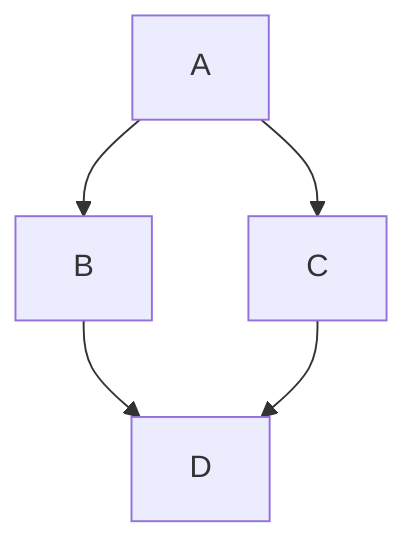
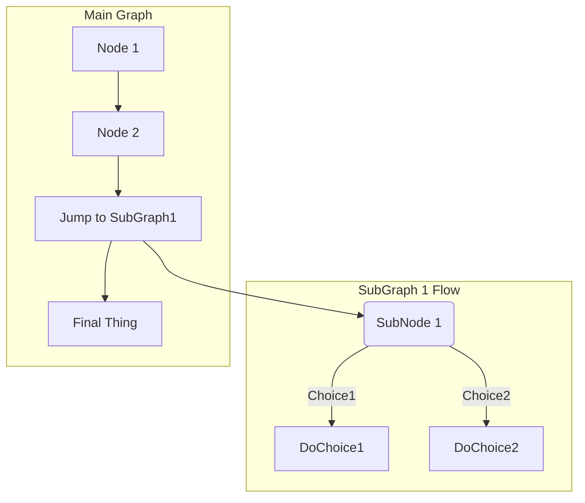



- 계층:  Free, Premium, Ultimate
- 제공:  GitLab.com, GitLab Self-Managed, GitLab Dedicated



GitLab Flavored Markdown (GLFM)은 GitLab 사용자 인터페이스에서 텍스트 형식을 지정하는 강력한 마크업 언어입니다. GLFM:

- 코드, 다이어그램, 수식, 멀티미디어를 지원하는 풍부한 콘텐츠를 만듭니다.
- 이슈, 머지 리퀘스트, 기타 GitLab 콘텐츠를 상호 참조로 연결합니다.
- 작업 목록, 테이블 및 축소 가능한 섹션으로 정보를 구성합니다.
- 100개 이상의 프로그래밍 언어에 대한 구문 강조 지원합니다.
- 의미 있는 제목 구조와 이미지 설명으로 접근성을 보장합니다.

GitLab UI에 텍스트를 입력하면 GitLab은 텍스트가 GitLab Flavored Markdown 형식이라고 가정합니다.

다음 위치에서 GitLab Flavored Markdown을 사용할 수 있습니다:

- 댓글
- 이슈
- 에픽
- 머지 리퀘스트
- 마일스톤
- 스니펫 (스니펫은 `.md` 확장자로 명명되어야 함)
- 위키 페이지
- 리포지토리 내 마크다운 문서
- 릴리스

GitLab에서 다른 서식 있는 텍스트 파일도 사용할 수 있습니다. 그렇게 하려면 종속성을 설치해야 할 수도 있습니다. 자세한 내용은 [`gitlab-markup` gem 프로젝트](https://gitlab.com/gitlab-org/gitlab-markup)를 참조하세요.

> [!note]
> 이 마크다운 사양은 GitLab에만 유효합니다. 저희는 마크다운을 충실하게 렌더링하기 위해 최선을 다하지만, [GitLab 문서 웹사이트](https://docs.gitlab.com) 및 [GitLab 핸드북](https://handbook.gitlab.com)에서는 다른 마크다운 렌더러를 사용합니다.

GitLab에서 이러한 예제를 렌더링하는 방법의 정확한 예를 보려면:

1. 관련 원본 마크다운 예제 (렌더링된 버전이 아님)를 복사합니다.
1. 마크다운을 GitLab의 어딘가에 붙여 넣습니다. 예를 들어 이슈 또는 머지 리퀘스트 댓글이나 설명, 또는 새 마크다운 파일에서 마크다운 미리보기를 지원합니다.
1. **미리보기**를 선택하여 GitLab에서 렌더링된 마크다운을 봅니다.

## 표준 마크다운과의 차이점 {#differences-with-standard-markdown}

<!--
Use this topic to list features that are not present in standard Markdown.
Don't repeat this information in each individual topic, unless there's a specific
reason, like in "Newlines".
-->

GitLab Flavored Markdown은 다음으로 구성됩니다:

- [CommonMark 사양](https://spec.commonmark.org/current/)을 기반으로 하는 핵심 마크다운 기능입니다.
- [GitHub Flavored Markdown](https://github.github.com/gfm/)의 확장 기능입니다.
- GitLab을 위해 특별히 만들어진 확장 기능입니다.

모든 표준 마크다운 형식은 GitLab에서 예상대로 작동합니다. 일부 표준 기능은 표준 사용을 영향을 주지 않으면서 추가 기능으로 확장됩니다.

다음 기능은 표준 마크다운에서 찾을 수 없습니다:

- [경고](#alerts)
- [`HEX`, `RGB` 또는 `HSL`로 작성된 색상 칩](#colors)
- [설명 목록](#description-lists)
- [다이어그램 및 순서도](#diagrams-and-flowcharts)
- [이모지](#emoji)
- [각주](#footnotes)
- [전면 사항](#front-matter)
- [GitLab 특정 참조](#gitlab-specific-references) (마크다운 스니펫 파일에서는 지원되지 않음)
- [포함](#includes)
- [자리 표시자](#placeholders)
- [인라인 diff](#inline-diff)
- [LaTeX로 작성된 수식 및 기호](#math-equations)
- [취소선](#emphasis)
- [목차](#table-of-contents)
- [테이블](#tables)
- [작업 목록](#task-lists)
- [위키 특정 마크다운](project/wiki/markdown.md)

다음 기능은 표준 마크다운에서 확장됩니다:

| 표준 마크다운                     | GitLab에서 확장된 마크다운 |
|---------------------------------------|-----------------------------|
| [인용문](#blockquotes)           | [여러 줄 인용문](#multiline-blockquote) |
| [코드 블록](#code-spans-and-blocks) | [색상이 있는 코드 및 구문 강조](#syntax-highlighting) |
| [제목](#headings)                 | [연결 가능한 제목 ID](#heading-ids-and-links) |
| [이미지](#images)                     | [내장 비디오](#videos) 및 [오디오](#audio) |
| [링크](#links)                       | [자동으로 URL 연결](#url-auto-linking) |

## 마크다운과 접근성 {#markdown-and-accessibility}

GitLab Flavored Markdown을 사용할 때 디지털 콘텐츠를 만들고 있습니다. 이 콘텐츠는 청중이 최대한 접근할 수 있도록 해야 합니다. 다음 목록은 완전하지 않지만, GitLab Flavored Markdown 스타일 중 특히 주의를 기울일 필요가 있는 것에 대한 지침을 제공합니다:

### 접근 가능한 제목 {#accessible-headings}

제목 형식을 사용하여 논리적 제목 구조를 만듭니다. 페이지의 제목 구조는 좋은 목차처럼 의미가 있어야 합니다. 페이지에 `h1` 요소가 하나만 있는지 확인하고, 제목 수준을 건너뛰지 않으며, 올바르게 중첩되어 있는지 확인합니다.

### 접근 가능한 테이블 {#accessible-tables}

테이블을 접근 가능하고 스캔 가능하게 유지하려면 테이블에 빈 셀이 없어야 합니다. 셀에 특별한 의미 있는 값이 없으면 **N/A**를 "해당 없음"으로 입력하거나 **없음**을 입력하는 것을 고려하세요.

### 접근 가능한 이미지 및 비디오 {#accessible-images-and-videos}

`[alt text]`에서 이미지 또는 비디오를 설명합니다. 설명을 정확하고 간결하며 고유하게 만듭니다. 설명에서 `image of` 또는 `video of`을 사용하지 마세요. 자세한 내용은 [WebAim Alternative Text](https://webaim.org/techniques/alttext/)를 참조하세요.

## 작업 항목 및 머지 리퀘스트 제목 {#work-item-and-merge-request-titles}



- 전체 GitLab Flavored Markdown 지원이 GitLab 18.0에서 [도입](https://gitlab.com/gitlab-org/gitlab/-/merge_requests/184070)되었습니다.
- 전체 GitLab Flavored Markdown 지원이 GitLab 18.11에서 [제거](https://gitlab.com/gitlab-org/gitlab/-/merge_requests/224839)되었습니다.



이슈, 머지 리퀘스트, 에픽 및 기타 작업 항목의 제목은 전체 GitLab Flavored Markdown을 지원하지 않습니다. 제목은 다음만 지원합니다:

- 이모지 (`:emoji:` 단축코드 및 사용자 지정 이모지).
- 자동 연결된 URL입니다.
- [GitLab 특정 참조](#gitlab-specific-references) (예: `#123`, `@user` 및 `!456`).

표준 마크다운 구문 (예: 굵게, 기울임꼴, 코드 스팬, 링크, 제목, 목록 및 기타 블록 수준 형식)은 제목에서 처리되지 않습니다. 예를 들어 제목 `` **Merge request title** ``은 굵게 표시되지 않으며 별표로 표시됩니다.

## 제목 {#headings}

`#`을 사용하여 1부터 6까지의 제목을 만듭니다.

```markdown
# H1
## H2
### H3
#### H4
##### H5
###### H6
```

또는 H1 및 H2의 경우 밑줄 스타일을 사용하세요:

```markdown
Alt-H1
======

Alt-H2
------
```

### 제목 ID 및 링크 {#heading-ids-and-links}



- 제목 링크 생성이 GitLab 17.0에서 [변경](https://gitlab.com/gitlab-org/gitlab/-/issues/440733)되었습니다.



마크다운으로 렌더링된 모든 제목은 자동으로 댓글을 제외하고 링크할 수 있는 ID를 가져옵니다.

마우스를 가져가면 해당 ID로의 링크가 표시되어 제목으로의 링크를 더 쉽게 복사할 수 있습니다.

ID는 다음 규칙에 따라 제목의 콘텐츠에서 생성됩니다:

1. 모든 텍스트가 소문자로 변환됩니다.
1. 모든 비단어 텍스트 (예: 구두점 또는 HTML)가 제거됩니다.
1. 모든 공간이 하이픈으로 변환됩니다.
1. 연속 두 개 이상의 하이픈이 하나로 변환됩니다.
1. 동일한 ID를 가진 제목이 이미 생성되었으면 고유한 증분 번호가 1부터 시작하여 추가됩니다.

예:

<!--
Translation note: DO NOT TRANSLATE this example. The example must stay untranslated
to stay in sync with the example link IDs.
-->

```markdown
# This heading has spaces in it
## This heading has a :thumbsup: in it
# This heading has Unicode in it: 한글
## This heading has spaces in it
### This heading has spaces in it
## This heading has 3.5 in it (and parentheses)
## This heading has multiple spaces and --- hyphens
```

다음 링크 ID를 생성합니다:

1. `this-heading-has-spaces-in-it`
1. `this-heading-has-a-thumbsup-in-it`
1. `this-heading-has-unicode-in-it-한글`
1. `this-heading-has-spaces-in-it-1`
1. `this-heading-has-spaces-in-it-2`
1. `this-heading-has-35-in-it-and-parentheses`
1. `this-heading-has--multiple-spaces-and-----hyphens`

## 줄 바꿈 {#line-breaks}

줄 바꿈이 삽입되거나 (새 단락이 시작됨) 이전 텍스트가 두 개의 줄 바꿈으로 끝나는 경우입니다. 예를 들어 <kbd>Enter</kbd> 키를 연속으로 두 번 누를 때입니다. 하나의 줄 바꿈만 사용하면 (<kbd>Enter</kbd> 키를 한 번 누르면) 다음 문장이 동일한 단락의 일부로 남아 있습니다. 긴 줄이 줄 바꿈되지 않도록 하려고 하면 이 방법을 사용하세요:

```markdown
시작할 줄이 있습니다.

이 더 긴 줄은 위의 줄과 두 개의 줄 바꿈으로 분리되어 있으므로 *별도 단락*입니다.

이 줄도 별도 단락이지만...
이 줄들은 단일 줄 바꿈으로만 분리되어 있습니다,
따라서 *줄 바꿈되지 않으며* 이전 줄을 따릅니다
*같은 단락*에서.
```

렌더링하면 예제는 다음과 비슷해 보입니다:

> 시작할 줄이 있습니다.
>
> 이 더 긴 줄은 위의 줄과 두 개의 줄 바꿈으로 분리되어 있으므로 *별도 단락*입니다.
>
> 이 줄도 별도 단락이지만... 이 줄들은 단일 줄 바꿈으로만 분리되어 있으므로 *줄 바꿈되지 않으며* 이전 줄을 따라 *같은 단락*에서.

### 줄 바꿈 {#newlines}

단락은 하나 이상의 연속 텍스트 줄이며, 하나 이상의 빈 줄 (첫 번째 단락의 끝에 두 개의 줄 바꿈)로 분리되어 있습니다. 자세한 내용은 [줄 바꿈](#line-breaks)을 참조하세요.

줄 바꿈 또는 소프트 리턴에 대해 더 많은 제어가 필요하십니까? 줄 끝에 백슬래시 또는 두 개 이상의 공백을 추가하여 단일 줄 바꿈을 추가합니다. 한 줄에 두 개의 줄 바꿈은 새 단락을 만들고 그 사이에 빈 줄이 있습니다:

```markdown
첫 번째 단락입니다.
같은 단락의 다른 줄입니다.
같은 단락의 세 번째 줄이지만 이번에는 두 공백으로 끝납니다.<space><space>
첫 번째 단락 바로 아래의 새 줄입니다.

두 번째 단락입니다.
다른 줄이지만 이번에는 백슬래시로 끝납니다.\
이전 백슬래시로 인한 새 줄입니다.
```

렌더링하면 예제는 다음과 비슷해 보입니다:

> 첫 번째 단락입니다. 같은 단락의 다른 줄입니다. 같은 단락의 세 번째 줄이지만 이번에는 두 공백으로 끝납니다.<br>
> 첫 번째 단락 바로 아래의 새 줄입니다.
>
> 두 번째 단락입니다. 다른 줄이지만 이번에는 백슬래시로 끝납니다.\
> 이전 백슬래시로 인한 새 줄입니다.

이 구문은 [단락 및 줄 바꿈](https://spec.commonmark.org/current/) 처리를 위한 마크다운 사양을 준수합니다.

## 강조 {#emphasis}

여러 방법으로 텍스트를 강조할 수 있습니다. 기울임꼴, 굵게, 취소선을 사용하거나 이러한 강조 스타일을 함께 결합합니다.

예:

```markdown
강조 또는 기울임꼴은 *별표* 또는 _밑줄_을 사용합니다.

강한 강조 또는 굵은 글자는 이중 **별표** 또는 __밑줄__을 사용합니다.

**별표와 _밑줄_**을 결합한 강조입니다.

이중 물결표를 사용한 취소선입니다. ~~이를 지우세요.~~
```

렌더링하면 예제는 다음과 비슷해 보입니다:

> 강조 또는 기울임꼴은 *별표* 또는 _밑줄_을 사용합니다.
>
> 강한 강조 또는 굵은 글자는 이중 **asterisks** 또는 **underscores**을 사용합니다.
>
> **별표와 _밑줄_**을 결합한 강조입니다.
>
> 이중 물결표를 사용한 취소선입니다. ~~이를 지우세요.~~

### 중간 단어 강조 {#mid-word-emphasis}

특히 여러 밑줄이 나타나는 코드 및 이름을 다룰 때 단어의 일부를 기울이는 것을 피하세요.

GitLab Flavored Markdown은 단어의 여러 밑줄을 무시하여 마크다운 문서의 코드를 더 잘 렌더링할 수 있습니다:

<!--
Translation note: DO NOT TRANSLATE these examples or the rendered versions.
The mid-word emphasis examples do not work in all languages and must stay in English to render correctly.
-->

```markdown
perform_complicated_task

do_this_and_do_that_and_another_thing

but_emphasis is_desired _here_
```

렌더링하면 예제는 다음과 비슷해 보입니다:

<!-- vale gitlab_base.Spelling = NO -->

> perform_complicated_task
>
> do_this_and_do_that_and_another_thing
>
> but_emphasis is_desired _here_

<!-- vale gitlab_base.Spelling = YES -->

단어의 일부만 강조하려면 여전히 별표로 수행할 수 있습니다:

```markdown
perform*complicated*task

do*this*and*do*that*and*another thing
```

렌더링하면 예제는 다음과 비슷해 보입니다:

> perform*complicated*task
>
> do*this*and*do*that*and*another thing

### 인라인 diff {#inline-diff}

인라인 diff 태그를 사용하여 `{+ additions +}` 또는 `[- deletions -]`을 표시할 수 있습니다.

래핑 태그는 중괄호 또는 대괄호일 수 있습니다:

<!--
Translation note: DO NOT TRANSLATE this example. The example must stay untranslated
to stay in sync with the image.
-->

```markdown
- {+ 추가 1 +}
- [+ 추가 2 +]
- {- 삭제 3 -}
- [- 삭제 4 -]
```


---

하지만 래핑 태그를 혼합할 수 없습니다:

```markdown
- {+ 추가 +]
- [+ 추가 +}
- {- 삭제 -]
- [- 삭제 -}
```

Diff 강조는 `` `inline code` ``에서 작동하지 않습니다. 텍스트에 백틱 (`` ` ``)이 포함된 경우 각 백틱을 백슬래시 ` \ `로 [이스케이프](#escape-characters)합니다:

<!--
Translation note: DO NOT TRANSLATE this example. The example must stay untranslated
to stay in sync with the image.
-->

```markdown
- {+ 정상 텍스트 +}
- {+ 안에 `백틱`이 있는 텍스트 +}
- {+ 안에 이스케이프 \`백틱\`이 있는 텍스트 +}
```


### 가로 줄 {#horizontal-rule}

3개 이상의 하이픈, 별표 또는 밑줄을 사용하여 가로 줄을 만듭니다:

```markdown
---

***

___
```

렌더링하면 모든 가로 줄은 다음과 비슷해 보입니다:

---

## 목록 {#lists}

정렬된 목록과 정렬되지 않은 목록을 만들 수 있습니다.

정렬된 목록의 경우 목록을 시작할 번호 (예: `1.`)를 추가한 다음 각 줄의 시작 부분에 공백을 추가합니다. 첫 번째 번호 이후에는 사용하는 번호가 중요하지 않습니다. 정렬된 목록은 세로 순서로 자동으로 번호가 매겨지므로 같은 목록의 모든 항목에 대해 `1.`를 반복하는 것이 일반적입니다. `1.`이 아닌 숫자로 시작하면 해당 번호를 첫 번째 번호로 사용하고 거기서 계산합니다.

예:

```markdown
1. 첫 번째 정렬된 목록 항목
2. 다른 항목
   - 정렬되지 않은 부분 목록입니다.
1. 실제 번호는 중요하지 않으며, 숫자일 뿐입니다
   1. 정렬된 부분 목록
   1. 다음 정렬된 부분 목록 항목
4. 그리고 다른 항목입니다.
```

<!--
The "2." and "4." in the previous example are changed to "1." in the following example,
to match the style standards on <https://docs.gitlab.com>.
See <https://docs.gitlab.com/development/documentation/styleguide/#lists>.
-->

렌더링하면 예제는 다음과 비슷해 보입니다:

> 1. 첫 번째 정렬된 목록 항목
> 1. 다른 항목
>    - 정렬되지 않은 부분 목록입니다.
> 1. 실제 번호는 중요하지 않으며, 숫자일 뿐입니다
>    1. 정렬된 부분 목록
>    1. 다음 정렬된 부분 목록 항목
> 1. 그리고 다른 항목입니다.

정렬되지 않은 목록의 경우 `-`, `*` 또는 `+`을 추가한 다음 각 줄의 시작 부분에 공백을 추가합니다. 같은 목록에서 문자를 혼합하지 마세요.

```markdown
정렬되지 않은 목록은 다음을 할 수 있습니다: 

- 사용
- 마이너스

또한 다음을 할 수 있습니다: 

* 사용
* 별표

또한 다음과 같이도 할 수 있습니다: 

+ 사용
+ 플러스
```

<!--
The "*" and "+" in the previous example are changed to "-" in the following example,
to match the style standards on <https://docs.gitlab.com>.
See <https://docs.gitlab.com/development/documentation/styleguide/#lists>.
-->

렌더링하면 예제는 다음과 비슷해 보입니다:

> 정렬되지 않은 목록은 다음을 할 수 있습니다: 
>
> - 사용
> - 마이너스
>
> 또한 다음을 할 수 있습니다: 
>
> - 사용
> - 별표
>
> 또한 다음과 같이도 할 수 있습니다: 
>
> - 사용
> - 플러스

---

목록 항목에 여러 단락이 포함된 경우 각 후속 단락을 목록 항목 텍스트의 시작과 동일한 수준으로 들여쓰기해야 합니다.

예:

```markdown
1. 첫 번째 정렬된 목록 항목

   첫 번째 항목의 두 번째 단락입니다.

1. 다른 항목
```

렌더링하면 예제는 다음과 비슷해 보입니다:

> 1. 첫 번째 정렬된 목록 항목
>
>    첫 번째 항목의 두 번째 단락입니다.
>
> 1. 다른 항목

첫 번째 항목의 단락이 올바른 공백 수로 들여쓰기되지 않으면 단락이 목록 외부에 나타납니다. 목록 항목 아래에 올바르게 들여쓰기하기 위해 올바른 공백 수를 사용합니다. 예를 들어:

```markdown
1. 첫 번째 정렬된 목록 항목

  (첫 번째 항목의 잘못된 정렬 단락입니다.)

1. 다른 항목
```

렌더링하면 예제는 다음과 비슷해 보입니다:

<!-- markdownlint-disable MD027 -->

> 1. 첫 번째 정렬된 목록 항목
>
>   (첫 번째 항목의 잘못된 정렬 단락입니다.)
>
> 1. 다른 항목

<!-- markdownlint-enable MD027 -->

---

정렬되지 않은 목록 항목의 첫 번째 부분 항목인 정렬된 목록은 `1.`로 시작하지 않으면 선행 빈 줄이 있어야 합니다.

예를 들어 빈 줄이 있으면:

```markdown
- 정렬되지 않은 목록 항목

  5. 첫 번째 정렬된 목록 항목
```

렌더링하면 예제는 다음과 비슷해 보입니다:

<!-- markdownlint-disable MD029 -->

> - 정렬되지 않은 목록 항목
>
>   5. 첫 번째 정렬된 목록 항목

<!-- markdownlint-disable MD029 -->

빈 줄이 없으면 두 번째 목록 항목이 첫 번째 항목의 일부로 렌더링됩니다:

```markdown
- 정렬되지 않은 목록 항목
  5. 첫 번째 정렬된 목록 항목
```

렌더링하면 예제는 다음과 비슷해 보입니다:

> - 정렬되지 않은 목록 항목
>   5. 첫 번째 정렬된 목록 항목

---

CommonMark은 정렬된 목록 항목과 정렬되지 않은 목록 항목 간의 빈 줄을 무시하고 단일 목록의 일부로 간주합니다. 항목이 [느슨한](https://spec.commonmark.org/0.30/#loose) 목록으로 렌더링됩니다. 각 목록 항목은 단락 태그로 묶여 있으므로 단락 간격 및 여백이 있습니다. 이로 인해 목록에 각 항목 간에 추가 간격이 있는 것처럼 보입니다.

예를 들어:

```markdown
- 첫 번째 목록 항목
- 두 번째 목록 항목

- 다른 목록
```

렌더링하면 예제는 다음과 비슷해 보입니다:

> - 첫 번째 목록 항목
> - 두 번째 목록 항목
>
> - 다른 목록

CommonMark은 빈 줄을 무시하고 단락 간격이 있는 하나의 목록으로 렌더링합니다.

### 설명 목록 {#description-lists}



- 설명 목록이 GitLab 17.7에서 [도입](https://gitlab.com/gitlab-org/gitlab/-/issues/26314)되었습니다.



설명 목록은 해당 설명이 있는 용어 목록입니다. 각 용어는 여러 설명을 가질 수 있습니다. HTML에서는 `<dl>`, `<dt>` 및 `<dd>` 태그로 표시됩니다.

설명 목록을 만들려면 한 줄에 용어를 배치하고 다음 줄에 콜론으로 시작하는 설명을 배치합니다.

```markdown
과일
: 사과
: 오렌지

야채
: 브로콜리
: 케일
: 시금치
```

용어와 설명 사이에 빈 줄을 가질 수도 있습니다.

```markdown
과일

: 사과

: 오렌지
```

> [!note]
> 서식 있는 텍스트 편집기는 새로운 설명 목록 삽입을 지원하지 않습니다. 새로운 설명 목록을 삽입하려면 일반 텍스트 편집기를 사용하세요. 자세한 내용은 [이슈 535956](https://gitlab.com/gitlab-org/gitlab/-/issues/535956)을 참조하세요.

### 작업 목록 {#task-lists}

마크다운이 지원되는 곳 어디든 작업 목록을 추가할 수 있습니다.

- 이슈, 머지 리퀘스트, 에픽 및 댓글에서는 상자를 선택할 수 있습니다.
- 다른 모든 위치에서는 상자를 선택할 수 없습니다. 괄호에 `x`을 추가하거나 제거하여 마크다운을 수동으로 편집해야 합니다.

완료 및 미완료 외에 작업도 **inapplicable**할 수 있습니다. 이슈, 머지 리퀘스트, 에픽 또는 댓글에서 적용 불가 체크박스를 선택해도 아무 영향이 없습니다.

작업 목록을 만들려면 정렬된 목록 또는 정렬되지 않은 목록의 형식을 따릅니다:

<!--
Translation note: DO NOT TRANSLATE this example. The example must stay untranslated
to stay in sync with the image.
-->

```markdown
- [x] 완료된 작업
- [~] 적용 불가 작업
- [ ] 미완료 작업
  - [x] 부분 작업 1
  - [~] 부분 작업 2
  - [ ] 부분 작업 3

1. [x] 완료된 작업
1. [~] 적용 불가 작업
1. [ ] 미완료 작업
   1. [x] 부분 작업 1
   1. [~] 부분 작업 2
   1. [ ] 부분 작업 3
```


[테이블 셀](#task-lists-in-tables)에 작업 목록을 추가할 수도 있습니다.

## 링크 {#links}

여러 방법으로 링크를 만들 수 있습니다:

```markdown
- 이 줄은 [인라인 스타일 링크](https://www.google.com)를 보여줍니다
- 이 줄은 [같은 디렉토리의 리포지토리 파일로의 링크](permissions.md)를 보여줍니다
- 이 줄은 [한 디렉토리 위의 파일로의 상대 링크](../_index.md)를 보여줍니다
- 이 줄은 [제목 텍스트도 있는 링크](https://www.google.com "이 링크는 Google로 이동합니다!")를 보여줍니다
```

렌더링하면 예제는 다음과 비슷해 보입니다:

> - 이 줄은 [인라인 스타일 링크](https://www.google.com)를 보여줍니다
> - 이 줄은 [같은 디렉토리의 리포지토리 파일로의 링크](permissions.md)를 보여줍니다
> - 이 줄은 [한 디렉토리 위의 파일로의 상대 링크](../_index.md)를 보여줍니다
> - 이 줄은 [제목 텍스트도 있는 링크](https://www.google.com "이 링크는 Google로 이동합니다!")를 보여줍니다

위키 페이지에서 프로젝트 파일을 참조하거나 프로젝트 파일에서 위키 페이지를 참조하는 상대 링크를 사용할 수 없습니다. 이 제한은 위키가 항상 GitLab의 별도 Git 리포지토리에 있기 때문입니다. 예를 들어 `[I'm a reference-style link](style)`는 링크가 위키 마크다운 파일 내부에 있을 때만 `wikis/style`을 가리킵니다. 자세한 내용은 [위키 특정 마크다운](project/wiki/markdown.md)을 참조하세요.

제목 ID 앵커를 사용하여 페이지의 특정 섹션으로 링크합니다:

```markdown
- 이 줄은 [다른 마크다운 페이지의 섹션으로 `#` 및 제목 ID를 사용하여 링크](permissions.md#project-permissions)합니다
- 이 줄은 [같은 페이지의 다른 섹션으로 `#` 및 제목 ID를 사용하여 링크](#heading-ids-and-links)합니다
```

렌더링하면 예제는 다음과 비슷해 보입니다:

> - 이 줄은 [다른 마크다운 페이지의 섹션으로 `#` 및 제목 ID를 사용하여 링크](permissions.md#project-permissions)합니다
> - 이 줄은 [같은 페이지의 다른 섹션으로 `#` 및 제목 ID를 사용하여 링크](#heading-ids-and-links)합니다

링크 참조 사용:

<!--
The following codeblock uses extra spaces to avoid the Vale ReferenceLinks test.
Do not remove the two-space nesting.
-->

  ```markdown
  - 이 줄은 [참조 스타일 링크를 보여줍니다. 아래를 참조하세요.][임의의 대소문자 구분 안 함 참조 텍스트]
  - [참조 스타일 링크 정의에 숫자를 사용할 수 있습니다. 아래를 참조하세요.][1]
  - 또는 비워 두고 [링크 텍스트 자체][]를 사용하세요. 아래를 참조하세요.

  참조 링크를 나중에 따를 수 있음을 보여주는 일부 텍스트입니다.

  [임의의 대소문자 구분 안 함 참조 텍스트]: https://www.mozilla.org/en-US/
  [1]: https://slashdot.org
  [링크 텍스트 자체]: https://about.gitlab.com/
  ```

<!--
The example below uses in-line links to pass the Vale ReferenceLinks test.
Do not change to reference style links.
-->

렌더링하면 예제는 다음과 비슷해 보입니다:

> - 이 줄은 [참조 스타일 링크를 보여줍니다. 아래를 참조하세요.](https://www.mozilla.org/en-US/)
> - [참조 스타일 링크 정의에 숫자를 사용할 수 있습니다. 아래를 참조하세요.](https://slashdot.org)
> - 또는 비워 두고 [링크 텍스트 자체](https://about.gitlab.com/)를 사용하세요. 아래를 참조하세요.
>
> 참조 링크를 나중에 따를 수 있음을 보여주는 일부 텍스트입니다.

### URL 자동 연결 {#url-auto-linking}

텍스트에 넣는 거의 모든 URL이 자동으로 연결됩니다:

```markdown
- https://www.google.com
- https://www.google.com
- ftp://ftp.us.debian.org/debian/
- smb://foo/bar/baz
- irc://irc.freenode.net/
- http://localhost:3000
```

렌더링하면 예제는 다음과 비슷해 보입니다:

> - <https://www.google.com>
> - <https://www.google.com>
> - <ftp://ftp.us.debian.org/debian/>
> - <a href="smb://foo/bar/baz/">smb://foo/bar/baz</a>
> - <a href="irc://irc.freenode.net">irc://irc.freenode.net</a>
> - <http://localhost:3000>

## GitLab 특정 참조 {#gitlab-specific-references}



- 위키 페이지 자동 완성이 GitLab 16.11에서 [도입](https://gitlab.com/gitlab-org/gitlab/-/issues/442229)되었습니다.
- 그룹에서 레이블 참조 옵션이 GitLab 17.1에서 [도입](https://gitlab.com/gitlab-org/gitlab/-/issues/455120)되었습니다.
- 이슈, 에픽 및 작업 항목을 `[work_item:123]` 구문으로 참조하는 옵션:
  - GitLab 18.1에서 [도입](https://gitlab.com/gitlab-org/gitlab/-/issues/352861) 되었으며 [플래그](../administration/feature_flags/_index.md) `extensible_reference_filters`(으)로 명명됩니다. 기본적으로 비활성화됨.
  - GitLab 18.2에서 [일반 공급 가능](https://gitlab.com/gitlab-org/gitlab/-/merge_requests/197052)합니다. 기능 플래그 `extensible_reference_filters`가 제거되었습니다.
- 에픽을 `[epic:123]` 구문으로 참조하는 옵션이 GitLab 18.4에서 [도입](https://gitlab.com/gitlab-org/gitlab/-/issues/352864)되었습니다.



GitLab Flavored Markdown은 GitLab 특정 참조를 렌더링합니다. 예를 들어 이슈, 커밋, 팀 구성원 또는 전체 프로젝트 팀을 참조할 수 있습니다. GitLab Flavored Markdown은 해당 참조를 링크로 변환하여 이들 사이를 탐색할 수 있습니다. 프로젝트에 대한 모든 참조는 프로젝트 이름이 아닌 **project slug**를 사용해야 합니다.

또한 GitLab Flavored Markdown은 특정 교차 프로젝트 참조를 인식하고 같은 네임스페이스에서 다른 프로젝트를 참조하기 위한 약식 버전도 있습니다.

> [!note]
> GitLab 특정 참조는 마크다운 스니펫 파일에서 지원되지 않습니다.

GitLab Flavored Markdown은 다음을 인식합니다:

| 참조                                                                           | 입력                                                 | 교차 프로젝트 참조                        | 같은 네임스페이스 내의 단축키 |
|--------------------------------------------------------------------------------------|-------------------------------------------------------|------------------------------------------------|------------------------------------|
| 특정 사용자                                                                        | `@user_name`                                          |                                                |                                    |
| 특정 그룹                                                                       | `@group_name`                                         |                                                |                                    |
| 전체 팀                                                                          | [`@all`](discussions/_index.md#mentioning-all-members) |                                               |                                    |
| 프로젝트                                                                              | `namespace/project>`                                  |                                                |                                    |
| 이슈                                                                                | ``#123``, `GL-123` 또는 `[issue:123]`                  | `namespace/project#123` 또는 `[issue:namespace/project/123]` | `project#123` 또는 `[issue:project/123]` |
| [작업 항목](work_items/_index.md)                                                    | `[work_item:123]`                                     | `[work_item:namespace/project/123]`            | `[work_item:project/123]`          |
| 머지 리퀘스트                                                                        | `!123`                                                | `namespace/project!123`                        | `project!123`                      |
| 스니펫                                                                              | `$123`                                                | `namespace/project$123`                        | `project$123`                      |
| [에픽](group/epics/_index.md)                                                        | `#123`, `&123`, `[work_item:123]` 또는 `[epic:123]`    | `group1/subgroup#123`, `group1/subgroup&123`, `[work_item:group1/subgroup/123]` 또는 `[epic:group1/subgroup/123]` |  |
| [반복](group/iterations/_index.md)                                              | `*iteration:"iteration title"`                        |                                                |                                    |
| [반복 주기](group/iterations/_index.md) ID별<sup>1</sup>                    | `[cadence:123]`                                       |                                                |                                    |
| [반복 주기](group/iterations/_index.md) (한 단어) 제목별<sup>1</sup>      | `[cadence:plan]`                                      |                                                |                                    |
| [반복 주기](group/iterations/_index.md) (여러 단어) 제목별<sup>1</sup> | `[cadence:"plan a"]`                                 |                                                |                                    |
| [취약성](application_security/vulnerabilities/_index.md)                       | `[vulnerability:123]`                                | `[vulnerability:namespace/project/123]`        | `[vulnerability:project/123]`      |
| 기능 플래그                                                                         | `[feature_flag:123]`                                  | `[feature_flag:namespace/project/123]`         | `[feature_flag:project/123]`       |
| ID별 레이블 <sup>2</sup>                                                             | `~123`                                                | `namespace/project~123`                        | `project~123`                      |
| (한 단어) 이름별 레이블 <sup>2</sup>                                                | `~bug`                                                | `namespace/project~bug`                        | `project~bug`                      |
| (여러 단어) 이름별 레이블 <sup>2</sup>                                          | `~"feature request"`                                  | `namespace/project~"feature request"`          | `project~"feature request"`        |
| (범위가 지정된) 레이블 <sup>2</sup>                                                  | `~"priority::high"`                                   | `namespace/project~"priority::high"`           | `project~"priority::high"`         |
| ID별 프로젝트 마일스톤 <sup>2</sup>                                                 | `%123`                                                | `namespace/project%123`                        | `project%123`                      |
| (한 단어) 이름별 마일스톤 <sup>2</sup>                                            | `%v1.23`                                              | `namespace/project%v1.23`                      | `project%v1.23`                    |
| (여러 단어) 이름별 마일스톤 <sup>2</sup>                                      | `%"release candidate"`                                | `namespace/project%"release candidate"`        | `project%"release candidate"`      |
| 커밋 (특정)                                                                    | `9ba12248`                                            | `namespace/project@9ba12248`                   | `project@9ba12248`                 |
| 커밋 범위 비교                                                              | `9ba12248...b19a04f5`                                 | `namespace/project@9ba12248...b19a04f5`        | `project@9ba12248...b19a04f5`      |
| 리포지토리 파일 참조                                                            | `[README](doc/README.md)`                             |                                                |                                    |
| 리포지토리 파일 참조 (특정 줄)                                            | `[README](doc/README.md#L13)`                         |                                                |                                    |
| [경고](../operations/incident_management/alerts.md)                                 | `^alert#123`                                          | `namespace/project^alert#123`                  | `project^alert#123`                |
| [연락처](crm/_index.md#contacts)                                                    | `[contact:test@example.com]`                          |                                                |                                    |
| [위키 페이지](project/wiki/_index.md) (페이지 슬러그가 제목과 동일한 경우)      | `[[Home]]` 또는 `[wiki_page:Home]`                      | `[wiki_page:namespace/project:Home]` 또는 `[wiki_page:group1/subgroup:Home]` |        |
| [위키 페이지](project/wiki/_index.md) (페이지 슬러그가 제목과 다른 경우)   | `[[How to use GitLab\|how-to-use-gitlab]]`            |                                                |                                    |

**각주**:

1. GitLab 16.9에서 [도입](https://gitlab.com/gitlab-org/gitlab/-/issues/384885)되었습니다. 반복 주기 참조는 항상 `[cadence:<ID>]` 형식을 따라 렌더링됩니다. 예를 들어 텍스트 참조 `[cadence:"plan"]`는 참조된 반복 주기의 ID가 `1`인 경우 `[cadence:1]`로 렌더링됩니다.
1. 레이블 또는 마일스톤의 경우 `namespace/project` 앞에 `/`을 추가하여 정확한 레이블 또는 마일스톤을 지정하고 모든 가능한 모호성을 제거합니다.

예를 들어 `#123`을 사용하여 이슈 참조는 이슈 번호 123으로의 링크를 `#123` 텍스트로 형식화합니다. 마찬가지로 이슈 번호 123으로의 링크는 인식되고 `#123` 텍스트로 형식화됩니다. 이슈에 연결하지 않으려면 `#123` 앞에 백슬래시 `\#123`을 추가하세요.

이 외에도 일부 개체로의 링크는 인식되고 형식화되기도 합니다. 예를 들어:

- 이슈에 대한 댓글: `"https://gitlab.com/gitlab-org/gitlab/-/issues/1234#note_101075757"`, 렌더링은 `#1234 (comment 101075757)`
- 이슈 디자인 탭: `"https://gitlab.com/gitlab-org/gitlab/-/issues/1234/designs"`, 렌더링은 `#1234 (designs)`입니다.
- 개별 디자인에 대한 링크: `"https://gitlab.com/gitlab-org/gitlab/-/issues/1234/designs/layout.png"`, 렌더링은 `#1234[layout.png]`입니다.

### 항목 제목 표시 {#show-item-title}



- 작업 항목 (작업, 목표 및 핵심 결과)에 대한 지원이 GitLab 16.0에서 [도입](https://gitlab.com/gitlab-org/gitlab/-/issues/390854)되었습니다.
- 에픽에 대한 지원이 GitLab 17.7에서 도입되었으며 `work_item_epics`라는 플래그가 기본적으로 활성화되어 있습니다.
- 에픽이 GitLab 18.1에서 일반 공급 가능합니다. 기능 플래그 `work_item_epics`가 제거되었습니다.



이슈, 작업, 목표, 핵심 결과, 머지 리퀘스트 또는 에픽의 렌더링된 링크에 제목을 포함시키려면:

- 참조의 끝에 더하기 (`+`)를 추가합니다.

예를 들어 `#123+`과 같은 참조는 `The issue title (#123)`로 렌더링됩니다.

`https://gitlab.com/gitlab-org/gitlab/-/issues/1234+`과 같은 URL 참조도 확장됩니다.

### 항목 요약 표시 {#show-item-summary}



- 작업 항목 (작업, 목표 및 핵심 결과)에 대한 지원이 GitLab 16.0에서 [도입](https://gitlab.com/gitlab-org/gitlab/-/issues/390854)되었습니다.
- 에픽에 대한 지원이 GitLab 17.7에서 도입되었으며 `work_item_epics`라는 플래그가 기본적으로 활성화되어 있습니다.
- 에픽이 GitLab 18.1에서 일반 공급 가능합니다. 기능 플래그 `work_item_epics`가 제거되었습니다.



에픽, 이슈, 작업, 목표, 핵심 결과 또는 머지 리퀘스트의 렌더링된 링크에 확장된 요약을 포함시키려면:

- 참조의 끝에 `+s`을 추가합니다.

요약에는 작업 항목 유형별로 해당하는 대로 참조된 항목의 **assignees**, **마일스톤** 및 **health status** 정보가 포함됩니다.

예를 들어 `#123+s`과 같은 참조는 `The issue title (#123) • First Assignee, Second Assignee+ • v15.10 • Needs attention`로 렌더링됩니다.

`https://gitlab.com/gitlab-org/gitlab/-/issues/1234+s`과 같은 URL 참조도 확장됩니다.

담당자, 마일스톤 또는 상태가 변경된 경우 렌더링된 참조를 업데이트하려면:

- 페이지를 새로 고칩니다.

### 호버에서 댓글 미리보기 {#comment-preview-on-hover}



- GitLab 17.3에서 [도입](https://gitlab.com/gitlab-org/gitlab/-/issues/29663) 되었으며 [플래그](../administration/feature_flags/_index.md) `comment_tooltips`라는 이름입니다. 기본적으로 비활성화됨.
- 기능 플래그는 GitLab 17.6에서 제거되었습니다



댓글로의 링크 위에 마우스를 가져가면 작성자와 댓글의 첫 줄이 표시됩니다.

### Observability 대시보드 포함 {#embed-observability-dashboards}

GitLab Observability UI 대시보드 설명 및 댓글을 포함할 수 있습니다. 예를 들어 에픽, 이슈 및 MR에서.

Observability 대시보드 URL을 포함시키려면:

1. GitLab Observability UI에서 주소 표시줄의 URL을 복사합니다.
1. 댓글 또는 설명에 링크를 붙여넣습니다. GitLab Flavored Markdown은 URL을 인식하고 소스를 표시합니다.

## 테이블 {#tables}

테이블을 만들 때:

- 첫 번째 줄에는 파이프 문자 (`|`)로 구분된 헤더가 포함됩니다.
- 두 번째 줄은 헤더를 셀과 분리합니다.
  - 셀에는 빈 공간, 하이픈 및 (선택적으로) 가로 정렬용 콜론만 포함될 수 있습니다.
  - 각 셀에는 최소한 하나의 하이픈이 포함되어야 하지만 셀에 더 많은 하이픈을 추가해도 셀의 렌더링이 변경되지 않습니다.
  - 하이픈, 공백 또는 콜론 이외의 모든 콘텐츠는 허용되지 않습니다.
- 세 번째 줄과 그 이후의 모든 줄에는 셀 값이 포함됩니다.
  - 마크다운에서 셀을 여러 줄로 구분할 **can't**, 한 줄로 유지해야 하지만 매우 길 수 있습니다. `<br>` 태그를 사용하여 필요한 경우 줄 바꿈을 강제할 수도 있습니다.
  - 셀 크기가 **don't**. 유연하지만 파이프 기호(`|`)로 구분해야 합니다.
  - 빈 셀을 **가능**.
- 열 너비는 셀의 콘텐츠를 기반으로 동적으로 계산됩니다.
- 파이프 문자(`|`)를 표 구분 기호가 아닌 텍스트로 사용하려면 백슬래시(`\|`)로 [이스케이프](#escape-characters)해야 합니다.

예:

```markdown
| header 1 | header 2 | header 3 |
| --- | ------ | -------- |
| cell 1 | cell 2 | cell 3 |
| cell 4 | cell 5 is longer | cell 6 is much longer than the others, but that's ok. It eventually wraps the text when the cell is too large for the display size. |
| cell 7 | | cell 9 |
```

렌더링하면 예제는 다음과 비슷해 보입니다:

> | header 1 | header 2 | header 3 |
> | ---      | ------   | -------- |
> | cell 1   | cell 2   | cell 3   |
> | cell 4 | cell 5 is longer | cell 6 is much longer than the others, but that's ok. It eventually wraps the text when the cell is too large for the display size. |
> | cell 7   |          | cell 9   |

### 정렬 {#alignment}

또한 콜론(`:`)을 두 번째 행의 "대시" 줄의 양쪽에 추가하여 열의 텍스트 정렬을 선택할 수 있습니다. 이는 열의 모든 셀에 영향을 줍니다:

```markdown
| Left Aligned | Centered | Right Aligned |
| :----------- | :------: | ------------: |
| Cell 1 | Cell 2 | Cell 3 |
| Cell 4 | Cell 5 | Cell 6 |
```

렌더링하면 예제는 다음과 비슷해 보입니다:

> | Left Aligned | Centered | Right Aligned |
> | :----------- | :------: | ------------: |
> | Cell 1       | Cell 2   | Cell 3        |
> | Cell 4       | Cell 5   | Cell 6        |

GitLab에서 표 헤더는 Chrome과 Firefox에서는 항상 왼쪽 정렬되고, Safari에서는 중앙 정렬됩니다. 자세한 내용은 [표](#tables)를 참조하세요.

### 여러 줄이 있는 셀 {#cells-with-multiple-lines}

HTML 형식을 사용하여 표의 렌더링을 조정할 수 있습니다. 예를 들어 `<br>` 태그를 사용하여 셀이 여러 줄을 가지도록 강제할 수 있습니다:

```markdown
| Name | Details |
| ----- | ------- |
| Item1 | This text is on one line |
| Item2 | This item has:- Multiple items- That we want listed separately |
```

렌더링하면 예제는 다음과 비슷해 보입니다:

> | Name  | Details |
> | ----- | ------- |
> | Item1 | This text is on one line |
> | Item2 | This item has:<br>\- Multiple items<br>\- That we want listed separately |

### 표의 작업 목록 {#task-lists-in-tables}



- 표 셀의 작업 항목에 대한 기본 마크다운 구문이 GitLab 18.9에서 [도입](https://gitlab.com/gitlab-org/gitlab/-/merge_requests/219037)되었습니다.



마크다운 표 셀에 작업 항목 체크박스를 추가할 수 있습니다. 체크박스는 셀의 유일한 콘텐츠여야 합니다:

```markdown
| Complete | Task |
| -------- | ----------------------- |
| [x] | Refactor the backend |
| [ ] | Refactor the frontend |
| [~] | Inapplicable task |
```

렌더링하면 예제는 다음과 비슷해 보입니다:


셀에 여러 작업 항목을 추가하거나 추가 텍스트가 있는 작업 항목을 추가하려면 HTML 표를 사용하고 셀에 마크다운을 포함하세요:

```html
table
thead
header 1header 2
</thead>
tbody
tr
<td>cell 1</td>
<td>cell 2</td>
</tr>
<tr>
<td>cell 3</td>
<td>

- [ ] Task one
- [ ] Task two

</td>
</tr>
</tbody>
</table>
```

[리치 텍스트 편집기에서 표를 생성](rich_text_editor.md#tables)하고 작업 목록을 삽입할 수도 있습니다.

### 스프레드시트에서 복사 및 붙여넣기 {#copy-and-paste-from-a-spreadsheet}

스프레드시트 소프트웨어(예: Microsoft Excel, Google Sheets 또는 Apple Numbers)에서 작업 중인 경우 스프레드시트에서 복사하여 붙여넣으면 GitLab이 마크다운 표를 생성합니다. 예를 들어 다음과 같은 스프레드시트가 있다고 가정하겠습니다:


셀을 선택하고 클립보드에 복사하세요. GitLab 마크다운 항목을 열고 스프레드시트를 붙여넣으세요:


### JSON 표 {#json-tables}



- 마크다운 렌더링이 GitLab 17.9에서 [도입](https://gitlab.com/gitlab-org/gitlab/-/issues/375177)되었습니다.



JSON 코드 블록으로 표를 렌더링하려면 다음 구문을 사용하세요:

````markdown
```json:table
{}
```
````

이 기능의 비디오 둘러보기를 보세요:

<div class="video-fallback">
  비디오 보기:  <a href="https://www.youtube.com/watch?v=12yWKw1AdKY">데모: 마크다운의 JSON 표</a>.
</div>
<figure class="video-container">
  <iframe src="https://www.youtube-nocookie.com/embed/12yWKw1AdKY" frameborder="0" allowfullscreen> </iframe>
</figure>

> [!note]
> 관리자는 마크다운에서 iframe 렌더링을 활성화하고 인스턴스에 대해 허용되는 iframe `src` 호스트를 구성할 수 있습니다. [애플리케이션 설정 API](../api/settings.md#available-settings)를 사용하여 이러한 설정을 관리할 수 있습니다:
>
> - `iframe_rendering_enabled`
> - `iframe_rendering_allowlist`
> - `iframe_rendering_allowlist_raw`.

`items` 속성은 데이터 포인트를 나타내는 개체의 목록입니다.

````markdown
```json:table
{
    "items" : [
      {"a":  "11", "b":  "22", "c":  "33"}
    ]
}
```
````

표 레이블을 지정하려면 `fields` 속성을 사용하세요.

````markdown
```json:table
{
    "fields" : ["a", "b", "c"],
    "items" : [
      {"a":  "11", "b":  "22", "c":  "33"}
    ]
}
```
````

`items`의 모든 요소가 `fields`의 해당 값을 가져야 하는 것은 아닙니다.

````markdown
```json:table
{
    "fields" : ["a", "b", "c"],
    "items" : [
      {"a":  "11", "b":  "22", "c":  "33"},
      {"a":  "211", "c":  "233"}
    ]
}
```
````

`fields`이 명시적으로 지정되지 않으면 `items`의 첫 번째 요소에서 레이블을 선택합니다.

````markdown
```json:table
{
    "items" : [
      {"a":  "11", "b":  "22", "c":  "33"},
      {"a":  "211", "c":  "233"}
    ]
}
```
````

`fields`에 대해 사용자 정의 레이블을 지정할 수 있습니다.

````markdown
```json:table
{
    "fields" : [
        {"key": "a", "label":  "AA"},
        {"key": "b", "label":  "BB"},
        {"key": "c", "label":  "CC"}
    ],
    "items" : [
      {"a":  "11", "b":  "22", "c":  "33"},
      {"a":  "211", "b":  "222", "c":  "233"}
    ]
}
```
````

`fields`의 개별 요소에 대해 정렬을 활성화할 수 있습니다.

````markdown
```json:table
{
    "fields" : [
        {"key": "a", "label":  "AA", "sortable": true},
        {"key": "b", "label":  "BB"},
        {"key": "c", "label":  "CC"}
    ],
    "items" : [
      {"a":  "11", "b":  "22", "c":  "33"},
      {"a":  "211", "b":  "222", "c":  "233"}
    ]
}
```
````

`filter` 속성을 사용하여 사용자 입력으로 동적으로 필터링된 콘텐츠가 있는 표를 렌더링할 수 있습니다.

````markdown
```json:table
{
    "fields" : [
        {"key": "a", "label":  "AA"},
        {"key": "b", "label":  "BB"},
        {"key": "c", "label":  "CC"}
    ],
    "items" : [
      {"a":  "11", "b":  "22", "c":  "33"},
      {"a":  "211", "b":  "222", "c":  "233"}
    ],
    "filter" : true
}
```
````

`markdown` 속성을 사용하여 항목 및 캡션에서 GitLab Flavored Markdown을 허용하고 GitLab 참조를 포함할 수 있습니다. 필드는 마크다운을 지원하지 않습니다.

````markdown
```json:table
{
    "fields" : [
        {"key": "a", "label":  "AA"},
        {"key": "b", "label":  "BB"},
        {"key": "c", "label":  "CC"}
    ],
    "items" : [
      {"a":  "11", "b": "**22**", "c":  "33"},
      {"a": "#1", "b":  "222", "c":  "233"}
    ],
    "markdown" : true
}
```
````

기본적으로 모든 JSON 표에는 `Generated with JSON data` 캡션이 있습니다. `caption` 속성을 지정하여 이 캡션을 재정의할 수 있습니다.

````markdown
```json:table
{
    "items" : [
      {"a":  "11", "b":  "22", "c":  "33"}
    ],
    "caption" :  "Custom caption"
}
```
````

JSON이 유효하지 않으면 오류가 발생합니다.

````markdown
```json:table
{
    "items" : [
      {"a":  "11", "b":  "22", "c":  "33"}
    ],
}
```
````

## 멀티미디어 {#multimedia}

이미지, 비디오 및 오디오를 삽입합니다. 마크다운 구문을 사용하여 멀티미디어를 추가하고 파일을 연결하고 크기를 설정하며 인라인으로 표시할 수 있습니다. 형식 지정 옵션을 사용하면 제목을 사용자 정의하고, 너비와 높이를 지정하며, 미디어가 렌더링된 출력에 표시되는 방식을 제어할 수 있습니다.

### 이미지 {#images}



- 이미지를 오버레이에서 열기가 GitLab 18.6에서 [도입](https://gitlab.com/gitlab-org/gitlab/-/issues/377398)되었습니다.
- 투명 체커보드 토글이 GitLab 18.10에서 [도입](https://gitlab.com/gitlab-org/gitlab/-/merge_requests/224872)되었습니다.



`!`를 앞에 붙인 인라인 또는 참조 [링크](#links)를 사용하여 이미지를 삽입합니다. 예를 들어:

<!--
DO NOT change the name of `markdown_logo_v17_11.png`. This file is used for a test in
spec/controllers/help_controller_spec.rb.
-->

```markdown

```

> 

이미지 링크에서:

- 대괄호(`[ ]`) 내의 텍스트는 이미지 대체 텍스트가 됩니다.
- 이미지 링크 경로 뒤의 큰따옴표 안의 텍스트는 제목 텍스트가 됩니다. 제목 텍스트를 보려면 이미지 위에 마우스를 올려놓으세요.

자세한 내용은 [접근 가능한 이미지 및 비디오](#accessible-images-and-videos)를 참조하세요.

이미지를 선택하면 오버레이에서 열립니다.

이미지에 투명한 영역이 있으면 이미지 위에 마우스를 올려놓고 **투명 체커보드 토글**을 선택하여 체커보드 배경을 표시합니다. 체커보드를 사용하면 투명한 영역이 모든 테마에 대해 보이게 됩니다. **투명 체커보드 토글**은 픽셀의 최소 5%가 어느 정도의 투명성을 가지는(완전히 불투명하지 않은) PNG, WebP 및 GIF 이미지에 나타납니다. 투명 픽셀이 5% 미만인 이미지는 토글을 표시하지 않습니다.

### 비디오 {#videos}

비디오 확장자를 가진 파일로 연결되는 이미지 태그는 자동으로 비디오 플레이어로 변환됩니다. 유효한 비디오 확장자는 `.mp4`, `.m4v`, `.mov`, `.webm`, 및 `.ogv`입니다:

비디오 예시:

```markdown

```

이 예시는 [GitLab에서 렌더링](https://gitlab.com/gitlab-org/gitlab/-/blob/master/doc/user/markdown.md#videos)될 때만 작동합니다:

> 

### 이미지 또는 비디오 크기 변경 {#change-image-or-video-dimensions}

이미지 또는 비디오 다음에 속성 목록을 추가하여 이미지 또는 비디오의 너비와 높이를 제어할 수 있습니다. 값은 `px`(기본값) 또는 `%`의 단위를 포함한 정수여야 합니다.

예를 들어

```markdown
{width=100 height=100px}

{width=75%}
```

이 예시는 [GitLab에서 렌더링](https://gitlab.com/gitlab-org/gitlab/-/blob/master/doc/user/markdown.md#change-image-or-video-dimensions)될 때만 작동합니다:

> {width=100 height=100px}

`img` HTML 태그를 마크다운 대신 사용하고 `height` 및 `width` 매개변수를 설정할 수도 있습니다.

마크다운 텍스트 상자에 고해상도 PNG 이미지를 붙여넣으면 [GitLab 17.1 이상에서](https://gitlab.com/gitlab-org/gitlab/-/issues/419913) 크기가 항상 추가됩니다. 크기는 망막(및 기타 고해상도) 디스플레이를 수용하도록 자동으로 조정됩니다. 예를 들어 144ppi 이미지는 크기의 50%로 조정되는 반면 96ppi 이미지는 크기의 75%로 조정됩니다.

선택한 경우 이미지는 100% 또는 창에 맞는 최대 크기로 조정된 오버레이에서 열립니다.

### 오디오 {#audio}

비디오와 유사하게 오디오 확장자를 가진 파일로 연결되는 링크 태그는 자동으로 오디오 플레이어로 변환됩니다. 유효한 오디오 확장자는 `.mp3`, `.oga`, `.ogg`, `.spx`, 및 `.wav`입니다:

오디오 클립 예시:

```markdown

```

이 예시는 [GitLab에서 렌더링](https://gitlab.com/gitlab-org/gitlab/-/blob/master/doc/user/markdown.md#audio)될 때만 작동합니다:

> 

## 인용문 {#blockquotes}

인용문을 사용하여 정보를 강조하거나 주의를 끌 수 있습니다. `>`으로 인용문 줄을 시작하면 생성됩니다:

```markdown
> 인용문은 회신 텍스트를 에뮬레이트하는 데 도움이 됩니다.
> 이 줄은 같은 인용문의 일부입니다.

인용문 중단.

> 이 매우 긴 줄은 줄 바꿈할 때도 올바르게 인용됩니다. 이 줄이 모든 사람을 위해 실제로 줄 바꿈할 수 있을 만큼 길다는 것을 확인하기 위해 계속 쓰세요. 인용문에서 *use* **Markdown**도 가능합니다.
```

렌더링하면 예제는 다음과 비슷해 보입니다:

> > 인용문은 회신 텍스트를 에뮬레이트하는 데 도움이 됩니다. 이 줄은 같은 인용문의 일부입니다.
>
> 인용문 중단.
>
> > 이 매우 긴 줄은 줄 바꿈할 때도 올바르게 인용됩니다. 이 줄이 모든 사람을 위해 실제로 줄 바꿈할 수 있을 만큼 길다는 것을 확인하기 위해 계속 쓰세요. 인용문에서 *사용*할 **Markdown**도 가능합니다.

### 여러 줄 인용문 {#multiline-blockquote}

`>>>`로 둘러싼 여러 줄 인용문을 생성합니다:

```markdown
>>>
다른 곳에서 메시지를 붙여넣으면

여러 줄에 걸쳐

모든 줄에 수동으로 `>`를 붙이지 않고도 인용할 수 있습니다!
>>>
```

> 다른 곳에서 메시지를 붙여넣으면
>
> 여러 줄에 걸쳐
>
> 모든 줄에 `>`를 수동으로 붙이지 않고도 인용할 수 있습니다!

## 코드 범위 및 블록 {#code-spans-and-blocks}

코드로 보아야 하는 모든 것을 강조합니다.

인라인 코드는 단일 백틱 `` ` ``로 형식이 지정됩니다:

```markdown
인라인 `code`에는 `back-ticks around`가 있습니다.
```

렌더링하면 예제는 다음과 비슷해 보입니다:

> 인라인 `code`에는 `back-ticks around`가 있습니다.

더 큰 코드 예시를 원하는 경우 코드 블록을 사용할 수 있습니다. 코드 블록을 만들려면:

- 삼중 백틱(```` ``` ````)으로 전체 코드 블록을 둘러싸세요. 세 개 이상의 백틱을 사용할 수 있지만 열기 및 닫기 세트가 같은 수여야 합니다.
- 삼중 틸드(`~~~`)로 전체 코드 블록을 둘러싸세요.
- 4칸 이상 들여쓰세요.

예를 들어:

````markdown
Python 코드 블록: 

```python
def function(): 
    #indenting works just fine in the fenced code block
    s = "Python code"
    print s
```

4칸을 사용하는 마크다운 코드 블록: 

    4칸 사용
    3-백틱 울타리 사용과 같음
    3-백틱 펜스.

틸드를 사용하는 JavaScript 코드 블록: 

~~~javascript
var s = "JavaScript syntax highlighting";
alert(s);
~~~
````

이전 세 예시는 다음과 같이 렌더링됩니다:

> Python 코드 블록: 
>
> ```python
> def function(): 
> #indenting works just fine in the fenced code block
> s = "Python code"
> print s
> ```
>
> 4칸을 사용하는 마크다운 코드 블록: 
>
> ```plaintext
> 4칸 사용
> 3-백틱 울타리 사용과 같음
> 3-백틱 펜스.
> ```
>
> 틸드를 사용하는 JavaScript 코드 블록: 
>
> ```javascript
> var s = "JavaScript syntax highlighting";
> alert(s);
> ```

### 구문 강조 {#syntax-highlighting}

GitLab은 코드 블록에서 더 화려한 구문 강조를 위해 [Rouge Ruby 라이브러리](https://github.com/rouge-ruby/rouge)를 사용합니다. 지원되는 언어 목록을 보려면 [Rouge 프로젝트 위키](https://github.com/rouge-ruby/rouge/wiki/List-of-supported-languages-and-lexers)를 방문하세요. 구문 강조는 코드 블록에서만 지원되므로 인라인 코드를 강조할 수 없습니다.

코드 블록에 구문 강조를 적용하려면 삼중 백틱(```` ``` ````) 또는 삼중 틸드(`~~~`) 뒤의 코드 언어를 추가하세요.

`plaintext`을 사용하거나 코드 언어가 지정되지 않은 코드 블록은 구문 강조가 없습니다:

````plaintext
```
언어가 표시되지 않으므로 **구문 강조가 없습니다.**
s = "No highlighting is shown for this line."
But let's throw in a tag.
```
````

렌더링하면 예제는 다음과 비슷해 보입니다:

> ```plaintext
> 언어가 표시되지 않으므로 **구문 강조가 없습니다.**
> s = "No highlighting is shown for this line."
> But let's throw in a tag.
> ```

## 다이어그램 및 순서도 {#diagrams-and-flowcharts}

텍스트에서 다이어그램을 생성할 수 있습니다:

- [Mermaid](https://mermaidjs.github.io/)
- [PlantUML](https://plantuml.com)
- 다양한 다이어그램을 만드는 데 [Kroki](https://kroki.io)를 사용합니다.

위키에서 [diagrams.net 편집기](project/wiki/markdown.md#diagramsnet-editor)로 만든 다이어그램을 추가하고 편집할 수도 있습니다.

### Mermaid {#mermaid}



- Entity Relationship 다이어그램 및 마인드맵 지원이 GitLab 16.0에서 [도입](https://gitlab.com/gitlab-org/gitlab/-/issues/384386)되었습니다.



자세한 내용은 [공식 페이지](https://mermaidjs.github.io/)를 방문하세요. [Mermaid Live Editor](https://mermaid-js.github.io/mermaid-live-editor/)는 Mermaid를 배우고 Mermaid 코드의 문제를 디버그하는 데 도움이 됩니다. 다이어그램의 문제를 식별하고 해결하는 데 사용하세요.

GitLab.com은 Mermaid 버전 10을 지원합니다.

다이어그램 또는 순서도를 생성하려면 `mermaid` 블록 안에 텍스트를 작성하세요:

````markdown

````

> [!note]
> GitLab Self-Managed에서 `Cross-Origin-Resource-Policy` 헤더를 `same-site` 또는 `same-origin`로 구성한 경우 Mermaid 다이어그램이 렌더링되지 않습니다. 이를 해결하려면 `cross-origin`를 대신 사용하세요. 자세한 내용은 [`Cross-Origin-Resource-Policy` 헤더 및 Mermaid 다이어그램](https://docs.gitlab.com/omnibus/settings/nginx/#cross-origin-resource-policy-header-and-mermaid-diagrams)을 참조하세요.

렌더링하면 예제는 다음과 비슷해 보입니다:


부분 그래프를 포함할 수도 있습니다:

````markdown

````

렌더링하면 예제는 다음과 비슷해 보입니다:


### PlantUML {#plantuml}

PlantUML 통합은 GitLab.com에서 활성화되어 있습니다. GitLab의 Self-Managed 설치에서 PlantUML을 사용 가능하게 하려면 GitLab 관리자가 [이를 활성화](../administration/integration/plantuml.md)해야 합니다.

PlantUML을 활성화한 후 다이어그램 구분 기호 `@startuml`/`@enduml`는 필요하지 않습니다. 이들은 `plantuml` 블록으로 대체되기 때문입니다. 예를 들어:

````markdown
```plantuml
Bob -> Alice : hello
Alice -> Bob : hi
```
````

`::include` 지시문을 사용하여 리포지토리의 별도 파일에서 PlantUML 다이어그램을 포함하거나 삽입할 수 있습니다. 자세한 내용은 [다이어그램 파일 포함](../administration/integration/plantuml.md#include-diagram-files)을 참조하세요.

### Kroki {#kroki}

GitLab에서 Kroki를 사용 가능하게 하려면 GitLab 관리자가 이를 활성화해야 합니다. 자세한 내용은 [Kroki 통합](../administration/integration/kroki.md) 페이지를 참조하세요.

## 수학 방정식 {#math-equations}

LaTeX 문법으로 작성된 수학은 [KaTeX](https://github.com/KaTeX/KaTeX)로 렌더링됩니다. _KaTeX는 LaTeX의 [부분 집합](https://katex.org/docs/supported.html)만 지원합니다._ 이 문법은 `:stem: latexmath`을 사용하는 AsciiDoc 위키 및 파일에서도 작동합니다. 자세한 내용은 [Asciidoctor 사용자 설명서](https://asciidoctor.org/docs/user-manual/#activating-stem-support)를 참조하세요.

악의적인 활동을 방지하기 위해 GitLab은 처음 50개의 인라인 수학 인스턴스만 렌더링합니다. 이 한계를 비활성화할 수 있습니다 [그룹의 경우](../api/graphql/reference/_index.md#mutationgroupupdate) 또는 전체 [GitLab Self-Managed 인스턴스](../administration/instance_limits.md#math-rendering-limits)에 대해.

수학 블록의 수는 렌더링 시간에 따라서도 제한됩니다. 한계를 초과하면 GitLab은 초과 수학 인스턴스를 텍스트로 렌더링합니다. 위키 및 리포지토리 파일에는 이러한 한계가 없습니다.

달러 기호와 백틱으로 작성된 수학(``` $`...`$ ```) 또는 단일 달러 기호(`$...$`)는 텍스트와 함께 인라인으로 렌더링됩니다.

이중 달러 기호(`$$...$$`) 또는 언어가 `math`로 선언된 [코드 블록](#code-spans-and-blocks)에서 작성된 수학은 별도의 줄에 렌더링됩니다:

<!--
Translation note: DO NOT TRANSLATE this example. The example must stay untranslated
to stay in sync with the image.
-->

`````markdown
이 수학은 인라인입니다: $`a^2+b^2=c^2`$.

이 수학은 ` ```math ` 블록을 사용하여 별도의 줄에 있습니다: 

```math
a^2+b^2=c^2
```

이 수학은 인라인 `$$`를 사용하여 별도의 줄에 있습니다: $$a^2+b^2=c^2$$

이 수학은 `$$...$$` 블록을 사용하여 별도의 줄에 있습니다: 

$$
a^2+b^2=c^2
$$
`````

렌더링되면 예제는 다음과 같이 보입니다:


> [!note]
> 리치 텍스트 편집기는 새로운 수학 블록 삽입을 지원하지 않습니다. 새로운 수학 블록을 삽입하려면 일반 텍스트 편집기를 사용합니다. 자세한 내용은 [이슈 366527](https://gitlab.com/gitlab-org/gitlab/-/issues/366527)을 참조하세요.

## 목차 {#table-of-contents}

목차는 문서의 소제목으로 연결되는 정렬되지 않은 목록입니다. 이슈, 머지 리퀘스트, 및 에픽에 목차를 추가할 수 있지만 메모나 댓글에는 추가할 수 없습니다.

이 태그 중 하나를 지원되는 콘텐츠 유형의 **description** 필드에 자신의 줄에 추가합니다:

<!--
Tags for the table of contents are presented in a code block to work around a Markdown bug.
Do not change the code block back to single backticks.
For more information, see <https://gitlab.com/gitlab-org/gitlab/-/issues/359077>.
-->

```markdown
[[_TOC_]]
또는
[TOC]
```

- 마크다운 파일.
- 위키 페이지.
- 이슈.
- 머지 리퀘스트.
- 에픽.

> [!note]
> 목차는 자신의 줄에 있는지 여부와 관계없이 단일 제곱 괄호에 TOC 코드를 사용할 때도 렌더링됩니다. 이 동작은 의도되지 않았습니다. 자세한 내용은 [이슈 359077](https://gitlab.com/gitlab-org/gitlab/-/issues/359077)을 참조하세요.

<!--
Translation note: DO NOT TRANSLATE this example. The example must stay untranslated
to stay in sync with the image.
-->

```markdown
이것은 내 위키 페이지에 대한 소개 문장입니다.

[[_TOC_]]

## 첫 번째 제목

첫 번째 섹션 콘텐츠.

## 두 번째 제목

두 번째 섹션 콘텐츠.
```


## 알림 {#alerts}



- [GitLab 17.10에서 도입됨](https://gitlab.com/gitlab-org/gitlab/-/issues/24482).



알림을 사용하여 뭔가를 강조하거나 주의를 끌 수 있습니다. 알림 문법은 마크다운 인용 문법 뒤에 알림 유형을 사용합니다. 마크다운을 지원하는 모든 텍스트 상자에서 알림을 사용할 수 있습니다.

다음 유형의 알림을 사용할 수 있습니다:

<!--
Translation note: DO NOT TRANSLATE any examples in this section. The examples must stay untranslated
to stay in sync with the image.
-->

- 참고: 사용자가 고려해야 할 정보, 훑어보더라도:

  ```markdown
  > [!note]
  > 다음 정보가 유용합니다.
  ```

- 팁:  사용자가 더 성공하도록 돕기 위한 선택적 정보:

  ```markdown
  > [!tip]
  > 오늘의 팁.
  ```

- 중요:  사용자가 성공하기 위해 필요한 중요 정보:

  ```markdown
  > [!important]
  > 이것은 알아야 할 중요한 것입니다.
  ```

- 주의:  작업의 부정적인 잠재적 결과:

  ```markdown
  > [!caution]
  > 다음에 대해 매우 주의해야 합니다.
  ```

- 경고:  중요한 잠재적 위험:

  ```markdown
  > [!warning]
  > 다음은 위험할 것입니다.
  ```

알림에 표시되는 제목 텍스트는 기본적으로 알림의 이름입니다. 예를 들어, `> [!warning]` 알림의 제목은 `Warning`입니다.

알림 블록의 제목을 재정의하려면 동일한 줄에 텍스트를 입력합니다. 예를 들어, 경고 색상을 사용하지만 `Data deletion`을 제목으로 하려면:

```markdown
> [!warning]
> 데이터 삭제
> 다음 지침은 데이터를 복구 불가능하게 만듭니다.
```

[여러 줄 인용](#multiline-blockquote)도 알림 문법을 지원합니다. 이를 통해 크고 더 복잡한 텍스트를 알림으로 래핑할 수 있습니다.

```markdown
>>> [!note] 고려할 사항
다음 영향을 고려해야 합니다: 

1. 고려사항 1
1. 고려사항 2
>>>
```

알림은 다음과 같이 렌더링됩니다:


## 색상 {#colors}

마크다운은 텍스트 색상 변경을 지원하지 않습니다.

`HEX`, `RGB`, 또는 `HSL` 형식으로 색상 코드를 작성할 수 있습니다.

- `HEX`: `` `#RGB[A]` `` 또는 `` `#RRGGBB[AA]` ``
- `RGB`: `` `RGB[A](R, G, B[, A])` ``
- `HSL`: `` `HSL[A](H, S, L[, A])` ``

명명된 색상은 지원되지 않습니다.

GitLab 애플리케이션에서(GitLab 문서는 아님) 백틱의 색상 코드는 색상 코드 옆에 색상 칩을 표시합니다. 예를 들어:

```markdown
- `#F00`
- `#F00A`
- `#FF0000`
- `#FF0000AA`
- `RGB(0,255,0)`
- `RGB(0%,100%,0%)`
- `RGBA(0,255,0,0.3)`
- `HSL(540,70%,50%)`
- `HSLA(540,70%,50%,0.3)`
```

이 예시는 [GitLab에서 렌더링](https://gitlab.com/gitlab-org/gitlab/-/blob/master/doc/user/markdown.md#colors)될 때만 작동합니다:

- `#F00`
- `#F00A`
- `#FF0000`
- `#FF0000AA`
- `RGB(0,255,0)`
- `RGB(0%,100%,0%)`
- `RGBA(0,255,0,0.3)`
- `HSL(540,70%,50%)`
- `HSLA(540,70%,50%,0.3)`

### 색상 코드 이스케이프 {#escape-color-codes}



- [GitLab 18.3에서 도입됨](https://gitlab.com/gitlab-org/gitlab/-/issues/359069).



색상 칩을 생성하지 않고 색상 코드를 인라인 코드로 표시하려면 백슬래시(`` \ ``)를 앞에 붙입니다.

예를 들어:

- `\#FF0000`
- `\RGB(255,0,0)`
- `\HSL(0,100%,50%)`

모든 경우에 백슬래시는 제거되고 색상 칩은 출력으로 렌더링되지 않습니다.

이슈 번호와 같은 값을 인라인 코드에 포함하되 실수로 색상 칩을 트리거하지 않을 때 사용합니다.

## 이모지 {#emoji}

GitLab Flavored Markdown이 지원되는 곳이면 어디서나 이모지를 사용할 수 있습니다. 예를 들어:

```markdown
때로 :monkey: 주위를 맴돌고 싶고 :star2:를 추가하고 싶을 때가 있습니다
:speech_balloon:. 음, 우리는 당신을 위해 선물이 있습니다: 이모지!

이를 사용하여 :bug:를 지적하거나 :speak_no_evil: 패치에 대해 경고할 수 있습니다.
그리고 누군가가 정말 :snail: 코드를 개선하면 :birthday:를 보냅니다.
사람들 :heart: 당신을 그 때문에.

당신이 처음이라면 :fearful:하지 마세요. 이모지 :family:에 참여할 수 있습니다.
지원되는 코드 중 하나를 찾아보세요.
```

렌더링하면 예제는 다음과 비슷해 보입니다:

> 때로  주위를 맴돌고 싶고 를 추가하고 싶을 때가 있습니다 . 음, 우리는 당신을 위해 선물이 있습니다: 이모지!
>
> 이를 사용하여 를 지적하거나  패치에 대해 경고할 수 있습니다. 누군가가 정말  코드를 개선하면 를 보냅니다. 사람들  당신을 그 때문에.
>
> 당신이 처음이라면 하지 마세요. 이모지 에 참여할 수 있습니다. 지원되는 코드 중 하나를 찾아보세요.

자세한 내용은 [이모지 치트 시트](https://www.webfx.com/tools/emoji-cheat-sheet/)를 참조하여 지원되는 모든 이모지 코드 목록을 확인하세요.

### 이모지 및 운영 체제 {#emoji-and-your-operating-system}

이전 이모지 예제는 하드 코딩된 이미지를 사용합니다. GitLab에서 렌더링된 이모지는 사용되는 OS 및 브라우저에 따라 다르게 보일 수 있습니다.

대부분의 이모지는 macOS, Windows, iOS, Android에서 기본적으로 지원되며 지원이 없는 경우 이미지 기반 이모지로 폴백됩니다.

<!-- vale gitlab_base.Spelling = NO -->

Linux에서는 [Noto Color Emoji](https://github.com/googlefonts/noto-emoji)를 다운로드하여 완전한 기본 이모지 지원을 받을 수 있습니다. Ubuntu 22.04(많은 최신 Linux 배포판처럼)는 기본적으로 이 글꼴이 설치되어 있습니다.

<!-- vale gitlab_base.Spelling = YES -->

사용자 정의 이모지 추가에 대한 자세한 내용은 [사용자 정의 이모지](emoji_reactions.md#custom-emoji)를 참조하세요.

## 전면 사항 {#front-matter}

전면 사항은 마크다운 문서의 시작 부분에 포함된 메타데이터로, 콘텐츠를 앞둡니다. 이 데이터는 [Jekyll](https://jekyllrb.com/docs/front-matter/) , [Hugo](https://gohugo.io/content-management/front-matter/) 및 많은 다른 애플리케이션과 같은 정적 사이트 생성기에서 사용할 수 있습니다.

GitLab에서 렌더링된 마크다운 파일을 볼 때 전면 사항은 있는 그대로 문서의 맨 위에 있는 상자에 표시됩니다. HTML 콘텐츠는 전면 사항 뒤에 표시됩니다. 예제를 보려면 [GitLab 문서 파일](https://gitlab.com/gitlab-org/gitlab/-/blob/master/doc/_index.md)의 소스 및 렌더링된 버전 사이를 전환할 수 있습니다.

GitLab에서 전면 사항은 마크다운 파일 및 위키 페이지에서만 사용되며 마크다운 서식이 지원되는 다른 곳에서는 사용되지 않습니다. 문서의 맨 위에 있어야 하며 구분 기호 사이에 있어야 합니다.

다음 구분 기호가 지원됩니다:

- YAML (`---`):

  ```yaml
  ---
  제목:  Front Matter 정보
  예제: 
    언어: yaml
  ---
  ```

- TOML (`+++`):

  ```toml
  +++
  제목 = "Front Matter 정보"
  [예제]
  언어 = "toml"
  +++
  ```

- JSON (`;;;`):

  ```json
  ;;;
  {
    "제목":  "Front Matter 정보",
    "예제": {
      "언어": "json"
    }
  }
  ;;;
  ```

다른 언어는 기존 구분 기호 중 하나에 지정자를 추가하여 지원됩니다. 예를 들어:

```php
---php
$제목 = "Front Matter 정보";
$예제 = 배열(
  '언어' => "php",
);
---
```

## 포함 {#includes}



- [GitLab 17.7에서 도입됨](https://gitlab.com/gitlab-org/gitlab/-/issues/195798).



포함, 또는 포함 지시문을 사용하여 한 문서의 콘텐츠를 다른 문서 내부에 추가합니다.

예를 들어, 책을 여러 장으로 나눈 다음 각 장을 주 책 문서에 포함할 수 있습니다:

```markdown
::include{file=chapter1.md}

::include{file=chapter2.md}
```

GitLab에서 포함 지시문은 마크다운 파일 및 위키 페이지에서만 사용되며 마크다운 서식이 지원되는 다른 곳에서는 사용되지 않습니다.

마크다운 파일에서 포함 지시문을 사용합니다:

```markdown
::include{file=example_file.md}
```

위키 페이지에서 포함 지시문을 사용합니다:

```markdown
::include{file=example_page.md}
```

각 `::include`은 줄의 시작 부분에서 시작해야 하며 `file=`의 파일 또는 URL을 지정합니다. 지정된 파일(또는 URL)의 콘텐츠는 `::include`의 위치에 포함되고 나머지 마크다운과 함께 처리됩니다.

포함된 파일 내의 포함 지시문은 무시됩니다. 예를 들어, `file1`이 `file2`을 포함하고 `file2`이 `file3`을 포함하면 `file1`이 처리될 때 `file3`의 콘텐츠가 없습니다.

### 포함 제한 {#include-limits}

좋은 시스템 성능을 보장하고 악의적인 문서가 문제를 일으키는 것을 방지하기 위해 GitLab은 문서에서 처리되는 포함 지시문의 최대 제한을 적용합니다. 기본적으로 문서는 최대 32개의 포함 지시문을 가질 수 있습니다.

처리된 포함 지시문의 수를 사용자 정의하려면 관리자는 `asciidoc_max_includes` 애플리케이션 설정을 [애플리케이션 설정 API](../api/settings.md#available-settings)로 변경할 수 있습니다.

### 외부 URL에서 포함 사용 {#use-includes-from-external-urls}

별도의 위키 페이지 또는 외부 URL에서 포함을 사용하려면 관리자가 `wiki_asciidoc_allow_uri_includes` [애플리케이션 설정](../administration/wikis/_index.md#allow-uri-includes-for-asciidoc)을 활성화할 수 있습니다.

```markdown
<!-- 응용 프로그램 설정 wiki_asciidoc_allow_uri_includes를 true로 정의하여 URI에서 읽을 수 있도록 콘텐츠를 허용 -->
::include{file=https://example.org/installation.md}
```

### 코드 블록에서 포함 사용 {#use-includes-in-code-blocks}

`::include` 지시문을 코드 블록 내에서 사용하여 리포지토리의 파일에서 콘텐츠를 추가할 수 있습니다. 예를 들어, 리포지토리에 `javascript_code.js` 파일이 있는 경우:

```javascript
var s = "JavaScript syntax highlighting";
alert(s);
```

마크다운 파일에 포함할 수 있습니다:

````markdown
우리 스크립트에는 다음이 포함됩니다: 

```javascript
::include{file=javascript_code.js}
```
````

렌더링하면 예제는 다음과 비슷해 보입니다:

> 우리 스크립트에는 다음이 포함됩니다: 
>
> ```javascript
> var s = "JavaScript syntax highlighting";
> alert(s);
> ```

## 자리 표시자 {#placeholders}



- [GitLab 18.2에서 도입됨](https://gitlab.com/gitlab-org/gitlab/-/issues/14389) [플래그 포함](../administration/feature_flags/_index.md) `markdown_placeholders`. 기본적으로 비활성화됨.



> [!flag]
> 이 기능의 가용성은 기능 플래그로 제어됩니다. 자세한 내용은 기록을 참조하세요. 이 기능은 테스트 가능하지만 프로덕션 사용 준비가 되지 않았습니다.

자리 표시자를 사용하여 프로젝트의 제목 또는 최신 태그와 같은 변경 가능한 특정 유형의 데이터를 표시할 수 있습니다. 마크다운이 렌더링될 때마다 채워집니다.

문법은 `%{PLACEHOLDER}`입니다.

| 자리 표시자               | 예제 값       | 설명 |
|---------------------------|---------------------|-------------|
| `%{gitlab_server}`        | `gitlab.com`        | 프로젝트의 서버 |
| `%{gitlab_pages_domain}`  | `pages.gitlab.com`  | GitLab Pages를 호스팅하는 도메인 |
| `%{project_path}`         | `gitlab-org/gitlab` | 상위 그룹을 포함한 프로젝트 경로 |
| `%{project_name}`         | `gitlab`            | 프로젝트의 이름 |
| `%{project_id}`           | `278964`            | 프로젝트와 연관된 데이터베이스 ID |
| `%{project_namespace}`    | `gitlab-org`        | 프로젝트의 프로젝트 네임스페이스 |
| `%{project_title}`        | `GitLab`            | 프로젝트의 제목 |
| `%{group_name}`           | `gitlab-org`        | 프로젝트의 그룹 |
| `%{default_branch}`       | `main`              | 프로젝트 리포지토리에 구성된 기본 브랜치 이름 |
| `%{current_ref}`          | `feature-branch`    | 보고 있는 현재 ref(브랜치, 태그, 또는 커밋 SHA) |
| `%{commit_sha}`           | `ad10e011ce65492322037633ebc054efde37b143` | 프로젝트 리포지토리의 기본 브랜치에 대한 가장 최근 커밋의 ID |
| `%{latest_tag}`           | `v17.10.7-ee`       | 프로젝트 리포지토리에 추가된 최신 태그 |

## 문자 이스케이프 {#escape-characters}

마크다운은 페이지 서식을 위해 다음 ASCII 문자를 예약합니다:

```plaintext
! " # $ % & ' ( ) * + , - . / : ; < = > ? @ [ \ ] ^ _ ` { | } ~
```

텍스트에서 이 예약된 문자 중 하나를 사용하려면 백슬래시 문자(` \ `)를 예약된 문자 바로 앞에 추가합니다. 예약된 문자 앞에 백슬래시를 놓으면 마크다운 파서는 백슬래시를 생략하고 예약된 문자를 일반 텍스트로 취급합니다.

예:

```plaintext
\# 제목이 아닙니다

| 음식 | 이 음식을 좋아하십니까? (원 표시) |
|-------|---------------------------------|
| 피자 | 예 \| 아니오 |

\**굵지 않은, 일부 별표 사이에 배치된 이탤릭 텍스트*\*
```

렌더링하면 예제는 다음과 비슷해 보입니다:

> \# 제목이 아닙니다
>
> | 음식  | 이 음식을 좋아하십니까? (원 표시) |
> |-------|---------------------------------|
> | 피자 | 예 \| 아니오                       |
>
> \**굵지 않은, 일부 별표 사이에 배치된 이탤릭 텍스트**

백슬래시가 항상 그 뒤의 문자를 이스케이프하는 것은 아닙니다. 백슬래시는 다음 경우에 일반 텍스트로 표시됩니다:

- 백슬래시가 `A`, `3`, 또는 공백과 같은 예약되지 않은 문자 앞에 나타날 때.
- 백슬래시가 다음 마크다운 요소 내부에 나타날 때:
  - 자동 링크
  - `<kbd>`과 같은 인라인 HTML
  - 코드 블록
  - 코드 범위

이 경우 `&#93;`와 같은 동등한 HTML 엔터티를 사용해야 할 수 있습니다 `]`.

### 추가 백틱 사용 {#use-additional-backticks}

이전 조언은 리터럴 콘텐츠가 항상 표시되는 코드 블록 또는 코드 범위에는 적용되지 않습니다. 대신 추가 백틱을 사용하여 코드를 중첩합니다.

코드 블록에 3개의 백틱을 포함해야 하는 경우 더 많은 수의 백틱을 사용하여 코드 블록을 만듭니다:

`````markdown
마크다운에서 코드 블록을 만들려면 3개 이상의 일치하는 백틱을 사용합니다: 

````markdown
```
코드
```
````
`````

렌더링하면 예제는 다음과 비슷해 보입니다:

> 마크다운에서 코드 블록을 만들려면 3개 이상의 일치하는 백틱을 사용합니다: 
>
> ````markdown
> ```
> 코드
> ```
> ````

코드 범위에 하나 이상의 백틱을 포함하려면 더 많은 수의 일치하는 백틱을 사용하여 코드 범위를 만듭니다. 콘텐츠가 공백으로 시작하고 끝나면 해당 공백도 제거됩니다:

```markdown
마크다운에서 코드 범위를 만들려면 일치하는 백틱을 사용합니다: `` `hello, world` ``
```

렌더링하면 예제는 다음과 비슷해 보입니다:

> 마크다운에서 코드 범위를 만들려면 일치하는 백틱을 사용합니다: `` `hello, world` ``

### 백틱으로 백슬래시 사용 {#use-backslash-with-backticks}

백슬래시(` \ `) 문자가 인라인 코드 샘플의 끝에 있을 때 백슬래시는 마지막 백틱을 이스케이프할 수 있습니다. 이 경우 인라인 코드 주변에 추가 공백을 추가합니다(예:

```markdown
백슬래시 ` \ ` 문자를 사용하여 ` backslash\ `로 끝나는 인라인 코드를 이스케이프합니다.
```

렌더링하면 예제는 다음과 비슷해 보입니다:

> 백슬래시 ` \ ` 문자를 사용하여 ` backslash\ `로 끝나는 인라인 코드를 이스케이프합니다.

## 각주 {#footnotes}

각주는 마크다운 파일의 끝에 렌더링된 메모에 링크를 추가합니다.

각주를 만들려면 참조 태그와 파일의 어디든 메모 콘텐츠가 있는 별도의 줄이 필요합니다.

태그 이름과 무관하게 참조 태그의 상대적 순서는 렌더링된 번호를 결정합니다.

메모를 어디에 넣든 항상 렌더링된 파일의 맨 아래에 표시됩니다.

> [!note]
> 리치 텍스트 편집기는 새로운 각주 삽입을 지원하지 않습니다. 새로운 각주를 삽입하려면 일반 텍스트 편집기를 사용합니다. 자세한 내용은 [이슈 365265](https://gitlab.com/gitlab-org/gitlab/-/issues/365265)를 참조하세요.

예를 들어:

- 참조 각주:

  ```markdown
  각주 참조 태그는 다음과 같이 보입니다:[^1]

  이 참조 태그는 문자와 숫자의 혼합입니다. [^footnote-42]
  ```

- 파일의 다른 부분에서 각주 정의:

  ```markdown
  [^1]:  이 텍스트는 각주 내부입니다.
  [^footnote-42]:  이 텍스트는 또 다른 각주입니다.
  ```

렌더링되면 각주는 다음과 같이 보입니다:

> 각주 참조 태그는 다음과 같이 보입니다:[^1]
>
> 이 참조 태그는 문자와 숫자의 혼합입니다.[^footnote-42]
>
> [^1]:  이 텍스트는 각주 내부입니다.
>
> [^footnote-42]:  이 텍스트는 또 다른 각주입니다.

## 인라인 HTML {#inline-html}

마크다운에서 원시 HTML을 사용할 수도 있으며 보통 꽤 잘 작동합니다.

`HTML::Pipeline`의 [SanitizationFilter](https://github.com/gjtorikian/html-pipeline/blob/v2.12.3/lib/html/pipeline/sanitization_filter.rb#L42) 클래스에 대한 문서를 참조하여 허용되는 HTML 태그 및 속성 목록을 확인하세요. 기본 `SanitizationFilter` 허용 목록 외에도 GitLab은 `span`, `abbr`, `details` 및 `summary` 요소를 허용합니다. `rel="license"`은 [Rel-License 마이크로형식](https://microformats.org/wiki/rel-license) 및 라이선스 속성을 지원하기 위해 링크에서 허용됩니다.

```html
dl
  정의 목록
  는 때때로 사람들이 사용하는 것입니다.

  HTML의 마크다운
  *하지 않음* 작동 **매우** 잘. HTML 태그 작동, 대부분의 경우에서.
</dl>
```

렌더링하면 예제는 다음과 비슷해 보입니다:

> <dl>
>   <dt>정의 목록</dt>
>   <dd>는 때때로 사람들이 사용하는 것입니다.</dd>
>
>   <dt>HTML의 마크다운</dt>
>   <dd>*하지 않음* 작동 **매우** 잘. HTML <em>태그</em> <b>작동</b>, 대부분의 경우에서.</dd>
> </dl>

HTML 태그 내에서 마크다운을 사용할 수 있지만 마크다운을 포함하는 줄이 자체 줄로 분리된 경우에만:

```html
dl
  HTML의 마크다운
  dd

  *하지 않음* 작동 **매우** 잘. HTML 태그 작동, 대부분의 경우에서.

  </dd>
</dl>
```

렌더링하면 예제는 다음과 비슷해 보입니다:

<!--
The example below uses HTML to force correct rendering on docs.gitlab.com,
Markdown is fine in GitLab.
-->

<!-- markdownlint-disable MD027 -->

> <dl>
>   <dt>HTML의 마크다운</dt>
>
>   *<em>하지 않음</em>\* 작동 \*\*<b>매우</b>\** 잘. HTML 태그 작동, 대부분의 경우에서.
>
>   </dd>
> </dl>

<!-- markdownlint-enable MD027 -->

### 축소 가능한 섹션 {#collapsible-section}

HTML의 [`<details>`](https://developer.mozilla.org/en-US/docs/Web/HTML/Element/details) 및 [`<summary>`](https://developer.mozilla.org/en-US/docs/Web/HTML/Element/summary) 태그를 사용하여 콘텐츠를 축소할 수 있습니다. 예를 들어, 긴 로그 파일을 축소하여 더 적은 화면 공간을 차지하도록 합니다.

```html
details
확장하려면 클릭

이러한 세부 정보 유지 숨겨짐 확장될 때까지.

로그 붙여넣기

</details>
```

렌더링하면 예제는 다음과 비슷해 보입니다:

> <details>
> <summary>확장하려면 클릭</summary>
>
> 이러한 세부 정보 <em>유지</em> <strong>숨겨짐</strong> 확장될 때까지.
>
> <pre><code>로그 붙여넣기</code></pre>
>
> </details>

---

마크다운은 이러한 태그 내에서도 지원됩니다.

예제에 표시된 대로 마크다운 섹션 전후에 빈 줄을 남겨두세요:

````html
details
summary

확장하려면 클릭 _expand._

</summary>

이러한 세부 정보 _remain_ **숨겨짐** 확장될 때까지.

```
로그 붙여넣기
```

</details>
````

<!--
The example below uses HTML to force correct rendering on docs.gitlab.com, Markdown
works correctly in GitLab.
-->

렌더링하면 예제는 다음과 비슷해 보입니다:

> <details>
> <summary>확장하려면 클릭 <em>_expand._</em></summary>
>
> 이러한 세부 정보 <em>유지</em> <b>숨겨짐</b> 확장될 때까지.
>
> <pre><code>로그 붙여넣기</code></pre>
>
> </details>

### 키보드 HTML 태그 {#keyboard-html-tag}

`<kbd>` 요소는 사용자 키보드 입력을 나타내는 텍스트를 식별하는 데 사용됩니다. `<kbd>` 태그로 둘러싸인 텍스트는 일반적으로 브라우저의 기본 고정폭 글꼴로 표시됩니다.

```html
Enter 키를 눌러 다음 페이지로 이동합니다.
```

렌더링하면 예제는 다음과 비슷해 보입니다:

> <kbd>Enter</kbd> 키를 눌러 다음 페이지로 이동합니다.

### 위첨자 및 아래첨자 {#superscripts-and-subscripts}

GitLab Flavored Markdown은 Redcarpet 위첨자 문법( `x^2` )을 지원하지 않습니다. 위첨자 및 아래첨자의 경우 표준 HTML 문법을 사용합니다:

```html
물의 공식은 H2O
상대성 이론의 방정식은 E = mc2입니다.
```

<!-- vale gitlab_base.Spelling = NO -->

렌더링하면 예제는 다음과 비슷해 보입니다:

> 물의 공식은 H<sub>2</sub>O이고 상대성 이론의 방정식은 E = mc<sup>2</sup>입니다.

<!-- vale gitlab_base.Spelling = YES -->

GitLab Flavored Markdown은 Redcarpet 위첨자 문법( `x^2` )을 지원하지 않습니다.

### HTML 댓글 {#html-comments}

GitLab Flavored Markdown에서 HTML 주석을 사용하여 렌더링된 출력에 표시되지 않는 메모 또는 설명을 추가할 수 있습니다.

HTML 주석을 사용합니다:

- 다른 기여자를 위한 메모를 추가합니다.
- 삭제하지 않고 콘텐츠를 임시로 숨깁니다.
- 최종 문서에 나타나면 안 되는 컨텍스트 또는 설명을 제공합니다.
- 메타데이터 또는 처리 지침을 추가합니다.

HTML 주석을 사용할 때 다음을 수행해야 합니다:

- 소스를 복잡하게 하지 않도록 절제하여 사용합니다.
- 간결하고 관련성 있게 유지합니다.
- 영구 문서보다는 임시 메모에 사용합니다.
- 민감하거나 기밀 정보를 포함하지 않도록 합니다. HTML 주석은 마크다운 소스를 볼 수 있는 모든 사람에게 표시됩니다.

HTML 주석은 표준 HTML 문법 `<!-- comment text -->`을 사용하며 단일 또는 여러 줄로 확장될 수 있습니다:

```html
<!-- 이것은 한 줄 주석입니다 -->

<!--
이것은 여러 줄 주석입니다
여러 줄에 걸쳐있습니다
렌더링된 출력에 표시되지 않습니다
-->

이 텍스트는 표시됩니다.
<!-- 단락 사이의 주석은 숨겨집니다 -->
이 텍스트도 표시됩니다.
```

렌더링되면 표시되는 텍스트만 나타납니다:

> 이 텍스트는 표시됩니다.
>
> 이 텍스트도 표시됩니다.

#### 코드 블록의 주석 {#comments-in-code-blocks}

코드 블록 내의 HTML 주석은 리터럴 텍스트로 처리되며 표시됩니다:

````markdown
```html
<!-- 이 주석은 코드 블록에 표시됩니다 -->
콘텐츠
```
````
