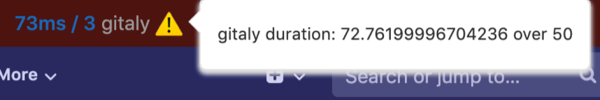



- Tier: Free, Premium, Ultimate
- Offering: GitLab Self-Managed, GitLab Dedicated



The performance bar displays real-time metrics directly in your browser, giving you insights without
making you look through logs or run separate profiling tools.

For development teams, the performance bar simplifies debugging by showing exactly where they should focus their efforts.


## Available information



- Rugged calls [removed](https://gitlab.com/gitlab-org/gitlab/-/issues/421591) in GitLab 16.6.



From left to right, the performance bar displays:

- **Current Host**: the current host serving the page.
- **Database queries**: the time taken (in milliseconds) and the total number
  of database queries, displayed in the format `00ms / 00 (00 cached) pg`. Select to display
  a dialog with more details. You can use this to see the following
  details for each query:
  - **In a transaction**: shows up below the query if it was executed in
    the context of a transaction
  - **Role**: shows up when [Database Load Balancing](../../postgresql/database_load_balancing.md)
    is enabled. It shows which server role was used for the query.
    "Primary" means that the query was sent to the read/write primary server.
    "Replica" means it was sent to a read-only replica.
  - **Configuration name**: this is
    used to distinguish between different databases configured for different
    GitLab features. The name shown is the same name used to configure database
    connections in GitLab.
- **Gitaly calls**: the time taken (in milliseconds) and the total number of
  [Gitaly](../../gitaly/_index.md) calls. Select to display a dialog with more
  details.
- **Redis calls**: the time taken (in milliseconds) and the total number of
  Redis calls. Select to display a dialog with more details.
- **Elasticsearch calls**: the time taken (in milliseconds) and the total number of
  Elasticsearch calls. Select to display a dialog with more details.
- **External HTTP calls**: the time taken (in milliseconds) and the total
  number of external calls to other systems. Select to display a dialog
  with more details.
- **Load timings** of the page: if your browser supports load timings, several
  values in milliseconds, separated by slashes.
  Select to display a dialog with more details. The values, from left to right:
  - **Backend**: time needed for the base page to load.
  - [**First Contentful Paint**](https://developer.chrome.com/docs/lighthouse/performance/first-contentful-paint/):
    Time until something was visible to the user. Displays `NaN` if your browser does not
    support this feature.
  - [**DomContentLoaded**](https://web.dev/articles/critical-rendering-path/measure-crp) Event.
  - **Total number of requests** the page loaded.
- **Memory**: the amount of memory consumed and objects allocated during the selected request.
  Select it to display a window with more details.
- **Trace**: if Jaeger is integrated, **Trace** links to a Jaeger tracing page
  with the current request's `correlation_id` included.
- **+**: a link to add a request's details to the performance bar. The request
  can be added by its full URL (authenticated as the current user), or by the value of
  its `X-Request-Id` header.
- **Download**: a link to download the raw JSON used to generate the Performance Bar reports.
- **Memory Report**: a link that generates a
  memory profiling
  report of the current URL.
- **Flamegraph** with mode: a link to generate a flamegraph
  of the current URL with the selected [Stackprof mode](https://github.com/tmm1/stackprof#sampling):
  - The **Wall** mode samples every interval of the time on a clock on a wall. The interval is set to `10100` microseconds.
  - The **CPU** mode samples every interval of CPU activity. The interval is set to `10100` microseconds.
  - The **Object** mode samples every interval. The interval is set to `100` allocations.
- **Request Selector**: a select box displayed on the right-hand side of the
  Performance Bar which enables you to view these metrics for any requests made while
  the current page was open. Only the first two requests per unique URL are captured.
- **Stats** (optional): if the `GITLAB_PERFORMANCE_BAR_STATS_URL` environment variable is set,
  this URL is displayed in the bar. Used only on GitLab.com.

> [!note]
> Not all indicators are available in all environments. For instance, the memory view
> requires running Ruby with [specific patches](https://gitlab.com/gitlab-org/gitlab-build-images/-/blob/master/patches/ruby/2.7.4/thread-memory-allocations-2.7.patch)
> applied. When running GitLab locally using the [GDK](https://gitlab.com/gitlab-org/gitlab-development-kit),
> this is typically not the case and the memory view cannot be used.

## Keyboard shortcut

Press the [<kbd>p</kbd> + <kbd>b</kbd> keyboard shortcut](../../../user/shortcuts.md) to display
the performance bar, and again to hide it.

For non-administrators to display the performance bar, it must be
[enabled for them](#enable-the-performance-bar-for-non-administrators).

## Request warnings

Requests that exceed predefined limits display a warning  icon and
explanation next to the metric. In this example, the Gitaly call duration
exceeded the threshold.



### Warning format

Each warning message follows the format:

```plaintext
<metric> <type>: <actual> over <threshold>
```

For example, `es calls: 83 over 5` shows 83 Elasticsearch calls,
which exceeds the threshold of five.

Three threshold types can trigger a warning:

- `calls`: The total number of calls made to the service during the request.
- `duration`: The total time in milliseconds spent across all calls to the service.
- `individual call`: The time in milliseconds for a single call to the service.
  Individual call warnings appear in the detail dialog for that metric, not in the bar itself.

### Metrics and default thresholds

The following metrics emit warnings when a request exceeds their thresholds.
Thresholds differ between production and all other environments. The values labeled `(development)`
in the table apply to every non-production environment, such as development and test.
The values shown here reflect the defaults defined in the source files under
`lib/peek/views/`.

| Metric | Warning label prefix | Calls threshold | Total duration threshold | Individual call threshold |
|--------|---------------------|-----------------|--------------------------|---------------------------|
| Database (SQL) | `active-record` | 100 | 3,000 ms (development) / 15,000 ms (production) | 1,000 ms (development) / 5,000 ms (production) |
| Gitaly | `gitaly` | 30 | 1,000 ms | 500 ms |
| Elasticsearch | `es` | 5 | 1,000 ms | 1,000 ms |
| External HTTP | `external-http` | 10 | 1,000 ms | 100 ms |
| ClickHouse | `ch` | 5 | 1,000 ms | 1,000 ms |
| Zoekt | `zkt` | 3 (development) / 5 (production) | 500 ms (development) / 1,000 ms (production) | 500 ms (development) / 1,000 ms (production) |

The performance bar tracks and displays Redis calls but does not define thresholds for them,
so it emits no warnings for Redis.

The Bullet metric is an exception to the format above. Bullet detects N+1 queries and runs
by default in the development environment only. When active, it emits a fixed
`Unoptimized queries detected` warning instead of a threshold-based
`<metric> <type>: <actual> over <threshold>` message.

The production thresholds for the database metric are higher than the development defaults
because production queries often take longer against larger data volumes.
All other metrics except Zoekt use the same thresholds across environments.
These values are configurable defaults defined in the source files.
If the thresholds change, the source files are the authoritative reference.

### When a warning is actionable

A warning indicates that a request uses more resources than expected for typical pages.
Use the following guidance to decide whether to investigate:

- A high call count (for example, `gitaly calls: 45 over 30`) often indicates an N+1 pattern
  where the same type of call repeats in a loop. Select the metric to open the detail
  dialog and look for repeated calls with similar parameters.
- A high total duration (for example, `active-record duration: 4500 over 3000`) means the service
  is slow overall. Check whether a small number of expensive calls are responsible, or whether
  many small calls accumulate.
- A high individual call duration appears in the detail dialog next to the specific call.
  A single slow call often points to a missing index, a large payload, or an unoptimized query.

Some warnings are expected noise in specific contexts:

- Pages that aggregate data across many projects or groups (for example, dashboards or group
  overview pages) make more calls than single-resource pages.
- Development environments with small datasets can trigger duration warnings that production does
  not, and production data volumes can trigger warnings that development does not.

## Enable the performance bar for non-administrators

The performance bar is disabled by default for non-administrators. To enable it
for a given group:

1. Sign in as a user with administrator access.
1. In the upper-right corner, select **Admin**.
1. In the left sidebar, select **Settings** > **Metrics and profiling**.
1. Expand **Profiling - Performance bar**.
1. Select **Allow non-administrators access to the performance bar**.
1. In the **Allow access to members of the following group** field, provide the full path of the
   group allowed to access the performance.
1. Select **Save changes**.
