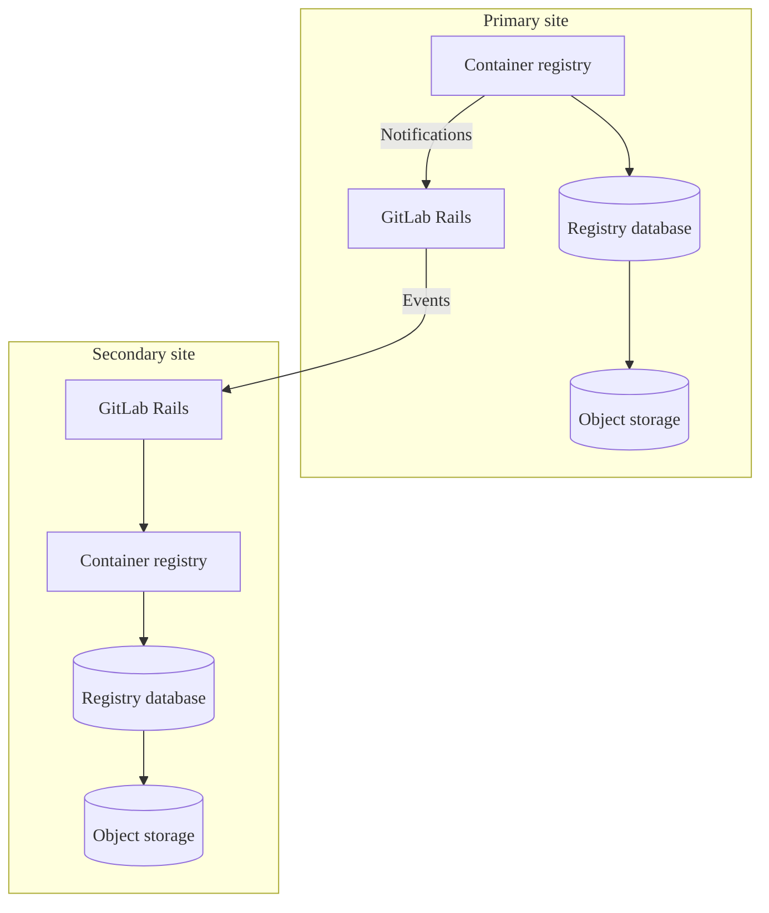



- Tier: Free, Premium, Ultimate
- Offering: GitLab Self-Managed





- [Generally available](https://gitlab.com/gitlab-org/gitlab/-/issues/423459) in GitLab 17.3.
- Prefer mode for new Linux package and self-compiled installations [introduced](https://gitlab.com/gitlab-org/container-registry/-/merge_requests/2849) in GitLab 19.0. Enabled by default.



The metadata database provides several [enhancements](#enhancements) to the container registry
that improve performance and add new features.
The work on the GitLab Self-Managed release of the registry metadata database feature
is tracked in [epic 5521](https://gitlab.com/groups/gitlab-org/-/epics/5521).

By default, the container registry uses object storage or a local file system to persist metadata
related to container images. This method to store metadata limits how efficiently
the data can be accessed, especially data spanning multiple images, such as when listing tags.
By using a database to store this data, many new features are possible, including
[online garbage collection](https://gitlab.com/gitlab-org/container-registry/-/blob/master/docs/spec/gitlab/online-garbage-collection.md)
which removes old data automatically with zero downtime.

This database works in conjunction with the storage already used by the registry, but does not replace object storage or a file system.
You must continue to maintain a storage solution even after performing a metadata import to the metadata database.

For Helm Charts installations, see [Manage the container registry metadata database](https://docs.gitlab.com/charts/charts/registry/metadata_database/#create-the-database)
in the Helm Charts documentation.

## Enhancements

The metadata database architecture supports performance improvements, bug fixes, and new features
that are not available with legacy metadata storage. These enhancements include:

- Automatic [online garbage collection](../../user/packages/container_registry/delete_container_registry_images.md#garbage-collection)
- [Storage usage visibility](../../user/packages/container_registry/reduce_container_registry_storage.md#view-container-registry-usage) for repositories, projects, and groups
- [Image signing](../../user/packages/container_registry/_index.md#container-image-signatures)
- [Moving and renaming repositories](../../user/packages/container_registry/_index.md#move-or-rename-container-registry-repositories)
- [Protected tags](../../user/packages/container_registry/protected_container_tags.md)
- Performance improvements for [cleanup policies](../../user/packages/container_registry/reduce_container_registry_storage.md#cleanup-policy), enabling successful cleanup of large repositories
- Performance improvements for listing repository tags
- Tracking and displaying tag publish timestamps (see [issue 290949](https://gitlab.com/gitlab-org/gitlab/-/issues/290949))
- Sorting repository tags by additional attributes beyond name

Due to technical constraints of legacy metadata storage, new features are only
implemented for the metadata database version. Non-security bug fixes might be limited to the
metadata database version.

## Known limitations

- Metadata import for existing registries requires a period of read-only time.
- Prior to 18.3, registry regular schema and post-deployment database migrations must be run manually when upgrading versions.
- No guarantee for registry [zero downtime during upgrades](../../update/zero_downtime.md) on multi-node Linux package environments.
- During metadata imports for existing registries, the `createdAt` and `publishedAt` timestamp values for image tags are set to the import date. This is intentional to ensure consistency, because the legacy registry does not collect tag published dates for all images. While some images have build dates in their metadata, many do not. For more information, see [issue 1384](https://gitlab.com/gitlab-org/container-registry/-/issues/1384).

## Metadata database feature support

You can import metadata from existing registries to the metadata database, and use online garbage collection.

Some database-enabled features are only enabled for GitLab.com and automatic database provisioning for
the registry database is not available. Review the feature support table in the [feedback issue](https://gitlab.com/gitlab-org/gitlab/-/issues/423459#supported-feature-status)
for the status of features related to the container registry database.

## Database requirements

The container registry connects to its metadata database directly and runs
read-write transactions against it.

By default, GitLab 18.3 and later preprovisions a logical database for registry
metadata in the main GitLab database. This database already meets the
requirements below, so most installations need no extra database setup. You meet
these requirements yourself only when you use an
[external database](#using-an-external-database) for the registry:

- Run a supported PostgreSQL version. The registry checks the version at startup
  and does not start on an unsupported version. For supported versions, see
  [PostgreSQL requirements](../../install/requirements.md#postgresql).
- Use a dedicated database for the registry. To create the database and its
  user, see
  [Configure the container registry metadata database](../postgresql/external.md#container-registry-metadata-database).
- Do not add PostgreSQL extensions. The metadata database needs none, so do not
  copy the main GitLab database's extension list.
- Allow read-write access. The registry does not start against a read-only
  replica.
- Keep `bytea_output` set to `hex`, the PostgreSQL default. The registry reads
  some binary columns as hexadecimal text, so a server or role set to
  `bytea_output = escape` makes imports fail with `invalid hex format`. See
  [Error: `convert field 8 failed: invalid hex format`](container_registry_metadata_database_troubleshooting.md#error-convert-field-8-failed-invalid-hex-format).

The registry user must own the database, or migrations fail with a permission
error. See
[Error: `permission denied for schema public`](container_registry_metadata_database_troubleshooting.md#error-permission-denied-for-schema-public-sqlstate-42501).

Encrypting the connection with TLS is optional. To encrypt it, set `sslmode` to
`require`, as in the example configuration. To also verify the server
certificate, use `verify-full` with a CA certificate in `sslrootcert`.

## Enable the metadata database for Linux package installations

Prerequisites:

- GitLab 17.5 is the minimum required version, but GitLab 18.3 or later
  is recommended due to the added improvements and easier configuration.
- A PostgreSQL database that meets the [database requirements](#database-requirements). It must be accessible from the registry node.
- If you use an external database, you must first set up the external database connection. For more information, see [Using an external database](#using-an-external-database).

### Before you start

- After you enable the database, you must continue to use it. The database is
  now the source of the registry metadata, disabling it after this point
  causes the registry to lose visibility on all images written to it while
  the database was active.
- [Offline garbage collection](container_registry.md#container-registry-garbage-collection) is no longer required.
  The garbage collection command included with GitLab will safely exit when the database is enabled, but third-party
  commands, such as the one provided by the upstream registry, will delete data associated with tagged images.
- Verify you have not automated offline garbage collection: especially with a third-party command.
- You can first [reduce the storage of your registry](../../user/packages/container_registry/reduce_container_registry_storage.md)
  to speed up the process.
- Back up [your container registry data](../backup_restore/backup_gitlab.md#container-registry)
  if possible.
- Configure container registry [notifications](container_registry.md#configure-container-registry-notifications).

### Enable the database for new installations

For installations that have never written data to the container registry, no import
is required. You must only enable the database before writing data to the registry.

For more information, see the instructions for [new installations](container_registry_metadata_database_new_install.md).

### Enable the database for existing registries

You can import your existing container registry metadata
using either a one-step import method or three-step import method.
A few factors affect the duration of the import:

- The number of tagged images in your registry.
- The size of your existing registry data.
- The specifications of your PostgreSQL instance.
- The number of registry instances running.
- Network latency between the registry, PostgreSQL and your configured storage.

You do not need to do the following in preparation before importing:

- Allocate extra object storage or file system space: The import makes no significant writes to this storage.
- Run offline garbage collection: While not harmful, offline garbage collection does not shorten the
  import enough to recoup the time spent running this command.

> [!note]
> The metadata import only targets tagged images. Untagged and unreferenced manifests, and the layers
> exclusively referenced by them, are left behind and become inaccessible. Untagged images
> were never visible through the GitLab UI or API, but they can become "dangling" and
> left behind in the backend. After import to the new registry, all images are subject
> to continuous online garbage collection, by default deleting any untagged and unreferenced manifests
> and layers that remain for longer than 24 hours.

### Choose the right import method

If you regularly run [offline garbage collection](container_registry.md#container-registry-garbage-collection),
use the [one-step import](container_registry_metadata_database_one_step_import.md) method.
This method should take a similar amount of time and is a simpler operation compared to the three-step import method.

If your registry is too large to regularly run offline garbage collection,
use the [three-step import](container_registry_metadata_database_three_step_import.md)
method to minimize the amount of read-only time significantly.

If you use an external database, make sure you set up the
external database connection before proceeding with a migration path.

For more information, see [Using an external database](#using-an-external-database).

### Restore interrupted imports



- [Introduced](https://gitlab.com/gitlab-org/container-registry/-/issues/1162) in GitLab 18.5.



Skip repositories that you pre-imported within the last 72 hours to resume
interrupted imports. Repositories are pre-imported either:

- By completing step one of the three-step import process
- By completing the one-step import process

To restore interrupted imports, configure the `--pre-import-skip-recent` flag. Defaults to 72 hours.

For example:

```shell
# Skip repositories imported within 6 hours from the start of the import command
--pre-import-skip-recent 6h

# Disable skipping behavior
--pre-import-skip-recent 0
```

For more information about valid duration units, see [Go duration strings](https://pkg.go.dev/time#ParseDuration).

### Post import

After completing a large import, hundreds of thousands or even millions of blobs can be queued for garbage collection review. This is normal.

Because tagged images are imported before dangling blobs are inventoried, the garbage collector initially reviews blobs that are still referenced by tagged images. Garbage collection removes these blobs from the queue, but does not delete them from storage.

Storage decreases only after the garbage collector reaches the dangling blobs. Registry storage might take 48 hours or more to decrease after a post-import, because the garbage collector delays review to avoid interference with image blobs.

To monitor and manage the post-import garbage collection backlog:

- [Check the health of online garbage collection](#check-the-health-of-online-garbage-collection)
  to see the size and status of the review queues.
- [Adjust the garbage collector worker interval](#adjust-the-garbage-collector-worker-interval)
  to temporarily speed up processing for large backlogs.

## Prefer mode



- [Introduced](https://gitlab.com/gitlab-org/omnibus-gitlab/-/work_items/9411) in GitLab 18.7.
- [Enabled by default](https://gitlab.com/gitlab-org/container-registry/-/merge_requests/2849) for new Linux package and self-compiled installations in GitLab 19.0.



Prefer mode is a configuration option for the metadata database
that lets the registry fall back to
legacy metadata storage when an existing registry
has not been imported to the database yet.

### Enable prefer mode

To enable prefer mode:

1. In `/etc/gitlab/gitlab.rb`, set `database.enabled` to `"prefer"`
   instead of `true` or `false`:

   ```ruby
   registry['database'] = {
     'enabled' => 'prefer',
     'host' => '<your_database_host>',
     'port' => 5432,
     'user' => '<your_database_user>',
     'password' => '<your_database_password>',
     'dbname' => '<your_database_name>',
   }
   ```

1. Save the file and [reconfigure GitLab](../restart_gitlab.md).

After you reconfigure GitLab, the registry evaluates which metadata backend to use at startup
based on lockfiles that track previous writes to the filesystem or database:

- Filesystem lockfile exists: The registry has existing filesystem metadata.
  It falls back to legacy metadata storage and logs a warning.
  The registry operates identically to `enabled: false` until you complete
  a [metadata import](#enable-the-database-for-existing-registries).
- Database lockfile exists: The registry already uses the database.
  It connects to the database normally, identical to `enabled: true`.
- Neither lockfile exists: The registry is a fresh installation.
  It requires a configured and reachable database to start
  and does not fall back to legacy storage.
- Both lockfiles exist: The registry refuses to start. This indicates a
  configuration error that you must resolve manually.

The fallback decision occurs once at startup and does not change while the
registry is running. There is no automatic retry or reconnection to the
database after a fallback. To move from filesystem to database mode after a
fallback, complete the standard [metadata import](#enable-the-database-for-existing-registries)
and restart the registry.

### Default configuration



- Default metadata database mode [changed to `prefer`](https://gitlab.com/gitlab-org/container-registry/-/merge_requests/2849) in GitLab 19.0 for new Linux package and self-compiled installations.



In GitLab 19.0 and later, the metadata database is enabled by default in prefer mode for new installations:

- Linux package (Omnibus) installations: `registry['database']['enabled']` defaults to `"prefer"` when the setting is not specified in `/etc/gitlab/gitlab.rb`. For more information, see [issue 9396](https://gitlab.com/gitlab-org/omnibus-gitlab/-/issues/9396).
- Self-compiled installations: `database.enabled` defaults to `"prefer"` when the setting is not specified in the registry configuration file.

After upgrading, check which backend the registry uses. For the procedure, see [Verify which metadata backend is active](#verify-which-metadata-backend-is-active).

#### New installations

On a new GitLab 19.0 or later installation, the registry starts in prefer mode. If a reachable metadata database is configured, the registry uses it. Without a reachable database, the registry fails to start.

To keep a new installation on filesystem metadata, set the database mode to `"false"` before the first registry start:

- For Linux package (Omnibus) installations, in `/etc/gitlab/gitlab.rb`:

  ```ruby
  registry['database']['enabled'] = "false"
  ```

- For self-compiled installations, in `/home/git/gitlab/config/gitlab.yml`:

  ```yaml
  registry:
    database:
      enabled: false
  ```

#### Existing installations

Upgrading an existing installation to GitLab 19.0 or later preserves the current `registry['database']['enabled']` setting. The upgrade does not migrate metadata or switch the active backend.

An existing prefer-mode installation with filesystem metadata continues to use filesystem metadata after the upgrade. To switch to the database, complete a [metadata import](#enable-the-database-for-existing-registries).

#### Metadata database backups

When the registry uses the metadata database, include the registry database in your backups. For the procedure, see [Backup with metadata database](#backup-with-metadata-database).

A prefer-mode installation with existing filesystem metadata stays in fallback across restarts. During fallback, the registry does not read from or write to the metadata database. You do not need to back up the metadata database until fallback ends.

To end fallback, complete a [metadata import](#enable-the-database-for-existing-registries) and restart the registry. After the restart, the registry uses the metadata database. Include it in your backup routine.

### Verify which metadata backend is active

To verify which metadata backend your registry is using,
use one of the following methods.

#### Check the registry API response header

1. Send a request to the registry `/v2/` endpoint:

   ```shell
   curl --silent --head "https://registry.example.com/v2/" | grep --ignore-case gitlab-container-registry-database-enabled
   ```

1. Inspect the
`gitlab-container-registry-database-enabled` response header:

   - A value of `true` means the registry is using the metadata database.
   - A value of `false` means it is using legacy filesystem storage.

#### Check lockfiles on disk

To check lockfiles on disk, look for these files in the configured storage backend at
`<rootdirectory>/docker/registry/lockfiles/`:

- `database-in-use`: The registry is using the metadata database.
- `filesystem-in-use`: The registry is using legacy filesystem storage.

If both lockfiles exist, the registry is in an invalid state and does not start.

#### Check registry logs

The registry logs which metadata backend it selects at startup.

To check registry logs, look for one of the following messages:

- If the registry falls back to legacy storage (prefer mode only):

  ```plaintext
  database prefer mode enabled, but found filesystem metadata: falling back to legacy metadata
  ```

- If the registry connects to the database:

  ```plaintext
  using the metadata database
  ```

## Database migrations

The container registry supports two types of migrations:

- Regular schema migrations: Changes to the database structure that must run before deploying new application code, also known as pre-deployment migrations. These should be fast (no more than a few minutes) to avoid deployment delays.
- Post-deployment migrations: Changes to the database structure that can run while the application is running. Used for longer operations like creating indexes on large tables, avoiding startup delays and extended upgrade downtime.

By default, the registry applies both regular schema and post-deployment migrations simultaneously.
To reduce downtime during upgrades, you can skip post-deployment migrations and apply them manually after the application starts.

### Apply database migrations





To apply both regular schema and post-deployment migrations before the application starts:

1. Run database migrations:

   ```shell
   sudo gitlab-ctl registry-database migrate up
   ```

To skip post-deployment migrations:

1. Run regular schema migrations only:

   ```shell
   sudo gitlab-ctl registry-database migrate up --skip-post-deployment
   ```

   As an alternative to the `--skip-post-deployment` flag, you can also set the `SKIP_POST_DEPLOYMENT_MIGRATIONS` environment variable to `true`:

   ```shell
   SKIP_POST_DEPLOYMENT_MIGRATIONS=true sudo gitlab-ctl registry-database migrate up
   ```

1. After starting the application, apply any pending post-deployment migrations:

   ```shell
   sudo gitlab-ctl registry-database migrate up
   ```





To apply both regular schema and post-deployment migrations before the application starts:

1. Run database migrations:

   ```shell
   sudo -u registry gitlab-ctl registry-database migrate up
   ```

To skip post-deployment migrations:

1. Run regular schema migrations only:

   ```shell
   sudo -u registry gitlab-ctl registry-database migrate up --skip-post-deployment
   ```

   As an alternative to the `--skip-post-deployment` flag, you can also set the `SKIP_POST_DEPLOYMENT_MIGRATIONS` environment variable to `true`:

   ```shell
   SKIP_POST_DEPLOYMENT_MIGRATIONS=true sudo -u registry gitlab-ctl registry-database migrate up
   ```

1. After starting the application, apply any pending post-deployment migrations:

   ```shell
   sudo -u registry gitlab-ctl registry-database migrate up
   ```





> [!note]
> The `migrate up` command offers some extra flags that can be used to control how the migrations are applied.
> Run `sudo gitlab-ctl registry-database migrate up --help` for details.

## Online garbage collection monitoring

The initial runs of online garbage collection following the import process varies
in duration based on the number of imported images. You should monitor the efficiency and
health of your online garbage collection during this period.

### Monitor database performance

After completing an import, expect the database to experience a period of high load as
the garbage collection queues drain. This high load is caused by a high number of individual database calls
from the online garbage collector processing the queued tasks.

Regularly check PostgreSQL and registry logs for any errors or warnings. In the registry logs,
pay special attention to logs filtered by `component=registry.gc.*`.

### Track metrics

Use monitoring tools like Prometheus and Grafana to visualize and track garbage collection metrics,
focusing on metrics with a prefix of `registry_gc_*`. These include the number of objects
marked for deletion, objects successfully deleted, run intervals, and durations.
See [enable the registry debug server](container_registry_troubleshooting.md#enable-the-registry-debug-server)
for how to enable Prometheus.

### Monitor task queues

Monitor the health and status of garbage collection task queues for blobs and manifests.

#### Check the health of online garbage collection





The following command displays information related to online garbage collection.

```shell
sudo gitlab-ctl registry-database gc-stats
```

Example Output:

```shell
=== Blob Review Queue ===

Tasks Pending Removal: 42
Tasks ready for GC review (review_after has passed).

┌───────────────────────────────────────────────────────────────────┬─────────────────────┬─────────────────┐
│                              DIGEST                               │    REVIEW AFTER     │      EVENT      │
├───────────────────────────────────────────────────────────────────┼─────────────────────┼─────────────────┤
│ sha256:a3ed95caeb02ffe68cdd9fd84406680ae93d633cb16422d00e8a7c22e  │ 2026-01-16 21:56:13 │ blob_upload     │
│ sha256:b4f5e6d7c8a9b0c1d2e3f4a5b6c7d8e9f0a1b2c3d4e5f6a7b8c9d0e1f2 │ 2026-01-16 19:56:13 │ manifest_delete │
│ sha256:c5d6e7f8a9b0c1d2e3f4a5b6c7d8e9f0a1b2c3d4e5f6a7b8c9d0e1f2a3 │ 2026-01-16 17:56:13 │ layer_delete    │
└───────────────────────────────────────────────────────────────────┴─────────────────────┴─────────────────┘

Long Overdue Tasks: 5
Tasks pending longer than configured delay - may need attention.

┌───────────────────────────────────────────────────────────────────┬─────────────────────┬──────────────┬─────────┐
│                              DIGEST                               │    REVIEW AFTER     │    EVENT     │ OVERDUE │
├───────────────────────────────────────────────────────────────────┼─────────────────────┼──────────────┼─────────┤
│ sha256:d6e7f8a9b0c1d2e3f4a5b6c7d8e9f0a1b2c3d4e5f6a7b8c9d0e1f2a3b4 │ 2026-01-11 23:56:13 │ blob_upload  │ 4d 0h   │
│ sha256:e7f8a9b0c1d2e3f4a5b6c7d8e9f0a1b2c3d4e5f6a7b8c9d0e1f2a3b4c5 │ 2026-01-13 23:56:13 │ layer_delete │ 2d 0h   │
└───────────────────────────────────────────────────────────────────┴─────────────────────┴──────────────┴─────────┘

High Retry Tasks: 2
Tasks with >10 review attempts - may indicate persistent issues.

┌───────────────────────────────────────────────────────────────────┬─────────────────────┬─────────────────┬─────────┐
│                              DIGEST                               │    REVIEW AFTER     │      EVENT      │ RETRIES │
├───────────────────────────────────────────────────────────────────┼─────────────────────┼─────────────────┼─────────┤
│ sha256:f8a9b0c1d2e3f4a5b6c7d8e9f0a1b2c3d4e5f6a7b8c9d0e1f2a3b4c5d6 │ 2026-01-17 00:56:13 │ blob_upload     │ 15      │
│ sha256:a9b0c1d2e3f4a5b6c7d8e9f0a1b2c3d4e5f6a7b8c9d0e1f2a3b4c5d6e7 │ 2026-01-17 01:56:13 │ manifest_delete │ 12      │
└───────────────────────────────────────────────────────────────────┴─────────────────────┴─────────────────┴─────────┘

=== Manifest Review Queue ===

Tasks Pending Removal: 128
Tasks ready for GC review (review_after has passed).

┌───────────────┬─────────────┬─────────────────────┬──────────────────────┐
│ REPOSITORY ID │ MANIFEST ID │    REVIEW AFTER     │        EVENT         │
├───────────────┼─────────────┼─────────────────────┼──────────────────────┤
│ 1001          │ 12345       │ 2026-01-16 22:56:13 │ tag_delete           │
│ 1002          │ 67890       │ 2026-01-16 20:56:13 │ manifest_upload      │
│ 1003          │ 11111       │ 2026-01-16 18:56:13 │ tag_switch           │
│ 2001          │ 22222       │ 2026-01-16 16:56:13 │ manifest_list_delete │
└───────────────┴─────────────┴─────────────────────┴──────────────────────┘

Long Overdue Tasks: 8
Tasks pending longer than configured delay - may need attention.

┌───────────────┬─────────────┬─────────────────────┬─────────────────┬─────────┐
│ REPOSITORY ID │ MANIFEST ID │    REVIEW AFTER     │      EVENT      │ OVERDUE │
├───────────────┼─────────────┼─────────────────────┼─────────────────┼─────────┤
│ 3001          │ 33333       │ 2026-01-12 23:56:13 │ tag_delete      │ 3d 0h   │
│ 3002          │ 44444       │ 2026-01-14 23:56:13 │ manifest_delete │ 1d 0h   │
└───────────────┴─────────────┴─────────────────────┴─────────────────┴─────────┘

High Retry Tasks: 3
Tasks with >10 review attempts - may indicate persistent issues.

┌───────────────┬─────────────┬─────────────────────┬─────────────────┬─────────┐
│ REPOSITORY ID │ MANIFEST ID │    REVIEW AFTER     │      EVENT      │ RETRIES │
├───────────────┼─────────────┼─────────────────────┼─────────────────┼─────────┤
│ 4001          │ 55555       │ 2026-01-17 00:26:13 │ tag_delete      │ 18      │
│ 4002          │ 66666       │ 2026-01-17 00:41:13 │ manifest_upload │ 11      │
└───────────────┴─────────────┴─────────────────────┴─────────────────┴─────────┘
```





### Connect to the GitLab container registry metadata database

Use the following command to connect to the registry metadata database:

```shell
gitlab-psql -d registry
```

### Queries to determine status of online garbage collection tasks

The following queries return tasks that were retried more than 10 times, or were eligible for review for longer than 24 hours.
The online garbage collector should pick up an item for review within 24 hours with few failed attempts.
If any rows are returned, investigate the health of your online garbage collector.

For manifests:

```sql
SELECT
  repository_id,
  manifest_id,
  ROUND(
    EXTRACT(
      EPOCH
      FROM
        AGE(NOW(), review_after)
    ) / 3600
  ) AS hours_eligible_for_review,
  review_count as failed_review_attempts,
  event
FROM
  gc_manifest_review_queue
WHERE
  review_after < NOW() - INTERVAL '24 hours'
  OR review_count > 10
LIMIT
  20;
```

For blobs:

```sql
SELECT
  substring(encode(digest, 'hex'), 3) AS digest,
  ROUND(
    EXTRACT(
      EPOCH
      FROM
        AGE(NOW(), review_after)
    ) / 3600
  ) AS hours_eligible_for_review,
  review_count as failed_review_attempts,
  event
FROM
  gc_blob_review_queue
WHERE
  review_after < NOW() - INTERVAL '24 hours'
  OR review_count > 10
LIMIT
  20;
```

#### Informational queries related to online garbage collection

Check the number of tasks eligible for review by running the following queries:

```sql
SELECT COUNT(*) FROM gc_blob_review_queue WHERE review_after < NOW();
SELECT COUNT(*) FROM gc_manifest_review_queue WHERE review_after < NOW();
```





Generally, there should be relatively low counts of items ready for review,
often nearing zero. However, there might be more if:

- An import was started 24 to 48 hours ago.
- Large amounts of tags were deleted or a container repository was removed.
- Online garbage collection was disabled for an extended period.

If there are tasks with retries or that are long overdue, check the registry logs
for messages related to garbage collection. Filter for entries by
`component="registry.gc.*` and investigate any error messages.

#### Check before troubleshooting

##### GC queue sizes

The unfiltered size of the `gc_manifest_review_queue` and `gc_blob_review_queue`
are not good indicators of the health of the online garbage collector. These
queues constantly have new entries added to them; therefore, these queues
never fully clear for an active registry.

Additionally, not all items in these queues will be removed from storage.
Consult the [online garbage collection](https://gitlab.com/gitlab-org/container-registry/-/blob/master/docs/spec/gitlab/online-garbage-collection.md)
specification for a full explanation of these queues for more context.

##### Lots of tasks ready to review

Large amounts of tasks eligible for review are also not necessarily a cause for concern.
The garbage collector might be working through items caused by a spike in activity.

##### Some tasks are old

Similarly, the `created_at` date of these tasks alone is not a good health indicator.
When an event adds the same blob or manifest to the queue, the `review_after`
of the existing task is updated, which postpones the review. No duplicate task is created.

This can occur any number of times, so tasks created months ago are not a cause
for concern.

### Adjust the garbage collector worker interval

If the number of tasks eligible for review remains high, and you want to increase the frequency
between the garbage collection blob or manifest worker runs, update your
interval configuration from the default (`5s`) to `1s`:

```ruby
registry['gc'] = {
  'blobs' => {
    'interval' => '1s'
  },
  'manifests' => {
    'interval' => '1s'
  }
}
```

After the import load has been cleared, you should fine-tune these settings for the long term
to avoid unnecessary CPU load on the database and registry instances. You can gradually increase
the interval to a value that balances performance and resource usage.

### Validate data consistency

To ensure data consistency after the import, use the [`crane validate`](https://github.com/google/go-containerregistry/blob/main/cmd/crane/doc/crane_validate.md)
tool. This tool checks that all image layers and manifests in your container registry
are accessible and correctly linked. By running `crane validate`, you confirm that
the images in your registry are complete and accessible, ensuring a successful import.

### Review cleanup policies

If most of your images are tagged, garbage collection won't significantly reduce storage space
because it only deletes untagged images.

Implement cleanup policies to remove unneeded tags, which eventually causes images
to be removed through garbage collection and storage space being recovered.

## Using an external database

By default, GitLab 18.3 and later preprovisions a logical database within the
main GitLab database for container registry metadata. However, you may want to
use a dedicated external database for the container registry if you want to
[scale your registry](container_registry.md#scaling-by-component).

### Steps

- Create an [external database](../postgresql/external.md#container-registry-metadata-database).

Afterward, follow the same steps for the default database, substituting your own
database values. Start with the database disabled, taking care to
enable and disable the database as instructed:

```ruby
registry['database'] = {
  'enabled' => false,
  'host' => '<registry_database_host_placeholder_change_me>',
  'port' => 5432, # Default, but set to the port of your database instance if it differs.
  'user' => '<registry_database_username_placeholder_change_me>',
  'password' => '<registry_database_placeholder_change_me>',
  'dbname' => '<registry_database_name_placeholder_change_me>',
  'sslmode' => 'require', # See the PostgreSQL documentation for additional information https://www.postgresql.org/docs/16/libpq-ssl.html.
  'sslcert' => '</path/to/cert.pem>',
  'sslkey' => '</path/to/private.key>',
  'sslrootcert' => '</path/to/ca.pem>'
}
```

## Backup with metadata database



- Automatic backup support for the registry metadata database [introduced](https://gitlab.com/gitlab-org/gitlab/-/work_items/581279) in GitLab 18.10.



When the metadata database is turned on, backups must include both the registry storage backend
and the database.

The backup method depends on your storage type:

- Local filesystem storage: `gitlab-backup` includes the registry automatically.
- Object storage: You must back up object storage separately.

Back up storage and database as close together in time as possible to ensure a consistent
registry state. To restore the registry, you must apply both backups.

### Automatic backup

In GitLab 18.10 and later, `gitlab-backup create` and `gitlab-backup restore` include the
registry metadata database automatically when the metadata database is configured. On Helm chart
(Kubernetes) installations, `backup-utility` behaves the same way.

The metadata database must be configured in `gitlab.rb` or in your Helm values file.

No additional configuration is required. The backup tools read the registry
database connection settings from the existing configuration.

If you call the backup Rake task directly, you must set the following
environment variables on the node that runs the backup:

| Variable | Required | Description |
|---|---|---|
| `REGISTRY_DATABASE_HOST` | Yes | The database host. |
| `REGISTRY_DATABASE_NAME` | Yes | The database name. |
| `REGISTRY_DATABASE_USER` | Yes | The database user. |
| `REGISTRY_DATABASE_PORT` | No | The database port. Defaults to `5432`. |
| `REGISTRY_DATABASE_PASSWORD` | No | The database password. |
| `REGISTRY_DATABASE_SSLMODE` | No | Whether or not to require SSL mode. Set to `require` or omit. |
| `REGISTRY_DATABASE_SSLCERT` | No | The path to the client certificate. |
| `REGISTRY_DATABASE_SSLKEY` | No | The path to the client private key. |
| `REGISTRY_DATABASE_SSLROOTCERT` | No | The path to the CA certificate. |
| `REGISTRY_DATABASE_CONNECT_TIMEOUT` | No | The connection timeout in seconds. |

The backup Rake task activates the registry database backup when it detects
any of the following credentials:

- `REGISTRY_DATABASE_PASSWORD`
- `REGISTRY_DATABASE_SSLCERT`
- `REGISTRY_DATABASE_SSLKEY`
- `REGISTRY_DATABASE_SSLROOTCERT`

Without
credentials, the registry database is not included in the backup. The same
environment variables must be set when restoring.

### Manual backup

If you use GitLab 18.9 or earlier, or if you prefer to manage registry database
backups separately, use standard PostgreSQL tools like `pg_dump` and `pg_restore`
to back up and restore the registry database independently.

### Helm chart (Kubernetes) backup and restore



- [Introduced](https://gitlab.com/gitlab-org/charts/gitlab/-/work_items/6207) in GitLab 18.10.



For Helm chart (Kubernetes) deployments, configure the toolbox pod with
dedicated database credentials for backup and restore operations.
Two separate PostgreSQL users are required:

- The backup user must have read-only permissions.
- The restore user must have write permissions.

Configure one or both users, depending on which operations you need.

Before you begin, enable the container registry metadata database by setting `registry.database.enabled: true`.

#### Create the Kubernetes Secret

You must manually create the Kubernetes Secret before deploying. The chart does not
auto-generate this secret.

For example, to create a secret with both backup and restore passwords:

```shell
kubectl create secret generic my-registry-db-password-secret \
  --from-literal=backupPassword="BACKUP_USER_PASSWORD" \
  --from-literal=restorePassword="RESTORE_USER_PASSWORD"
```

#### Configure registry database credentials

Add the required YAML to your Helm `values.yaml` to configure backup and restore users. Refer to the following table for configuration setting definitions.

| Setting | Default | Description |
|---|---|---|
| `backupUser` | | PostgreSQL username for backup operations. Required to enable registry database backups. |
| `restoreUser` | | PostgreSQL username for restore operations. Required to enable registry database restores. |
| `password.secret` | `<release-name>-toolbox-registry-database-password` | Name of the Kubernetes Secret containing the passwords. |
| `password.backupPasswordKey` | `backupPassword` | Key in the Kubernetes Secret for the backup user's password. |
| `password.restorePasswordKey` | `restorePassword` | Key in the Kubernetes Secret for the restore user's password. |

The following example configures both
backup and restore users:

```yaml
gitlab:
  toolbox:
    backups:
      registry:
        database:
          # PostgreSQL username for backing up the registry database
          backupUser: "registry_backup"
          # PostgreSQL username for restoring the registry database
          restoreUser: "registry_restore"
          password:
            # Name of the Kubernetes Secret containing the passwords
            secret: "my-registry-db-password-secret"
            # Key in the Secret for the backup user's password
            backupPasswordKey: "backupPassword"
            # Key in the Secret for the restore user's password
            restorePasswordKey: "restorePassword"
```

If no `backupUser` or `restoreUser` is configured, the registry database backup
is silently skipped and the toolbox pod operates normally.

#### PostgreSQL user permissions

The backup user requires read-only access to dump the registry database.
The restore user requires superuser privileges to restore it.

For Linux package installations, these users and permissions are created
automatically when `database_backup_username`, `database_backup_password`,
`database_restore_username`, and `database_restore_password` are configured.

For self-compiled or external database installations, create the users and
grant permissions manually:

```sql
-- Create the backup user with minimal privileges for pg_dump.
-- The registry database uses both the 'public' and 'partitions' schemas.
CREATE ROLE registry_backup WITH LOGIN PASSWORD 'password'
  NOINHERIT NOCREATEDB NOSUPERUSER NOREPLICATION;

GRANT CONNECT ON DATABASE registry TO registry_backup;

-- Grant read-only access on both schemas
GRANT USAGE ON SCHEMA public TO registry_backup;
GRANT SELECT ON ALL TABLES IN SCHEMA public TO registry_backup;
GRANT SELECT ON ALL SEQUENCES IN SCHEMA public TO registry_backup;
ALTER DEFAULT PRIVILEGES FOR ROLE registry IN SCHEMA public
  GRANT SELECT ON TABLES TO registry_backup;
ALTER DEFAULT PRIVILEGES FOR ROLE registry IN SCHEMA public
  GRANT SELECT ON SEQUENCES TO registry_backup;

GRANT USAGE ON SCHEMA partitions TO registry_backup;
GRANT SELECT ON ALL TABLES IN SCHEMA partitions TO registry_backup;
GRANT SELECT ON ALL SEQUENCES IN SCHEMA partitions TO registry_backup;
ALTER DEFAULT PRIVILEGES FOR ROLE registry IN SCHEMA partitions
  GRANT SELECT ON TABLES TO registry_backup;
ALTER DEFAULT PRIVILEGES FOR ROLE registry IN SCHEMA partitions
  GRANT SELECT ON SEQUENCES TO registry_backup;

-- Create the restore user with superuser privileges.
-- SUPERUSER is required for database restore operations because the
-- restore process must SET ROLE to the registry owner and
-- CREATE TRIGGER on all tables.
CREATE ROLE registry_restore WITH LOGIN PASSWORD 'password' SUPERUSER;
```

#### Credential volume workflow

When configured, the chart creates a volume mounted at `/etc/gitlab/registry-db/` in both the
toolbox Deployment and the backup CronJob. The volume is read-only and includes the
following:

- Connection parameters: A ConfigMap created by the registry chart containing
  the database host, port, name, SSL mode, and connection timeout.
- Backup and restore usernames: A ConfigMap created by the toolbox chart
  with the configured `backupUser` and `restoreUser`.
- Passwords: The user-provided Kubernetes Secret containing the backup
  and restore passwords.

The `backup-utility` in the toolbox pod reads these files and includes the registry
metadata database in backup and restore operations.

If any required credential files are missing, the `backup-utility` logs a warning
and continues with the backup of other resources.

#### Mutual TLS limitation

SSL certificate paths for mutual TLS authentication with PostgreSQL are only
included when SSL is configured globally (`global.psql.ssl`). If SSL is
configured only at the registry subchart level (`registry.database.ssl`), those
settings are not passed to the toolbox.

### Geo considerations

When using [Geo](#database-architecture-with-geo), each site maintains its own
registry database and object storage. Back up the registry database and object
storage at each site independently. Geo does not replicate the registry database
between sites.

## Downgrade a registry

To downgrade the registry to a previous version after the import is complete,
you must restore to a backup of the desired version in order to downgrade.

## Database architecture with Geo

When using GitLab Geo with the container registry, you must configure separate database and
object storage stacks for the registry at each site. Geo replication to the
container registry uses events generated from registry notifications,
rather than by database replication.

### Prerequisites

Each Geo site requires a separate, site-specific:

1. PostgreSQL instance for the container registry database.
1. Object storage instance for the container registry.
1. Container registry configured to use these site-specific resources.

This diagram illustrates the data flow and basic architecture:



Use separate database instances on each site because:

1. The main GitLab database is replicated to the secondary site as read-only.
1. This replication cannot be selectively disabled for the registry database.
1. The container registry requires write access to its database at both sites.
1. Homogeneous setups ensure the greatest parity between Geo sites.

## Revert to object storage metadata

You can revert your registry to use object storage metadata after completing a metadata import.

> [!warning]
> When you revert to object storage metadata, any container images, tags, or repositories
> added or deleted between the import completion and this revert operation are not available.

To revert to object storage metadata:

1. Restore a [backup](../backup_restore/backup_gitlab.md#container-registry) taken before the migration.
1. Add the following configuration to your `/etc/gitlab/gitlab.rb` file:

   ```ruby
   registry['database'] = {
     'enabled' => false,
   }
   ```

1. Save the file and [reconfigure GitLab](../restart_gitlab.md#reconfigure-a-linux-package-installation).

## Troubleshooting

To review errors and troubleshooting solutions and workarounds, see [Troubleshooting the container registry metadata database](container_registry_metadata_database_troubleshooting.md).
