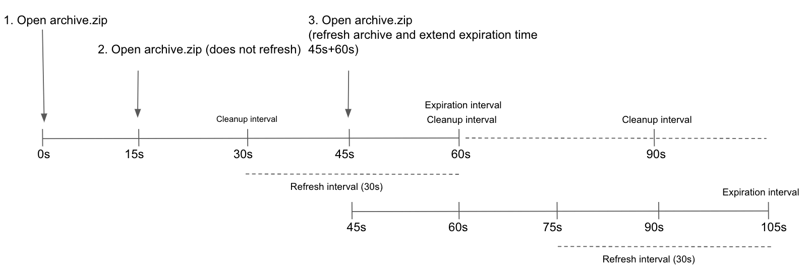



- Tier: Free, Premium, Ultimate
- Offering: GitLab Self-Managed



GitLab Pages provides static site hosting for GitLab projects and groups.
Server administrators must configure Pages before users can access this feature.
As an administrator, you can use GitLab Pages to:

- Host static websites securely with [custom domains](#custom-domains) and SSL/TLS certificates.
- Enable authentication to control access to Pages sites through GitLab permissions.
- Scale deployments using object storage or network storage in multi-node environments.
- Monitor and manage traffic with rate limiting and custom headers.
- Support IPv4 and IPv6 addresses for all Pages sites.

The GitLab Pages daemon runs as a separate process and can be configured either on the same server
as GitLab or on its own dedicated infrastructure.
For user documentation, see [GitLab Pages](../../user/project/pages/_index.md).

> [!note]
> This guide is for Linux package installations. For self-compiled installations, see
> [GitLab Pages administration for self-compiled installations](source.md).

## GitLab Pages daemon

GitLab Pages uses the [GitLab Pages daemon](https://gitlab.com/gitlab-org/gitlab-pages), a basic HTTP server
written in Go that can listen on an external IP address and provide support for
[custom domains](#custom-domains) and custom certificates. It supports dynamic certificates through
Server Name Indication (SNI) and exposes pages using HTTP2 by default.

For more information, see the [README](https://gitlab.com/gitlab-org/gitlab-pages/blob/master/README.md).

When used with [custom domains](#custom-domains), the Pages daemon must listen on
ports `80` or `443`. This is not required for [wildcard domains](#wildcard-domains).

You can run the Pages daemon:

- On the same server as GitLab, listening on a secondary IP.
- On a [separate server](#running-gitlab-pages-on-a-separate-server). The
  [Pages path](#change-storage-path) must also be present on the server where the Pages daemon is
  installed, so you must share it over the network.
- On the same server as GitLab, listening on the same IP but on different ports. In this case, you
  must proxy the traffic with a load balancer. For HTTPS, use TCP load balancing. If you use TLS
  termination (HTTPS load balancing), pages cannot be served with user-provided certificates.
  For HTTP, either HTTP or TCP load balancing is acceptable.

The following sections assume the first option. If you are not supporting custom domains, a secondary
IP is not needed.

## Prerequisites

This section describes the prerequisites for configuring GitLab Pages.

> [!note]
> If your GitLab instance and the Pages daemon are deployed in a private network or behind a firewall,
> your GitLab Pages websites are only accessible to devices and users with access to the private network.

### Wildcard domains

Each site gets its own subdomain (for example, `<namespace>.example.io/<project_slug>`).
This subdomain requires a wildcard DNS record (`*.example.io`) and is the recommended setup for most instances.

Before configuring Pages for wildcard domains, you must:

1. Have a domain for Pages that is not a subdomain of your GitLab instance domain.

   | GitLab domain        | Pages domain        | Does it work? |
   | -------------------- | ------------------- | ------------- |
   | `example.com`        | `example.io`        |  Yes |
   | `example.com`        | `pages.example.com` |  No <sup>1</sup> |
   | `gitlab.example.com` | `pages.example.com` |  Yes |

   **Footnotes**:

   1. If the Pages domain is a subdomain of your GitLab instance domain,
      all deployed Pages sites can access GitLab session cookies.

1. Configure a **wildcard DNS record**.
1. Optional. Have a **wildcard certificate** for that domain if you decide to
   serve Pages under HTTPS.
1. Optional but recommended. Enable [instance runners](../../ci/runners/_index.md)
   so that your users do not have to bring their own.
1. For custom domains, have a **secondary IP**.

### Single-domain sites

All sites share one domain, with the namespace and project slug as path segments
(for example, `example.io/<namespace>/<project_slug>`).
This domain requires only a single DNS `A` record.

Before configuring Pages for single-domain sites, you must:

1. Have a domain for Pages that is not a subdomain of your GitLab instance domain.

   | GitLab domain        | Pages domain        | Supported |
   | -------------------- | ------------------- | ------------- |
   | `example.com`        | `example.io`        |  Yes |
   | `example.com`        | `pages.example.com` |  No <sup>1</sup> |
   | `gitlab.example.com` | `pages.example.com` |  Yes |

   **Footnotes**:

   1. If the Pages domain is a subdomain of your GitLab instance domain,
      all deployed Pages sites can access GitLab session cookies.

1. Configure a **DNS record**.
1. Optional. If you decide to serve Pages under HTTPS, have a **TLS certificate** for that domain.
1. Optional but recommended. Enable [instance runners](../../ci/runners/_index.md)
   so that your users do not have to bring their own.
1. For custom domains, have a **secondary IP**.

### Add the domain to the Public Suffix List

The [Public Suffix List](https://publicsuffix.org) is used by browsers to
decide how to treat subdomains. If your GitLab instance allows members of the
public to create GitLab Pages sites, it also allows those users to create
subdomains on the pages domain (`example.io`). Adding the domain to the Public
Suffix List prevents browsers from accepting
[supercookies](https://en.wikipedia.org/wiki/HTTP_cookie#Supercookie),
among other things.

To submit your GitLab Pages subdomain, see [submit amendments to the Public Suffix List](https://publicsuffix.org/submit/).
For example, if your domain is `example.io`, you should
request that `example.io` is added to the Public Suffix List. GitLab.com
added `gitlab.io` [in 2016](https://gitlab.com/gitlab-com/gl-infra/reliability/-/issues/230).

### DNS configuration

GitLab Pages run on their own virtual host. In your DNS server or provider, add a
[wildcard DNS `A` record](https://en.wikipedia.org/wiki/Wildcard_DNS_record) pointing to the host
that GitLab runs on. For example:

```plaintext
*.example.io. 1800 IN A    192.0.2.1
*.example.io. 1800 IN AAAA 2001:db8::1
```

Where `example.io` is the domain GitLab Pages is served from,
`192.0.2.1` is the IPv4 address of your GitLab instance, and `2001:db8::1` is the
IPv6 address. If you do not have IPv6, you can omit the `AAAA` record.

#### DNS configuration for single-domain sites



- [Introduced](https://gitlab.com/gitlab-org/gitlab/-/issues/17584) as an [experiment](../../policy/development_stages_support.md) in GitLab 16.7.
- [Moved](https://gitlab.com/gitlab-org/gitlab/-/merge_requests/148621) to [beta](../../policy/development_stages_support.md) in GitLab 16.11.
- [Changed](https://gitlab.com/gitlab-org/gitlab-pages/-/issues/1111) implementation from NGINX to the GitLab Pages codebase in GitLab 17.2.
- [Generally available](https://gitlab.com/gitlab-org/gitlab/-/issues/483365) in GitLab 17.4.



To configure GitLab Pages DNS for single-domain sites without wildcard DNS:

1. Enable the GitLab Pages flag for this feature by adding
   `gitlab_pages['namespace_in_path'] = true` to `/etc/gitlab/gitlab.rb`.
1. In your DNS provider, add entries for `example.io`.
   Replace `example.io` with your domain name, and `192.0.0.0` with the IPv4 address of your
   instance:

   ```plaintext
   example.io          1800 IN A    192.0.0.0
   ```

1. Optional. If your GitLab instance has an IPv6 address, add entries for it.
   Replace `example.io` with your domain name, and `2001:db8::1` with the IPv6 address of your
   instance:

   ```plaintext
   example.io          1800 IN AAAA 2001:db8::1
   ```

   `example.io` is the domain GitLab Pages is served from.

#### DNS configuration for custom domains

If you need custom domain support, all subdomains of the Pages root domain must point to the
secondary IP dedicated to the Pages daemon. Without this configuration, users cannot use `CNAME`
records to point their [custom domains](#custom-domains) to their GitLab Pages.

For example:

```plaintext
example.com   1800 IN A    192.0.2.1
*.example.io. 1800 IN A    192.0.2.2
```

This example contains:

- `example.com`: The GitLab domain.
- `example.io`: The domain GitLab Pages is served from.
- `192.0.2.1`: The primary IP of your GitLab instance.
- `192.0.2.2`: The secondary IP dedicated to GitLab Pages. It must differ from the primary IP.

> [!note]
> Do not use the GitLab domain to serve user pages. For more information, see the
> [security section](#security).

## Configuration

You can set up GitLab Pages in several ways. The following examples are listed from the simplest
setup to the most advanced.

### Wildcard domains

This configuration is the minimum setup to use GitLab Pages and serves as the foundation for all
other setups. In this configuration:

- NGINX proxies all requests to the GitLab Pages daemon.
- The GitLab Pages daemon does not listen directly to the public internet.

Prerequisites:

- You have configured [wildcard DNS](#dns-configuration).

To configure GitLab Pages to use wildcard domains:

1. Set the external URL for GitLab Pages in `/etc/gitlab/gitlab.rb`:

   ```ruby
   external_url "http://example.com" # external_url here is only for reference
   pages_external_url 'http://example.io' # Important: not a subdomain of external_url, so cannot be http://pages.example.com
   ```

1. Save the file and [reconfigure GitLab](../restart_gitlab.md#reconfigure-a-linux-package-installation) for the changes to take effect.

The resulting URL scheme is `http://<namespace>.example.io/<project_slug>`.

<i class="fa-youtube-play" aria-hidden="true"></i>
For an overview, see the [enable GitLab Pages for GitLab CE and EE](https://youtu.be/dD8c7WNcc6s) video.
<!-- Video published on 2017-02-22 -->

### Single-domain sites



- [Introduced](https://gitlab.com/gitlab-org/gitlab/-/issues/17584) as an [experiment](../../policy/development_stages_support.md) in GitLab 16.7.
- [Moved](https://gitlab.com/gitlab-org/gitlab/-/merge_requests/148621) to [beta](../../policy/development_stages_support.md) in GitLab 16.11.
- [Changed](https://gitlab.com/gitlab-org/gitlab-pages/-/issues/1111) implementation from NGINX to the GitLab Pages codebase in GitLab 17.2.
- [Generally available](https://gitlab.com/gitlab-org/gitlab/-/issues/483365) in GitLab 17.4.



This configuration is the minimum setup to use single-domain sites and serves as the foundation for
all other single-domain setups. In this configuration:

- NGINX proxies all requests to the GitLab Pages daemon.
- The GitLab Pages daemon does not listen directly to the public internet.

Prerequisites:

- You have configured DNS for
  [single-domain sites](#dns-configuration-for-single-domain-sites).

To configure GitLab Pages to use single-domain sites:

1. In `/etc/gitlab/gitlab.rb`, set the external URL for GitLab Pages, and enable the feature:

   ```ruby
   external_url "http://example.com" # Swap out this URL for your own
   pages_external_url 'http://example.io' # Important: not a subdomain of external_url, so cannot be http://pages.example.com

   # Set this flag to enable this feature
   gitlab_pages['namespace_in_path'] = true
   ```

1. Save the file and [reconfigure GitLab](../restart_gitlab.md#reconfigure-a-linux-package-installation) for the changes to take effect.

The resulting URL scheme is `http://example.io/<namespace>/<project_slug>`.

> [!warning]
> GitLab Pages supports only one URL scheme at a time: wildcard domains or single-domain sites.
> If you enable `namespace_in_path`, existing GitLab Pages websites are accessible only as
> single-domain sites.

### Wildcard domains with TLS support

NGINX proxies all requests to the daemon. The Pages daemon does not listen to the public internet.

Only one wildcard can be assigned to an instance.

Prerequisites:

- You have configured [wildcard DNS](#dns-configuration).
- You have a TLS certificate. It can be a wildcard certificate or any other type meeting the
  [requirements](../../user/project/pages/custom_domains_ssl_tls_certification/_index.md#manually-add-ssltls-certificates).

To configure wildcard domains with TLS support:

1. Place the wildcard TLS certificate for `*.example.io` and the key inside `/etc/gitlab/ssl`.
1. In `/etc/gitlab/gitlab.rb`, specify the following configuration:

   ```ruby
   external_url "https://example.com" # external_url here is only for reference
   pages_external_url 'https://example.io' # Important: not a subdomain of external_url, so cannot be https://pages.example.com

   pages_nginx['redirect_http_to_https'] = true
   ```

1. If your certificate and key are not named `example.io.crt` and `example.io.key`, add the full
   paths:

   ```ruby
   pages_nginx['ssl_certificate'] = "/etc/gitlab/ssl/pages-nginx.crt"
   pages_nginx['ssl_certificate_key'] = "/etc/gitlab/ssl/pages-nginx.key"
   ```

1. Save the file and [reconfigure GitLab](../restart_gitlab.md#reconfigure-a-linux-package-installation) for the changes to take effect.
1. If you're using [access control](#access-control), update the redirect URI in the GitLab Pages
   [system OAuth application](../../integration/oauth_provider.md#create-an-instance-wide-application)
   to use the HTTPS protocol.

The resulting URL scheme is `https://<namespace>.example.io/<project_slug>`.

> [!warning]
> GitLab Pages does not update the OAuth application if changes are made to the redirect URI.
> Before you reconfigure, remove the `gitlab_pages` section from
> `/etc/gitlab/gitlab-secrets.json`, then run `gitlab-ctl reconfigure`. For more information, see
> [GitLab Pages does not regenerate OAuth](https://gitlab.com/gitlab-org/omnibus-gitlab/-/issues/3947).

### Single-domain sites with TLS support



- [Introduced](https://gitlab.com/gitlab-org/gitlab/-/issues/17584) as an [experiment](../../policy/development_stages_support.md) in GitLab 16.7.
- [Moved](https://gitlab.com/gitlab-org/gitlab/-/merge_requests/148621) to [beta](../../policy/development_stages_support.md) in GitLab 16.11.
- [Changed](https://gitlab.com/gitlab-org/gitlab-pages/-/issues/1111) implementation from NGINX to the GitLab Pages codebase in GitLab 17.2.
- [Generally available](https://gitlab.com/gitlab-org/gitlab/-/issues/483365) in GitLab 17.4.



In this configuration, NGINX proxies all requests to the daemon. The GitLab Pages
daemon does not listen to the public internet.

Prerequisites:

- You have configured DNS for
  [single-domain sites](#dns-configuration-for-single-domain-sites).
- You have a TLS certificate that covers your domain (like `example.io`).

To configure single-domain sites with TLS support:

1. Add your TLS certificate and key to `/etc/gitlab/ssl`.
1. In `/etc/gitlab/gitlab.rb`, set the external URL for GitLab Pages and enable the feature:

   ```ruby
   external_url "https://example.com" # Swap out this URL for your own
   pages_external_url 'https://example.io' # Important: not a subdomain of external_url, so cannot be https://pages.example.com

   pages_nginx['redirect_http_to_https'] = true

   # Set this flag to enable this feature
   gitlab_pages['namespace_in_path'] = true
   ```

1. If your TLS certificate or key files have different names than `example.io.crt` and `example.io.key`, add the
   full paths:

   ```ruby
   pages_nginx['ssl_certificate'] = "/etc/gitlab/ssl/pages-nginx.crt"
   pages_nginx['ssl_certificate_key'] = "/etc/gitlab/ssl/pages-nginx.key"
   ```

1. If you're using [access control](#access-control), update the redirect URI in the GitLab Pages
   [system OAuth application](../../integration/oauth_provider.md#create-an-instance-wide-application)
   to use the HTTPS protocol.

   > [!note]
   > GitLab Pages does not update the OAuth application, and
   > the default `auth_redirect_uri` is updated to `https://example.io/projects/auth`.
   > Before you reconfigure, remove the `gitlab_pages` section from `/etc/gitlab/gitlab-secrets.json`,
   > then run `gitlab-ctl reconfigure`. For more information, see
   > [GitLab Pages does not regenerate OAuth](https://gitlab.com/gitlab-org/omnibus-gitlab/-/issues/3947).

1. Save the file and [reconfigure GitLab](../restart_gitlab.md#reconfigure-a-linux-package-installation) for the changes to take effect.

The resulting URL scheme is `https://example.io/<namespace>/<project_slug>`.

> [!warning]
> GitLab Pages supports only one URL scheme at a time:
> wildcard domains or single-domain sites.
> If you enable `namespace_in_path`, existing GitLab Pages websites
> are accessible only as single-domain sites.

### Wildcard domains with TLS-terminating load balancer

Use this setup when installing a [GitLab POC on Amazon Web Services](../../install/aws/_index.md).
This setup includes a TLS-terminating [classic load balancer](../../install/aws/_index.md#load-balancer)
that listens for HTTPS connections, manages TLS certificates, and forwards HTTP traffic to the instance.

Prerequisites:

- Configured [wildcard DNS](#dns-configuration).
- A TLS-terminating load balancer.

To configure wildcard domains with a TLS-terminating load balancer:

1. In `/etc/gitlab/gitlab.rb`, specify the following configuration:

   ```ruby
   external_url "https://example.com" # external_url here is only for reference
   pages_external_url 'https://example.io' # Important: not a subdomain of external_url, so cannot be https://pages.example.com

   pages_nginx['enable'] = true
   pages_nginx['listen_port'] = 80
   pages_nginx['listen_https'] = false
   pages_nginx['redirect_http_to_https'] = true
   ```

1. Save the file and [reconfigure GitLab](../restart_gitlab.md#reconfigure-a-linux-package-installation) for the changes to take effect.

The resulting URL scheme is `https://<namespace>.example.io/<project_slug>`.

### Global settings

The following table explains all configuration settings known to Pages in a Linux package installation.
These options can be adjusted in `/etc/gitlab/gitlab.rb`,
and take effect after you [reconfigure GitLab](../restart_gitlab.md#reconfigure-a-linux-package-installation).

Most of these settings do not have to be configured manually unless you need more granular
control over how the Pages daemon runs and serves content in your environment.

| Setting                                 | Default                                               | Description |
|-----------------------------------------|-------------------------------------------------------|-------------|
| `pages_external_url` <sup>1</sup>       | Not applicable                                        | The URL where GitLab Pages is accessible, including protocol (HTTP / HTTPS). If `https://` is used, additional configuration is required. For more information, see [wildcard domains with TLS support](#wildcard-domains-with-tls-support) and [custom domains with TLS support](#custom-domains-with-tls-support). |
| **`gitlab_pages[]`**                    | Not applicable                                        |             |
| `access_control`                        | Not applicable                                        | Whether to enable [access control](_index.md#access-control). |
| `api_secret_key`                        | Auto-generated                                        | Full path to file with secret key used to authenticate with the GitLab API. |
| `artifacts_server`                      | Not applicable                                        | Enable viewing [job artifacts](../cicd/job_artifacts.md) in GitLab Pages. |
| `artifacts_server_timeout`              | Not applicable                                        | Timeout (in seconds) for a proxied request to the artifacts server. |
| `artifacts_server_url`                  | GitLab `external URL` + `/api/v4`                     | API URL to proxy artifact requests to, for example `https://gitlab.com/api/v4`. When running a separate Pages server, this URL must point to the main GitLab server's API. |
| `auth_redirect_uri`                     | Project's subdomain of `pages_external_url` + `/auth` | Callback URL for authenticating with GitLab. URL should be subdomain of `pages_external_url` + `/auth`, for example `https://projects.example.io/auth`. When `namespace_in_path` is enabled, defaults to `pages_external_url` + `/projects/auth`, for example `https://example.io/projects/auth`. |
| `auth_secret`                           | Auto-pulled from GitLab                               | Secret key for signing authentication requests. Leave blank to pull automatically from GitLab during OAuth registration. |
| `client_cert`                           | Not applicable                                        | Client certificate used for [mutual TLS](#support-mutual-tls-when-calling-the-gitlab-api) with the GitLab API. |
| `client_key`                            | Not applicable                                        | Client key used for [mutual TLS](#support-mutual-tls-when-calling-the-gitlab-api) with the GitLab API. |
| `client_ca_certs`                       | Not applicable                                        | Root CA certificates used to sign client certificate used for [mutual TLS](#support-mutual-tls-when-calling-the-gitlab-api) with the GitLab API. |
| `dir`                                   | Not applicable                                        | Working directory for configuration and secrets files. |
| `enable`                                | Not applicable                                        | Enable or disable GitLab Pages on the current system. |
| `external_http`                         | Not applicable                                        | Configure Pages to bind to one or more secondary IP addresses, serving HTTP requests. Multiple addresses can be given as an array, along with exact ports, for example `['1.2.3.4', '1.2.3.5:8063']`. Sets value for `listen_http`. If running GitLab Pages behind a reverse proxy with TLS termination, specify `listen_proxy` instead of `external_http`. |
| `external_https`                        | Not applicable                                        | Configure Pages to bind to one or more secondary IP addresses, serving HTTPS requests. Multiple addresses can be given as an array, along with exact ports, for example `['1.2.3.4', '1.2.3.5:8063']`. Sets value for `listen_https`. |
| `custom_domain_mode`                    | Not applicable                                        | Configure Pages to enable custom domain: `http` or `https`. When running a separate Pages server, configure this setting on the GitLab server as well. [Introduced](https://gitlab.com/gitlab-org/gitlab/-/issues/285089) in GitLab 18.1. |
| `server_shutdown_timeout`               | `30s`                                                 | GitLab Pages server shutdown timeout in seconds. |
| `gitlab_client_http_timeout`            | `60s`                                                 | GitLab API HTTP client connection timeout in seconds. |
| `gitlab_client_jwt_expiry`              | `30s`                                                 | JWT Token expiry time in seconds. |
| `gitlab_cache_expiry`                   | `600s`                                                | The maximum time a domain's configuration is stored in the [cache](#gitlab-api-cache-configuration). |
| `gitlab_cache_refresh`                  | `60s`                                                 | The interval at which a domain's configuration is set to be due to refresh. |
| `gitlab_cache_cleanup`                  | `60s`                                                 | The interval at which expired items are removed from the [cache](#gitlab-api-cache-configuration). |
| `gitlab_retrieval_timeout`              | `30s`                                                 | The maximum time to wait for a response from the GitLab API per request. |
| `gitlab_retrieval_interval`             | `1s`                                                  | The interval to wait before retrying to resolve a domain's configuration by using the GitLab API. |
| `gitlab_retrieval_retries`              | `3`                                                   | The maximum number of times to retry to resolve a domain's configuration by using the GitLab API. |
| `gitlab_id`                             | Auto-filled                                           | The OAuth application public ID. Leave blank to automatically fill when Pages authenticates with GitLab. |
| `gitlab_secret`                         | Auto-filled                                           | The OAuth application secret. Leave blank to automatically fill when Pages authenticates with GitLab. |
| `auth_scope`                            | `api`                                                 | The OAuth application scope to use for authentication. Must match GitLab Pages OAuth application settings. Leave blank to use `api` scope by default. |
| `auth_timeout`                          | `5s`                                                  | GitLab application client timeout for authentication in seconds. A value of `0` means no timeout. |
| `auth_cookie_session_timeout`           | `10m`                                                 | Authentication cookie session timeout in seconds. A value of `0` means the cookie is deleted after the browser session ends. |
| `gitlab_server`                         | GitLab `external_url`                                 | Server to use for authentication when access control is enabled. |
| `headers`                               | Not applicable                                        | Specify any additional HTTP headers that should be sent to the client with each response. Multiple headers can be given as an array, header and value as one string. For example `['my-header: myvalue', 'my-other-header: my-other-value']`. |
| `enable_disk`                           | Not applicable                                        | Allows the GitLab Pages daemon to serve content from disk. Disable if shared disk storage is not available. |
| `insecure_ciphers`                      | Not applicable                                        | Use default list of cipher suites, which may contain insecure ones like 3DES and RC4. |
| `internal_gitlab_server`                | GitLab `external_url`                                 | Internal GitLab server address used exclusively for API requests. Use if you want to send that traffic over an internal load balancer. |
| `listen_proxy`                          | Not applicable                                        | The addresses to listen on for reverse-proxy requests. Pages binds to these addresses' network sockets and receives incoming requests from them. Sets the value of `proxy_pass` in `$nginx-dir/conf/gitlab-pages.conf`. |
| `log_directory`                         | Not applicable                                        | Absolute path to a log directory. |
| `log_format`                            | Not applicable                                        | The log output format: `text` or `json`. |
| `log_verbose`                           | Not applicable                                        | Verbose logging, true/false. |
| `namespace_in_path`                     | `false`                                               | Enable or disable namespace in the URL path to support single-domain sites DNS setup. |
| `propagate_correlation_id`              | `false`                                               | Set to true to re-use existing Correlation ID from the incoming request header `X-Request-ID` if present. If a reverse proxy sets this header, the value is propagated in the request chain. |
| `max_connections`                       | Not applicable                                        | Limit on the number of concurrent connections to the HTTP, HTTPS or proxy listeners. |
| `max_uri_length`                        | `2048`                                                | The maximum length of URIs accepted by GitLab Pages. Set to 0 for unlimited length. |
| `metrics_address`                       | Not applicable                                        | The address to listen on for metrics requests. |
| `redirect_http`                         | Not applicable                                        | Redirect pages from HTTP to HTTPS, true/false. |
| `redirects_max_config_size`             | `65536`                                               | The maximum size of the `_redirects` file, in bytes. |
| `redirects_max_path_segments`           | `25`                                                  | The maximum number of path segments allowed in `_redirects` rules URLs. |
| `redirects_max_rule_count`              | `1000`                                                | The maximum number of rules allowed in `_redirects`. |
| `sentry_dsn`                            | Not applicable                                        | The address for sending Sentry crash reporting to. |
| `sentry_enabled`                        | Not applicable                                        | Enable reporting and logging with Sentry, true/false. |
| `sentry_environment`                    | Not applicable                                        | The environment for Sentry crash reporting. |
| `status_uri`                            | Not applicable                                        | The URL path for a status page, for example, `/@status`. Configure to enable health check endpoint on GitLab Pages. |
| `tls_max_version`                       | Not applicable                                        | Specifies the maximum TLS version ("tls1.2" or "tls1.3"). |
| `tls_min_version`                       | Not applicable                                        | Specifies the minimum TLS version ("tls1.2" or "tls1.3"). |
| `use_http2`                             | Not applicable                                        | Enable HTTP2 support. |
| **`gitlab_pages['env'][]`**             | Not applicable                                        |             |
| `http_proxy`                            | Not applicable                                        | Configure GitLab Pages to use an HTTP proxy to mediate traffic between Pages and GitLab. Sets an environment variable `http_proxy` when starting the Pages daemon. |
| **`gitlab_rails[]`**                    | Not applicable                                        |             |
| `pages_domain_verification_cron_worker` | Not applicable                                        | Schedule for verifying custom GitLab Pages domains. |
| `pages_domain_ssl_renewal_cron_worker`  | Not applicable                                        | Schedule for obtaining and renewing SSL certificates through Let's Encrypt for GitLab Pages domains. |
| `pages_domain_removal_cron_worker`      | Not applicable                                        | Schedule for removing unverified custom GitLab Pages domains. |
| `pages_path`                            | `GITLAB-RAILS/shared/pages`                           | The directory on disk where pages are stored. |
| **`pages_nginx[]`**                     | Not applicable                                        |             |
| `enable`                                | Not applicable                                        | Include a virtual host `server{}` block for Pages inside NGINX. Needed for NGINX to proxy traffic back to the Pages daemon. Set to `false` if the Pages daemon should directly receive all requests, for example, when using [custom domains](_index.md#custom-domains). |
| `FF_CONFIGURABLE_ROOT_DIR`              | Not applicable                                        | Feature flag to [customize the default folder](../../user/project/pages/introduction.md#customize-the-default-folder) (enabled by default). |
| `FF_ENABLE_PLACEHOLDERS`                | Not applicable                                        | Feature flag for rewrites (enabled by default). For more information, see [rewrites](../../user/project/pages/redirects.md#rewrites). |
| `rate_limit_source_ip`                  | Not applicable                                        | Rate limit per source IP in number of requests per second. Set to `0` to disable this feature. |
| `rate_limit_source_ip_burst`            | Not applicable                                        | Rate limit per source IP maximum burst allowed per second. |
| `rate_limit_domain`                     | Not applicable                                        | Rate limit per domain in number of requests per second. Set to `0` to disable this feature. |
| `rate_limit_domain_burst`               | Not applicable                                        | Rate limit per domain maximum burst allowed per second. |
| `rate_limit_tls_source_ip`              | Not applicable                                        | Rate limit per source IP in number of TLS connections per second. Set to `0` to disable this feature. |
| `rate_limit_tls_source_ip_burst`        | Not applicable                                        | Rate limit per source IP maximum TLS connections burst allowed per second. |
| `rate_limit_tls_domain`                 | Not applicable                                        | Rate limit per domain in number of TLS connections per second. Set to `0` to disable this feature. |
| `rate_limit_tls_domain_burst`           | Not applicable                                        | Rate limit per domain maximum TLS connections burst allowed per second. |
| `rate_limit_subnets_allow_list`         | Not applicable                                        | Allow list with the IP ranges (subnets) that should bypass all rate limits. For example, `['1.2.3.4/24', '2001:db8::1/32']`. [Introduced](https://gitlab.com/groups/gitlab-org/-/epics/14653) in GitLab 17.3. |
| `server_read_timeout`                   | `5s`                                                  | Maximum duration to read the request headers and body. For no timeout, set to `0` or a negative value. |
| `server_read_header_timeout`            | `1s`                                                  | Maximum duration to read the request headers. For no timeout, set to `0` or a negative value. |
| `server_write_timeout`                  | `0`                                                   | Maximum duration to write all files in the response. Larger files require more time. For no timeout, set to `0` or a negative value. |
| `server_keep_alive`                     | `15s`                                                 | The `Keep-Alive` period for network connections accepted by this listener. If `0`, `Keep-Alive` is enabled if supported by the protocol and operating system. If negative, `Keep-Alive` is disabled. |

**Footnotes**:

1. When you use an external Sidekiq node, you must add `pages_external_url` to your
   configuration. Without this setting, the external Sidekiq node cannot process deploy jobs.

## Advanced configuration

In addition to wildcard domains, you can configure GitLab Pages to work with custom domains, with
or without TLS certificates. In either case, you need a **secondary IP**. If you have both IPv6 and
IPv4 addresses, you can use them both.

### Custom domains

By default, GitLab Pages sites are served on a subdomain of the Pages root domain, for example, `namespace.example.io/project`.
To configure a custom domain for a Pages site, add a CNAME DNS record that points your own domain (for example, `example-custom-site-here.com`) to GitLab Pages.

If you only need the default `*.example.io` subdomain URLs, you don't need to configure custom domain support.

In this configuration, the Pages daemon is running and NGINX proxies requests to it, but the daemon
can also receive requests from the public internet. Custom domains are supported without TLS.

Prerequisites:

- Configured [wildcard DNS](#dns-configuration).
- A secondary IP.

To configure custom domains:

1. In `/etc/gitlab/gitlab.rb`, specify the following configuration:

   ```ruby
   external_url "http://example.com" # external_url here is only for reference
   pages_external_url 'http://example.io' # Important: not a subdomain of external_url, so cannot be http://pages.example.com
   nginx['listen_addresses'] = ['192.0.2.1'] # The primary IP of the GitLab instance
   pages_nginx['enable'] = false
   gitlab_pages['external_http'] = ['192.0.2.2:80', '[2001:db8::2]:80'] # The secondary IPs for the GitLab Pages daemon
   gitlab_pages['custom_domain_mode'] = 'http' # Enable custom domain
   ```

   If you do not have IPv6, omit the IPv6 address.

1. Save the file and [reconfigure GitLab](../restart_gitlab.md#reconfigure-a-linux-package-installation) for the changes to take effect.

The resulting URL schemes are `http://<namespace>.example.io/<project_slug>` and `http://custom-domain.com`.

### Custom domains with TLS support

In this configuration, the Pages daemon is running and NGINX proxies requests to it, but the daemon
can also receive requests from the public internet. Custom domains and TLS are supported.

Prerequisites:

- Configured [wildcard DNS](#dns-configuration).
- A TLS certificate. It can be a wildcard certificate or any other type meeting the
  [requirements](../../user/project/pages/custom_domains_ssl_tls_certification/_index.md#manually-add-ssltls-certificates).
- A secondary IP.

To configure custom domains with TLS support:

1. Place the wildcard TLS certificate for `*.example.io` and the key inside `/etc/gitlab/ssl`.
1. In `/etc/gitlab/gitlab.rb`, specify the following configuration:

   ```ruby
   external_url "https://example.com" # external_url here is only for reference
   pages_external_url 'https://example.io' # Important: not a subdomain of external_url, so cannot be https://pages.example.com
   nginx['listen_addresses'] = ['192.0.2.1'] # The primary IP of the GitLab instance
   pages_nginx['enable'] = false
   gitlab_pages['external_http'] = ['192.0.2.2:80', '[2001:db8::2]:80'] # The secondary IPs for the GitLab Pages daemon
   gitlab_pages['external_https'] = ['192.0.2.2:443', '[2001:db8::2]:443'] # The secondary IPs for the GitLab Pages daemon
   gitlab_pages['custom_domain_mode'] = 'https' # Enable custom domain
   # Redirect pages from HTTP to HTTPS
   gitlab_pages['redirect_http'] = true
   ```

   If you do not have IPv6, omit the IPv6 address.

1. If your certificate and key are not named `example.io.crt` and `example.io.key`, add the full
   paths:

   ```ruby
   gitlab_pages['cert'] = "/etc/gitlab/ssl/example.io.crt"
   gitlab_pages['cert_key'] = "/etc/gitlab/ssl/example.io.key"
   ```

1. Save the file and [reconfigure GitLab](../restart_gitlab.md#reconfigure-a-linux-package-installation) for the changes to take effect.
1. If you're using access control, edit the redirect URI in the GitLab Pages
   [system OAuth application](../../integration/oauth_provider.md#create-an-instance-wide-application) to use the HTTPS protocol.

### Custom domain verification

To prevent malicious users from hijacking domains that do not belong to them,
GitLab supports [custom domain verification](../../user/project/pages/custom_domains_ssl_tls_certification/_index.md).
When adding a custom domain, users must prove they own it by
adding a GitLab-controlled verification code to the DNS records for that domain.

> [!warning]
> Disabling domain verification is unsafe and can lead to various vulnerabilities. If you disable
> it, ensure that the Pages root domain itself does not point to the secondary IP, or add the root
> domain as a custom domain to a project. Otherwise, any user can add this domain as a custom domain
> to their project.

If your user base is private or otherwise trusted, you can disable the
verification requirement:

1. In the upper-right corner, select **Admin**.
1. In the left sidebar, select **Settings** > **Preferences**.
1. Expand **Pages**.
1. Clear the **Require users to prove ownership of custom domains** checkbox.
   This setting is enabled by default.

### Let's Encrypt integration

[GitLab Pages' Let's Encrypt integration](../../user/project/pages/custom_domains_ssl_tls_certification/lets_encrypt_integration.md)
allows users to add Let's Encrypt SSL certificates for GitLab Pages
sites served under a custom domain.

To enable it:

1. Choose an email address to receive notifications about expiring domains.
1. In the upper-right corner, select **Admin**.
1. In the left sidebar, select **Settings** > **Preferences**.
1. Expand **Pages**.
1. Enter the email address for receiving notifications and accept the Terms of Service for Let's Encrypt.
1. Select **Save changes**.

### Access control

GitLab Pages access control can be configured per-project, and allows access to a Pages
site to be controlled based on a user's membership to that project.

Access control works by registering the Pages daemon as an OAuth application with GitLab. Whenever
an unauthenticated user requests access to a private Pages site, the Pages daemon redirects the user
to GitLab. If authentication is successful, the user is redirected back to Pages with a token, which
is persisted in a cookie. The cookies are signed with a secret key, so tampering can be detected.

Each request to view a resource in a private site is authenticated by Pages using that token. For
each request it receives, Pages makes a request to the GitLab API to check that the user is
authorized to read that site.

Pages access control is disabled by default. To enable it:

1. In `/etc/gitlab/gitlab.rb`, add:

   ```ruby
   gitlab_pages['access_control'] = true
   ```

1. Save the file and [reconfigure GitLab](../restart_gitlab.md#reconfigure-a-linux-package-installation) for the changes to take effect.
1. Users can now configure it in their [projects' settings](../../user/project/pages/pages_access_control.md).

> [!note]
> For this setting to be effective with multi-node setups, apply it to all App nodes and Sidekiq
> nodes.

#### Using Pages with reduced authentication scope

You can configure the scope the Pages daemon uses to authenticate. By default, it uses the `api`
scope.

For example, this reduces the scope to `read_api` in `/etc/gitlab/gitlab.rb`:

```ruby
gitlab_pages['auth_scope'] = 'read_api'
```

The scope to use for authentication must match the GitLab Pages OAuth application settings. Users of
pre-existing applications must modify the GitLab Pages OAuth application.

Prerequisites:

- You have enabled [access control](#access-control).

To change the scope Pages uses:

1. In the upper-right corner, select **Admin**.
1. In the left sidebar, select **Applications**.
1. Expand **GitLab Pages**.
1. Clear the `api` scope's checkbox and select the desired scope's checkbox (for example,
   `read_api`).
1. Select **Save changes**.

#### Disable public access to all Pages sites

You can enforce access control for all GitLab Pages websites hosted
on your GitLab instance. When you enable this setting, only authenticated users
can access Pages websites. All projects lose the **Everyone** visibility level option
and are restricted to project members or everyone with access, depending on the
project's visibility setting.

Use this setting to restrict information published with Pages to the users of your
instance only.

Prerequisites:

- Administrator access to the instance.
- Access control enabled for the setting to show in the Admin area.

To disable public access to all Pages sites:

1. In the upper-right corner, select **Admin**.
1. In the left sidebar, select **Settings** > **Preferences**.
1. Expand **Pages**.
1. Select the **Disable public access to Pages sites** checkbox.
1. Select **Save changes**.

#### Disable unique domains by default



- [Introduced](https://gitlab.com/gitlab-org/gitlab/-/issues/555559) in GitLab 18.3.



By default, all newly created GitLab Pages sites use unique domain URLs
(for example, `my-project-1a2b3c.example.com`), which prevents cookie sharing
between different sites under the same namespace.

You can disable this default behavior so that new Pages sites use path-based URLs
(for example, `my-namespace.example.com/my-project`) instead.
However, this approach has the risk of cookie sharing between different sites under the same namespace.

This setting controls the default behavior for new sites only.
Users can still override this setting for individual projects.

Prerequisites:

- You must have administrator access to the instance.

To disable unique domains by default:

1. In the upper-right corner, select **Admin**.
1. In the left sidebar, select **Settings** > **Preferences**.
1. Expand **Pages**.
1. Clear the **Enable unique domains by default** checkbox.
1. Select **Save changes**.

This setting only affects new Pages sites.
Existing sites maintain their current unique domain configuration.

### Running behind a proxy

You can use GitLab Pages in environments where external internet connectivity is
gated by a proxy.

To use a proxy for GitLab Pages:

1. In `/etc/gitlab/gitlab.rb`, add:

   ```ruby
   gitlab_pages['env']['http_proxy'] = 'http://example:8080'
   ```

1. Save the file and [reconfigure GitLab](../restart_gitlab.md#reconfigure-a-linux-package-installation) for the changes to take effect.

### Using a custom Certificate Authority (CA)

When using certificates issued by a custom CA, access control and
the [online view of HTML job artifacts](../../ci/jobs/job_artifacts.md#download-job-artifacts)
fail to work if the custom CA is not recognized.

This usually results in this error:

```plaintext
Post /oauth/token: x509: certificate signed by unknown authority
```

To resolve this:

- For Linux package installations,
  [install a custom CA](https://docs.gitlab.com/omnibus/settings/ssl/#install-custom-public-certificates).
- For self-compiled installations, install the custom CA in the system certificate store.

### Support mutual TLS when calling the GitLab API



- [Introduced](https://gitlab.com/gitlab-org/gitlab-pages/-/issues/548) in GitLab 17.1.



If GitLab is [configured to require mutual TLS](https://docs.gitlab.com/omnibus/settings/ssl/#enable-2-way-ssl-client-authentication),
you must add client certificates to your GitLab Pages configuration.

Certificates have these requirements:

- The certificate must specify the hostname or IP address as a Subject Alternative Name.
- The full certificate chain is required, including the end-user certificate, intermediate certificates,
  and the root certificate, in that order.

The certificate's Common Name field is ignored.

Prerequisites:

- Your instance uses the Linux package installation method.

To configure the certificates in your GitLab Pages server:

1. On the GitLab Pages nodes, create the `/etc/gitlab/ssl` directory and copy your key and full certificate chain there:

   ```shell
   sudo mkdir -p /etc/gitlab/ssl
   sudo chmod 755 /etc/gitlab/ssl
   sudo cp key.pem cert.pem /etc/gitlab/ssl/
   sudo chmod 644 key.pem cert.pem
   ```

1. Edit `/etc/gitlab/gitlab.rb`:

   ```ruby
   gitlab_pages['client_cert'] = ['/etc/gitlab/ssl/cert.pem']
   gitlab_pages['client_key'] = ['/etc/gitlab/ssl/key.pem']
   ```

1. If you used a custom CA, copy the root CA certificate to `/etc/gitlab/ssl` and edit
   `/etc/gitlab/gitlab.rb`:

   ```ruby
   gitlab_pages['client_ca_certs'] = ['/etc/gitlab/ssl/ca.pem']
   ```

   File paths for multiple custom Certificate Authorities are separated by commas.

1. If you have a multi-node GitLab Pages installation, repeat these steps on all nodes.
1. Save a copy of the full certificate chain files in the `/etc/gitlab/trusted-certs` directory on
   all your GitLab nodes.

### ZIP serving and cache configuration

> [!warning]
> The recommended default values are set inside GitLab Pages. Change
> these settings only if absolutely necessary.

GitLab Pages can serve content from ZIP archives through object storage.
It uses an in-memory cache to increase the performance when serving content from a ZIP
archive. You can modify the cache behavior by changing the following configuration flags.

| Setting | Description |
| ------- | ----------- |
| `zip_cache_expiration` | The cache expiration interval of ZIP archives. Must be greater than zero to avoid serving stale content. Default is `60s`. |
| `zip_cache_cleanup` | The interval at which archives are cleaned from memory after they expire. Default is `30s`. |
| `zip_cache_refresh` | The time interval in which an archive is extended in memory if accessed before `zip_cache_expiration`. Works together with `zip_cache_expiration` to determine if an archive is extended in memory. For more information, see the [ZIP cache refresh example](#zip-cache-refresh-example). Default is `30s`. |
| `zip_open_timeout` | The maximum time allowed to open a ZIP archive. Increase this value for large archives or slow network connections. Default is `30s`. |
| `zip_http_client_timeout` | The maximum time for the ZIP HTTP client. Default is `30m`. |

#### ZIP cache refresh example

Archives are refreshed in the cache (extending the time they are held in memory) if they're accessed
before `zip_cache_expiration`, and the time left before expiring is less than or equal to
`zip_cache_refresh`. For example, if `archive.zip` is accessed at time `0s`, it expires in `60s`
(the default for `zip_cache_expiration`). If the archive is opened again after `15s`, it is not
refreshed because the time left for expiry (`45s`) is greater than `zip_cache_refresh` (default
`30s`). However, if the archive is accessed again after `45s` (from the first time it was opened),
it's refreshed. This extends the time the archive remains in memory from `45s + zip_cache_expiration
(60s)`, for a total of `105s`.

After an archive reaches `zip_cache_expiration`, it's marked as expired and removed on the next
`zip_cache_cleanup` interval.



### HTTP Strict Transport Security (HSTS) support

HTTP Strict Transport Security (HSTS) can be enabled through the `gitlab_pages['headers']`
configuration option. HSTS informs browsers that the website should always be accessed over HTTPS,
preventing attackers from forcing unencrypted connections. It can also improve page loading speed by
preventing browsers from attempting an unencrypted HTTP connection before being redirected to HTTPS.

```ruby
gitlab_pages['headers'] = ['Strict-Transport-Security: max-age=63072000']
```

### Pages project redirect limits

GitLab Pages has default limits for the
[`_redirects` file](../../user/project/pages/redirects.md) to minimize performance impact.

To adjust the limits:

```ruby
gitlab_pages['redirects_max_config_size'] = 131072
gitlab_pages['redirects_max_path_segments'] = 50
gitlab_pages['redirects_max_rule_count'] = 2000
```

## Use environment variables

You can pass an environment variable to the Pages daemon to enable or disable a feature flag.

To disable the configurable directory feature:

1. Edit `/etc/gitlab/gitlab.rb`:

   ```ruby
   gitlab_pages['env'] = {
     'FF_CONFIGURABLE_ROOT_DIR' => "false"
   }
   ```

1. Save the file and [reconfigure GitLab](../restart_gitlab.md#reconfigure-a-linux-package-installation) for the changes to take effect.

## Activate verbose logging for daemon

To configure verbose logging of the GitLab Pages daemon:

1. By default the daemon only logs with `INFO` level. To log events with level `DEBUG`, edit
   `/etc/gitlab/gitlab.rb`:

   ```ruby
   gitlab_pages['log_verbose'] = true
   ```

1. Save the file and [reconfigure GitLab](../restart_gitlab.md#reconfigure-a-linux-package-installation) for the changes to take effect.

## Propagating the correlation ID

Setting `propagate_correlation_id` to `true` allows installations behind a reverse proxy to generate
and set a correlation ID on requests sent to GitLab Pages. When a reverse proxy sets the header
value `X-Request-ID`, the value propagates in the request chain. Users can
[find the correlation ID in the logs](../logs/tracing_correlation_id.md#identify-the-correlation-id-for-a-request).

To enable the propagation of the correlation ID:

1. In `/etc/gitlab/gitlab.rb`, add:

   ```ruby
   gitlab_pages['propagate_correlation_id'] = true
   ```

1. Save the file and [reconfigure GitLab](../restart_gitlab.md#reconfigure-a-linux-package-installation) for the changes to take effect.

## Change storage path

To change the default path where GitLab Pages content is stored:

1. Pages are stored by default in `/var/opt/gitlab/gitlab-rails/shared/pages`. To use a different
   location, edit `/etc/gitlab/gitlab.rb`:

   ```ruby
   gitlab_rails['pages_path'] = "/mnt/storage/pages"
   ```

1. Save the file and [reconfigure GitLab](../restart_gitlab.md#reconfigure-a-linux-package-installation) for the changes to take effect.

## Configure listener for reverse proxy requests

To configure the proxy listener of GitLab Pages:

1. By default the listener is configured to listen for requests on `localhost:8090`.

   To disable it, edit `/etc/gitlab/gitlab.rb`:

   ```ruby
   gitlab_pages['listen_proxy'] = nil
   ```

   To change the port, edit `/etc/gitlab/gitlab.rb`:

   ```ruby
   gitlab_pages['listen_proxy'] = "localhost:10080"
   ```

1. Save the file and [reconfigure GitLab](../restart_gitlab.md#reconfigure-a-linux-package-installation) for the changes to take effect.

## Set global maximum size of each GitLab Pages site



- Tier: Free, Premium, Ultimate
- Offering: GitLab Self-Managed



Prerequisites:

- You must have administrator access to the instance.

To set the global maximum pages size for a project:

1. In the upper-right corner, select **Admin**.
1. In the left sidebar, select **Settings** > **Preferences**.
1. Expand **Pages**.
1. In **Maximum size of pages**, enter a value. The default is `100`.
1. Select **Save changes**.

## Set maximum size of each GitLab Pages site in a group



- Tier: Premium, Ultimate
- Offering: GitLab Self-Managed



Prerequisites:

- You must have administrator access to the instance.

To set the maximum size of each GitLab Pages site in a group, overriding the inherited setting:

1. In the top bar, select **Search or go to** and find your group.
1. In the left sidebar, select **Settings** > **General**.
1. Expand **Pages**.
1. Enter a value under **Maximum size** in MB.
1. Select **Save changes**.

## Set maximum size of GitLab Pages site in a project



- Tier: Premium, Ultimate
- Offering: GitLab Self-Managed



Prerequisites:

- You must have administrator access to the instance.

To set the maximum size of a GitLab Pages site in a project, overriding the inherited setting:

1. In the top bar, select **Search or go to** and find your project.
1. In the left sidebar, select **Deploy** > **Pages**.
1. In **Maximum size of pages**, enter the size in MB.
1. Select **Save changes**.

## Set maximum number of GitLab Pages custom domains for a project

Prerequisites:

- You must have administrator access to the instance.

To set the maximum number of GitLab Pages custom domains for a project:

1. In the upper-right corner, select **Admin**.
1. In the left sidebar, select **Settings** > **Preferences**.
1. Expand **Pages**.
1. Enter a value for **Maximum number of custom domains per project**. Use `0` for unlimited domains.
1. Select **Save changes**.

## Configure the default expiry for parallel deployments



- [Introduced](https://gitlab.com/gitlab-org/gitlab/-/issues/456477) in GitLab 17.4.



Prerequisites:

- Administrator access to the instance.

To configure the default duration after
[parallel deployments](../../user/project/pages/_index.md#parallel-deployments) are deleted:

1. In the upper-right corner, select **Admin**.
1. In the left sidebar, select **Settings** > **Preferences**.
1. Expand **Pages**.
1. Enter a value for **Default expiration for parallel deployments in seconds**.
   Use `0` if parallel deployments should not expire by default.
1. Select **Save changes**.

## Set maximum number of files per GitLab Pages website

The total number of file entries (including directories and symlinks) is limited to `200,000`
for each GitLab Pages website.

You can update the limit in your GitLab Self-Managed instance using the
[GitLab Rails console](../operations/rails_console.md#starting-a-rails-console-session).

For more information, see
[GitLab application limits](../instance_limits.md#number-of-files-per-gitlab-pages-website).

## Running GitLab Pages on a separate server

You can run the GitLab Pages daemon on a separate server to decrease the load on
your main application server.

> [!warning]
> The following procedure includes steps to back up and edit the
> `gitlab-secrets.json` file. This file contains secrets that control
> database encryption. Proceed with caution.

To configure GitLab Pages on a separate server:

1. Optional. To enable access control, add the following to `/etc/gitlab/gitlab.rb` and
   [reconfigure the **GitLab server**](../restart_gitlab.md#reconfigure-a-linux-package-installation):

   > [!warning]
   > If you plan to use GitLab Pages with access control, enable it on the GitLab server before
   > copying `gitlab-secrets.json`. Enabling access control generates a new OAuth application, and
   > information about it propagates to `gitlab-secrets.json`. If this is not done in the correct
   > order, you may face issues with access control.

   ```ruby
   gitlab_pages['access_control'] = true
   ```

1. Create a backup of the secrets file on the **GitLab server**:

   ```shell
   cp /etc/gitlab/gitlab-secrets.json /etc/gitlab/gitlab-secrets.json.bak
   ```

1. On the **GitLab server**, to enable Pages, add the following to `/etc/gitlab/gitlab.rb`:

   ```ruby
   pages_external_url "http://<pages_server_URL>"
   ```

1. Set up object storage by either:
   - [Configuring the object storage and migrating GitLab Pages data to it](#object-storage-settings).
   - [Configuring network storage](#enable-pages-network-storage-in-multi-node-environments).
1. [Reconfigure the **GitLab server**](../restart_gitlab.md#reconfigure-a-linux-package-installation) for the
   changes to take effect. The `gitlab-secrets.json` file is now updated with the
   new configuration.
1. Set up a new server. This becomes the **Pages server**.
1. On the **Pages server**, install GitLab by using the Linux package and modify `/etc/gitlab/gitlab.rb`
   to include:

   ```ruby
   roles ['pages_role']

   pages_external_url "http://<pages_server_URL>"

   gitlab_pages['gitlab_server'] = 'http://<gitlab_server_IP_or_URL>'

   ## If access control was enabled
   gitlab_pages['access_control'] = true
   ```

1. If you have custom UID/GID settings on the **GitLab server**, add them to the **Pages server**
   `/etc/gitlab/gitlab.rb` as well. Otherwise, running `gitlab-ctl reconfigure` on the **GitLab
   server** can change file ownership and cause Pages requests to fail.

1. Create a backup of the secrets file on the **Pages server**:

   ```shell
   cp /etc/gitlab/gitlab-secrets.json /etc/gitlab/gitlab-secrets.json.bak
   ```

1. To enable custom domains for individual GitLab Pages sites, set up the **Pages server** using either:

   - [Custom domains](#custom-domains).
   - [Custom domains with TLS support](#custom-domains-with-tls-support).

1. Copy the `/etc/gitlab/gitlab-secrets.json` file from the **GitLab server**
   to the **Pages server**:

   ```shell
   # On the GitLab server
   cp /etc/gitlab/gitlab-secrets.json /mnt/pages/gitlab-secrets.json

   # On the Pages server
   mv /var/opt/gitlab/gitlab-rails/shared/pages/gitlab-secrets.json /etc/gitlab/gitlab-secrets.json
   ```

1. [Reconfigure the **Pages server**](../restart_gitlab.md#reconfigure-a-linux-package-installation) for the changes to take effect.
1. On the **GitLab server**, make the following changes to `/etc/gitlab/gitlab.rb`:

   ```ruby
   pages_external_url "http://<pages_server_URL>"
   gitlab_pages['enable'] = false
   pages_nginx['enable'] = false
   ```

1. To enable custom domains for individual GitLab Pages sites, on the **GitLab server**,
   make the following changes to `/etc/gitlab/gitlab.rb`:

   - Custom domains:

     ```ruby
        gitlab_pages['custom_domain_mode'] = 'http'
     ```

   - Custom domains with TLS support:

     ```ruby
        gitlab_pages['custom_domain_mode'] = 'https'
     ```

1. [Reconfigure the **GitLab server**](../restart_gitlab.md#reconfigure-a-linux-package-installation)
   for the changes to take effect.

To distribute the load, you can run GitLab Pages on multiple servers using standard load balancing
practices, such as configuring your DNS server to return multiple IPs or using an IP-level load
balancer. To set up GitLab Pages on multiple servers, repeat the previous procedure for each Pages
server.

## Domain source configuration

When the GitLab Pages daemon serves a request, it first identifies which project should serve the
requested URL and how its content is stored.

By default, GitLab Pages uses the internal GitLab API every time a new domain is requested. Pages
fails to start if it cannot connect to the API. Domain information is also cached by the Pages daemon
to speed up subsequent requests.

For common issues, see the
[troubleshooting section](troubleshooting.md#failed-to-connect-to-the-internal-gitlab-api).

### GitLab API cache configuration

API-based configuration uses a caching mechanism to improve performance and reliability. You can
modify the cache behavior by changing the following settings, though the recommended defaults should
only be changed if needed. Incorrect configuration may result in intermittent or persistent errors,
or the Pages daemon serving stale content.

> [!note]
> Expiry, interval, and timeout flags use
> [Go duration formatting](https://pkg.go.dev/time#ParseDuration). A duration string is a possibly
> signed sequence of decimal numbers, each with optional fraction and a unit suffix, such as `300ms`,
> `1.5h`, or `2h45m`. Valid time units are `ns`, `us` (or `µs`), `ms`, `s`, `m`, `h`.

Examples:

- Increasing `gitlab_cache_expiry` allows items to exist in the cache longer. Use this setting if
  the communication between GitLab Pages and GitLab Rails is not stable.
- Increasing `gitlab_cache_refresh` reduces the frequency at which GitLab Pages requests a domain's
  configuration from GitLab Rails. Use this setting if GitLab Pages generates too many requests to
  the GitLab API and content does not change frequently.
- Decreasing `gitlab_cache_cleanup` removes expired items from the cache more frequently, reducing
  memory usage on your Pages node.
- Decreasing `gitlab_retrieval_timeout` stops requests to GitLab Rails more quickly. Increasing it
  allows more time to receive a response from the API. Use this setting for slow network
  environments.
- Decreasing `gitlab_retrieval_interval` makes requests to the API more frequently, only when there
  is an error response from the API, such as a connection timeout.
- Decreasing `gitlab_retrieval_retries` reduces the number of times a domain's configuration is
  retried before reporting an error.

## Object storage settings

The following [object storage](../object_storage.md) settings are:

- Nested under `pages:` and then `object_store:` on self-compiled installations.
- Prefixed by `pages_object_store_` on Linux package installations.

| Setting | Description | Default |
|---------|-------------|---------|
| `enabled` | Whether object storage is enabled. | `false` |
| `remote_directory` | The name of the bucket where Pages site content is stored. | |
| `connection` | Various connection options described below. | |

> [!note]
> If you want to stop using and disconnect the NFS server, you must
> [explicitly disable local storage](#disable-pages-local-storage).

### S3-compatible connection settings

You should use the [consolidated object storage settings](../object_storage.md#configure-a-single-storage-connection-for-all-object-types-consolidated-form).

See [the available connection settings for different providers](../object_storage.md#configure-the-connection-settings).

### Migrate Pages deployments to object storage

Existing Pages deployment objects (ZIP archives) can be stored in either local storage or object
storage.

To migrate your existing Pages deployments from local storage to object storage:

```shell
sudo gitlab-rake gitlab:pages:deployments:migrate_to_object_storage
```

You can track progress and verify that all Pages deployments migrated successfully using the
[PostgreSQL console](https://docs.gitlab.com/omnibus/settings/database/#connecting-to-the-postgresql-database):

- `sudo gitlab-rails dbconsole --database main` for Linux package installations.
- `sudo -u git -H psql -d gitlabhq_production` for self-compiled installations.

Verify that `objectstg` (where `store=2`) has a count of all Pages deployments:

```shell
gitlabhq_production=# SELECT count(*) AS total, sum(case when file_store = '1' then 1 else 0 end) AS filesystem, sum(case when file_store = '2' then 1 else 0 end) AS objectstg FROM pages_deployments;

total | filesystem | objectstg
------+------------+-----------
   10 |          0 |        10
```

After verifying everything is working correctly,
[disable Pages local storage](#disable-pages-local-storage).

### Rolling Pages deployments back to local storage

After migrating to object storage, you can move your Pages deployments back to local storage:

```shell
sudo gitlab-rake gitlab:pages:deployments:migrate_to_local
```

### Disable Pages local storage

If you use object storage, you can disable local storage to avoid unnecessary disk usage or writes:

1. Edit `/etc/gitlab/gitlab.rb`:

   ```ruby
   gitlab_rails['pages_local_store_enabled'] = false
   ```

1. Save the file and [reconfigure GitLab](../restart_gitlab.md#reconfigure-a-linux-package-installation) for the changes to take effect.

## Enable Pages network storage in multi-node environments

Object storage is the preferred configuration for most environments. However,
if your requirements call for network storage and you want to configure Pages
to run on a [separate server](#running-gitlab-pages-on-a-separate-server), you should:

1. Ensure the shared storage volume is already mounted and available on both the primary server and
   your intended Pages server.
1. Update `/etc/gitlab/gitlab.rb` on each node to include:

   ```ruby
   gitlab_pages['enable_disk'] = true
   gitlab_rails['pages_path'] = "/var/opt/gitlab/gitlab-rails/shared/pages" # Path to your network storage
   ```

1. Switch over Pages to your separate server.

After you successfully configure Pages on your separate server, only that server needs access to the
shared storage volume. Consider keeping the shared storage volume mounted on your primary server in
case you need to migrate back to a single-node environment.

## ZIP storage

The underlying storage format of GitLab Pages is a single ZIP archive per project. These archives
can be stored either locally or on [object storage](#object-storage-settings). A new archive is
stored every time a Pages site is updated.

## Backup

GitLab Pages are part of the [regular backup](../backup_restore/_index.md), so there is no
separate backup to configure.

## Security

You should strongly consider running GitLab Pages under a different hostname
than GitLab to prevent XSS attacks.

### Rate limits



- [Changed](https://gitlab.com/groups/gitlab-org/-/epics/14653) in GitLab 17.3: You can exclude subnets from Pages rate limits.



You can enforce rate limits to help minimize the risk of a Denial of Service (DoS) attack. GitLab Pages
uses a token bucket algorithm to enforce rate limiting. By default,
requests or TLS connections that exceed the specified limits are reported and rejected.

GitLab Pages supports the following types of rate limiting:

- For each `source_ip`: Limits requests or TLS connections from a single client IP address.
- For each `domain`: Limits requests or TLS connections per domain hosted on GitLab Pages. This can be a
  custom domain like `example.com`, or a group domain like `group.gitlab.io`.

HTTP request-based rate limits are enforced using the following settings:

- `rate_limit_source_ip`: Maximum requests per client IP per second. Set to `0` to disable.
- `rate_limit_source_ip_burst`: Maximum requests allowed in an initial burst per client IP, for
  example when a page loads multiple resources simultaneously.
- `rate_limit_domain`: Maximum requests per hosted Pages domain per second. Set to `0` to disable.
- `rate_limit_domain_burst`: Maximum requests allowed in an initial burst per hosted Pages domain.

TLS connection-based rate limits are enforced using the following settings:

- `rate_limit_tls_source_ip`: Maximum TLS connections per client IP per second. Set to `0` to
  disable.
- `rate_limit_tls_source_ip_burst`: Maximum TLS connections allowed in an initial burst per client
  IP.
- `rate_limit_tls_domain`: Maximum TLS connections per hosted Pages domain per second. Set to `0`
  to disable.
- `rate_limit_tls_domain_burst`: Maximum TLS connections allowed in an initial burst per hosted
  Pages domain.

To allow certain IP ranges (subnets) to bypass all rate limits, use `rate_limit_subnets_allow_list`.
For example, `['1.2.3.4/24', '2001:db8::1/32']`. An
[example GitLab Pages chart](https://docs.gitlab.com/charts/charts/gitlab/gitlab-pages/#configure-rate-limits-subnets-allow-list)
is available.

If the client's IP address is IPv6, the limit is applied to the IPv6 prefix with a length of 64,
rather than the entire address.

#### Enable HTTP requests rate limits by source IP

To set rate limits in `/etc/gitlab/gitlab.rb`:

1. Add the following:

   ```ruby
   gitlab_pages['rate_limit_source_ip'] = 20.0
   gitlab_pages['rate_limit_source_ip_burst'] = 600
   ```

1. Save the file and [reconfigure GitLab](../restart_gitlab.md#reconfigure-a-linux-package-installation) for the changes to take effect.

#### Enable HTTP requests rate limits by domain

To set rate limits in `/etc/gitlab/gitlab.rb`:

1. Add:

   ```ruby
   gitlab_pages['rate_limit_domain'] = 1000
   gitlab_pages['rate_limit_domain_burst'] = 5000
   ```

1. Save the file and [reconfigure GitLab](../restart_gitlab.md#reconfigure-a-linux-package-installation) for the changes to take effect.

#### Enable TLS connections rate limits by source IP

To set rate limits in `/etc/gitlab/gitlab.rb`:

1. Add:

   ```ruby
   gitlab_pages['rate_limit_tls_source_ip'] = 20.0
   gitlab_pages['rate_limit_tls_source_ip_burst'] = 600
   ```

1. Save the file and [reconfigure GitLab](../restart_gitlab.md#reconfigure-a-linux-package-installation) for the changes to take effect.

#### Enable TLS connections rate limits by domain

To set rate limits in `/etc/gitlab/gitlab.rb`:

1. Add:

   ```ruby
   gitlab_pages['rate_limit_tls_domain'] = 1000
   gitlab_pages['rate_limit_tls_domain_burst'] = 5000
   ```

1. Save the file and [reconfigure GitLab](../restart_gitlab.md#reconfigure-a-linux-package-installation) for the changes to take effect.

## Related topics

- [Troubleshooting GitLab Pages administration](troubleshooting.md)
- [GitLab Pages user documentation](../../user/project/pages/_index.md)
- [Custom domains and SSL/TLS certificates](../../user/project/pages/custom_domains_ssl_tls_certification/_index.md)
- [Pages access control](../../user/project/pages/pages_access_control.md)
- [Job artifacts](../cicd/job_artifacts.md)
- [OAuth provider integration](../../integration/oauth_provider.md)
- [GitLab application limits](../instance_limits.md#number-of-files-per-gitlab-pages-website)
- [Object storage](../object_storage.md)
- [Parallel deployments](../../user/project/pages/_index.md#parallel-deployments)
- [Customize the default folder](../../user/project/pages/introduction.md#customize-the-default-folder)
- [Pages redirects](../../user/project/pages/redirects.md)
