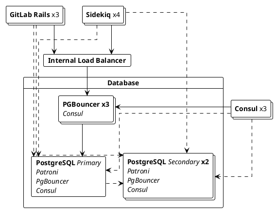



- Tier: Free, Premium, Ultimate
- Offering: GitLab Self-Managed



With database load balancing, read queries are distributed across multiple PostgreSQL nodes to
improve performance and reduce load on the primary database. Write operations always execute on the
primary. GitLab handles query routing automatically with no external load balancer required.

## Requirements

To enable database load balancing:

- PostgreSQL must have one or more secondary nodes replicating the primary.
- Each node must be reachable on the same port and with the same credentials.

For external database services, only the `db_load_balancing` configuration is needed. Connection
pooling can help manage connection counts at scale, but the right approach depends on your provider
and is outside the scope of this guide.
For connection management guidance, see
[connection management](../reference_architectures/_index.md#connection-management).

> [!note]
> [AWS RDS Proxy](https://aws.amazon.com/rds/proxy/) is not validated for use with GitLab.

For Linux package installations, you must configure multi-node HA PostgreSQL before
enabling database load balancing. For more information, see
[configuring a multi-node setup](replication_and_failover.md).

### Replica count

Any number of replicas is supported. In practice, three is a common starting point, particularly
for environments spread across three availability zones. Several GitLab components, including Consul
and Redis Sentinel, rely on quorum and require an odd number of nodes. Keeping your database replica
count aligned with this pattern makes for a more consistent architecture, improves disaster recovery
coverage, and limits the impact of a single availability zone failure. Smaller environments can
start with two replicas and add more as load increases.

For scale-specific guidance, see the
[reference architectures documentation](../reference_architectures/_index.md).

## Configure database load balancing

Database load balancing can be configured in one of two ways:

- [Hosts](#hosts): a static list of PostgreSQL hosts. Simpler to configure and suitable for most
  environments.
- [Service discovery](#service-discovery): a DNS record that returns a list of PostgreSQL hosts.
  Use when the replica list changes dynamically, such as in Linux package HA setups using Consul.

### Hosts

Including the primary in the hosts list is optional. When included, it becomes eligible for read
queries alongside replicas, reducing overall load on the secondaries. If the primary is already
under sustained high load, leaving it out reserves capacity for writes. The primary always handles
write queries regardless of whether it appears in this list.

To configure a list of hosts, perform these steps on all GitLab Rails and Sidekiq nodes for each
environment you want to balance:

1. Edit the `/etc/gitlab/gitlab.rb` file.
1. In `gitlab_rails['db_load_balancing']`, create the array of database hosts to balance. For
   example, on an environment with PostgreSQL running on `primary.example.com`,
   `secondary1.example.com`, and `secondary2.example.com`:

   ```ruby
   gitlab_rails['db_load_balancing'] = { 'hosts' => ['primary.example.com', 'secondary1.example.com', 'secondary2.example.com'] }
   ```

   These hosts must be reachable on the same port configured with `gitlab_rails['db_port']`.

1. Save the file and [reconfigure GitLab](../restart_gitlab.md#reconfigure-a-linux-package-installation).

### Service discovery

Service discovery allows GitLab to automatically retrieve a list of PostgreSQL hosts. It checks
a DNS `A` record periodically, using the returned IP addresses as the replica addresses. To use
service discovery, you need a DNS server and an `A` record containing the IP addresses of your
secondaries.

When using a Linux package installation, the provided [Consul](../consul.md) service works as a
DNS server and returns PostgreSQL addresses through the `postgresql-ha.service.consul` record. The
following diagram shows this deployment model:



To configure service discovery with Consul:

1. On each GitLab Rails / Sidekiq node, edit `/etc/gitlab/gitlab.rb` and add the following:

   ```ruby
   gitlab_rails['db_load_balancing'] = { 'discover' => {
       'nameserver' => 'localhost'
       'record' => 'postgresql-ha.service.consul'
       'record_type' => 'A'
       'port' => '8600'
       'interval' => '60'
       'disconnect_timeout' => '120'
     }
   }
   ```

1. Save the file and [reconfigure GitLab](../restart_gitlab.md#reconfigure-a-linux-package-installation)
   for the changes to take effect.

| Option               | Description                                                                                       | Default   |
|----------------------|---------------------------------------------------------------------------------------------------|-----------|
| `nameserver`         | The nameserver to use for looking up the DNS record.                                              | localhost |
| `record`             | The record to look up. This option is required for service discovery to work.                     |           |
| `record_type`        | Optional record type to look up. Can be either `A` or `SRV`.                                      | `A`       |
| `port`               | The port of the nameserver.                                                                       | 8600      |
| `interval`           | The minimum time in seconds between checking the DNS record.                                      | 60        |
| `disconnect_timeout` | The time in seconds after which an old connection is closed after the list of hosts is updated.   | 120       |
| `use_tcp`            | Look up DNS resources using TCP instead of UDP.                                                   | false     |
| `max_replica_pools`  | The maximum number of replicas each GitLab process connects to. Only applies when using service discovery. Without this limit, every process connects to every replica. Use when running many replicas alongside many GitLab nodes. | nil |

If `record_type` is set to `SRV`, GitLab uses round-robin and ignores the `weight` and `priority`
in the record. Because `SRV` records usually return hostnames instead of IPs, GitLab looks for IP
addresses in the additional section of the `SRV` response. If no IP is found for a hostname, GitLab
queries the configured `nameserver` for an `ANY` record for that hostname, looking for `A` or `AAAA`
records. GitLab drops the hostname from rotation if it cannot resolve its IP.

The `interval` value specifies the minimum time between checks. If the `A` record has a TTL greater
than this value, service discovery honors that TTL. For example, if the TTL is 90 seconds, service
discovery waits at least 90 seconds before checking again.

When the list of hosts is updated, old connections may take time to terminate. Use
`disconnect_timeout` to set an upper limit on how long this takes.

## Stale reads



- [Moved](https://gitlab.com/gitlab-org/gitlab/-/issues/327902) from GitLab Premium to GitLab Free in 14.0.



GitLab checks each secondary's replication status before routing reads to it. If a secondary is
lagging too far behind the primary, it is skipped until it catches up.

| Option                       | Description                                                                                                   | Default    |
|------------------------------|---------------------------------------------------------------------------------------------------------------|------------|
| `max_replication_difference` | The amount of data (in bytes) a secondary is allowed to lag behind when it has not replicated data recently.  | 8 MB       |
| `max_replication_lag_time`   | The maximum number of seconds a secondary is allowed to lag behind before it is skipped.                      | 60 seconds |
| `replica_check_interval`     | The minimum number of seconds between secondary status checks.                                                | 60 seconds |

The defaults are sufficient for most environments.

To configure these options with a hosts list:

```ruby
gitlab_rails['db_load_balancing'] = {
  'hosts' => ['primary.example.com', 'secondary1.example.com', 'secondary2.example.com'],
  'max_replication_difference' => 16777216, # 16 MB
  'max_replication_lag_time' => 30,
  'replica_check_interval' => 30
}
```

## Logging

The load balancer logs various events in
[`database_load_balancing.log`](../logs/_index.md#database_load_balancinglog), such as:

- When a host is marked as offline.
- When a host comes back online.
- When all secondaries are offline.
- When a read is retried on a different host due to a query conflict.

The log is structured with each entry a JSON object containing at least:

- An `event` field useful for filtering.
- A human-readable `message` field.
- Event-specific metadata, for example `db_host`.
- Contextual information that is always logged, for example `severity` and `time`.

For example:

```json
{"severity":"INFO","time":"2019-09-02T12:12:01.728Z","correlation_id":"abcdefg","event":"host_online","message":"Host came back online","db_host":"111.222.333.444","db_port":null,"tag":"rails.database_load_balancing","environment":"production","hostname":"web-example-1","fqdn":"gitlab.example.com","path":null,"params":null}
```

## How database load balancing works

### Balancing queries

Read queries are distributed across all configured database hosts. Write operations always execute
on the primary, regardless of how many replicas are configured.

### Primary sticking

After a write, GitLab temporarily routes reads for that user to the primary for up to 30 seconds.
GitLab reverts to using replicas as soon as they have caught up, rather than always waiting the
full 30 seconds. Background jobs also wait for replicas to catch up after a write before reading,
to avoid stale data.

### Failover handling

If a secondary becomes unavailable, the load balancer routes to the next available host. If no
secondaries are available, reads fall back to the primary.

If a write fails, the operation retries up to 3 times. Restarting a database server does not
immediately cause errors for users.
