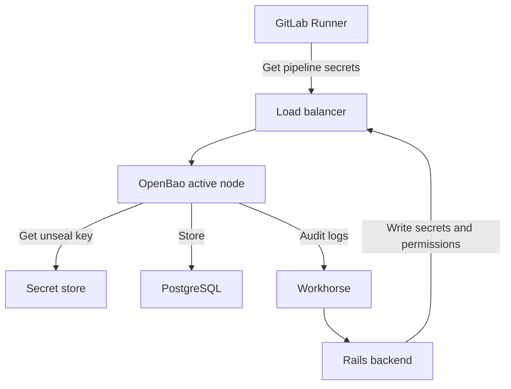



- Tier: Premium, Ultimate
- Offering: GitLab Self-Managed
- Status: Beta





- [Introduced](https://gitlab.com/groups/gitlab-org/-/work_items/16319) in GitLab 18.8 as an experiment, made available to some initial testers in a closed [beta](../../policy/development_stages_support.md#beta) in GitLab 18.8.
- [Changed](https://gitlab.com/groups/gitlab-org/-/work_items/21731) from closed beta to public beta in GitLab 19.0.



The [GitLab Secrets Manager](../../ci/secrets/secrets_manager/_index.md) uses [OpenBao](https://openbao.org/),
an open-source secrets management solution. OpenBao provides secure storage, access control, and lifecycle management
for secrets used in your GitLab instance.

GitLab CI/CD jobs using secrets from the GitLab Secrets Manager must use
[GitLab Runner](https://docs.gitlab.com/runner/#gitlab-runner-versions) 19.0 or later.

## OpenBao architecture

OpenBao integrates with GitLab as an optional component that runs in parallel to existing GitLab services.

- The Rails backend and runners connect to the OpenBao API through a load balancer.
- OpenBao stores data in PostgreSQL.
  The Helm chart configures OpenBao to use a separate logical database on the same PostgreSQL instance.
  Configure the connection using `global.openbao.psql` in the Helm chart.
- OpenBao gets the unseal key from a configured secret store (by default, a Kubernetes secret mounted by the Helm chart).
- OpenBao posts audit logs to the Rails backend when audit logs are enabled.



OpenBao runs with a single active node that handles all requests,
and optionally multiple standby nodes that take over if the active node fails.

## Install OpenBao

Prerequisites:

- Administrator access.
- GitLab 19.0 or later.
- A Kubernetes cluster.
- For Cloud Native GitLab deployments, an external (non-Omnibus) PostgreSQL instance.
  The external PostgreSQL instance is required by the GitLab Helm chart for Cloud Native deployments,
  not by OpenBao specifically. OpenBao uses a separate logical database on that instance.

Choose the installation method based on your GitLab deployment:

- **Cloud Native GitLab**: Use this if you deploy GitLab to Kubernetes.
  For more information, see [OpenBao Helm chart documentation](https://docs.gitlab.com/charts/charts/openbao/).
- **Linux package**: Use this if you deploy GitLab with the Linux package, on a single node or
  across multiple nodes. For more information, see
  [install OpenBao for a Linux package instance](linux_package_integration.md).

After installation, verify that OpenBao is working by following the
[GitLab Secrets Manager user documentation](../../ci/secrets/secrets_manager/_index.md).

## Sizing recommendations

OpenBao resource requirements depend on your GitLab instance size and secret usage patterns.

These recommendations are validated starting points. Monitor your deployment and adjust
resources based on actual usage patterns. Your requirements will differ based on
the number of CI/CD jobs that fetch secrets, and the number of
groups and projects with Secrets Manager enabled.

### Pod resources

OpenBao runs with a single active node that handles all requests.
Additional replicas provide high-availability failover only.
Standby nodes do not serve read traffic because OpenBao does not support
Horizontal Read Scalability (HRS) when connected to a PostgreSQL database.

| Secret fetches/s | CPU request | Memory request | Replicas |
|------------------|-------------|----------------|----------|
| Up to 3          | 500m        | 2 GB           | 2        |
| Up to 6          | 500m        | 3 GB           | 2        |
| Up to 12         | 500m        | 4 GB           | 2        |
| Up to 30         | 500m        | 9 GB           | 2        |
| Up to 60         | 1,000m      | 16 GB          | 2        |
| Up to 150        | 2,000m      | 31 GB          | 2        |

#### Estimate your secret fetch rate

To determine which row applies, estimate your secret fetches per second:

```plaintext
fetches/s = Git Pull RPS × adoption rate × 3
```

Where:

- `Git Pull RPS` is the peak Git pull throughput of your GitLab instance.
  You can measure this from your existing environment monitoring,
  see
  [Extract peak traffic metrics](../reference_architectures/sizing.md#extract-peak-traffic-metrics).
- `adoption rate` is the fraction of CI/CD jobs that use Secrets Manager
  (for example, 0.05 for 5%, 0.20 for 20%, or 0.50 for 50%).
- `3` is the assumed average number of secrets fetched per job that uses the Secrets Manager.

Select the row where **Secret fetches/s** meets or just exceeds your result.
For example, a deployment with a measured 20 Git pull RPS at 20% adoption:
`20 × 0.20 × 3 = 12 fetches/s`. Use at least the **Up to 12** row.

After deployment, verify your estimates against actual usage.
Use the [monitoring queries](#monitor-your-openbao-deployment) to measure resource usage
and scale up to the next row when thresholds are exceeded.

### How resources are calculated

**CPU** is driven by how frequently CI/CD jobs fetch secrets.
Secret write operations (creating or updating secrets) are infrequent relative to pipeline
volume and contribute negligibly to CPU load.
The table uses Git clone rate (Git Pull RPS) as a proxy for CI job rate,
because each CI/CD job begins with a Git clone.
For the formula, see [Estimate your secret fetch rate](#estimate-your-secret-fetch-rate).
Set the CPU limit to twice the CPU request. This provides burst headroom for startup
and provisioning spikes without over-reserving on the node during steady state.

**Memory** is driven by the number of OpenBao namespaces, which corresponds to
the number of GitLab groups and projects with Secrets Manager enabled.
Allocate approximately 5 MB per namespace, plus a 1 GB safety margin,
with a minimum of 2 GB.
Set the memory limit equal to the memory request (Guaranteed QoS class).
OpenBao crashes immediately when it exceeds its memory limit with no graceful degradation.

**Replicas** provide high-availability failover only. Use 2 replicas for all deployments.
OpenBao does not support Horizontal Read Scalability (HRS) with the PostgreSQL storage backend,
so additional replicas provide no throughput benefit.

### Database resources

OpenBao stores its data in a separate PostgreSQL database.
You can colocate it on the same PostgreSQL server as the GitLab databases.
No additional database compute capacity beyond the
[reference architecture PostgreSQL recommendations](../reference_architectures/_index.md)
is required.

#### Database connection pool

The OpenBao Helm chart configures these PostgreSQL connection pool defaults:

| Setting                                              | Default value |
|------------------------------------------------------|---------------|
| `config.storage.postgresql.maxParallel`              | 5             |
| `config.storage.postgresql.maxIdleConnections`       | 2             |

Do not increase these values unless you observe database connection wait time in your monitoring.

#### Database storage

Database storage requirements depend primarily on the total number of secrets.
Each secret, including its metadata and stored versions, requires approximately 13 KB of storage.

| Total secrets  | Estimated storage |
|----------------|-------------------|
| 10,000         | ~130 MB           |
| 50,000         | ~650 MB           |
| 100,000        | ~1.3 GB           |
| 200,000        | ~2.6 GB           |

Storage growth is negligible for all reference architecture tiers.
Allocating 5 to 10 GB of database storage provides ample headroom.

## Enable GitLab Secrets Manager



- [Introduced](https://gitlab.com/gitlab-org/gitlab/-/merge_requests/235502) in GitLab 19.0



When Secrets Manager is enabled for the instance,
you can then enable it for specific [groups and projects](../../ci/secrets/secrets_manager/_index.md#enable-gitlab-secrets-manager).

Prerequisites:

- Administrator access.
- OpenBao must be installed and configured.

To enable the Secret Manager for the instance:

1. In the upper-right corner, select **Admin**.
1. In the left sidebar, select **Settings** > **General**.
1. Expand **GitLab Secrets Manager**.
1. Turn on the **Secrets Manager** toggle.

## Monitor your OpenBao deployment

Use the following queries to verify that your deployment is correctly sized and to
detect when scaling is needed.

### CPU utilization

To measure OpenBao CPU usage:

```prometheus
sum(rate(container_cpu_usage_seconds_total{container="openbao-server"}[5m]))
```

The result is in CPU cores. Multiply by 1,000 to convert to millicores for comparison
with the CPU request values in the sizing table.
If CPU utilization consistently exceeds 50% of the CPU request, consider
scaling up to the next row in the sizing table.

### Memory utilization

To measure OpenBao memory usage:

```prometheus
sum(container_memory_working_set_bytes{container="openbao-server"})
```

The result is in bytes. Memory grows as groups and projects enable Secrets Manager, at approximately
5 MB per namespace. After a restart, memory stabilizes as OpenBao loads namespace metadata
from the database.

To calculate the correct memory request, count the groups and projects with Secrets Manager
enabled and multiply by 5 MB, then add 1 GB. Update your pod resources if the result exceeds
your current memory request. If memory shows a sustained upward trend with no active
provisioning, investigate for potential issues.

### CPU throttling

To detect CPU throttling that may affect latency:

```prometheus
sum(rate(container_cpu_cfs_throttled_periods_total{container="openbao-server"}[5m]))
/
sum(rate(container_cpu_cfs_periods_total{container="openbao-server"}[5m]))
```

A throttle ratio above 0.25 (25%) indicates the CPU limit is too low for the current workload.
When OpenBao is throttled, goroutines waiting for CPU time cause increased secret fetch latency.

### OpenBao metrics

Use OpenBao Prometheus metrics to monitor request latency, storage backend performance, cache
efficiency, and node health.

By default, OpenBao serves metrics on an unauthenticated listener on port `8209` at the path `/v1/sys/metrics`.
Metric names use the `openbao_` prefix, and OpenBao retains metric data for 24 hours.
To change the port, metrics prefix, or retention time, see the
[monitoring configuration options](https://docs.gitlab.com/charts/charts/openbao/#monitoring-configuration-options).

The metrics port is not exposed through a service, so configure your monitoring to scrape the
OpenBao pods directly.

If you use the Prometheus Operator, the GitLab chart includes a PodMonitor
that is disabled by default. To enable it, set `openbao.podMonitor.enabled` to `true`.

These metrics are the most useful for operating the deployment:

| Metric                               | Type    | Description |
|--------------------------------------|---------|-------------|
| `openbao_core_active`                | Gauge   | Whether the node is the active node (`1`) or a standby node (`0`). |
| `openbao_core_unsealed`              | Gauge   | Whether the node is unsealed (`1`) or sealed (`0`). |
| `openbao_core_in_flight_requests`    | Gauge   | Number of requests being processed concurrently. |
| `openbao_core_handle_request`        | Summary | Latency of request handling. |
| `openbao_postgres_get`               | Summary | Time to read an entry from the PostgreSQL storage backend. |
| `openbao_postgres_put`               | Summary | Time to write an entry to the PostgreSQL storage backend. |
| `openbao_postgres_list`              | Summary | Time to list entries in the PostgreSQL storage backend. |
| `openbao_postgres_delete`            | Summary | Time to delete an entry from the PostgreSQL storage backend. |
| `openbao_barrier_get`                | Summary | Time to read an entry through the encryption barrier. |
| `openbao_barrier_put`                | Summary | Time to write an entry through the encryption barrier. |
| `openbao_barrier_list`               | Summary | Time to list entries through the encryption barrier. |
| `openbao_barrier_delete`             | Summary | Time to delete an entry through the encryption barrier. |
| `openbao_cache_hit`                  | Counter | Number of cache hits. |
| `openbao_cache_miss`                 | Counter | Number of cache misses. |
| `openbao_cache_write`                | Counter | Number of cache writes. |
| `openbao_audit_log_request_failure`  | Counter | Number of audit log request failures. |
| `openbao_audit_log_response_failure` | Counter | Number of audit log response failures. |
| `openbao_runtime_alloc_bytes`        | Gauge   | Bytes of memory allocated by the OpenBao process. |

Summary metrics expose `_count`, `_sum`, and quantile series (`0.5`, `0.9`, and `0.99`). To
calculate an average, divide the rate of the `_sum` series by the rate of the `_count` series, as
shown in [Confirm latency is elevated](troubleshooting.md#confirm-latency-is-elevated).

For the thresholds and diagnostic queries that use these metrics, see
[Diagnose slow secret operations](troubleshooting.md#diagnose-slow-secret-operations).

For the complete list of OpenBao metrics, see [OpenBao telemetry metrics](https://openbao.org/docs/internals/telemetry/metrics/all/).

### Health check endpoints

OpenBao provides health check endpoints for monitoring:

- `<your-openbao-url>/v1/sys/health`: Returns the health status of OpenBao
- `<your-openbao-url>/v1/sys/seal-status`: Returns the seal status

You can integrate these endpoints with your monitoring system.

## High availability

OpenBao uses a single active node architecture. One node handles all requests,
and standby nodes provide automatic failover if the active node fails.

### Failover

Standby nodes load all namespace metadata at startup, so promotion to active
requires no additional initialization. The number of namespaces does not affect failover time.

For production deployments:

- Run at least two OpenBao replicas for redundancy.
- Use a highly available PostgreSQL backend.
- Implement monitoring and alerting using the [monitoring queries](#monitor-your-openbao-deployment).

### Upgrade downtime

OpenBao does not support zero-downtime upgrades. During an upgrade, OpenBao
initializes each namespace sequentially on startup. Every group or project with Secrets Manager enabled
counts as one namespace.

To upgrade, it takes approximately 11 seconds per 1,000 namespaces, plus a 5 second baseline.

When OpenBao implements on-demand namespace loading, upgrade downtime will be significantly reduced.
For more information, see
[issue 595721](https://gitlab.com/gitlab-org/gitlab/-/work_items/595721).

## Geo deployment

OpenBao supports [Geo](../geo/_index.md) deployments. OpenBao is deployed on both the primary and
secondary Geo sites, but only the primary site runs an active OpenBao node.

> [!warning]
> OpenBao does not support Geo failover to a secondary site that uses a different domain. If the
> secondary site keeps its own domain instead of updating DNS to point the primary domain to it,
> you must manually re-provision JWT authentication for every project and group where GitLab Secrets
> Manager is enabled. Re-provisioning applies at the root level and for each namespace, and is
> time-consuming for large deployments. A migration tool is being proposed in
> [issue 595722](https://gitlab.com/gitlab-org/gitlab/-/issues/595722). Until a tool exists, update
> DNS records so the primary domain points to the promoted secondary site.

### OpenBao behavior in Geo

On the primary site, OpenBao runs as an active
node connected to a writable PostgreSQL database. On the secondary site, OpenBao runs in standby mode,
connected to a PostgreSQL read replica.

PostgreSQL streaming replication carries all OpenBao data (secrets, policies, authentication
configuration) from the primary to the secondary site automatically.

Both GitLab instances (primary and secondary) connect to the primary OpenBao URL. The secondary
OpenBao deployment remains in standby, and is promoted to active when the secondary
PostgreSQL database becomes writable during a
[Geo failover](../geo/disaster_recovery/_index.md#step-4-optional-promote-the-openbao-ha-cluster).

On the secondary site, OpenBao logs `failed to acquire lock` and
`cannot execute INSERT in a read-only transaction` errors. These errors are expected. OpenBao cannot
acquire the HA leader lock on a read-only database.

### Install OpenBao on a secondary site

Prerequisites:

- Geo must be configured. For more information, see [Set up Geo](../geo/setup/_index.md).
- OpenBao must be installed and working on the primary site before you deploy it on the secondary.
  For more information, see [Install OpenBao](#install-openbao).

1. The secondary OpenBao must use the same unseal configuration as the primary to decrypt replicated data.
   The steps depend on your configured unseal method:

   - Kubernetes secret (default): Copy the `gitlab-openbao-unseal` Kubernetes secret from the
     primary cluster to the secondary cluster:

     ```shell
     kubectl --namespace gitlab get secret gitlab-openbao-unseal -o yaml
     ```

     Apply the exported secret to the secondary cluster. For more information, see
     [Back up the secrets](https://docs.gitlab.com/charts/backup-restore/backup/#back-up-the-secrets).

   - KMS-based auto-unseal: Configure the secondary cluster with the same KMS key.
     For more information, see
     [Unsealing and initialization options](https://docs.gitlab.com/charts/charts/openbao/#unsealing-and-initialization-options).

1. If you plan to update the DNS record of the primary domain to point to the secondary site during failover,
   you might want to configure OpenBao accordingly ahead of time.
   Configure the Helm chart and set the `url` and `jwt_audience` to the primary OpenBao URL:

   ```yaml
   global:
     openbao:
       enabled: true
       url: https://openbao.<primary-domain>
       jwt_audience: https://openbao.<primary-domain>
   ```

   For more information on chart configuration options,
   see the [OpenBao chart documentation](https://docs.gitlab.com/charts/charts/openbao/).

1. Deploy the GitLab Helm chart on the secondary site. OpenBao pods start and remain in standby
   mode. This is expected.

1. On the secondary cluster, check that OpenBao pods are running:

   ```shell
   kubectl --namespace gitlab get pods -l app=openbao
   ```

   All pods should be in `Running` state. Secondary pods do not have the `openbao-active: "true"`
   label. This is expected.

1. Confirm that the active service has no endpoints on the secondary cluster:

   ```shell
   kubectl --namespace gitlab get endpoints gitlab-openbao-active
   ```

   Zero endpoints on the secondary is expected.

1. Test the Secrets Manager by running a CI pipeline that uses a
   [Secrets Manager variable](../../ci/secrets/secrets_manager/_index.md) on the secondary site.

## Troubleshooting

To diagnose deployment, connectivity, provisioning, sealing, database, audit, and Geo
problems, see [Troubleshooting OpenBao](troubleshooting.md).

## Maintenance

To back up and restore OpenBao, manage the recovery key, or recover OpenBao authentication, see
[Maintain OpenBao](maintenance.md).
