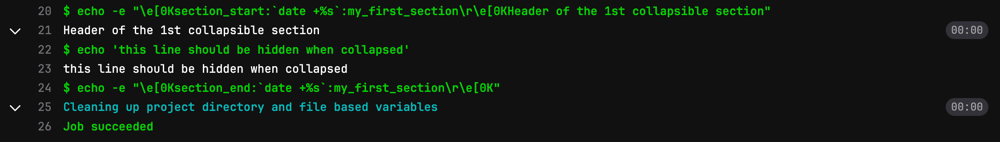
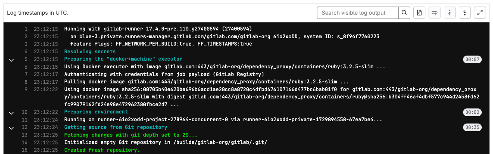



- Tier: Free, Premium, Ultimate
- Offering: GitLab.com, GitLab Self-Managed, GitLab Dedicated



A job log displays the full execution history of a [CI/CD job](_index.md).

## View job logs

To view job logs:

1. Select the project for which you want to view job logs.
1. In the left sidebar, select **CI/CD** > **Pipelines**.
1. Select the pipeline you want to inspect.
1. In the pipeline view, in the list of jobs, select a job to view the job logs page.

To view detailed information about the job and its log output, scroll through the job logs page.

## View job logs in full screen mode

You can view the contents of a job log in full screen mode by clicking **Show full screen**.

To use full screen mode, your web browser must also support it. If your web browser does not support full screen mode, then the option is not available.

## Expand and collapse job log sections



- Multi-line command output in bash shells [introduced](https://gitlab.com/gitlab-org/gitlab-runner/-/merge_requests/3486) in GitLab 16.5 [with a feature flag](https://docs.gitlab.com/runner/configuration/feature-flags/) named `FF_SCRIPT_SECTIONS`. Disabled by default.



> [!flag]
> The availability of this feature is controlled by a feature flag. For more information, see the history.

When `FF_SCRIPT_SECTIONS` is enabled, multi-line script commands appear as collapsible sections
in job logs. Single-line commands are printed directly with a `$` prefix. Durations are not
displayed.

In `powershell` and `pwsh` shells, `FF_SCRIPT_SECTIONS` does not create collapsible sections.
Commands are printed with color output only.

### Create custom collapsible sections

You can create collapsible sections in job logs
by manually outputting special codes
that GitLab uses to delimit collapsible sections:

- Section start marker: `\e[0Ksection_start:UNIX_TIMESTAMP:SECTION_NAME\r\e[0K` + `TEXT_OF_SECTION_HEADER`
- Section end marker: `\e[0Ksection_end:UNIX_TIMESTAMP:SECTION_NAME\r\e[0K`

You must add these codes to the script section of the CI configuration.
For example, using `printf`:

```yaml
job1:
  script:
    - printf '\e[0Ksection_start:%d:%s\r\e[0K%s\n' "$(date +%s)" 'my_first_section' 'Header of the 1st collapsible section'
    - echo 'this line should be hidden when collapsed'
    - printf '\e[0Ksection_end:%d:%s\r\e[0K\n' "$(date +%s)" 'my_first_section'
```

In the example above:

- `date +%s`: Command that produces the Unix timestamp (for example `1560896352`).
- `my_first_section`: The name given to the section. The name can only be composed
  of letters, numbers, and the `_`, `.`, or `-` characters.
- `\r\e[0K`: Escape sequence that prevents the section markers from displaying in the
  rendered (colored) job log. They are displayed when viewing the raw job log, accessed
  in the upper-right corner of the job log by selecting **Show complete raw** ().
  - `\r`: carriage return (returns the cursor to the start of the line).
  - `\e[0K`: ANSI escape code to clear the line from the cursor position to the end of the line.
    (`\e[K` alone does not work; the `0` must be included).

Sample raw job log:

```plaintext
\e[0Ksection_start:1560896352:my_first_section\r\e[0KHeader of the 1st collapsible section
this line should be hidden when collapsed
\e[0Ksection_end:1560896353:my_first_section\r\e[0K
```

Sample job console log:



#### Improve section display with a script

To remove the `printf` statements that create the section markers from the job output,
you can move the job contents to a script file and invoke it from the job:

1. Create a script that can handle the section headers. For example:

   ```shell
   # Function for starting the section
   section_start () {
     local section_title="${1}"
     local section_description="${2:-$section_title}"

     printf '\e[0Ksection_start:%d:%s[collapsed=true]\r\e[0K%s\n' "$(date +%s)" "$section_title" "$section_description"
   }

   # Function for ending the section
   section_end () {
     local section_title="${1}"

     printf '\e[0Ksection_end:%d:%s\r\e[0K\n' "$(date +%s)" "$section_title"
   }

   # Create sections
   section_start "my_first_section" "Header of the 1st collapsible section"

   echo "this line should be hidden when collapsed"

   section_end "my_first_section"

   # Repeat as required
   ```

1. Add the script to the `.gitlab-ci.yml` file:

   ```yaml
   job:
     script:
       - source script.sh
   ```

### Collapse sections by default

To collapse sections by default, add `[collapsed=true]`
to the section start marker, after the section name, and before the `\r`:

- Section start marker with `[collapsed=true]`: `\e[0Ksection_start:UNIX_TIMESTAMP:SECTION_NAME[collapsed=true]\r\e[0K` + `TEXT_OF_SECTION_HEADER`
- Section end marker (unchanged): `\e[0Ksection_end:UNIX_TIMESTAMP:SECTION_NAME\r\e[0K`

Add the updated section start text to the CI configuration. For example,
using `printf`:

```yaml
job1:
  script:
    - printf '\e[0Ksection_start:%d:%s[collapsed=true]\r\e[0K%s\n' "$(date +%s)" 'my_first_section' 'Header of the 1st collapsible section'
    - echo 'this line should be hidden automatically after loading the job log'
    - printf '\e[0Ksection_end:%d:%s\r\e[0K\n' "$(date +%s)" 'my_first_section'
```

## Delete job logs

When you delete a job log you also [erase the entire job](../../api/jobs.md#erase-a-job).

For more details, see [Delete job logs](../../user/storage_management_automation.md#delete-job-logs).

## Timestamps



- Tier: Free, Premium, Ultimate
- Offering: GitLab.com, GitLab Self-Managed, GitLab Dedicated





- [Introduced](https://gitlab.com/gitlab-org/gitlab/-/issues/455582) in GitLab 17.1 [with a feature flag](../../administration/feature_flags/_index.md) named `parse_ci_job_timestamps`. Disabled by default.
- Feature flag `parse_ci_job_timestamps` [removed](https://gitlab.com/gitlab-org/gitlab/-/issues/464785) in GitLab 17.2.
- [Generally available](https://gitlab.com/gitlab-org/gitlab/-/issues/202293) in GitLab 18.9.



By default, job logs include timestamps in the [ISO 8601 format](https://www.iso.org/iso-8601-date-and-time-format.html)
for each line. Use timestamps to troubleshoot performance issues, identify bottlenecks, and measure how long specific build steps take.

When timestamps are enabled, the job log uses approximately 10% more storage space.

The following shows an example of a job log with timestamps:



### Control timestamps in job logs

Prerequisites:

- GitLab Runner 18.7 or later.

To control whether timestamps appear in job logs, use the `FF_TIMESTAMPS` CI/CD variable:

- Set to `false` to disable timestamps
- Set to `true` to explicitly enable timestamps

For example:

```yaml
variables:
  FF_TIMESTAMPS: false  # Disables timestamps

job:
  script:
    - echo "This job's log behavior depends on FF_TIMESTAMPS value"
```

For more information, see [define a CI/CD variable in the `.gitlab-ci.yml` file](../variables/_index.md#define-a-cicd-variable-in-the-gitlab-ciyml-file).

## Troubleshooting

### Job log slow to update

When you visit the job log page for a running job, there could be a delay of up to
60 seconds before a log update. The default refresh time is 60 seconds, but after
the log is viewed in the UI one time, log updates should occur every 3 seconds.

### Error: `This job does not have a trace` in GitLab 18.0 or later

After upgrading a GitLab Self-Managed instance to 18.0 or later, you might see
`This job does not have a trace` errors. This could be caused by a failed upgrade migration
on an instance with both:

- Object storage enabled
- Incremental logging previously enabled with the removed feature flag `ci_enable_live_trace`.
  This feature flag is enabled by default in GitLab Environment Toolkit or Helm Chart deployments,
  but could also be enabled manually.

To restore the ability to view job logs on affected jobs,
[re-enable incremental logging](../../administration/settings/continuous_integration.md#configure-incremental-logging)
