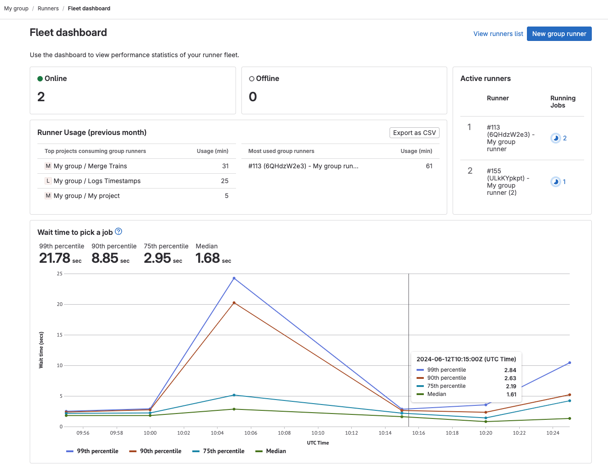



- Tier: Ultimate
- Offering: GitLab Self-Managed



As a GitLab administrator, you can use the runner fleet dashboard to assess the health of your instance runners.
The runner fleet dashboard shows:

- Recent CI errors caused by runner infrastructure
- Number of concurrent jobs executed on most busy runners
- Compute minutes used by instance runners
- Job queue times

## Dashboard metrics



Status: Beta





- **Runner usage** and **Wait time to pick up job** metrics [changed](https://gitlab.com/gitlab-org/gitlab/-/issues/424789) to [beta](../../policy/development_stages_support.md#beta) in GitLab 17.1.



The following metrics are available in the runner fleet dashboard:

> [!note]
> To view **Runner usage** and **Wait time to pick a job** metrics, you must configure the [ClickHouse integration](../../integration/clickhouse.md).
>
> <i class="fa-youtube-play" aria-hidden="true"></i>
> For an overview, see [setting up runner fleet dashboard with ClickHouse](https://www.youtube.com/watch?v=YpGV95Ctbpk).
> <!-- Video published on 2023-12-19 -->

| Metric                        | Description |
|-------------------------------|-------------|
| Online                        | Number of runners that are online for the entire instance. |
| Offline                       | Number of runners that are currently offline. Runners that were registered but never connected to GitLab are not included in this count. |
| Active runners                | The total number of runners that are currently active. |
| Runner usage (previous month) | **Requires ClickHouse**: The total compute minutes used by each project or group runner in the previous month. You can export this data as a CSV file for cost analysis. |
| Wait time to pick a job       | **Requires ClickHouse**: The average time a job waits in the queue before a runner picks it up. This metric provides insights into whether your runners are capable of servicing the CI/CD job queue in your organization's target service-level objectives (SLOs). This data is updated every 24 hours. |

## View the runner fleet dashboard

Prerequisites:

- You must be an administrator.
- To view metrics for **Runner usage** and **Wait time to pick a job**, you must configure the [ClickHouse integration](../../integration/clickhouse.md).

To view the runner fleet dashboard:

1. In the upper-right corner, select **Admin**.
1. In the left sidebar, select **CI/CD** > **Runners**.
1. Select **Fleet dashboard**.

## Export compute minutes used by instance runners

Prerequisites:

- You must have administrator access to the instance.
- You must configure the [ClickHouse integration](../../integration/clickhouse.md).

To analyze runner usage, you can export a CSV file that contains the number of jobs and executed runner minutes. The
CSV file shows the runner type and job status for each project. The CSV is sent to your email when the export is completed.

To export compute minutes used by instance runners:

1. In the upper-right corner, select **Admin**.
1. In the left sidebar, select **CI/CD** > **Runners**.
1. Select **Fleet dashboard**.
1. Select **Export CSV**.
