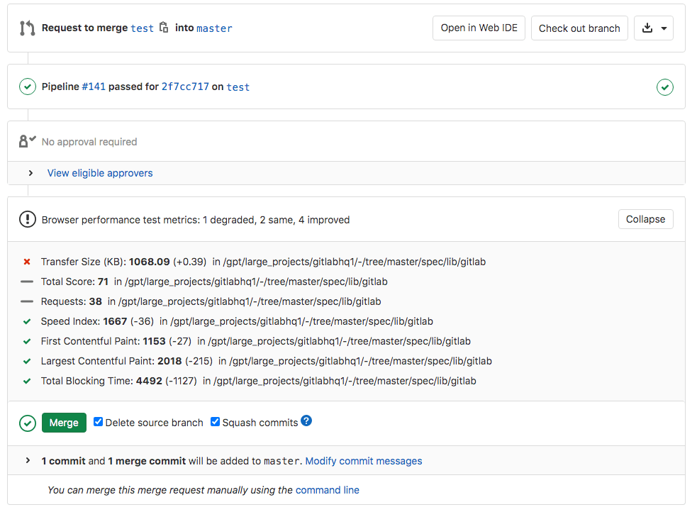



- Tier: Premium, Ultimate
- Offering: GitLab.com, GitLab Self-Managed, GitLab Dedicated



Use browser performance testing to measure the rendering performance of your web application
and detect regressions before they reach production. GitLab uses
[sitespeed.io](https://www.sitespeed.io) to score each page and outputs results in a file
called `browser-performance.json`.

Results are shown directly in the merge request, so you can catch performance regressions
as part of your review process. For example, a JavaScript library added to `<head>` that
drops the page speed score.

> [!note]
> You can automate this feature with [Auto DevOps](../../topics/autodevops/_index.md).

## Browser performance results in merge requests

Define a job in your `.gitlab-ci.yml` file that generates the
[browser performance report artifact](../yaml/artifacts_reports.md#artifactsreportsbrowser_performance).
GitLab checks this report, compares key performance metrics for each page between the source
and target branches, and shows the results in the merge request.



> [!note]
> The widget doesn't display until the job has run at least once on the target branch,
> and only if the job ran in the latest pipeline for the merge request.

## Configure browser performance testing

Prerequisites:

- [GitLab Runner configured with Docker-in-Docker](../docker/using_docker_build.md#use-docker-in-docker).

To run the [sitespeed.io container](https://hub.docker.com/r/sitespeedio/sitespeed.io/)
on your code, use GitLab CI/CD with Docker-in-Docker:

1. In your `.gitlab-ci.yml` file, add the following:

   ```yaml
   include:
     template: Verify/Browser-Performance.gitlab-ci.yml

   browser_performance:
     variables:
       URL: https://example.com
   ```

GitLab creates a `browser_performance` job that runs sitespeed.io against the URL and saves
the full HTML report as a
[browser performance artifact](../yaml/artifacts_reports.md#artifactsreportsbrowser_performance).
If [GitLab Pages](../../user/project/pages/_index.md) is enabled, you can view the report
in your browser.

> [!note]
> This template doesn't work with Kubernetes clusters. Instead, use
> [`template: Jobs/Browser-Performance-Testing.gitlab-ci.yml`](https://gitlab.com/gitlab-org/gitlab/-/blob/master/lib/gitlab/ci/templates/Jobs/Browser-Performance-Testing.gitlab-ci.yml).

You can customize the job with CI/CD variables:

| Variable                   | Default                    | Description |
| -------------------------- | -------------------------- | ----------- |
| `SITESPEED_IMAGE`          | `sitespeedio/sitespeed.io` | Docker image to use. Does not control the version. |
| `SITESPEED_VERSION`        | `14.1.0`                   | Version of the Docker image. |
| `SITESPEED_OPTIONS`        | none                       | Additional sitespeed.io options. For more information, see [sitespeed.io configuration](https://www.sitespeed.io/documentation/sitespeed.io/configuration/). |
| `SITESPEED_DOCKER_OPTIONS` | none                       | Additional options passed to `docker run`, such as `--network` to connect to a specific Docker network. |

For example, to override the number of runs and change the version:

```yaml
include:
  template: Verify/Browser-Performance.gitlab-ci.yml

browser_performance:
  variables:
    URL: https://www.sitespeed.io/
    SITESPEED_VERSION: 13.2.0
    SITESPEED_OPTIONS: -n 5
```

### Configure the degradation threshold

To avoid alerts for minor score drops, set the `DEGRADATION_THRESHOLD` CI/CD variable.
The alert only appears when the `Total Score` degrades by the specified number of points or more.

For example:

```yaml
include:
  template: Verify/Browser-Performance.gitlab-ci.yml

browser_performance:
  variables:
    URL: https://example.com
    DEGRADATION_THRESHOLD: 5
```

`Total Score` is a combined score between 0-100 for performance, accessibility, and best
practices. A score of 100 means the page has no issues to address. For more information,
see [how the coach scores pages](https://www.sitespeed.io/documentation/coach/how-to/#what-do-the-coach-do).

### Configure browser performance testing for review apps

Prerequisites:

- The `browser_performance` job must run after the dynamic environment starts.

To configure browser performance testing for review apps:

1. In the `review` job, generate a URL list file with the dynamic URL:

   ```yaml
      script:
        - echo $CI_ENVIRONMENT_URL > environment_url.txt
   ```

1. Save the file as an artifact:

   ```yaml
      artifacts:
        paths:
          - environment_url.txt
   ```

1. Pass the file as the `URL` variable to the `browser_performance` job.
   For example:

   ```yaml
   stages:
     - deploy
     - performance

   include:
     template: Verify/Browser-Performance.gitlab-ci.yml

   review:
     stage: deploy
     environment:
       name: review/$CI_COMMIT_REF_SLUG
       url: http://$CI_COMMIT_REF_SLUG.$APPS_DOMAIN
     script:
       - run_deploy_script
       - echo $CI_ENVIRONMENT_URL > environment_url.txt
     artifacts:
       paths:
         - environment_url.txt
     rules:
       - if: $CI_COMMIT_BRANCH == $CI_DEFAULT_BRANCH
         when: never
       - if: $CI_COMMIT_BRANCH

   browser_performance:
     dependencies:
       - review
     variables:
       URL: environment_url.txt
   ```
