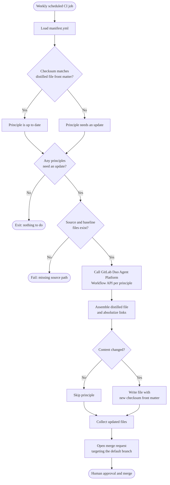

The weekly sync distills AI development principles from documentation.
Review this flow before changing the manifest, the distiller gem, or the sync schedule.

For the step-by-step description, see
[How the sync works](_index.md#how-the-sync-works).

## Distillation flow

Each sync run starts with drift detection and ends with a merge request that updates the distilled files.

## Related

- [Manifest reference](manifest_reference.md) for `.ai/principles/manifest.yml`.
- [`gems/gitlab-ai-principles-distiller`](https://gitlab.com/gitlab-org/gitlab/-/tree/master/gems/gitlab-ai-principles-distiller)
  for the gem that drives the sync.
