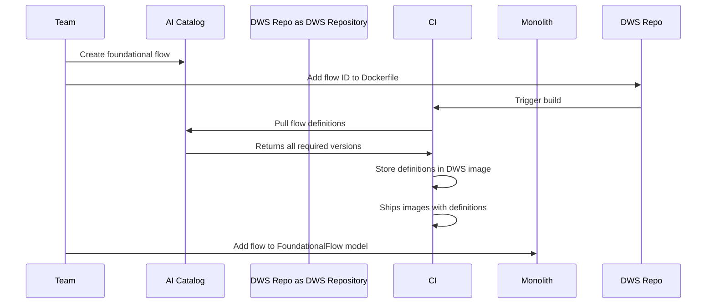
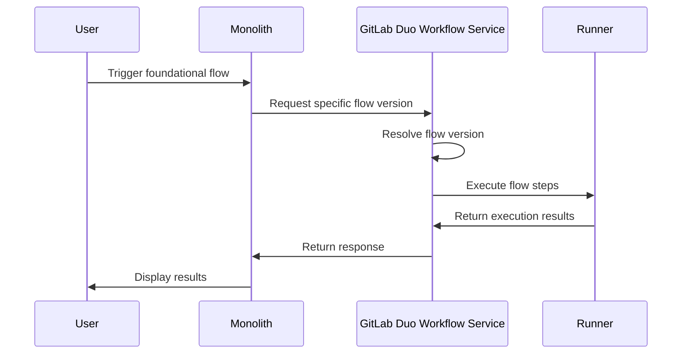

[Foundational flows](../../user/duo_agent_platform/flows/foundational_flows/_index.md) are predefined, structured sequences of steps that orchestrate teams of agents to execute actions and complete tasks. These flows are created and maintained by GitLab, providing reliable automation for specific development workflows. Foundational flows are available by default across GitLab and are supported on GitLab Duo Self-Hosted. Unlike [custom flows](../../user/duo_agent_platform/flows/_index.md), foundational flows are built and shipped by GitLab and cannot be modified by users.

> [!note]
> This guide covers foundational **flows**. For foundational **agents**, see the [foundational chat agents guide](foundational_chat_agents.md). To understand the difference between agents and flows, see the [glossary](glossary.md#gitlab-duo-agent-platform).

## Overview

Foundational flows are GitLab-maintained AI-powered workflows that help users automate development tasks across the software development lifecycle. Unlike foundational chat agents (which are interactive and conversational), foundational flows are:

- **Structured**: Follow a predefined sequence of steps
- **Autonomous**: Execute without continuous human input
- **Task-oriented**: Designed to complete specific, repeatable tasks
- **Trigger-based**: Can be initiated by system events or user actions

For a full list of available foundational flows, see the [foundational flows user documentation](../../user/duo_agent_platform/flows/foundational_flows/_index.md).

## Create a foundational flow

There are two ways of creating a foundational flow: using the AI Catalog or GitLab Duo Workflow Service. AI Catalog provides a user-friendly interface and is the preferred approach, but writing a definition in GitLab Duo Workflow Service provides more flexibility for complex cases.

### Using the AI Catalog

1. Create your flow on the [AI Catalog](https://gitlab.com/explore/ai-catalog/flows/), and note its ID. Make sure the flow is set to public. Example: A flow with ID 123.
1. Flows created on the AI Catalog need to be bundled into GitLab Duo Workflow Service, so they can be available to self-hosted setups that do not have access to our SaaS. To achieve this, open an MR to GitLab Duo Workflow Service adding the ID of the flow:

   ```diff
   # https://gitlab.com/gitlab-org/modelops/applied-ml/code-suggestions/ai-assist/-/blob/main/Dockerfile
   - RUN poetry run fetch-foundational-flows "https://gitlab.com" "$GITLAB_TOKEN" "developer:123" \
   + RUN poetry run fetch-foundational-flows "https://gitlab.com" "$GITLAB_TOKEN" "developer:123,<flow-reference>:<flow-catalog-id>" \
   ```

   The command above can also be executed locally for testing purposes. Flow reference must be lowercase without spaces and should match the pattern used in the flow definition (example: `test_flow`).

1. To make the flow selectable and available to users, add it to the [`FoundationalFlow` model](https://gitlab.com/gitlab-org/gitlab/blob/master/ee/app/models/ai/catalog/foundational_flow.rb) `ITEMS` array. Use the reference used in the Dockerfile:

   ```ruby
   {
     display_name: "Test Flow",
     description: "A flow for testing purposes",
     avatar: "test-flow.png",
     foundational_flow_reference: "<flow-reference>/v1",
     feature_maturity: "experimental",
     ai_feature: "duo_agent_platform",
     pre_approved_agent_privileges: [
       ::Ai::DuoWorkflows::Workflow::AgentPrivileges::READ_WRITE_FILES,
       ::Ai::DuoWorkflows::Workflow::AgentPrivileges::READ_ONLY_GITLAB
     ],
     environment: "web",
     triggers: []
   }
   ```

1. If your flow requires a custom avatar, add the PNG file to the [GitLab SVGs repository](https://gitlab.com/gitlab-org/gitlab-svgs).
1. Update [user-facing documentation](../../user/duo_agent_platform/flows/foundational_flows/_index.md) with information about your new flow.

### Using GitLab Duo Workflow Service

1. Create a flow configuration file in `/duo_workflow_service/agent_platform/v1/flows/configs/` (located either on your GDK under `PATH-TO-YOUR-GDK/gdk/gitlab-ai-gateway` or on the [ai-assist repository](https://gitlab.com/gitlab-org/modelops/applied-ml/code-suggestions/ai-assist/-/tree/main/duo_workflow_service/agent_platform/v1/flows/configs/)):

   File: `/duo_workflow_service/agent_platform/v1/flows/configs/test_flow.yml`

   ```yaml
   version: "v1"
   environment: web
   components:
     - name: "test_flow_agent"
       type: AgentComponent
       prompt_id: "test_flow_prompt"
       inputs:
         - from: "context:goal"
           as: "goal"
         - from: "context:project_id"
           as: "project_id"
       toolset:
         - "read_file"
         - "list_dir"
       ui_log_events: []
   prompts:
     - name: Test Flow Prompt
       prompt_id: "test_flow_prompt"
       model:
         params:
           max_tokens: 4_000
       prompt_template:
         system: |
           You are a helpful assistant that performs automated tasks in GitLab projects.
           Your goal is to help users by executing predefined workflows efficiently.

           Available tools:
           - read_file: Read the contents of a file
           - list_dir: List files in a directory

           Use these tools to complete the user's request.
         user: |
           {{goal}}
         placeholder: history
   routers: []
   flow:
     entry_point: "test_flow_agent"
   ```

1. Add your flow definition to the [`FoundationalFlow` model](https://gitlab.com/gitlab-org/gitlab/blob/master/ee/app/models/ai/catalog/foundational_flow.rb) `ITEMS` array:

   ```ruby
   {
     display_name: "Test Flow",
     description: "A flow for testing purposes",
     avatar: "test-flow.png",
     foundational_flow_reference: "test_flow/v1",
     feature_maturity: "beta",
     ai_feature: "duo_agent_platform",
     pre_approved_agent_privileges: [
       ::Ai::DuoWorkflows::Workflow::AgentPrivileges::READ_WRITE_FILES,
       ::Ai::DuoWorkflows::Workflow::AgentPrivileges::READ_ONLY_GITLAB
     ],
     environment: "web",
     triggers: []
   }
   ```

1. Update [user-facing documentation](../../user/duo_agent_platform/flows/foundational_flows/_index.md) with information about your new flow.

## Flow definition attributes

When adding a flow to the `FoundationalFlow` model, you must provide the following attributes:

| Attribute | Type | Required | Description                                                            |
|-----------|------|----------|------------------------------------------------------------------------|
| `display_name` | String | Yes | User-facing name of the flow (example: "Fix CI/CD Pipeline")           |
| `description` | String | Yes | Brief description of what the flow does                                |
| `foundational_flow_reference` | String | Yes | Unique identifier with version (example: "fix_pipeline/v1")            |
| `feature_maturity` | String | Yes | Maturity level: "experimental", "beta", or "ga"                        |
| `ai_feature` | String | Yes | Associated AI feature name (typically "duo_agent_platform")            |
| `pre_approved_agent_privileges` | Array | Yes | Required permissions (see [Agent Privileges](#agent-privileges))       |
| `avatar` | String | No | Icon filename (must exist in GitLab SVGs)                              |
| `environment` | String | No | Execution environment: "web", "ambient", or "cli" (default: "ambient") |
| `triggers` | Array | No | Event types that can trigger the flow (default: empty array)           |

### Agent privileges

Agent privileges define what actions a flow can perform. The complete list of available privileges is defined in [`AgentPrivileges`](https://gitlab.com/gitlab-org/gitlab/blob/master/ee/app/models/ai/duo_workflows/workflow.rb):

| Privilege | Description |
|-----------|-------------|
| `READ_WRITE_FILES` | Allow local filesystem read/write access |
| `READ_ONLY_GITLAB` | Allow read-only access to GitLab APIs |
| `READ_WRITE_GITLAB` | Allow write access to GitLab APIs |
| `RUN_COMMANDS` | Allow running any commands |
| `USE_GIT` | Allow Git commits, push, and other Git commands |
| `RUN_MCP_TOOLS` | Allow running MCP tools |

Example privilege configuration:

```ruby
pre_approved_agent_privileges = [
  ::Ai::DuoWorkflows::Workflow::AgentPrivileges::READ_WRITE_FILES,
  ::Ai::DuoWorkflows::Workflow::AgentPrivileges::READ_ONLY_GITLAB,
  ::Ai::DuoWorkflows::Workflow::AgentPrivileges::READ_WRITE_GITLAB,
  ::Ai::DuoWorkflows::Workflow::AgentPrivileges::RUN_COMMANDS,
  ::Ai::DuoWorkflows::Workflow::AgentPrivileges::USE_GIT
]
```

### Triggers

Triggers define how flows can be initiated. Available trigger types:

- `::Ai::FlowTrigger::EVENT_TYPES[:assign]`: Triggered when an issue is assigned
- `::Ai::FlowTrigger::EVENT_TYPES[:mention]`: Triggered by `@` mentions
- `::Ai::FlowTrigger::EVENT_TYPES[:schedule]`: Time-based triggers (not yet implemented)

Example trigger configuration:

```ruby
triggers: [::Ai::FlowTrigger::EVENT_TYPES[:assign]]
```

## Use feature flags for releasing flows

Control the release of new foundational flows with feature flags. This allows gradual rollout and tier-specific availability.

Example implementation in a GraphQL resolver:

```ruby
# ee/app/graphql/resolvers/ai/foundational_flows_resolver.rb

def resolve(*, project_id: nil, namespace_id: nil)
  project = GitlabSchema.find_by_gid(project_id)

  filtered_flows = []
  filtered_flows << 'test_flow' if Feature.disabled?(:test_flow_enabled, project)

  ::Ai::Catalog::FoundationalFlow
    .select { |flow| filtered_flows.exclude?(flow.foundational_flow_reference.split('/').first) }
    .sort_by(&:id)
end
```

This approach also enables making a foundational flow available to specific tiers or user groups.

## Versioning

Flow versions are specified in the `foundational_flow_reference` attribute and correspond to a version of the [Flow Registry](https://gitlab.com/gitlab-org/modelops/applied-ml/code-suggestions/ai-assist/-/blob/main/docs/flow_registry/index.md) in GitLab Duo Workflow Service:

- Use `v1` for flows using stable Flow Registry features (example: `fix_pipeline/v1`)
- No foundational flow should ever use `experimental` version of Flow Registry features, as it does not offer any backwards compatibility guarantees

In the future, [version resolution will be based on semantic versioning](https://gitlab.com/gitlab-org/modelops/applied-ml/code-suggestions/ai-assist/-/issues/1577), allowing patch and minor updates to ship to existing GitLab versions without requiring an instance update.

## Local testing

It is possible to test foundational flows locally in your GDK.

### Testing AI Catalog flows

For flows created in AI Catalog, you need to sync the flows locally:

1. Create the flow in your local AI Catalog or on GitLab.com AI Catalog.
1. On `$GDK/gitlab-ai-gateway`, run the following command:

   ```shell
   poetry run fetch-foundational-flows "http://gdk.test:3000 or https://gitlab.com" "<token-to-your-local-gdk>" \
     "<flow-reference>:<flow-id-in-local-catalog>" \
     --output-path duo_workflow_service/agent_platform/experimental/flows/configs
   ```

1. Restart GitLab Duo Workflow Service:

   ```shell
   gdk restart duo-workflow-service
   ```

1. With the changes to the `FoundationalFlow` model, you can now test your foundational flow in the web interface locally.

### Testing GitLab Duo Workflow Service flows

For flows defined directly in GitLab Duo Workflow Service:

1. Create your flow YAML configuration in `duo_workflow_service/agent_platform/v1/flows/configs/` in your local `gitlab-ai-gateway` directory.
1. Add the flow definition to `ee/app/models/ai/catalog/foundational_flow.rb` in your GitLab repository.
1. Restart GitLab Duo Workflow Service:

   ```shell
   gdk restart duo-workflow-service
   ```

1. Test the flow through the GitLab UI or API.

### Debugging tips

- Check GitLab Duo Workflow Service logs: `gdk tail duo-workflow-service`
- Verify flow configuration is loaded: Check the service startup logs
- Test flow execution: Use the GitLab UI to trigger the flow and monitor execution
- Validate permissions: Ensure the flow has the necessary agent privileges
- For more debugging guidance, see the [Flow Registry debugging documentation](https://gitlab.com/gitlab-org/modelops/applied-ml/code-suggestions/ai-assist/-/blob/main/docs/flow_registry/index.md#debugging-flows)

## Architecture design

[Foundational flows](glossary.md#flow-types) are developed by GitLab and must be available to all GitLab deployments (GitLab.com, Self-Managed, and Dedicated).

The architecture of how foundational flows are made available avoids connecting to AI Catalog to fetch definitions at runtime and allows GitLab engineering teams full control over when they are released.

### Foundational flows in monolith

Defining foundational flows in the monolith provides backwards compatibility and release control. The [`FoundationalFlow` model](https://gitlab.com/gitlab-org/gitlab/blob/master/ee/app/models/ai/catalog/foundational_flow.rb) lets teams manage flow versioning per GitLab instance version, and gate availability on conditions like tier, feature flags, or deployment type.

### Bundling into GitLab Duo Workflow Service

Bundling flows into GitLab Duo Workflow Service (via the [ai-assist Dockerfile](https://gitlab.com/gitlab-org/modelops/applied-ml/code-suggestions/ai-assist/-/blob/main/Dockerfile)) makes AI Catalog flows available on self-hosted deployments that cannot reach GitLab.com. This avoids shipping YAML definitions in the monolith: if flow definitions lived in the monolith, fixing a flow would require shipping a full GitLab instance update. By bundling definitions into the DWS image instead, flow fixes can be delivered via a DWS release without requiring an instance upgrade.

The following diagram illustrates how a flow goes from creation to being available in a running instance:



### Usage flow



The execution flows are the same whether the user is using a local monolith, GitLab SaaS, the cloud-connected DWS or a local installation of DWS.

## Tips

1. Test flows in AI Catalog before adding them to the codebase. Create a private flow with the same configuration, enable it on your test project, and iterate until results are satisfactory.
1. Start with minimal agent privileges and add more only as needed.
1. Use descriptive `foundational_flow_reference` names that clearly indicate the flow's purpose (example: `fix_pipeline/v1`, not `fp/v1`).

## Related documentation

- [Foundational flows user documentation](../../user/duo_agent_platform/flows/foundational_flows/_index.md)
- [Foundational chat agents development guide](foundational_chat_agents.md)
- [GitLab Duo Agent Platform glossary](glossary.md#gitlab-duo-agent-platform)
