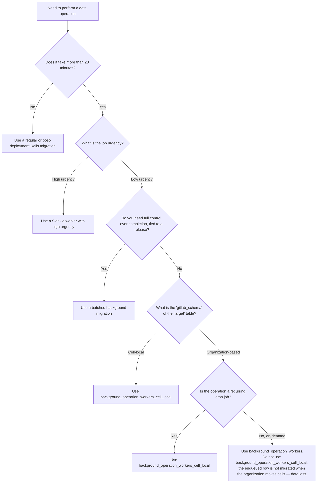

> [!warning]
> This framework is in the initial rollout phase, please reach out to
> `#g_database_architecture` Slack channel while adopting it.

Background operations provide a framework for performing large-scale
data operations on GitLab databases. Unlike
[batched background migrations](batched_background_migrations.md) (BBM), which run
once to completion during upgrades, background operations support both
recurring cron-scheduled execution and on-demand programmatic execution via
the `.enqueue` API.

For one-time data migrations tied to a release, use
[batched background migrations](batched_background_migrations.md) instead.

## When to use background operations

Use a background operation when you need to perform a data operation on
a large table that cannot complete within a single execution window.

Background operations are appropriate when:

- Deleting or updating rows on a recurring schedule (for example, purging stale data).
- Performing ongoing data hygiene that must run continuously, not just during upgrades.
- Triggering a one-off large-scale data operation programmatically from application code.
- Operating on [high-traffic tables](../migration_style_guide.md#high-traffic-tables)
  where a single pass would exceed safe execution time.

Do not use background operations for schema changes or operations
that can complete within
[regular migration time limits](../migration_style_guide.md#how-long-a-migration-should-take).

### Decision tree



## How background operations work

A background operation is a subclass of
`Gitlab::BackgroundOperation::BaseOperationWorker` that defines a `perform`
method. Operations can be scheduled in two ways:

- **Cron-based**: A cron job (`Database::BackgroundOperation::CronEnqueueWorker`)
  triggers the operation on a configured schedule.
- **On-demand**: Application code calls `Worker.enqueue` to create and execute
  the operation programmatically.

Each invocation processes a batch of rows using cursor-based keyset iteration,
picks up where the last run left off, and yields sub-batches to user-defined logic.

All operation classes must be defined in the namespace
`Gitlab::BackgroundOperation`. Place files in the directory
`lib/gitlab/background_operation/`.

### Execution mechanism

Background operations follow the same execution pipeline as BBM
(Scheduler → Orchestrator → Runner → Executor). See the
[BBM execution mechanism](batched_background_migrations.md#execution-mechanism)
for details. The key difference is that background operations use cursor-based
keyset pagination instead of primary key range batching.

The worker tables are list-partitioned for lock-free concurrent execution.
A partial unique index on unfinished statuses prevents duplicate operations
with the same configuration.

Older partitions (> 14 days) get dropped automatically once all its workers in them get completed.

### Cells compatibility

Background operations are stored in 2 different tables to have appropriate sharding keys for [organization isolation](https://handbook.gitlab.com/handbook/engineering/architecture/design-documents/organization/isolation/).

#### Organization specific

Organization specific operations should be enqueued to `background_operation_workers`.
It requires `organization_id` and `user_id` and are created on-demand only by `non-admin` users.

The organization sharding key can be set using `Current.organization` while [enqueuing](https://gitlab.com/gitlab-org/gitlab/blob/5a25a0d0f7f151fe5e523dd0465f9447a6676ab4/lib/gitlab/database/background_operation/queueable.rb).

User triggered actions performing large data operations within their organization are good candidates for this.

Example:

- [Todos::DeleteAllDoneWorker](https://gitlab.com/gitlab-org/gitlab/blob/f29a31bda387e8f8758d787a43b018943bdc3a3f/app/workers/todos/delete_all_done_worker.rb)

#### Cell local

`background_operation_workers_cell_local` stores cell-local operations without
organization context. Since these are not associated to an organization, it has `gitlab_shared_cell_local` schema and
will not be transferred while migrating organizations to new cells.

These records are created only by recurring cron jobs.

Operations (eg: recurring cron jobs) dealing with large data across organizations are good candidates for cell local workers.

Examples:

- [Projects::InactiveProjectsDeletionCronWorker](https://gitlab.com/gitlab-org/gitlab/blob/e9daa41235e394a727fb5c05d51f8d918e3df037/app/workers/projects/inactive_projects_deletion_cron_worker.rb) (can be ported)
- [BackgroundOperation::EnvironmentsAutoDelete](https://gitlab.com/gitlab-org/gitlab/blob/80c2c1cacebeb0961c5f8e307d4321fb017f3d06/lib/gitlab/background_operation/environments_auto_delete.rb)
- [BackgroundOperation::UsersDeleteUnconfirmedSecondaryEmails](https://gitlab.com/gitlab-org/gitlab/blob/80c2c1cacebeb0961c5f8e307d4321fb017f3d06/lib/gitlab/background_operation/users_delete_unconfirmed_secondary_emails.rb)

The same split applies to the jobs tables (`background_operation_jobs` and
`background_operation_jobs_cell_local`).

Please see [how-to](#how-to) sections for more details on how to create these BO workers.

#### What happens when organizations migrate to a new cell

**Organization specific:**

- Workers specific to the organization getting moved will be [stopped](https://gitlab.com/gitlab-org/gitlab/blob/b81c166a3113c618ab9eefafdc370371ce089e72/lib/gitlab/database/background_operation/common_worker.rb#L124)
in the source cell, moved (since they have the corresponding sharding key) and then restarted from the target cell.
- Also these workers will skip processing while the organization is in read-only mode. This will be implemented once
  Organization [read-only mode](https://gitlab.com/groups/gitlab-org/-/work_items/20404) gets shipped.
- The data related to these workers will be migrated to the target cell. Execution of these workers will continue on the target once the organization is fully migrated.

**Cell local:**

When the organization enters the read-only mode, background operations scheduler will be paused (using the [FF](https://gitlab.com/gitlab-org/gitlab/blob/c90095a440e72fbf6801f44c1a5cdfbad991cb9a/app/workers/database/background_operation/base_scheduler_worker.rb#L14)) and the queue will be drained in the source cell.
It will be resumed post migration in both source and the target cell.

Since cell-local workers are created only from recurring cronjobs ([work_items/603423](https://gitlab.com/gitlab-org/gitlab/-/work_items/603423)), upcoming cronjobs will handle the unprocessed data in the target cell.

#### Group transferring into an organization

Org-specific background workers have to handled while a group getting [transferred](https://gitlab.com/groups/gitlab-org/-/work_items/19841) to an organization.

[Restrict org-specific background operations only for non-administrators](https://gitlab.com/gitlab-org/gitlab/-/work_items/603316) ensures `background_operation_workers` has only
`non-admin` users, those users background_operation_workers will be updated with the new `organization_id` while the TLG is transferred to an organization.

Reference: [work_items/603315](https://gitlab.com/gitlab-org/gitlab/-/work_items/603315)

### Resume from previous progress

When a new operation is enqueued with the same `job_class_name`,
`table_name`, `column_name`, and `job_arguments` (see
[Duplicate detection](#duplicate-detection)), the framework automatically
resumes from where the previous operation left off instead of re-scanning
the entire table from the beginning.

Operations that need to start from the beginning of the table on every run
can declare `reset_cursor!` in the operation class:

```ruby
class MyOperation < BaseOperationWorker
  operation_name :delete_all
  cursor :id
  reset_cursor!

  def perform
    each_sub_batch { |sub_batch| sub_batch.delete_all }
  end
end
```

Alternatively, pass an explicit `min_cursor` when calling `.enqueue`.

### Duplicate detection

A partial unique index on unfinished statuses (`queued`, `active`, `on_hold`)
prevents multiple operations with the same configuration from running
concurrently. This is necessary because running duplicate operations on the
same table and column range would cause redundant work, increase database load,
and risk data integrity issues from concurrent mutations on the same rows.

When using `.enqueue`, the framework checks for existing unfinished operations
with the same configuration (`job_class_name`, `table_name`, `column_name`,
`job_arguments`). If a duplicate is found, the enqueue is skipped and a warning
is logged. Operations in `finished` or `failed` status do not block new enqueues.

### Idempotence

Background operation workers execute within Sidekiq. Jobs must be idempotent.
Design your `perform` method so that re-processing the same rows produces
the same outcome.

### Throttling and isolation

Background operations share the same
[database health checks](batched_background_migrations.md#throttling-batched-migrations)
and [isolation constraints](batched_background_migrations.md#isolation) as BBM.

## How to

### Schedule via cron (recurring operations)

Use cron scheduling for operations that must run indefinitely on a fixed
interval — for example, purging expired data every hour.

#### 1. Define the operation class

Create a file in `lib/gitlab/background_operation/`:

```ruby
# frozen_string_literal: true

module Gitlab
  module BackgroundOperation
    class PurgeExpiredTokens < BaseOperationWorker
      operation_name :delete_all
      feature_category :system_access
      cursor :id

      def perform
        each_sub_batch do |sub_batch|
          sub_batch.where(revoked: true).delete_all
        end
      end
    end
  end
end
```

Key DSL methods:

- `operation_name`: A symbol describing the SQL operation (for example, `:delete_all`,
  `:update_all`). Used for instrumentation.
- `feature_category`: The feature category that owns this operation.
- `cursor`: One or more column names used for keyset pagination. Use the table's
  primary key. For composite primary keys: `cursor :partition_id, :id`.
- `scope_to`: A lambda that filters the relation at both the batching and
  sub-batch level. See [Filter rows with `scope_to`](#filter-rows-with-scope_to).
- `reset_cursor!`: Resets the cursor to `MIN(column)` on each run instead
  of resuming from the previous worker's `max_cursor`. Use with
  time-dependent filters.

#### 2. Configure the cron job

Add an entry to `config/schedule.yml` (FOSS) or `ee/config/schedule.yml` (EE):

```yaml
bbo_users_delete_unconfirmed_secondary:
  class: Database::BackgroundOperation::CronEnqueueWorker
  cron: "0 * * * *"
  args:
    job_class_name: UsersDeleteUnconfirmedSecondaryEmails
    table_name: emails
    column_name: id
```

Configuration fields:

- `class`: Always `Database::BackgroundOperation::CronEnqueueWorker`.
- `cron`: Standard cron expression for the schedule.
- `args`: A hash containing:
  - `job_class_name`: The class name of your operation (without the
    `Gitlab::BackgroundOperation::` prefix).
  - `table_name`: The database table to iterate over.
  - `column_name`: The column used for cursor-based iteration.

### Schedule via enqueue (on-demand operations)

Use `.enqueue` for operations triggered programmatically — for example, a bulk
cleanup initiated by application logic or a service.

```ruby
Gitlab::Database::BackgroundOperation::Worker.enqueue(
  'MyOperationClass',
  'target_table',
  'id',
  job_arguments: %w[arg1 arg2],
  user: current_user,
  organization: Current.organization
)
```

Parameters:

- `job_class_name`: The operation class name.
- `table_name`: The database table to iterate over.
- `column_name`: The cursor column.
- `job_arguments` (optional): An array of string arguments. Defaults to `[]`.
- `min_cursor` (optional): An array specifying the starting cursor position.
  When omitted, the framework resumes from the previous operation's last
  cursor or falls back to `MIN(column)`.
- `user`: The user initiating the operation.
- `organization`: Since this is a user triggered action, `Current.organization` will already be available and that has to
  be passed along.

The framework automatically checks for duplicates, estimates
`total_tuple_count` via `pg_class`, sets default batch parameters, and resolves
the correct database connection based on the table's `gitlab_schema`.

For operations without organization context, use `WorkerCellLocal`:

```ruby
Gitlab::Database::BackgroundOperation::WorkerCellLocal.enqueue(
  'MyOperationClass',
  'target_table',
  'id'
)
```

### Filter rows with `scope_to`

Use `scope_to` when the operation targets a subset of rows. The filter
applies to both batch boundary calculation and sub-batch iteration, so
the batching strategy skips non-matching rows entirely.

Without `scope_to`, filtering happens inside `each_sub_batch` and batches
still cover the full primary key range.

> [!warning]
> The scoped condition must be backed by an index. Without a supporting
> index, `scope_to` degrades batching performance.

```ruby
scope_to ->(relation) { relation.where('expires_at < ?', Time.current) }

def perform
  each_sub_batch do |sub_batch|
    sub_batch.delete_all
  end
end
```

The lambda runs in the context of the job instance, so it can access
instance methods and job arguments.

> [!note]
> The `each_sub_batch` block must return an integer for `affected_rows`
> metrics to be recorded. Methods like `delete_all` return an integer by
> default. If you add logic after the deletion, return the count
> explicitly:
>
> ```ruby
> each_sub_batch do |sub_batch|
>   deleted = sub_batch.delete_all
>   do_something_else
>   deleted
> end
> ```

By default, recurring operations resume from the previous worker's
`max_cursor`. Use `reset_cursor!` to start from `MIN(column)` instead.
This prevents skipping rows that become eligible between runs
(for example, time-dependent filters like `created_at < 3.days.ago`).

```ruby
scope_to ->(relation) { relation.where('expires_at < ?', Time.current) }
reset_cursor!
```

## Monitoring

Background operations emit structured logs and Prometheus metrics for
observability.

### Structured logs

The framework logs events to `Gitlab::AppLogger` on state transitions and
batch size optimizations. Filter by the following `message` values:

- `background_operation_worker_transition_event`: Logged when an operation
  changes state (for example, `queued` → `active`, `active` → `finished`).
  Includes `job_class_name`, `table_name`, `previous_state`, and `new_state`.
- `background_operation_job_transition_event`: Logged when an individual job
  changes state. Includes `attempts`, `exception_class`, and
  `exception_message` on failure.
- `background_operation_worker_optimization_event`: Logged when the batch size
  is adjusted. Includes `old_batch_size` and `new_batch_size`.

### Prometheus metrics

The following metrics are exported after each job execution:

| Metric | Type | Description |
|---|---|---|
| `background_operation_job_batch_size` | Gauge | Current batch size |
| `background_operation_job_sub_batch_size` | Gauge | Current sub-batch size |
| `background_operation_job_interval_seconds` | Gauge | Interval between batches |
| `background_operation_job_duration_seconds` | Gauge | Duration of the last job |
| `background_operation_job_updated_tuples_total` | Counter | Cumulative tuples processed |
| `background_operation_job_query_duration_seconds` | Histogram | Query timings per operation |
| `background_operation_worker_migrated_tuples_total` | Gauge | Total tuples migrated so far |
| `background_operation_worker_total_tuple_count` | Gauge | Estimated total tuples to process |
| `background_operation_worker_last_update_time_seconds` | Gauge | Unix timestamp of last update |

All metrics are labeled with `migration_id` and `migration_identifier`
(`job_class_name/table_name.column_name`).
