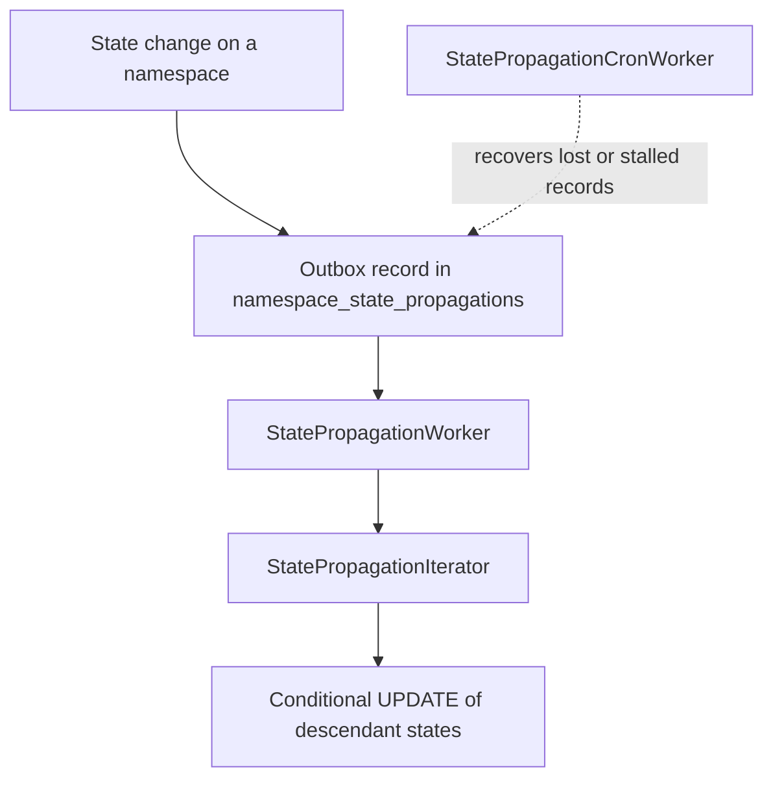
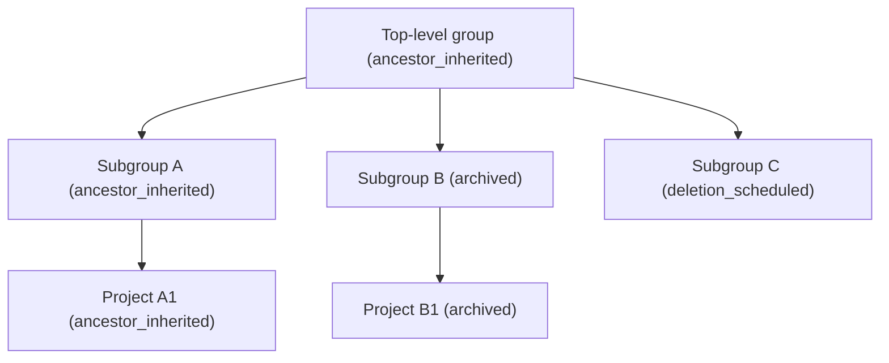
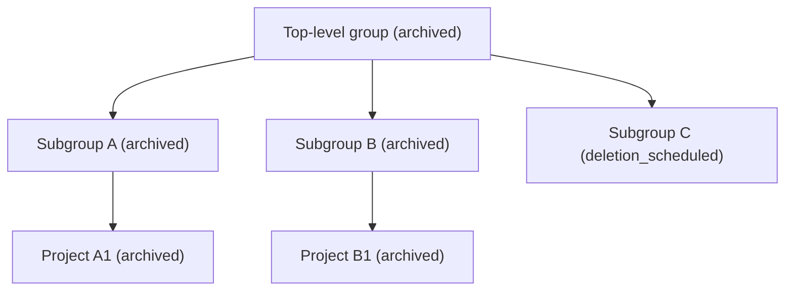

GitLab represents the namespace hierarchy as a tree.
The root element is the top-level namespace, and the child elements are subgroups and `Namespaces::ProjectNamespace` records.
Each namespace has a state, such as `ancestor_inherited` (the default, active state), `archived`, or `deletion_scheduled`.
When you set a state on a namespace, GitLab applies that state to every descendant in the tree.

For the structure of the namespace tree itself, see [Namespaces](namespaces.md).
For the underlying batch iteration algorithm, see [Batch iteration in a tree hierarchy](database/poc_tree_iterator.md).

## Why propagation instead of lookup

The original model determined the effective state of a namespace by traversing up the ancestor chain at read time.
A read of a deeply nested project checked each ancestor until it found a state.
This approach had several problems:

- Every state check added query overhead because it walked the hierarchy.
- The effective state was inferred differently across descendants.
- Caching was required to keep read performance acceptable, which added complexity.

The propagation model writes the resulting state to every descendant when the state changes on a namespace.
Reads then become a single-column comparison, with no ancestor traversal.
The trade-off is that writes do more work, and that work happens asynchronously.

For more information, see
[ADR 003: State propagation model](https://handbook.gitlab.com/handbook/engineering/architecture/design-documents/group_and_project_operations_and_state_management/decisions/003_state_propagation_model/).

## States that propagate

These states participate in propagation:

| State                | Precedence | Description                                  |
|----------------------|------------|----------------------------------------------|
| `ancestor_inherited` | 0          | The default, active state                    |
| `archived`           | 1          | The namespace and its descendants are archived |
| `deletion_scheduled` | 2          | The namespace and its descendants are scheduled for deletion |
| `maintenance`        | 6          | The namespace and its descendants are in a read-only mode during an organization transfer |

The precedence values mirror the canonical namespace state enum, so `maintenance` uses `6` rather than a contiguous rank.
Only the ordering matters for precedence comparisons, and `maintenance` has the highest precedence.

A higher precedence state wins over a lower one.
A lower-precedence propagation does not overwrite a descendant that is already in a higher-precedence state.
For example, a namespace that is `deletion_scheduled` does not change when an ancestor propagates `archived`.

The `maintenance` state puts a namespace and its descendants into a read-only mode so the whole hierarchy is prepared for an organization transfer.
The `maintenance` state is not yet used, and its propagation is not yet fully wired up.

Other states, such as `transfer_in_progress` and `transfer_scheduled`, do not propagate.
A namespace-level transfer affects only the selected namespace, not the effective state of its descendants.

## Components

Propagation uses four components that work together.



### Transactional outbox

When a namespace state changes, GitLab writes the state change and an outbox record in the same database transaction.
The outbox record is a row in the `namespace_state_propagations` table.
Because both writes commit together, the propagation request cannot be lost.
If the worker that processes the record crashes, the record remains and is retried.

This pattern is the
[transactional outbox](https://microservices.io/patterns/data/transactional-outbox.html).
The `Namespaces::StatePropagation` model stores the originating `namespace_id`, the `source_state`, the `target_state`, and a `status` of `pending` or `processing`.
A unique partial index prevents more than one in-flight record for the same namespace and target state.

### State precedence

The `Namespaces::Stateful::StatePrecedence` module decides which descendant states a propagation may overwrite.
The `overwritable_states(source_state, target_state)` method returns the descendant states that the propagation can change, based on the precedence table.

The set of overwritable states depends on both the target state and the state the namespace is leaving:

| Source state         | Target state         | Overwritable descendant states         | Reason                                          |
|----------------------|----------------------|-----------------------------------------|-------------------------------------------------|
| `ancestor_inherited` | `archived`           | `ancestor_inherited`                    | Archive active descendants                      |
| `ancestor_inherited` | `deletion_scheduled` | `ancestor_inherited`, `archived`        | Schedule deletion for active and archived descendants |
| `archived`           | `deletion_scheduled` | `ancestor_inherited`, `archived`        | Schedule deletion for active and archived descendants |
| `archived`           | `ancestor_inherited` | `archived`                              | Unarchive, but stop at `deletion_scheduled`     |
| `deletion_scheduled` | `ancestor_inherited` | `deletion_scheduled`, `archived`        | Restore everything the deletion swept up        |

When the source and target states have equal precedence, or the combination is unsupported, the method returns an empty array and no descendant changes.

### State propagation worker

`Namespaces::StatePropagationWorker` performs the propagation.
For a given `namespace_id` and `target_state`, the worker:

1. Finds the pending outbox record and marks it `processing`.
1. Computes the overwritable states with `StatePrecedence`.
1. Drives the iterator over descendants in batches.
1. Applies a conditional update for each batch.
1. Deletes the outbox record when propagation completes.

The conditional update only changes descendants that are still in an overwritable state:

```sql
UPDATE namespaces
SET state = :target_state
WHERE id IN (:batch_ids)
  AND state IN (:overwritable_states)
```

If the worker fails partway through, the outbox record stays in the table and the reconciliation worker re-enqueues the record.

### State-aware iterator

`Gitlab::Database::Namespaces::StatePropagationIterator` is a subclass of the namespace tree iterator described in
[Batch iteration in a tree hierarchy](database/poc_tree_iterator.md).
The base iterator walks the hierarchy depth-first and returns descendant IDs in batches.
The subclass adds a `state_filter` that constrains the walk to namespaces whose state is in the filter.

The worker passes the overwritable states plus the target state as the filter.
The target state is included so the walk does not stop at the origin namespace, which the caller already transitioned to the target state.
The conditional update then guarantees that only descendants in an overwritable state change.

### Reconciliation worker

`Namespaces::StatePropagationCronWorker` recovers lost or stalled propagation jobs.
On a fixed schedule defined in `config/schedule.yml`, the worker:

1. Resets `processing` records that exceeded the stuck threshold back to `pending` and clears `started_at`.
1. Re-enqueues all `pending` records with `StatePropagationWorker`.

Deduplication on `StatePropagationWorker` ensures that a record still being processed is not run twice.

## Walkthrough

Consider this hierarchy, where each node shows its current state:



When you archive the top-level group, the propagation runs with `source_state` of `ancestor_inherited` and `target_state` of `archived`.
`StatePrecedence.overwritable_states(:ancestor_inherited, :archived)` returns `[:ancestor_inherited]`, so only active descendants change.

The result is:



In this example:

- Subgroup A and project A1 change from `ancestor_inherited` to `archived`.
- Subgroup B and project B1 are already `archived`, so they do not change.
- Subgroup C stays `deletion_scheduled` because `deletion_scheduled` has higher precedence than `archived`.

## Foundational merge requests

The propagation algorithm was built across several merge requests:

- [Add the namespace state propagation iterator](https://gitlab.com/gitlab-org/gitlab/-/merge_requests/237682) adds the `StatePropagationIterator`.
- [Add `Namespaces::Stateful::StatePrecedence`](https://gitlab.com/gitlab-org/gitlab/-/merge_requests/241091) adds the overwritable states logic.
- [Add `Namespaces::StatePropagationWorker`](https://gitlab.com/gitlab-org/gitlab/-/merge_requests/242220) adds the propagation worker.
- [Add `Namespaces::StatePropagationCronWorker`](https://gitlab.com/gitlab-org/gitlab/-/merge_requests/242221) adds the reconciliation worker.

For the overall plan, see
[epic 21607](https://gitlab.com/groups/gitlab-org/-/epics/21607).
