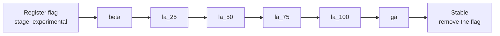

You ship an organization feature by gating it behind an *organization flag* and moving that flag through a fixed ladder of shared *stages*.
The stages are Experimental, Beta, Limited Availability (LA), and GA, each reaching a wider audience than the last.

You only ever change one thing: the stage.
The stages are backed by a small fixed set of shared *stage flags* (`org_stage_*`), one per stage, each already configured with that stage's audience and rollout.
You do not create a flag or tune its actors or percentages.
To advance a feature, you raise its organization flag's stage in a merge request, and it inherits that stage's rollout.
This is the main way the process departs from the usual GitLab feature flag workflow, where each feature owns its own feature flag and drives its own rollout.

The handbook defines the model: the stages, their audiences, target platforms, and rollout rules.
See [Organizations release stages](https://handbook.gitlab.com/handbook/engineering/infrastructure-platforms/tenant-scale/organizations/release-stages/).
That page is the source of truth, written for everyone working on Organizations, including product and design.
This page is the engineering guide.

Releasing a feature has four steps:

1. [Gate your feature](#gate-your-feature) with the release layer.
1. [Register your organization flag](#register-your-organization-flag) at a starting stage.
1. [Test your feature](#test-your-feature) with the release spec helper.
1. [Advance it through the stages](#advance-it-through-the-stages) until it reaches Stable.

## Gate your feature

Wrap the feature in the release layer, `Organizations::Release`, which sits between feature code and the feature flag library.
Ask the layer whether the organization flag is enabled rather than checking a feature flag directly:

```ruby
return unless Organizations::Release.enabled?(:ui_for_organizations, actor)
```

The layer looks up the organization flag's stage, maps the stage to its shared stage flag, and checks that stage flag against the actor.
The actor is the subject the stage flag is rolled out over, such as the current user or organization.
Pass `nil` to check the stage flag's instance-wide gate.

The layer passes the actor straight through to the feature flag library, like a direct `Feature.enabled?` check.
Pass a consistent actor type at every call site for an organization flag, because the shared stage flags bucket by actor type for percentage rollouts.
See [How the stage flags are operated](#how-the-stage-flags-are-operated).

## Register your organization flag

Declare the organization flag in `config/organizations_release.yml`:

```yaml
flags:
  - name: ui_for_organizations
    description: Browse and manage an organization through its dedicated UI.
    stage: experimental
```

- `name`: the identifier you pass to `Organizations::Release.enabled?`.
- `stage`: the stage the feature starts at, usually `experimental`. One of `experimental`, `beta`, `la_25`, `la_50`, `la_75`, `la_100`, or `ga`.

## Test your feature

Toggle the organization flag in specs with `stub_organization_release`, which is available in every spec:

```ruby
stub_organization_release(:ui_for_organizations, enabled: true)
stub_organization_release(:ui_for_organizations, enabled: false)
```

Like regular feature flags, the backing stage flags are enabled by default in tests, so gated code runs unless you disable it with `enabled: false`.

The helper resolves the organization flag through the registry to whichever stage flag currently backs it, then stubs that stage flag.
Specs do not hard-code a stage, so they keep testing the right flag when the feature advances to another stage.

The helper toggles the backing stage flag, so it enables or disables the whole stage, not just that capability.
Every organization flag at the same stage flips together, the same as the shared stage flags in production.

## Advance it through the stages

Advance the feature by raising its `stage` one step at a time. Each change is a merge request:



Not every stage is mandatory. The handbook defines the path. In summary:

| Stage | Required? | Notes |
|-------|-----------|-------|
| Experimental | Optional | Skip when appropriate. An organization flag can start at Beta. |
| Beta | Required | Do not skip. |
| LA 25, 50, 75 | Optional | Intermediate increments can be skipped. |
| LA 100 | Required before GA | An organization flag reaches LA 100 before GA. |
| GA | Optional | The release point for GitLab Self-Managed and GitLab Dedicated. Minor changes can settle straight into Stable. |
| Stable | Terminal | Every organization flag ends here, and the feature is no longer gated. |

To roll the feature back, lower the organization flag's `stage` the same way.

Reaching GA also requires shipping `org_stage_ga` as `default_enabled: true`. That stage flag is what carries the feature to GitLab Self-Managed and GitLab Dedicated.

Reaching Stable means leaving the system entirely: remove the organization flag's `config/organizations_release.yml` entry, and replace its `Organizations::Release.enabled?` call sites with the unconditional behavior.
The shared stage flags stay in place for the other organization flags at that stage.
Stable is not a `stage` value you set.

High-risk features can skip the shared stage flags entirely and use their own feature flags instead.

## How the stage flags are operated

You normally won't touch this. Advancing a feature is a `stage` change (see [Advance it through the stages](#advance-it-through-the-stages)).
This section is how the shared stage flags are set up and maintained.

Each stage maps to one shared `ops` stage flag, defined in `lib/organizations/release/stage.rb`:

| Stage | Stage flag |
|-------|------------|
| Experimental | `org_stage_experimental` |
| Beta | `org_stage_beta` |
| LA 25 to 100 | `org_stage_la_25` to `org_stage_la_100` |
| GA | `org_stage_ga` (`default_enabled: true`) |

The ChatOps commands here configure these shared stage flags, not any single organization flag.
A stage flag's configuration is the same for every organization flag at that stage.
Because a stage flag is shared, every organization flag at that stage shares its gates, and an actor sees a feature when it matches any gate.
Flipper combines a stage flag's gates with a logical OR, so one stage flag can serve several audiences at once.

The Experimental and Beta stage flags enable specific actors:

```shell
/chatops run feature set --group=gitlab-org/organizations org_stage_experimental true
/chatops run feature set --group=a-customer-group org_stage_beta true
```

The actor is polymorphic.
A specific-actor gate accepts any type GitLab supports as a feature flag actor (`Feature::SUPPORTED_MODELS`): an organization, a user, a group, and others.
Enable a stage flag for whichever actors should get the feature, such as specific organizations or specific users.
The actor type must match what the feature checks at its call sites, or the gate never hits.

The LA stage flags use a percentage of actors, set to the percentage in each stage flag's name:

```shell
/chatops run feature set org_stage_la_25 25 --actors
/chatops run feature set org_stage_la_50 50 --actors
```

Use a percentage of actors, not a percentage of time.
A percentage of actors keeps a given actor consistently in or out of the rollout, while a percentage of time re-rolls on every check.

Two consequences of the shared stage flags:

- A percentage of actors needs an actor at check time. A check that passes `nil` is matched only by the boolean or specific-actor gates, never by the percentage gate.
- A percentage of actors buckets each actor by its type. When two organization flags at the same stage are checked with different actor types in one request, the rollout can include one and exclude the other, so pass a consistent actor type for a given organization flag.

The GA stage flag is the only one that ships as `default_enabled: true`. It reaches all deployments while keeping a handbrake.
The handbrake works on GitLab.com and Self-Managed, but is inert on GitLab Dedicated, where [feature flags cannot be modified](../enabling_features_on_dedicated.md#feature-flags).

## Release status table

`doc/development/organizations/release_status.md` is generated from the registry and is never edited by hand.
Regenerate it after changing a stage:

```shell
bin/rake gitlab:organizations:release:docs
```

It shows the organization flags currently in the rollout process, from Experimental through GA.
An organization flag that reaches Stable has left the stage flag system and graduates off the table.

## Terms

- **Feature**: a product capability the Organizations team ships, gated while it is in the release process.
- **Organization flag**: the entry a developer declares in `config/organizations_release.yml` and checks with `Organizations::Release.enabled?`. It gates one feature and sits at one stage.
- **Stage**: a step in the release process, such as Experimental or GA.
- **Stage flag**: one of the shared `org_stage_*` feature flags, one per stage. Every organization flag at a stage is gated by that stage's stage flag.
