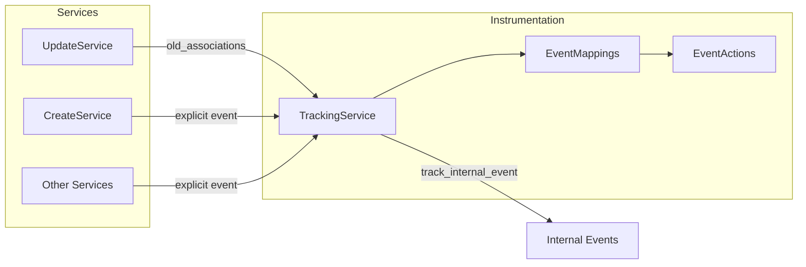

Work items introduce a flexible model that standardizes and extends issue tracking capabilities in GitLab.
With work items, you can define different types that can be customized with various widgets to meet
specific needs - whether you're tracking bugs, incidents, test cases, or other units of work.
This architectural documentation covers the development details and implementation strategies for
work items and work item types. For a rough outline of the work ahead, see [epic 6033](https://gitlab.com/groups/gitlab-org/-/epics/6033).

## Challenges

Issues have the potential to be a centralized hub for collaboration.
We need to accept the
fact that different issue types require different fields and different context, depending
on what job they are being used to accomplish. For example:

- A bug needs to list steps to reproduce.
- An incident needs references to stack traces and other contextual information relevant only
  to that incident.

Instead of each object type diverging into a separate model, we can standardize on an underlying
common model that we can customize with the widgets (one or more attributes) it contains.

Here are some problems with current issues usage and why we are looking into work items:

- Using labels to show issue types is cumbersome and makes reporting views more complex.
- Issue types are one of the top two use cases of labels, so it makes sense to provide first class
  support for them.
- Issues are starting to become cluttered as we add more capabilities to them, and they are not
  perfect:

  - There is no consistent pattern for how to surface relationships to other objects.
  - There is not a coherent interaction model across different types of issues because we use
    labels for this.
  - The various implementations of issue types lack flexibility and extensibility.
- Epics, issues, requirements, and others all have similar but just subtle enough
  differences in common interactions that the user needs to hold a complicated mental
  model of how they each behave.
- Issues are not extensible enough to support all of the emerging jobs they need to facilitate.
- Codebase maintainability and feature development becomes a bigger challenge as we grow the Issue type
  beyond its core role of issue tracking into supporting the different work item types and handling
  logic and structure differences.
- New functionality is typically implemented with first class objects that import behavior from issues via
  shared concerns. This leads to duplicated effort and ultimately small differences between common interactions. This
  leads to inconsistent UX.

## Work item terminology

To avoid confusion and ensure [communication is efficient](https://handbook.gitlab.com/handbook/communication/#mecefu-terms), we will use the following terms exclusively when discussing work items. This list is the [single source of truth (SSoT)](https://handbook.gitlab.com/handbook/values/#single-source-of-truth) for Work Item terminology.

| Term              | Description | Example of misuse | Should be |
| ---               | ---         | ---               | ---       |
| work item type    | Classes of work item; for example: issue, requirement, test case, incident, or task | _Epics will eventually become issues_ | _Epics will eventually become a **work item type**_ |
| work item         | An instance of a work item type | | |
| work item view    | The new frontend view that renders work items of any type | _This should be rendered in the new view_ | _This should be rendered in the work item view_ |
| legacy object     | An object that has been or will be converted to a Work Item Type | _Epics will be migrated from a standalone/old/former object to a work item type_ | _Epics will be converted from a legacy object to a work item type_ |
| legacy issue view | The existing view used to render issues and incidents | _Issues continue to be rendered in the old view_ | _Issues continue to be rendered in the legacy issue view_ |
| issue             | The existing issue model | | |
| issuable          | Any model currently using the issuable module (issues, epics and MRs) | _Incidents are an **issuable**_ | _Incidents are a **work item type**_ |
| widget            | A UI element to present or allow interaction with specific work item data | | |

Some terms have been used in the past but have since become confusing and are now discouraged.

| Term              | Description | Example of misuse | Should be |
| ---               | ---         | ---               | ---       |
| issue type        | A former way to refer to classes of work item | _Tasks are an **issue type**_ | _Tasks are a **work item type**_ |

## Migration strategy

WI model will be built on top of the existing `Issue` model and we'll gradually migrate `Issue`
model code to the WI model.

One way to approach it is:

```ruby
class WorkItems::WorkItem < ApplicationRecord
  self.table_name = 'issues'

  # ... all the current issue.rb code
end

class Issue < WorkItems::WorkItem
  # Do not add code to this class add to WorkItems:WorkItem
end
```

We already use the concept of WITs within `issues` table through `issue_type`
column. There are `issue`, `incident`, and `test_case` issue types. To extend this
so that in future we can allow users to define custom WITs, we will
move the `issue_type` to a separate table: `work_item_types`. The migration process of `issue_type`
to `work_item_types` will involve creating the set of WITs for all root-level groups as described in
[this epic](https://gitlab.com/groups/gitlab-org/-/epics/6536).

> [!note]
> At first, defining a WIT will only be possible at the root-level group, which would then be inherited by subgroups.
> We will investigate the possibility of defining new WITs at subgroup levels at a later iteration.

## Work item types architecture

GitLab uses a flexible types system supporting both system-defined and custom work item types. This architecture was designed to meet the requirements of the [Cells initiative](https://handbook.gitlab.com/handbook/engineering/architecture/design-documents/cells/), enabling efficient type lookups without cross-cell database queries. For architectural background, see the [configurable work item types design document](https://handbook.gitlab.com/handbook/engineering/architecture/design-documents/configurable_work_item_types/).

### System-defined types

System-defined types are predefined work item types built into GitLab. These types are defined in code as Ruby modules and loaded into memory at startup.

**Available types:**

| Type | ID | Base Type | Availability | Notes |
|------|-----|-----------|--------------|-------|
| Issue | 1 | `issue` | CE + EE | |
| Incident | 2 | `incident` | CE + EE | Transitioning to full WIT |
| Test Case | 3 | `test_case` | EE only | Transitioning to full WIT |
| Requirement | 4 | `requirement` | EE only | Transitioning to full WIT |
| Task | 5 | `task` | CE + EE | |
| Objective | 6 | `objective` | EE only | [Planned for removal](https://gitlab.com/gitlab-org/gitlab/-/work_items/592637) |
| Key Result | 7 | `key_result` | EE only | [Planned for removal](https://gitlab.com/gitlab-org/gitlab/-/work_items/592637) |
| Epic | 8 | `epic` | EE only | |
| Ticket | 9 | `ticket` | CE + EE | |

**Implementation details:**

- Model: `WorkItems::TypesFramework::SystemDefined::Type`
- Location: `app/models/work_items/types_framework/system_defined/`
- Each type has a definition module in `definitions/` (for example, `definitions/issue.rb`)
- Uses [`ActiveRecord::FixedItemsModel`](fixed_items_model.md) to provide an ActiveRecord-like API without database queries

**Type definition example:**

```ruby
module WorkItems::TypesFramework::SystemDefined::Definitions::Issue
  def self.configuration
    { id: 1, name: 'Issue', base_type: 'issue', icon_name: 'work-item-issue' }
  end

  def self.widgets
    %w[assignees description labels milestone notes ...]
  end

  def self.supports_move_action?
    true
  end
end
```

### Custom work item types

Custom types allow organizations and namespaces to create work item types tailored to their workflows. This feature is planned for delivery in Q1 FY27.

Custom types can be created in two ways:

1. **Brand new custom types** - Create an entirely new type (for example, "Pizza") that behaves like a system-defined type but represents a unique concept. The type behaves like Issue by default but has its own identity.
1. **Converted types** - Create a custom type by converting an existing system-defined type. The custom type references the original system-defined type and only stores the properties that differ (name, icon, archive status). All other behavior and widgets are inherited from the referenced system-defined type.

**Implementation details:**

- Model: `WorkItems::TypesFramework::Custom::Type`
- Table: `work_item_custom_types`
- Scope:
  - **Self-Managed:** Organization level (long-term target scope)
  - **SaaS (GitLab.com):** Root group level (interim solution until organization-level features are available)
- Limit: Per parent scope, stored in `WorkItems::TypesFramework::Custom::Type::MAX_TYPE_PER_PARENT`

> [!note]
> On GitLab.com, custom types are scoped to root groups because all root groups currently belong to the same organization. Once organization-level features are fully available on SaaS, custom types will move to organization scope to match Self-Managed.

**Converted types:**

When converting a system-defined type, the custom type references its origin and inherits behavior while allowing specific customizations.

**Customizable properties:**

- `name` - Custom display name (maximum 48 characters)
- `icon_name` - Custom icon selection
- `archived` - Archive status

**Inherited properties:**

- Widget configuration (future: customizable per type)
- Base type behavior
- Hierarchy restrictions

**Example:**

An organization converts the system-defined "Issue" type to create a custom "Bug" type:

- Inherits all Issue widgets and behavior
- Overrides name to "Bug"
- Optionally uses different icon
- References Issue type via `converted_from_system_defined_type_identifier` column

### Provider interface

The `WorkItems::TypesFramework::Provider` class is the single entry point for accessing work item types. All code should use Provider rather than directly accessing type classes.

**Namespace context:**

Passing a namespace to the Provider is crucial because it determines which types are available:

- **Without namespace:** Returns only system-defined types (9 global types)
- **With namespace:** Returns system-defined types plus any custom types (converted or brand new) defined for:
  - **Self-Managed:** The namespace's organization
  - **SaaS (GitLab.com):** The root group containing the namespace

The Provider caches types in the request store for fast lookups within a single request, avoiding repeated queries for custom types.

**Usage:**

```ruby
# Initialize with namespace context
provider = WorkItems::TypesFramework::Provider.new(namespace)

# Fetch types
provider.all                           # All available types
provider.filtered_types                # Types available to namespace
provider.find_by_base_type(:issue)     # Find by base type
provider.find_by_id(1)                 # Find by ID
provider.default_issue_type            # Get default issue type
```

**Related files:**

- Provider: [`types_framework/provider.rb`](https://gitlab.com/gitlab-org/gitlab/-/blob/master/app/models/work_items/types_framework/provider.rb)
- System types: [`types_framework/system_defined/type.rb`](https://gitlab.com/gitlab-org/gitlab/-/blob/master/app/models/work_items/types_framework/system_defined/type.rb)
- Custom types: [`types_framework/custom/type.rb`](https://gitlab.com/gitlab-org/gitlab/-/blob/master/app/models/work_items/types_framework/custom/type.rb)

### Historical context

Before GitLab 18.1, work item types were stored in the `work_item_types` database table. This approach was replaced with the current system-defined types architecture to support the [Cells initiative](https://handbook.gitlab.com/handbook/engineering/architecture/design-documents/cells/).

## Work item type widgets

A widget is a single component that can exist on a work item. This component can be used on one or
many work item types and can be lightly customized at the point of implementation.

A widget contains both the frontend UI (if present) and the associated logic for presenting and
managing any data used by the widget. There can be a one-to-many connection between the data model
and widgets. It means there can be multiple widgets that use or manage the same data, and they could
be present at the same time (for example, a read-only summary widget and an editable detail widget,
or two widgets showing two different filtered views of the same model).

Widgets should be differentiated by their **purpose**. When possible, this purpose should be
abstracted to the highest reasonable level to maximize reusability. For example, the widget for
managing "tasks" was built as "child items". Rather than managing one type of child, it's abstracted
up to managing any children.

All WITs will share the same pool of predefined widgets and will be customized by
which widgets are active on a specific WIT. Every attribute (column or association)
will become a widget with self-encapsulated functionality regardless of the WIT it belongs to.
Because any WIT can have any widget, we only need to define which widget is active for a
specific WIT. So, after switching the type of a specific work item, we display a different set
of widgets.

Read more about [work item widgets](work_items_widgets.md) and how to create a new one.

## Widgets metadata

In order to customize each WIT with corresponding active widgets we will need a data
structure to map each WIT to specific widgets.

The intent is for work item types to be highly configurable, both by GitLab for
implementing various work item schemes for customers (an opinionated GitLab
workflow, or SAFe 5, etc), and eventually for customers to customize their own
workflows.

In this case, a work item scheme would be defined as a set of types with
certain characteristics (some widgets enabled, others not), such as an Epic,
Story, Bug, and Task, etc.

As we're building a new work item architecture, we want to build the ability to
define these various types in a very flexible manner. Having GitLab use
this system first (without introducing customer customization) allows us to
better build out the initial system.

The `base_type` attribute identifies a work item's fundamental type classification (issue, epic, task, and so on). This attribute determines the default widget configuration and behavior.

Custom work item types delegate to a system-defined type's `base_type`, inheriting widget configuration and behavior. Future iterations will support custom widget selection for custom types.

## Add a system-defined work item type

To add a new system-defined work item type to GitLab:

1. **Create a definition module** in `app/models/work_items/types_framework/system_defined/definitions/` that defines the type configuration, widgets, and behavior.
1. **Include the definition** in `WorkItems::TypesFramework::SystemDefined::Type` so it's loaded at application startup.
1. **Add to visibility constants** - Add the base type to frontend and backend constants that control where the type appears in the UI and APIs.

For specific implementation details, reach out to the Plan Project Management team in `#g_project-management` on Slack.

> [!warning]
> The following example MRs use the legacy database-backed approach and may not reflect the current implementation. For up-to-date guidance on adding system-defined types, contact the Plan Project Management team in [#g_project-management](https://gitlab.slack.com/archives/g_project-management) on Slack.

**Historical reference MRs:**

- [MR example 1](https://gitlab.com/gitlab-org/gitlab/-/merge_requests/127482) (legacy approach)
- [MR example 2](https://gitlab.com/gitlab-org/gitlab/-/merge_requests/127917) (legacy approach)

### Define type relationships

Type relationship definitions (such as which types can have children, and which types can be linked to other types) are defined in the type module itself. All configuration is in one place and defined in code.

When you create a new system-defined type, include these definitions in your type module:

- **Widget configuration** - Which widgets are available for this type.
- **Hierarchy restrictions** - Which types can be parents or children of this type, and maximum nesting depth.
- **Linked item restrictions** - Which types this type can be related to or blocked by.

For the current relationship rules, see the individual type definition modules in `app/models/work_items/types_framework/system_defined/definitions/`.

## Custom widgets

The end goal is to allow users to define custom widgets and use these custom
widgets on any WIT. But this is a much further iteration and requires additional
investigation to determine both data and application architecture to be used.

## Migrate requirements and epics to work item types

We'll migrate requirements and epics into work item types, with their own set
of widgets. To achieve that, we'll migrate data to the `issues` table,
and we'll keep current `requirements` and `epics` tables to be used as proxies for old references to ensure
backward compatibility with already existing references.

### Migrate requirements to work item types

Currently `Requirement` attributes are a subset of `Issue` attributes, so the migration
consists mainly of:

- Data migration.
- Keeping backwards compatibility at API levels.
- Ensuring that old references continue to work.

The migration to a different underlying data structure should be seamless to the end user.

### Migrate epics to work item types

`Epic` has some extra functionality that the `Issue` WIT does not currently have.
So, migrating epics to a work item type requires providing feature parity between the current `Epic` object and WITs.

The main missing features are:

- Get work items to the group level. This is dependent on [Consolidate Groups and Projects](https://gitlab.com/gitlab-org/architecture/tasks/-/issues/7)
  initiative.
- A hierarchy widget: the ability to structure work items into hierarchies.
- Inherited date widget.

To avoid disrupting workflows for users who are already using epics, we will introduce a new WIT
called `Feature` that will provide feature parity with epics at the project-level. Having that combined with progress
on [Consolidate Groups and Projects](https://gitlab.com/gitlab-org/architecture/tasks/-/issues/7) front will help us
provide a smooth migration path of epics to WIT with minimal disruption to user workflow.

## Work item instrumentation

Work item interactions are tracked using GitLab [internal events](internal_analytics/internal_event_instrumentation/_index.md) system,
which feeds into Snowplow for analytics. A centralized instrumentation architecture provides consistent
tracking across all work item types and interactions.

### Architecture overview

The instrumentation system consists of three main components:



| Component | Purpose |
|-----------|---------|
| `EventActions` | Defines all trackable event constants (for example, `work_item_create`, `work_item_title_update`) |
| `TrackingService` | Unified entry point for tracking; accepts either an explicit event or derives events from changes |
| `EventMappings` | Declarative mappings from attribute and association changes to events |

### Event properties

All work item events include standardized properties for segmentation:

| Property | Description |
|----------|-------------|
| `user` | The user performing the action |
| `namespace` | The namespace containing the work item |
| `project` | The project containing the work item (if applicable) |
| `label` | The work item type name (for example, `Issue`, `Epic`, `Task`) |
| `property` | The user's role in the namespace |

### Integration patterns

#### Explicit event tracking

For discrete actions like create, delete, or clone, pass the event directly:

```ruby
Gitlab::WorkItems::Instrumentation::TrackingService.new(
  work_item: work_item,
  current_user: current_user,
  event: Gitlab::WorkItems::Instrumentation::EventActions::CREATE
).execute
```

#### Derived event tracking

For updates where multiple fields may change, pass the previous state and let
`EventMappings` determine which events to emit:

```ruby
# In associations_before_update, capture state before changes
def associations_before_update(work_item)
  super.merge(
    confidential: work_item.confidential,
    # ... other associations
  )
end

# In after_update, track with old_associations
Gitlab::WorkItems::Instrumentation::TrackingService.new(
  work_item: work_item,
  current_user: current_user,
  old_associations: old_associations
).execute
```

### Current events

For the complete list of trackable work item events, see
[`EventActions`](https://gitlab.com/gitlab-org/gitlab/-/blob/master/lib/gitlab/work_items/instrumentation/event_actions.rb).

### Add new event

To add a new work item event:

1. **Define your event and metrics** using the internal events CLI. Follow the
   [quick start guide](internal_analytics/internal_event_instrumentation/quick_start.md#defining-event-and-metrics)
   to generate the necessary YAML definitions.
1. **Add the event constant** in `lib/gitlab/work_items/instrumentation/event_actions.rb`:

   ```ruby
   NEW_ACTION = 'work_item_new_action'

   ALL_EVENTS = [
     # ... existing events
     NEW_ACTION
   ].freeze
   ```

1. **Add mapping** (for update-derived events only) in `lib/gitlab/work_items/instrumentation/event_mappings.rb`:

   For attribute changes:

   ```ruby
   ATTRIBUTE_MAPPINGS = [
     # ... existing mappings
     { event: EventActions::NEW_ACTION, key: 'attribute_name' }
   ].freeze
   ```

   For association changes with custom comparison logic:

   ```ruby
   ASSOCIATION_MAPPINGS = [
     # ... existing mappings
     {
       event: EventActions::NEW_ACTION,
       key: :association_name,
       compare: ->(old, new) { old != new }
     }
   ].freeze
   ```

1. **Call the tracking service** from the relevant service class.
1. **Add specs** using the shared examples:

   ```ruby
   it_behaves_like 'tracks work item event', :work_item, :user, 'work_item_new_action'
   ```

For a minimal example of adding new event instrumentation after the YAML definitions are in place, see
[MR !215447](https://gitlab.com/gitlab-org/gitlab/-/merge_requests/215447) which adds two events
with just 5 files changed and +28 lines.

### Related files

- Event constants: [`event_actions.rb`](https://gitlab.com/gitlab-org/gitlab/-/blob/master/lib/gitlab/work_items/instrumentation/event_actions.rb)
- Tracking service: [`tracking_service.rb`](https://gitlab.com/gitlab-org/gitlab/-/blob/master/lib/gitlab/work_items/instrumentation/tracking_service.rb)
- Event mappings: [`event_mappings.rb`](https://gitlab.com/gitlab-org/gitlab/-/blob/master/lib/gitlab/work_items/instrumentation/event_mappings.rb)
- Shared examples: [`tracking_service_shared_examples.rb`](https://gitlab.com/gitlab-org/gitlab/-/blob/master/spec/support/shared_examples/work_items/tracking_service_shared_examples.rb)

## Related topics

- [Design management](../user/project/issues/design_management.md)
