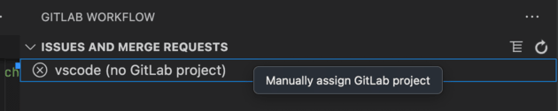

When working with GitLab for VS Code, you might encounter the following issues.

If your issue is not covered below, gather the [required information for support](#required-information-for-support)
and report the bug in the [`gitlab-vscode-extension` issue tracker](https://gitlab.com/gitlab-org/gitlab-vscode-extension/-/issues).

## Logs

Both the GitLab for VS Code extension and the GitLab Language Server, which powers the extension,
provide logs that can help you troubleshoot.

### Enable debug logs

To enable debug logging:

1. In VS Code, open the Settings editor:
   - For macOS, press <kbd>Command</kbd>+<kbd>,</kbd>.
   - For Windows or Linux, press <kbd>Control</kbd>+<kbd>,</kbd>.
1. Select **Extensions** > **GitLab** > **Other**.
1. Under **GitLab: Debug**, select the checkbox to turn on debug mode.
1. Reload the window to restart the extension.
   1. Open the Command Palette:
      - For macOS, press <kbd>Command</kbd>+<kbd>Shift</kbd>+<kbd>P</kbd>.
      - For Windows or Linux, press <kbd>Control</kbd>+<kbd>Shift</kbd>+<kbd>P</kbd>.
   1. Type `Developer: Reload Window` and press <kbd>Enter</kbd>.

### View debug logs

To view debug logs:

1. In VS Code, select **View** > **Output**.
1. In the upper-right corner of the output panel, select the dropdown list to filter for
   **GitLab** or **GitLab Language Server** logs.
1. Review for errors, warnings, connection issues, or authentication problems.

## Authentication

You might encounter the following authentication errors.

### Error: `...can't access the OS Keychain`

On macOS and Ubuntu, you might get an error when the extension cannot access the OS Keychain to
authenticate.

For example:

```plaintext
The GitLab extension can't access the OS Keychain.
If you use Ubuntu, see this existing issue.
```

```plaintext
Error: Cannot get password
at I.$getPassword (vscode-file://vscode-app/snap/code/97/usr/share/code/resources/app/out/vs/workbench/workbench.desktop.main.js:1712:49592)
```

Follow the workaround below for your operating system.

For more information about this error, see:

- [Extension issue 580](https://gitlab.com/gitlab-org/gitlab-vscode-extension/-/issues/580)
- [Upstream `microsoft/vscode` issue 147515](https://github.com/microsoft/vscode/issues/147515)

#### macOS workaround

To work around this error on macOS:

1. On your machine, open **Keychain Access**, and search for `vscodegitlab.gitlab-workflow`.
1. Delete `vscodegitlab.gitlab-workflow` from your keychain.
1. Press <kbd>Command</kbd>+<kbd>Shift</kbd>+<kbd>P</kbd> to open the Command Palette.
1. Type `GitLab: Remove Account from VS Code` and press <kbd>Enter</kbd> to remove the
   corrupted account from VS Code.
1. Open the Command Palette again and run `GitLab: Authenticate` to add the account again.

#### Ubuntu workaround

When you install VS Code with `snap` in Ubuntu 20.04 and 22.04, VS Code can't read passwords from the
OS keychain. Extension versions 3.44.0 and later use the OS keychain for secure token storage.

If you use a version of VS Code earlier than 1.68.0, try one of these workarounds:

- Downgrade the GitLab for VS Code extension to version 3.43.1.
- Install VS Code from the `.deb` package, rather than `snap`:
  1. Uninstall the `snap` VS Code.
  1. Install VS Code from the [`.deb` package](https://code.visualstudio.com/Download).
  1. Go to Ubuntu's **Password & Keys**, find the `vscodegitlab.workflow/gitlab-tokens` entry, and
     remove it.
  1. In VS Code, press <kbd>Control</kbd>+<kbd>Shift</kbd>+<kbd>P</kbd> to open the Command Palette.
  1. Type `Gitlab: Remove Your Account` and press <kbd>Enter</kbd> to remove the account with
     missing credentials.
  1. Open the Command Palette again and run `GitLab: Authenticate` to add the account again.

If you use VS Code version 1.68.0 or later, try to re-authenticate:

1. Go to Ubuntu's **Password & Keys**, find the `vscodegitlab.workflow/gitlab-tokens` entry, and
   remove it.
1. In VS Code, press <kbd>Control</kbd>+<kbd>Shift</kbd>+<kbd>P</kbd> to open the Command Palette.
1. Type `Gitlab: Remove Your Account` and press <kbd>Enter</kbd> to remove the account with
   missing credentials.
1. Open the Command Palette again and run `GitLab: Authenticate` to add the account again.

### Connection and authorization error when using GDK

When using VS Code with GDK, you might get an error that states that your system
is unable to establish a secure TLS connection to a GitLab instance running on
localhost.

For example, if you are using `127.0.0.1:3000` as your GitLab server:

```plaintext
Request to https://127.0.0.1:3000/api/v4/version failed, reason: Client network
socket disconnected before secure TLS connection was established
```

This issue occurs if you are running GDK on `http` and your GitLab instance is
hosted on `https`.

To resolve this:

1. Open the Command Palette:
   - For macOS, press <kbd>Command</kbd>+<kbd>Shift</kbd>+<kbd>P</kbd>.
   - For Windows or Linux, press <kbd>Control</kbd>+<kbd>Shift</kbd>+<kbd>P</kbd>.
1. Type `GitLab: Authenticate` and press <kbd>Enter</kbd>.
1. Select the option to manually enter an `http` URL for your instance and press <kbd>Enter</kbd>.
1. Follow the remaining prompts to authenticate.

## Project configuration

You might encounter the following project configuration errors.

### Account and project configuration errors

When you open a project in VS Code, you might see an error message next to the project name in the
**GitLab** () tab. Or, you might see warning messages about multiple
accounts or projects in the status bar.

These messages appear when the extension is unable to identify which repository, account, or
project to use.

To resolve these errors:

- If no remote is defined or you have multiple remotes configured, see [connect to your repository](setup.md#connect-to-your-repository).
- If **Multiple GitLab Accounts** appears in the status bar, [switch accounts](setup.md#switch-accounts).
- If **(multiple projects)** appears in the status bar, [select a project](setup.md#select-a-project).

If this is your first time working with Git in VS Code, see
[source control in VS Code](https://code.visualstudio.com/docs/sourcecontrol/overview) for information
on initializing repositories and VS Code workspaces, which occurs outside of the GitLab extension.

#### Git remote with SSH custom alias

If your repository remote uses an SSH custom alias, the extension might not correctly match your
repository to your GitLab project. For example, if your remote uses
`git@my-work-gitlab:group/project.git` instead of `git@gitlab.com:group/project.git`.

To resolve this issue, you can:

- Change the remote to use HTTP or use SSH without a custom alias.
- Configure a default GitLab Duo namespace in the extension.

To configure a default namespace:

1. [Determine the namespace your project is in](../../user/namespace/_index.md#determine-which-type-of-namespace-youre-in).
1. In VS Code, open the Settings editor:
   - For macOS, press <kbd>Command</kbd>+<kbd>,</kbd>.
   - For Windows or Linux, press <kbd>Control</kbd>+<kbd>,</kbd>.
1. Select **Extensions** > **GitLab** > **GitLab Duo**.
1. Under **GitLab › Duo Agent Platform: Default Namespace**, enter your namespace.

### HTTPS project cloning works but SSH cloning fails

You might get an SSH cloning error while HTTPS cloning works. This occurs when your SSH URL host
or path is different from your HTTPS path.

The GitLab for VS Code extension uses:

- The host to match the account that you set up.
- The path to get the namespace and project name.

For example, the URLs for the VS Code extension project are:

- SSH: `git@gitlab.com:gitlab-org/gitlab-vscode-extension.git`
- HTTPS: `https://gitlab.com/gitlab-org/gitlab-vscode-extension.git`

Both have the `gitlab.com` host and the `gitlab-org/gitlab-vscode-extension` path.

To resolve this error:

1. Check if your SSH URL is on a different host or if it has extra segments in the path.
1. If either is true, manually assign the Git repository to a GitLab project:
   1. In VS Code, in the left sidebar, select **GitLab** ().
   1. Select the project marked `(no GitLab project)`, then select **Manually assign GitLab project**:
   
   1. Select the correct project from the list.

For more information about simplifying this process, see
[issue 577](https://gitlab.com/gitlab-org/gitlab-vscode-extension/-/issues/577)
in the `gitlab-vscode-extension` project.

## Network and connectivity

You might encounter the following network and connectivity errors.

### Error: `407 Access Denied` failure with a proxy

If you use an authenticated proxy, you might encounter a `407 Access Denied (authentication_failed)`
error.

For example:

```plaintext
Request failed: Can't add GitLab account for https://gitlab.com. Check your instance URL and network connection.
Fetching resource from https://gitlab.com/api/v4/personal_access_tokens/self failed
```

To resolve this error, [enable proxy authentication](../language_server/_index.md#enable-proxy-authentication)
for the GitLab Language Server.

### Errors with custom certificates

If you use custom certificates to connect to your GitLab instance, such as self-signed certificates,
you might encounter errors.

These errors can occur if your certificates use the following settings:

| Setting name                     | Information |
|----------------------------------|-------------|
| `gitlab.ca`                      | Deprecated. See [the SSL setup guide](ssl.md) for more information on how to set up your self-signed CA.|
| `gitlab.cert`                    | Unsupported. See [epic 6244](https://gitlab.com/groups/gitlab-org/-/epics/6244). |
| `gitlab.certKey`                 | Unsupported. See [epic 6244](https://gitlab.com/groups/gitlab-org/-/epics/6244). |
| `gitlab.ignoreCertificateErrors` | Unsupported. See [epic 6244](https://gitlab.com/groups/gitlab-org/-/epics/6244). |

To resolve, see [configure the extension for Custom Certificate Authorities](https://gitlab.com/gitlab-org/gitlab-vscode-extension/-/blob/main/docs/user/custom-certificates.md).

### Expired SSL certificate

You might encounter a false expired SSL certificate error. For example:

`API request failed - Error: certificate has expired`.

To resolve this error, disable system certificates:

1. In VS Code, open the Settings editor:
   - For macOS, press <kbd>Command</kbd>+<kbd>,</kbd>.
   - For Windows or Linux, press <kbd>Control</kbd>+<kbd>,</kbd>.
1. On the **User** settings tab, select **Application** > **Proxy**.
1. Disable the settings for **Proxy Strict SSL** and **System Certificates**.

## GitLab Duo

When you use GitLab Duo in VS Code, you might encounter the following issues.

### GitLab Duo features are unavailable

To troubleshoot GitLab Duo errors in VS Code:

1. Ensure you meet the [prerequisites](setup.md#configure-gitlab-duo) and the necessary settings
   are on.
1. Ensure that [Admin mode is disabled](../../administration/settings/sign_in_restrictions.md#turn-off-admin-mode-for-your-session).
1. Review diagnostics output:
   1. In VS Code, open the Command Palette:
      - For macOS, press <kbd>Command</kbd>+<kbd>Shift</kbd>+<kbd>P</kbd>
      - For Windows or Linux, press <kbd>Control</kbd>+<kbd>Shift</kbd>+<kbd>P</kbd>
   1. Run the command `GitLab: Diagnostics` and review the output for any failed checks.
1. If the diagnostics indicate that the feature is not turned on:
   1. In VS Code, open the Settings editor:
      - For macOS, press <kbd>Command</kbd>+<kbd>,</kbd>.
      - For Windows or Linux, press <kbd>Control</kbd>+<kbd>,</kbd>.
   1. Select **Extensions** > **GitLab** > **GitLab Duo**.
   1. Find the **GitLab ›** section for the missing feature and select the checkbox to turn it on.
1. If the diagnostics indicate that Agentic Chat is not supported for the current project, set a
   [default GitLab Duo namespace](../../user/profile/preferences.md#namespace-resolution-in-your-local-environment).
1. If the diagnostics indicate that all Agentic Chat checks pass and you still do not
   see the panel, it might be hidden in your [custom VS Code layout](https://code.visualstudio.com/docs/configure/custom-layout).
   1. In VS Code, open the Command Palette:
      - For macOS, press <kbd>Command</kbd>+<kbd>Shift</kbd>+<kbd>P</kbd>
      - For Windows or Linux, press <kbd>Control</kbd>+<kbd>Shift</kbd>+<kbd>P</kbd>
   1. Run the command `View: Show GitLab Duo Agent Platform` or `View: Toggle GitLab Duo Agent Platform`.

For support with Code Suggestions, see [troubleshooting Code Suggestions](../../user/project/repository/code_suggestions/troubleshooting.md#vs-code-troubleshooting).

### GitLab Duo returns `HTTP/1.1` responses instead of WebSocket endpoints

You might see `HTTP/1.1` responses from GitLab Duo in your logs instead of `/-/cable` WebSocket
endpoints.

This occurs when your GitLab instance blocks WebSocket connections.

To resolve this error, ask your network administrator to modify your GitLab instance to
[allow inbound WebSocket connections from IDE clients](../../administration/gitlab_duo/configure/_index.md#allow-inbound-connections-from-clients-to-the-gitlab-instance).

### GitLab Duo Chat fails to initialize in remote environments

When using GitLab Duo Chat in remote development environments (such as browser-based VS Code or remote
SSH connections), you might encounter initialization failures like:

- A blank or non-loading Chat panel.
- Errors in logs, such as `The webview didn't initialize in 10000ms`.
- The extension attempts to connect to inaccessible local URLs.

To resolve these errors:

1. In VS Code, open the Settings editor:
   - For macOS, press <kbd>Command</kbd>+<kbd>,</kbd>.
   - For Windows or Linux, press <kbd>Control</kbd>+<kbd>,</kbd>.
1. In the upper-right corner, select **Open Settings (JSON)** to edit your `settings.json` file.
1. Add or modify this setting:

   ```json
   "gitlab.featureFlags.languageServerWebviews": false
   ```

1. Save your changes and reload the window:.
   1. Open the Command Palette:
      - For macOS, press <kbd>Command</kbd>+<kbd>Shift</kbd>+<kbd>P</kbd>.
      - For Windows or Linux, press <kbd>Control</kbd>+<kbd>Shift</kbd>+<kbd>P</kbd>.
   1. Type `Developer: Reload Window` and press <kbd>Enter</kbd>.

For updates on a permanent solution, see
[issue #1944](https://gitlab.com/gitlab-org/gitlab-vscode-extension/-/issues/1944) and
[Issue #1943](https://gitlab.com/gitlab-org/gitlab-vscode-extension/-/issues/1943)

### GitLab Duo commands fail or run indefinitely

When you use GitLab Duo Agentic Chat or the Software Development Flow in your IDE, GitLab Duo might
get stuck in a loop or have difficulty running commands.

This issue can occur when you use shell themes or integrations, such as `Oh My ZSH!` or `powerlevel10k`.
When a GitLab Duo agent creates a terminal, the shell theme or integration can prevent commands from
running properly.

As a workaround, follow the instructions below to use a simpler theme for commands sent by agents.

For more information about a fix, see [issue 2116](https://gitlab.com/gitlab-org/gitlab-vscode-extension/-/work_items/2116).

#### Edit your `.zshrc` file

In VS Code, configure `Oh My ZSH!` or `powerlevel10k` to use a simpler
theme when it runs commands sent by an agent. You can use the environment variables exposed
by the IDEs to set these values.

Edit your `~/.zshrc` file to include this code:

```shell
# ~/.zshrc

# Path to your oh-my-zsh installation
export ZSH="$HOME/.oh-my-zsh"

# ...

# Decide whether to load a full terminal environment,
# or keep it minimal for agentic AI in IDEs
if [[ "$TERM_PROGRAM" == "vscode" ]]; then
  echo "IDE agentic environment detected, not loading full shell integrations"
else
  # Oh My ZSH
  source $ZSH/oh-my-zsh.sh
  # Theme: Powerlevel10k
  [[ ! -f ~/.p10k.zsh ]] || source ~/.p10k.zsh
  # Other integrations like syntax highlighting
fi

# Other setup, like PATH variables
```

#### Edit your Bash shell

In VS Code, you can turn off advanced prompts in Bash.

Edit your `~/.bashrc` or `~/.bash_profile` file to include this code:

```shell
# ~/.bashrc or ~/.bash_profile

# Decide whether to load a full terminal environment,
# or keep it minimal for Agentic AI in IDEs
if [[ "$TERM_PROGRAM" == "vscode" ]]; then
  echo "IDE agentic environment detected, not loading full shell integrations"

  # Keep only essential settings for agents
  export PS1='\$ '  # Minimal prompt

else
  # Load full Bash environment

  # Custom prompt (e.g., Starship, custom PS1)
  if command -v starship &> /dev/null; then
    eval "$(starship init bash)"
  else
    # ... Add your own PS1 variable
  fi

  # Load additional integrations
fi

# Always load essential environment variables and aliases
```

## Required information for support

Before you contact Support, make sure the latest GitLab for VS Code extension is installed.

Find the latest releases in the [VS Code Marketplace](https://marketplace.visualstudio.com/items?itemName=GitLab.gitlab-workflow),
in the **Version History** tab.

Gather this information from affected users and provide it in your bug report:

1. The error message shown to the user.
1. **GitLab** and **GitLab Language Server** [logs](#logs).
1. Diagnostics output.
   1. Open the Command Palette:
      - For macOS, press <kbd>Command</kbd>+<kbd>Shift</kbd>+<kbd>P</kbd>.
      - For Windows or Linux, press <kbd>Control</kbd>+<kbd>Shift</kbd>+<kbd>P</kbd>.
   1. Type `GitLab: Diagnostics` and press <kbd>Enter</kbd>.
   1. Note the extension version.
1. System details:
   - In VS Code, the **OS** details:
     - For macOS, go to **Code** > **About Visual Studio Code** and find **OS**.
     - For Windows or Linux, go to **Help** > **About** and find **OS**.
   - Machine specifications (CPU, RAM): Provide these from your machine. They are not accessible in
     the IDE.
1. Describe the scope of impact. How many users are affected?
1. Describe how to reproduce the error. Include a screen recording, if possible.
1. Describe how other GitLab Duo features are affected:
   - Is GitLab Quick Chat functional?
   - Is Code Suggestions working?
   - Does GitLab Duo Chat in the Web IDE return responses?
1. Perform extension isolation testing as described in the
   [GitLab for VS Code extension isolation guide](https://gitlab.com/gitlab-org/editor-extensions/gitlab-lsp/-/issues/814#step-2-extension-isolation-testing).
   Try disabling (or uninstalling) all other extensions to determine whether or not another extension
   is causing the issue.
