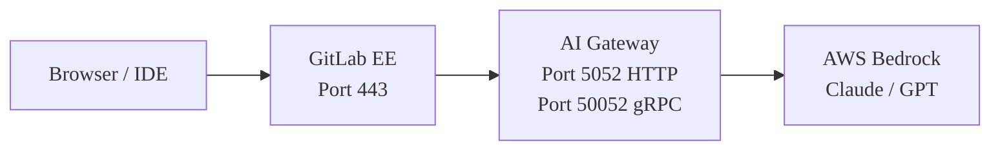



- Tier: Premium, Ultimate
- Offering: GitLab Self-Managed



This guide walks you through deploying GitLab with self-hosted AI models
using AWS Bedrock, from a blank EC2 instance to a working Duo Agent
Platform (DAP) flow. Every command is copy-pastable. Every common
mistake is documented.

This guide uses a single EC2 instance running GitLab (Docker) and the
AI Gateway (Docker Compose) side by side, with AWS Bedrock as the LLM
provider. This architecture is suitable for proof-of-concept and
evaluation deployments.

For production deployments, see the
[reference architectures](../../administration/reference_architectures/_index.md).

## Prerequisites

Before you start, you need:

| Requirement | Details |
|-------------|---------|
| **AWS account** | With Bedrock access in your target region (`us-east-1` recommended). |
| **EC2 instance** | `t3.xlarge` minimum (4 vCPU, 16 GB RAM). `t3.2xlarge` recommended for production (8 vCPU, 32 GB). |
| **Domain name** | Two DNS records pointing to your EC2 instance: `gitlab.example.com` and `aigw.example.com`. |
| **GitLab license** | Premium or Ultimate. Classic Duo features (Chat, Code Suggestions) require [Duo seat assignment](../../subscriptions/subscription-add-ons.md). DAP with an online license (GitLab 18.9 and later) uses [usage-based billing through GitLab Credits](../../subscriptions/gitlab_credits.md) and does not require Duo Enterprise seats. For DAP with an offline license, contact your GitLab account team about ELA options. |
| **SSH access** | To your EC2 instance. |
| **Security group** | Ports 80, 443, and 8443 open inbound. |

## Architecture overview



The AI Gateway runs as a sidecar container alongside GitLab.
The built-in GitLab NGINX proxies HTTPS and gRPC traffic to the AI Gateway.
The AI Gateway then forwards LLM requests to AWS Bedrock.

Port 8443 is required for DAP flows. DAP uses gRPC to communicate
with the AI Gateway Duo Workflow Service (DWS). The GitLab NGINX
must proxy gRPC TLS on port 8443 to the AI Gateway's gRPC port (50052).

## Step 1: Provision AWS infrastructure

### Launch an EC2 instance

Launch an Ubuntu 22.04 or later instance with:

- **Instance type:** `t3.xlarge` (minimum) or `t3.2xlarge` (recommended)
- **Storage:** 100 GB gp3
- **AMI:** Ubuntu Server 22.04 LTS or 24.04

### Configure the security group

Open these inbound ports:

| Port | Protocol | Source | Purpose |
|------|----------|--------|---------|
| 22 | TCP | Your IP | SSH |
| 80 | TCP | `0.0.0.0/0` | HTTP (Let's Encrypt validation) |
| 443 | TCP | `0.0.0.0/0` | HTTPS (GitLab and AI Gateway proxy) |
| 8443 | TCP | `0.0.0.0/0` | gRPC TLS (DAP flows) |

IDE clients (VS Code, JetBrains) connect directly to port 8443 for DAP
flows. If your users are behind a VPN, you can restrict the source IP range.

### Install Docker

SSH into your instance and install Docker:

```shell
sudo apt-get update && sudo apt-get upgrade -y

# Install Docker (official method)
curl --fail --silent --show-error --location "https://get.docker.com" | sudo bash

# Install Docker Compose plugin
sudo apt-get install -y docker-compose-plugin

# Verify
sudo docker --version
sudo docker compose version
```

### Set up DNS

Create two A records pointing to your EC2 public IP:

| Record | Type | Value |
|--------|------|-------|
| `gitlab.example.com` | A | Your EC2 public IP |
| `aigw.example.com` | A | Your EC2 public IP |

Both domains point to the same IP. The GitLab NGINX routes traffic
based on the hostname.

Verify DNS propagation:

```shell
dig gitlab.example.com +short
dig aigw.example.com +short
```

Both commands should return your EC2 public IP.

## Step 2: Install GitLab

### Create data directories

```shell
sudo mkdir -p /srv/gitlab/config /srv/gitlab/logs /srv/gitlab/data
```

### Run GitLab

This command installs and starts GitLab EE with Let's Encrypt:

```shell
sudo docker run --detach \
  --hostname gitlab.example.com \
  --env GITLAB_OMNIBUS_CONFIG="
    external_url 'https://gitlab.example.com';
    letsencrypt['enable'] = true;
    letsencrypt['auto_renew'] = true;
    letsencrypt['contact_emails'] = ['you@example.com'];
    gitlab_rails['gitlab_shell_ssh_port'] = 2222;
  " \
  --publish 443:443 \
  --publish 80:80 \
  --publish 2222:22 \
  --publish 8443:8443 \
  --name gitlab \
  --restart always \
  --volume /srv/gitlab/config:/etc/gitlab \
  --volume /srv/gitlab/logs:/var/log/gitlab \
  --volume /srv/gitlab/data:/var/opt/gitlab \
  --shm-size 256m \
  gitlab/gitlab-ee:latest
```

> [!note]
> The `--publish 8443:8443` flag is required for DAP (gRPC TLS). If you
> omit it, DAP flows fail silently. You cannot add ports to a running
> container. You would need to recreate it.

### Wait for GitLab to start

GitLab takes 3-5 minutes to initialize on first run:

```shell
until curl --silent --fail "https://gitlab.example.com/-/health" > /dev/null 2>&1; do
  echo "Waiting for GitLab to start..."
  sleep 10
done
echo "GitLab is up!"
```

### Set the root password

```shell
sudo docker exec gitlab cat /etc/gitlab/initial_root_password
```

Sign in at `https://gitlab.example.com` with username `root` and the
password from the command output. Change it immediately.

### Apply your license

1. Go to **Admin > Subscription**.
1. Upload your GitLab license file.

## Step 3: Deploy the AI Gateway

### Find the correct image tag

The AI Gateway image is on Docker Hub at `gitlab/model-gateway`.
You must use a version tag that matches your GitLab version.

> [!note]
> There is no `latest` tag. Using `gitlab/model-gateway:latest` fails
> with an image-not-found error.

Tag format: `self-hosted-v{MAJOR}.{MINOR}.{PATCH}-ee`

Check available tags:

```shell
curl --silent "https://hub.docker.com/v2/repositories/gitlab/model-gateway/tags?page_size=10&ordering=last_updated" | \
  python3 -c "import sys,json; [print(t['name'], '  ', t['last_updated'][:10]) for t in json.load(sys.stdin)['results']]"
```

### Generate a JWT signing key

The AI Gateway needs a JWT key to authenticate DWS requests:

```shell
sudo mkdir -p /srv/enterprise-sidecar
openssl genrsa -out /srv/enterprise-sidecar/duo_workflow_jwt.key 2048
```

### Create the environment file

Create `/srv/enterprise-sidecar/.env`:

```shell
cat << 'EOF' | sudo tee /srv/enterprise-sidecar/.env
# AWS Bedrock credentials
AWS_ACCESS_KEY_ID=<your-aws-access-key>
AWS_SECRET_ACCESS_KEY=<your-aws-secret-key>
AWS_REGION=us-east-1

# AI Gateway: JWT signing key (for DWS authentication)
AIGW_JWT_SIGNING_KEY=<paste contents of duo_workflow_jwt.key>
EOF
```

Set restrictive permissions on the environment file:

```shell
sudo chmod 600 /srv/enterprise-sidecar/.env
```

To embed the JWT key into the environment file, replace newlines with
literal `\n` so the key fits on a single line:

```shell
JWT_KEY=$(sudo awk '{printf "%s\\n", $0}' /srv/enterprise-sidecar/duo_workflow_jwt.key)
sudo sed -i "s|AIGW_JWT_SIGNING_KEY=.*|AIGW_JWT_SIGNING_KEY=${JWT_KEY}|" /srv/enterprise-sidecar/.env
```

### Create the Docker Compose file

Create `/srv/enterprise-sidecar/docker-compose.yml`:

```yaml
services:
  ai-gateway:
    image: gitlab/model-gateway:self-hosted-v<VERSION>-ee  # Replace <VERSION> with your GitLab version (for example, 18.11.0)
    container_name: ai-gateway
    restart: unless-stopped
    environment:
      AIGW_GITLAB_URL: https://gitlab.example.com
      AIGW_GITLAB_API_URL: https://gitlab.example.com/api/v4/
      DUO_WORKFLOW_SELF_SIGNED_JWT__SIGNING_KEY: ${AIGW_JWT_SIGNING_KEY}
      AWS_ACCESS_KEY_ID: ${AWS_ACCESS_KEY_ID}
      AWS_SECRET_ACCESS_KEY: ${AWS_SECRET_ACCESS_KEY}
      AWS_REGION: ${AWS_REGION:-us-east-1}
      AIGW_LOGGING__LEVEL: INFO
      DUO_WORKFLOW_LOGGING__LEVEL: INFO
    ports:
      - "5052:5052"
      - "50052:50052"
    deploy:
      resources:
        limits:
          memory: 2048M
        reservations:
          memory: 512M
    healthcheck:
      test: ["CMD", "curl", "--silent", "--fail", "http://localhost:5052/monitoring/healthz"]
      interval: 30s
      timeout: 10s
      retries: 3
      start_period: 30s
```

### Start the AI Gateway

```shell
cd /srv/enterprise-sidecar
sudo docker compose up -d
```

### Verify AI Gateway health

```shell
# Check container is running
sudo docker ps | grep ai-gateway

# Check HTTP health endpoint (empty JSON means healthy)
curl --silent "http://localhost:5052/monitoring/healthz"

# Check logs for errors
sudo docker logs ai-gateway --tail 20
```

## Step 4: Configure TLS for the AI Gateway

The AI Gateway needs HTTPS (for Chat and Code Suggestions) and gRPC TLS
(for DAP flows). Use the built-in GitLab NGINX as a reverse proxy,
sharing its Let's Encrypt certificate.

### Add the AI Gateway subdomain to Let's Encrypt

Edit the GitLab configuration:

```shell
sudo docker exec -it gitlab editor /etc/gitlab/gitlab.rb
```

Find the `letsencrypt` section and add `alt_names`:

```ruby
letsencrypt['alt_names'] = ['aigw.example.com']
```

If you already have other `alt_names` (like a registry subdomain), add
`aigw.example.com` to the existing array:

```ruby
letsencrypt['alt_names'] = ['registry.example.com', 'aigw.example.com']
```

Renew the certificate to include the new SAN:

```shell
sudo docker exec gitlab gitlab-ctl renew-le-certs
```

Verify the certificate includes the AI Gateway subdomain:

```shell
echo | openssl s_client -connect gitlab.example.com:443 2>/dev/null | \
  openssl x509 -noout -ext subjectAltName
```

You should see `DNS:aigw.example.com` in the output.

### Create the NGINX proxy configuration

Create the proxy configuration file on the host:

```shell
cat << 'NGINX' | sudo tee /srv/gitlab/config/nginx/aigw-proxy.conf
# AI Gateway reverse proxy: HTTPS for HTTP API, gRPC TLS for DAP

# HTTP API: Duo Chat, Code Suggestions
server {
    listen 443 ssl;
    server_name aigw.example.com;

    ssl_certificate /etc/gitlab/ssl/gitlab.example.com.crt;
    ssl_certificate_key /etc/gitlab/ssl/gitlab.example.com.key;
    ssl_protocols TLSv1.2 TLSv1.3;
    ssl_ciphers HIGH:!aNULL:!MD5;

    location / {
        proxy_pass http://172.17.0.1:5052;
        proxy_set_header Host $host;
        proxy_set_header X-Real-IP $remote_addr;
        proxy_set_header X-Forwarded-For $proxy_add_x_forwarded_for;
        proxy_set_header X-Forwarded-Proto https;
        proxy_read_timeout 600s;
        proxy_send_timeout 600s;
    }

    location /monitoring/healthz {
        proxy_pass http://172.17.0.1:5052/monitoring/healthz;
        access_log off;
    }
}

# gRPC TLS: DAP / Duo Agent Platform flows
server {
    listen 8443 ssl http2;
    server_name aigw.example.com;

    ssl_certificate /etc/gitlab/ssl/gitlab.example.com.crt;
    ssl_certificate_key /etc/gitlab/ssl/gitlab.example.com.key;
    ssl_protocols TLSv1.2 TLSv1.3;
    ssl_ciphers HIGH:!aNULL:!MD5;

    location / {
        grpc_pass grpc://172.17.0.1:50052;
        grpc_read_timeout 600s;
        grpc_send_timeout 600s;
    }
}
NGINX
```

The address `172.17.0.1` is Docker's default bridge gateway IP. From inside the
GitLab container, this IP reaches the host machine and the AI Gateway
container's published ports.

### Include the configuration in the GitLab NGINX

Copy the configuration file to the NGINX runtime directory inside the container:

```shell
sudo docker exec gitlab mkdir -p /var/opt/gitlab/nginx/conf
sudo docker cp /srv/gitlab/config/nginx/aigw-proxy.conf \
  gitlab:/var/opt/gitlab/nginx/conf/aigw-proxy.conf
```

> [!note]
> Do not put the file in `/etc/gitlab/nginx/`. Only files referenced by
> `custom_nginx_config` in `gitlab.rb` are loaded. The runtime directory
> is `/var/opt/gitlab/nginx/conf/`.

Add the include directive to `gitlab.rb`:

```shell
sudo docker exec -it gitlab editor /etc/gitlab/gitlab.rb
```

Find or add the `nginx['custom_nginx_config']` line:

```ruby
nginx['custom_nginx_config'] = "include /var/opt/gitlab/nginx/conf/aigw-proxy.conf;"
```

If you already have custom NGINX configurations (for example, a KeyCloak
proxy), chain them with semicolons:

```ruby
nginx['custom_nginx_config'] = "include /var/opt/gitlab/nginx/conf/keycloak-proxy.conf; include /var/opt/gitlab/nginx/conf/aigw-proxy.conf;"
```

### Reconfigure GitLab

```shell
sudo docker exec gitlab gitlab-ctl reconfigure
```

### Verify TLS

```shell
# HTTPS for AI Gateway HTTP API
curl --silent "https://aigw.example.com/monitoring/healthz"
# Expected: {}

# gRPC TLS for DAP
openssl s_client -connect aigw.example.com:8443 < /dev/null 2>/dev/null | \
  grep "Verify return code"
# Expected: Verify return code: 0 (ok)
```

## Step 5: Connect AWS Bedrock

### Create an IAM user for Bedrock

In the AWS console, go to **IAM > Users > Create user**:

- **Name:** `gitlab-bedrock` (or similar)
- **Permissions:** Attach the `AmazonBedrockFullAccess` managed policy

Create an access key (use case: "Application running outside AWS").
Save the **Access Key ID** and **Secret Access Key**.

As an alternative, if your EC2 instance has an IAM role with Bedrock
permissions, you can skip the access key. The AI Gateway uses the
instance profile automatically.

### Activate Anthropic models on Bedrock

This step is required and catches most people off guard:

1. Go to **AWS console > Amazon Bedrock > Providers > Anthropic**.
1. Fill out the **Submit use case details** form.
1. Wait approximately 15 minutes for activation.

> [!note]
> Without this form, all Bedrock API calls to Anthropic models return:
> `"Model use case details have not been submitted for this account."`
> The old "Model access" page has been retired. Models auto-enable on
> first invocation, except Anthropic, which requires the use case form.

### Find your model's inference profile ID

Newer Claude models (Claude 4.5 Sonnet and later) require an **inference
profile ID** instead of the direct model ID.

```shell
aws bedrock list-inference-profiles --region us-east-1 --output json | \
  python3 -c "
import sys, json
profiles = json.load(sys.stdin)['inferenceProfileSummaries']
for p in profiles:
    if 'claude' in p['inferenceProfileId'].lower():
        print(p['inferenceProfileId'])
"
```

> [!note]
> Use the `us.` prefix (for example, `us.anthropic.claude-sonnet-4-6`),
> not the base model ID (`anthropic.claude-sonnet-4-6`).
>
> | Model identifier | Result |
> |---|---|
> | `bedrock/anthropic.claude-sonnet-4-6` | **400 Bad Request**: "on-demand throughput isn't supported" |
> | `bedrock/us.anthropic.claude-sonnet-4-6` | Works |
>
> The `us.` prefix routes to US-only regions. The `global.` prefix
> routes across all enabled regions.

### Use an application inference profile ARN

To track cost allocation or spend per team or project, use an
[application inference profile](https://docs.aws.amazon.com/bedrock/latest/userguide/inference-profiles-create.html)
ARN as the model identifier instead of an inference profile ID. Use the following format:

```plaintext
bedrock/converse/arn:aws:bedrock:<region>:<account-id>:application-inference-profile/<id>
```

The `converse/` prefix routes the request through the Amazon Bedrock Converse API, which is
required for ARN-based identifiers.

### Restart the AI Gateway with credentials

If you haven't already, add your AWS credentials to
`/srv/enterprise-sidecar/.env`, then restart:

```shell
cd /srv/enterprise-sidecar
sudo docker compose down ai-gateway
sudo docker compose up -d ai-gateway
```

## Step 6: Configure GitLab admin settings

### Set AI Gateway URLs

Go to **Admin > GitLab Duo**, then select **Change configuration**.

| Setting | Value |
|---------|-------|
| Connection method | Indirect connections through GitLab Self-Managed |
| Local AI Gateway URL | `https://aigw.example.com` |
| Local DAP service URL | `aigw.example.com:8443` |
| AI Gateway request timeout | `300` (seconds) |

> [!note]
> The default timeout of 60 seconds is too short for Bedrock. A single
> DAP flow can take 5-10 minutes. Set this to at least 300.

Select **Save changes**.

### Run the health check

On the same page, select **Run health check**. You should see four
green checks:

| Check | Expected |
|-------|----------|
| AI Gateway | Connected |
| Network | Reachable |
| Code Suggestions | Available |
| DAP | Available |

### Add a self-hosted model

Go to **Admin > GitLab Duo > Configure models for GitLab Duo**.

Select **Add self-hosted model** and fill in:

| Field | Value |
|-------|-------|
| Deployment name | `Bedrock Claude Sonnet 4.6` (or any descriptive name) |
| Platform | `Amazon Bedrock` |
| Model family | `Claude` |
| Model identifier | `bedrock/us.anthropic.claude-sonnet-4-6` |

> [!note]
> The model identifier must start with `bedrock/`.

Select **Test connection**. You should see:
*"Successfully connected to the self-hosted model."*

If you see "400 Bad Request", you are using the wrong model identifier.
Use the inference profile ID (`us.anthropic.claude-sonnet-4-6`), not
the direct model ID.

Select **Add model**.

### Assign the model to features

On the same page, select the **AI-native features** tab.

For each feature you want to route through Bedrock, select your
self-hosted model from the dropdown list:

| Feature | Recommended assignment |
|---------|----------------------|
| **GitLab Duo Agent Platform > Agents & flows** | Bedrock Claude Sonnet 4.6 |
| **GitLab Duo Agent Platform > Agentic Chat** | Bedrock Claude Sonnet 4.6 |
| Code Suggestions | GitLab-managed (default) or Bedrock |
| Chat | GitLab-managed (default) or Bedrock |
| Code Review | GitLab-managed (default) or Bedrock |

Start by assigning only DAP features to Bedrock, leaving Chat and Code
Suggestions on GitLab-managed defaults. This lets you validate the
Bedrock connection without risking the everyday developer experience.
Switch more features over after you confirm everything works.

## Step 7: Register a runner for DAP flows

DAP flows create CI/CD pipelines. Without a registered runner, DAP
flows stay in a pending state indefinitely.

### Install and register a runner

On your EC2 instance (or a separate machine), install GitLab Runner:

```shell
curl --location "https://packages.gitlab.com/install/repositories/runner/gitlab-runner/script.deb.sh" | sudo bash
sudo apt-get install -y gitlab-runner
```

Register the runner with your GitLab instance. Go to
**Admin > CI/CD > Runners** and select **New instance runner** to get
a registration token, then run:

```shell
sudo gitlab-runner register \
  --url "https://gitlab.example.com" \
  --token "<REGISTRATION_TOKEN>" \
  --executor docker \
  --docker-image "ruby:3.2" \
  --tag-list "docker" \
  --description "Docker runner for DAP"
```

For more details, see
[Install GitLab Runner](https://docs.gitlab.com/runner/install/) and
[Create and register a runner](../../tutorials/create_register_first_runner/_index.md).

> [!note]
> DAP flows use a Docker-in-Docker workflow. The runner must use the
> `docker` executor.

## Step 8: Enable Duo features on groups and projects

Admin-level configuration (Step 6) makes Duo features available
instance-wide, but you must also enable them at the group and project
level.

### Enable Duo on a group

1. Go to your group's **Settings > General**.
1. Expand **Permissions and group features**.
1. Under **GitLab Duo features**, select **Enable GitLab Duo features**.
1. To use DAP, also select **Enable experiment and beta features** and
   **Allow flow execution** (check the flow types you want to enable).
1. Select **Save changes**.

For more details, see
[Turn GitLab Duo on or off](../../user/gitlab_duo/turn_on_off.md).

### Enable Duo on a project

1. Go to your project's **Settings > General**.
1. Expand **Visibility, project features, permissions**.
1. Under **GitLab Duo**, turn on **Use GitLab Duo features**.
1. Select **Save changes**.

For more details, see
[Turn GitLab Duo on or off](../../user/gitlab_duo/turn_on_off.md).

## Step 9: Verify end-to-end

### Health checks

```shell
# AI Gateway HTTP health
curl --silent "https://aigw.example.com/monitoring/healthz"
# Expected: {}

# gRPC TLS connectivity
openssl s_client -connect aigw.example.com:8443 < /dev/null 2>/dev/null | \
  grep "Verify return code"
# Expected: Verify return code: 0 (ok)
```

In the browser, go to **Admin > GitLab Duo**, select **Change configuration**, then select **Run health check**.
All four checks should be green.

### Run the Rake verification task

```shell
sudo docker exec gitlab gitlab-rake "gitlab:duo:verify_self_hosted_setup[your_username]"
```

This validates the full chain: license, feature flags, AI Gateway
connectivity, and model configuration.

> [!note]
> The Rake task's model connection test uses a placeholder URL
> (`bedrockselfhostedmodel.com`) and may report a failure even when
> your deployment is working correctly. All other checks (license,
> AI Gateway, feature assignments) are valid.

### Test Duo Chat

> [!note]
> Duo Chat with Bedrock may return a 400 error
> (`"This model does not support assistant message prefill"`) on some
> AI Gateway versions. This affects only Duo Chat. DAP flows use a
> different code path and work correctly. If you see this error, keep
> Chat on GitLab-managed models and use Bedrock for DAP features only.

1. Open any project in your GitLab instance.
1. Select the **Duo Chat** icon.
1. Ask a simple question, like "What is a merge request?"
1. Verify you get a response.

Watch the AI Gateway logs for Bedrock activity:

```shell
sudo docker logs -f ai-gateway 2>&1 | grep -i "litellm\|bedrock\|chat"
```

### Test a DAP flow

This is the real test. Running a Duo Agent Platform flow end-to-end on
Bedrock:

1. Create or open a project with some code.
1. Create an issue (for example, "Add input validation to the login form").
1. On the issue page, select **Duo > Start workflow**.
1. Wait. A DAP flow using Bedrock typically takes 3-10 minutes.
1. Check the pipeline: **Build > Pipelines**. Look for `source: duo_workflow`.

Watch the AI Gateway logs during the flow:

```shell
sudo docker logs -f ai-gateway 2>&1 | grep -i "workflow\|bedrock\|litellm"
```

Expected log output during a DAP flow:

```plaintext
LiteLLM completion() model= us.anthropic.claude-sonnet-4-6; provider = bedrock
```

> [!note]
> If flows complete in approximately 10 seconds, something is wrong. Healthy
> flows take minutes, not seconds. Check the AI Gateway logs for errors.

## Step 10: Monitoring (optional)

### AI Gateway Prometheus metrics

The AI Gateway exposes metrics on two ports:

| Port | Endpoint | Content |
|------|----------|---------|
| 8082 | `/metrics` | AI Gateway (FastAPI) metrics: request counts, latencies |
| 8083 | `/metrics` | DWS metrics: gRPC call counts |

To expose these for Prometheus scraping, add them to your
`docker-compose.yml` ports:

```yaml
ports:
  - "5052:5052"
  - "50052:50052"
  - "8082:8082"
  - "8083:8083"
```

And add the corresponding environment variables:

```yaml
environment:
  AIGW_FASTAPI__METRICS_HOST: "0.0.0.0"
  AIGW_FASTAPI__METRICS_PORT: "8082"
  PROMETHEUS_METRICS__ADDR: "0.0.0.0"
  PROMETHEUS_METRICS__PORT: "8083"
```

## Troubleshooting

### AI Gateway does not start

If the container exits immediately or the health check never passes:

```shell
sudo docker logs ai-gateway --tail 50
```

| Error | Fix |
|-------|-----|
| `Image not found` | You used the `latest` tag. Use an explicit version like `self-hosted-v18.9.0-ee`. |
| `AIGW_GITLAB_URL must be set` | Add the environment variable to `docker-compose.yml`. |
| Connection refused on health check | Wait 30 seconds for startup. If persistent, check port bindings. |

### Health check fails in Admin UI

| Check | Common cause | Fix |
|-------|-------------|-----|
| AI Gateway: Not connected | Wrong URL in admin settings | Use `https://aigw.example.com` (not `http://`, not port 5052). |
| Network: Unreachable | DNS not resolving inside container | Verify with `docker exec gitlab dig aigw.example.com`. |
| DAP: Unavailable | Port 8443 not published | Recreate the GitLab container with `--publish 8443:8443`. |

### 400 Bad Request when testing model connection

You are using a direct model ID instead of an inference profile ID.

Change `bedrock/anthropic.claude-sonnet-4-6` to
`bedrock/us.anthropic.claude-sonnet-4-6` (note the `us.` prefix).

### "Model use case details have not been submitted"

1. Go to **AWS console > Amazon Bedrock > Providers > Anthropic**.
1. Submit the use case details form.
1. Wait approximately 15 minutes for activation.
1. Retry.

### TLS errors

If `curl "https://aigw.example.com/monitoring/healthz"` returns an SSL error:

1. Verify you added `aigw.example.com` to `letsencrypt['alt_names']` in `gitlab.rb`.
1. Verify you ran `gitlab-ctl renew-le-certs`.
1. Verify the NGINX configuration uses the correct certificate path.
1. Verify the NGINX configuration file is at `/var/opt/gitlab/nginx/conf/` (not `/etc/gitlab/nginx/`).
1. Verify `custom_nginx_config` in `gitlab.rb` references the file.

### DAP flows do not start

If you select **Start workflow** but no pipeline appears:

1. Verify a runner is registered and online (**Admin > CI/CD > Runners**). See [Step 7](#step-7-register-a-runner-for-dap-flows).
1. Verify Duo is enabled for the group and project. See [Step 8](#step-8-enable-duo-features-on-groups-and-projects).
1. Verify the user has GitLab Credits or a Duo seat (**Admin > GitLab Duo > Seat assignment**).
1. Verify port 8443 is published on the GitLab container.

### NGINX configuration not taking effect

After editing `gitlab.rb` and running reconfigure:

1. Verify the file exists in the runtime directory:

   ```shell
   sudo docker exec gitlab ls -la /var/opt/gitlab/nginx/conf/
   ```

1. If missing, copy it again:

   ```shell
   sudo docker cp /srv/gitlab/config/nginx/aigw-proxy.conf \
     gitlab:/var/opt/gitlab/nginx/conf/aigw-proxy.conf
   ```

1. Reconfigure and restart NGINX:

   ```shell
   sudo docker exec gitlab gitlab-ctl reconfigure
   sudo docker exec gitlab gitlab-ctl restart nginx
   ```

## Related topics

- [Supported models and hardware requirements](../../administration/gitlab_duo_self_hosted/supported_models_and_hardware_requirements.md)
- [Supported LLM serving platforms](../../administration/gitlab_duo_self_hosted/supported_llm_serving_platforms.md)
- [Configure Duo features](../../administration/gitlab_duo_self_hosted/configure_duo_features.md)
- [Install the AI Gateway](../../install/install_ai_gateway.md)
- [GitLab Duo Self-Hosted with Ollama](aws_googlecloud_ollama.md)
