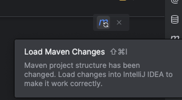
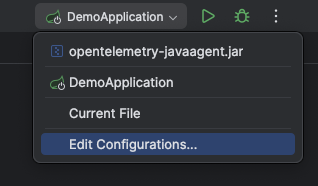
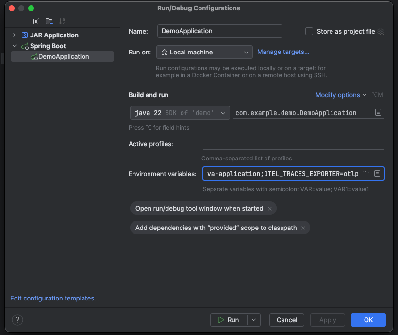

# Tutorial: Use GitLab Observability with a Java Spring application

For more information, see the history of the [**Distributed tracing** feature](../../development/tracing.md).
<!-- Update this note when observability_features flag is removed -->

In this tutorial, you'll learn how to create, configure, instrument, and monitor a Java Spring application using GitLab Observability features.

## Before you begin

To follow along this tutorial, you must have:

- A GitLab Ultimate subscription for GitLab.com or GitLab Self-Managed
- A local installation of Ruby on Rails
- Basic knowledge of Git, Java Spring, and the core concepts of [OpenTelemetry](https://opentelemetry.io/)

## Create a GitLab project

First, create a GitLab project and a corresponding access token.

1. On the left sidebar, at the top, select **Create new** (**{plus}**) and **New project/repository**.
1. Select **Create from template**.
1. Select **Spring** and then **Use template**.
1. Enter the project details.
   - In the **Project name** field, enter a name such as `test-spring-o11y`
1. Select **Create project**.
1. In the `test-sprint-o11y` project, on the left sidebar, select **Settings > Access tokens**.
1. Create an access token with the `api` scope and Developer role. Store the token value somewhere safe.
   You'll need it later.

## Run the application

Next, we'll run the application to ensure that it works.

1. After cloning the project from GitLab, open it in IntelliJ (or your preferred IDE).
1. Open `src/main/java/com.example.demo/DemoApplication` and run the application:

   

1. After initialization, the application should be available at `http://localhost:8000`. Test it out, then in the IDE select the **Stop** button.

## Add the OpenTelemetry dependencies

Use auto-instrumentation to instrument the application:

1. In the `pom.xml` file, add the required dependencies:

   ```xml
   <dependency>
       <groupId>io.opentelemetry</groupId>
       <artifactId>opentelemetry-api</artifactId>
   </dependency>
   <dependency>
       <groupId>io.opentelemetry</groupId>
       <artifactId>opentelemetry-sdk-extension-autoconfigure</artifactId>
   </dependency>
   <dependency>
       <groupId>io.opentelemetry</groupId>
       <artifactId>opentelemetry-sdk-extension-autoconfigure-spi</artifactId>
   </dependency>
   ```

   ```xml
   <dependencyManagement>
       <dependencies>
           <dependency>
               <groupId>io.opentelemetry</groupId>
               <artifactId>opentelemetry-bom</artifactId>
               <version>1.40.0</version>
               <type>pom</type>
               <scope>import</scope>
           </dependency>
       </dependencies>
   </dependencyManagement>
   ```

1. Update dependencies by selecting **Update Maven Changes**:

   

1. Download the OpenTelemetry java agent file from the OpenTelemetry repository.

   ```shell
   curl --location --http1.0 "https://github.com/open-telemetry/opentelemetry-java-instrumentation/releases/latest/download/opentelemetry-javaagent.jar"
   ```

## Define environment variables

The OpenTelemetry autoconfigure libraries read their configuration from environment variables.

1. From the top-right menu, select **Edit Configurations...**:

   

1. In the configuration menu, select the icon in the **Environment Variables** field.

   

1. Add the following set of environment variables, replacing `{{PATH_TO_JAVA_AGENT}}`, `{{PROJECT_ID}}`, `{{PROJECT_ACCESS_TOKEN}}` and `{{SERVICE_NAME}}` with the correct values. If using GitLab Self-Managed, replace `gitlab.com` with your self-managed instance hostname.
   - `JAVA_TOOL_OPTIONS=-javaagent:{{PATH_TO_JAVA_AGENT}}/opentelemetry-javaagent.jar`
   - `OTEL_EXPORTER_OTLP_ENDPOINT=https://gitlab.com/api/v4/projects/{{PROJECT_ID}}/observability`
   - `OTEL_EXPORTER_OTLP_HEADERS=PRIVATE-TOKEN\={{PROJECT_ACCESS_TOKEN}}`
   - `OTEL_EXPORTER=otlphttp`
   - `OTEL_METRIC_EXPORT_INTERVAL=15000`
   - `OTEL_SERVICE_NAME=example-java-application`

1. Restart the application and reload the page at `http://localhost:8000` a few times.

## View the information in GitLab

To view the exported information from your test project:

1. On the left sidebar, select **Search or go to** and find your project.
1. Select **Monitor**, then either **Logs**, **Metrics**, or **Traces**.
