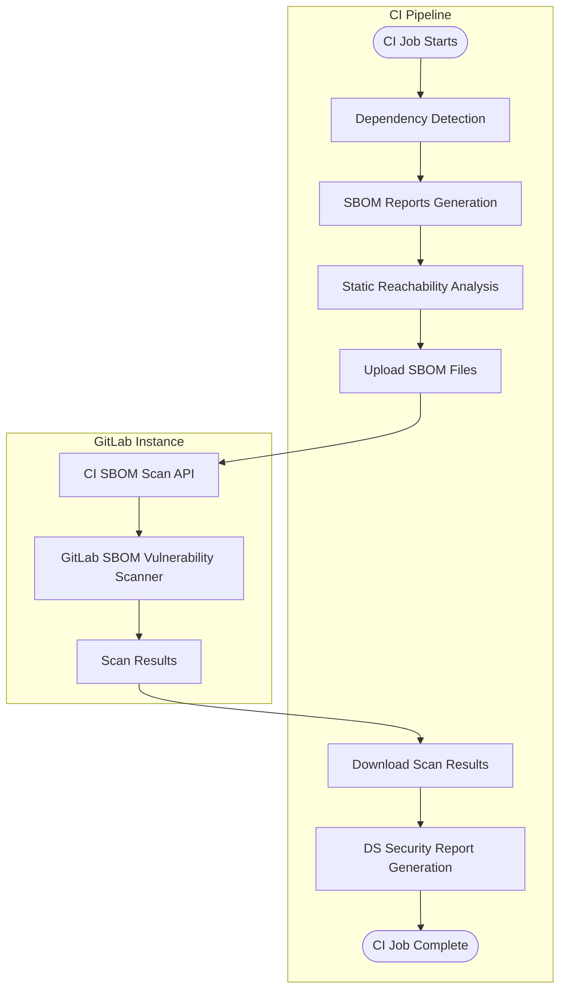



- Tier: Ultimate
- Offering: GitLab.com, GitLab Self-Managed, GitLab Dedicated





- [Introduced](https://gitlab.com/groups/gitlab-org/-/work_items/8026) in GitLab 17.4 as an [experiment](../../../../policy/development_stages_support.md#experiment) for default branch only [with a feature flag](../../../../administration/feature_flags/_index.md) named `dependency_scanning_using_sbom_reports`. Disabled by default.
- [Enabled on GitLab Self-Managed](https://gitlab.com/gitlab-org/gitlab/-/issues/395692) in GitLab 17.5.
- [Changed](https://gitlab.com/groups/gitlab-org/-/work_items/15960) from experiment to beta with support for all branches and [Enabled by default with the latest dependency scanning CI/CD templates](https://gitlab.com/gitlab-org/gitlab/-/issues/519597) for Cargo, Conda, Cocoapods, and Swift in GitLab 17.9.
- Feature flag `dependency_scanning_using_sbom_reports` removed in GitLab 17.10.
- [Changed](https://gitlab.com/groups/gitlab-org/-/work_items/15960) from beta to limited availability for GitLab.com only with a new [V2 CI/CD dependency scanning template](https://gitlab.com/gitlab-org/gitlab/-/merge_requests/201175/) in GitLab 18.5 [with a feature flag](../../../../administration/feature_flags/_index.md) named `dependency_scanning_sbom_scan_api`. Disabled by default.
- Feature flag `dependency_scanning_using_sbom_reports` [enabled by default](https://gitlab.com/gitlab-org/gitlab/-/work_items/551861) in GitLab 18.10.
- [Generally available](https://gitlab.com/groups/gitlab-org/-/work_items/20456) in GitLab 19.0.



Dependency scanning using CycloneDX Software Bill of Materials (SBOM) analyzes your application's
dependencies for known vulnerabilities. All dependencies are scanned,
[including transitive dependencies](../_index.md).

Dependency scanning is often considered part of Software Composition Analysis (SCA). SCA can contain
aspects of inspecting the items your code uses. These items typically include application and system
dependencies that are almost always imported from external sources, rather than sourced from items
you wrote yourself.

Dependency scanning can run in the development phase of your application's lifecycle. Using the new
dependency scanning analyzer in CI/CD pipelines, project dependencies are detected and reported in CycloneDX
SBOM reports. Security findings are identified and compared between the source
and target branches. Findings and their severity are listed in the merge request, enabling you to
proactively address the risk to your application, before the code change is committed. Security
findings for reported SBOM components are also identified by
[continuous vulnerability scanning](../../continuous_vulnerability_scanning/_index.md)
when new security advisories are published, independently from CI/CD pipelines.

GitLab offers both dependency scanning and [container scanning](../../container_scanning/_index.md) to
ensure coverage for all of these dependency types. To cover as much of your risk area as possible,
we encourage you to use all of our security scanners. For a comparison of these features, see
[Dependency scanning compared to container scanning](../../comparison_dependency_and_container_scanning.md).

Share any feedback on the new dependency scanning analyzer in this [feedback issue](https://gitlab.com/gitlab-org/gitlab/-/issues/523458).

## Turn on dependency scanning

Turn on dependency scanning for your project.

### Prerequisites

Prerequisites for all GitLab instances:

- The Developer, Maintainer, or Owner role for the project.
- A [supported lockfile or dependency graph export](#supported-languages-and-files),
  either committed to the repository or created in the CI/CD pipeline and passed as an artifact
  to the `dependency-scanning` job. Alternatively, [dependency resolution](#dependency-resolution)
  can generate the required files for supported ecosystems, or a
  [manifest file](#manifest-fallback) can be used as a fallback option.
- For self-managed runners, GitLab Runner with the
  [`docker`](https://docs.gitlab.com/runner/executors/docker/) or
  [`kubernetes`](https://docs.gitlab.com/runner/install/kubernetes/) executor.
- For hosted runners on GitLab.com, this configuration is enabled by default.

For GitLab Self-Managed only, [package metadata](../../../../administration/settings/security_and_compliance.md#choose-package-registry-metadata-to-sync)
for all PURL types to be scanned must be synchronized in the GitLab instance. If this data is not available in the GitLab instance,
dependency scanning cannot identify vulnerabilities.

### Update project pipeline configuration

To turn on dependency scanning, you must add the dependency scanning template to the project pipeline configuration.

By default, the `Dependency-Scanning.v2.gitlab-ci.yml` template runs the dependency scanning job
in merge request pipelines. If your project does not use merge request pipelines for other jobs,
this causes only the dependency scanning job to appear in the merge request pipeline, while all
other jobs run in a separate branch pipeline. To disable this behavior, see
[disable MR pipelines for dependency scanning](#disable-merge-request-pipelines-for-dependency-scanning).

To turn on dependency scanning through the GitLab UI:

1. In the top bar, select **Search or go to** and find your project.
1. In the left sidebar, select **Code** > **Repository**.
1. Select the `.gitlab-ci.yml` file.
1. Select **Edit** > **Edit single file**.
1. Add the `Dependency-Scanning.v2` CI/CD template:

   ```yaml
   include:
     - template: Jobs/Dependency-Scanning.v2.gitlab-ci.yml
   ```

1. Select **Commit changes**.

## Available container images

This feature relies on container images to run CI jobs. The default CI job
definitions reference these images by their major version tag (for example,
`dependency-scanning:2`), so you automatically receive patch and minor updates
without changing your CI/CD configuration.

### Maintenance policy

GitLab follows the [release and maintenance policy](../../../../policy/maintenance.md),
to provide bug fixes for the current stable release and security fixes for the
previous two monthly releases.

CI/CD jobs reference images by their major version tag
(for example, `dependency-scanning:2`), so fixes are automatically available to all
GitLab versions compatible with that major image version.

This applies to the images listed below.
Previous images are not covered by this policy.

### Current images

| CI/CD job                               | Production image                                                                                        | GitLab version |
| --------------------------------------- | ------------------------------------------------------------------------------------------------------- | -------------- |
| `dependency-scanning`                   | `registry.gitlab.com/security-products/dependency-scanning:2`                                           | `19.x`         |
| `dependency-scanning:maven-resolution`  | `registry.gitlab.com/security-products/dependency-resolution/ubi9/openjdk-21:1`                         | `18.x`, `19.x` |
| `dependency-scanning:gradle-resolution` | `registry.gitlab.com/security-products/dependency-resolution/ubi9/openjdk-17-with-gradle-8:1`           | `19.x`         |
| `dependency-scanning:python-resolution` | `registry.gitlab.com/security-products/dependency-resolution/ubi9/python-312-minimal-with-piptools-7:9` | `18.x`,`19.x`  |

Current images are regularly rebuilt to incorporate upstream patches from base image vendors.

### Previous images

These images are deprecated and no longer receive bug fixes or new features.
They remain available on the container registry and continue to work with their
corresponding GitLab version. Using a deprecated image with a newer GitLab version
is not supported and might produce unexpected results.

| CI/CD job             | Production image                                              | GitLab version | Deprecated in |
| --------------------- | ------------------------------------------------------------- | -------------- | ------------- |
| `dependency-scanning` | `registry.gitlab.com/security-products/dependency-scanning:1` | `18.x`         | `19.0`        |
| `dependency-scanning` | `registry.gitlab.com/security-products/dependency-scanning:0` | `18.x`         | `19.0`        |

### FIPS compliance

The dependency scanning analyzer image and all [dependency resolution images](#dependency-resolution)
are based on [Red Hat UBI](https://www.redhat.com/en/blog/introducing-red-hat-universal-base-image) that
use a FIPS 140-validated cryptographic module. No additional configuration is required for
FIPS-enabled environments.

## Understanding the results

Dependency scanning analyzer outputs:

- A CycloneDX SBOM for each supported lockfile or dependency graph export detected.
- A single dependency scanning report for all scanned SBOM documents (GitLab.com and GitLab Self-Managed only).

> [!note]
> If the analyzer does not find any [supported file](#supported-languages-and-files),
> the dependency scanning job completes successfully and prints a warning in the CI/CD job log.
> No CycloneDX SBOM or dependency scanning reports are generated in this case.

### CycloneDX Software Bill of Materials

The dependency scanning analyzer outputs a [CycloneDX](https://cyclonedx.org/) Software Bill of Materials (SBOM)
for each directory where a supported lockfile, dependency graph, or manifest file is detected. The CycloneDX SBOMs are created as job artifacts.

The CycloneDX SBOMs are:

- Named `gl-sbom-<package-type>-<package-manager>.cdx.json`.
- Available as job artifacts of the dependency scanning job.
- Uploaded as `cyclonedx` reports.
- Saved in the same directory as the detected lockfile or dependency graph files.

For example, if your project has the following structure:

```plaintext
.
├── ruby-project/
│   └── Gemfile.lock
├── ruby-project-2/
│   └── Gemfile.lock
└── php-project/
    └── composer.lock
```

The following CycloneDX SBOMs are created as job artifacts:

```plaintext
.
├── ruby-project/
│   ├── Gemfile.lock
│   └── gl-sbom-gem-bundler.cdx.json
├── ruby-project-2/
│   ├── Gemfile.lock
│   └── gl-sbom-gem-bundler.cdx.json
└── php-project/
    ├── composer.lock
    └── gl-sbom-packagist-composer.cdx.json
```

### Dependency scanning report



- Offering: GitLab.com, GitLab Self-Managed



The dependency scanning analyzer generates a dependency scanning report that documents all
vulnerabilities identified in dependencies identified in the CycloneDX SBOM files.

The dependency scanning report is:

- Named `gl-dependency-scanning-report.json`.
- Available as a job artifact of the dependency scanning job.
- Uploaded as a `dependency_scanning` report.
- Saved in the root directory of the project.

## Optimization

To optimize dependency scanning with SBOM, use any of the following methods:

- Exclude paths
- Limit scanning to a maximum directory depth

### Exclude paths

Exclude paths to optimize scanning performance and focus on relevant repository content.

List excluded paths in the `.gitlab-ci.yml` file:

- If using the dependency scanning template, use the `DS_EXCLUDED_PATHS` CI/CD variable.
- If using the dependency scanning CI/CD component, use the `excluded_paths` spec input.

#### Exclusion patterns

Exclusion patterns follow these rules:

- Patterns without slashes match file or directory names at any depth in the project (example: `test` matches `./test`, `src/test`).
- Patterns with slashes use parent directory matching - they match paths that start with the pattern (example: `a/b` matches `a/b` and `a/b/c`, but not `c/a/b`).
- Standard glob wildcards are supported (example: `a/**/b` matches `a/b`, `a/x/b`, `a/x/y/b`).
- Leading and trailing slashes are ignored (example: `/build` and `build/` work the same as `build`).

### Limit scanning to a maximum directory depth

Limit scanning to a maximum directory depth to optimize scanning performance and reduce the number
of files analyzed.

The root directory is counted as depth `1`, and each subdirectory increments the depth by 1. The
default depth is `2`. A value of `-1` scans all directories regardless of depth.

To specify the maximum depth in the `.gitlab-ci.yml` file:

- If using the dependency scanning template, use the `DS_MAX_DEPTH` CI/CD variable.
- If using the dependency scanning CI/CD component, use the `max_scan_depth` spec input.

In the following example, with `DS_MAX_DEPTH` set to `3`, subdirectories of the `common` directory
are not scanned.

```plaintext
timer
├── integration
│   ├── doc
│   └── modules
└── source
    ├── common
    │   ├── cplusplus
    │   └── go
    ├── linux
    ├── macos
    └── windows
```

## Roll out

After you are confident in the dependency scanning with SBOM results for a single project, you can
extend its implementation to multiple projects and groups. For details, see
[Enforce scanning on multiple projects](#enforce-scanning-on-multiple-projects).

If you have unique requirements, dependency scanning with SBOM can be run in
[offline environments](#offline-environment).

## Supported package types

For the security analysis to be effective, the components listed in your SBOM report must have corresponding
entries in the [GitLab advisory database](../../gitlab_advisory_database/_index.md).

The GitLab SBOM Vulnerability Scanner can report dependency scanning vulnerabilities for components with the
following [PURL types](https://github.com/package-url/purl-spec/blob/346589846130317464b677bc4eab30bf5040183a/PURL-TYPES.rst):

- `cargo`
- `composer`
- `conan`
- `gem`
- `golang`
- `maven`
- `npm`
- `nuget`
- `pypi`
- `swift`

## Supported languages and files

| Language                  | Package manager | File(s)                                         | Description                                                                                                                                                                           | Dependency graph export support | Static reachability support |
| ------------------------- | --------------- | ----------------------------------------------- | ------------------------------------------------------------------------------------------------------------------------------------------------------------------------------------- | ------------------------------- | --------------------------- |
| C#                        | NuGet           | `packages.lock.json`                            | Lockfiles generated by `nuget`.                                                                                                                                                       |                      |                   |
| C/C++                     | Conan           | `conan.lock`                                    | Lockfiles generated by `conan`.                                                                                                                                                       |                      |                   |
| C/C++/Fortran/Go/Python/R | Conda           | `conda-lock.yml`                                | Environment files generated by `conda-lock`.                                                                                                                                          |                       |                   |
| Dart                      | pub             | `pubspec.lock`, `pub.graph.json`                | Lockfiles generated by `pub`. Dependency graph export derived from `dart pub deps --json > pub.graph.json`.                                                                           |                      |                   |
| Go                        | go              | `go.mod`, `go.graph`                            | Module files generated by the standard `go` toolchain. Dependency graph export derived from `go mod graph > go.graph`.                                                                |                      |                   |
| Java                      | ivy             | `ivy-report.xml`                                | Dependency graph exports generated by the `report` Apache Ant task.                                                                                                                   |                       |                  |
| Java                      | Maven           | `maven.graph.json`                              | Dependency graph exports generated by `mvn dependency:tree -DoutputType=json`.                                                                                                        |                      |                  |
| Java                      | Maven           | `pom.xml`                                       | Maven manifest files used by [dependency resolution](#dependency-resolution), or as a [manifest fallback](#manifest-fallback) when no dependency graph export is available.           |                       |                  |
| Java/Kotlin               | Gradle          | `gradle.graph.txt`                              | Dependency graph exports generated by `./gradlew dependencies`.                                                                                                                       |                      |                  |
| Java/Kotlin               | Gradle          | `dependencies.lock`, `dependencies.direct.lock` | Lockfiles generated by [gradle-dependency-lock-plugin](https://github.com/nebula-plugins/gradle-dependency-lock-plugin).                                                              |                      |                  |
| Java/Kotlin               | Gradle          | `gradle.lockfile`                               | Lockfiles generated by `gradle dependencies --write-locks`.                                                                                                                           |                       |                  |
| Java/Kotlin               | Gradle          | `gradle-html-dependency-report.js`              | Dependency graph exports generated by the [htmlDependencyReport](https://docs.gradle.org/current/dsl/org.gradle.api.tasks.diagnostics.DependencyReportTask.html) task.                |                      |                  |
| Java/Kotlin               | Gradle          | `build.gradle`, `build.gradle.kts`              | Gradle build files used by [dependency resolution](#dependency-resolution), or as a [manifest fallback](#manifest-fallback) when no lockfile or dependency graph export is available. |                       |                  |
| JavaScript/TypeScript     | npm             | `package-lock.json`, `npm-shrinkwrap.json`      | Lockfiles generated by `npm` v5 or later (earlier versions, which do not generate a `lockfileVersion` attribute, are not supported).                                                  |                      |                  |
| JavaScript/TypeScript     | pnpm            | `pnpm-lock.yaml`                                | Lockfiles generated by `pnpm`.                                                                                                                                                        |                      |                  |
| JavaScript/TypeScript     | yarn            | `yarn.lock`                                     | Lockfiles generated by `yarn`.                                                                                                                                                        |                      |                  |
| Objective-C               | CocoaPods       | `Podfile.lock`                                  | Lockfiles generated by `cocoapods`.                                                                                                                                                   |                       |                   |
| PHP                       | composer        | `composer.lock`                                 | Lockfiles generated by `composer`.                                                                                                                                                    |                      |                   |
| Python                    | pip             | `pipdeptree.json`                               | Dependency graph exports generated by `pipdeptree --json`.                                                                                                                            |                      |                  |
| Python                    | pip             | `requirements.txt` (lockfile)                   | Lockfiles generated by `pip-compile`.                                                                                                                                                 |                      |                  |
| Python                    | pip             | `requirements.txt`                              | Manifest files used by [dependency resolution](#dependency-resolution), or as a [manifest fallback](#manifest-fallback) when no lockfile or dependency graph export is available.     |                       |                   |
| Python                    | pipenv          | `Pipfile.lock`                                  | Lockfiles generated by `pipenv`.                                                                                                                                                      |                       |                   |
| Python                    | pipenv          | `pipenv.graph.json`                             | Dependency graph exports generated by `pipenv graph --json-tree >pipenv.graph.json`.                                                                                                  |                      |                  |
| Python                    | poetry          | `poetry.lock`                                   | Lockfiles generated by `poetry` v1 or v2.                                                                                                                                             |                      |                  |
| Python                    | uv <sup>1</sup>  | `uv.lock`                                       | Lockfiles generated by `uv`.                                                                                                                                                          |                      |                  |
| Ruby                      | bundler         | `Gemfile.lock`, `gems.locked`                   | Lockfiles generated by `bundler`.                                                                                                                                                     |                      |                   |
| Rust                      | cargo           | `Cargo.lock`                                    | Lockfiles generated by `cargo`.                                                                                                                                                       |                      |                   |
| Scala                     | sbt             | `dependencies-compile.dot`                      | Dependency graph exports generated by `sbt dependencyDot`.                                                                                                                            |                      |                   |
| Swift                     | swift           | `Package.resolved`                              | Lockfiles generated by `swift`.                                                                                                                                                       |                       |                   |

**Footnotes**:

1. If a lockfile contains multiple entries for the same package with different environment markers (for example, numpy==2.2.6 for Python <3.11 and numpy==2.4.1 for Python ≥3.11), only the first entry is parsed and reported.

### Package hash information

Dependency scanning SBOMs include package hash information when available. This information is provided only for NuGet packages.
Package hashes appear in the following locations within the SBOM, allowing you to verify package integrity and authenticity:

- Dedicated hashes field
- PURL qualifiers

For example:

```json
{
  "name": "Iesi.Collections",
  "version": "4.0.4",
  "purl": "pkg:nuget/Iesi.Collections@4.0.4?sha512=8e579b4a3bf66bb6a661f297114b0f0d27f6622f6bd3f164bef4fa0f2ede865ef3f1dbbe7531aa283bbe7d86e713e5ae233fefde9ad89b58e90658ccad8d69f9",
  "hashes": [
    {
      "alg": "SHA-512",
      "content": "8e579b4a3bf66bb6a661f297114b0f0d27f6622f6bd3f164bef4fa0f2ede865ef3f1dbbe7531aa283bbe7d86e713e5ae233fefde9ad89b58e90658ccad8d69f9"
    }
  ],
  "type": "library",
  "bom-ref": "pkg:nuget/Iesi.Collections@4.0.4?sha512=8e579b4a3bf66bb6a661f297114b0f0d27f6622f6bd3f164bef4fa0f2ede865ef3f1dbbe7531aa283bbe7d86e713e5ae233fefde9ad89b58e90658ccad8d69f9"
}
```

## Customizing analyzer behavior

How to customize the analyzer varies depending on the enablement solution.

> [!warning]
> Test all customization of GitLab analyzers in a merge request before merging these changes to the
> default branch. Failure to do so can give unexpected results, including a large number of false
> positives.

### Customizing behavior with the CI/CD template

#### Available spec inputs

The following spec inputs can be used in combination with the `Dependency-Scanning.v2.gitlab-ci.yml` template.

| Spec Input                                  | Type    | Default                                                                                                   | Description                                                                                                                                                                                                                                                           |
| ------------------------------------------- | ------- | --------------------------------------------------------------------------------------------------------- | --------------------------------------------------------------------------------------------------------------------------------------------------------------------------------------------------------------------------------------------------------------------- |
| `job_name`                                  | string  | `"dependency-scanning"`                                                                                   | The name of the dependency scanning job.                                                                                                                                                                                                                              |
| `stage`                                     | string  | `test`                                                                                                    | The stage of the dependency scanning job.                                                                                                                                                                                                                             |
| `allow_failure`                             | boolean | `true`                                                                                                    | Whether the dependency scanning job failure should fail the pipeline.                                                                                                                                                                                                 |
| `analyzer_image_prefix`                     | string  | `"$CI_TEMPLATE_REGISTRY_HOST/security-products"`                                                          | The registry URL prefix pointing to the repository of the analyzer.                                                                                                                                                                                                   |
| `analyzer_image_name`                       | string  | `"dependency-scanning"`                                                                                   | The repository of the analyzer image used by the dependency-scanning job.                                                                                                                                                                                             |
| `analyzer_image_version`                    | string  | `"2"`                                                                                                     | The version of the analyzer image used by the dependency-scanning job.                                                                                                                                                                                                |
| `additional_ca_cert_bundle`                 | string  |                                                                                                           | CA certificate bundle to trust. The CA bundle provided here is added to the system's certificates and also used by other tools during the scanning process. For more details, see [Custom TLS certificate authority](#custom-tls-certificate-authority).              |
| `pip_manifest_file_name_pattern`            | string  |                                                                                                           | Custom pip manifest file name pattern to use for dependency resolution and manifest scanning. The pattern should match file names only, not directory paths. See [doublestar library](https://www.github.com/bmatcuk/doublestar/tree/v1#patterns) for syntax details. |
| `pipcompile_lockfile_file_name_pattern`     | string  |                                                                                                           | Custom pip-compile lockfile file name pattern to use when analyzing. The pattern should match file names only, not directory paths. See [doublestar library](https://www.github.com/bmatcuk/doublestar/tree/v1#patterns) for syntax details.                          |
| `pipcompile_requirements_file_name_pattern` | string  |                                                                                                           | [Deprecated](https://gitlab.com/gitlab-org/gitlab/-/work_items/598796) in GitLab 19.0: use `pipcompile_lockfile_file_name_pattern` instead.                                                                                                                           |
| `max_scan_depth`                            | number  | `2`                                                                                                       | Defines how many directory levels analyzer should search for supported files. A value of -1 means the analyzer will search all directories regardless of depth.                                                                                                       |
| `excluded_paths`                            | string  | `"**/spec,**/test,**/tests,**/tmp"`                                                                       | A comma-separated list of paths (globs supported) to exclude from the scan.                                                                                                                                                                                           |
| `include_dev_dependencies`                  | boolean | `true`                                                                                                    | Include development/test dependencies when scanning a supported file.                                                                                                                                                                                                 |
| `enable_static_reachability`                | boolean | `false`                                                                                                   | Enable [static reachability](../static_reachability.md).                                                                                                                                                                                                              |
| `enable_manifest_fallback`                  | boolean | `true`                                                                                                    | Enable [manifest fallback](#manifest-fallback).                                                                                                                                                                                                                       |
| `analyzer_log_level`                        | string  | `"info"`                                                                                                  | Logging level for dependency scanning. The options are fatal, error, warn, info, debug.                                                                                                                                                                               |
| `enable_vulnerability_scan`                 | boolean | `true`                                                                                                    | Enable the vulnerability analysis of generated SBOMs                                                                                                                                                                                                                  |
| `api_timeout`                               | number  | `10`                                                                                                      | Dependency scanning SBOM API request timeout in seconds.                                                                                                                                                                                                              |
| `api_scan_download_delay`                   | number  | `3`                                                                                                       | Dependency scanning SBOM API initial delay in seconds before downloading scan results.                                                                                                                                                                                |
| `resolution_jobs_stage`                     | string  | `.pre`                                                                                                    | The stage for the dependency resolution jobs.                                                                                                                                                                                                                         |
| `resolution_jobs_allow_failure`             | boolean | `true`                                                                                                    | When `true`, a failed resolution job does not fail the pipeline. When `false`, a resolution failure blocks the pipeline.                                                                                                                                              |
| `disabled_resolution_jobs`                  | string  | `""`                                                                                                      | Comma-separated list of resolution jobs to disable (for example, `"maven, python"`). By default, all available resolution jobs are enabled. Possible values are: `maven`,`gradle`,`python`. See [dependency resolution](#dependency-resolution)                       |
| `maven_resolution_job_name`                 | string  | `"dependency-scanning:maven-resolution"`                                                                  | The name of the job for Maven dependency resolution.                                                                                                                                                                                                                  |
| `maven_resolution_image`                    | string  | `"registry.gitlab.com/security-products/dependency-resolution/ubi9/openjdk-21:1"`                         | The image used by the Maven dependency resolution job.                                                                                                                                                                                                                |
| `maven_dependency_plugin_version`           | string  | `"3.7.0"`                                                                                                 | The version of `maven-dependency-plugin` used during Maven dependency resolution. Must be `3.7.0` or later.                                                                                                                                                           |
| `python_resolution_job_name`                | string  | `"dependency-scanning:python-resolution"`                                                                 | The name of the job for Python dependency resolution.                                                                                                                                                                                                                 |
| `python_resolution_image`                   | string  | `"registry.gitlab.com/security-products/dependency-resolution/ubi9/python-312-minimal-with-piptools-7:9"` | The image used by the Python dependency resolution job.                                                                                                                                                                                                               |
| `gradle_resolution_job_name`                | string  | `"dependency-scanning:gradle-resolution"`                                                                 | The name of the job for Gradle dependency resolution.                                                                                                                                                                                                                 |
| `gradle_resolution_image`                   | string  | `"registry.gitlab.com/security-products/dependency-resolution/ubi9/openjdk-17-with-gradle-8:1"`           | The image used by the Gradle dependency resolution job.                                                                                                                                                                                                               |

#### Available CI/CD variables

These variables can replace spec inputs and are also compatible with the beta `latest` template.

| CI/CD variables                                | Description                                                                                                                                                                                                                                                                                                                                                                                                                                                                                                                                                                                      |
| ---------------------------------------------- | ------------------------------------------------------------------------------------------------------------------------------------------------------------------------------------------------------------------------------------------------------------------------------------------------------------------------------------------------------------------------------------------------------------------------------------------------------------------------------------------------------------------------------------------------------------------------------------------------ |
| `AST_ENABLE_MR_PIPELINES`                      | Control whether dependency scanning job runs in MR or branch pipeline. Default: `"true"`. If your project does not use MR pipelines, disable this to avoid duplicate pipelines.                                                                                                                                                                                                                                                                                                                                                                                                                  |
| `ADDITIONAL_CA_CERT_BUNDLE`                    | CA certificate bundle to trust. The CA bundle provided here is added to the system's certificates and also used by other tools during the scanning process. For more details, see [Custom TLS certificate authority](#custom-tls-certificate-authority).                                                                                                                                                                                                                                                                                                                                         |
| `ANALYZER_ARTIFACT_DIR`                        | Directory where CycloneDX reports (SBOMs) are saved. Default `${CI_PROJECT_DIR}/sca-artifacts`.                                                                                                                                                                                                                                                                                                                                                                                                                                                                                                  |
| `DEPENDENCY_SCANNING_DISABLED`                 | When set to `"true"` or `"1"`, disables all dependency scanning jobs. Default: not set.                                                                                                                                                                                                                                                                                                                                                                                                                                                                                                          |
| `DS_EXCLUDED_ANALYZERS`                        | Specify the analyzers (by name) to exclude from dependency scanning.                                                                                                                                                                                                                                                                                                                                                                                                                                                                                                                             |
| `DS_EXCLUDED_PATHS`                            | Exclude files and directories from the scan based on the paths. A comma-separated list of patterns. Patterns can be globs (see [`doublestar.Match`](https://pkg.go.dev/github.com/bmatcuk/doublestar/v4@v4.0.2#Match) for supported patterns), or file or folder paths (for example, `doc,spec`). See [Exclusion patterns](#exclusion-patterns) for matching rules. This is a pre-filter which is applied before the scan is executed. Applies both for dependency detection and static reachability. Default: `"**/spec,**/test,**/tests,**/tmp,**/node_modules,**/.bundle,**/vendor,**/.git"`. |
| `DS_MAX_DEPTH`                                 | Defines how many directory levels deep that the analyzer should search for supported files to scan. A value of `-1` scans all directories regardless of depth. Default: `2`.                                                                                                                                                                                                                                                                                                                                                                                                                     |
| `DS_INCLUDE_DEV_DEPENDENCIES`                  | When set to `"false"`, development dependencies are not reported. Only projects using Composer, Conda, Gradle, Maven, npm, pnpm, Pipenv, Poetry, or uv are supported. Default: `"true"`                                                                                                                                                                                                                                                                                                                                                                                                          |
| `DS_PIP_MANIFEST_FILE_NAME_PATTERN`            | Defines which pip manifest files to process for dependency resolution and manifest scanning, using glob pattern matching (for example, `custom-requirements.txt` or `*-requirements.txt`). The pattern should match filenames only, not directory paths. See [glob pattern documentation](https://github.com/bmatcuk/doublestar/tree/v1?tab=readme-ov-file#patterns) for syntax details.                                                                                                                                                                                                         |
| `PIP_REQUIREMENTS_FILE`                        | [Deprecated](https://gitlab.com/gitlab-org/gitlab/-/work_items/588580) in GitLab 19.0: use `DS_PIP_MANIFEST_FILE_NAME_PATTERN` instead.                                                                                                                                                                                                                                                                                                                                                                                                                                                          |
| `DS_PIPCOMPILE_LOCKFILE_FILE_NAME_PATTERN`     | Defines which pip-compile lockfiles to process using glob pattern matching (for example, `requirements*.txt` or `*-requirements.txt`). The pattern should match filenames only, not directory paths. See [glob pattern documentation](https://github.com/bmatcuk/doublestar/tree/v1?tab=readme-ov-file#patterns) for syntax details.                                                                                                                                                                                                                                                             |
| `DS_PIPCOMPILE_REQUIREMENTS_FILE_NAME_PATTERN` | [Deprecated](https://gitlab.com/gitlab-org/gitlab/-/work_items/598796) in GitLab 19.0: use `DS_PIPCOMPILE_LOCKFILE_FILE_NAME_PATTERN` instead.                                                                                                                                                                                                                                                                                                                                                                                                                                                   |
| `SECURE_ANALYZERS_PREFIX`                      | Override the name of the Docker registry providing the official default images (proxy).                                                                                                                                                                                                                                                                                                                                                                                                                                                                                                          |
| `DS_FF_LINK_COMPONENTS_TO_GIT_FILES`           | Link components in the dependency list to files committed to the repository rather than lockfiles and graph files generated dynamically in a CI/CD pipeline. This ensures all components are linked to a source file in the repository. Default: `"false"`.                                                                                                                                                                                                                                                                                                                                      |
| `SEARCH_IGNORE_HIDDEN_DIRS`                    | Ignore hidden directories. Works both for dependency scanning and static reachability. Default: `"true"`.                                                                                                                                                                                                                                                                                                                                                                                                                                                                                        |
| `DS_STATIC_REACHABILITY_ENABLED`               | Enables [static reachability](../static_reachability.md). Default: `"false"`.                                                                                                                                                                                                                                                                                                                                                                                                                                                                                                                    |
| `DS_ENABLE_VULNERABILITY_SCAN`                 | Enable vulnerability scanning of generated SBOM files. Generates a [dependency scanning report](#dependency-scanning-report). Default: `"true"`.                                                                                                                                                                                                                                                                                                                                                                                                                                                 |
| `DS_API_TIMEOUT`                               | Dependency scanning SBOM API request timeout in seconds (minimum: `5`, maximum: `300`) Default: `10`                                                                                                                                                                                                                                                                                                                                                                                                                                                                                             |
| `DS_API_SCAN_DOWNLOAD_DELAY`                   | Initial delay in seconds before downloading scan results (minimum: 1, maximum: 120) Default: `3`                                                                                                                                                                                                                                                                                                                                                                                                                                                                                                 |
| `DS_ENABLE_MANIFEST_FALLBACK`                  | Enable manifest fallback when no lockfile or dependency graph export is available. See [Manifest fallback](#manifest-fallback). Default: `"true"`.                                                                                                                                                                                                                                                                                                                                                                                                                                               |
| `DS_SKIP_IF_NO_SUPPORTED_FILES`                | When set to `"true"`, skips the dependency scanning job if no [supported file](#supported-languages-and-files) is detected in the project. For details, see [skip the job when no supported file is present](#skip-the-job-when-no-supported-file-is-present). Default: `"false"`.                                                                                                                                                                                                                                                                                                                            |
| `SECURE_LOG_LEVEL`                             | Log level. Default: `"info"`.                                                                                                                                                                                                                                                                                                                                                                                                                                                                                                                                                                    |
| `DS_DISABLED_RESOLUTION_JOBS`                  | Comma-separated list of resolution jobs to disable (for example, `"maven, python"`). By default, all available resolution jobs are enabled. Possible values are: `maven`,`gradle`,`python`.                                                                                                                                                                                                                                                                                                                                                                                                      |
| `DS_MAVEN_RESOLUTION_IMAGE`                    | The image used by the Maven dependency resolution job.                                                                                                                                                                                                                                                                                                                                                                                                                                                                                                                                           |
| `DS_MAVEN_DEPENDENCY_PLUGIN_VERSION`           | The version of `maven-dependency-plugin` used during Maven dependency resolution. Must be `3.7.0` or later. Default: `3.7.0`.                                                                                                                                                                                                                                                                                                                                                                                                                                                                    |
| `MAVEN_ARGS`                                   | Additional arguments to pass to the `mvn` command during Maven dependency resolution. Replaces the legacy `MAVEN_CLI_OPTS` variable.                                                                                                                                                                                                                                                                                                                                                                                                                                                             |
| `DS_PYTHON_RESOLUTION_IMAGE`                   | The image used by the Python dependency resolution job.                                                                                                                                                                                                                                                                                                                                                                                                                                                                                                                                          |
| `PIP_INDEX_URL`                                | Base URL of the Python package index used during Python dependency resolution. Default: `https://pypi.org/simple`.                                                                                                                                                                                                                                                                                                                                                                                                                                                                            |
| `PIP_EXTRA_INDEX_URL`                          | Additional Python package index URLs to use with `PIP_INDEX_URL` during Python dependency resolution.                                                                                                                                                                                                                                                                                                                                                                                                                                                                                  |
| `DS_GRADLE_RESOLUTION_IMAGE`                   | The image used by the Gradle dependency resolution job.                                                                                                                                                                                                                                                                                                                                                                                                                                                                                                                                          |
| `GRADLE_CLI_OPTS`                              | Additional arguments to pass to the `gradle` or `gradlew` command during Gradle dependency resolution.                                                                                                                                                                                                                                                                                                                                                                                                                                                                                          |

### Disable merge request pipelines for dependency scanning

By default, the `Dependency-Scanning.v2.gitlab-ci.yml` template runs the dependency scanning job in
merge request pipelines. If your project does not use merge request pipelines for other jobs, this
can cause two pipelines to run for each merge request, with other jobs running in a separate branch
pipeline. To disable this behavior, set the spec input `enable_mr_pipelines: false` or CI/CD
variable `AST_ENABLE_MR_PIPELINES: "false"`.

### Skip the job when no supported file is present

By default, the dependency scanning job runs in every pipeline that includes the template, even
when the project does not contain a [supported file](#supported-languages-and-files). To skip the
job when no supported file is detected, set `DS_SKIP_IF_NO_SUPPORTED_FILES` to `"true"`:

```yaml
include:
  - template: Jobs/Dependency-Scanning.v2.gitlab-ci.yml

variables:
  DS_SKIP_IF_NO_SUPPORTED_FILES: "true"
```

When the variable is set, the dependency scanning job runs only if the project contains at least
one file in the [supported files list](#supported-languages-and-files), or a custom pattern is set
with `DS_PIPCOMPILE_LOCKFILE_FILE_NAME_PATTERN`, `DS_PIP_MANIFEST_FILE_NAME_PATTERN`, or `PIP_REQUIREMENTS_FILE` (deprecated).

### Custom TLS certificate authority

Dependency scanning allows for use of custom TLS certificates for SSL/TLS connections instead of the
default shipped with the analyzer container image.

#### Using a custom TLS certificate authority

To use a custom TLS certificate authority, assign the
[text representation of the X.509 PEM public-key certificate](https://www.rfc-editor.org/rfc/rfc7468#section-5.1)
to the CI/CD variable `ADDITIONAL_CA_CERT_BUNDLE`.

For example, to configure the certificate in the `.gitlab-ci.yml` file:

```yaml
variables:
  ADDITIONAL_CA_CERT_BUNDLE: |
      -----BEGIN CERTIFICATE-----
      MIIGqTCCBJGgAwIBAgIQI7AVxxVwg2kch4d56XNdDjANBgkqhkiG9w0BAQsFADCB
      ...
      jWgmPqF3vUbZE0EyScetPJquRFRKIesyJuBFMAs=
      -----END CERTIFICATE-----
```

## Dependency resolution



- [Introduced](https://gitlab.com/groups/gitlab-org/-/work_items/20461) for Maven and Python in GitLab 18.11, disabled by default.
- [Added](https://gitlab.com/gitlab-org/gitlab/-/work_items/590734) support for Gradle. Enabled by default for all supported projects in GitLab 19.0.



When a project does not have a supported lockfile or dependency graph export committed to its
repository, the dependency resolution can automatically generate the required files before the scan runs.

Dependency resolution automatically triggers when supported manifest files are detected in your project.
Resolution jobs run in the `.pre` stage using minimal ecosystem images (for example, `ubi9/openjdk-21`)
to natively generate lockfiles or dependency graph exports. These jobs preserve any existing lockfiles
or graph exports, only creating them when absent. The generated artifacts are then consumed by the
`dependency-scanning` job in the `test` stage. You can substitute the default images with equivalent
alternatives (such as `eclipse-temurin:jdk-21`) or custom images containing the necessary build tools.

The following ecosystems support dependency resolution:

| Language    | Package manager | Manifest files detected                                                                                                           | Resolution command    | Output artifact       |
| ----------- | --------------- | --------------------------------------------------------------------------------------------------------------------------------- | --------------------- | --------------------- |
| Java        | Maven           | `pom.xml`                                                                                                                         | `mvn dependency:tree` | `maven.graph.json`    |
| Java/Kotlin | Gradle          | `build.gradle`, `build.gradle.kts`                                                                                                | `gradle dependencies` | `gradle.graph.txt`    |
| Python      | pip, setuptools | `requirements.txt`, `requirements.in`, `requirements.pip`, `requires.txt`, `setup.py`, `setup.cfg`, `pyproject.toml` (non-Poetry) | `pip-compile`         | `pipcompile.lock.txt` |

### Customizing dependency resolution

For all available options see [available spec inputs](#available-spec-inputs) and [available CI/CD variables](#available-cicd-variables).

#### Use a custom dependency resolution image

To use your own image, you can set the following inputs:

- `maven_resolution_image`
- `gradle_resolution_image`
- `python_resolution_image`

For instance, to use a custom image for maven resolution:

```yaml
include:
  - template: Jobs/Dependency-Scanning.v2.gitlab-ci.yml
    inputs:
      maven_resolution_image: "registry.gitlab.mycorp.com/eclipse-temurin:jdk-21"
```

Alternatively, you can set the following CI/CD variables:

- `DS_MAVEN_RESOLUTION_IMAGE`
- `DS_GRADLE_RESOLUTION_IMAGE`
- `DS_PYTHON_RESOLUTION_IMAGE`

#### Disable dependency resolution

To disable dependency resolution for a specific ecosystem, use the
`DS_DISABLED_RESOLUTION_JOBS` CI/CD variable or the `disabled_resolution_jobs` input.
Possible values are: `maven`,`gradle`,`python`.

For instance, to disable dependency resolution for maven:

```yaml
variables:
  DS_DISABLED_RESOLUTION_JOBS: "maven"

include:
  - template: Jobs/Dependency-Scanning.v2.gitlab-ci.yml
```

### Security considerations for dependency resolution

Dependency resolution jobs execute ecosystem-native build tools (`mvn`, `gradle`,
`pip-compile`) in the CI/CD job container. These tools natively honor
environment variables and configuration files that can load extensions or run
arbitrary code at startup, including:

- Maven: `MAVEN_ARGS`, `MAVEN_CLI_OPTS` (legacy), `MAVEN_OPTS`,
  `JAVA_TOOL_OPTIONS`, any `settings.xml` referenced through `-s` or `--settings`,
  and `<extensions>` declared in `pom.xml` or `settings.xml`.
- Gradle: `GRADLE_OPTS`, `JAVA_TOOL_OPTIONS`, `--init-script`, and top-level
  Groovy or Kotlin code in `build.gradle` or `build.gradle.kts`.
- Python: `PIP_INDEX_URL`, `PIP_EXTRA_INDEX_URL`, `setup.py`, and lockfile
  install hooks.

Anyone who can set these CI/CD variables or modify the project's build
files can cause arbitrary code to execute in the resolution job. The resolution
job runs with `CI_JOB_TOKEN`, access masked CI/CD variables in scope, and
read or write to the project repository for the duration of the job.

This property is inherent to ecosystem-native build tooling, and not
specific to dependency scanning. Treat the resolution job as a sensitive
execution context.

Recommended controls:

- Restrict who can define or override the variables listed previously. Use
  [protected CI/CD variables](../../../../ci/variables/_index.md#for-a-project)
  scoped to protected branches and tags. Do not set them in
  `.gitlab-ci.yml` `variables:` blocks which any developer can edit.
- Audit any uses of `MAVEN_ARGS`, `MAVEN_CLI_OPTS`, `GRADLE_OPTS`,
  `--init-script`, custom `settings.xml`, and `<extensions>` in `pom.xml` as
  part of your standard code review process.
- When you use [scan execution policies](../../policies/scan_execution_policies.md) to
  enforce dependency scanning, developer-authored `variables:` from the target project
  flow into the injected resolution job. Review which variables your policy framework
  forwards, and unset or override build-tool variables in the policy.
- If your project's build runs in a CI/CD job you control and trust
  (like a `build` stage that runs `mvn package`), generate the lockfile
  or dependency graph export in that same job and disable the
  GitLab-provided resolution job with `DS_DISABLED_RESOLUTION_JOBS`.
  This approach does not reduce the risk of running build tooling, but it
  limits sensitive job contexts to one.
- Use a [custom resolution image](#use-a-custom-dependency-resolution-image)
  pinned by digest if you need to guarantee a known toolchain.

### Dependency resolution limitations

Dependency resolution runs ecosystem-native build tools in vanilla or custom images with a single,
fixed runtime version and build tool per ecosystem.

Resolution success depends on the project's compatibility with this environment, its ability to reach
package registries, and the absence of build-time requirements that go beyond dependency collection.

Projects that fail with the default environment can override the relevant resolution job image to provide a compatible one
with all the required dependencies.

Even when compatible, the resolution environment may not match the exact runtime version or other requirements a project was built with.
Therefore, the generated dependency graph may not reflect the exact set of dependencies that would be resolved in the
project's actual build environment. Differences can arise from the fixed runtime version, unresolved environment markers,
platform-specific dependencies, or conditional dependency groups that depend on build-time context unavailable in the resolution job.

For the most accurate results, provide a lockfile or dependency graph export generated in your own build environment,
For projects with highly customized builds that are not adequately covered by dependency resolution workflows,
you should provide a lockfile or dependency graph export generated in your own build environment
as described in [Create lockfile or dependency graph export manually](#create-lockfile-or-dependency-graph-export-manually).

#### Maven resolution known issues

Default environment: Java 21, Maven 3.9

The following limitations apply for Maven projects:

- Maven enforcer plugin: Projects using strict Java version rules in the Maven Enforcer Plugin may fail. The resolution command passes `-Denforcer.skip=true` to mitigate this, but not all enforcer rules are skipped.
- Profile-based activation: Projects using conditional modules activated by JDK version (for example, ZXing, Dubbo) might produce a different dependency graph than when built with the originally targeted Java version.
- Plugins in early lifecycle phases: Plugins bound to the validate or initialize phases that are incompatible with the resolution image's Java version might cause failures.

#### Gradle resolution known issues

Default environment: Java 17, Gradle 8

The resolution job runs `./gradlew dependencies` when a Gradle wrapper is present, or `gradle dependencies`
otherwise. For multi-module projects, each subproject is resolved individually using `:<subproject>:dependencies`.
The job writes the output to `gradle.graph.txt` in the corresponding project directory.

The following limitations apply for Gradle projects:

- Wrapper requirement: When a Gradle wrapper (`gradlew`) is present, it must reference a valid `gradle-wrapper.jar`. If no wrapper is present, the job uses the system `gradle`.
- Plugin and version compatibility: Projects that require specific Gradle plugins, custom toolchains, or Java versions other than Java 17 might fail. Override the resolution image (`spec:inputs:gradle_resolution_image`) with one that contains the required build environment.

#### Python resolution known issues

Default environment: Python 3.12, pip-tools 7

The following limitations apply for Python projects:

- Pipfile unsupported: Pipfile projects (without a `Pipfile.lock` file) are not supported. The Python resolution job won't be triggered on the presence of `Pipfile` file in the repository.
- Git/VCS dependencies: Dependencies specified as Git or VCS URLs (`git+https://...`) cannot be resolved. The resolution command will fail for this specific manifest file but continue to process the others, if any.
- Local/editable installs: Entries using `-e .`, `file:`, or local path references are stripped before resolution and a warning is emitted. Those packages do not appear in the output.
- `setup.py` with dynamic `install_requires`: when `install_requires` reads from a file at runtime, a warning is emitted and `pip-compile` will attempt resolution but might fail.
- `pyproject.toml` without a `[project]` table: A `pyproject.toml` that contains only build-system configuration is skipped and a warning is emitted.
- `DS_INCLUDE_DEV_DEPENDENCIES` scope: Development dependency inclusion is implemented only for `pyproject.toml` with `[dependency-groups]`.

## Create lockfile or dependency graph export manually

If your project doesn't have a supported [lockfile](../../terminology/_index.md#lockfile) or
[dependency graph export](../../terminology/_index.md#dependency-graph-export) committed to its
repository and dependency resolution does not support it, you need to provide one.

For projects with complex builds, custom build steps, private registries, or specific
environment requirements, consider creating the lockfile or dependency graph export manually. Generating
the file as part of your existing build process is often faster and simpler than configuring
[dependency resolution](#dependency-resolution) to replicate that environment. Manual file
creation also produces more accurate results. The file reflects the exact dependency versions
from your own build, including transitive dependencies and platform-specific resolutions.

The examples below show how to create a file that is supported by the GitLab analyzer for popular
languages and package managers. See also the complete list of
[supported languages and files](#supported-languages-and-files).

### Go

This method uses the [`go mod graph` command](https://go.dev/ref/mod#go-mod-graph) from the Go
toolchain to produce a `go.graph` file containing all the information the analyzer needs,
including direct and transitive dependencies. Without this file, the analyzer extracts
components from `go.mod` alone, but [dependency path](../../dependency_list/_index.md#dependency-paths)
information is not available, and false positives might occur if multiple versions of
the same module exist.

To enable the analyzer on a Go project:

1. Add the `Dependency-Scanning.v2` CI/CD template.
1. Add the `go mod graph` command to your project's existing build job, or create a dedicated job
   if no build job exists. This job must run before the `dependency-scanning` job so the
   artifact is available when scanning starts.
1. Declare `go.graph` as a job artifact.

Adding the command to an existing build job is faster than running it in a separate job because
it reuses the module cache from the build.

For example:

```yaml
stages:
  - build
  - test

include:
  - template: Jobs/Dependency-Scanning.v2.gitlab-ci.yml

build:
  # Running in the build stage ensures that the dependency-scanning job
  # receives the go.graph artifact.
  stage: build
  image: "golang:latest"
  script:
    # Your regular build script
    - go mod tidy
    - go build ./...
    # New instruction to generate the dependency graph
    - go mod graph > go.graph
  # Make the artifact available to the dependency-scanning job.
  artifacts:
    paths:
      - "**/go.graph"
```

### Gradle

For Gradle projects use either of the following methods to create a dependency graph export.

- Gradle `dependencies` tasks
- Nebula Gradle Dependency Lock Plugin
- Gradle `HtmlDependencyReportTask`

#### Gradle dependencies task

This method uses the same `gradle dependencies` task that powers the automatic
[dependency resolution](#dependency-resolution). This is the recommended approach because
it produces a single `gradle.graph.txt` file with all the information the analyzer needs,
including direct and transitive dependencies and graph information
to enable [dependency paths](../../dependency_list/_index.md#dependency-paths).

To enable the analyzer on a Gradle project:

1. Add the `Dependency-Scanning.v2` CI/CD template.
1. Add the `gradle dependencies` command to your project's existing build job, or create a
   dedicated job if no build job exists. This job must run before the `dependency-scanning` job so the
   artifact is available when scanning starts.
1. Declare `gradle.graph.txt` as a job artifact.
1. Disable automatic dependency resolution by adding `gradle` to the `DS_DISABLED_RESOLUTION_JOBS`
   CI/CD variable or the `disabled_resolution_jobs` input value.

Adding the command to an existing build job is faster than running it in a separate job because
it reuses the Gradle daemon, cache, and resolved configuration from the build.

For example:

```yaml
stages:
  - build
  - test

image: gradle:8.0-jdk11

include:
  - template: Jobs/Dependency-Scanning.v2.gitlab-ci.yml

build:
  # Running in the build stage ensures that the dependency-scanning job
  # receives the gradle.graph.txt artifact.
  stage: build
  script:
    # Your regular build script
    - ./gradlew build
    # New instruction to generate the dependency graph
    - ./gradlew dependencies > gradle.graph.txt
  # Make the artifact available to the dependency-scanning job.
  artifacts:
    paths:
      - "**/gradle.graph.txt"
```

#### Dependency lock plugin

This method uses the [gradle-dependency-lock-plugin](https://github.com/nebula-plugins/gradle-dependency-lock-plugin)
to generate two lockfiles: `dependencies.lock` (direct and transitive dependencies)
and `dependencies.direct.lock` (direct dependency only). The analyzer uses both
files to distinguish direct from transitive dependencies in the dependency graph.

To enable the analyzer on a Gradle project:

1. Add the `Dependency-Scanning.v2` CI/CD template.
1. Apply the
   [gradle-dependency-lock-plugin](https://github.com/nebula-plugins/gradle-dependency-lock-plugin/wiki/Usage#example)
   to your project, either by editing `build.gradle` or `build.gradle.kts`, or by using an `init`
   script.
1. Add the `generateLock saveLock` commands to your project's existing build job, or create a
   dedicated job if no build job exists. This job must run before the `dependency-scanning` job
   so the artifacts are available when scanning starts.
1. Declare `dependencies.lock` and `dependencies.direct.lock` as job artifacts.
1. Disable automatic dependency resolution by adding `gradle` to the `DS_DISABLED_RESOLUTION_JOBS`
   CI/CD variable or the `disabled_resolution_jobs` input value.

For example:

```yaml
stages:
  - build
  - test

image: gradle:8.0-jdk11

include:
  - template: Jobs/Dependency-Scanning.v2.gitlab-ci.yml

generate nebula lockfile:
  # Running in the build stage ensures that the dependency-scanning job
  # receives the scannable artifacts.
  stage: build
  script:
    - |
      cat << EOF > nebula.gradle
      initscript {
          repositories {
            mavenCentral()
          }
          dependencies {
              classpath 'com.netflix.nebula:gradle-dependency-lock-plugin:12.7.1'
          }
      }

      allprojects {
          apply plugin: nebula.plugin.dependencylock.DependencyLockPlugin
      }
      EOF
      ./gradlew --init-script nebula.gradle -PdependencyLock.includeTransitives=true -PdependencyLock.lockFile=dependencies.lock generateLock saveLock
      ./gradlew --init-script nebula.gradle -PdependencyLock.includeTransitives=false -PdependencyLock.lockFile=dependencies.direct.lock generateLock saveLock
      # generateLock saves the lockfile in the build/ directory of a project
      # and saveLock copies it into the root of a project. To avoid duplicates
      # and get an accurate location of the dependency, use find to remove the
      # lockfiles in the build/ directory only.
  after_script:
    - find . -path '*/build/dependencies*.lock' -print -delete
  # Make the artifacts available to the dependency-scanning job.
  artifacts:
    paths:
      - '**/dependencies*.lock'
```

#### `HtmlDependencyReportTask`

This method uses the
[`HtmlDependencyReportTask`](https://docs.gradle.org/current/dsl/org.gradle.api.reporting.dependencies.HtmlDependencyReportTask.html)
to produce a `gradle-html-dependency-report.js` file, which contains direct and transitive
dependencies. It is tested with `gradle` versions 4 through 8.

To enable the analyzer on a Gradle project:

1. Add the `Dependency-Scanning.v2` CI/CD template.
1. Add the `gradle htmlDependencyReport` command to your project's existing build job, or create a
   dedicated job if no build job exists. This job must run before the `dependency-scanning`
   job so the artifact is available when scanning starts.
1. Declare `gradle-html-dependency-report.js` as a job artifact.
1. Disable automatic dependency resolution by adding `gradle` to the `DS_DISABLED_RESOLUTION_JOBS`
   CI/CD variable or the `disabled_resolution_jobs` input value.

For example:

```yaml
stages:
  - build
  - test

# Define the image that contains Java and Gradle
image: gradle:8.0-jdk11

include:
  - template: Jobs/Dependency-Scanning.v2.gitlab-ci.yml

build:
  stage: build
  script:
    - gradle --init-script report.gradle htmlDependencyReport
  # The gradle task writes the dependency report as a javascript file under
  # build/reports/project/dependencies. Because the file has an un-standardized
  # name, the after_script finds and renames the file to
  # `gradle-html-dependency-report.js` copying it to the  same directory as
  # `build.gradle`
  after_script:
    - |
      reports_dir=build/reports/project/dependencies
      while IFS= read -r -d '' src; do
        dest="${src%%/$reports_dir/*}/gradle-html-dependency-report.js"
        cp $src $dest
      done < <(find . -type f -path "*/${reports_dir}/*.js" -not -path "*/${reports_dir}/js/*" -print0)
  # Make the artifact available to the dependency-scanning job.
  artifacts:
    paths:
      - "**/gradle-html-dependency-report.js"
```

The command above uses the `report.gradle` file and can be supplied through `--init-script` or its contents can be added to `build.gradle` directly:

```kotlin
allprojects {
    apply plugin: 'project-report'
}
```

> [!note]
> The dependency report may indicate that dependencies for some configurations `FAILED` to be
> resolved. In this case dependency scanning logs a warning but does not fail the job. If you prefer
> to have the pipeline fail if resolution failures are reported, add the following extra steps to the
> `build` example above.

```shell
while IFS= read -r -d '' file; do
  grep --quiet -E '"resolvable":\s*"FAILED' $file && echo "Dependency report has dependencies with FAILED resolution status" && exit 1
done < <(find . -type f -path "*/gradle-html-dependency-report.js -print0)
```

### Maven

This method uses the same `mvn dependency:tree` command that powers the automatic
[dependency resolution](#dependency-resolution). It produces a single `maven.graph.json` file
containing all the information needed by the analyzer, including direct and transitive
dependencies, as well as graph information to enable [dependency path](../../dependency_list/_index.md#dependency-paths).

To enable the analyzer on a Maven project:

1. Add the `Dependency-Scanning.v2` CI/CD template.
1. Add the `mvn dependency:tree` command (using `maven-dependency-plugin` version `3.7.0` or
   later) to your project's existing build job, or create a dedicated job if no build job exists.
   This job must run before the `dependency-scanning` job so the artifact is available when
   scanning starts.
1. Declare `maven.graph.json` as a job artifact.
1. Disable automatic dependency resolution by adding `maven` to the `DS_DISABLED_RESOLUTION_JOBS`
   CI/CD variable or the `disabled_resolution_jobs` input value.

Adding the command to an existing build job is faster than running it in a separate job because
it reuses the Maven session and resolved configuration from the build.

For example:

```yaml
stages:
  - build
  - test

image: maven:3.9.9-eclipse-temurin-21

include:
  - template: Jobs/Dependency-Scanning.v2.gitlab-ci.yml

build:
  # Running in the build stage ensures that the dependency-scanning job
  # receives the maven.graph.json artifacts.
  stage: build
  script:
    # Your regular build script
    - mvn install
    # New instruction to generate the dependency graph
    - mvn org.apache.maven.plugins:maven-dependency-plugin:3.8.1:tree -DoutputType=json -DoutputFile=maven.graph.json
  # Make the artifact available to the dependency-scanning job.
  artifacts:
    paths:
      - "**/*.jar"
      - "**/maven.graph.json"
```

### pip

For pip projects use either of the following methods to create a dependency graph export:

- `pip-compile`
- `pipdeptree`

#### `pip-compile`

This method uses the [`pip-compile`](https://pip-tools.readthedocs.io/en/latest/cli/pip-compile/)
command that powers the automatic [dependency resolution](#dependency-resolution). It generates
a `requirements.txt` lockfile with all the information the analyzer needs,
including direct and transitive dependencies and graph information to enable
[dependency paths](../../dependency_list/_index.md#dependency-paths).

To enable the analyzer on a pip project:

1. Add the `Dependency-Scanning.v2` CI/CD template.
1. Add the `pip-compile` command to your project's existing build job, or create a dedicated job if
   no build job exists. This job must run before the `dependency-scanning` job so the artifact
   is available when scanning starts.
1. Declare `requirements.txt` as a job artifact.
1. Disable automatic dependency resolution by adding `python` to the `DS_DISABLED_RESOLUTION_JOBS`
   CI/CD variable or the `disabled_resolution_jobs` input value.

Adding the command to an existing build job is faster than running it in a separate job because
it reuses the installed dependencies from the build.

For example:

```yaml
stages:
  - build
  - test

include:
  - template: Jobs/Dependency-Scanning.v2.gitlab-ci.yml

build:
  # Running in the build stage ensures that the dependency-scanning job
  # receives the requirements.txt artifact.
  stage: build
  image: "python:latest"
  script:
    # Your regular build script
    - pip install pip-tools
    # New instruction to generate the dependency lockfile
    - pip-compile requirements.in
  # Make the artifact available to the dependency-scanning job.
  artifacts:
    paths:
      - "**/requirements.txt"
```

#### `pipdeptree`

This method uses [`pipdeptree --json`](https://pypi.org/project/pipdeptree/) to produce a
`pipdeptree.json` file with all information the analyzer needs, including
direct and transitive dependencies and graph information to enable
[dependency paths](../../dependency_list/_index.md#dependency-paths).

To enable the analyzer on a pip project:

1. Add the `Dependency-Scanning.v2` CI/CD template.
1. Add the `pipdeptree --json` command to your project's existing build job, or create a dedicated
   job if no build job exists. This job must run before the `dependency-scanning` job so the
   artifact is available when scanning starts.
1. Declare `pipdeptree.json` as a job artifact.
1. Disable automatic dependency resolution by adding `python` to the `DS_DISABLED_RESOLUTION_JOBS`
   CI/CD variable or the `disabled_resolution_jobs` input value.

Adding the command to an existing build job is faster than running it in a separate job because
it reuses the installed dependencies from the build.

For example:

```yaml
stages:
  - build
  - test

include:
  - template: Jobs/Dependency-Scanning.v2.gitlab-ci.yml

build:
  # Running in the build stage ensures that the dependency-scanning job
  # receives the pipdeptree.json artifact.
  stage: build
  image: "python:latest"
  script:
    # Your regular build script
    - pip install -r requirements.txt
    # New instructions to generate the dependency graph.
    # Exclude pipdeptree itself to avoid false positives.
    - pip install pipdeptree
    - pipdeptree -e pipdeptree --json > pipdeptree.json
  # Make the artifact available to the dependency-scanning job.
  artifacts:
    paths:
      - "**/pipdeptree.json"
```

Because of a [known issue](https://github.com/tox-dev/pipdeptree/issues/107), `pipdeptree` does not mark
[optional dependencies](https://setuptools.pypa.io/en/latest/userguide/dependency_management.html#optional-dependencies)
as dependencies of the parent package. As a result, dependency scanning marks them as direct dependencies of the project,
instead of as transitive dependencies.

### Pipenv

This method uses the [`pipenv graph`](https://pipenv.pypa.io/en/latest/cli.html#graph) command to
produce a `pipenv.graph.json` file with the information the analyzer needs,
including direct and transitive dependencies. Without this file, the analyzer extracts
components from `Pipfile.lock` alone, but [dependency path](../../dependency_list/_index.md#dependency-paths)
information is not available.

To enable the analyzer on a Pipenv project:

1. Add the `Dependency-Scanning.v2` CI/CD template.
1. Add the `pipenv graph --json-tree` command to your project's existing build job, or create a
   dedicated job if no build job exists. This job must run before the `dependency-scanning` job
   so the artifact is available when scanning starts.
1. Declare `pipenv.graph.json` as a job artifact.

Adding the command to an existing build job is faster than running it in a separate job because
it reuses the installed dependencies from the build.

For example:

```yaml
stages:
  - build
  - test

include:
  - template: Jobs/Dependency-Scanning.v2.gitlab-ci.yml

build:
  # Running in the build stage ensures that the dependency-scanning job
  # receives the pipenv.graph.json artifact.
  stage: build
  image: "python:3.12"
  script:
    # Your regular build script
    - pip install pipenv
    - pipenv install
    # New instruction to generate the dependency graph
    - pipenv graph --json-tree > pipenv.graph.json
  # Make the artifact available to the dependency-scanning job.
  artifacts:
    paths:
      - "**/pipenv.graph.json"
```

### `sbt`

This method uses the [`sbt-dependency-graph`](https://github.com/sbt/sbt-dependency-graph/blob/master/README.md#usage-instructions)
plugin to generate a `dependencies-compile.dot` file with all information the analyzer needs,
including direct and transitive dependencies.

To enable the analyzer on an `sbt` project:

1. Add the `Dependency-Scanning.v2` CI/CD template.
1. Edit `plugins.sbt` to add the
   [`sbt-dependency-graph`](https://github.com/sbt/sbt-dependency-graph/blob/master/README.md#usage-instructions) plugin.
1. Add the `sbt dependencyDot` command to your project's existing build job, or create a dedicated
   job if no build job exists. This job must run before the `dependency-scanning` job so the
   artifact is available when scanning starts.
1. Declare `dependencies-compile.dot` as a job artifact.

Adding the command to an existing build job is faster than running it in a separate job because
it reuses the sbt session and resolved configuration from the build.

For example:

```yaml
stages:
  - build
  - test

include:
  - template: Jobs/Dependency-Scanning.v2.gitlab-ci.yml

build:
  # Running in the build stage ensures that the dependency-scanning job
  # receives the dependencies-compile.dot artifact.
  stage: build
  image: "sbtscala/scala-sbt:eclipse-temurin-17.0.13_11_1.10.7_3.6.3"
  script:
    # Your regular build script
    - sbt compile
    # New instruction to generate the dependency graph
    - sbt dependencyDot
  # Make the artifact available to the dependency-scanning job.
  artifacts:
    paths:
      - "**/dependencies-compile.dot"
```

## Manifest fallback



- [Introduced](https://gitlab.com/gitlab-org/gitlab/-/work_items/585886) in GitLab 18.9. Only Maven manifest files supported, disabled by default.
- [Updated](https://gitlab.com/gitlab-org/gitlab/-/work_items/586921) in GitLab 18.9. Support for Python requirements file added, disabled by default.
- [Updated](https://gitlab.com/gitlab-org/gitlab/-/work_items/588788) in GitLab 18.10. Support for Gradle manifest files added, disabled by default.
- Enabled by default in GitLab 19.0



When a supported lockfile or dependency graph export is not available, the dependency scanning analyzer can extract dependencies from supported manifest files as a fallback.

The following manifest files are supported:

| Language | Package manager | Manifest file                      |
| -------- | --------------- | ---------------------------------- |
| Java     | Maven           | `pom.xml`                          |
| Python   | pip             | `requirements.txt`                 |
| Java     | Gradle          | `build.gradle`, `build.gradle.kts` |

> [!warning]
>
> Manifest fallback has reduced accuracy compared to lockfile scanning:
>
> - No transitive dependencies: Only direct dependencies are detected.
> - Exact resolved versions cannot always be determined.

### Disable manifest fallback

To disable manifest fallback, use the `DS_ENABLE_MANIFEST_FALLBACK` CI/CD variable or the `enable_manifest_fallback` input.

```yaml
variables:
  DS_ENABLE_MANIFEST_FALLBACK: "false"

include:
  - template: Jobs/Dependency-Scanning.v2.gitlab-ci.yml
```

## How it scans an application

The dependency scanning using SBOM feature relies on a decomposed dependency analysis approach that separates dependency detection from other analyses, like static reachability or vulnerability scanning.

This separation of concerns and the modularity of this architecture allows to better support customers through expansion
of language support, a tighter integration and experience within the GitLab platform, and a shift towards industry standard
report types.

When [dependency resolution](#dependency-resolution) is enabled, resolution jobs run in
the `.pre` stage before the `dependency-scanning` job. These jobs generate lockfiles
or dependency graph exports as artifacts, which the `dependency-scanning` job then consumes.

The overall flow of dependency scanning is illustrated below



In the dependency detection phase the analyzer parses available lockfiles to build a comprehensive inventory of your project's dependencies and their relationship (dependency graph). This inventory is captured in a CycloneDX SBOM (Software Bill of Materials) document.

In the static reachability phase he analyzer parses source files to identify which SBOM components are actively used and marks them accordingly in the SBOM file.
This allows users to prioritize vulnerabilities based on whether the vulnerable component is reachable.
For more information, see the [static reachability page](../static_reachability.md).

The SBOM documents are temporarily uploaded to the GitLab instance via the dependency scanning SBOM API.
The GitLab SBOM vulnerability scanner engine matches the SBOM components against advisories to generate a list of findings which is returned to the analyzer for inclusion in the dependency scanning report.

The API makes use of the default `CI_JOB_TOKEN` for authentication. Overriding the `CI_JOB_TOKEN` value with a different token might lead to 403 - forbidden responses from the API.

Users can configure the analyzer client that communicates with the dependency scanning SBOM API by using:

- `vulnerability_scan_api_timeout` or `DS_API_TIMEOUT`
- `vulnerability_scan_api_download_delay` or `DS_API_SCAN_DOWNLOAD_DELAY`

For more information see [available spec inputs](#available-spec-inputs) and [available CI/CD variables](#available-cicd-variables).

The generated reports are uploaded to the GitLab instance when the CI job completes and usually processed after pipeline completion.

The SBOM reports are used to support other SBOM based features like the [dependency list](../../dependency_list/_index.md), [license scanning](../../../compliance/license_scanning_of_cyclonedx_files/_index.md) or [continuous vulnerability scanning](../../continuous_vulnerability_scanning/_index.md).

The dependency scanning report follows the generic process for [security scanning results](../../detect/security_scanning_results.md)

- If the dependency scanning report is declared by a CI/CD job on the default branch: vulnerabilities are created,
  and can be seen in the [vulnerability report](../../vulnerability_report/_index.md).
- If the dependency scanning report is declared by a CI/CD job on a non-default branch: security findings are created,
  and can be seen in the [security tab of the pipeline view](../../detect/security_scanning_results.md) and MR security widget.

## Offline environment



- Tier: Ultimate
- Offering: GitLab Self-Managed



For instances in an environment with limited, restricted, or intermittent access
to external resources through the internet, you need to make some adjustments to run dependency scanning jobs successfully.
For more information, see [offline environments](../../offline_deployments/_index.md).

### Requirements

To run dependency scanning in an offline environment you must have:

- A GitLab Runner with the `docker` or `kubernetes` executor.
- Local copies of the dependency scanning analyzer images.
- Access to the [Package Metadata Database](../../../../topics/offline/quick_start_guide.md#enabling-the-package-metadata-database). Required to have license and advisory data for your dependencies.

### Local copies of analyzer images

To use the dependency scanning analyzer:

1. Import the [current images](#current-images) from `registry.gitlab.com` into
   your [local Docker container registry](../../../packages/container_registry/_index.md).
   The process for importing Docker images into a local offline Docker registry depends on
   **your network security policy**. Consult your IT staff to find an accepted and approved
   process by which external resources can be imported or temporarily accessed.
   These images are regularly updated with new features, bug fixes and patches,
   and you might want to download them regularly. In case your offline instance
   has access to the GitLab registry you can use the [Security-Binaries template](../../offline_deployments/_index.md#using-the-official-gitlab-template) to download the latest dependency scanning analyzer image.

1. Configure GitLab CI/CD to use the local analyzers.

   Set the value of the CI/CD variable `SECURE_ANALYZERS_PREFIX` or `analyzer_image_prefix` spec input to your local Docker registry - in
   this example, `docker-registry.example.com`.

   ```yaml
   include:
     - template: Jobs/Dependency-Scanning.v2.gitlab-ci.yml

   variables:
     SECURE_ANALYZERS_PREFIX: "docker-registry.example.com/analyzers"
   ```

## Enforce scanning on multiple projects

Enforce dependency scanning on multiple projects by using a security policy. Dependency scanning
requires a scannable artifact, either a lockfile or dependency graph export. Whether or not the
scannable artifact is committed to the project's repository determines the choice of policy.

- If the scannable artifact is committed to the repository, use a
  [scan execution policy](../../policies/scan_execution_policies.md).

  For projects that have the scannable artifacts committed to their repositories, or supported
  by [dependency resolution](#dependency-resolution), a scan execution
  policy provides the most direct way to enforce dependency scanning.

- If the scannable artifact is not committed to the repository, and not supported
  by [dependency resolution](#dependency-resolution) use a
  [pipeline execution policy](../../policies/pipeline_execution_policies.md).

  For projects that do not have the scannable artifacts committed to their repositories, you must
  use a pipeline execution policy. The policy must define a custom CI/CD job to generate scannable
  artifacts before invoking dependency scanning.

  The pipeline execution policy must:

  - Generate lockfiles or dependency graph exports as part of the CI/CD pipeline.
  - Customize the dependency detection process for your specific project requirements.
  - Implement the language-specific instructions for build tools such as Gradle and Maven.

The following example uses the Gradle `nebula` plugin to generate lock files. For other languages
see [Create lockfile or dependency graph export manually](#create-lockfile-or-dependency-graph-export-manually).

### Example: Pipeline execution policy for a Gradle project

For a Gradle project without a scannable artifact committed to the repository, you must define an
artifact generation step in the pipeline execution policy. The following example uses the `nebula`
plugin.

1. In the dedicated security policy project, create or update the main policy file (for example,
   `policy.yml`):

   ```yaml
   pipeline_execution_policy:
   - name: Enforce Gradle dependency scanning with SBOM
     description: Generate dependency artifact and run dependency scanning.
     enabled: true
     pipeline_config_strategy: inject_policy
     content:
       include:
         - project: $SECURITY_POLICIES_PROJECT
           file: "dependency-scanning.yml"
   ```

1. Add the `dependency-scanning.yml` policy file:

   ```yaml
   stages:
     - build
     - test

   include:
     - template: Jobs/Dependency-Scanning.v2.gitlab-ci.yml

   generate nebula lockfile:
     image: openjdk:11-jdk
     stage: build
     script:
       - |
         cat << EOF > nebula.gradle
         initscript {
             repositories {
               mavenCentral()
             }
             dependencies {
                 classpath 'com.netflix.nebula:gradle-dependency-lock-plugin:12.7.1'
             }
         }

         allprojects {
             apply plugin: nebula.plugin.dependencylock.DependencyLockPlugin
         }
         EOF
         ./gradlew --init-script nebula.gradle -PdependencyLock.includeTransitives=true -PdependencyLock.lockFile=dependencies.lock generateLock saveLock
         ./gradlew --init-script nebula.gradle -PdependencyLock.includeTransitives=false -PdependencyLock.lockFile=dependencies.direct.lock generateLock saveLock
     after_script:
       - find . -path '*/build/dependencies.lock' -print -delete
     artifacts:
       paths:
         - '**/dependencies.lock'
         - '**/dependencies.direct.lock'
   ```

This approach ensures that:

1. A pipeline run in the Gradle project generates the scannable artifacts.
1. Dependency scanning is enforced and has access to the scannable artifacts.
1. All projects in the policy scope consistently follow the same dependency scanning approach.
1. Configuration changes can be managed centrally and applied across multiple projects.

## Other ways of enabling the new dependency scanning feature

We strongly suggest you enable the dependency scanning feature using the `v2` template.
In case this is not possible you can choose one of the following ways:

### Using the `latest` template

> [!warning]
> The `latest` template is not considered stable and may include breaking changes. See [template editions](../../detect/security_configuration.md#template-editions).

Use the `latest` dependency scanning CI/CD template `Dependency-Scanning.latest.gitlab-ci.yml` to enable a GitLab provided analyzer.

- The (deprecated) Gemnasium analyzer is used by default.
- To enable the new dependency scanning analyzer, set the CI/CD variable `DS_ENFORCE_NEW_ANALYZER` to `true`.
- A [supported lockfile, dependency graph export manually](#create-lockfile-or-dependency-graph-export-manually), or [trigger file](#trigger-files-for-the-latest-template) must exist in the repository to create the `dependency-scanning` job in pipelines.

  ```yaml
  include:
    - template: Jobs/Dependency-Scanning.latest.gitlab-ci.yml

  variables:
    DS_ENFORCE_NEW_ANALYZER: 'true'
  ```

Alternatively you can enable the feature using the [Scan Execution Policies](../../policies/scan_execution_policies.md) with the `latest` template and enforce the new dependency scanning analyzer by setting the CI/CD variable `DS_ENFORCE_NEW_ANALYZER` to `true`.

If you wish to customize the analyzer behavior use the [available CI/CD variables](#available-cicd-variables)

#### Trigger files for the `latest` template

Trigger files create a `dependency-scanning` CI/CD job when using the [latest dependency scanning CI/CD template](https://gitlab.com/gitlab-org/gitlab/-/blob/master/lib/gitlab/ci/templates/Jobs/Dependency-Scanning.latest.gitlab-ci.yml).
The analyzer does not scan these files.
Your project can be supported if you use a trigger file to [create a lockfile or dependency graph export manually](#create-lockfile-or-dependency-graph-export-manually).

| Language        | Files                                                     |
| --------------- | --------------------------------------------------------- |
| C#/Visual Basic | `*.csproj`, `*.vbproj`                                    |
| Java            | `pom.xml`                                                 |
| Java/Kotlin     | `build.gradle`, `build.gradle.kts`                        |
| Python          | `requirements.pip`, `Pipfile`, `requires.txt`, `setup.py` |
| Scala           | `build.sbt`                                               |

### Using the dependency scanning CI/CD component



- Introduced as a [beta](../../../../policy/development_stages_support.md#beta) in GitLab 17.5. [Dependency scanning CI/CD component](https://gitlab.com/explore/catalog/components/dependency-scanning) version [`0.4.0`](https://gitlab.com/components/dependency-scanning/-/tags/0.4.0).
- [Generally available](https://gitlab.com/gitlab-org/gitlab/-/issues/578686) in GitLab 18.8. [Dependency scanning CI/CD component](https://gitlab.com/explore/catalog/components/dependency-scanning) version [`1.0.0`](https://gitlab.com/components/dependency-scanning/-/tags/1.0.0).



Use the
[dependency scanning CI/CD component](https://gitlab.com/explore/catalog/components/dependency-scanning)
to enable the new dependency scanning analyzer. Before choosing this approach, review the current
[limitations](../../../../ci/components/_index.md#use-a-gitlabcom-component-on-gitlab-self-managed) for GitLab Self-Managed.

  ```yaml
  include:
    - component: $CI_SERVER_FQDN/components/dependency-scanning/main@1
  ```

You must also [create a lockfile or dependency graph export manually](#create-lockfile-or-dependency-graph-export-manually).

When using the dependency scanning CI/CD component, the analyzer can be customized by configuring the [inputs](https://gitlab.com/explore/catalog/components/dependency-scanning).

### Bringing your own SBOM

> [!warning]
> Third-party SBOM support is technically possible but highly subject to change as we complete official support with this [epic](https://www.gitlab.com/groups/gitlab-org/-/epics/14760).

Use your own CycloneDX SBOM document generated with a 3rd party CycloneDX SBOM generator or a custom tool as [a CI/CD artifact report](../../../../ci/yaml/artifacts_reports.md#artifactsreportscyclonedx) in a custom CI job.

To activate dependency scanning using SBOM, the provided CycloneDX SBOM document must:

- Comply with [the CycloneDX specification](https://github.com/CycloneDX/specification) version `1.4`, `1.5`, or `1.6`. Online validator available on [CycloneDX Web Tool](https://cyclonedx.github.io/cyclonedx-web-tool/validate).
- Comply with [the GitLab CycloneDX property taxonomy](../../../../development/sec/cyclonedx_property_taxonomy.md).
- Be uploaded as [a CI/CD artifact report](../../../../ci/yaml/artifacts_reports.md#artifactsreportscyclonedx) from a successful CI job.
