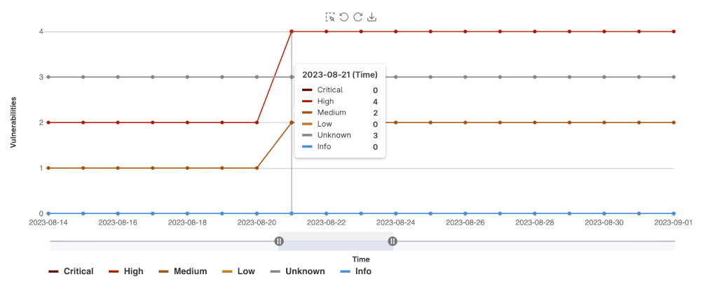
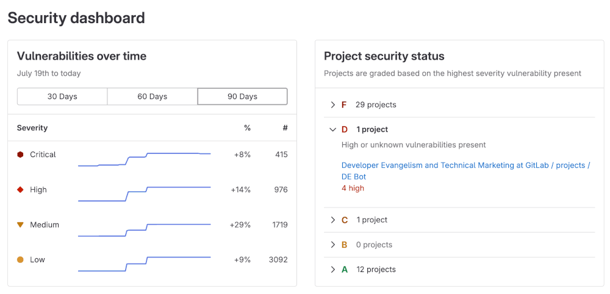



- Tier: Ultimate
- Offering: GitLab.com, GitLab Self-Managed, GitLab Dedicated





- New dashboard with advanced search [introduced](https://gitlab.com/gitlab-org/gitlab/-/issues/570504) in GitLab 18.6 [with flags](../../../administration/feature_flags/_index.md) named `project_security_dashboard_new` and `group_security_dashboard_new`. The flags are disabled by default.
- New dashboard with advanced search [enabled on GitLab.com, GitLab Self-Managed, and GitLab Dedicated](https://gitlab.com/gitlab-org/gitlab/-/merge_requests/215574) in GitLab 18.7.
- New dashboard with advanced search [generally available](https://gitlab.com/gitlab-org/gitlab/-/merge_requests/107661) in GitLab 18.8. Feature flags `project_security_dashboard_new` and `group_security_dashboard_new` removed.



GitLab 18.6 introduced an improved version of the security dashboards that use [advanced vulnerability management](../vulnerability_report/_index.md#advanced-vulnerability-management).

The new dashboards are enabled by default on GitLab.com and GitLab Dedicated. GitLab Self-Managed users must enable advanced vulnerability management to access the new dashboards.

If your organization has not enabled advanced vulnerability management, see [legacy security dashboards](#legacy-security-dashboards).

## Security dashboards



- New dashboard that uses [advanced vulnerability management](../vulnerability_report/_index.md#advanced-vulnerability-management) [introduced](https://gitlab.com/gitlab-org/gitlab/-/issues/570504) in GitLab 18.6 [with flags](../../../administration/feature_flags/_index.md) named `project_security_dashboard_new` and `group_security_dashboard_new`. The flags are disabled by default.
- New dashboard [enabled on GitLab Self-Managed and GitLab Dedicated](https://gitlab.com/gitlab-org/gitlab/-/merge_requests/215574) in GitLab 18.7.
- New dashboard [generally available](https://gitlab.com/gitlab-org/gitlab/-/merge_requests/107661) in GitLab 18.8. Feature flags `project_security_dashboard_new` and `group_security_dashboard_new` removed.



Use security dashboards to assess the security posture of your applications. GitLab provides
you with a collection of metrics, ratings, and charts for the vulnerabilities detected by the [security scanners](../detect/_index.md) run on your project. The security dashboards provide the following data:

- Vulnerability trends over a 30, 60, or 90-day time frame for all projects in a group.
- The total number of open vulnerabilities by severity.
- The total risk score to compare vulnerability risk across projects.

### Prerequisites

To view the security dashboard for a project or a group you must have:

- The Developer role or higher for the group or project.
- At least one [security scanner](../detect/_index.md) configured in your project.
- A successful security scan performed on the [default branch](../../project/repository/branches/default.md) of your project.
- At least one detected vulnerability in the project.
- [Advanced vulnerability management](../vulnerability_report/_index.md#advanced-vulnerability-management) with [Advanced search](../../search/advanced_search.md) enabled.

> [!note]
> The security dashboards show results of scans from the most recently completed pipeline on the
> [default branch](../../project/repository/branches/default.md). Dashboards are updated with the results of completed pipelines run on the default branch. They do not include vulnerabilities discovered in pipelines from other un-merged branches.

### Viewing the security dashboard

The security dashboard shows filterable charts and panels built with data from vulnerabilities detected in the default branch. Charts and panels include only open (needs triage or confirmed status) vulnerabilities and exclude those that are no longer detected.

You can view a security dashboard for a project or a group. Each dashboard provides a unique viewpoint into your security posture.

Both dashboards include:

- [Charts](#charts)
  - [Vulnerabilities over time](#vulnerabilities-over-time)
  - [Vulnerability severity panels](#vulnerability-severity-panel)
  - [Risk score](#risk-score-panel)
  - [Vulnerabilities by age](#vulnerabilities-by-age)
  - [Top 10 CWEs](#top-10-cwes)
- [Filter the entire dashboard](#filter-the-entire-dashboard)
- [Export as PDF](#export-as-pdf)

To view a security dashboard:

1. In the top bar, select **Search or go to** and find your project.
1. In the left sidebar, select **Secure** > **Security dashboard**.

### Project security dashboard

The project security dashboard shows vulnerabilities detected in the project's default branch. It includes:

- The [**Vulnerabilities over time**](#vulnerabilities-over-time) chart, which includes up to 90 days of history.
- The [**Severity panels**](#vulnerability-severity-panel), which show open vulnerabilities by severity.
- The [**Risk score**](#risk-score-panel) panel, which shows the overall security risk of the project.
- The [**Vulnerabilities by age**](#vulnerabilities-by-age) chart, which groups open vulnerabilities by age buckets.
- The [**Top 10 CWEs**](#top-10-cwes) chart, which shows the 10 most common CWEs.

Open vulnerabilities are those with Needs triage or Confirmed status. Closed vulnerabilities with Dismissed or Resolved status are not included in these charts.

### Group security dashboard

The group security dashboard provides an overview of vulnerabilities found in the default
branches of all projects in a group and its subgroups. The group security dashboard
supplies the following:

- The [**Vulnerabilities over time**](#vulnerabilities-over-time) chart, which includes up to 90 days of history.
- The [**Severity panels**](#vulnerability-severity-panel), which show open vulnerabilities by severity.
- The [**Risk score**](#risk-score-panel) panel, which shows total risk and risk for each project.
- The [**Vulnerabilities by age**](#vulnerabilities-by-age) chart, which groups open vulnerabilities by age buckets.
- The [**Top 10 CWEs**](#top-10-cwes) chart, which shows the 10 most common CWEs.

### Charts

Security dashboards include several charts that help you understand and act on vulnerabilities in your projects and groups.

#### Vulnerabilities over time

The **Vulnerabilities over time** chart is available on both project and group dashboards. It shows the open vulnerabilities trends over 30, 60, or 90-day periods. The default range is 30 days. GitLab retains vulnerability data for 365 days.

Use the chart to identify when vulnerabilities were introduced and how they change over time.

To view details:

1. Hover over a data point to see the vulnerability count for that day.
1. Use the **time frame selector** to switch between 30, 60, or 90 days.
1. Drag the range handles () to zoom in on a specific period.
1. Use the dropdown to filter by **Severity** (for example, **Critical**, **High**, **Medium**)
1. Use the buttons to group the data by either of the following options:
   - **Severity**: Critical, high, medium, low, info, and unknown.
   - **Report type**: SAST, DAST, and dependency scanning and others.
1. To explore data beyond 90 days, but within the last 365 days, use the [`SecurityMetrics.vulnerabilitiesOverTime` GraphQL API](../../../api/graphql/reference/_index.md#securitymetricsvulnerabilitiesovertime)

#### Vulnerability severity panel

The vulnerability severity panel shows the total number of open vulnerabilities by [severity](../vulnerabilities/severities.md).

To view details:

1. In the severity panel, locate the severity you want to investigate.
1. Select **View**.
   - The vulnerability report opens and includes only vulnerabilities of that severity.
   - Any page-level filters you have set are also applied.

#### Risk score panel



- Risk score panel for group dashboards:
  - [Introduced](https://gitlab.com/gitlab-org/gitlab/-/issues/570504) in GitLab 18.6 [with a feature flag](../../../administration/feature_flags/_index.md) named `security_dashboard_risk_score`. Disabled by default.
  - [Enabled on GitLab.com, GitLab Self-Managed, and GitLab Dedicated](https://gitlab.com/gitlab-org/gitlab/-/merge_requests/215574) in GitLab 18.7.
  - [Generally available](https://gitlab.com/gitlab-org/gitlab/-/merge_requests/107661) in GitLab 18.8. Feature flag `security_dashboard_risk_score` removed.
- Risk score chart for project dashboards:
  - [Generally available](https://gitlab.com/gitlab-org/gitlab/-/work_items/591112) in GitLab 18.11.



The risk score panel shows the overall security risk for the group or project. The panel has two views:

1. The **No grouping** (default) view shows the total risk score of the group:
   - The circular gauge shows the calculated risk score in the center.
   - The color bars indicate the risk level:
     - Green: Low risk
     - Yellow: Medium risk
     - Orange: High risk
     - Red: Critical risk
1. Select **Project** to compare risk scores for each project:
   - Each project tile is color-coded according to the project's risk level.
   - Hover over a tile to see details, including the project name and risk score.
   - Select a tile and select the project's name to open that project's vulnerability report.

Risk scores are calculated from multiple factors, including:

- Severity of vulnerabilities
- Age of vulnerabilities
- KEV (Known Exploited Vulnerabilities) status
- EPSS (Exploit Prediction Scoring System) score

#### Vulnerabilities by age



- Vulnerabilities by age chart for project dashboards:
  - [Generally available](https://gitlab.com/gitlab-org/gitlab/-/work_items/590979) in GitLab 18.11.



The **Vulnerabilities by age** chart is available on group and project dashboards. It shows the distribution of unresolved vulnerabilities based on the amount of time since they were first detected. You can group vulnerabilities by severity or by report type, helping you identify where remediation activities may be needed.

To view details:

1. Hover over a data point to see the vulnerability count for that age grouping.
1. Use the dropdown list to filter by **Severity** (for example, **Critical**, **High**, **Medium**)
1. Use the buttons to group the data by either of the following options:
   - **Severity**: Critical, high, medium, low, info, and unknown.
   - **Report type**: SAST, DAST, and dependency scanning and others.

#### Top 10 CWEs



- [Introduced](https://gitlab.com/groups/gitlab-org/-/work_items/17422) in GitLab 18.11 [with a feature flag](../../../administration/feature_flags/_index.md) named `new_security_dashboard_vulnerabilities_by_identifier`. Enabled by default.
- [Generally available](https://gitlab.com/gitlab-org/gitlab/-/issues/592130) in GitLab 19.0. Feature flag `new_security_dashboard_vulnerabilities_by_identifier` removed.



The **Top 10 CWEs** chart is available on group and project dashboards. It shows the 10 most common CWE identifiers associated with the open vulnerabilities in the group or project.

To view details:

1. Hover over a data point to see the total number of vulnerabilities of each CWE type.
1. Use the dropdown list to filter by **Severity** (for example, **Critical**, **Medium**, or **High**).

### Filter the entire dashboard

You can filter results at two levels:

- **Dashboard filters**: Apply to the entire dashboard. All charts update when you use these filters.
- **Chart and panel filters**: Apply only to the chart or panel you are viewing.

Available dashboard filters include:

- **Report type**: Filter by scanner, including SAST, DAST, dependency scanning, and others.
- **Project**: Limit results to specific projects. Available only for group security dashboards.

On the group security dashboard, you can also filter by:

- **Security attributes**: Filter by the security attributes applied to your projects, which include categories for business impact, application, business unit, internet exposure, and location. These filters can be inclusive (using the **is one of** operator) or exclusive (using the **is not one of** operator). To configure your security attributes and apply them to projects, see [security attributes](../attributes/_index.md).

Dashboard filter behavior:

- Filters apply immediately across all dashboard charts and panels.
- Filters that you apply continue to apply throughout your session unless you remove them.
- When you open a vulnerability report from the dashboard, active filters are automatically applied to the vulnerability report.

To apply a filter to the whole dashboard:

1. In the filter bar at the top of the dashboard, select **Filter results...**.
1. From the dropdown list, choose the filter type.
1. Select one or more filter values.

### Export as PDF



- [Introduced](https://gitlab.com/gitlab-org/gitlab/-/merge_requests/224664) in GitLab 18.10 [with a feature flag](../../../administration/feature_flags/_index.md) named `new_security_dashboard_pdf_export`. Disabled by default.
- [Enabled on GitLab.com, GitLab Self-Managed, and GitLab Dedicated](https://gitlab.com/gitlab-org/gitlab/-/issues/589201) in GitLab 18.11.
- [Generally available](https://gitlab.com/gitlab-org/gitlab/-/issues/589201) in GitLab 19.0. Feature flag `new_security_dashboard_pdf_export` removed.



You can export the security dashboard as a PDF for use in reports and presentations. The export captures the current state of all of the charts and panels in the dashboard, including any active filters.

To export the dashboard as a PDF:

1. In the top bar, select **Search or go to** and find your project or group.
1. In the left sidebar, select **Secure** > **Security dashboard**.
1. Optional. Apply filters to customize the data included in the export.
1. Select **Export as PDF**.

## Legacy security dashboards



- Offering: GitLab Self-Managed



GitLab Self-Managed customers that have not enabled advanced vulnerability management cannot access the latest security dashboards. In this case, you still have access to the legacy security dashboards.

Security dashboards are used to assess the security posture of your applications. GitLab provides
you with a collection of metrics, ratings, and charts for the vulnerabilities detected by the [security scanners](../detect/_index.md) run on your project. The security dashboard provides data such as:

- Vulnerability trends over a 30, 60, or 90-day time-frame for all projects in a group
- A letter grade rating for each project based on vulnerability severity
- The total number of vulnerabilities detected within the last 365 days including their severity

Use security dashboard data to improve your security posture. For example, the 365-day trend view
shows which days had a spike in vulnerabilities. Examine the code changes from those days to perform
a root-cause analysis and build better policies to prevent future vulnerabilities.

<i class="fa-youtube-play" aria-hidden="true"></i>
For an overview, see [Security Dashboard - Advanced Security Testing](https://www.youtube.com/watch?v=Uo-pDns1OpQ).

## Prerequisites for the legacy dashboards

To view the security dashboards, the following is required:

- You must have the Developer role for the group or project.
- At least one [security scanner](../detect/_index.md) configured in your project.
- A successful security scan performed on the [default branch](../../project/repository/branches/default.md) of your project.
- At least 1 detected vulnerability in the project.

> [!note]
> The security dashboards show results of scans from the most recent completed pipeline on the
> [default branch](../../project/repository/branches/default.md). Dashboards are updated with the result of completed pipelines run on the default branch; they do not include vulnerabilities discovered in pipelines from other un-merged branches.

## Viewing the legacy security dashboard

The security dashboard can be seen at the project, group, and the Security Center levels.
Each dashboard provides a unique viewpoint of your security posture.

### Project security dashboard

The Project security dashboard shows the total number of vulnerabilities detected over time,
with up to 365 days of historical data for a given project. The dashboard is a historical view of open vulnerabilities in the default branch. Open vulnerabilities are those of only `Needs triage` or `Confirmed` status (`Dismissed` or `Resolved` vulnerabilities are excluded).

To view a project's security dashboard:

1. In the top bar, select **Search or go to** and find your project.
1. In the left sidebar, select **Secure** > **Security dashboard**.
1. Filter and search for what you need.
   - To filter the chart by severity, select the legend name.
   - To view a specific time frame, use the time range handles ().
   - To view a specific area of the chart, select the left-most icon () and drag
     across the chart.
   - To reset to the original range, select **Remove Selection** ().

#### Downloading the vulnerability chart

You can download an image of the vulnerability chart from the Project security dashboard
to use in documentation, presentations, and so on. To download the image of the vulnerability
chart:

1. In the top bar, select **Search or go to** and find your project.
1. In the left sidebar, select **Secure** > **Security dashboard**.
1. Select **Save chart as an image** ().

You are prompted to download the image in SVG format.

### Group security dashboard

The group security dashboard provides an overview of vulnerabilities found in the default
branches of all projects in a group and its subgroups. The group security dashboard
supplies the following:

- Vulnerability trends over a 30, 60, or 90-day time frame
- A letter grade for each project in the group according to its highest-severity open vulnerability. The letter grades are assigned using the following criteria:

| Grade | Description                                     |
| ----- | ----------------------------------------------- |
| **F** | One or more `critical` vulnerabilities          |
| **D** | One or more `high` or `unknown` vulnerabilities |
| **C** | One or more `medium` vulnerabilities            |
| **B** | One or more `low` vulnerabilities               |
| **A** | Zero vulnerabilities                            |

To view group security dashboard:

1. In the top bar, select **Search or go to** and find your group.
1. In the left sidebar, select **Security** > **Security dashboard**.
1. Hover over the **Vulnerabilities over time** chart to get more details about vulnerabilities.
   - You can display the vulnerability trends over a 30, 60, or 90-day time frame (the default is 90 days).
   - To view aggregated data beyond a 90-day time frame, use the [`VulnerabilitiesCountByDay` GraphQL API](../../../api/graphql/reference/_index.md#vulnerabilitiescountbyday). GitLab retains the data for 365 days.

1. Select the arrows under the **Project security status** section to see which projects fall under a particular letter-grade rating:
   - You can see how many vulnerabilities of a particular severity are found in a project
   - You can select a project's name to directly access its project security dashboard

## Vulnerability metrics in the value streams dashboard



- [Introduced](https://gitlab.com/gitlab-org/gitlab/-/issues/383697) in GitLab 16.0.



There are additional vulnerability metrics available in the [value streams dashboard](../../analytics/value_streams_dashboard.md) comparison panel, which helps you understand security exposure in the context of your organization's software delivery workflows.

## Related topics

- [Security center](../security_center/_index.md)
- [Vulnerability reports](../vulnerability_report/_index.md)
- [Vulnerability Page](../vulnerabilities/_index.md)
- [Auto-resolve vulnerabilities](../../application_security/policies/vulnerability_management_policy.md)
