

- Tier: Premium, Ultimate
- Offering: GitLab.com



These are notes and screenshots regarding Group SAML and SCIM that the GitLab Support Team sometimes uses while troubleshooting, but which do not fit into the official documentation. GitLab is making this public, so that anyone can make use of the Support team's collected knowledge.

Refer to the GitLab [Group SAML](_index.md) documentation for information on the feature and how to set it up.

When troubleshooting a SAML configuration, GitLab team members will frequently start with the [SAML troubleshooting section](_index.md#troubleshooting).

They may then set up a test configuration of the desired identity provider. We include example screenshots in this section.

## SAML and SCIM screenshots

This section includes relevant screenshots of the following example configurations of [Group SAML](_index.md) and [Group SCIM](scim_setup.md):

- [Azure Active Directory](#azure-active-directory)
- [AWS IAM Identity Center](#aws-iam-identity-center)
- [Google Workspace](#google-workspace)
- [Okta](#okta)
- [OneLogin](#onelogin)

> [!warning]
> These screenshots are updated only as needed by GitLab Support. They are not official documentation.

If you are currently having an issue with GitLab, you may want to check your [support options](https://about.gitlab.com/support/).

## Azure Active Directory

This section has screenshots for the elements of Azure Active Directory configuration.

### Basic SAML app configuration

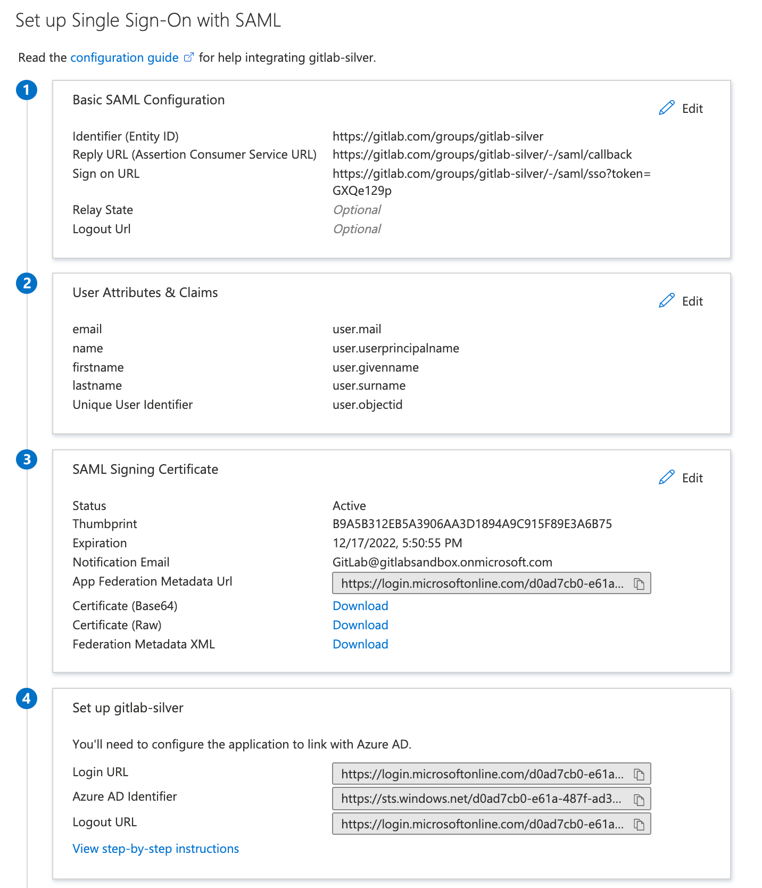

### User claims and attributes

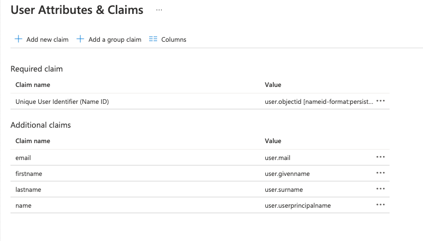

### SCIM mapping

Provisioning:

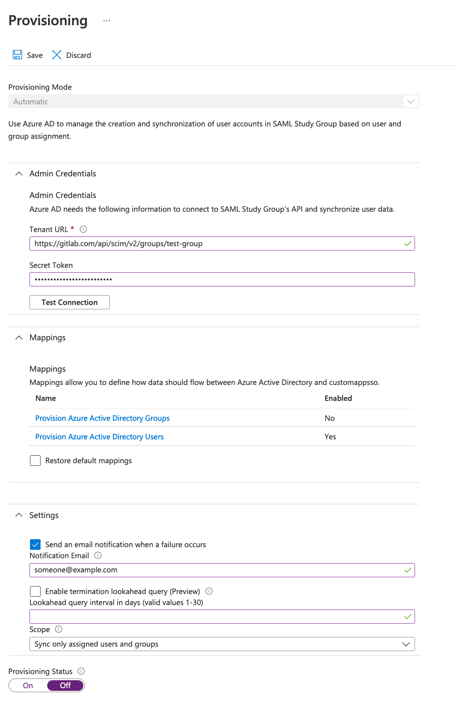

### Attribute mapping

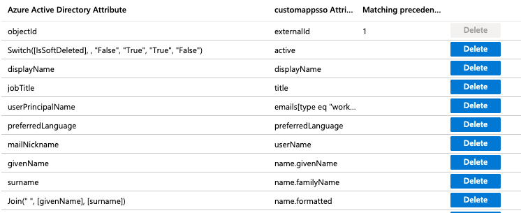

### Group Sync

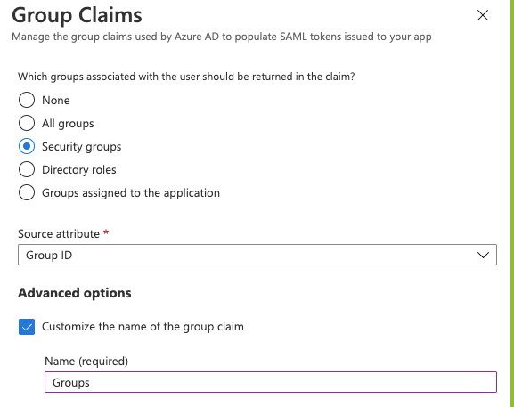

Using the **Group ID** source attribute requires users to enter the group ID or object ID when configuring SAML group links.

If available, you can add user-friendly group names instead. When setting up Azure group claims:

1. Select the **sAMAccountName** source attribute.
1. Enter a group name. You can specify a name up to 256 characters long.
1. To ensure the attribute is part of the assertion, select **Emit group names for cloud-only groups**.

[Azure AD limits the number of groups that can be sent in a SAML response to 150](https://support.esri.com/en-us/knowledge-base/when-azure-ad-is-the-saml-identify-provider-the-group-a-000022190). If a user is a member of more than 150 groups, Azure does not include that user's group claim in the SAML response.

## Google Workspace

### Basic SAML app configuration


### User claims and attributes


### IdP links and certificate


## Okta

### Basic SAML app configuration for GitLab.com groups

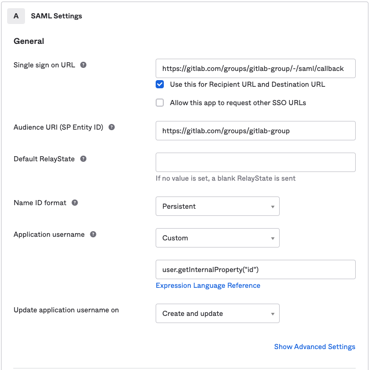

### Basic SAML app configuration for GitLab Self-Managed

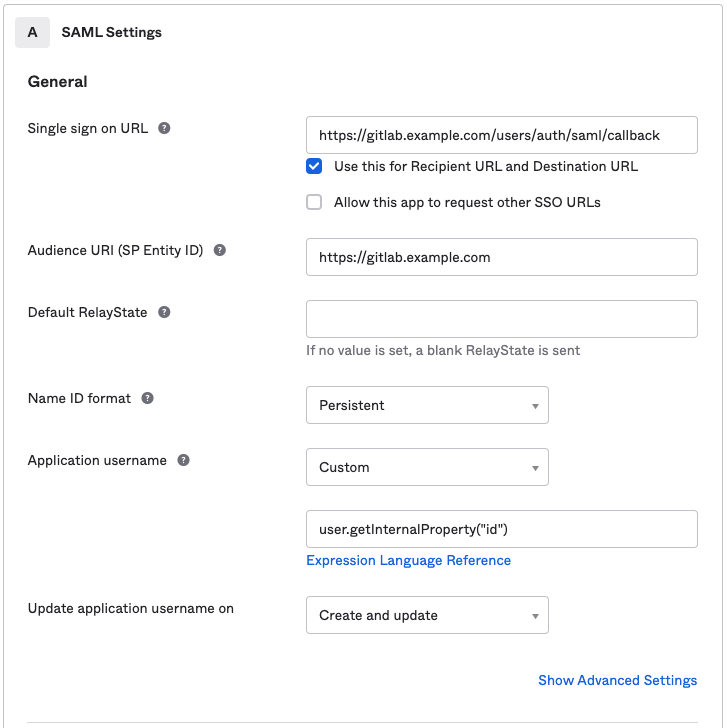

### User claims and attributes

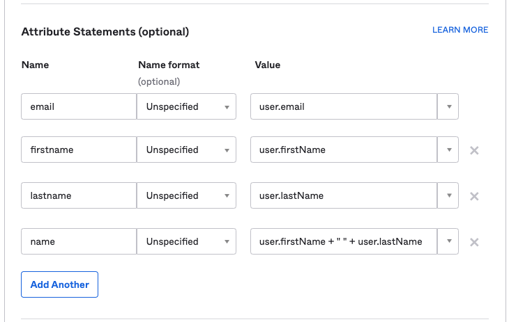

### Group Sync

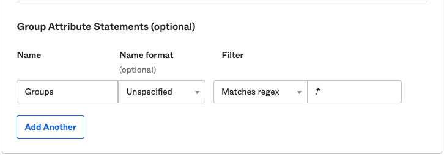

### Advanced SAML app settings (defaults)

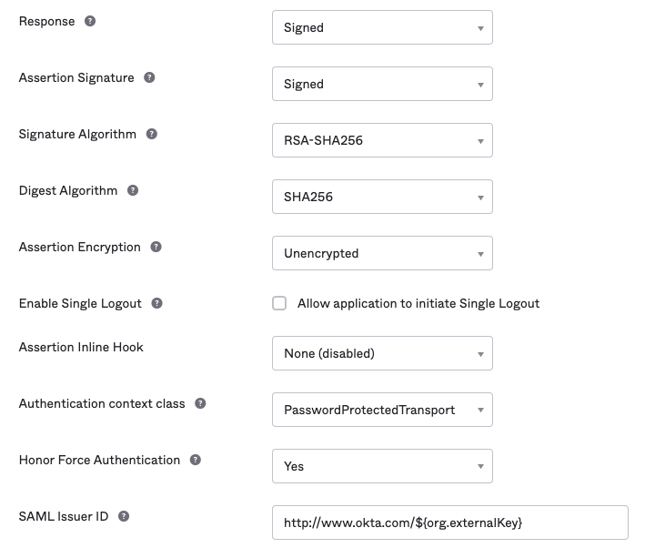

### IdP links and certificate

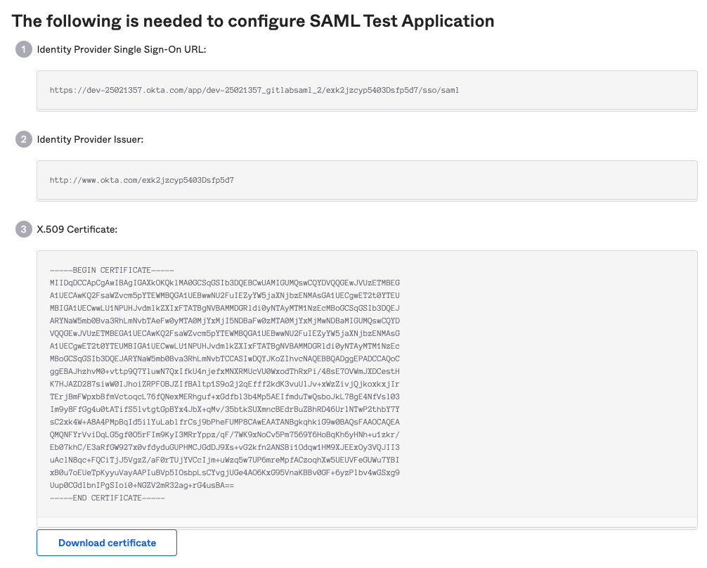

### SAML sign on settings

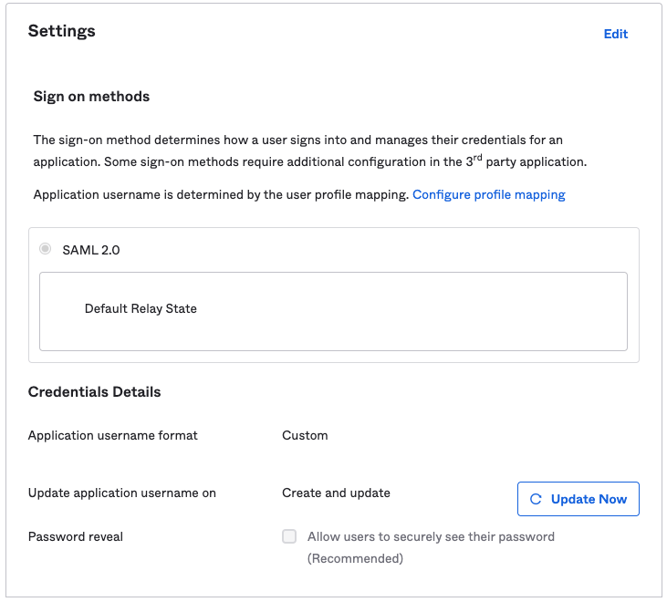

### SCIM settings

Setting the username for the newly provisioned users when assigning them the SCIM app:

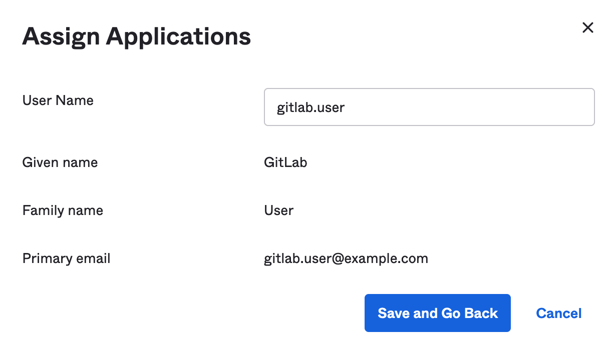

## OneLogin

### Basic SAML app configuration


### Parameters


### Adding a user


### SSO settings


## AWS IAM Identity Center

Configure AWS IAM Identity Center with the values in the following tables.
For the full setup instructions, see [AWS IAM Identity Center](_index.md#aws-iam-identity-center).

### Application properties

When setting up your own SAML 2.0 application in AWS IAM Identity Center,
configure the following application properties:

| AWS Identity Center field       | Value                                                                                         |
| ------------------------------- | --------------------------------------------------------------------------------------------- |
| **Application ACS URL**         | Your group's **Assertion consumer service URL** (from GitLab **SAML SSO** settings)           |
| **Application SAML audience**   | Your group's **Identifier** (from GitLab **SAML SSO** settings)                               |
| **Application start URL**       | Your group's **GitLab single sign-on URL** (from GitLab **SAML SSO** settings)                |

Set the **Application start URL** for SP-initiated login.
Without it, existing users cannot link their accounts.

### Attribute mappings

| Attribute      | Value                | Format        |
| -------------- | -------------------- | ------------- |
| **Subject**    | `${user:email}`      | `unspecified` |
| **email**      | `${user:email}`      | `unspecified` |
| **first_name** | `${user:givenName}`  | `unspecified` |
| **last_name**  | `${user:familyName}` | `unspecified` |

> [!warning]
> You must set the **Subject** (NameID) format to `unspecified`. If you set the format to
> `persistent` or `transient`, existing GitLab users receive a `403` error when they attempt
> to link their accounts through SAML. This error only occurs during account linking and does
> not affect new users provisioned through AWS IAM Identity Center.

### GitLab SAML SSO settings

| GitLab field                             | Value                                                                           |
| ---------------------------------------- | ------------------------------------------------------------------------------- |
| **Identity provider single sign-on URL** | **IAM Identity Center sign-in URL** (from the application's **IAM Identity Center SAML metadata** section)|
| **Certificate fingerprint**              | SHA1 fingerprint of the certificate downloaded from AWS Identity Center         |

## SAML response example

When a user signs in using SAML, GitLab receives a SAML response. The SAML response can be found in `production.log` logs as a base64-encoded message. Locate the response by
searching for `SAMLResponse`. The decoded SAML response is in XML format. For example:

```xml
<?xml version="1.0" encoding="UTF-8"?>
<saml2p:Response xmlns:saml2p="urn:oasis:names:tc:SAML:2.0:protocol" xmlns:xs="http://www.w3.org/2001/XMLSchema" Destination="https://gitlabexample/-/saml/callback" ID="id4898983630840142426821432" InResponseTo="_c65e4c88-9425-4472-b42c-37f4186ac0ee" IssueInstant="2022-05-30T21:30:35.696Z" Version="2.0">
 <saml2:Issuer xmlns:saml2="urn:oasis:names:tc:SAML:2.0:assertion" Format="urn:oasis:names:tc:SAML:2.0:nameid-format:entity">http://www.okta.com/exk2y6j57o1Pdr2lI8qh7</saml2:Issuer>
 <ds:Signature xmlns:ds="http://www.w3.org/2000/09/xmldsig#">
   <ds:SignedInfo>
     <ds:CanonicalizationMethod Algorithm="http://www.w3.org/2001/10/xml-exc-c14n#"/>
     <ds:SignatureMethod Algorithm="http://www.w3.org/2001/04/xmldsig-more#rsa-sha256"/>
     <ds:Reference URI="#id4898983630840142426821432">
       <ds:Transforms>
         <ds:Transform Algorithm="http://www.w3.org/2000/09/xmldsig#enveloped-signature"/>
         <ds:Transform Algorithm="http://www.w3.org/2001/10/xml-exc-c14n#">
           <ec:InclusiveNamespaces xmlns:ec="http://www.w3.org/2001/10/xml-exc-c14n#" PrefixList="xs"/>
         </ds:Transform>
       </ds:Transforms>
       <ds:DigestMethod Algorithm="http://www.w3.org/2001/04/xmlenc#sha256"/>
       <ds:DigestValue>neiQvv9d3OgS4GZW8Nptp4JhjpKs3GCefibn+vmRgk4=</ds:DigestValue>
     </ds:Reference>
   </ds:SignedInfo>
   <ds:SignatureValue>dMsQX8ivi...HMuKGhyLRvabGU6CuPrf7==</ds:SignatureValue>
   <ds:KeyInfo>
     <ds:X509Data>
       <ds:X509Certificate>MIIDq...cptGr3vN9TQ==</ds:X509Certificate>
     </ds:X509Data>
   </ds:KeyInfo>
 </ds:Signature>
 <saml2p:Status xmlns:saml2p="urn:oasis:names:tc:SAML:2.0:protocol">
   <saml2p:StatusCode Value="urn:oasis:names:tc:SAML:2.0:status:Success"/>
 </saml2p:Status>
 <saml2:Assertion xmlns:saml2="urn:oasis:names:tc:SAML:2.0:assertion" xmlns:xs="http://www.w3.org/2001/XMLSchema" ID="id489" IssueInstant="2022-05-30T21:30:35.696Z" Version="2.0">
   <saml2:Issuer xmlns:saml2="urn:oasis:names:tc:SAML:2.0:assertion" Format="urn:oasis:names:tc:SAML:2.0:nameid-format:entity">http://www.okta.com/exk2y6j57o1Pdr2lI8qh7</saml2:Issuer>
   <ds:Signature xmlns:ds="http://www.w3.org/2000/09/xmldsig#">
     <ds:SignedInfo>
       <ds:CanonicalizationMethod Algorithm="http://www.w3.org/2001/10/xml-exc-c14n#"/>
       <ds:SignatureMethod Algorithm="http://www.w3.org/2001/04/xmldsig-more#rsa-sha256"/>
       <ds:Reference URI="#id48989836309833801859473359">
         <ds:Transforms>
           <ds:Transform Algorithm="http://www.w3.org/2000/09/xmldsig#enveloped-signature"/>
           <ds:Transform Algorithm="http://www.w3.org/2001/10/xml-exc-c14n#">
             <ec:InclusiveNamespaces xmlns:ec="http://www.w3.org/2001/10/xml-exc-c14n#" PrefixList="xs"/>
           </ds:Transform>
         </ds:Transforms>
         <ds:DigestMethod Algorithm="http://www.w3.org/2001/04/xmlenc#sha256"/>
         <ds:DigestValue>MaIsoi8hbT9gsi/mNZsz449mUuAcuEWY0q3bc4asOQs=</ds:DigestValue>
       </ds:Reference>
     </ds:SignedInfo>
     <ds:SignatureValue>dMsQX8ivi...HMuKGhyLRvabGU6CuPrf7==</ds:SignatureValue>
     <ds:KeyInfo>
       <ds:X509Data>
         <ds:X509Certificate>MIIDq...cptGr3vN9TQ==</ds:X509Certificate>
       </ds:X509Data>
     </ds:KeyInfo>
   </ds:Signature>
   <saml2:Subject xmlns:saml2="urn:oasis:names:tc:SAML:2.0:assertion">
     <saml2:NameID Format="urn:oasis:names:tc:SAML:2.0:nameid-format:persistent">useremail@domain.com</saml2:NameID>
     <saml2:SubjectConfirmation Method="urn:oasis:names:tc:SAML:2.0:cm:bearer">
       <saml2:SubjectConfirmationData InResponseTo="_c65e4c88-9425-4472-b42c-37f4186ac0ee" NotOnOrAfter="2022-05-30T21:35:35.696Z" Recipient="https://gitlab.example.com/-/saml/callback"/>
     </saml2:SubjectConfirmation>
   </saml2:Subject>
   <saml2:Conditions xmlns:saml2="urn:oasis:names:tc:SAML:2.0:assertion" NotBefore="2022-05-30T21:25:35.696Z" NotOnOrAfter="2022-05-30T21:35:35.696Z">
     <saml2:AudienceRestriction>
       <saml2:Audience>https://gitlab.example.com/</saml2:Audience>
     </saml2:AudienceRestriction>
   </saml2:Conditions>
   <saml2:AuthnStatement xmlns:saml2="urn:oasis:names:tc:SAML:2.0:assertion" AuthnInstant="2022-05-30T21:30:35.696Z" SessionIndex="_c65e4c88-9425-4472-b42c-37f4186ac0ee">
     <saml2:AuthnContext>
       <saml2:AuthnContextClassRef>urn:oasis:names:tc:SAML:2.0:ac:classes:PasswordProtectedTransport</saml2:AuthnContextClassRef>
     </saml2:AuthnContext>
   </saml2:AuthnStatement>
   <saml2:AttributeStatement xmlns:saml2="urn:oasis:names:tc:SAML:2.0:assertion">
     <saml2:Attribute Name="email" NameFormat="urn:oasis:names:tc:SAML:2.0:attrname-format:unspecified">
       <saml2:AttributeValue xmlns:xs="http://www.w3.org/2001/XMLSchema" xmlns:xsi="http://www.w3.org/2001/XMLSchema-instance" xsi:type="xs:string">useremail@domain.com</saml2:AttributeValue>
     </saml2:Attribute>
     <saml2:Attribute Name="firstname" NameFormat="urn:oasis:names:tc:SAML:2.0:attrname-format:unspecified">
       <saml2:AttributeValue xmlns:xs="http://www.w3.org/2001/XMLSchema" xmlns:xsi="http://www.w3.org/2001/XMLSchema-instance" xsi:type="xs:string">John</saml2:AttributeValue>
     </saml2:Attribute>
     <saml2:Attribute Name="lastname" NameFormat="urn:oasis:names:tc:SAML:2.0:attrname-format:unspecified">
       <saml2:AttributeValue xmlns:xs="http://www.w3.org/2001/XMLSchema" xmlns:xsi="http://www.w3.org/2001/XMLSchema-instance" xsi:type="xs:string">Doe</saml2:AttributeValue>
     </saml2:Attribute>
     <saml2:Attribute Name="Groups" NameFormat="urn:oasis:names:tc:SAML:2.0:attrname-format:unspecified">
       <saml2:AttributeValue xmlns:xs="http://www.w3.org/2001/XMLSchema" xmlns:xsi="http://www.w3.org/2001/XMLSchema-instance" xsi:type="xs:string">Super-awesome-group</saml2:AttributeValue>
     </saml2:Attribute>
   </saml2:AttributeStatement>
 </saml2:Assertion>
</saml2p:Response>
```
