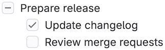
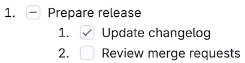
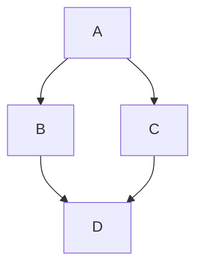
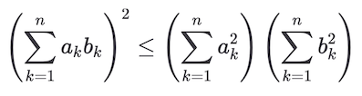
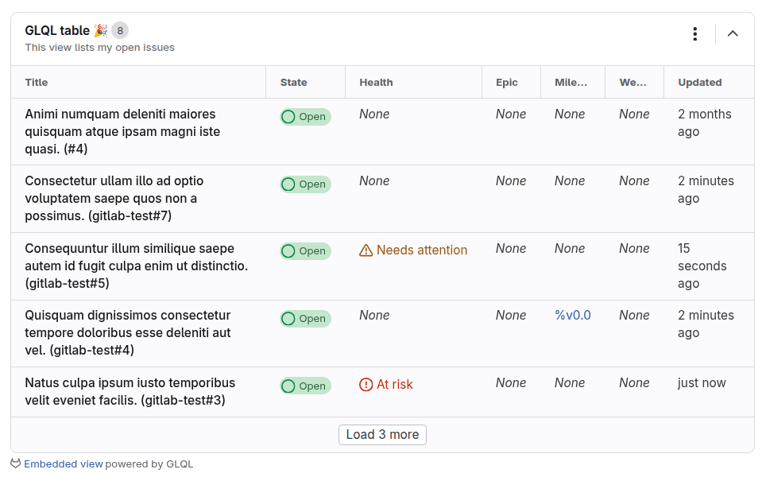



- Tier: Free, Premium, Ultimate
- Offering: GitLab.com, GitLab Self-Managed, GitLab Dedicated



GitLab uses the [`gitlab-markup`](https://gitlab.com/gitlab-org/gitlab-markup) gem,
which uses the [`org-ruby`](https://github.com/wallyqs/org-ruby) gem,
to convert Org mode content to HTML.
For a complete reference to Org mode syntax,
see the [Org manual](https://orgmode.org/manuals.html).

You can use Org mode in the following areas:

- Org mode documents (`.org`) inside repositories
- Snippets, when the snippet file is named with a `.org` extension
- Wiki pages

## Headings

Leading asterisks (`*`) render as headings 1 to 6.

```org
* Heading 1
** Heading 2
*** Heading 3
**** Heading 4
***** Heading 5
****** Heading 6
```

`#+TITLE:` renders as the H1 heading at the top of the page:

```org
#+TITLE: Welcome to Org-mode
```

### Heading anchors

GitLab automatically adds an anchor to every Org mode heading, so you can link to it.

On hover, a link to those anchors becomes visible to make it easier to copy the link to
the heading to use it somewhere else.

The anchors are generated from the content of the heading according to the following rules:

1. All text is converted to lowercase.
1. All characters except letters, numbers, hyphens, and underscores are removed.
1. All spaces are converted to hyphens.
1. If a heading with the same anchor has already been generated,
   a unique incrementing number is appended, starting at 1.

Example:

<!--
Translation note: DO NOT TRANSLATE this example.
The example must stay untranslated to stay in sync with the example anchors.
-->

```org
* This heading has spaces in it
** This heading has an accent in it: Café
** This heading has Unicode in it: 日本語
** This heading has spaces in it
*** This heading has spaces in it
** This heading has 3.5 in it (& parentheses)
** This heading has  multiple spaces and - hyphens_and_underscores
```

Would generate the following heading anchors:

1. `#this-heading-has-spaces-in-it`
1. `#this-heading-has-an-accent-in-it-café`
1. `#this-heading-has-unicode-in-it-日本語`
1. `#this-heading-has-spaces-in-it-1`
1. `#this-heading-has-spaces-in-it-2`
1. `#this-heading-has-35-in-it--parentheses`
1. `#this-heading-has--multiple-spaces-and---hyphens_and_underscores`

In a snippet, headings also get a prefix derived from the filename,
to prevent anchor collisions across multiple files.
For example, a `* TL;DR` heading in a file named `README.org`
gets the anchor `#readme-tldr` instead of `#tldr`.

## Lists

Org mode supports unordered lists, ordered lists, description lists, and nested lists.

### Unordered lists

A hyphen (`-`) or a plus sign (`+`) creates an unordered list:

```org
- Item one
- Item two
  - Nested item
```

```org
+ Item one
+ Item two
  + Nested item
```

When rendered, both examples look similar to:

> - Item one
> - Item two
>   - Nested item

### Ordered lists

A number followed by a period (`.`) or a closing parenthesis (`)`) creates an ordered list:

```org
1. First item
2. Second item
   1. Nested item
```

```org
1) First item
2) Second item
   1) Nested item
```

When rendered, both examples look similar to:

> 1. First item
> 1. Second item
>    1. Nested item

### Description lists

```org
- term1 :: Definition of term one
- term2 :: Definition of term two
```

When rendered, the example looks similar to:

> term1
> : Definition of term one
>
> term2
> : Definition of term two

## Checkboxes

`[ ]`, `[X]`, and `[-]` after a list marker render as checkbox input elements.
`[-]` renders as an intermediate (indeterminate) checkbox:

<!--
Translation note: DO NOT TRANSLATE this example.
The example must stay untranslated to stay in sync with the image.
-->

```org
- [-] Prepare release
  - [X] Update changelog
  - [ ] Review merge requests
```

When rendered, the example looks like:



Checkboxes also work in ordered lists:

<!--
Translation note: DO NOT TRANSLATE this example.
The example must stay untranslated to stay in sync with the image.
-->

```org
1. [-] Prepare release
   1. [X] Update changelog
   2. [ ] Review merge requests
```

When rendered, the example looks like:



## Tables

Pipes (`|`) create a table.
A separator row made of dashes (`-`) and plus signs (`+`) turns the row
above it into the table header:

```org
| Item  | Unit price ($) | Quantity | Subtotal ($) |
|-------+----------------+----------+--------------|
| Eggs  |              3 |        2 |            6 |
| Milk  |              2 |        1 |            2 |
| Bread |              1 |        3 |            3 |
|-------+----------------+----------+--------------|
| Total |                |          |           11 |
#+TBLFM: $>=$2*$3::@>$>=vsum(@I..@II)
```

When rendered, the example looks similar to:

> | Item  | Unit price ($) | Quantity | Subtotal ($) |
> |-------|----------------|----------|--------------|
> | Eggs  | 3              | 2        | 6            |
> | Milk  | 2              | 1        | 2            |
> | Bread | 1              | 3        | 3            |
> | Total |                |          | 11           |

## Links

You can create links in multiple ways:

```org
- [[https://example.com][This line shows an inline-style link]]
- [[permissions.md][This line shows a link to a file in the same directory]]
- [[../_index.md][This line shows a relative link to a file one directory higher]]
- [[#headings][This line links to a heading on the same page, using a `#` and the heading anchor]]
```

When rendered, the example looks similar to:

> - [This line shows an inline-style link](https://example.com)
> - [This line shows a link to a file in the same directory](permissions.md)
> - [This line shows a relative link to a file one directory higher](../_index.md)
> - [This line links to a heading on the same page, using a `#` and the heading anchor](#headings)

### URL auto-linking

Almost any URL you put into your text is auto-linked:

```org
See https://example.com for details.
```

When rendered, the example looks similar to:

> See <https://example.com> for details.

## Emphasis

| Style                           | Output                                |
|---------------------------------|---------------------------------------|
| `*bold*`                        | **bold**                              |
| `/italic/`                      | *italic*                              |
| `+strikethrough+`               | ~~strikethrough~~                     |
| `=verbatim=`                    | `verbatim`                            |
| `~code~`                        | `code`                                |
| `This is a ^{superscript} text` | This is a <sup>superscript</sup> text |
| `This is a _{subscript} text`   | This is a <sub>subscript</sub> text   |

## Images

Linking to an image file without description text embeds the image inline:

```org
[[img/markdown_logo_v17_11.png]]
```

When rendered, the example looks similar to:


## Horizontal rules

Five or more consecutive hyphens (`-`) create a horizontal rule:

```org
Paragraph before.

-----

Paragraph after.
```

When rendered, the example looks similar to:

> Paragraph before.
>
> ---
>
> Paragraph after.

## Comments

Lines that start with `#` followed by a space aren't rendered:

```org
Visible before.

# This line is a comment and isn't rendered.

Visible after.
```

When rendered, the example looks similar to:

> Visible before.
>
> Visible after.

Content between `#+BEGIN_COMMENT` and `#+END_COMMENT` isn't rendered:

```org
Visible before the block.

#+BEGIN_COMMENT
This entire block is a comment.
None of these lines are rendered.
#+END_COMMENT

Visible after the block.
```

When rendered, the example looks similar to:

> Visible before the block.
>
> Visible after the block.

A heading marked with `COMMENT` right after the heading markers,
and everything nested under it, isn't rendered:

```org
* Visible heading

Some visible text.

* COMMENT Hidden heading

This text isn't rendered.

** Nested under hidden heading

This text isn't rendered either.

* Another visible heading
```

Only `Visible heading` and `Another visible heading`, and the text between them,
appear in the rendered output.

## Text blocks

`#+BEGIN_QUOTE` and `#+END_QUOTE` create a quoted block:

```org
#+BEGIN_QUOTE
Everything should be made as simple as possible,
but not any simpler ---Albert Einstein
#+END_QUOTE
```

When rendered, the example looks similar to:

> > Everything should be made as simple as possible,
> > but not any simpler —Albert Einstein

`#+BEGIN_EXAMPLE` and `#+END_EXAMPLE` create a preformatted text block:

```org
#+BEGIN_EXAMPLE
Here is an example.
#+END_EXAMPLE
```

When rendered, the example looks similar to:

> ```plaintext
> Here is an example.
> ```

A colon (`:`) and a space also creates a preformatted text block:

```org
: Here is an example.
```

When rendered, the example looks similar to:

> ```plaintext
> Here is an example.
> ```

## Source code blocks

`#+BEGIN_SRC` and `#+END_SRC` with a language name create a syntax-highlighted code block:

```org
#+BEGIN_SRC python
import requests
data = requests.get("https://jsonplaceholder.typicode.com/users/1").json()
#+END_SRC
```

When rendered, the example looks similar to:

> ```python
> import requests
> data = requests.get("https://jsonplaceholder.typicode.com/users/1").json()
> ```

GitLab uses the [Rouge Ruby library](https://github.com/rouge-ruby/rouge) for syntax highlighting.
For a list of supported languages, see the
[Rouge project wiki](https://github.com/rouge-ruby/rouge/wiki/List-of-supported-languages-and-lexers).

Adding `:exports both` to the block header includes the execution results (`#+RESULTS:`)
of a source block in the rendered output:

```org
#+BEGIN_SRC python :exports both :results output code
import requests
data = requests.get("https://jsonplaceholder.typicode.com/users/1").json()
print([data["username"], data["email"]])
#+END_SRC

#+RESULTS:
#+begin_src python
['Bret', 'Sincere@april.biz']
#+end_src
```

When rendered, the example looks similar to:

> ```python
> import requests
> data = requests.get("https://jsonplaceholder.typicode.com/users/1").json()
> print([data["username"], data["email"]])
> ```
>
> ```python
> ['Bret', 'Sincere@april.biz']
> ```

## Diagrams and flowcharts

You can generate diagrams from text in a source code block, the same way as in
[GitLab Flavored Markdown](markdown.md#diagrams-and-flowcharts).

### Mermaid

```org
#+BEGIN_SRC mermaid
graph TD;
    A-->B;
    A-->C;
    B-->D;
    C-->D;
#+END_SRC
```

When rendered, the example looks similar to:



### PlantUML

PlantUML integration is enabled on GitLab.com.
To make PlantUML available on GitLab Self-Managed,
a GitLab administrator [must enable it](../administration/integration/plantuml.md).

```org
#+BEGIN_SRC plantuml
Bob -> Alice : hello
Alice -> Bob : hi
#+END_SRC
```

## Math equations

Math written in a source code block with the language declared as `math` is rendered with
[KaTeX](https://github.com/KaTeX/KaTeX).
KaTeX only supports a [subset](https://katex.org/docs/supported.html) of LaTeX.

```org
#+BEGIN_SRC math
\left( \sum_{k=1}^n a_k b_k \right)^2 \leq \left( \sum_{k=1}^n a_k^2 \right) \left( \sum_{k=1}^n b_k^2 \right)
#+END_SRC
```

When rendered, the example looks like:



## GitLab Query Language (GLQL)

A source code block with the language declared as `glql` embeds a
[GitLab Query Language (GLQL)](glql/_index.md) view:

<!--
Translation note: DO NOT TRANSLATE this example.
The example must stay untranslated to stay in sync with the image.
-->

```yaml
#+BEGIN_SRC glql
display: table
title: GLQL table 🎉
description: This view lists my open issues
fields: title, state, health, epic, milestone, weight, updated
limit: 5
query: type = Issue AND group = "gitlab-org" AND assignee = currentUser() AND state = opened
#+END_SRC
```

When rendered, the example looks like:


