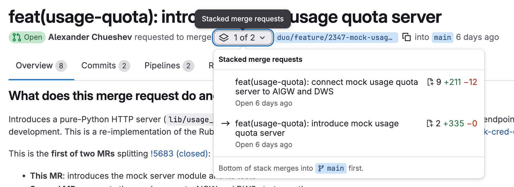



- Tier: Free, Premium, Ultimate
- Offering: GitLab.com, GitLab Self-Managed, GitLab Dedicated





- [Introduced](https://gitlab.com/gitlab-org/gitlab/-/merge_requests/232425) in GitLab 19.1.



When you split a large change into smaller merge requests that build on each other, GitLab groups
them into a stack. Each merge request in a stack targets the source branch of the merge request
below it, so the changes form a chain from the default branch up to the most recent work.

Use stacks to:

- Continue building new changes while earlier merge requests are reviewed.
- Review and merge each change independently, from the bottom of the stack up.
- Keep the relationship between dependent merge requests visible during review.

GitLab detects a stack automatically. A merge request joins a stack when it targets another open
merge request's source branch, or when another open merge request targets its source branch. A
stack can contain up to 10 merge requests.

To create stacked merge requests from the command line, use
[stacked diffs](../stacked_diffs.md) in the GitLab CLI.

## Navigate a stack

When a merge request is part of a stack, the merge request header shows a stack control next to the
source branch. The dropdown list displays the position of the current merge request in the stack,
for example **1 of 2**.

To move between merge requests in a stack:

1. In the top bar, select **Search or go to** and find your project.
1. In the left sidebar, select **Code** > **Merge requests**.
1. Open a merge request that belongs to a stack.
1. In the merge request header, select the dropdown list (for example, **1 of 2**).
1. From the list, select the merge request you want to open.

The list shows every merge request in the stack, ordered from the top of the stack down to the
bottom. For each merge request, the list shows the title, when it was opened, and the number of
changed files, additions, and deletions. An arrow marks the merge request you're viewing.

## Merge a stack

GitLab is designed for you to merge a stack from the bottom up. The merge request at the bottom of
the stack targets the default branch and merges first, even though it's the only merge request that
targets the default branch directly. The merge requests above it merge in sequence afterward.

To merge a stack from the bottom up:

1. Merge the bottom merge request into the default branch.
1. GitLab automatically retargets the next merge request to the default branch.
1. Review and merge the retargeted merge request.
1. Repeat the previous steps until the stack is empty.

For more information about how GitLab updates the target branch, see
[update merge requests when target branch merges](../_index.md#update-merge-requests-when-target-branch-merges).

## Related topics

- [Stacked diffs](../stacked_diffs.md)
- [Merge request workflow](../_index.md)
