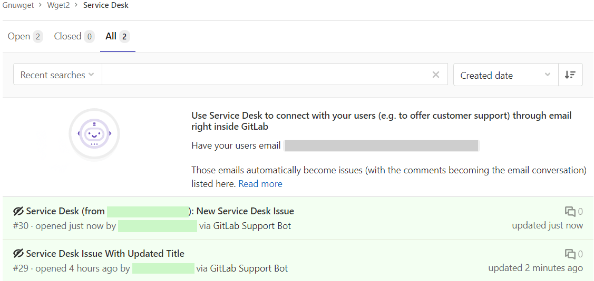



- Tier: Free, Premium, Ultimate
- Offering: GitLab.com, GitLab Self-Managed



You can use Service Desk to [create a ticket](#as-an-end-user-ticket-creator) or [respond to one](#as-a-responder-to-the-ticket).
In these tickets, you can also see our friendly neighborhood [Support Bot](configure.md#support-bot-user).

## View Service Desk email address

To check what the Service Desk email address is for your project:

1. In the top bar, select **Search or go to** and find your project.
1. In the left sidebar, select **Monitor** > **Service Desk**.

The email address is available at the top of the ticket list.

## As an end user (ticket creator)

To create a Service Desk ticket, an end user does not need to know anything about
the GitLab instance. They just send an email to the address they are given, and
receive an email back from GitLab Support Bot, confirming receipt:

```plaintext
Thank you for your support request! We are tracking your request as ticket `#%{issue_iid}`, and will respond as soon as we can.
```

This email also gives the end user an option to unsubscribe.

If they don't choose to unsubscribe, then any new comments added to the ticket
are sent as emails.

Any responses they send by email are displayed in the ticket itself.

For more information, see [external participants](external_participants.md) and the
[headers used for treating email](../../../administration/incoming_email.md#accepted-headers).

### Create a Service Desk ticket in GitLab UI

To create a Service Desk ticket from the UI:

1. [Create an issue](../issues/create_issues.md)
1. Add a comment that contains only the quick action `/convert_to_ticket user@example.com`.
   You should see a comment from the [GitLab Support Bot](configure.md#support-bot-user).
1. Reload the page so the UI reflects the type change.
1. Optional. Add a comment on the ticket to send an initial Service Desk email to the external participant.

<i class="fa-youtube-play" aria-hidden="true"></i>
For an overview, see [create Service Desk tickets in the UI and API (GitLab 16.10)](https://www.youtube.com/watch?v=ibUGNc2wifQ).
<!-- Video published on 2024-03-05 -->

## As a responder to the ticket

For responders to the ticket, everything works just like GitLab issues.
GitLab displays a familiar-looking ticket tracker where responders can see
tickets created through customer support requests, and filter or interact with them.



Messages from the end user are shown as coming from the special
[Support Bot user](../../../subscriptions/manage_seats.md#criteria-for-non-billable-users).
You can read and write comments as you usually do in GitLab:

- The project's visibility (private, internal, public) does not affect Service Desk.
- The path to the project, including its group or namespace, is shown in emails.

### View Service Desk tickets

Prerequisites:

- You must have the Reporter, Developer, Maintainer, or Owner role for the project.

To view Service Desk tickets:

1. In the top bar, select **Search or go to** and find your project.
1. In the left sidebar, select **Monitor** > **Service Desk**.

#### Redesigned ticket list

The Service Desk ticket list more closely matches the regular issue list.
Available features include:

- The same sorting and ordering options [as on the issue list](../issues/sorting_issue_lists.md).
- The same filters, including the [OR operator](#filter-the-list-of-tickets) and [filtering by ticket ID](#filter-tickets-by-id).

There is no longer an option to create a new ticket from the Service Desk ticket list.
This decision better reflects the nature of Service Desk, where new tickets are created by emailing
a dedicated email address.

##### Filter the list of tickets

1. In the top bar, select **Search or go to** and find your project.
1. In the left sidebar, select **Monitor** > **Service Desk**.
1. Above the list of tickets, select **Search or filter results**.
1. In the dropdown list that appears, select the attribute you want to filter by.
1. Select or type the operator to use for filtering the attribute. The following operators are
   available:
   - `=`: Is
   - `!=`: Is not one of
1. Enter the text to filter the attribute by.
   You can filter some attributes by **None** or **Any**.
1. Repeat this process to filter by multiple attributes. Multiple attributes are joined by a logical
   `AND`.

##### Filter with the OR operator

When [filtering with the OR operator](../issues/managing_issues.md#filter-the-list-of-issues) is enabled,
you can use **is one of: `||`**
when you [filter the list of tickets](#filter-the-list-of-tickets) by:

- Assignees
- Labels

`is one of` represents an inclusive OR. For example, if you filter by `Assignee is one of Sidney Jones` and
`Assignee is one of Zhang Wei`, GitLab shows tickets where either `Sidney`, `Zhang`, or both of them are assignees.

##### Filter tickets by ID

1. In the top bar, select **Search or go to** and find your project.
1. In the left sidebar, select **Monitor** > **Service Desk**.
1. In the **Search** box, type the ticket ID. For example, enter filter `#10` to return only ticket 10.

## Email contents and formatting

### Special HTML formatting in HTML emails

HTML emails sent from Service Desk tickets show HTML formatting, such as:

- Tables
- Blockquotes
- Images
- Collapsible sections

### Files attached to comments

If a comment contains any attachments and their total size is less than or equal to 10 MB, these
attachments are sent as part of the email. In other cases, the email contains links to the attachments.

## Convert a regular issue to a Service Desk ticket

Use the quick action `/convert_to_ticket external-ticket-author@example.com` to convert any regular issue
into a Service Desk ticket. This assigns the provided email address as the external author of the ticket
and adds them to the list of external participants. They receive Service Desk emails for any public
comment on the ticket and can reply to these emails. Replies add a new comment on the ticket.

GitLab doesn't send the default [`thank_you` email](configure.md#customize-emails-sent-to-external-participants).
You can add a public comment on the ticket to let the end user know that the ticket has been created.

## Privacy considerations

Service Desk tickets are [confidential](../issues/confidential_issues.md), so they are
only visible to project members. The project owner can
[make a ticket public](../issues/confidential_issues.md#in-an-existing-issue).
When a Service Desk ticket becomes public, the ticket creator's and participants' email addresses are
visible to signed-in users with the Reporter, Developer, Maintainer, or Owner role for the project.

Anyone in your project can use the Service Desk email address to create a ticket in this project, **regardless
of their role** in the project.

The unique internal email address is visible to project members at least
the Planner role in your GitLab instance.
An external user (ticket creator) cannot see the internal email address
displayed in the information note.

### Moving a Service Desk ticket

You can move a Service Desk ticket the same way you
[move a regular issue](../issues/managing_issues.md#move-an-issue) in GitLab.

If a Service Desk ticket is moved to a different project with Service Desk enabled,
the customer who created the ticket continues to receive email notifications.
Because a moved ticket is first closed, then copied, the customer is considered to be a participant
in both tickets. They continue to receive any notifications in the old ticket and the new one.
